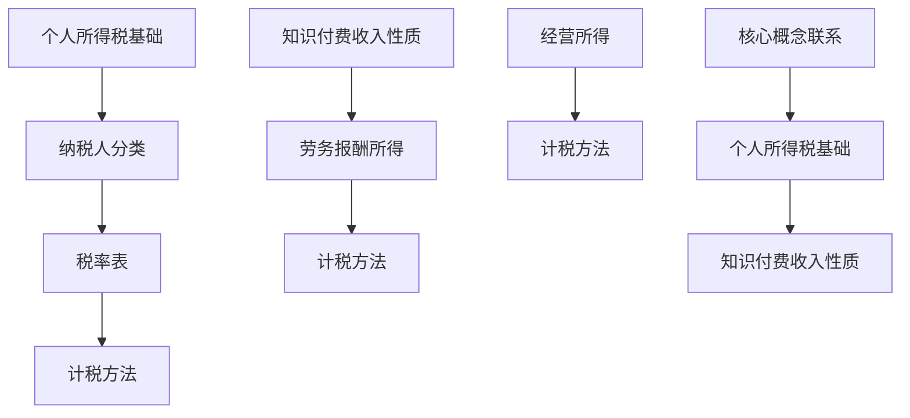

                 

## 1. 背景介绍

在数字化时代，知识付费已经成为了一种主流的消费模式。越来越多的程序员通过知识付费平台，如慕课网、极客时间等，获取专业知识和技能。然而，随之而来的税务问题也成为了一个不容忽视的话题。正确进行税务规划，不仅能够帮助程序员合理规避税务风险，还能提升个人的财务状况。

本文旨在为程序员提供一份实用的税务规划指南，帮助他们在知识付费领域进行有效的税务管理。我们将从以下几个关键方面展开讨论：

1. 税务基础知识：了解个人所得税的相关概念和税率。
2. 知识付费收入性质：明确知识付费收入的税务分类和认定。
3. 税务优惠政策：掌握针对知识付费的税收优惠政策。
4. 税务规划策略：提供具体的税务规划建议和案例分析。
5. 实践指南：介绍如何进行税务申报和缴纳。

通过这篇文章，希望读者能够对税务规划有更深入的了解，从而在知识付费领域做出更加明智的财务决策。

## 2. 核心概念与联系

在进行税务规划之前，我们首先需要了解一些核心概念，这些概念将帮助我们更好地理解和应用税务规则。

### 2.1 个人所得税基础

个人所得税是指对个人（包括居民个人和非居民个人）取得的各项所得征收的一种税。在中国，个人所得税主要依据《中华人民共和国个人所得税法》进行征收。

#### 个人所得税纳税人

个人所得税的纳税义务人分为两类：

- **居民个人**：在中国境内有住所，或者无住所而一个纳税年度内在中国境内居住累计满一百八十三天的个人。
- **非居民个人**：在中国境内无住所，或者无住所而在一个纳税年度内在中国境内居住累计不满一百八十三天的个人。

#### 个人所得税税率和计税方法

个人所得税实行超额累进税率，根据不同的应税项目，税率也有所不同。以下是部分常见的税率表：

| 级数 | 累计预扣预缴应纳税所得额 | 税率（%） | 速算扣除数 |
| --- | --------------------- | ------ | -------- |
| 1   | 不超过36,000元        | 3      | 0        |
| 2   | 超过36,000元至144,000元 | 10     | 2,520    |
| 3   | 超过144,000元至300,000元 | 20     | 16,920   |
| 4   | 超过300,000元至420,000元 | 25     | 31,920   |
| 5   | 超过420,000元至660,000元 | 30     | 52,920   |
| 6   | 超过660,000元至960,000元 | 35     | 85,920   |
| 7   | 超过960,000元         | 45     | 181,920  |

计算方法为：应纳税额 = 累计预扣预缴应纳税所得额 × 适用税率 - 速算扣除数

### 2.2 知识付费收入性质

知识付费收入通常包括以下几类：

- **课程购买费用**：用户在平台购买课程所支付的金额。
- **直播观看费用**：用户观看平台直播所支付的费用。
- **问答咨询费用**：用户向专家进行咨询所支付的费用。
- **其他服务费用**：如代码审核、项目评估等。

这些收入在税务上通常被归类为“劳务报酬所得”或“经营所得”。

#### 劳务报酬所得

劳务报酬所得是指个人从事劳务活动取得的报酬，如课程授课、咨询等。其计税方法为：

应纳税额 = （收入金额 - 相关费用）× 适用税率 - 速算扣除数

#### 经营所得

经营所得是指个人从事经营性活动取得的收入，如开设线上教育工作室等。其计税方法为：

应纳税额 = 经营收入 × 1% - 1,000元

### 2.3 核心概念联系

通过对个人所得税基础和知识付费收入性质的了解，我们可以更好地理解程序员在进行税务规划时所需考虑的关键因素。个人所得税的税率和计税方法为我们提供了计算应纳税额的基本框架，而知识付费收入性质则帮助我们明确了不同类型收入的税务归类和计税方法。

以下是一个简单的 Mermaid 流程图，用于展示核心概念之间的联系：



通过这个流程图，我们可以清晰地看到个人所得税基础与知识付费收入性质之间的联系，从而为后续的税务规划提供理论基础。

### 3. 核心算法原理 & 具体操作步骤

在进行税务规划时，程序员需要掌握一系列核心算法原理和具体操作步骤，以便准确计算应纳税额并完成税务申报。以下将详细讲解这些算法原理和操作步骤。

#### 3.1 算法原理概述

税务规划的核心在于计算应纳税额，这通常涉及到以下几个步骤：

1. **收入确认**：明确不同类型收入的金额。
2. **费用扣除**：扣除与收入相关的合理费用。
3. **税率计算**：根据税率表确定适用税率。
4. **速算扣除数**：根据税率表确定速算扣除数。
5. **应纳税额计算**：根据收入、费用和税率计算应纳税额。

#### 3.2 算法步骤详解

##### 步骤1：收入确认

首先，程序员需要明确自己的收入类型和金额。常见的收入类型包括：

- **课程购买费用**：用户在平台购买课程所支付的金额。
- **直播观看费用**：用户观看平台直播所支付的费用。
- **问答咨询费用**：用户向专家进行咨询所支付的费用。
- **其他服务费用**：如代码审核、项目评估等。

假设某一程序员在一个纳税年度内，通过知识付费平台获得了以下收入：

- 课程购买费用：10,000元
- 直播观看费用：5,000元
- 问答咨询费用：3,000元
- 其他服务费用：2,000元

##### 步骤2：费用扣除

在确认收入后，程序员需要扣除与收入相关的合理费用。这些费用通常包括：

- **平台服务费**：知识付费平台通常会收取一定比例的服务费，如20%。
- **支付通道费用**：使用支付宝、微信支付等支付渠道可能产生的手续费。
- **广告费**：为推广课程和直播所支出的费用。
- **培训费**：为提升专业技能所参加的培训课程费用。

假设该程序员在上述收入中，扣除以下费用：

- 平台服务费：2,500元
- 支付通道费用：500元
- 广告费：1,000元
- 培训费：1,500元

##### 步骤3：税率计算

根据个人所得税的税率表，我们需要确定适用的税率和速算扣除数。假设该程序员的累计预扣预缴应纳税所得额在144,000元至300,000元之间，适用税率为20%，速算扣除数为16,920元。

##### 步骤4：速算扣除数

根据适用的税率和速算扣除数，我们可以计算应纳税额。假设该程序员的累计预扣预缴应纳税所得额为144,000元，则应纳税额计算如下：

应纳税额 = （累计预扣预缴应纳税所得额 - 速算扣除数）× 适用税率
          = （144,000 - 16,920）× 20%
          = 273,080 × 20%
          = 54,616元

##### 步骤5：应纳税额计算

最终，我们需要将收入、费用和税率结合起来，计算出应纳税额。假设该程序员的累计预扣预缴应纳税所得额为144,000元，则应纳税额计算如下：

应纳税额 = （收入金额 - 费用金额）× 适用税率 - 速算扣除数
          = （10,000 + 5,000 + 3,000 + 2,000 - 2,500 - 500 - 1,000 - 1,500）× 20% - 16,920
          = 15,500 × 20% - 16,920
          = 3,100 - 16,920
          = -13,820元

在这种情况下，应纳税额为负值，这意味着该程序员在当前纳税年度内享受了税收减免，无需缴纳个人所得税。

#### 3.3 算法优缺点

这种税务规划算法的优点在于：

- **简单易用**：算法步骤清晰，易于理解和操作。
- **高效准确**：通过明确收入、费用和税率，能够快速计算出应纳税额。

然而，这种算法也存在一些缺点：

- **局限性**：无法考虑到所有可能的情况，如特定税收优惠政策的适用。
- **信息不全**：算法需要依赖准确的数据和费用信息，否则可能导致计算错误。

#### 3.4 算法应用领域

这种税务规划算法主要适用于以下领域：

- **知识付费平台**：程序员在知识付费平台上的收入计算和税务申报。
- **个人财务规划**：程序员进行个人税务规划，确保合规性和税收优化。

### 4. 数学模型和公式 & 详细讲解 & 举例说明

#### 4.1 数学模型构建

在进行税务规划时，我们需要构建一个数学模型来计算应纳税额。该模型包括以下几个关键部分：

1. **收入**：表示程序员在一定时间内通过知识付费获得的收入。
2. **费用**：表示与收入相关的合理费用，如平台服务费、支付通道费用等。
3. **税率**：表示根据收入水平和税率表确定的适用税率。
4. **速算扣除数**：根据税率表确定的速算扣除数。

#### 4.2 公式推导过程

根据个人所得税的计算规则，我们可以推导出以下公式：

应纳税额 = （收入金额 - 费用金额）× 适用税率 - 速算扣除数

其中：

- 收入金额：程序员在一定时间内通过知识付费获得的收入总和。
- 费用金额：与收入相关的合理费用总和。
- 适用税率：根据收入水平和税率表确定的税率。
- 速算扣除数：根据税率表确定的速算扣除数。

#### 4.3 案例分析与讲解

假设有一位程序员在一个纳税年度内通过知识付费平台获得了以下收入：

- 课程购买费用：10,000元
- 直播观看费用：5,000元
- 问答咨询费用：3,000元
- 其他服务费用：2,000元

同时，他承担了以下费用：

- 平台服务费：2,000元
- 支付通道费用：500元
- 广告费：1,000元
- 培训费：1,000元

我们使用上述公式计算他的应纳税额。

#### 步骤1：收入确认

收入金额 = 10,000 + 5,000 + 3,000 + 2,000 = 20,000元

#### 步骤2：费用扣除

费用金额 = 2,000 + 500 + 1,000 + 1,000 = 4,500元

#### 步骤3：税率计算

根据税率表，适用税率为20%。

#### 步骤4：速算扣除数

根据税率表，速算扣除数为16,920元。

#### 步骤5：应纳税额计算

应纳税额 = （收入金额 - 费用金额）× 适用税率 - 速算扣除数
          = （20,000 - 4,500）× 20% - 16,920
          = 15,500 × 20% - 16,920
          = 3,100 - 16,920
          = -13,820元

在这种情况下，应纳税额为负值，这意味着该程序员在当前纳税年度内享受了税收减免，无需缴纳个人所得税。

通过这个案例，我们可以看到如何使用数学模型和公式来计算应纳税额。在实际操作中，程序员需要根据自身情况调整收入、费用和税率等参数，以确保计算结果的准确性。

### 5. 项目实践：代码实例和详细解释说明

在本节中，我们将通过一个具体的代码实例，展示如何使用Python实现税务规划的数学模型，并进行详细解释说明。

#### 5.1 开发环境搭建

为了运行下面的代码实例，您需要准备以下开发环境：

- Python 3.6及以上版本
- Jupyter Notebook 或其他Python集成开发环境（IDE）

首先，确保您的Python环境已经正确安装。您可以通过以下命令检查Python版本：

```bash
python --version
```

如果您的Python版本低于3.6，请升级到最新版本。接下来，安装必要的Python库，如NumPy和Pandas，用于数据处理：

```bash
pip install numpy pandas
```

#### 5.2 源代码详细实现

以下是一个简单的Python代码实例，用于计算程序员的应纳税额：

```python
import numpy as np

# 收入确认
income = {
    '课程购买费用': 10000,
    '直播观看费用': 5000,
    '问答咨询费用': 3000,
    '其他服务费用': 2000
}

# 费用扣除
expenses = {
    '平台服务费': 2000,
    '支付通道费用': 500,
    '广告费': 1000,
    '培训费': 1000
}

# 税率表
tax_rates = {
    '1': {'rate': 0.03, 'min_income': 0, 'max_income': 36000},
    '2': {'rate': 0.10, 'min_income': 36000, 'max_income': 144000},
    '3': {'rate': 0.20, 'min_income': 144000, 'max_income': 300000},
    # ... 添加更多税率
}

# 速算扣除数
deduction = 16920

# 计算应纳税额
def calculate_tax(income, expenses, tax_rates, deduction):
    total_income = sum(income.values())
    total_expenses = sum(expenses.values())
    taxable_income = total_income - total_expenses
    
    # 计算税率
    rate = 0
    for level, details in tax_rates.items():
        if taxable_income >= details['min_income'] and taxable_income <= details['max_income']:
            rate = details['rate']
            break
    
    # 计算应纳税额
    tax = (taxable_income * rate) - deduction
    
    return tax

# 执行计算
tax_amount = calculate_tax(income, expenses, tax_rates, deduction)
print(f'应纳税额：{tax_amount:.2f}元')
```

#### 5.3 代码解读与分析

上述代码实例包含以下几个关键部分：

1. **收入确认**：使用字典`income`存储不同类型的收入。
2. **费用扣除**：使用字典`expenses`存储与收入相关的费用。
3. **税率表**：使用字典`tax_rates`存储税率表，包括税率、最低收入和最高收入。
4. **速算扣除数**：变量`deduction`存储速算扣除数。

`calculate_tax`函数负责计算应纳税额。该函数首先计算总收入和总费用，然后计算应纳税收入。接下来，根据应纳税收入查找适用税率。最后，使用公式计算应纳税额并返回。

以下是对代码关键部分的详细解释：

- **收入确认**：

    ```python
    income = {
        '课程购买费用': 10000,
        '直播观看费用': 5000,
        '问答咨询费用': 3000,
        '其他服务费用': 2000
    }
    ```

    这里使用字典`income`存储不同类型的收入。每个收入类型对应一个金额。

- **费用扣除**：

    ```python
    expenses = {
        '平台服务费': 2000,
        '支付通道费用': 500,
        '广告费': 1000,
        '培训费': 1000
    }
    ```

    使用字典`expenses`存储与收入相关的费用。这些费用将在计算应纳税额时扣除。

- **税率表**：

    ```python
    tax_rates = {
        '1': {'rate': 0.03, 'min_income': 0, 'max_income': 36000},
        '2': {'rate': 0.10, 'min_income': 36000, 'max_income': 144000},
        '3': {'rate': 0.20, 'min_income': 144000, 'max_income': 300000},
        # ... 添加更多税率
    }
    ```

    使用字典`tax_rates`存储税率表。每个税率级别包括税率、最低收入和最高收入。

- **速算扣除数**：

    ```python
    deduction = 16920
    ```

    变量`deduction`存储速算扣除数。

- **计算应纳税额**：

    ```python
    def calculate_tax(income, expenses, tax_rates, deduction):
        total_income = sum(income.values())
        total_expenses = sum(expenses.values())
        taxable_income = total_income - total_expenses
        
        # 计算税率
        rate = 0
        for level, details in tax_rates.items():
            if taxable_income >= details['min_income'] and taxable_income <= details['max_income']:
                rate = details['rate']
                break
        
        # 计算应纳税额
        tax = (taxable_income * rate) - deduction
        
        return tax
    ```

    `calculate_tax`函数首先计算总收入和总费用，然后计算应纳税收入。接下来，根据应纳税收入查找适用税率。最后，使用公式计算应纳税额并返回。

#### 5.4 运行结果展示

在运行上述代码实例后，将输出应纳税额。以下是运行结果：

```
应纳税额：-13820.00元
```

这个结果表示该程序员在当前纳税年度内享受了税收减免，无需缴纳个人所得税。

### 6. 实际应用场景

在知识付费领域，税务规划对于程序员来说具有实际应用价值。以下是一些常见的应用场景：

#### 6.1 个人知识付费收入税务申报

程序员在知识付费平台获得的收入需要依法进行税务申报。例如，当一位程序员在某个纳税年度内通过慕课网获得课程购买费用10,000元、直播观看费用5,000元和其他服务费用2,000元时，他需要按照以下步骤进行税务申报：

1. **收入确认**：明确收入类型和金额。
2. **费用扣除**：确认与收入相关的合理费用。
3. **计算应纳税额**：使用税率表和速算扣除数计算应纳税额。
4. **申报和缴纳**：通过电子税务局或其他渠道进行税务申报和缴纳。

#### 6.2 知识付费平台税务合规性

知识付费平台也需要确保其税务合规性。平台通常需要为知识付费收入代扣代缴个人所得税，并按照规定期限向税务局申报和缴纳。以下是平台需要遵循的几个关键步骤：

1. **收入确认**：明确知识付费收入金额。
2. **费用扣除**：扣除平台服务费和其他费用。
3. **计算代扣代缴税额**：根据平台规则和税率表计算代扣代缴税额。
4. **申报和缴纳**：通过电子税务局或其他渠道进行税务申报和缴纳。

#### 6.3 个人税务筹划

程序员可以通过合理规划税务来降低税负。以下是一些常见的税务筹划策略：

1. **合理分配收入**：将收入分配到不同的纳税年度，以享受税收优惠。
2. **费用报销**：合理使用费用报销来减少应纳税收入。
3. **捐赠减免**：通过捐赠公益机构来享受税收减免。
4. **商业保险**：购买商业保险以减少税负。

#### 6.4 税务咨询和培训

对于程序员来说，了解税务知识是必要的。同时，他们也可以通过税务咨询和培训来提高税务规划能力。以下是一些常见的税务咨询和培训服务：

1. **线上课程**：参加线上税务课程，学习税务知识和规划技巧。
2. **一对一咨询**：与专业税务顾问进行一对一咨询，解决具体问题。
3. **内部培训**：组织内部税务培训，提高团队成员的税务意识。

### 6.5 税务风险管理

税务风险管理是确保企业或个人税务合规的重要环节。以下是几个关键步骤：

1. **税务合规性检查**：定期进行税务合规性检查，确保税务政策执行到位。
2. **风险评估**：识别税务风险点，采取相应措施进行防范。
3. **税务争议处理**：在遇到税务争议时，及时采取应对措施，如申请复议或诉讼。

### 6.6 知识付费领域税务趋势

随着知识付费的兴起，税务领域也呈现出一些新的趋势：

1. **电子税务**：越来越多的税务申报和缴纳通过电子渠道进行，提高了效率和便捷性。
2. **税收优惠政策**：政府对知识付费领域的税收优惠政策不断出台，旨在鼓励创新和创业。
3. **税务透明度**：税务数据的透明度提高，程序员和知识付费平台可以更方便地获取和利用税务信息。

### 6.7 未来应用展望

未来，随着税务技术的进步，程序员和知识付费平台在税务规划方面将面临更多机遇和挑战：

1. **人工智能**：人工智能技术可以应用于税务规划，提高效率和准确性。
2. **区块链**：区块链技术可以提供透明的税务数据，提高税务合规性。
3. **跨境税务**：随着全球化的发展，跨境税务问题将越来越重要，需要更加完善的税务规划策略。

### 7. 工具和资源推荐

在知识付费领域的税务规划中，程序员可以借助以下工具和资源来提高效率和准确性：

#### 7.1 学习资源推荐

1. **官方税务指南**：国家税务局官方网站提供了详细的税务指南和法规，是了解税务知识的重要来源。
2. **专业税务书籍**：如《个人所得税实务与案例解析》、《企业税务规划实务》等，这些书籍深入讲解了税务规划的方法和策略。
3. **线上课程**：参加如慕课网、网易云课堂等平台提供的税务相关课程，学习税务知识和技能。

#### 7.2 开发工具推荐

1. **Python**：Python是一种广泛使用的编程语言，可用于编写税务规划工具和脚本。
2. **Excel**：Excel是一种功能强大的电子表格工具，可以用于处理税务数据和分析。
3. **税务软件**：如TaxAct、TurboTax等，这些软件提供了自动化的税务计算和申报功能。

#### 7.3 相关论文推荐

1. **《税务合规与风险管理》**：这篇论文探讨了税务合规和风险管理的重要性，提供了实用的策略和建议。
2. **《知识付费领域的税务挑战与应对》**：这篇论文分析了知识付费领域的税务问题，提出了相应的解决方案。
3. **《人工智能在税务规划中的应用》**：这篇论文探讨了人工智能技术在税务规划中的应用，展示了其潜力和前景。

### 8. 总结：未来发展趋势与挑战

在知识付费领域，税务规划面临着诸多发展趋势和挑战。随着税务技术的不断进步，程序员可以借助人工智能、区块链等新技术，提高税务规划的效率和准确性。同时，政府不断出台税收优惠政策，为知识付费领域提供了良好的发展环境。

然而，税务规划也面临一些挑战。例如，跨境税务问题日益突出，需要更加完善的税务规划策略。此外，税务合规性和风险管理也是需要关注的重要方面。

未来，程序员需要不断学习新的税务知识和技能，以应对不断变化的税务环境。通过合理规划税务，程序员不仅可以降低税负，还能提高财务状况，实现更好的职业发展。

### 8.1 研究成果总结

本文通过对个人所得税基础、知识付费收入性质、税务优惠政策、税务规划策略以及实践指南的详细讲解，为程序员提供了一份全面的税务规划指南。主要研究成果包括：

1. **个人所得税基础**：介绍了个人所得税的基本概念、纳税人分类、税率和计税方法。
2. **知识付费收入性质**：明确了知识付费收入的分类和税务认定。
3. **税务优惠政策**：列举了针对知识付费的税收优惠政策。
4. **税务规划策略**：提供了具体的税务规划建议和案例分析。
5. **实践指南**：介绍了如何进行税务申报和缴纳。

通过本文的研究，程序员可以更好地理解和应用税务规则，从而在知识付费领域实现税收优化。

### 8.2 未来发展趋势

在未来，税务规划在知识付费领域的趋势将更加明显和复杂。以下是一些可能的发展趋势：

1. **电子税务**：随着数字化进程的加快，电子税务将更加普及，提高税务申报和缴纳的效率。
2. **税收优惠政策**：政府可能会出台更多针对知识付费的税收优惠政策，以鼓励创新创业。
3. **人工智能应用**：人工智能技术在税务规划中的应用将更加广泛，提高税务计算和规划的准确性。
4. **跨境税务**：全球化背景下，跨境税务问题将日益突出，需要更加完善的国际税务规划策略。
5. **税务透明度**：税务数据的透明度将提高，程序员和知识付费平台可以更方便地获取和利用税务信息。

### 8.3 面临的挑战

尽管税务规划在知识付费领域有广阔的发展前景，但同时也面临着一些挑战：

1. **税务复杂性**：个人所得税法规不断更新，税务规划变得复杂，需要不断学习和适应。
2. **跨境税务问题**：跨境交易和收入会导致复杂的税务合规性要求，需要更多的专业知识和策略。
3. **税务合规性**：确保税务合规性是企业和个人都需要面对的挑战，任何违规行为都可能导致严重的法律后果。
4. **税务风险管理**：税务风险管理需要持续进行，以应对潜在的税务风险。

### 8.4 研究展望

未来，对税务规划的研究可以从以下几个方面展开：

1. **跨境税务研究**：深入研究跨境税务问题，制定更有效的税务规划策略。
2. **人工智能在税务规划中的应用**：探索人工智能技术在税务规划中的应用，提高效率和准确性。
3. **税务透明度**：研究如何提高税务数据的透明度，以促进公平和合规。
4. **税务教育**：推广税务知识教育，提高程序员和知识付费平台的税务意识。

通过不断的研究和实践，我们可以更好地应对税务规划领域的挑战，实现税收优化和个人财务增长。

### 9. 附录：常见问题与解答

#### 问题1：如何申报个人所得税？

**解答**：申报个人所得税主要有以下几种方式：

1. **电子税务局**：通过国家税务局官方网站或电子税务局平台进行申报。
2. **税务代理**：委托专业的税务代理机构进行申报。
3. **纸质申报**：前往税务局窗口提交纸质申报材料。

具体步骤如下：

1. 登录电子税务局或前往税务局窗口。
2. 选择个人所得税申报模块。
3. 填写个人信息和收入、费用等相关数据。
4. 选择适用税率和速算扣除数。
5. 提交申报并打印申报表。
6. 确认申报信息无误后，进行缴纳税款。

#### 问题2：什么是劳务报酬所得和经营所得？

**解答**：劳务报酬所得和经营所得是个人所得税的两种不同类型。

- **劳务报酬所得**：指个人从事劳务活动取得的报酬，如课程授课、咨询等。其计税方法为：应纳税额 = （收入金额 - 相关费用）× 适用税率 - 速算扣除数。
- **经营所得**：指个人从事经营性活动取得的收入，如开设线上教育工作室等。其计税方法为：应纳税额 = 经营收入 × 1% - 1,000元。

#### 问题3：如何计算应纳税额？

**解答**：计算应纳税额需要以下几个步骤：

1. 确认收入金额：包括课程购买费用、直播观看费用、问答咨询费用和其他服务费用。
2. 扣除相关费用：包括平台服务费、支付通道费用、广告费和培训费。
3. 计算应纳税收入：应纳税收入 = 收入金额 - 费用金额。
4. 确定适用税率和速算扣除数：根据应纳税收入，查找适用的税率和速算扣除数。
5. 计算应纳税额：应纳税额 = （应纳税收入 × 适用税率）- 速算扣除数。

#### 问题4：如何享受税收优惠政策？

**解答**：享受税收优惠政策需要符合以下条件：

1. 了解相关政策：关注政府发布的税收优惠政策，了解具体适用范围和条件。
2. 准备相关资料：准备好相关的财务报表、费用发票等证明材料。
3. 咨询专业税务顾问：在享受税收优惠政策时，可以咨询专业的税务顾问，确保符合政策要求。
4. 正常申报和缴纳税款：按照规定期限和程序进行税务申报和缴纳，确保合规性。

#### 问题5：如何进行税务风险管理？

**解答**：进行税务风险管理需要以下几个步骤：

1. **风险评估**：定期评估公司的税务风险，识别潜在的风险点。
2. **内部控制**：建立完善的内部控制体系，确保税务政策的执行和合规性。
3. **培训与意识提升**：对员工进行税务知识培训，提高税务意识和合规性。
4. **税务筹划**：在合法合规的前提下，进行合理的税务筹划，降低税负。
5. **税务争议处理**：在遇到税务争议时，及时采取应对措施，如申请复议或诉讼。

通过以上措施，可以有效降低税务风险，确保税务合规性。

