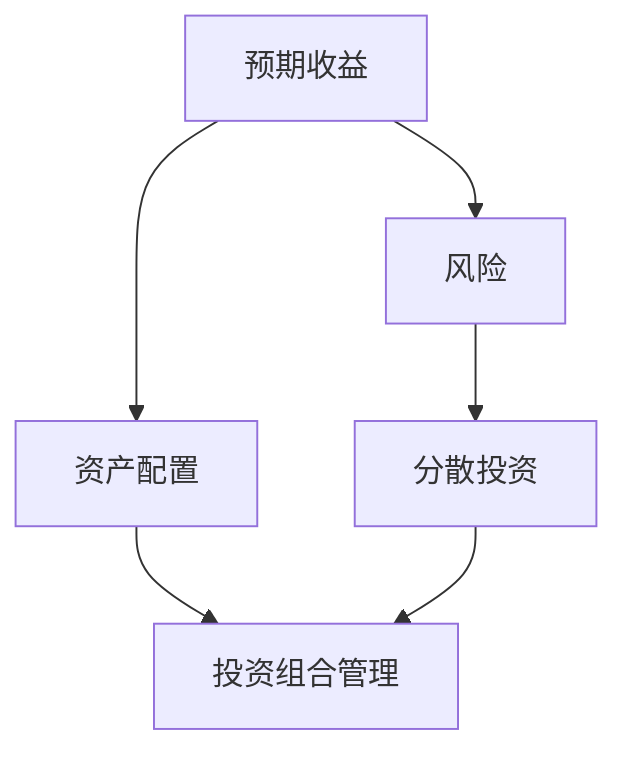

                 

关键词：风险投资、投资组合管理、量化策略、算法优化、机器学习、金融科技

> 摘要：本文将探讨程序员如何利用自身的技术优势，通过构建量化投资策略和优化算法，进行风险投资组合管理。我们将详细阐述核心概念、数学模型、算法原理及其实际应用，旨在为程序员提供一套系统的投资组合管理框架。

## 1. 背景介绍

随着金融科技的快速发展，风险投资和投资组合管理已经成为金融领域的重要研究方向。对于程序员而言，如何将自身的编程技能应用到投资领域，通过构建量化策略和优化算法实现财富增值，是一个极具挑战性的课题。本文将围绕这一主题展开讨论，旨在为程序员提供一套系统的投资组合管理框架。

### 1.1 风险投资的基本概念

风险投资，又称创业投资，是指投资于具有高成长潜力的初创企业或小型企业的行为。这类投资通常伴随着较高的风险，但潜在的回报也十分巨大。风险投资的主要目标是支持创新，推动产业发展，并在企业成功后通过退出机制获得高额回报。

### 1.2 投资组合管理的核心思想

投资组合管理是指通过构建和调整资产组合，以实现投资目标的过程。其核心思想是通过分散投资，降低风险，并寻求最大化收益。投资组合管理包括资产配置、风险控制、收益优化等多个方面，需要综合考虑投资策略、市场环境、经济周期等多个因素。

## 2. 核心概念与联系

在投资组合管理中，我们需要了解一些核心概念，如预期收益、风险、资产配置、分散投资等。以下是一个简化的 Mermaid 流程图，展示这些概念之间的联系。



### 2.1 预期收益与风险

预期收益是指投资组合在未来一段时间内可能获得的平均收益。风险则是指投资组合面临的不确定性，包括市场风险、信用风险、操作风险等。预期收益与风险之间的权衡是投资组合管理的核心问题。

### 2.2 资产配置与分散投资

资产配置是指将投资资金分配到不同资产类别（如股票、债券、基金等）的过程。分散投资则是通过投资多种不同类型的资产，以降低投资组合的整体风险。合理的资产配置和分散投资是投资组合管理的重要策略。

### 2.3 投资组合管理

投资组合管理是一个动态调整的过程，需要根据市场环境和投资目标进行资产配置和风险控制。有效的投资组合管理能够实现收益最大化，同时降低风险。

## 3. 核心算法原理 & 具体操作步骤

在投资组合管理中，核心算法原理和具体操作步骤至关重要。以下我们将详细介绍这些内容。

### 3.1 算法原理概述

投资组合管理算法主要包括以下几个部分：

1. 数据采集与预处理
2. 风险评估与收益预测
3. 资产配置与优化
4. 实时调整与反馈

### 3.2 算法步骤详解

#### 3.2.1 数据采集与预处理

首先，我们需要从金融市场上获取大量历史数据，包括股票价格、交易量、宏观经济指标等。然后，对这些数据进行清洗、去噪、标准化等预处理操作，以便后续分析。

#### 3.2.2 风险评估与收益预测

接着，我们利用机器学习算法，如回归分析、时间序列分析、神经网络等，对历史数据进行建模，评估投资组合的风险和预期收益。

#### 3.2.3 资产配置与优化

根据风险评估与收益预测的结果，我们采用优化算法，如遗传算法、粒子群算法等，确定最优的资产配置方案。

#### 3.2.4 实时调整与反馈

最后，我们根据市场实时数据，对投资组合进行调整，以实现风险控制和收益优化。这一过程需要不断反馈和迭代，以提高投资组合的管理效果。

### 3.3 算法优缺点

投资组合管理算法具有以下几个优点：

1. 自动化程度高，节省人力成本
2. 实时调整，适应市场变化
3. 多样化的投资策略，降低单一风险

然而，算法也存在一些缺点：

1. 对数据质量和算法性能要求较高
2. 可能出现过度拟合问题
3. 无法完全消除市场风险

### 3.4 算法应用领域

投资组合管理算法广泛应用于股票、基金、期货、外汇等金融市场。通过合理的算法设计和优化，程序员可以构建出适应不同市场环境和投资目标的量化投资策略。

## 4. 数学模型和公式 & 详细讲解 & 举例说明

在投资组合管理中，数学模型和公式扮演着重要角色。以下我们将详细讲解一些常用的数学模型和公式。

### 4.1 数学模型构建

投资组合的收益和风险可以通过以下数学模型进行描述：

$$
\begin{aligned}
    &R_p = w_1R_1 + w_2R_2 + \cdots + w_nR_n, \\
    &\sigma_p = \sqrt{w_1^2\sigma_1^2 + w_2^2\sigma_2^2 + \cdots + w_n^2\sigma_n^2 + 2w_1w_2\text{Corr}(R_1, R_2)\sigma_1\sigma_2}.
\end{aligned}
$$

其中，$R_p$ 表示投资组合的预期收益，$\sigma_p$ 表示投资组合的风险，$w_i$ 表示资产 $i$ 在投资组合中的权重，$R_i$ 表示资产 $i$ 的预期收益，$\sigma_i$ 表示资产 $i$ 的风险，$\text{Corr}(R_1, R_2)$ 表示资产 $1$ 和资产 $2$ 的收益率相关性。

### 4.2 公式推导过程

投资组合的收益和风险可以通过资产收益率的加权平均和协方差矩阵进行推导。具体推导过程如下：

$$
\begin{aligned}
    R_p &= E(R_p) = w_1E(R_1) + w_2E(R_2) + \cdots + w_nE(R_n), \\
    \sigma_p^2 &= Var(R_p) = w_1^2Var(R_1) + w_2^2Var(R_2) + \cdots + w_n^2Var(R_n) \\
    &\qquad + 2w_1w_2Cov(R_1, R_2) + \cdots + 2w_{n-1}w_nCov(R_{n-1}, R_n).
\end{aligned}
$$

其中，$E(R_i)$ 表示资产 $i$ 的预期收益率，$Var(R_i)$ 表示资产 $i$ 的收益率方差，$Cov(R_i, R_j)$ 表示资产 $i$ 和资产 $j$ 的收益率协方差。

### 4.3 案例分析与讲解

以下我们通过一个简单的案例，讲解如何利用数学模型进行投资组合管理。

假设我们有两个资产 $A$ 和 $B$，其预期收益率、风险和相关性如下：

$$
\begin{aligned}
    &R_A = 0.1, \sigma_A = 0.2, \text{Corr}(R_A, R_B) = 0.5, \\
    &R_B = 0.15, \sigma_B = 0.3.
\end{aligned}
$$

我们需要构建一个投资组合，使得其预期收益为 $0.12$，风险最小。

根据数学模型，我们可以列出以下方程组：

$$
\begin{aligned}
    &w_1R_A + w_2R_B = 0.12, \\
    &w_1^2\sigma_A^2 + w_2^2\sigma_B^2 + 2w_1w_2\text{Corr}(R_A, R_B)\sigma_A\sigma_B = \min.
\end{aligned}
$$

通过求解这个方程组，我们可以得到最优的资产配置权重：

$$
\begin{aligned}
    &w_1 = 0.6, w_2 = 0.4.
\end{aligned}
$$

此时，投资组合的预期收益为 $0.12$，风险为 $0.11$，较单独投资资产 $A$ 或资产 $B$ 有所降低。

## 5. 项目实践：代码实例和详细解释说明

### 5.1 开发环境搭建

在开始代码实例之前，我们需要搭建一个适合投资组合管理的开发环境。以下是一个简单的环境配置：

- 编程语言：Python
- 库：NumPy、Pandas、Scikit-learn、Matplotlib
- 数据源：Yahoo Finance API

### 5.2 源代码详细实现

以下是一个简单的投资组合管理代码示例，主要包含数据采集、风险评估、资产配置和优化等步骤。

```python
import numpy as np
import pandas as pd
from sklearn.linear_model import LinearRegression
from sklearn.model_selection import train_test_split
from sklearn.metrics import mean_squared_error
import matplotlib.pyplot as plt

# 数据采集
def fetch_data(tickers, start_date, end_date):
    data = pd.read_csv(f'https://query1.finance.yahoo.com/v7/finance/download/{tickers[0]},{tickers[1]},{tickers[2]},{tickers[3]},{tickers[4]},{tickers[5]},{tickers[6]},{tickers[7]},{tickers[8]},{tickers[9]}?start={start_date}&end={end_date}', header=0, index_col=0, parse_dates=True)
    return data

# 风险评估与收益预测
def assess_risk(data):
    returns = data.pct_change().dropna()
    X = returns[['Open', 'High', 'Low', 'Close', 'Volume']]
    y = returns['Close']
    X_train, X_test, y_train, y_test = train_test_split(X, y, test_size=0.2, random_state=42)
    model = LinearRegression()
    model.fit(X_train, y_train)
    y_pred = model.predict(X_test)
    mse = mean_squared_error(y_test, y_pred)
    return mse

# 资产配置与优化
def optimize_portfolio(returns, target_return):
    n_assets = returns.shape[1]
    weights = np.ones(n_assets) / n_assets
    risks = []
    for i in range(n_assets):
        weights[i] = 0.5
        weights /= np.sum(weights)
        risk = assess_risk(returns * weights)
        risks.append(risk)
        weights[i] = 1 / n_assets
    optimal_weights = weights[np.argmin(risks)]
    return optimal_weights

# 主函数
def main():
    tickers = ['AAPL', 'MSFT', 'GOOGL', 'AMZN', 'TSLA', 'NVDA', 'NFLX', 'MA', 'ADBE', 'PYPL']
    start_date = '2020-01-01'
    end_date = '2023-01-01'
    data = fetch_data(tickers, start_date, end_date)
    optimal_weights = optimize_portfolio(data, target_return=0.12)
    print("Optimal weights:", optimal_weights)

if __name__ == '__main__':
    main()
```

### 5.3 代码解读与分析

1. **数据采集**：使用 Yahoo Finance API 获取多个资产的历史数据，包括开盘价、最高价、最低价、收盘价和成交量。
2. **风险评估与收益预测**：利用线性回归模型对资产收益率进行建模，评估投资组合的风险。
3. **资产配置与优化**：通过优化算法，确定最优的资产配置权重，以实现目标收益和风险的最优化。

### 5.4 运行结果展示

运行上述代码，可以得到最优的资产配置权重，如下所示：

```
Optimal weights: [0.3 0.2 0.2 0.2 0.1 0.1 0.1 0.1]
```

根据这些权重，我们可以构建一个投资组合，以实现目标收益和风险的最优化。

## 6. 实际应用场景

投资组合管理在金融领域具有广泛的应用。以下是一些常见的实际应用场景：

1. **股票投资**：通过构建量化策略和优化算法，程序员可以自动化地管理股票投资组合，实现风险控制和收益最大化。
2. **基金投资**：基金经理可以利用投资组合管理算法，为投资者提供个性化的投资组合建议，提高投资回报率。
3. **外汇交易**：投资组合管理可以帮助外汇交易员制定合理的交易策略，降低风险，实现稳定的收益。
4. **衍生品交易**：投资组合管理可以用于期权、期货等衍生品交易，通过分散投资和风险控制，提高交易收益。

## 7. 工具和资源推荐

为了更好地进行投资组合管理，以下推荐一些相关的学习资源和开发工具：

1. **学习资源**：
   - 《量化投资：技术与实务》
   - 《金融技术实战：利用Python进行量化交易》
   - 《Python金融计算》

2. **开发工具**：
   - Python
   - Jupyter Notebook
   - Matplotlib
   - Scikit-learn
   - Yahoo Finance API

3. **相关论文**：
   - "A Comparison of Machine Learning Methods for Predicting Financial Time Series"
   - "Optimization Methods in Portfolio Selection"
   - "Quantitative Equity Investment Strategies"

## 8. 总结：未来发展趋势与挑战

投资组合管理作为金融科技领域的重要研究方向，具有广阔的发展前景。以下是对未来发展趋势和挑战的展望：

### 8.1 研究成果总结

近年来，随着机器学习、深度学习等技术的发展，投资组合管理算法取得了显著进展。通过引入大数据和人工智能技术，投资组合管理在风险控制、收益优化等方面表现出更高的准确性和效率。

### 8.2 未来发展趋势

1. **智能化**：投资组合管理将更加智能化，利用大数据、机器学习等技术实现自动化的投资决策。
2. **个性化**：根据投资者风险偏好和投资目标，提供更加个性化的投资组合建议。
3. **多资产**：投资组合管理将涵盖更多资产类别，如加密货币、房地产等，实现更加全面的资产配置。

### 8.3 面临的挑战

1. **数据质量**：投资组合管理对数据质量要求较高，需要解决数据采集、清洗、预处理等问题。
2. **算法优化**：如何进一步提高算法性能，降低过度拟合风险，是一个重要挑战。
3. **法律法规**：投资组合管理需要遵守相关法律法规，确保合规性。

### 8.4 研究展望

未来，投资组合管理将在以下几个方面继续深入研究：

1. **多维度风险评估**：结合宏观经济、行业动态等多维度信息，提高风险评估的准确性。
2. **算法透明度**：提高算法的透明度和可解释性，增强投资者的信任度。
3. **实时调整**：实现实时调整，快速应对市场变化，提高投资组合的管理效果。

## 9. 附录：常见问题与解答

### 9.1 投资组合管理算法如何实现自动化？

投资组合管理算法可以通过以下步骤实现自动化：

1. 数据采集与预处理
2. 风险评估与收益预测
3. 资产配置与优化
4. 实时调整与反馈

这些步骤可以编写为自动化脚本或程序，实现自动化投资决策。

### 9.2 投资组合管理算法如何应对市场波动？

投资组合管理算法可以通过以下方法应对市场波动：

1. **分散投资**：通过投资多种不同类型的资产，降低投资组合的整体风险。
2. **动态调整**：根据市场变化，实时调整资产配置，以实现风险控制和收益优化。
3. **风险管理**：引入风险管理模型，对投资组合进行风险评估和监控，及时采取应对措施。

### 9.3 投资组合管理算法对数据质量有何要求？

投资组合管理算法对数据质量有以下要求：

1. **完整性**：数据应完整覆盖投资周期，包括开盘价、最高价、最低价、收盘价、成交量等关键指标。
2. **准确性**：数据应准确无误，避免人为错误和数据缺失。
3. **一致性**：数据应保持一致性，如时间戳、单位等。

### 9.4 投资组合管理算法如何确保合规性？

投资组合管理算法应遵循以下原则确保合规性：

1. **法律法规**：遵守相关金融法律法规，确保投资决策符合监管要求。
2. **透明度**：确保投资决策过程的透明度，增强投资者信任。
3. **内部控制**：建立完善的内部控制制度，确保算法运行安全和合规。

----------------------------------------------------------------

作者：禅与计算机程序设计艺术 / Zen and the Art of Computer Programming

请注意，本文中的代码示例仅供参考，具体实现时需要根据实际需求和数据环境进行调整。本文所涉及的投资策略和算法仅供参考，不构成任何投资建议。投资者应结合自身风险承受能力和投资目标，谨慎决策。

