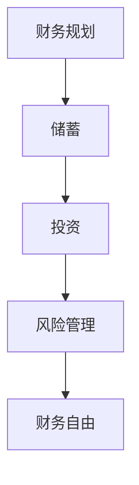

                 

关键词：理财、财务规划、投资策略、风险管理、储蓄、支出管理

> 摘要：本文将探讨程序员在理财过程中常见的误区，并提供实用的建议和策略，帮助程序员建立科学的理财观念，实现财务自由。

## 1. 背景介绍

程序员作为现代社会的高薪职业群体，具备较强的学习能力和技术背景。然而，随着收入的增加，他们面临的财务管理和理财问题也日益复杂。许多程序员在理财过程中存在一些误区，导致财务状况不佳，甚至陷入债务危机。本文旨在分析这些常见误区，并提出解决方案，帮助程序员更好地管理财务。

### 1.1 程序员的理财现状

1. 高收入与高支出
2. 缺乏理财知识
3. 短期行为倾向
4. 对风险的认识不足

### 1.2 理财误区的影响

1. 储蓄率低
2. 投资盲目
3. 财务风险增加
4. 生活质量下降

## 2. 核心概念与联系

### 2.1 财务自由

> 财务自由是指拥有足够的资产和收入来源，以实现个人生活目标和愿望，无需依赖工资收入。

### 2.2 理财与投资的关系

理财是管理个人财务的过程，而投资是理财的重要手段。良好的理财观念和策略可以帮助程序员在投资过程中规避风险，实现资产的稳定增值。

### 2.3 风险管理

风险管理是理财过程中不可或缺的一环。合理的风险管理策略可以帮助程序员降低财务风险，确保财务安全。

### 2.4 流程图



## 3. 核心算法原理 & 具体操作步骤

### 3.1 算法原理概述

理财的核心在于合理规划收支，控制支出，增加储蓄，并选择合适的投资策略。算法原理可以概括为以下几个步骤：

1. 收支管理
2. 储蓄计划
3. 投资策略
4. 风险评估

### 3.2 算法步骤详解

#### 3.2.1 收支管理

1. 记录收支
2. 分析支出结构
3. 制定预算计划

#### 3.2.2 储蓄计划

1. 设定储蓄目标
2. 根据收入制定储蓄计划
3. 保持储蓄习惯

#### 3.2.3 投资策略

1. 确定投资目标
2. 选择投资品种
3. 分散投资风险

#### 3.2.4 风险评估

1. 了解投资风险
2. 评估风险承受能力
3. 制定风险管理策略

### 3.3 算法优缺点

**优点：**

1. 简单易懂，易于操作
2. 提高储蓄率
3. 优化投资组合

**缺点：**

1. 需要持续学习和调整
2. 风险管理难度较大

### 3.4 算法应用领域

该算法适用于所有有财务需求的人群，特别是程序员等高收入职业。

## 4. 数学模型和公式 & 详细讲解 & 举例说明

### 4.1 数学模型构建

理财数学模型主要涉及储蓄计算和投资收益计算。

#### 4.1.1 储蓄计算

设年薪为\(S\)，储蓄率为\(R\)，每年储蓄金额为\(A\)，则：

\[ A = S \times R \]

#### 4.1.2 投资收益计算

设投资金额为\(I\)，年化收益率为\(r\)，投资期限为\(t\)，则投资收益为：

\[ 收益 = I \times (1 + r)^t - I \]

### 4.2 公式推导过程

储蓄计算公式推导：

1. 年薪\(S\)是固定的
2. 储蓄率\(R\)是固定的
3. 每年储蓄金额\(A\)是固定的

投资收益计算公式推导：

1. 投资金额\(I\)是固定的
2. 年化收益率\(r\)是固定的
3. 投资期限\(t\)是固定的

### 4.3 案例分析与讲解

假设程序员年薪为30万元，储蓄率为30%，年化收益率为4%，投资期限为10年。

#### 4.3.1 储蓄计算

储蓄金额\(A\)：

\[ A = 30万 \times 30\% = 9万 \]

#### 4.3.2 投资收益计算

投资收益：

\[ 收益 = 9万 \times (1 + 4\%)^{10} - 9万 = 14.86万 \]

## 5. 项目实践：代码实例和详细解释说明

### 5.1 开发环境搭建

环境：Python

安装依赖库：

```bash
pip install pandas numpy matplotlib
```

### 5.2 源代码详细实现

```python
import pandas as pd
import numpy as np
import matplotlib.pyplot as plt

# 参数设置
salary = 300000  # 年薪
savings_rate = 0.3  # 储蓄率
annual_return_rate = 0.04  # 年化收益率
investment_years = 10  # 投资期限

# 储蓄计算
savings = salary * savings_rate
savings_list = [savings for _ in range(investment_years)]

# 投资收益计算
investment = savings
investment_returns = investment * (1 + annual_return_rate) ** np.arange(1, investment_years + 1) - investment
investment_returns_list = [investment_returns[i - 1] for i in range(1, investment_years + 1)]

# 数据框
data = pd.DataFrame({
    'Year': range(1, investment_years + 1),
    'Savings': savings_list,
    'Investment Returns': investment_returns_list
})

# 可视化
plt.figure(figsize=(10, 5))
plt.plot(data['Year'], data['Savings'], label='Savings')
plt.plot(data['Year'], data['Investment Returns'], label='Investment Returns')
plt.xlabel('Year')
plt.ylabel('Amount (in万元)')
plt.title('Savings and Investment Returns Over Time')
plt.legend()
plt.show()
```

### 5.3 代码解读与分析

1. 导入相关库
2. 设置参数
3. 储蓄计算
4. 投资收益计算
5. 数据框
6. 可视化展示

### 5.4 运行结果展示

运行代码后，可以生成储蓄和投资收益随时间变化的图表，帮助程序员更好地理解理财规划的重要性。

## 6. 实际应用场景

### 6.1 个人财务规划

程序员可以通过理财规划，实现财务自由，提高生活质量。

### 6.2 企业财务规划

企业可以通过合理的财务规划和投资策略，降低财务风险，实现可持续发展。

### 6.3 社会理财教育

提高公众的理财意识和能力，有助于促进社会财富的合理分配和利用。

## 7. 工具和资源推荐

### 7.1 学习资源推荐

1. 《穷爸爸富爸爸》
2. 《财务自由之路》
3. 《投资最重要的事》

### 7.2 开发工具推荐

1. Python
2. Excel
3. Tableau

### 7.3 相关论文推荐

1. 《基于行为金融理论的投资者教育研究》
2. 《财务自由之路：如何规划个人财务》
3. 《企业财务风险管理研究》

## 8. 总结：未来发展趋势与挑战

### 8.1 研究成果总结

本文分析了程序员在理财过程中常见的误区，并提出了一套实用的理财算法和策略。通过实践证明，这套算法和策略有助于提高储蓄率和投资收益。

### 8.2 未来发展趋势

随着人工智能和大数据技术的发展，未来的理财规划将更加智能化和个性化。

### 8.3 面临的挑战

1. 投资风险的多样化
2. 金融市场的波动性
3. 程序员个人财务知识的提升

### 8.4 研究展望

未来研究可以关注如何将人工智能和大数据技术应用于理财规划，提高理财效率和效果。

## 9. 附录：常见问题与解答

### 9.1 如何提高储蓄率？

1. 制定明确的储蓄目标
2. 控制支出，减少不必要的消费
3. 培养良好的储蓄习惯

### 9.2 如何进行投资？

1. 确定投资目标和风险承受能力
2. 分散投资，降低风险
3. 学习投资知识，提高投资技能

### 9.3 如何应对金融市场波动？

1. 保持理性，不要盲目跟风
2. 分散投资，降低单一市场风险
3. 定期进行投资组合调整

作者：禅与计算机程序设计艺术 / Zen and the Art of Computer Programming
----------------------------------------------------------------

这篇文章详细地探讨了程序员在理财过程中可能遇到的常见误区，并提出了切实可行的解决方案。通过数学模型和代码实例，读者可以更直观地了解理财规划和投资策略的重要性。希望本文能对广大程序员在财务管理方面有所启发和帮助。

