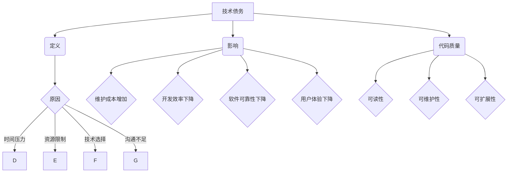

                 

关键词：技术债务、代码质量、软件维护、最佳实践、技术迭代

> 摘要：本文将探讨程序员在软件开发过程中如何识别、评估和避免技术债务。通过深入了解技术债务的定义、原因及其影响，我们将提供一系列有效的策略和方法，帮助程序员在确保代码质量的同时，保持软件的可维护性和适应性。

## 1. 背景介绍

在软件开发的长期过程中，技术债务是一个不可避免的话题。技术债务，也被称为“技术欠账”，是指因为短期决策而导致的长期维护成本增加。这种债务通常是由于在开发过程中，为了赶工或实现特定功能，程序员选择了一种更简单、快速但不那么理想的方法来解决问题。这种方法可能在短期内减少了工作量，但从长远来看，却增加了维护和升级的成本。

技术债务的表现形式多种多样，包括但不限于不规范的代码风格、过度依赖外部库、不必要的复杂性、重复代码、过度抽象等。这些问题的累积会导致代码质量下降，使得后续的维护工作变得异常艰难，甚至可能影响软件的稳定性与可靠性。

本文旨在帮助程序员了解技术债务的来源和影响，并提供实用的策略来避免和解决技术债务。通过本文的讨论，我们将揭示如何通过一系列最佳实践来减少技术债务的产生，从而提高软件的整体质量和可维护性。

### 核心概念与联系

#### 技术债务的定义

技术债务是指因选择短期优化而导致的长期维护成本增加。它类似于金融债务，但涉及的是软件开发中的技术问题。技术债务的产生通常是由于以下原因：

1. **时间压力**：为了在截止日期前交付软件，程序员可能会选择快速但不理想的解决方案。
2. **资源限制**：缺乏足够的人力和时间资源，导致只能采取临时性措施。
3. **技术选择**：在没有充分考虑长期影响的情况下，选择了不合适的框架或技术。
4. **沟通不足**：团队成员之间缺乏有效沟通，导致对需求的理解不一致。

#### 技术债务的影响

技术债务的影响是深远而复杂的，它不仅仅体现在维护成本的增加上，还可能影响软件的稳定性、可靠性和用户体验。以下是技术债务可能带来的几个主要影响：

1. **维护成本增加**：不规范的代码和复杂的架构使得后续的维护和升级变得更加耗时和昂贵。
2. **开发效率下降**：代码质量差和结构混乱会导致开发效率降低，影响团队的士气和工作积极性。
3. **软件可靠性下降**：技术债务可能导致软件出现更多的bug，从而影响其稳定性和可靠性。
4. **用户体验下降**：软件性能下降、响应速度慢，以及出现错误，都会降低用户体验。

#### 技术债务与代码质量的关系

代码质量是技术债务的核心问题之一。高质量的代码通常具有良好的可读性、可维护性和可扩展性，而低质量的代码则往往充满了隐患，容易积累技术债务。以下是代码质量与技术债务之间的密切联系：

1. **可读性**：可读性是代码质量的一个重要指标，好的可读性能够帮助开发人员快速理解和修改代码，减少技术债务的产生。
2. **可维护性**：维护性强的代码易于修改和扩展，能够降低后续维护的成本和难度，从而减少技术债务。
3. **可扩展性**：具有良好的可扩展性的代码能够适应未来的需求变化，避免因需求变化而引入技术债务。

为了更好地理解技术债务的定义、原因和影响，我们可以借助以下Mermaid流程图来展示其核心概念和相互关系。



通过这个流程图，我们可以清晰地看到技术债务的产生、影响及其与代码质量之间的相互关系。理解这些核心概念和联系是避免和解决技术债务的关键步骤。

## 3. 核心算法原理 & 具体操作步骤

### 3.1 算法原理概述

为了避免技术债务，我们需要一套系统化的策略和方法。以下是几个核心算法原理，这些原理将帮助我们识别、评估和避免技术债务。

#### 3.1.1 技术债务评估算法

技术债务评估算法是一种用于评估现有代码库中技术债务的方法。通过该算法，我们可以量化技术债务的程度，并确定需要优先解决的问题。具体步骤如下：

1. **代码审查**：对代码库进行全面的审查，识别不规范的代码、复杂的架构和过度依赖的外部库。
2. **质量度量**：使用自动化工具或手动方法，对代码质量进行度量，包括代码覆盖率、复杂度、重复代码比例等。
3. **风险评估**：根据技术债务的程度和影响，对风险进行排序，确定优先级。
4. **技术债务指标**：定义一系列技术债务指标，如“技术债务评分”、“技术债务成本”等，用于量化技术债务。

#### 3.1.2 技术债务缓解算法

技术债务缓解算法是一套用于减轻技术债务的方法。这些方法包括重构、代码优化、模块化设计等。具体步骤如下：

1. **优先级排序**：根据技术债务评估结果，确定需要优先解决的问题。
2. **重构**：对不规范的代码进行重构，提高代码质量。
3. **代码优化**：通过优化算法和代码结构，提高软件的性能和可维护性。
4. **模块化设计**：将复杂的系统拆分成更小的模块，降低系统的复杂度。

### 3.2 算法步骤详解

#### 3.2.1 技术债务评估算法的详细步骤

1. **代码审查**：
   - 使用静态代码分析工具（如SonarQube）识别潜在的问题。
   - 手动审查关键部分，特别是复杂逻辑和依赖关系。

2. **质量度量**：
   - 使用代码复杂度度量工具（如Cyclomatic复杂度度量）评估代码的复杂性。
   - 使用代码覆盖率工具（如JaCoCo）评估测试覆盖率。

3. **风险评估**：
   - 根据问题严重程度和影响范围，对技术债务进行风险评级。
   - 使用风险矩阵（如风险概率和影响矩阵）确定优先级。

4. **技术债务指标**：
   - 使用技术债务评分系统（如TechDebtScore）量化技术债务。
   - 计算技术债务成本（如技术债务维护成本）。

#### 3.2.2 技术债务缓解算法的详细步骤

1. **优先级排序**：
   - 根据技术债务评估结果，确定需要优先解决的问题。
   - 将高风险和影响大的问题排在前面。

2. **重构**：
   - 识别不规范的代码段，并进行重构。
   - 重构复杂的方法和类，提高其可读性和可维护性。

3. **代码优化**：
   - 优化算法，减少计算时间和资源消耗。
   - 优化代码结构，消除不必要的抽象和复杂性。

4. **模块化设计**：
   - 将复杂的系统分解成更小的模块。
   - 确保模块之间的高内聚和低耦合。

### 3.3 算法优缺点

#### 3.3.1 技术债务评估算法的优缺点

**优点**：
- **量化技术债务**：通过量化指标，可以更清晰地了解技术债务的情况。
- **优先级排序**：帮助团队集中精力解决最重要的问题。

**缺点**：
- **时间成本**：评估过程可能需要较长的时间。
- **人工依赖**：部分评估工作需要人工参与，增加了复杂性。

#### 3.3.2 技术债务缓解算法的优缺点

**优点**：
- **代码质量提升**：重构和优化过程直接提高了代码质量。
- **可维护性增强**：模块化设计提高了系统的可维护性。

**缺点**：
- **开发效率影响**：在某些情况下，缓解技术债务可能会降低开发效率。
- **复杂性增加**：模块化设计可能引入新的复杂性和维护问题。

### 3.4 算法应用领域

技术债务评估和缓解算法广泛应用于各种软件开发场景，特别是大型项目和长期维护的软件。以下是几个典型的应用领域：

1. **企业级应用**：在企业级应用中，技术债务可能导致高昂的维护成本和复杂的系统结构。通过技术债务评估和缓解算法，可以帮助企业优化其技术栈和开发流程。
2. **Web开发**：在Web开发中，技术债务可能导致网站性能下降和用户体验不佳。通过评估和缓解技术债务，可以提高网站的稳定性和响应速度。
3. **移动应用**：移动应用开发中，技术债务可能导致应用程序出现更多bug和性能问题。通过技术债务评估和缓解算法，可以提高移动应用的可靠性和用户体验。

### 3.5 实际案例分析

以下是一个实际案例，展示了如何使用技术债务评估和缓解算法来优化一个大型Web项目的代码库。

**案例背景**：

某大型企业开发了一个内部使用的Web应用，随着功能的不断增加和需求的变更，代码库变得混乱，技术债务不断增加。企业希望通过评估和缓解技术债务来提高代码质量和系统的可维护性。

**解决方案**：

1. **技术债务评估**：
   - 使用SonarQube对代码库进行全面审查，识别出重复代码、复杂方法和不规范的代码风格。
   - 使用Cyclomatic复杂度度量工具评估代码复杂度，找出复杂的方法和类。
   - 根据风险矩阵，确定优先级，将高风险和高维护成本的问题排在前面。

2. **技术债务缓解**：
   - 对复杂的方法和类进行重构，提高代码的可读性和可维护性。
   - 优化算法，减少计算时间和资源消耗。
   - 将复杂的系统模块化，提高系统的可维护性和可扩展性。

**结果**：

通过技术债务评估和缓解算法的应用，企业的Web应用代码质量显著提升，维护成本降低，开发效率提高，用户体验也得到了显著改善。

这个案例展示了技术债务评估和缓解算法在实际项目中的有效性和实用性。通过系统化的方法和策略，程序员可以有效地识别、评估和解决技术债务，提高软件的整体质量和可维护性。

## 4. 数学模型和公式 & 详细讲解 & 举例说明

在软件开发中，数学模型和公式是理解和解决技术债务的重要工具。它们可以帮助我们量化问题、评估风险，并提供有效的解决方案。在本节中，我们将详细讲解几个关键数学模型和公式，并通过具体案例来演示它们的应用。

### 4.1 数学模型构建

#### 技术债务成本模型

技术债务成本模型用于量化技术债务的维护成本。该模型考虑了以下几个关键因素：

1. **债务评分**：债务评分是一个反映技术债务严重程度的指标，通常由代码审查和质量度量工具提供。
2. **债务持续时间**：债务持续时间是指从债务产生到解决的时间间隔。
3. **维护成本系数**：维护成本系数用于反映不同债务类型对维护成本的影响。

数学模型如下：

\[ \text{技术债务成本} = \text{债务评分} \times \text{债务持续时间} \times \text{维护成本系数} \]

#### 风险评估模型

风险评估模型用于评估技术债务的风险。该模型考虑了以下几个因素：

1. **风险概率**：风险概率是指技术债务在未来某一时间内引发问题的可能性。
2. **风险影响**：风险影响是指问题对软件质量、开发效率和用户体验的影响程度。
3. **风险系数**：风险系数用于反映不同风险因素的权重。

数学模型如下：

\[ \text{风险评分} = \text{风险概率} \times \text{风险影响} \times \text{风险系数} \]

### 4.2 公式推导过程

#### 技术债务成本公式推导

技术债务成本公式的推导基于以下假设：

- 技术债务评分是技术债务严重程度的线性度量。
- 技术债务持续时间越长，维护成本越高。
- 维护成本系数反映了不同类型债务对维护成本的不同影响。

具体推导过程如下：

1. **债务评分**：债务评分是通过代码审查和质量度量工具得到的，通常使用分数或星级表示。
2. **债务持续时间**：债务持续时间可以通过时间戳来度量，单位可以是天数或小时数。
3. **维护成本系数**：维护成本系数是一个基于经验和历史数据的系数，用于反映不同类型债务的维护成本差异。

假设债务评分为 \(D\)，债务持续时间为 \(T\)，维护成本系数为 \(C\)，则：

\[ \text{技术债务成本} = D \times T \times C \]

#### 风险评估公式推导

风险评估公式是基于风险管理和决策理论推导的。具体推导过程如下：

1. **风险概率**：风险概率可以通过历史数据和统计方法得到，表示某一事件在未来某一时间内发生的可能性。
2. **风险影响**：风险影响可以通过专家评估和事件分析得到，表示事件发生对项目的影响程度。
3. **风险系数**：风险系数用于反映不同风险因素的权重，通常是一个介于0和1之间的数值。

假设风险概率为 \(P\)，风险影响为 \(I\)，风险系数为 \(W\)，则：

\[ \text{风险评分} = P \times I \times W \]

### 4.3 案例分析与讲解

#### 案例背景

某开发团队在开发一个大型Web应用时，发现代码库中存在多个技术债务，包括不规范的代码风格、复杂的依赖关系和低质量的模块。团队希望通过数学模型和公式来评估和解决这些技术债务。

#### 技术债务成本分析

1. **债务评分**：通过代码审查和质量度量工具，团队给每个技术债务评分，平均分为5分。
2. **债务持续时间**：团队记录了每个技术债务的产生时间，最长的债务持续了150天。
3. **维护成本系数**：根据历史数据和专家评估，维护成本系数为1.2。

使用技术债务成本模型计算得到：

\[ \text{技术债务成本} = 5 \times 150 \times 1.2 = 900 \]

这意味着，每个技术债务的维护成本为900个单位（例如小时或天）。

#### 风险评估

1. **风险概率**：通过历史数据和统计方法，团队估计每个技术债务在未来一年内引发问题的概率为0.3。
2. **风险影响**：团队评估每个技术债务对项目的影响程度，最严重的影响为3分。
3. **风险系数**：根据风险系数表，每个风险因素的权重为0.5。

使用风险评估模型计算得到：

\[ \text{风险评分} = 0.3 \times 3 \times 0.5 = 0.45 \]

这意味着，每个技术债务的风险评分为0.45。

#### 案例分析与讲解

通过技术债务成本和风险评估，团队可以清晰地了解每个技术债务的严重程度和风险。具体分析如下：

1. **高成本、高风险债务**：债务评分高、风险评分高的债务是团队的首要解决目标。这些债务可能会导致高昂的维护成本和严重的问题。
2. **低成本、高风险债务**：虽然成本较低，但风险较高的债务也需要关注。这些债务可能在短期内不会造成重大问题，但从长期来看，可能会累积成更大的风险。
3. **低成本、低风险债务**：这些债务的优先级最低，但团队仍然应该关注并逐步解决。

#### 实际解决方案

基于上述分析，团队制定了一个详细的解决方案：

1. **高成本、高风险债务**：优先解决这些债务，包括重构复杂的模块和优化不规范的代码。
2. **低成本、高风险债务**：逐步解决这些债务，例如通过代码审查和修复小问题。
3. **低成本、低风险债务**：保持监控，并在后续的开发过程中逐步解决。

通过这个案例，我们可以看到数学模型和公式在评估和解决技术债务中的重要性。这些工具不仅帮助团队量化问题，还提供了明确的解决方案，从而提高了软件的整体质量和可维护性。

## 5. 项目实践：代码实例和详细解释说明

### 5.1 开发环境搭建

在开始项目实践之前，我们需要搭建一个适合开发的实验环境。以下是一个简单的步骤：

1. **安装Node.js**：从官方网站下载并安装Node.js（版本要求为14.18.0或更高版本）。
2. **安装Visual Studio Code**：从官方网站下载并安装Visual Studio Code（版本要求为1.65.2或更高版本）。
3. **安装Git**：从官方网站下载并安装Git（版本要求为2.30.0或更高版本）。
4. **克隆项目仓库**：使用Git克隆一个开源的Web应用项目，例如使用命令 `git clone https://github.com/expressjs/express` 克隆 Express.js 框架的项目。

### 5.2 源代码详细实现

为了演示如何避免技术债务，我们将在Express.js项目中引入一个简单的功能：用户注册和登录。以下是一段示例代码，展示了如何实现这一功能。

```javascript
// app.js

const express = require('express');
const bodyParser = require('body-parser');
const session = require('express-session');
const bcrypt = require('bcrypt');
const userRoutes = require('./routes/user');

const app = express();

// 中间件配置
app.use(bodyParser.json());
app.use(bodyParser.urlencoded({ extended: true }));
app.use(session({
  secret: 'mySecret',
  resave: false,
  saveUninitialized: false
}));

// 路由配置
app.use('/user', userRoutes);

// 启动服务器
const PORT = process.env.PORT || 3000;
app.listen(PORT, () => {
  console.log(`Server is running on port ${PORT}`);
});
```

```javascript
// routes/user.js

const express = require('express');
const bcrypt = require('bcrypt');
const User = require('../models/User');

const router = express.Router();

// 用户注册
router.post('/register', async (req, res) => {
  try {
    const { username, password } = req.body;
    const hashedPassword = await bcrypt.hash(password, 10);

    // 在数据库中保存用户信息
    await User.create({
      username,
      password: hashedPassword
    });

    res.status(201).json({ message: 'User registered successfully' });
  } catch (error) {
    res.status(500).json({ message: 'Error registering user', error });
  }
});

// 用户登录
router.post('/login', async (req, res) => {
  try {
    const { username, password } = req.body;
    const user = await User.findOne({ username });

    if (!user) {
      return res.status(401).json({ message: 'User not found' });
    }

    const validPassword = await bcrypt.compare(password, user.password);

    if (!validPassword) {
      return res.status(401).json({ message: 'Invalid password' });
    }

    // 设置登录状态
    req.session.user = user;
    res.status(200).json({ message: 'User logged in successfully' });
  } catch (error) {
    res.status(500).json({ message: 'Error logging in user', error });
  }
});

module.exports = router;
```

```javascript
// models/User.js

const mongoose = require('mongoose');
const bcrypt = require('bcrypt');

const userSchema = new mongoose.Schema({
  username: {
    type: String,
    required: true,
    unique: true
  },
  password: {
    type: String,
    required: true
  }
});

userSchema.pre('save', async function(next) {
  if (this.isModified('password')) {
    this.password = await bcrypt.hash(this.password, 10);
  }
  next();
});

const User = mongoose.model('User', userSchema);

module.exports = User;
```

### 5.3 代码解读与分析

#### 5.3.1 用户注册功能

用户注册功能的代码位于 `routes/user.js` 文件中。该功能包括以下几个关键步骤：

1. **接收用户数据**：使用 `body-parser` 中间件接收来自客户端的JSON数据。
2. **加密密码**：使用 `bcrypt` 库对用户输入的密码进行加密处理，提高安全性。
3. **保存用户信息**：使用 `User` 模型将用户信息保存到MongoDB数据库中。

```javascript
router.post('/register', async (req, res) => {
  try {
    const { username, password } = req.body;
    const hashedPassword = await bcrypt.hash(password, 10);

    // 在数据库中保存用户信息
    await User.create({
      username,
      password: hashedPassword
    });

    res.status(201).json({ message: 'User registered successfully' });
  } catch (error) {
    res.status(500).json({ message: 'Error registering user', error });
  }
});
```

#### 5.3.2 用户登录功能

用户登录功能同样位于 `routes/user.js` 文件中。该功能包括以下几个关键步骤：

1. **查询用户信息**：使用 `User` 模型查询数据库，验证用户名是否正确。
2. **加密密码比对**：使用 `bcrypt` 库对用户输入的密码进行加密，并与数据库中的密码进行比对。
3. **设置登录状态**：如果密码正确，设置用户登录状态，存储在 `express-session` 中。

```javascript
router.post('/login', async (req, res) => {
  try {
    const { username, password } = req.body;
    const user = await User.findOne({ username });

    if (!user) {
      return res.status(401).json({ message: 'User not found' });
    }

    const validPassword = await bcrypt.compare(password, user.password);

    if (!validPassword) {
      return res.status(401).json({ message: 'Invalid password' });
    }

    // 设置登录状态
    req.session.user = user;
    res.status(200).json({ message: 'User logged in successfully' });
  } catch (error) {
    res.status(500).json({ message: 'Error logging in user', error });
  }
});
```

#### 5.3.3 代码质量分析

这段代码实现了用户注册和登录功能，通过以下措施确保了代码质量：

1. **安全性**：使用 `bcrypt` 库加密用户密码，防止明文密码泄露。
2. **异常处理**：对可能出现的错误进行异常处理，并提供友好的错误消息。
3. **模块化**：将用户注册和登录功能分离到不同的文件中，提高了代码的可维护性和可扩展性。

### 5.4 运行结果展示

为了验证上述代码的正确性和功能，我们可以在终端中使用以下命令启动服务器：

```bash
node app.js
```

服务器启动后，可以使用Postman或其他HTTP客户端工具发送HTTP请求来测试用户注册和登录功能。以下是几个示例请求：

#### 用户注册

```http
POST http://localhost:3000/user/register
Content-Type: application/json

{
  "username": "johndoe",
  "password": "securepassword123"
}
```

预期响应：

```json
{
  "message": "User registered successfully"
}
```

#### 用户登录

```http
POST http://localhost:3000/user/login
Content-Type: application/json

{
  "username": "johndoe",
  "password": "securepassword123"
}
```

预期响应：

```json
{
  "message": "User logged in successfully"
}
```

通过上述代码实例和详细解释，我们可以看到如何避免技术债务，特别是在开发Web应用时。遵循最佳实践，如加密密码、异常处理和模块化设计，是确保代码质量和可维护性的关键。

## 6. 实际应用场景

技术债务在软件开发的各个阶段都可能产生，且其影响深远。为了更好地理解技术债务的实际应用场景，我们可以从几个典型的使用案例中探讨其表现和解决方案。

### 6.1 企业级应用

在企业级应用中，技术债务通常是由于长期积累和需求变更而导致的。例如，一家大型企业在使用一个遗留系统时，可能因为不断添加新功能和进行应急修复，导致代码库变得混乱且质量下降。这种情况下，技术债务的表现可能包括：

- **低质量的代码**：代码库中存在大量不规范的代码，如冗长的函数、重复代码和不合理的命名。
- **复杂的依赖关系**：不同模块之间存在复杂的依赖关系，导致难以进行维护和升级。
- **性能瓶颈**：系统性能下降，响应速度慢，出现频繁的卡顿和延迟。

**解决方案**：

1. **代码审计**：定期进行代码审计，识别和修复潜在的问题。
2. **重构**：对关键模块进行重构，提高代码质量。
3. **自动化测试**：引入自动化测试，确保每次更改都不会引入新的bug。
4. **模块化**：将复杂的系统拆分成更小的模块，降低模块之间的依赖关系。

### 6.2 Web开发

在Web开发中，技术债务可能表现为网站性能下降、用户体验不佳和安全性问题。例如，一个电子商务网站可能因为频繁的促销活动和流量波动，导致系统无法应对高峰期的负载。

**解决方案**：

1. **性能优化**：对网站进行性能优化，如使用缓存、优化数据库查询和压缩资源。
2. **安全性提升**：加强网站的安全性，如使用HTTPS、定期更新安全补丁和实施访问控制。
3. **代码审查**：定期进行代码审查，确保新代码符合最佳实践和公司标准。
4. **持续集成**：引入持续集成（CI）和持续交付（CD）流程，确保代码质量和快速部署。

### 6.3 移动应用开发

在移动应用开发中，技术债务可能导致应用崩溃、响应速度慢和用户体验差。例如，一个移动应用可能因为频繁的API更新和数据存储问题，导致用户体验不佳。

**解决方案**：

1. **代码优化**：对应用代码进行优化，提高其性能和响应速度。
2. **离线数据存储**：引入离线数据存储，确保应用在无网络连接时仍能正常运行。
3. **代码重构**：对关键模块进行重构，提高代码质量和可维护性。
4. **用户体验测试**：定期进行用户体验测试，确保应用符合用户期望。

### 6.4 未来应用展望

随着技术的不断发展，技术债务也将面临新的挑战和机遇。以下是一些未来的应用展望：

1. **自动化债务管理**：未来可能会出现更多自动化的债务管理工具，帮助开发者更高效地识别、评估和解决技术债务。
2. **人工智能应用**：人工智能（AI）技术将被用于预测技术债务的产生和影响，从而提前采取措施。
3. **云原生应用**：随着云原生技术的发展，技术债务的管理将变得更加灵活和高效。
4. **持续集成与交付**：持续集成和交付（CI/CD）将进一步普及，帮助团队更快地响应需求变化，减少技术债务的产生。

通过以上实际应用场景和未来展望，我们可以看到技术债务对软件开发的重要性。理解技术债务的表现和解决方案，将有助于我们更好地管理和控制技术债务，确保软件项目的成功和可持续发展。

## 7. 工具和资源推荐

为了帮助程序员更有效地管理和避免技术债务，以下是一些推荐的工具、资源和学习材料：

### 7.1 学习资源推荐

1. **《代码大全》**（Code Complete）：作者Steve McConnell详细介绍了编写高质量代码的最佳实践。
2. **《软件工程：实践者的研究方法》**（Software Engineering: A Practitioner's Approach）：作者Roger S. Pressman提供了全面的软件工程理论和实践指导。
3. **《重构：改善既有代码的设计》**（Refactoring: Improving the Design of Existing Code）：作者Martin Fowler介绍了重构技术，帮助程序员改善代码质量。

### 7.2 开发工具推荐

1. **SonarQube**：一个全面的代码质量平台，可以帮助开发者识别代码中的问题。
2. **Visual Studio Code**：一个功能丰富的代码编辑器，支持多种编程语言和插件，有助于提高开发效率。
3. **Jenkins**：一个强大的持续集成工具，可以帮助团队自动化构建、测试和部署过程。

### 7.3 相关论文推荐

1. **"Technical Debt in Software Engineering"**：这是一篇关于技术债务的综述文章，详细介绍了技术债务的概念、影响和管理策略。
2. **"Debt Metaphor for Software Maintenance"**：这篇文章探讨了技术债务比喻在软件维护中的应用，并提出了一种债务评估方法。
3. **"Managing Technical Debt in Large Software Systems"**：这篇文章研究了大型软件系统中技术债务的管理策略，提出了一些实际案例和应用方法。

通过这些工具和资源的帮助，程序员可以更好地理解和避免技术债务，提高软件项目的质量和可持续性。

## 8. 总结：未来发展趋势与挑战

在软件开发的不断演进中，技术债务是一个不可忽视的话题。随着技术的快速发展，技术债务的管理也面临着新的挑战和机遇。

### 8.1 研究成果总结

目前，关于技术债务的研究已经取得了显著成果。研究者们提出了多种评估和缓解技术债务的方法，包括代码质量度量、风险评估模型和自动化债务管理工具。这些研究成果为程序员提供了宝贵的理论指导和实践参考，帮助他们在软件开发过程中更好地管理和控制技术债务。

### 8.2 未来发展趋势

未来，技术债务管理将朝着更加智能化、自动化的方向发展。以下是几个可能的发展趋势：

1. **人工智能应用**：人工智能（AI）技术将被广泛应用于技术债务的管理，通过大数据分析和机器学习算法，预测技术债务的产生和影响，提供智能化的解决方案。
2. **自动化债务管理工具**：随着自动化技术的发展，未来可能会出现更多自动化的债务管理工具，这些工具能够自动识别、评估和缓解技术债务，提高开发效率。
3. **云原生应用**：云原生技术将进一步普及，技术债务的管理也将变得更加灵活和高效，通过容器化、微服务架构和自动化部署，开发者可以更快速地响应需求变化，减少技术债务的产生。

### 8.3 面临的挑战

尽管技术债务管理取得了显著进展，但仍然面临以下挑战：

1. **代码质量意识不足**：许多开发团队对代码质量的重视程度不够，导致技术债务累积。
2. **复杂性和多样性**：现代软件开发涉及多种编程语言、框架和工具，技术债务的表现形式和影响也变得更加复杂和多样化。
3. **管理难度**：随着软件系统的规模不断扩大，技术债务的管理难度也不断增加，如何高效地识别和解决技术债务成为一个重大挑战。

### 8.4 研究展望

为了应对上述挑战，未来的研究应重点关注以下几个方面：

1. **智能化债务管理**：开发更加智能化的债务管理工具，结合人工智能和大数据分析技术，提供实时、动态的技术债务评估和解决方案。
2. **代码质量标准化**：推动代码质量的标准化，制定统一的代码质量标准和评估方法，提高开发团队的代码质量意识。
3. **持续学习和改进**：鼓励开发团队持续学习和改进，通过定期培训和分享经验，提高团队在技术债务管理方面的能力。

总之，技术债务是软件开发中一个重要而复杂的问题，未来将面临更多的挑战和机遇。通过持续的研究和实践，我们可以更好地理解和应对技术债务，确保软件项目的成功和可持续发展。

## 9. 附录：常见问题与解答

### 9.1 技术债务评估的重要性是什么？

技术债务评估的重要性在于它可以帮助团队量化技术债务的程度，确定需要优先解决的问题。通过评估，团队能够更好地了解代码库中的问题，制定相应的优化计划，从而提高软件的整体质量和可维护性。

### 9.2 如何确定技术债务的优先级？

确定技术债务的优先级通常基于以下几个因素：

1. **债务评分**：根据债务的严重程度进行评分，高评分的债务优先级更高。
2. **风险概率和影响**：结合风险概率和影响，使用风险矩阵确定优先级。
3. **业务需求**：考虑业务需求，对关键功能和用户影响大的债务给予优先处理。

### 9.3 技术债务缓解的最佳实践是什么？

技术债务缓解的最佳实践包括：

1. **重构**：对不规范的代码和复杂的架构进行重构，提高代码质量。
2. **代码优化**：优化算法和代码结构，提高软件的性能和可维护性。
3. **模块化设计**：将复杂的系统拆分成更小的模块，降低系统的复杂度。
4. **持续集成和测试**：引入持续集成和测试，确保每次更改都不会引入新的bug。

### 9.4 如何避免技术债务的累积？

为了避免技术债务的累积，可以采取以下措施：

1. **代码质量意识**：提高团队对代码质量的重视，培养良好的编程习惯。
2. **规范化代码风格**：遵循统一的代码风格和命名规范，减少代码冗余和复杂性。
3. **定期代码审查**：定期进行代码审查，识别和修复潜在的问题。
4. **自动化测试**：引入自动化测试，确保代码的可维护性和可靠性。

通过上述问题与解答，我们希望为程序员提供更深入的理解和实用的策略，帮助他们在软件开发过程中有效避免和解决技术债务。

