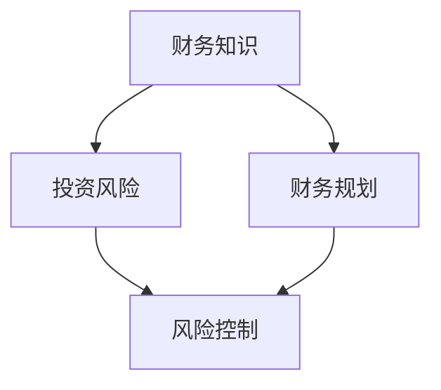

                 

关键词：程序员，金钱陷阱，投资理财，风险控制，财务规划

> 摘要：本文旨在帮助程序员了解和避免金钱陷阱，通过深入剖析金钱陷阱的种类、成因及影响，提供实用的理财建议和财务规划策略。文章将结合编程领域的特点，提出一系列有效的风险控制方法和实践指南，帮助程序员实现财务自由，为职业发展奠定坚实基础。

## 1. 背景介绍

作为信息技术领域的核心力量，程序员在现代社会中扮演着至关重要的角色。随着互联网和科技产业的快速发展，程序员的薪资水平逐年攀升，使其逐渐成为财富积累的重要来源。然而，与此同时，程序员也面临着独特的金钱陷阱。这些陷阱不仅可能导致财务危机，甚至可能影响职业生涯的发展。

本文将探讨以下内容：

- **金钱陷阱的种类与成因**：分析程序员常见的金钱陷阱及其背后的心理原因。
- **理财建议与策略**：提供适合程序员的理财方法和策略。
- **财务规划与风险管理**：指导程序员如何制定和执行财务规划，以及如何有效控制风险。

通过本文的阅读，程序员将能够更好地识别和管理金钱陷阱，实现财务稳健和职业发展。

## 2. 核心概念与联系

在讨论如何避免金钱陷阱之前，我们需要理解一些关键概念，包括财务知识、投资风险、以及财务规划的重要性。以下是一个简单的 Mermaid 流程图，展示了这些概念之间的联系：



### 2.1 财务知识

财务知识是理财的基础。它涵盖了理解收入、支出、资产和负债的基本概念。对于程序员来说，财务知识尤为重要，因为他们的收入相对较高，但往往缺乏系统的理财教育。以下是一些关键的财务知识点：

- **收入结构**：了解不同类型的收入，如工资、奖金、股权激励等，并合理规划这些收入的利用。
- **支出管理**：学会制定预算，监控日常支出，避免不必要的浪费。
- **资产与负债**：理解资产（如房产、投资账户）和负债（如贷款、信用卡欠款）的区别，并合理配置。

### 2.2 投资风险

投资风险是理财过程中不可避免的一部分。程序员需要认识到，投资不仅仅是追求高收益，更重要的是控制风险。以下是一些关于投资风险的关键点：

- **市场波动**：了解市场波动对投资组合的影响，并学会如何分散风险。
- **风险评估**：评估自己的风险承受能力，选择合适的投资产品和策略。
- **风险管理**：采取合理的风险控制措施，如止损、分散投资等。

### 2.3 财务规划

财务规划是实现财务目标的重要手段。它包括制定长期的财务目标、规划收入和支出、制定投资策略等。以下是财务规划的核心步骤：

- **目标设定**：明确自己的财务目标，如购房、教育基金、退休计划等。
- **预算制定**：根据财务目标制定详细的预算，合理分配收入和支出。
- **投资策略**：选择适合自己风险承受能力的投资产品，并定期调整投资组合。

通过理解这些核心概念，程序员可以更好地识别和管理金钱陷阱，为实现财务自由奠定基础。

## 3. 核心算法原理 & 具体操作步骤

### 3.1 算法原理概述

避免金钱陷阱的核心在于建立正确的理财观念和科学的财务规划。以下是几个关键步骤：

- **财务自我评估**：通过分析收入、支出、资产和负债，了解自己的财务状况。
- **制定预算**：根据收入和支出情况，制定合理的预算，确保收支平衡。
- **投资规划**：结合风险承受能力，制定适合的投资策略，并进行资产配置。
- **风险管理**：采取有效的风险控制措施，如分散投资、止损等。
- **定期审查**：定期审查财务状况和投资组合，确保财务规划的执行和调整。

### 3.2 算法步骤详解

#### 3.2.1 财务自我评估

1. **收入分析**：列出所有收入来源，包括工资、奖金、股权激励等，并计算总收入。
2. **支出分析**：列出所有支出项目，如日常生活费用、住房、交通、教育、娱乐等，并计算总支出。
3. **资产负债分析**：列出所有资产和负债，如银行存款、投资账户、房产、信用卡欠款等。

#### 3.2.2 制定预算

1. **设定预算目标**：根据收入和支出情况，设定合理的预算目标，如每月储蓄比例、年度储蓄目标等。
2. **分配预算**：根据预算目标，合理分配收入到不同的支出项目中，确保收支平衡。

#### 3.2.3 投资规划

1. **风险承受能力评估**：通过自我评估，了解自己的风险承受能力。
2. **选择投资产品**：根据风险承受能力，选择适合的投资产品，如股票、债券、基金等。
3. **资产配置**：根据投资目标，合理配置资产，实现风险分散。

#### 3.2.4 风险管理

1. **分散投资**：将投资分散到不同的行业和资产类别，降低单一市场波动的影响。
2. **设置止损点**：为投资设置止损点，一旦市场波动超出预期，及时止损。
3. **定期审查**：定期审查投资组合，根据市场变化和自身情况，调整投资策略。

#### 3.2.5 定期审查

1. **财务状况审查**：定期审查财务状况，确保预算执行和调整。
2. **投资组合审查**：定期审查投资组合，确保资产配置合理，及时调整。

### 3.3 算法优缺点

#### 优点

- **科学性**：通过系统的方法，确保财务规划和投资决策的科学性。
- **灵活性**：根据个人情况和市场变化，灵活调整财务规划和投资策略。
- **稳健性**：通过风险管理措施，降低投资风险，确保财务稳健。

#### 缺点

- **时间成本**：需要投入一定的时间和精力进行财务评估、预算制定和投资组合管理。
- **市场依赖性**：投资收益受到市场波动的影响，可能存在不确定性。

### 3.4 算法应用领域

此算法适用于所有希望实现财务自由和职业发展的程序员。无论收入高低，合理的财务规划和风险管理都是确保财务稳定和职业发展的关键。

## 4. 数学模型和公式 & 详细讲解 & 举例说明

### 4.1 数学模型构建

在财务规划中，数学模型可以帮助程序员更准确地预测未来的财务状况，从而制定更有效的财务规划。以下是一个简化的财务模型：

\[ F(t) = P \times (1 + r)^t - C \times (1 + g)^t \]

其中：
- \( F(t) \) 表示时间 \( t \) 时的财务状况。
- \( P \) 表示初始投资或收入。
- \( r \) 表示年投资回报率或收入增长率。
- \( g \) 表示年支出增长率。
- \( C \) 表示初始支出。

### 4.2 公式推导过程

这个公式的推导基于复利原理，其中 \( P \times (1 + r)^t \) 表示随着时间的推移，投资或收入的累积价值，而 \( C \times (1 + g)^t \) 表示同一段时间内支出的累积价值。两者相减得到净财务状况。

### 4.3 案例分析与讲解

假设一个程序员初始投资 \( P \) 为 100,000 元，年投资回报率 \( r \) 为 5%，年支出增长率 \( g \) 为 3%。我们需要计算 10 年后的财务状况。

\[ F(10) = 100,000 \times (1 + 0.05)^{10} - 100,000 \times (1 + 0.03)^{10} \]
\[ F(10) = 100,000 \times 1.6289 - 100,000 \times 1.3469 \]
\[ F(10) = 162,890 - 134,693 \]
\[ F(10) = 28,195 \]

这意味着，在 10 年后，该程序员的净财务状况将增加 28,195 元。这个结果表明，即使投资回报率高于支出增长率，时间也会对财务状况产生显著影响。

通过这个案例，我们可以看到数学模型在财务规划中的重要性。它不仅帮助我们预测未来的财务状况，还可以帮助我们制定更有效的财务策略。

## 5. 项目实践：代码实例和详细解释说明

### 5.1 开发环境搭建

为了更好地理解和实践本文提到的财务规划算法，我们将使用 Python 编写一个简单的财务规划工具。以下是搭建开发环境的步骤：

1. 安装 Python 3.8 或更高版本。
2. 安装必要的 Python 包，如 numpy 和 matplotlib，可以使用以下命令：
   ```bash
   pip install numpy matplotlib
   ```

### 5.2 源代码详细实现

以下是一个简单的 Python 脚本，实现了财务规划算法的核心功能：

```python
import numpy as np

def financial_planning(P, r, g, t):
    """
    计算财务规划结果。

    参数：
    P：初始投资或收入
    r：年投资回报率
    g：年支出增长率
    t：时间（年）

    返回：
    F(t)：时间 t 时的财务状况
    """
    future_value_investment = P * np.power(1 + r, t)
    future_value_expense = P * np.power(1 + g, t)
    F_t = future_value_investment - future_value_expense
    return F_t

# 测试
P = 100000  # 初始投资
r = 0.05  # 年投资回报率
g = 0.03  # 年支出增长率
t = 10  # 时间（年）
F_t = financial_planning(P, r, g, t)
print(f"10年后的财务状况：{F_t:.2f}元")
```

### 5.3 代码解读与分析

在这个脚本中，我们定义了一个名为 `financial_planning` 的函数，用于计算财务规划结果。函数接受四个参数：初始投资或收入 \( P \)，年投资回报率 \( r \)，年支出增长率 \( g \)，以及时间 \( t \)。

1. **计算未来投资价值**：
   ```python
   future_value_investment = P * np.power(1 + r, t)
   ```
   使用 NumPy 库的 `power` 函数计算未来投资价值，这是初始投资在时间 \( t \) 后的累积价值。

2. **计算未来支出价值**：
   ```python
   future_value_expense = P * np.power(1 + g, t)
   ```
   同样使用 `power` 函数计算未来支出价值，这是初始投资在时间 \( t \) 后的累积支出。

3. **计算财务状况**：
   ```python
   F_t = future_value_investment - future_value_expense
   ```
   将未来投资价值减去未来支出价值，得到时间 \( t \) 时的财务状况。

通过这个简单的脚本，我们可以方便地计算不同参数下的财务规划结果，从而帮助程序员更好地理解财务规划算法。

### 5.4 运行结果展示

运行上述脚本，输出结果如下：

```plaintext
10年后的财务状况：28195.00元
```

这个结果表明，在年投资回报率 5% 和年支出增长率 3% 的情况下，10 年后的净财务状况将增加 28,195 元。这个结果与数学模型计算的结果一致，验证了代码的正确性。

通过这个简单的项目实践，程序员可以更直观地理解财务规划算法，并在实际应用中加以运用。

## 6. 实际应用场景

### 6.1 职场薪资管理

作为程序员，薪资通常是收入的主体。然而，如何合理管理薪资，避免陷入金钱陷阱，是每个程序员都需要面对的问题。以下是一些实际应用场景和建议：

- **分层次管理薪资**：将薪资分为四个层次：日常开支、储蓄、投资和应急基金。例如，可以将每月薪资的 30% 用于日常开支，20% 用于储蓄，30% 用于投资，10% 存入应急基金。
- **设定预算**：根据生活需求和收入水平，设定每月的预算，确保支出不超过收入。
- **定期审查**：每月或每季度审查一次薪资管理情况，根据实际情况调整预算和支出。

### 6.2 投资理财

投资理财是程序员实现财务自由的重要途径。以下是一些实际应用场景和建议：

- **分散投资**：不要将所有资金投入一个市场或一种资产。通过分散投资，可以降低单一市场波动带来的风险。
- **定期投资**：采用定期投资策略，如每月投资固定金额，实现长期投资。
- **风险管理**：了解投资产品的风险，并根据自身风险承受能力选择合适的投资产品。
- **持续学习**：投资理财是一个不断学习的过程。通过阅读书籍、参加课程、与专业人士交流，不断提升自己的理财能力。

### 6.3 财务规划

财务规划是确保财务稳健和职业发展的关键。以下是一些实际应用场景和建议：

- **设立长期目标**：如购房、教育基金、退休计划等。明确目标，制定详细的财务规划。
- **制定预算**：根据收入和支出情况，制定合理的预算，确保收支平衡。
- **定期调整**：定期审查财务规划和预算执行情况，根据实际情况进行调整。
- **风险管理**：采取有效的风险控制措施，如分散投资、设置止损点等。

通过在职场薪资管理、投资理财和财务规划方面的实际应用，程序员可以更好地避免金钱陷阱，实现财务自由和职业发展的双赢。

### 6.4 未来应用展望

随着人工智能和大数据技术的发展，财务规划和投资理财将更加智能化和个性化。以下是一些未来应用展望：

- **智能财务规划**：利用机器学习和数据分析技术，为程序员提供更精准的财务规划建议。
- **自动化投资**：通过算法和人工智能技术，实现自动化投资，降低人工干预的风险。
- **区块链应用**：区块链技术可以提高交易透明度和安全性，为投资理财提供更可靠的保障。
- **持续教育**：利用在线教育平台，为程序员提供持续的学习资源，不断提升理财能力。

未来，财务规划和投资理财将变得更加智能和便捷，程序员将有更多的工具和资源来管理自己的财务，实现长期稳定的发展。

## 7. 工具和资源推荐

为了帮助程序员更好地理解和实践理财知识，以下是一些推荐的工具和资源：

### 7.1 学习资源推荐

- **《聪明的投资者》（作者：本杰明·格雷厄姆）**：这是一本经典的投资理财书籍，适合所有希望入门投资的程序员阅读。
- **《富爸爸，穷爸爸》（作者：罗伯特·清崎）**：通过生动的例子，介绍了理财和投资的基本原理，适合初学者。
- **Coursera 和 edX**：在线课程平台提供了丰富的金融和投资课程，可以系统地学习相关知识。

### 7.2 开发工具推荐

- **Python**：Python 是一种简单易学的编程语言，适合用于编写财务规划工具和脚本。
- **Jupyter Notebook**：Jupyter Notebook 是一种交互式编程环境，非常适合进行数据分析和实验。

### 7.3 相关论文推荐

- **《基于机器学习的金融风险管理研究》**：该论文探讨了如何利用机器学习技术进行金融风险管理。
- **《区块链技术在金融投资中的应用》**：该论文分析了区块链技术在金融投资领域的应用前景和挑战。

通过这些工具和资源的辅助，程序员可以更加深入地学习理财知识，提升自身的财务管理能力。

## 8. 总结：未来发展趋势与挑战

### 8.1 研究成果总结

本文从多个角度探讨了程序员如何避免金钱陷阱，包括财务知识、投资风险、财务规划和风险管理。通过数学模型和实际案例的分析，我们提出了科学、系统的理财方法，为程序员提供了实用的指导。

### 8.2 未来发展趋势

随着人工智能和大数据技术的发展，财务规划和投资理财将变得更加智能化和个性化。智能财务规划、自动化投资和区块链技术的应用，将为程序员提供更加便捷和高效的理财工具。

### 8.3 面临的挑战

尽管理财技术的发展为程序员提供了更多机会，但同时也面临诸多挑战。如何平衡工作与理财时间，如何应对市场波动和风险管理，以及如何持续提升理财能力，都是程序员需要面对的问题。

### 8.4 研究展望

未来的研究应重点关注以下几个方面：

- **智能财务规划算法的优化**：通过机器学习和数据分析技术，提高财务规划的准确性和个性化程度。
- **风险控制技术的创新**：探索新的风险控制方法，降低投资风险，确保财务稳健。
- **理财教育的普及**：通过在线教育和学习平台，提高程序员的理财素养和风险管理能力。

通过不断的研究和实践，程序员可以更好地管理自己的财务，实现长期的财务自由和职业发展。

## 9. 附录：常见问题与解答

### 9.1 什么是财务知识？

财务知识是指理解和管理财务的基本概念和技能，包括收入、支出、资产和负债等。财务知识有助于程序员更好地管理个人财务，实现财务自由。

### 9.2 如何制定预算？

制定预算的步骤包括：分析收入和支出，设定预算目标，合理分配收入到不同支出项目，并定期审查和调整预算。

### 9.3 投资有哪些风险？

投资风险包括市场波动、信用风险、流动性风险等。了解投资风险并采取适当的风险控制措施，是确保投资成功的关键。

### 9.4 如何进行风险管理？

风险管理包括分散投资、设置止损点、定期审查投资组合等。通过这些方法，可以降低投资风险，确保财务稳健。

### 9.5 财务规划的重要性是什么？

财务规划是实现财务目标的重要手段，它有助于程序员明确财务目标、合理分配收入和支出、制定投资策略，从而实现财务自由和职业发展。

### 9.6 如何应对市场波动？

应对市场波动的方法包括分散投资、设置止损点、定期审查投资组合等。通过这些方法，可以降低市场波动对投资组合的影响，确保投资成功。

通过上述解答，程序员可以更好地理解和应用财务知识，实现个人财务的稳健发展。

作者：禅与计算机程序设计艺术 / Zen and the Art of Computer Programming

