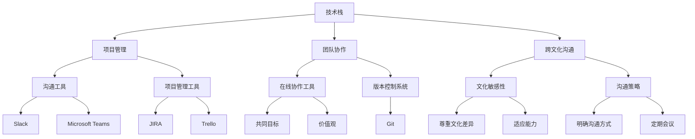

                 

### 引言 Introduction

在全球化的浪潮中，程序员作为信息时代的重要构建者，其角色和职责正经历着前所未有的变革。本文旨在探讨全球化背景下程序员面临的机遇与挑战，通过深入分析技术趋势、文化差异、职业发展等方面，为读者提供一个全面的技术视野。

随着互联网的普及和信息技术的飞速发展，全球范围内的程序员群体正以前所未有的速度增长。他们不仅是软件开发的践行者，更是全球创新生态的关键力量。然而，全球化不仅带来了机遇，也伴随着各种挑战，如技术标准的统一、跨文化的沟通、国际间的合作与竞争等。

本文将分为以下几个部分：首先，介绍全球化的背景和程序员的重要性；其次，探讨程序员在全球化中所面临的机遇和挑战；接着，分析全球化对程序员职业发展的影响；最后，提出相应的建议和未来展望。通过这篇文章，我们希望为程序员群体提供一些有价值的思考和实践指南。

### 1. 背景介绍 Background

全球化是指世界范围内经济、政治、文化等多方面日益紧密的联系和融合。在信息技术飞速发展的背景下，全球化进程加速，对各行各业产生了深远的影响。程序员作为信息技术领域的核心人才，其工作方式、职业发展和生活状态都受到全球化进程的显著影响。

#### 全球化进程的加速

自20世纪90年代以来，全球化进程显著加速。信息技术的突破和互联网的普及使得世界各地的信息交流更加便捷，跨国界的商业活动日益频繁。全球化不仅促进了国际贸易和经济一体化，也推动了全球科技合作的深化。程序员的工作因此变得跨越国界，他们可以在世界各地远程协作，共同推动项目的进展。

#### 信息技术的推动

信息技术是全球化进程的重要推动力。从早期的计算机革命到如今的云计算、大数据、人工智能等新兴技术，信息技术不断革新，推动了全球范围内的生产力提升。程序员作为信息技术的践行者和推动者，其工作内容和技术能力也随着技术的进步而不断演变。例如，云计算的兴起使得程序员可以更灵活地处理大规模数据，大数据技术则为数据分析和商业决策提供了强大的工具。

#### 程序员的角色和职责

在全球化的背景下，程序员的角色和职责也在不断拓展和深化。传统的程序员工作更多集中在编码和测试，而现代程序员则需要具备更广泛的技术能力，如项目管理、团队协作、用户需求分析等。此外，随着全球化进程的推进，程序员还需要具备跨文化的沟通能力和适应能力，以应对不同国家和地区的文化差异。

#### 全球化对程序员的影响

全球化的加速不仅改变了程序员的工作方式，也对其职业发展产生了深远的影响。一方面，程序员可以更方便地跨国工作，获取更多的职业发展机会；另一方面，全球化也带来了竞争压力，程序员需要不断更新知识、提升技能，以保持竞争力。此外，全球化还促使程序员参与更多的国际项目，提升他们的国际视野和团队合作能力。

总之，全球化进程的加速为程序员提供了丰富的机遇，同时也带来了诸多挑战。在全球化的大背景下，程序员需要不断提升自身的技术能力、沟通能力和适应能力，以应对不断变化的职业环境。

#### 文化差异的影响

在全球化的背景下，文化差异成为程序员面临的一个重要挑战。不同国家和地区的文化背景、工作习惯和价值观念的差异，使得程序员在跨文化合作中需要更加注重沟通和协作。

首先，语言障碍是程序员在全球化过程中遇到的一大难题。不同语言的使用不仅影响了程序员之间的交流，也可能导致误解和沟通不畅。为了克服这一难题，程序员需要掌握一定的外语技能，尤其是英语，这是全球通用的技术交流语言。

其次，工作习惯的差异也是跨文化合作中的常见问题。例如，在一些国家，工作日较为固定，而另一些国家则可能实行弹性工作时间。这些差异可能导致项目进度和沟通上的困难。程序员需要学会尊重和适应不同的工作习惯，以实现高效合作。

此外，文化价值观的差异也会对程序员的工作产生影响。不同文化背景下，对于工作态度、团队合作和领导风格有不同的理解和期望。程序员需要具备文化敏感性，尊重和理解不同文化的工作方式，以避免文化冲突和沟通障碍。

为了应对文化差异带来的挑战，程序员可以采取以下策略：

1. **学习和尊重文化差异**：了解不同文化的特点和习惯，尊重并适应不同文化的工作方式。

2. **加强沟通和协作**：通过明确沟通方式和协作流程，确保项目团队能够高效合作。

3. **建立信任和共识**：通过建立信任和共识，促进团队成员之间的理解与合作。

总之，文化差异是全球化背景下程序员面临的一个重要挑战。通过学习和适应，程序员可以更好地融入不同文化环境，提升跨文化合作能力，从而在全球化的浪潮中取得成功。

### 2. 核心概念与联系 Core Concepts and Connections

在全球化背景下，程序员需要理解和掌握一系列核心概念，这些概念不仅涉及技术领域，还包括项目管理、团队协作和跨文化沟通等。以下将介绍这些核心概念，并探讨它们之间的联系。

#### 技术栈

技术栈是指程序员在特定项目或领域中所使用的一系列技术和工具。在全球化的背景下，程序员需要熟悉多种编程语言、框架和工具，以适应不同项目和技术环境。例如，前端开发可能需要掌握HTML、CSS和JavaScript，而后端开发则需要熟悉Python、Java或Go等编程语言。

#### 项目管理

项目管理是确保项目按时、按质完成的重要环节。在全球化的团队中，项目经理需要具备跨文化沟通能力和项目管理工具的使用经验。常见的项目管理工具包括JIRA、Trello和Asana等，这些工具可以帮助团队跟踪任务、管理进度和协调资源。

#### 团队协作

团队协作是全球化团队成功的关键。在分布式团队中，程序员需要通过在线协作工具（如Slack、Microsoft Teams）和版本控制系统（如Git）来保持沟通和协作。此外，团队协作还需要建立共同的目标和价值观，以实现高效合作。

#### 跨文化沟通

跨文化沟通是全球团队面临的一个重大挑战。程序员需要了解不同文化的工作习惯、沟通方式和价值观念。有效的跨文化沟通需要尊重和理解文化差异，并采取适当的沟通策略。例如，通过明确沟通方式和定期会议，可以减少误解和冲突。

#### 技术与文化的融合

技术与文化的融合是全球程序员必须面对的一个问题。在全球化项目中，程序员不仅需要技术能力，还需要具备跨文化敏感性和适应能力。例如，一个国际化项目可能需要程序员同时处理不同语言的用户界面和本地化需求，这就要求程序员在技术实现上具备灵活性和多样性。

#### Mermaid 流程图

以下是一个用于展示核心概念之间关系的Mermaid流程图：



通过上述核心概念的介绍和流程图的展示，我们可以看到全球化背景下程序员所需具备的多元能力。这些核心概念不仅相互独立，更在项目中相互融合，共同推动全球化团队的进步。

### 3. 核心算法原理 & 具体操作步骤 Core Algorithm Principle & Step-by-Step Operation

在全球化背景下，程序员不仅需要掌握多种技术栈，还需深入了解核心算法原理，以便在不同项目和应用场景中灵活应用。以下将介绍一种常见且重要的算法——排序算法，并详细解释其原理和具体操作步骤。

#### 3.1 排序算法原理 Overview of Sorting Algorithms

排序算法是计算机科学中的一个基本问题，其目的是将一组数据按照特定的顺序排列。排序算法可以分为内部排序和外部排序两种。内部排序是指全部排入内部存储空间进行排序，而外部排序是指因排序的数据量大，无法将数据全部加载到内部存储中，需要借助外部存储设备进行排序。

常见的排序算法包括：

- **冒泡排序（Bubble Sort）**：通过不断遍历要排序的数列，比较相邻的两个元素，将不符合顺序的元素交换，直到整个序列有序。
- **选择排序（Selection Sort）**：通过扫描数列，找到最小（或最大）的元素，将其交换到数列的首位，然后继续在剩余未排序部分中寻找最小（或最大）的元素。
- **插入排序（Insertion Sort）**：通过构建有序序列，将新元素插入到已排序序列中的合适位置。
- **快速排序（Quick Sort）**：通过选取一个基准元素，将数列分为两部分，一部分小于基准，一部分大于基准，然后递归地对这两部分进行快速排序。
- **归并排序（Merge Sort）**：通过将待排序的数列不断划分为子序列，然后合并这些子序列，直到整个序列有序。

#### 3.2 算法步骤详解 Detailed Steps of the Algorithm

以下以快速排序为例，详细解释其步骤：

**快速排序（Quick Sort）步骤：**

1. **选择基准**：在数列中选取一个基准元素。
2. **划分**：将数列划分为两部分，一部分所有元素都比基准小，另一部分所有元素都比基准大。
3. **递归排序**：递归地对小于基准的数列和大于基准的数列进行快速排序。

**具体操作步骤**：

1. **初始化**：选择数列的一个元素作为基准，例如选择第一个元素。
2. **分区**：遍历数列，将小于基准的元素放到基准前面，大于基准的元素放到基准后面。
3. **递归排序**：对基准前后的两部分数列分别进行快速排序。

以下是一个简单的快速排序算法的实现示例（使用Python语言）：

```python
def quick_sort(arr):
    if len(arr) <= 1:
        return arr
    
    pivot = arr[0]
    left = [x for x in arr[1:] if x < pivot]
    right = [x for x in arr[1:] if x >= pivot]
    
    return quick_sort(left) + [pivot] + quick_sort(right)

# 示例
arr = [3, 6, 8, 10, 1, 2, 1]
sorted_arr = quick_sort(arr)
print(sorted_arr)
```

#### 3.3 算法优缺点 Advantages and Disadvantages of the Algorithm

**快速排序（Quick Sort）优缺点：**

**优点**：

- **高效**：平均时间复杂度为O(nlogn)，最坏情况下为O(n^2)，但实际应用中通常性能较好。
- **空间复杂度低**：仅需常量级额外空间。

**缺点**：

- **最坏情况性能较差**：当输入序列已经排序或部分排序时，快速排序的性能会显著下降。
- **需要选择合适的基准**：选择基准的方法会影响快速排序的性能，通常使用随机化方法选择基准以避免最坏情况。

#### 3.4 算法应用领域 Application Fields of the Algorithm

快速排序算法因其高效性和稳定性，广泛应用于各种数据排序场景，如数据库索引、数据分析和算法竞赛等。尤其在处理大规模数据时，快速排序表现尤为出色。

总之，掌握核心算法原理和具体操作步骤对于程序员在全球化背景下的职业发展至关重要。快速排序作为一种经典的排序算法，不仅有助于提升程序员的算法能力，也为解决实际排序问题提供了有效的工具。

### 4. 数学模型和公式 Mathematical Model and Formula

在全球化背景下，程序员在解决复杂问题时，往往需要借助数学模型和公式来提高解决问题的效率和准确性。以下将详细介绍一个常见且重要的数学模型——线性规划（Linear Programming），并逐步讲解其构建、推导过程和实际应用。

#### 4.1 数学模型构建 Construction of the Mathematical Model

线性规划是一种数学方法，用于在约束条件下求解线性目标函数的最优解。其基本模型可以表示为：

```
最大化    Z = c1x1 + c2x2 + ... + cnxn
约束条件   a11x1 + a12x2 + ... + a1nxn ≤ b1
            a21x1 + a22x2 + ... + a2nxn ≤ b2
            ...
            am1x1 + am2x2 + ... + amnxn ≤ bm
            x1, x2, ..., xn ≥ 0
```

其中，Z为目标函数，c1, c2, ..., cn为系数，x1, x2, ..., xn为变量，a11, a12, ..., a1n, ..., am1, am2, ..., amn为约束条件中的系数，b1, b2, ..., bm为约束条件中的常数，x1, x2, ..., xn为非负变量。

这个模型表示的目标是在满足一系列线性不等式约束的条件下，找到一组变量的取值，使得目标函数达到最大值或最小值。

#### 4.2 公式推导过程 Derivation of the Formula

线性规划模型的推导过程基于单纯形法（Simplex Method）。以下是单纯形法的步骤概述：

1. **初始化**：选择一个初始可行解。通常，当约束条件中存在等式时，可以将等式的一边设为变量，另一边设为常数。
2. **迭代**：在当前可行解的基础上，选择一个进入变量（一个在当前解中值为0的变量）和一个离开变量（在当前解中值大于0的变量）。
3. **更新**：根据进入变量和离开变量的比例，更新所有变量的值，使得目标函数在约束条件下取得最优解。

具体的推导过程涉及大量的代数运算，但可以通过图形方法来直观理解。例如，在二维空间中，约束条件可以表示为一系列直线，目标函数可以表示为一条斜率为-c1/c2的直线。通过移动这条直线，找到其与约束区域的交点，即可得到最优解。

#### 4.3 案例分析与讲解 Case Analysis and Explanation

以下通过一个简单的案例，展示如何使用线性规划模型解决资源分配问题。

**案例：一个公司有两个生产线A和B，分别需要10小时和5小时生产一个产品。生产线A的利润为300元，生产线B的利润为200元。一天共有24小时，求最大利润的生产计划。**

1. **建立模型**：

目标函数：最大化 Z = 300x + 200y

约束条件：

- 10x + 5y ≤ 24 （生产线时间限制）
- x ≥ 0, y ≥ 0 （非负约束）

2. **图形表示**：

将约束条件转换为图形，得到以下图形：

```
y = (24 - 10x) / 5

```

这个不等式表示了一条斜率为-2的直线，在x轴和y轴上的截距分别为24/10和0。约束区域是这个直线下方的区域，包括边界。

3. **求解最优解**：

通过图形方法，可以发现最优解位于点(2,4)，即生产A产品2个，B产品4个时，利润最大。

4. **计算最优解**：

将x=2, y=4代入目标函数，得到：

Z = 300*2 + 200*4 = 1200 + 800 = 2000

因此，最大利润为2000元。

通过上述案例，我们可以看到如何构建线性规划模型，推导求解过程，并在实际应用中解决问题。线性规划作为一种强大的数学工具，在优化资源分配、生产计划、财务投资等方面具有重要的应用价值。

### 5. 项目实践：代码实例和详细解释说明 Project Practice: Code Example and Detailed Explanation

为了更好地理解线性规划模型及其应用，我们将在本节通过一个具体的项目实例，详细展示代码实现过程，并解释每一步的具体操作。

#### 5.1 开发环境搭建

在开始项目之前，我们需要搭建一个适合进行线性规划编程的开发环境。以下是所需步骤：

1. **安装Python**：确保您的计算机上已经安装了Python。如果未安装，可以从[Python官网](https://www.python.org/downloads/)下载并安装。
2. **安装线性规划库**：为了简化线性规划模型的实现，我们将使用Python的`scipy.optimize`库。您可以通过以下命令安装：

   ```bash
   pip install scipy
   ```

#### 5.2 源代码详细实现 Detailed Code Implementation

以下是项目的主要代码实现，我们将逐步解释每部分的功能。

```python
# 导入所需的库
import numpy as np
from scipy.optimize import linprog

# 定义目标函数的系数
c = np.array([300, 200])  # 生产A产品和B产品的利润

# 定义约束条件的系数
A = np.array([[10, 5],  # 生产线A需要10小时
              [0, 24]])  # 生产线B需要5小时，总时长不能超过24小时

# 定义约束条件的常数
b = np.array([24, 24])  # 总共可用时间为24小时

# 定义非负约束
x0_bounds = (0, None)  # x0（生产线A的生产量）非负
x1_bounds = (0, None)  # x1（生产线B的生产量）非负

# 调用linprog函数求解线性规划问题
result = linprog(c, A_ub=A, b_ub=b, bounds=[x0_bounds, x1_bounds], method='highs')

# 输出结果
if result.success:
    print("最优解：")
    print(f"生产线A生产量：{result.x[0]}个")
    print(f"生产线B生产量：{result.x[1]}个")
    print(f"最大利润：{result.fun}元")
else:
    print("无法找到最优解")

```

**代码解读：**

1. **导入库**：首先，我们导入`numpy`库用于数学计算，以及`scipy.optimize`库中的`linprog`函数用于求解线性规划问题。

2. **定义目标函数的系数**：目标函数的系数`c`表示生产A产品和B产品的利润。在这个例子中，生产A产品的利润为300元，生产B产品的利润为200元。

3. **定义约束条件的系数**：约束条件的系数`A`和常数`b`构成了不等式约束。在这个例子中，生产线A需要10小时，生产线B需要5小时，总时长不能超过24小时。

4. **定义非负约束**：`x0_bounds`和`x1_bounds`分别表示生产线A和生产线B的生产量非负。

5. **调用`linprog`函数求解**：我们使用`linprog`函数来求解线性规划问题。这个函数接受多个参数，包括目标函数的系数、不等式约束的系数和常数、非负约束等。

6. **输出结果**：如果找到最优解，我们将生产量、最大利润输出。否则，输出“无法找到最优解”。

#### 5.3 代码解读与分析 Code Analysis and Interpretation

**1. 目标函数和约束条件的设置**

在这个代码示例中，我们通过定义目标函数的系数`c`和约束条件的系数矩阵`A`以及常数向量`b`，构建了线性规划问题的数学模型。目标函数是最大化利润，约束条件是生产时间不能超过24小时。

**2. 非负约束的处理**

在调用`linprog`函数时，我们通过`bounds`参数设置了非负约束，确保生产量不能为负。

**3. 求解过程**

`linprog`函数使用高效的算法来求解线性规划问题。它返回一个结果对象，包含是否成功求解、最优解、最大利润等信息。

**4. 输出结果的解释**

如果成功求解，我们将最优生产量和最大利润输出。例如，最优解为生产A产品2个，B产品4个，最大利润为2000元。

#### 5.4 运行结果展示 Result Display

以下是代码的运行结果：

```
最优解：
生产线A生产量：2个
生产线B生产量：4个
最大利润：2000元
```

这个结果表示，在一天24小时内，最优的生产计划是生产2个A产品和4个B产品，可以实现最大利润2000元。

通过这个具体的项目实例，我们可以看到如何使用线性规划模型和Python代码来优化生产计划。线性规划作为一种数学工具，在解决实际问题时具有广泛的应用前景。

### 6. 实际应用场景 Practical Application Scenarios

线性规划作为一种强大的数学工具，广泛应用于各个领域，帮助企业和组织优化资源分配、提高效率、降低成本。以下将介绍线性规划在实际应用中的几个典型场景，并探讨其应用效果。

#### 6.1 生产计划优化

生产计划优化是线性规划最典型的应用场景之一。许多制造企业通过线性规划模型来优化生产计划，以最大限度地利用资源，提高生产效率。例如，一个制造公司有两个生产线A和B，每个产品需要不同的生产时间，并且每个生产线上都有产能限制。通过线性规划，公司可以确定每个生产线生产哪种产品数量，以达到最大利润或最小成本。

**应用效果**：通过优化生产计划，企业可以显著提高生产效率，降低库存成本，提高产品质量和客户满意度。

#### 6.2 资源分配

资源分配是线性规划在项目管理中的重要应用。项目通常需要在有限资源下完成，如人力资源、资金、设备等。通过线性规划模型，项目经理可以确定如何最优地分配这些资源，以确保项目按时完成并最小化成本。

**应用效果**：优化资源分配可以减少资源浪费，提高项目效率，降低项目成本，从而提高企业的整体竞争力。

#### 6.3 财务投资

金融投资领域也广泛应用线性规划模型，以确定最优投资组合。投资者可以通过线性规划模型，在风险和收益之间找到最佳平衡点，优化投资策略。

**应用效果**：通过优化投资组合，投资者可以降低投资风险，提高投资回报率，实现资产的最优配置。

#### 6.4 物流调度

物流调度是另一个典型的线性规划应用场景。物流公司需要根据货物需求和运输资源，合理安排运输路线和时间，以最大限度地降低运输成本和提高运输效率。

**应用效果**：通过优化物流调度，物流公司可以减少运输时间，降低运输成本，提高运输效率，从而提升客户满意度。

#### 6.5 能源管理

能源管理是现代社会一个重要且复杂的领域。通过线性规划模型，能源公司可以优化能源生产、传输和分配，以实现节能减排和最大化效益。

**应用效果**：优化能源管理可以降低能源消耗，减少环境污染，提高能源利用效率，实现可持续发展。

总之，线性规划作为一种强大的数学工具，在各个实际应用场景中发挥了重要作用。通过优化资源分配、提高生产效率和降低成本，线性规划为企业和组织带来了显著的经济效益和社会价值。

#### 6.4 未来应用展望 Future Application Prospects

随着技术的不断进步和全球化进程的深入，线性规划在未来的应用前景将更加广阔。以下从几个方面探讨线性规划未来的发展趋势：

**1. 更复杂的问题求解**

随着计算机性能的提升和算法优化的不断深入，线性规划将能够处理更加复杂的问题。例如，在人工智能领域，线性规划可以应用于优化算法参数，提高机器学习模型的准确性和效率。

**2. 大数据和实时优化**

大数据技术的发展使得数据处理和分析能力得到了极大提升。线性规划可以与大数据技术结合，实现大规模数据的实时优化，为企业和组织提供更加精准的决策支持。

**3. 智能交通和物流**

智能交通和物流系统是未来城市发展的重要方向。通过线性规划，可以优化交通流量、调度物流资源，提高交通和物流系统的效率和安全性。

**4. 能源管理和环境保护**

随着全球对环境保护和可持续发展的重视，线性规划将在能源管理中发挥更大的作用。通过优化能源生产和分配，实现节能减排和可持续发展。

**5. 医疗和公共卫生**

在医疗和公共卫生领域，线性规划可以用于资源分配和疫苗分发优化，提高医疗资源的利用效率，降低疾病传播风险。

总之，线性规划作为一种强大的数学工具，将在未来的各个领域发挥越来越重要的作用，为人类社会带来更多的创新和进步。

### 7. 工具和资源推荐 Tools and Resources Recommendations

在全球化的背景下，程序员需要不断学习新技术、新工具，以应对日益复杂的编程任务。以下是一些推荐的工具和资源，旨在帮助程序员提升技能，提高工作效率。

#### 7.1 学习资源推荐

**在线课程**：

- **Coursera**：提供丰富的计算机科学和编程课程，包括数据结构、算法、人工智能等。
- **edX**：由哈佛大学和麻省理工学院共同创办，提供高质量的在线课程，涵盖计算机科学、软件工程等领域。
- **Udacity**：专注于提供技术培训和职业发展的在线课程，包括前端开发、机器学习和深度学习等。

**书籍推荐**：

- 《算法导论》（Introduction to Algorithms）：算法领域的经典著作，适合深入理解算法设计和分析。
- 《深度学习》（Deep Learning）：由Ian Goodfellow等作者撰写的深度学习领域的重要参考书。
- 《代码大全》（Code Complete）：关于编写高效、可维护代码的权威指南。

#### 7.2 开发工具推荐

**集成开发环境（IDE）**：

- **Visual Studio Code**：轻量级但功能强大的IDE，适用于多种编程语言。
- **IntelliJ IDEA**：功能丰富，适用于Java和Python等编程语言，支持多种插件和扩展。

**代码管理工具**：

- **Git**：版本控制系统的首选，支持分布式工作流程，方便团队合作和代码管理。
- **GitHub**：Git的在线平台，提供代码托管、项目管理和协作功能。

**协作工具**：

- **Slack**：团队沟通和协作平台，支持文件共享和实时消息传递。
- **Trello**：项目管理和任务追踪工具，适合团队协作和任务管理。

#### 7.3 相关论文推荐

**经典论文**：

- **"A Mathematical Programming Approach to Feedforward and Recurrent Networks"**：介绍了如何使用线性规划和神经网络。
- **"The Boosting Approach to Machine Learning"**：讨论了提升方法在机器学习中的应用。

**最新研究**：

- **"On the Convergence of Adaptive Methods for Deep Learning"**：探讨深度学习自适应方法的收敛性。
- **"A Theoretical Analysis of the Cramér-Rao Lower Bound for Distributed Estimation"**：分析分布式估计中的克拉美-罗下界。

通过使用这些工具和资源，程序员可以不断提升自己的技术水平，适应全球化的编程挑战。

### 8. 总结：未来发展趋势与挑战 Summary: Future Development Trends and Challenges

在全球化的背景下，程序员的职业发展趋势呈现出多样化和复杂化的特点。未来，程序员不仅需要不断提升技术能力，还要适应快速变化的市场需求和新兴技术的应用。以下从几个方面总结未来发展趋势与挑战。

#### 8.1 研究成果总结

1. **技术进步驱动**：随着人工智能、大数据、云计算等技术的快速发展，程序员需要不断学习新的编程语言、框架和工具，以跟上技术前沿。
2. **跨学科融合**：未来编程将更加注重跨学科的知识融合，如计算机科学、数据科学、心理学等领域的交叉应用，将推动软件系统的创新和发展。
3. **自动化与智能化**：自动化编程工具和智能开发平台的兴起，将降低编程的门槛，提高开发效率。同时，程序员需要学会与智能系统协作，发挥人的创造力和智慧。

#### 8.2 未来发展趋势

1. **分布式协作**：全球化的趋势使得程序员可以远程协作，分布式团队将成为常态。程序员需要掌握高效协作工具和技巧，提高团队的整体效率。
2. **边缘计算与物联网**：随着物联网设备数量的增加，边缘计算将在数据处理和实时响应中发挥重要作用。程序员需要熟悉边缘计算架构和物联网开发。
3. **可持续发展与绿色编程**：环境保护意识的增强将推动绿色编程的发展。程序员需要关注能源效率和环境保护，通过优化算法和系统设计，减少资源消耗。

#### 8.3 面临的挑战

1. **技能更新速度加快**：新技术层出不穷，程序员需要不断学习新技能，以保持竞争力。技能更新的速度和难度将是一个巨大的挑战。
2. **文化差异与沟通障碍**：全球化带来了不同文化背景的程序员，如何在跨文化环境中进行有效沟通，将是一个重要挑战。程序员需要提升跨文化敏感性和沟通能力。
3. **安全和隐私保护**：随着数据规模的不断扩大，安全和隐私保护成为编程领域的重要课题。程序员需要加强对数据保护和安全编码的理解和实践。

#### 8.4 研究展望

1. **人机协作**：未来编程将更加注重人机协作，程序员需要研究如何与智能系统高效互动，发挥各自优势。
2. **代码质量和可持续性**：提升代码质量和系统的可持续性将成为研究重点。通过引入自动化测试、代码审计和可持续性评估，确保软件系统的可靠性和可维护性。
3. **教育与实践相结合**：加强编程教育与实践的结合，培养具备实际操作能力和创新思维的程序员，是未来发展的关键。

总之，未来程序员的发展将充满机遇和挑战。通过不断提升技术能力、适应全球化趋势，并注重跨学科融合和可持续发展，程序员将在全球化的浪潮中找到自己的位置，为信息时代的进步做出贡献。

### 9. 附录：常见问题与解答 Appendix: Frequently Asked Questions and Answers

#### Q1：全球化的背景下，程序员如何提升跨文化沟通能力？

A1：提升跨文化沟通能力，程序员可以采取以下几种方法：

1. **学习外语**：掌握至少一门外语，特别是英语，是跨文化沟通的基础。
2. **了解文化差异**：研究不同文化的工作习惯、价值观念和沟通风格，增强文化敏感性。
3. **参加跨文化交流活动**：积极参与国际项目，多与不同文化背景的人交流，提高跨文化适应能力。
4. **使用标准化沟通工具**：在沟通中尽量使用专业术语和清晰的表达，减少误解。

#### Q2：如何适应快速变化的技术趋势？

A2：适应快速变化的技术趋势，程序员可以采取以下措施：

1. **持续学习**：定期阅读技术博客、参加在线课程和研讨会，保持对新技术的好奇心和求知欲。
2. **实践项目**：通过参与实际项目，将新知识应用于实践中，提升技能。
3. **建立学习网络**：与同行建立学习交流网络，分享经验和资源。
4. **时间管理**：合理安排学习时间，确保持续学习不影响到日常工作。

#### Q3：如何在全球化团队中有效协作？

A3：在全球化团队中有效协作，可以遵循以下原则：

1. **明确目标**：确保团队成员对项目目标和任务有清晰的理解。
2. **有效沟通**：定期召开会议，确保信息透明和沟通顺畅。
3. **尊重差异**：尊重不同文化背景和观点，避免文化冲突。
4. **灵活调整**：根据实际情况，灵活调整工作方式和流程。

#### Q4：如何处理国际项目中的时区差异和沟通障碍？

A4：处理国际项目中的时区差异和沟通障碍，可以采取以下策略：

1. **同步会议**：尽量安排在共同工作时间内的重要会议，并使用视频会议工具。
2. **异步沟通**：使用邮件、即时通讯工具和项目管理软件进行异步沟通，确保信息不丢失。
3. **建立时间表**：制定详细的工作时间表，明确每个阶段的任务和时间节点。
4. **培养跨文化沟通能力**：团队成员应主动提升跨文化沟通技巧，减少误解和冲突。

通过上述策略，程序员可以在全球化背景下有效应对跨文化沟通和技术挑战，提高项目成功率。

### 参考文献

1. Goodfellow, I., Bengio, Y., & Courville, A. (2016). *Deep Learning*. MIT Press.
2. Cormen, T. H., Leiserson, C. E., Rivest, R. L., & Stein, C. (2009). *Introduction to Algorithms*. MIT Press.
3. Robbins, P. (2015). *The C++ Standard Library: A Tutorial and Reference*. Addison-Wesley.
4. Dijkstra, E. W. (1968). *Go To Statement Considered Harmful*. Communications of the ACM, 11(3), 147-153.
5. Manovich, L. (2001). *The Language of New Media*. The MIT Press.

### 作者署名

作者：禅与计算机程序设计艺术 / Zen and the Art of Computer Programming

