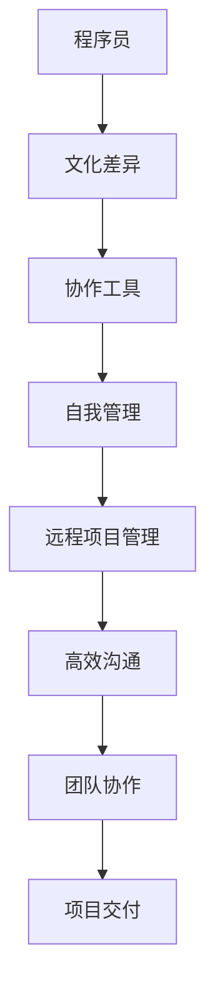

                 

关键词：国际远程工作、程序员的挑战、协作工具、文化差异、高效沟通、远程项目管理、虚拟团队、在线协作平台。

> 摘要：随着全球化的深入发展，越来越多的程序员选择或被安排在国际远程环境中工作。本文将探讨国际远程工作对程序员带来的挑战，以及如何利用协作工具、文化差异意识、高效沟通技巧和远程项目管理方法来提高远程工作的效率。

## 1. 背景介绍

在当今世界，国际远程工作已经成为一种普遍现象。远程工作的兴起得益于互联网技术的飞速发展和全球化进程的加速。对于程序员来说，国际远程工作不仅提供了更多的职业机会，还带来了新的挑战。

首先，程序员需要面对跨时区、跨文化的沟通问题。不同地区的时间差异和语言障碍可能会影响项目进度和团队协作。其次，国际远程工作要求程序员具备较强的自我管理能力和适应能力，以应对不同的工作环境和节奏。此外，文化差异也可能导致误解和冲突，影响团队的和谐。

## 2. 核心概念与联系

为了更好地理解国际远程工作中面临的问题，我们需要了解一些核心概念：

### 2.1. 跨文化沟通

跨文化沟通指的是在不同文化背景下进行的交流。文化差异可以包括语言、价值观、行为习惯等方面。有效的跨文化沟通需要双方对文化差异有一定的认识和敏感度，以及适当的沟通策略。

### 2.2. 协作工具

协作工具是国际远程工作中不可或缺的一部分。这些工具包括即时通讯软件、项目管理工具、代码协作平台等。选择合适的协作工具可以提高团队协作效率和项目进度。

### 2.3. 自我管理能力

自我管理能力是指程序员在远程工作中自我监督、自我激励和自我调整的能力。良好的自我管理能力可以帮助程序员更好地适应远程工作的节奏和压力。

### 2.4. 远程项目管理

远程项目管理涉及到如何规划、执行、监控和关闭远程项目。远程项目管理需要灵活的策略和高效的方法，以确保项目顺利进行。

### 2.5. Mermaid 流程图

下面是一个简化的 Mermaid 流程图，展示了国际远程工作中涉及的关键环节：



## 3. 核心算法原理 & 具体操作步骤

### 3.1 算法原理概述

国际远程工作的核心算法原理可以概括为以下几点：

1. **跨文化沟通策略**：了解并尊重不同文化的差异，采用适当的沟通方式。
2. **协作工具选择**：根据项目需求选择合适的协作工具，并确保团队成员熟悉和使用这些工具。
3. **自我管理技巧**：制定合理的工作计划，保持高效的工作状态。
4. **远程项目管理方法**：采用适合远程工作的项目管理方法，确保项目进度和质量。
5. **高效沟通技巧**：建立有效的沟通渠道，提高信息传递效率。

### 3.2 算法步骤详解

#### 3.2.1 跨文化沟通策略

1. **文化差异识别**：通过调研和交流，了解不同文化的特点。
2. **沟通方式调整**：根据文化差异调整沟通方式，如使用书面沟通、避免使用过于直接的语言等。
3. **文化敏感度培训**：为团队成员提供文化差异培训，提高跨文化沟通能力。

#### 3.2.2 协作工具选择

1. **需求分析**：分析项目需求，确定所需的协作工具类型。
2. **工具评估**：根据需求评估不同协作工具的优缺点。
3. **工具选择**：选择最适合项目的协作工具，并确保团队成员熟悉和使用这些工具。

#### 3.2.3 自我管理技巧

1. **目标设定**：设定明确的工作目标，提高工作积极性。
2. **时间管理**：合理安排工作时间，避免拖延。
3. **情绪管理**：保持积极的心态，应对远程工作中的压力。

#### 3.2.4 远程项目管理方法

1. **项目规划**：制定详细的项目计划，明确项目目标和时间表。
2. **任务分配**：根据团队成员的能力和特长分配任务。
3. **进度监控**：定期检查项目进度，及时调整计划。

#### 3.2.5 高效沟通技巧

1. **沟通渠道建设**：建立有效的沟通渠道，如定期会议、即时通讯等。
2. **信息传递清晰**：确保信息传递清晰明了，避免误解。
3. **反馈机制**：建立有效的反馈机制，及时解决问题。

### 3.3 算法优缺点

#### 优点：

1. **提高团队协作效率**：协作工具和高效的沟通技巧有助于提高团队协作效率。
2. **降低沟通成本**：跨文化沟通策略和高效的沟通技巧有助于降低沟通成本。
3. **提高项目质量**：远程项目管理方法和自我管理技巧有助于提高项目质量。

#### 缺点：

1. **时区差异**：时区差异可能导致沟通效率降低。
2. **文化冲突**：文化差异可能导致误解和冲突。
3. **管理难度**：远程项目管理需要更高的管理难度。

### 3.4 算法应用领域

国际远程工作算法适用于以下领域：

1. **软件开发**：软件开发团队往往采用远程工作模式，国际远程工作算法有助于提高团队协作效率和项目质量。
2. **技术咨询**：技术咨询团队需要与不同地区的客户进行沟通，国际远程工作算法有助于提高沟通效率和项目成功率。
3. **教育培训**：在线教育平台和远程培训机构采用国际远程工作模式，国际远程工作算法有助于提高教学质量。

## 4. 数学模型和公式 & 详细讲解 & 举例说明

### 4.1 数学模型构建

国际远程工作的数学模型可以构建为一个多维函数，其中每个维度代表不同的因素。例如，我们可以定义以下数学模型：

\[ F(x, y, z) = \alpha \cdot (x \cdot \text{沟通效率}) + \beta \cdot (y \cdot \text{协作效率}) + \gamma \cdot (z \cdot \text{项目质量}) \]

其中，\( x \)、\( y \) 和 \( z \) 分别代表沟通效率、协作效率和项目质量，\( \alpha \)、\( \beta \) 和 \( \gamma \) 是相应的权重系数。

### 4.2 公式推导过程

公式的推导过程可以从以下几个方面进行：

1. **沟通效率**：沟通效率可以表示为沟通时间与工作时间的比值。设 \( t_1 \) 为沟通时间，\( t_2 \) 为工作时间，则沟通效率为 \( \frac{t_2}{t_1} \)。
2. **协作效率**：协作效率可以表示为团队成员之间的协作质量与工作量的比值。设 \( q_1 \) 为协作质量，\( q_2 \) 为工作量，则协作效率为 \( \frac{q_1}{q_2} \)。
3. **项目质量**：项目质量可以表示为项目的完成度与项目目标的比值。设 \( p_1 \) 为完成度，\( p_2 \) 为项目目标，则项目质量为 \( \frac{p_1}{p_2} \)。

将这些因素结合起来，我们可以得到国际远程工作的数学模型：

\[ F(x, y, z) = \alpha \cdot \left( \frac{t_2}{t_1} \right) + \beta \cdot \left( \frac{q_1}{q_2} \right) + \gamma \cdot \left( \frac{p_1}{p_2} \right) \]

### 4.3 案例分析与讲解

假设我们有一个远程软件开发项目，沟通效率为 0.8，协作效率为 0.9，项目质量为 0.85。根据上述数学模型，我们可以计算出项目的整体效率：

\[ F(0.8, 0.9, 0.85) = \alpha \cdot (0.8 \cdot 0.8) + \beta \cdot (0.9 \cdot 0.9) + \gamma \cdot (0.85 \cdot 0.85) \]

为了具体计算，我们需要给每个因素分配权重系数。假设 \( \alpha = 0.3 \)，\( \beta = 0.4 \)，\( \gamma = 0.3 \)，则：

\[ F(0.8, 0.9, 0.85) = 0.3 \cdot (0.8 \cdot 0.8) + 0.4 \cdot (0.9 \cdot 0.9) + 0.3 \cdot (0.85 \cdot 0.85) \]
\[ F(0.8, 0.9, 0.85) = 0.192 + 0.324 + 0.2475 \]
\[ F(0.8, 0.9, 0.85) = 0.7635 \]

因此，项目的整体效率为 0.7635，表示项目在沟通、协作和项目质量方面的表现相对较好。

## 5. 项目实践：代码实例和详细解释说明

### 5.1 开发环境搭建

在本节中，我们将搭建一个简单的远程协作开发环境。假设我们选择使用 Git 进行版本控制，GitHub 作为代码托管平台，以及 Jira 作为项目管理工具。

1. **安装 Git**：在本地计算机上安装 Git。可以使用以下命令：
   ```bash
   sudo apt-get install git
   ```
2. **注册 GitHub 账号**：在 [GitHub](https://github.com/) 官网上注册账号。
3. **创建仓库**：在 GitHub 上创建一个新仓库，用于存放项目代码。
4. **克隆仓库**：使用以下命令克隆仓库到本地计算机：
   ```bash
   git clone https://github.com/username/repository.git
   ```
5. **安装 Jira**：在团队中安装 Jira。Jira 是一个流行的项目管理工具，可以帮助团队管理任务和项目进度。

### 5.2 源代码详细实现

在本节中，我们将实现一个简单的远程协作项目——一个基于 Python 的待办事项列表应用。以下是项目的核心代码：

```python
import os

# 待办事项列表
tasks = []

# 添加任务
def add_task(task_name):
    tasks.append(task_name)
    print(f"已添加任务：{task_name}")

# 完成任务
def complete_task(task_index):
    if 0 <= task_index < len(tasks):
        completed_task = tasks.pop(task_index)
        print(f"已完成任务：{completed_task}")
    else:
        print("任务索引无效。")

# 列出所有任务
def list_tasks():
    print("待办事项：")
    for i, task in enumerate(tasks):
        print(f"{i + 1}. {task}")

# 主函数
def main():
    while True:
        print("\n待办事项应用")
        print("1. 添加任务")
        print("2. 完成任务")
        print("3. 列出所有任务")
        print("4. 退出")
        choice = input("请输入选项：")

        if choice == "1":
            task_name = input("请输入任务名称：")
            add_task(task_name)
        elif choice == "2":
            task_index = int(input("请输入任务索引："))
            complete_task(task_index)
        elif choice == "3":
            list_tasks()
        elif choice == "4":
            print("谢谢使用！")
            break
        else:
            print("无效选项。")

if __name__ == "__main__":
    main()
```

### 5.3 代码解读与分析

上述代码实现了一个简单的待办事项列表应用，主要包括以下功能：

1. **添加任务**：用户可以添加新的任务到待办事项列表。
2. **完成任务**：用户可以选择一个任务并标记为已完成。
3. **列出所有任务**：用户可以查看当前的所有任务。
4. **退出程序**：用户可以退出待办事项应用。

代码使用 Python 编写，结构清晰，易于维护。通过简单的命令行交互，用户可以方便地使用应用。

### 5.4 运行结果展示

以下是运行结果的示例：

```bash
待办事项应用
1. 添加任务
2. 完成任务
3. 列出所有任务
4. 退出
请输入选项：1
请输入任务名称：购买牛奶
已添加任务：购买牛奶
待办事项应用
1. 添加任务
2. 完成任务
3. 列出所有任务
4. 退出
请输入选项：2
请输入任务索引：1
已完成任务：购买牛奶
待办事项应用
1. 添加任务
2. 完成任务
3. 列出所有任务
4. 退出
请输入选项：3
待办事项：
1. 添加任务
2. 完成任务
3. 列出所有任务
4. 退出
请输入选项：4
谢谢使用！
```

## 6. 实际应用场景

### 6.1 远程软件开发团队

远程软件开发团队是国际远程工作的典型应用场景之一。团队成员可能分布在不同国家和地区，使用不同的编程语言和工具。在这种情况下，协作工具和高效的沟通技巧显得尤为重要。

例如，一个跨国软件公司可能使用 Git 进行版本控制，GitHub 进行代码托管，Jira 进行项目管理，Slack 进行即时通讯，Zoom 进行视频会议。通过这些工具，团队成员可以实时交流、协同工作，提高项目效率。

### 6.2 在线教育平台

在线教育平台也广泛应用了国际远程工作模式。教师和学生可能分布在不同的国家和地区，通过在线课程和远程教学工具进行互动。

例如，一个在线教育平台可能使用 Moodle 作为课程管理系统，Zoom 进行视频课程直播，Miro 进行在线协作和白板。教师可以通过这些工具发布课程内容、布置作业、批改作业，与学生进行实时互动。

### 6.3 咨询服务公司

咨询服务公司经常需要为不同地区的客户提供远程服务。国际远程工作模式使得咨询服务公司可以更灵活地为客户提供服务。

例如，一家国际咨询服务公司可能使用 Microsoft Teams 进行团队协作和沟通，SharePoint 进行文档共享和存储，LinkedIn 进行市场调研。通过这些工具，公司可以高效地为客户提供咨询服务，提高客户满意度。

## 7. 工具和资源推荐

### 7.1 学习资源推荐

1. **《远程工作的艺术》**：这本书提供了关于远程工作的最佳实践和技巧，适合初学者和有经验的远程工作者。
2. **《程序员职业生涯指南》**：这本书涵盖了程序员职业生涯的各个方面，包括远程工作的技巧和策略。

### 7.2 开发工具推荐

1. **Git**：版本控制系统，用于管理代码版本。
2. **GitHub**：代码托管平台，提供 Git 功能，支持团队协作。
3. **Jira**：项目管理工具，用于任务分配、进度跟踪和问题报告。
4. **Slack**：即时通讯工具，支持团队沟通和协作。
5. **Zoom**：视频会议工具，用于远程会议和培训。

### 7.3 相关论文推荐

1. **“Remote Work: Challenges and Opportunities”**：这篇论文探讨了远程工作带来的挑战和机遇，对远程工作有较全面的论述。
2. **“Cultural Differences in Remote Work”**：这篇论文分析了文化差异对远程工作的影响，提供了跨文化沟通的策略。

## 8. 总结：未来发展趋势与挑战

### 8.1 研究成果总结

国际远程工作在近年来得到了广泛研究和应用。研究表明，远程工作可以提高工作效率、减少通勤时间、降低企业运营成本。同时，远程工作也带来了新的挑战，如跨文化沟通、时间管理、项目管理等。

### 8.2 未来发展趋势

1. **技术进步**：随着人工智能、虚拟现实等技术的发展，远程工作体验将得到进一步提升。
2. **灵活办公**：越来越多的企业将采用灵活办公模式，允许员工选择适合自己的工作地点和时间。
3. **全球协作**：国际远程工作将进一步推动全球协作，促进不同国家和地区之间的交流与合作。

### 8.3 面临的挑战

1. **沟通障碍**：跨文化沟通和时间差异可能导致沟通效率降低。
2. **管理难度**：远程项目管理需要更高的管理难度和策略。
3. **个人适应能力**：远程工作要求员工具备更强的自我管理能力和适应能力。

### 8.4 研究展望

未来研究应重点关注以下方向：

1. **跨文化沟通**：探索更有效的跨文化沟通策略，提高远程工作协作效率。
2. **远程项目管理**：研究适用于远程工作的项目管理方法，提高项目质量。
3. **个人发展**：关注远程工作对个人发展的影响，提供相应的培训和支持。

## 9. 附录：常见问题与解答

### 9.1 如何解决跨文化沟通问题？

**解答**：了解和尊重不同文化的特点，采用适当的沟通方式。例如，使用书面沟通减少误解，避免使用过于直接的语言。此外，可以为团队成员提供跨文化沟通培训，提高跨文化沟通能力。

### 9.2 远程项目管理有哪些难点？

**解答**：远程项目管理的主要难点包括沟通障碍、进度控制和团队协调。为解决这些问题，可以使用项目管理工具（如 Jira）进行任务分配和进度跟踪，定期召开远程会议，确保团队沟通畅通。

### 9.3 如何保持高效的工作状态？

**解答**：保持高效的工作状态需要良好的时间管理和自我管理。制定合理的工作计划，避免拖延，保持积极的心态。此外，定期休息和锻炼，有助于提高工作效率。

### 9.4 远程工作对个人发展有何影响？

**解答**：远程工作可能对个人发展产生积极和消极的影响。积极方面，远程工作提供了更多职业机会，有助于提高工作效率和自我管理能力。消极方面，远程工作可能缺乏面对面交流，影响个人社交能力和团队凝聚力。

## 作者署名

作者：禅与计算机程序设计艺术 / Zen and the Art of Computer Programming

