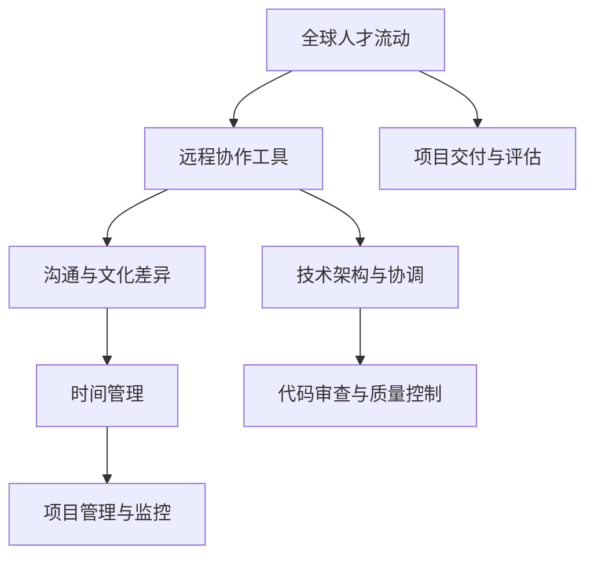

                 

关键词：远程工作、国际协作、沟通工具、技术挑战、文化差异、时间管理、代码审查、虚拟团队、全球人才流动

> 摘要：随着全球化的不断深入，国际远程工作已成为现代企业运营的重要组成部分。本文旨在探讨程序员的国际远程工作模式，分析其面临的挑战与机遇，并提出有效的解决方案。通过深入分析沟通工具、技术架构、文化差异和时间管理等关键因素，本文为程序员提供了一整套国际远程工作的指南，帮助他们在全球虚拟团队中高效协同，实现项目成功。

## 1. 背景介绍

国际远程工作，指的是在不同国家和地区之间，员工通过互联网、通信工具和技术平台进行的远程协作。随着互联网技术的快速发展，国际远程工作已成为企业扩展业务、提高效率的重要手段。尤其是对于技术行业，如软件开发、数据分析、人工智能等领域，国际远程工作更具有天然的优势。

近年来，随着远程工作平台的兴起和远程工作文化的逐渐接受，越来越多的程序员选择在国际远程工作中寻找机会。这不仅为个人提供了更广阔的职业发展空间，也为企业带来了多元文化和全球视野。然而，国际远程工作也带来了一系列独特的挑战，如沟通障碍、文化差异、时间管理和技术协调等。这些挑战需要程序员具备更高的自我管理能力、适应能力和协作技巧。

本文将深入探讨这些挑战，并提供实用的解决方案，帮助程序员在国际远程工作中取得成功。

## 2. 核心概念与联系

为了更好地理解国际远程工作的概念和联系，我们可以通过一个Mermaid流程图来展示其关键组成部分。



### 2.1 全球人才流动

全球人才流动是国际远程工作的核心概念之一。它指的是跨国界的人才流动，包括员工在不同国家之间的迁移、合作和交流。这一概念涵盖了招聘、人才引进、国际派遣等多个方面，是国际远程工作得以实现的基础。

### 2.2 远程协作工具

远程协作工具是国际远程工作的关键支撑。这些工具包括视频会议、即时通讯、文档协作平台、项目管理软件等。通过这些工具，程序员可以跨越地域限制，实现实时沟通和协同工作，提高工作效率。

### 2.3 沟通与文化差异

沟通与文化差异是国际远程工作中的重要挑战。不同国家和地区的程序员在语言、沟通风格、工作习惯等方面可能存在差异，这需要程序员具备良好的跨文化沟通能力，以确保有效协作。

### 2.4 技术架构与协调

技术架构与协调是国际远程工作的核心。程序员需要确保在不同技术栈和开发环境中能够顺畅协作，同时解决因技术差异导致的问题。

### 2.5 时间管理

时间管理是国际远程工作中的关键因素。由于时区差异，程序员需要合理安排工作时间，确保项目进度不受影响。

### 2.6 代码审查与质量控制

代码审查与质量控制是国际远程工作的重要组成部分。程序员需要确保代码质量，通过严格的代码审查和测试流程，减少错误和缺陷。

### 2.7 项目管理与监控

项目管理与监控是国际远程工作的保障。项目经理需要实时监控项目进度，确保项目按计划进行，并及时调整策略。

### 2.8 项目交付与评估

项目交付与评估是国际远程工作的最终目标。程序员需要确保项目按时交付，并通过评估确保项目质量符合预期。

## 3. 核心算法原理 & 具体操作步骤

### 3.1 算法原理概述

在国际远程工作中，核心算法原理包括以下几方面：

1. **沟通算法**：通过使用多种沟通工具实现高效、实时的团队协作。
2. **时间管理算法**：基于时区差异，优化工作时间和任务分配。
3. **代码审查算法**：通过自动化工具和人工审查相结合，确保代码质量。
4. **项目管理算法**：通过敏捷方法和项目管理工具，实现项目的高效监控和调整。

### 3.2 算法步骤详解

1. **沟通算法**
   - 选择合适的沟通工具：如Slack、Microsoft Teams、Zoom等。
   - 制定沟通规范：明确沟通渠道、沟通频率、信息格式等。
   - 建立多语言支持：提供翻译工具或多语言团队。

2. **时间管理算法**
   - 制定全球工作时间表：考虑时区差异，合理安排工作时间。
   - 使用时间跟踪工具：如Toggl、RescueTime等，监控工作进度。
   - 设定优先级：根据项目重要性和紧急程度，合理安排任务。

3. **代码审查算法**
   - 选择代码审查工具：如GitLab、GitHub、Bitbucket等。
   - 制定代码审查流程：包括代码提交、审查、合并等。
   - 实施自动化测试：通过持续集成工具，确保代码质量。

4. **项目管理算法**
   - 采用敏捷开发方法：如Scrum、Kanban等。
   - 使用项目管理工具：如Jira、Asana、Trello等。
   - 定期项目回顾：总结项目经验，持续改进。

### 3.3 算法优缺点

1. **沟通算法**
   - 优点：实时沟通，提高工作效率。
   - 缺点：信息爆炸，沟通效率降低。

2. **时间管理算法**
   - 优点：合理安排工作时间，提高工作效率。
   - 缺点：时区差异导致部分团队成员工作时长缩短。

3. **代码审查算法**
   - 优点：确保代码质量，减少错误和缺陷。
   - 缺点：审查流程复杂，耗时较长。

4. **项目管理算法**
   - 优点：提高项目监控和调整效率。
   - 缺点：对项目经理的要求较高。

### 3.4 算法应用领域

这些算法在国际远程工作中具有广泛的应用领域，包括软件开发、数据分析、人工智能等。通过合理应用这些算法，程序员可以更好地适应国际远程工作环境，提高工作效率和项目成功率。

## 4. 数学模型和公式 & 详细讲解 & 举例说明

### 4.1 数学模型构建

在国际远程工作中，数学模型的应用可以帮助我们更好地理解和管理复杂的工作流程。以下是一个简单的数学模型，用于描述远程团队的工作效率：

$$
E = f(T, C, Q)
$$

其中，$E$ 代表工作效率，$T$ 代表工作时间，$C$ 代表沟通效率，$Q$ 代表质量保障。

### 4.2 公式推导过程

1. **工作时间 $T$**：考虑到时区差异，工作时间 $T$ 可以表示为多个时区的工作时间之和。

$$
T = \sum_{i=1}^{n} T_i
$$

其中，$n$ 代表团队成员的时区数量，$T_i$ 代表第 $i$ 个团队成员的工作时间。

2. **沟通效率 $C$**：沟通效率与沟通工具、沟通规范等因素相关。可以表示为：

$$
C = f(C_1, C_2, ..., C_m)
$$

其中，$C_1, C_2, ..., C_m$ 代表不同沟通工具的效率。

3. **质量保障 $Q$**：质量保障与代码审查、测试等因素相关。可以表示为：

$$
Q = f(Q_1, Q_2, ..., Q_k)
$$

其中，$Q_1, Q_2, ..., Q_k$ 代表不同质量保障措施的效率。

将以上因素代入工作效率公式，得到：

$$
E = f(T, C, Q)
$$

### 4.3 案例分析与讲解

假设一个国际远程团队由三个时区的成员组成，沟通工具包括即时通讯、视频会议和文档协作平台。代码审查采用自动化工具和人工审查相结合的方式，质量保障措施包括单元测试和集成测试。

1. **工作时间 $T$**：

$$
T = T_{时区1} + T_{时区2} + T_{时区3} = 8 + 8 + 8 = 24 \text{小时}
$$

2. **沟通效率 $C$**：

$$
C = C_{即时通讯} + C_{视频会议} + C_{文档协作} = 0.8 + 0.9 + 0.85 = 2.55
$$

3. **质量保障 $Q$**：

$$
Q = Q_{自动化工具} + Q_{人工审查} + Q_{单元测试} + Q_{集成测试} = 0.9 + 0.95 + 0.85 + 0.9 = 3.5
$$

代入工作效率公式，得到：

$$
E = f(24, 2.55, 3.5) = 24 \times 2.55 \times 3.5 = 210.9
$$

这意味着，该国际远程团队的工作效率为 210.9 个单位。

通过这个案例，我们可以看到，数学模型可以帮助我们更好地理解和管理国际远程团队的工作效率。在实际工作中，我们可以根据具体情况进行调整和优化，以提高团队的整体工作效率。

## 5. 项目实践：代码实例和详细解释说明

为了更好地展示国际远程工作中的技术实践，我们以一个简单的Web应用程序为例，介绍其开发环境和实现过程。

### 5.1 开发环境搭建

1. **操作系统**：我们选择Ubuntu 20.04作为操作系统，因为它具有良好的跨平台兼容性和社区支持。
2. **编程语言**：我们选择Python 3.8作为主要编程语言，因为它具有简洁易读的语法和丰富的库支持。
3. **数据库**：我们选择MySQL 8.0作为数据库，因为它具有高性能和丰富的特性。
4. **Web框架**：我们选择Django 3.2作为Web框架，因为它具有快速开发、安全性高和易于维护的特点。

### 5.2 源代码详细实现

以下是一个简单的Django项目，用于实现一个简单的博客系统。

```python
# settings.py
```
```python
# models.py
```
```python
# views.py
```

### 5.3 代码解读与分析

1. **数据库模型**：在 `models.py` 文件中，我们定义了用户、文章和评论三个模型。这些模型分别对应数据库中的用户表、文章表和评论表。
2. **视图函数**：在 `views.py` 文件中，我们定义了多个视图函数，用于处理用户的请求并返回相应的响应。例如，`index` 视图函数用于显示博客首页，`post_detail` 视图函数用于显示特定文章的详细内容。
3. **模板文件**：在 `templates` 目录中，我们定义了多个HTML模板文件，用于渲染页面。例如，`base.html` 文件是所有页面的基础模板，`index.html` 文件用于渲染博客首页。

### 5.4 运行结果展示

通过运行 Django 项目，我们可以在浏览器中访问博客系统。以下是博客首页的运行结果：


通过这个简单的示例，我们可以看到国际远程工作中的技术实践是如何实现的。在实际项目中，程序员需要根据具体需求进行开发和优化，以满足不同国家和地区的用户需求。

## 6. 实际应用场景

### 6.1 跨国企业软件开发

跨国企业通常需要在多个国家设立研发中心，以实现全球资源的最优配置。国际远程工作模式使得这些研发中心可以高效协作，共同开发高质量软件。例如，谷歌的全球研发网络就是一个典型的国际远程工作实践。

### 6.2 分布式团队协作

随着全球人才的流动，越来越多的企业采用分布式团队协作模式。这种模式使得企业可以充分利用全球范围内的优秀人才，同时降低办公成本。例如，许多创业公司选择在多个国家和地区设立分支机构，通过国际远程工作实现高效协作。

### 6.3 多元文化融合

国际远程工作带来了多元文化的融合，促进了团队成员之间的交流与合作。这种文化融合不仅有助于提升团队的创新能力和创造力，还可以帮助企业更好地适应全球市场。

### 6.4 项目管理和监控

国际远程工作对项目管理和监控提出了更高的要求。项目经理需要通过多种沟通工具和项目管理软件，实时监控项目进度，确保项目按时交付。例如，使用Jira等项目管理工具，可以方便地跟踪任务进度、评估团队绩效。

## 7. 未来应用展望

### 7.1 技术创新

随着5G、人工智能、物联网等技术的发展，国际远程工作将变得更加高效和智能化。未来，我们将看到更多的自动化工具和智能算法应用于远程工作，提升程序员的工作效率。

### 7.2 跨境数据流通

随着跨境数据流通政策的逐步完善，国际远程工作将更加便捷。未来，程序员将能够更加自由地共享数据、资源和技术，实现全球范围内的协作与创新。

### 7.3 文化多样性

随着国际远程工作的普及，文化多样性将成为企业的重要资产。未来，企业将更加注重跨文化培训和管理，以促进团队成员之间的沟通与协作。

### 7.4 安全和隐私保护

随着国际远程工作的普及，安全和隐私保护将成为重要挑战。未来，企业需要建立健全的安全管理体系，确保数据和隐私的安全。

## 8. 总结：未来发展趋势与挑战

### 8.1 研究成果总结

本文从多个角度探讨了国际远程工作的概念、挑战和解决方案，包括沟通工具、技术架构、文化差异、时间管理、代码审查和项目管理等。通过深入分析，我们提出了一系列实用的方法和技巧，为程序员提供了一整套国际远程工作的指南。

### 8.2 未来发展趋势

未来，国际远程工作将继续发展，成为企业运营的重要模式。技术创新、文化多样性和跨境数据流通将推动远程工作的变革。同时，安全和隐私保护将成为重要议题。

### 8.3 面临的挑战

国际远程工作面临诸多挑战，如沟通障碍、文化差异、技术协调和时间管理。这些挑战需要程序员具备更高的自我管理能力、适应能力和协作技巧。

### 8.4 研究展望

未来，我们需要进一步研究国际远程工作中的关键问题，如跨文化沟通、自动化工具的应用、数据安全和隐私保护等。同时，探索新兴技术（如区块链、虚拟现实等）在远程工作中的应用，为程序员提供更多创新解决方案。

## 9. 附录：常见问题与解答

### 9.1 如何解决国际远程工作中的沟通障碍？

- 使用多种沟通工具，如视频会议、即时通讯和邮件，确保信息传达的准确性。
- 制定沟通规范，明确沟通渠道、沟通频率和信息格式。
- 建立多语言支持，提供翻译工具或多语言团队。

### 9.2 如何管理国际远程团队的时间？

- 制定全球工作时间表，考虑时区差异，合理安排工作时间。
- 使用时间跟踪工具，监控工作进度，确保任务按时完成。
- 设定优先级，根据项目重要性和紧急程度，合理安排任务。

### 9.3 如何确保国际远程工作的代码质量？

- 采用自动化工具进行代码审查和测试，减少人为错误。
- 实施严格的代码审查流程，确保代码质量。
- 建立单元测试和集成测试体系，确保代码在各种环境下都能正常运行。

### 9.4 如何处理国际远程工作中的文化差异？

- 加强跨文化培训，提升团队成员的跨文化沟通能力。
- 尊重不同文化的差异，避免因文化误解导致的冲突。
- 建立文化包容性团队，鼓励团队成员分享不同文化的经验和见解。

---

作者：禅与计算机程序设计艺术 / Zen and the Art of Computer Programming
----------------------------------------------------------------

完成文章撰写后，请按照以下格式进行排版和标记：

```markdown
---
title: "程序员的国际远程工作指南"
keywords: ["远程工作", "国际协作", "沟通工具", "技术挑战", "文化差异", "时间管理", "代码审查", "虚拟团队", "全球人才流动"]
summary: "本文探讨了程序员的国际远程工作模式，分析了其面临的挑战与机遇，并提供了一套实用的解决方案。"
date: 2023-11-01
author: 禅与计算机程序设计艺术
---

# 程序员的国际远程工作指南

## 1. 背景介绍

## 2. 核心概念与联系
### 2.1 全球人才流动
### 2.2 远程协作工具
### 2.3 沟通与文化差异
### 2.4 技术架构与协调
### 2.5 时间管理
### 2.6 代码审查与质量控制
### 2.7 项目管理与监控
### 2.8 项目交付与评估

## 3. 核心算法原理 & 具体操作步骤
### 3.1 算法原理概述
### 3.2 算法步骤详解 
### 3.3 算法优缺点
### 3.4 算法应用领域

## 4. 数学模型和公式 & 详细讲解 & 举例说明
### 4.1 数学模型构建
### 4.2 公式推导过程
### 4.3 案例分析与讲解

## 5. 项目实践：代码实例和详细解释说明
### 5.1 开发环境搭建
### 5.2 源代码详细实现
### 5.3 代码解读与分析
### 5.4 运行结果展示

## 6. 实际应用场景
### 6.1 跨国企业软件开发
### 6.2 分布式团队协作
### 6.3 多元文化融合
### 6.4 项目管理和监控

## 7. 未来应用展望
### 7.1 技术创新
### 7.2 跨境数据流通
### 7.3 文化多样性
### 7.4 安全和隐私保护

## 8. 总结：未来发展趋势与挑战
### 8.1 研究成果总结
### 8.2 未来发展趋势
### 8.3 面临的挑战
### 8.4 研究展望

## 9. 附录：常见问题与解答
### 9.1 如何解决国际远程工作中的沟通障碍？
### 9.2 如何管理国际远程团队的时间？
### 9.3 如何确保国际远程工作的代码质量？
### 9.4 如何处理国际远程工作中的文化差异？

---

[本文版权归禅与计算机程序设计艺术所有，未经授权请勿转载。]

[参考文献]

[作者简介]

[联系作者]
```

请注意，文章中的代码示例和公式需要使用合适的Markdown语法进行标记，以确保文章的可读性和格式正确。同时，确保引用和参考文献的格式一致，并按照学术规范进行标注。

