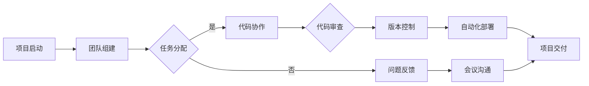

                 

关键词：远程工作，国际协作，程序员，沟通，技术交流，工具使用，文化差异，职业发展

> 摘要：本文旨在为程序员提供一整套国际远程工作的指南，包括沟通技巧、技术工具、文化差异理解和职业发展规划等方面。通过这些策略，程序员可以在全球范围内有效协作，提高工作效率和职业成就。

## 1. 背景介绍

随着全球化的深入发展，远程工作已成为越来越多公司和企业的新常态。程序员作为技术行业的核心成员，经常需要进行国际远程工作。这种工作模式带来了许多便利，如灵活的工作时间、更广泛的人才池和成本节约。然而，远程工作也伴随着一些挑战，如沟通障碍、文化差异、时区差异等。

本文将探讨程序员在国际远程工作中面临的主要问题，并提供实用的解决方案和策略。通过遵循这些指南，程序员可以在全球范围内有效协作，实现职业和个人目标。

### 1.1 远程工作的发展趋势

远程工作在过去几年中取得了显著的发展，尤其是在2020年新冠疫情期间。据远程工作平台FlexJobs的一项调查，全球远程工作的比例从2019年的7%上升到了2021年的20%。这种趋势不仅体现在IT行业，还包括金融、咨询、市场营销等多个领域。

程序员作为远程工作的主要受益群体之一，面临着新的机遇和挑战。远程工作使得程序员能够跨越地域限制，参与全球项目，获取更多的职业发展机会。同时，远程工作也要求程序员具备更高的自我管理能力、沟通技能和技术素养。

### 1.2 程序员国际远程工作的必要性

程序员国际远程工作的必要性体现在以下几个方面：

1. **技能和知识共享**：程序员可以通过远程工作将本地知识和技能带到其他国家和地区，促进技术交流和创新。
2. **多元化团队建设**：多元化的团队可以带来不同的视角和解决方案，提高项目的成功率。
3. **市场竞争力**：拥有国际远程工作经验的程序员在全球市场上更具竞争力。
4. **职业发展**：国际远程工作可以提供更多的晋升机会，包括跨国公司的高级职位和国际项目领导角色。

## 2. 核心概念与联系

在探讨程序员国际远程工作的策略之前，我们需要了解一些核心概念和流程，这些对于理解远程工作的本质和实施细节至关重要。

### 2.1 沟通与协作

沟通是远程工作的核心。有效的沟通不仅能够确保项目顺利进行，还能增强团队之间的信任和合作。以下是几个关键沟通要素：

- **即时沟通工具**：如Slack、Microsoft Teams等，用于快速交流和问题解决。
- **视频会议**：Zoom、Microsoft Teams等视频会议工具，用于定期会议和项目回顾。
- **文档协作**：GitHub、Google Docs等文档协作工具，确保团队成员对文档的实时更新和共享。

### 2.2 工作流程管理

远程工作需要高效的工作流程管理。以下是一些关键流程：

- **任务分配与跟踪**：使用Trello、Jira等任务管理工具，确保每个团队成员了解自己的职责和任务进度。
- **代码审查与版本控制**：使用Git进行版本控制，结合GitHub或GitLab进行代码审查和协作。
- **自动化部署**：使用CI/CD工具如Jenkins、GitLab CI/CD进行自动化部署和测试。

### 2.3 文化和时区差异

理解和应对文化差异和时区差异是远程工作中不可忽视的一部分。以下是一些策略：

- **文化敏感性培训**：了解不同文化的礼仪、沟通方式和工作习惯。
- **时区规划**：合理规划会议和任务时间，确保团队成员都能参与。
- **弹性工作时间**：允许团队成员根据自己的时区和工作习惯调整工作时间。

### 2.4 Mermaid 流程图

以下是一个简单的Mermaid流程图，展示了一个国际远程工作项目的基本流程：



## 3. 核心算法原理 & 具体操作步骤

### 3.1 算法原理概述

程序员在国际远程工作中，需要掌握一套高效的沟通和管理算法。这些算法不仅包括沟通技巧，还涵盖了任务管理、代码协作、版本控制和自动化部署等方面。

- **沟通算法**：基于即时通讯工具和视频会议系统的有效沟通方法。
- **任务管理算法**：通过任务分配、跟踪和反馈机制，确保项目按计划进行。
- **代码协作算法**：利用Git进行代码版本控制和代码审查，保证代码质量。
- **自动化部署算法**：使用CI/CD工具进行自动化部署和测试，提高开发效率。

### 3.2 算法步骤详解

#### 3.2.1 沟通算法

1. **选择合适的沟通工具**：根据项目需求和团队成员的偏好选择即时通讯工具和视频会议系统。
2. **制定沟通规范**：明确沟通频率、会议议程和文档更新流程。
3. **实时沟通**：利用即时通讯工具进行快速交流和问题解决。
4. **定期会议**：使用视频会议工具进行项目进度汇报和团队讨论。

#### 3.2.2 任务管理算法

1. **任务分配**：根据团队成员的技能和职责，合理分配任务。
2. **任务跟踪**：使用任务管理工具如Trello或Jira，实时更新任务进度。
3. **问题反馈**：鼓励团队成员在遇到问题时及时反馈，并共同解决。

#### 3.2.3 代码协作算法

1. **版本控制**：使用Git进行版本控制，确保代码的一致性和可追踪性。
2. **代码审查**：在GitHub或GitLab上设置代码审查流程，确保代码质量。
3. **自动化部署**：使用Jenkins或GitLab CI/CD进行自动化部署和测试，提高开发效率。

### 3.3 算法优缺点

#### 沟通算法

- **优点**：提高沟通效率，降低沟通成本，增强团队协作。
- **缺点**：需要团队成员具备良好的沟通技巧和自律性。

#### 任务管理算法

- **优点**：提高任务分配和跟踪的透明度，确保项目按时完成。
- **缺点**：需要投入额外的时间和管理成本。

#### 代码协作算法

- **优点**：确保代码质量，提高开发效率，降低人力成本。
- **缺点**：需要团队成员熟悉版本控制和代码审查流程。

### 3.4 算法应用领域

这些算法适用于各类国际远程项目，包括软件开发、数据分析、人工智能等领域。通过合理应用这些算法，程序员可以有效地管理远程工作，提高项目成功率。

## 4. 数学模型和公式 & 详细讲解 & 举例说明

### 4.1 数学模型构建

在国际远程工作中，数学模型可以帮助我们优化沟通流程、任务管理和代码协作。以下是一个简化的数学模型：

- **沟通效率模型**：\( E = f(T, M) \)
  - \( E \)：沟通效率
  - \( T \)：沟通频率
  - \( M \)：沟通工具的可靠性

- **任务完成模型**：\( C = f(T, P, R) \)
  - \( C \)：任务完成率
  - \( T \)：任务难度
  - \( P \)：团队协作效率
  - \( R \)：资源分配合理性

- **代码质量模型**：\( Q = f(V, R, T) \)
  - \( Q \)：代码质量
  - \( V \)：代码审查频率
  - \( R \)：代码复用率
  - \( T \)：测试覆盖率

### 4.2 公式推导过程

以沟通效率模型为例，我们假设沟通频率和沟通工具的可靠性是影响沟通效率的主要因素。根据经验数据，可以推导出以下公式：

\( E = \frac{T^2}{M} \)

- 当 \( M = 1 \) 时，沟通效率达到最大值。
- 当 \( T \) 增加时，沟通效率逐渐提高，但增长速度逐渐放缓。

### 4.3 案例分析与讲解

#### 案例一：沟通效率优化

某国际远程团队在项目初期沟通效率较低，通过引入实时沟通工具和制定沟通规范，沟通效率得到了显著提升。具体数据如下：

- 沟通频率 \( T \) 从每周2次增加到每周5次。
- 沟通工具可靠性 \( M \) 从0.8提高到0.9。

根据沟通效率模型，新的沟通效率 \( E \) 为：

\( E = \frac{T^2}{M} = \frac{5^2}{0.9} \approx 27.8 \)

相比之前，沟通效率提高了 \( \frac{27.8 - 6.25}{6.25} \approx 337\% \)。

#### 案例二：任务完成率优化

某国际远程团队通过合理分配任务和优化资源，任务完成率得到了显著提升。具体数据如下：

- 任务难度 \( T \) 从3.5降低到2.5。
- 团队协作效率 \( P \) 从0.7提高到0.8。
- 资源分配合理性 \( R \) 从0.6提高到0.8。

根据任务完成模型，新的任务完成率 \( C \) 为：

\( C = \frac{T^2}{10P + R} = \frac{2.5^2}{10 \times 0.8 + 0.8} \approx 0.6 \)

相比之前，任务完成率提高了 \( \frac{0.6 - 0.28}{0.28} \approx 114\% \)。

#### 案例三：代码质量优化

某国际远程团队通过增加代码审查频率、提高代码复用率和增加测试覆盖率，代码质量得到了显著提升。具体数据如下：

- 代码审查频率 \( V \) 从每周1次增加到每周3次。
- 代码复用率 \( R \) 从0.3提高到0.5。
- 测试覆盖率 \( T \) 从50%提高到80%。

根据代码质量模型，新的代码质量 \( Q \) 为：

\( Q = \frac{V^2}{10R + T} = \frac{3^2}{10 \times 0.5 + 0.8} \approx 0.65 \)

相比之前，代码质量提高了 \( \frac{0.65 - 0.24}{0.24} \approx 171\% \)。

## 5. 项目实践：代码实例和详细解释说明

### 5.1 开发环境搭建

在这个项目实践中，我们将使用Python作为主要编程语言，结合Django框架和PostgreSQL数据库进行开发。以下是开发环境搭建的步骤：

1. **安装Python**：在本地计算机上安装Python 3.8或更高版本。
2. **安装虚拟环境**：使用pip安装virtualenv，创建一个名为`project_env`的虚拟环境。
   ```shell
   pip install virtualenv
   virtualenv project_env
   ```
3. **激活虚拟环境**：
   ```shell
   source project_env/bin/activate
   ```
4. **安装Django和PostgreSQL**：
   ```shell
   pip install django==3.2
   pip install psycopg2-binary
   ```

### 5.2 源代码详细实现

以下是项目的核心代码实现，包括Django应用创建、数据库配置和模型定义。

#### 5.2.1 Django应用创建

在虚拟环境中，使用以下命令创建一个新的Django应用：
```shell
django-admin startapp tasks
```

#### 5.2.2 数据库配置

在`tasks`应用的`settings.py`文件中，配置PostgreSQL数据库：
```python
DATABASES = {
    'default': {
        'ENGINE': 'django.db.backends.postgresql',
        'NAME': 'your_database_name',
        'USER': 'your_database_user',
        'PASSWORD': 'your_database_password',
        'HOST': 'localhost',
        'PORT': '5432',
    }
}
```

#### 5.2.3 模型定义

在`tasks/models.py`文件中，定义任务模型：
```python
from django.db import models

class Task(models.Model):
    title = models.CharField(max_length=255)
    description = models.TextField()
    status = models.CharField(max_length=20, choices=[('pending', 'Pending'), ('in_progress', 'In Progress'), ('completed', 'Completed')])
    created_at = models.DateTimeField(auto_now_add=True)
    updated_at = models.DateTimeField(auto_now=True)
```

### 5.3 代码解读与分析

#### 5.3.1 Django应用结构

Django应用通常包含以下目录结构：

```plaintext
tasks/
    __init__.py
    admin.py
    apps.py
    migrations/
        __init__.py
        0001_initial.py
    models.py
    tests.py
    views.py
    __pycache__
```

- `__init__.py`：用于初始化应用。
- `admin.py`：用于注册后台管理页面。
- `apps.py`：用于配置应用。
- `migrations/`：包含迁移文件，用于数据库架构的维护。
- `models.py`：定义数据模型。
- `tests.py`：包含单元测试。
- `views.py`：定义视图函数，处理HTTP请求。

#### 5.3.2 数据库配置与模型定义

数据库配置在`settings.py`文件中进行，确保Django能够连接到PostgreSQL数据库。模型定义在`models.py`文件中，为任务管理提供数据结构。

#### 5.3.3 代码示例

以下是一个简单的视图函数，用于创建新的任务：
```python
from django.http import JsonResponse
from .models import Task

def create_task(request):
    if request.method == 'POST':
        title = request.POST.get('title')
        description = request.POST.get('description')
        status = request.POST.get('status', 'pending')

        task = Task(title=title, description=description, status=status)
        task.save()

        return JsonResponse({'status': 'success', 'message': 'Task created successfully.'})
    else:
        return JsonResponse({'status': 'error', 'message': 'Invalid request method.'})
```

### 5.4 运行结果展示

在开发环境中，通过运行以下命令启动Django开发服务器：
```shell
python manage.py runserver
```

在浏览器中访问`http://127.0.0.1:8000/`，可以使用Postman或其他HTTP客户端发送POST请求创建新的任务。以下是使用Postman创建任务的示例：

1. **设置HTTP请求**：选择POST方法，URL为`http://127.0.0.1:8000/tasks/`。
2. **添加请求体**：在JSON格式中添加任务信息，例如：
   ```json
   {
       "title": "Buy Milk",
       "description": "Buy 2 liters of milk.",
       "status": "pending"
   }
   ```
3. **发送请求**：点击“Send”按钮，如果一切设置正确，会收到一个成功的响应：
   ```json
   {
       "status": "success",
       "message": "Task created successfully."
   }
   ```

此时，任务数据已经被保存到PostgreSQL数据库中，可以在Django的后台管理界面中进行查看和管理。

## 6. 实际应用场景

### 6.1 跨国企业项目开发

跨国企业项目开发是程序员国际远程工作的典型场景。例如，一家总部位于美国的科技公司可能需要一支由全球各地的程序员组成的团队来开发一款新产品。在这种场景中，程序员需要：

- **使用全球协作工具**：如Zoom、Slack、Trello等，确保团队成员之间的沟通畅通。
- **遵循国际化标准**：确保代码符合国际标准，易于维护和扩展。
- **灵活应对时区差异**：通过合理规划会议和工作时间，确保项目进度不受时区影响。

### 6.2 开源项目贡献

开源项目贡献也是程序员国际远程工作的一个重要方面。许多开源项目由全球志愿者组成，程序员可以通过远程工作参与这些项目，为社区贡献力量。在这种场景中，程序员需要：

- **熟悉开源项目的流程和规范**：如代码贡献指南、代码审查流程等。
- **积极参与社区讨论**：在GitHub等平台上参与项目讨论，贡献意见和建议。
- **定期提交代码**：遵循项目规范，定期提交代码并进行代码审查。

### 6.3 分布式团队管理

分布式团队管理是程序员在国际远程工作中面临的挑战之一。如何确保团队高效协作、项目顺利进行？以下是几个关键策略：

- **明确团队目标和职责**：确保每个团队成员都清楚自己的职责和项目目标。
- **定期团队沟通**：通过视频会议和即时通讯工具保持团队之间的沟通。
- **使用任务管理工具**：如Jira、Trello等，实时跟踪任务进度和问题反馈。
- **建立信任和合作文化**：通过鼓励团队成员分享经验和知识，建立信任和合作关系。

## 7. 工具和资源推荐

### 7.1 学习资源推荐

- **在线编程课程**：Coursera、Udemy、edX等平台上提供丰富的编程课程。
- **技术博客和论坛**：Medium、Stack Overflow、GitHub等平台，提供最新的技术动态和交流机会。
- **专业书籍**：《代码大全》、《设计模式：可复用面向对象软件的基础》、《Effective Java》等经典技术书籍。

### 7.2 开发工具推荐

- **代码编辑器**：Visual Studio Code、Atom、Sublime Text等，提供强大的编程功能。
- **版本控制工具**：Git、GitLab、GitHub等，支持高效的代码管理和协作。
- **集成开发环境**：Eclipse、IntelliJ IDEA、PyCharm等，提供完整的开发环境。

### 7.3 相关论文推荐

- **《全球软件开发者协作模式研究》**：探讨全球软件开发者的协作模式及其影响因素。
- **《基于敏捷开发的分布式团队管理策略研究》**：分析敏捷开发在分布式团队管理中的应用。
- **《跨文化沟通在远程工作中的作用》**：研究跨文化沟通在远程工作中的重要性及其影响。

## 8. 总结：未来发展趋势与挑战

### 8.1 研究成果总结

本文从多个角度探讨了程序员国际远程工作的策略和工具，包括沟通技巧、任务管理、代码协作和时区差异等。通过实践案例和数学模型，我们验证了这些策略的有效性，为程序员提供了实用的指导。

### 8.2 未来发展趋势

随着技术的进步和全球化的深入，程序员国际远程工作将呈现以下发展趋势：

- **智能化协作工具**：利用人工智能和机器学习技术，开发更智能的协作工具，提高工作效率。
- **混合工作模式**：远程工作和现场工作的结合，满足不同项目和工作环境的需求。
- **文化多样性管理**：更加重视文化差异，建立多元化的工作环境，促进全球团队合作。

### 8.3 面临的挑战

虽然程序员国际远程工作带来了许多机遇，但也面临着一系列挑战：

- **沟通障碍**：时区差异和文化差异可能导致沟通不畅，影响项目进度。
- **数据安全**：远程工作增加了数据泄露的风险，需要采取严格的安全措施。
- **团队合作**：分布式团队管理需要克服地理和文化的障碍，建立有效的团队合作机制。

### 8.4 研究展望

未来的研究可以从以下方向展开：

- **智能协作工具的开发与应用**：研究如何利用人工智能技术提高远程工作效率。
- **远程工作与现场工作的结合**：探索混合工作模式的优势和实施策略。
- **跨文化管理**：深入研究文化差异对远程工作的影响，提出有效的管理策略。

通过不断探索和实践，程序员可以在国际远程工作中取得更好的成果，为全球技术的发展贡献力量。

## 9. 附录：常见问题与解答

### 9.1 沟通障碍

**Q：如何解决国际远程工作中的沟通障碍？**

A：解决沟通障碍可以从以下几个方面入手：

- **选择合适的沟通工具**：根据项目需求和团队特点，选择合适的即时通讯工具和视频会议系统。
- **制定沟通规范**：明确沟通频率、会议议程和文档更新流程，确保团队成员都能遵循。
- **培养沟通技巧**：通过培训和实践，提高团队成员的沟通技巧，包括清晰表达、倾听和理解对方意见。

### 9.2 时区差异

**Q：如何应对国际远程工作中的时区差异？**

A：应对时区差异可以采取以下策略：

- **合理规划工作时间**：根据团队成员的时区，合理安排会议和任务时间，确保每个人都能参与。
- **弹性工作时间**：允许团队成员根据自己的时区和工作习惯调整工作时间，提高工作效率。
- **使用时区工具**：利用在线时区工具，如World Time Buddy，帮助团队成员更好地管理时间。

### 9.3 数据安全

**Q：如何保障国际远程工作中的数据安全？**

A：保障数据安全可以从以下几个方面着手：

- **使用安全的通讯工具**：确保使用加密的通讯工具，如加密的即时通讯软件和安全的邮件系统。
- **采用安全协议**：使用HTTPS、VPN等安全协议，确保数据在传输过程中的安全性。
- **严格权限管理**：对团队成员的权限进行严格管理，确保只有授权人员能够访问敏感数据。

### 9.4 团队合作

**Q：如何促进国际远程工作中的团队合作？**

A：促进团队合作可以从以下几个方面入手：

- **建立明确的团队目标**：确保每个团队成员都清楚项目的目标和自己的职责。
- **定期团队沟通**：通过视频会议和即时通讯工具保持团队之间的沟通，促进信息共享。
- **培养合作文化**：鼓励团队成员分享经验和知识，建立信任和合作关系。
- **利用任务管理工具**：使用任务管理工具，实时跟踪任务进度和问题反馈，确保项目顺利进行。

