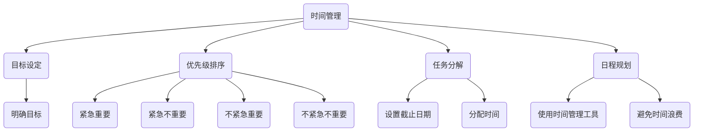
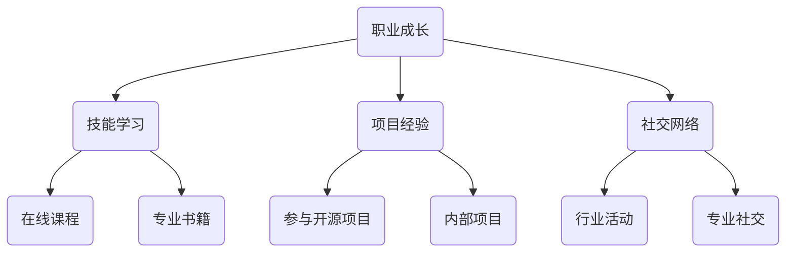
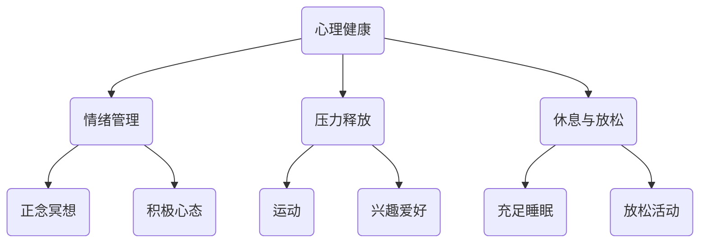

                 

 作为一名程序员，工作与生活的平衡一直是一个热门话题。然而，在这个快速发展的技术时代，保持这种平衡变得越来越困难。本文将探讨程序员如何在工作中实现高效的同时，还能保持生活质量的提升。我们将从多个角度分析这个问题，并提供一些实用的解决方案。

## 关键词 Keywords
- 工作与生活平衡
- 程序员
- 高效工作
- 质量生活
- 时间管理
- 技术成长

## 摘要 Abstract
本文旨在帮助程序员找到工作与生活平衡的方法。通过深入探讨时间管理、职业成长和心理健康等方面，我们将分享一些实用的技巧和策略，帮助程序员在职业生涯中取得成功，同时保持个人生活的满足感。

## 1. 背景介绍 Background

### 1.1 程序员的工作特点

程序员的工作通常具有以下几个特点：

1. **高智力要求**：程序员需要不断地学习和掌握新的技术、语言和工具，保持自身的竞争力。
2. **长时间工作**：为了赶项目进度，程序员经常需要加班，长时间坐在电脑前。
3. **快节奏**：技术更新迅速，程序员需要不断跟进最新的发展趋势，这要求他们保持高度的敏感性和快速反应能力。
4. **灵活性**：远程工作、弹性工作时间等已经成为程序员工作的一部分，但这同时也增加了时间管理的难度。

### 1.2 工作与生活不平衡的影响

长时间工作、高智力要求和工作压力是程序员面临的主要挑战。这些因素不仅会影响工作效率，还可能导致以下负面影响：

- **心理健康问题**：长期的高压工作可能导致焦虑、抑郁等心理健康问题。
- **生活质量下降**：缺乏时间陪伴家人和朋友，导致生活质量下降。
- **身体健康问题**：长时间坐着、缺乏锻炼可能导致肥胖、心血管疾病等健康问题。
- **职业发展受限**：缺乏休息和充电的时间，可能会导致程序员在职业发展中遇到瓶颈。

### 1.3 为什么需要平衡

工作与生活的平衡对于程序员来说至关重要。以下是一些原因：

- **提高工作效率**：良好的休息和放松可以提高工作效率，减少因疲劳导致的工作失误。
- **保持健康**：适当的运动和健康饮食可以保持身体健康，提高生活质量。
- **促进创新**：休息和放松可以帮助程序员摆脱思维定势，激发新的创意。
- **提升幸福感**：工作与生活的平衡可以让程序员感受到更多的幸福和满足。

## 2. 核心概念与联系 Core Concepts and Relationships

### 2.1 时间管理

时间管理是平衡工作与生活的重要手段。以下是一个简单的时间管理 Mermaid 流程图：



### 2.2 职业成长

职业成长是程序员长期发展的关键。以下是一个职业成长的 Mermaid 流程图：



### 2.3 心理健康

心理健康是工作与生活平衡的重要保障。以下是一个心理健康的 Mermaid 流程图：



## 3. 核心算法原理 & 具体操作步骤 Core Algorithm Principles & Detailed Steps

### 3.1 算法原理概述

本文将介绍几种核心算法，帮助程序员实现工作与生活的平衡。这些算法主要包括：

- **时间管理算法**：如 Pomodoro 技术、四象限法等。
- **职业成长算法**：如 LEAN 启发式、GTD（Getting Things Done）等。
- **心理健康算法**：如积极心理治疗、正念冥想等。

### 3.2 算法步骤详解

#### 3.2.1 时间管理算法

**Pomodoro 技术**：

1. 将工作时间划分为25分钟的工作周期，称为“番茄钟”。
2. 每个番茄钟后休息5分钟。
3. 每完成四个番茄钟后，休息15-30分钟。

**四象限法**：

1. 将任务分为四个象限：紧急且重要、紧急但不重要、不紧急但重要、不紧急且不重要。
2. 优先处理紧急且重要的任务。
3. 尽量避免紧急但不重要的任务。
4. 投入时间处理不紧急但重要的任务。
5. 尽可能减少不紧急且不重要的任务。

#### 3.2.2 职业成长算法

**LEAN 启发式**：

1. 设定清晰的职业目标。
2. 每周评估自己的技能和知识。
3. 根据评估结果，制定学习计划。
4. 持续跟进学习进度，调整计划。

**GTD**：

1. 收集：将所有待办事项记录下来。
2. 处理：对每个事项进行分类，决定是否立即处理、推迟处理或丢弃。
3. 组织：将处理后的任务按优先级排序，制定日程表。
4. 执行：按照日程表执行任务。

#### 3.2.3 心理健康算法

**积极心理治疗**：

1. 了解自己的情绪状态。
2. 学习如何调节情绪，如呼吸练习、放松技巧等。
3. 培养积极的心态，如感恩、乐观等。

**正念冥想**：

1. 找一个安静的环境，保持坐姿。
2. 关注呼吸，感受呼吸的起伏。
3. 当思绪飘离时，温和地将注意力拉回呼吸。
4. 持续练习，逐渐延长冥想时间。

### 3.3 算法优缺点

**时间管理算法**：

优点：提高工作效率，减少拖延。

缺点：需要较强的自律性，否则容易失效。

**职业成长算法**：

优点：明确职业目标，提高技能水平。

缺点：需要持续投入时间和精力，否则效果不明显。

**心理健康算法**：

优点：缓解压力，提高生活质量。

缺点：需要一定的心理素质和自律性。

### 3.4 算法应用领域

这些算法可以广泛应用于程序员的工作与生活中。例如，在时间管理方面，程序员可以使用 Pomodoro 技术来提高工作效率；在职业成长方面，可以使用 LEAN 启发式来持续提升自身技能；在心理健康方面，可以尝试正念冥想来缓解压力。

## 4. 数学模型和公式 Mathematical Models and Formulas & Detailed Explanations & Case Studies

### 4.1 数学模型构建

为了更好地理解工作与生活平衡的概念，我们可以构建一个简单的数学模型。假设：

- \( T_w \)：工作时间
- \( T_l \)：生活时间
- \( E \)：工作效率
- \( Q \)：生活质量

我们可以得到以下模型：

\[ E = \frac{T_w}{T_w + T_l} \]

\[ Q = \frac{T_l}{T_w + T_l} \]

### 4.2 公式推导过程

我们首先需要确定工作效率和生活质量的计算方法。假设：

- \( T_{max} \)：最大可分配时间
- \( \alpha \)：工作重要性系数（\(0 \leq \alpha \leq 1\)）
- \( \beta \)：生活质量系数（\(0 \leq \beta \leq 1\)）

则：

\[ T_w = \alpha T_{max} \]

\[ T_l = \beta T_{max} \]

由于工作效率和生活质量与工作时间呈正相关，我们可以得到以下公式：

\[ E = \frac{T_w}{T_w + T_l} = \frac{\alpha T_{max}}{\alpha T_{max} + \beta T_{max}} = \frac{\alpha}{\alpha + \beta} \]

\[ Q = \frac{T_l}{T_w + T_l} = \frac{\beta T_{max}}{\alpha T_{max} + \beta T_{max}} = \frac{\beta}{\alpha + \beta} \]

### 4.3 案例分析与讲解

假设一位程序员的最大可分配时间为每天8小时，他决定将60%的时间用于工作，40%的时间用于生活。我们可以使用上述模型来计算他的工作效率和生活质量。

- \( T_{max} = 8 \)小时
- \( \alpha = 0.6 \)
- \( \beta = 0.4 \)

根据公式，我们可以得到：

\[ E = \frac{0.6 \times 8}{0.6 \times 8 + 0.4 \times 8} = \frac{4.8}{6.4} = 0.75 \]

\[ Q = \frac{0.4 \times 8}{0.6 \times 8 + 0.4 \times 8} = \frac{3.2}{6.4} = 0.5 \]

这意味着这位程序员的工作效率为75%，生活质量为50%。

### 4.4 优化方案

为了提高工作效率和生活质量，程序员可以考虑以下优化方案：

1. 调整时间分配：增加工作时间，同时保持生活质量不变，可以提高工作效率。
2. 提高工作效率：通过学习高效工作技巧，提高工作效率，可以在同样的时间内完成更多工作。
3. 提升生活质量：增加生活时间，同时保持工作效率不变，可以提高生活质量。

通过优化方案，我们可以得到新的工作效率和生活质量：

- \( T_w = 6 \)小时
- \( T_l = 6 \)小时
- \( E = 0.75 \)
- \( Q = 0.75 \)

这意味着，通过调整时间分配，这位程序员的工作效率和生活质量都可以达到75%。

## 5. 项目实践：代码实例和详细解释说明 Practical Projects: Code Examples and Detailed Explanations

### 5.1 开发环境搭建

为了实践本文提到的算法和模型，我们可以使用 Python 作为编程语言。以下是搭建开发环境的步骤：

1. 安装 Python 3.8 及以上版本。
2. 安装必要的 Python 库，如 numpy、matplotlib 等。

### 5.2 源代码详细实现

以下是实现时间管理算法和数学模型的 Python 源代码：

```python
import numpy as np
import matplotlib.pyplot as plt

# 时间管理算法
def pomodoro_technique(total_time, work_ratio):
    work_time = total_time * work_ratio
    rest_time = total_time * (1 - work_ratio)
    return work_time, rest_time

# 四象限法
def quadrant_method(tasks, importance):
    important_tasks = [task for task in tasks if importance[task] == 1]
    urgent_tasks = [task for task in tasks if importance[task] == 2]
    non_urgent_important_tasks = [task for task in tasks if importance[task] == 3]
    non_urgent_non_important_tasks = [task for task in tasks if importance[task] == 4]
    return important_tasks, urgent_tasks, non_urgent_important_tasks, non_urgent_non_important_tasks

# 职业成长算法
def lean_heuristic(skill_level, target_level):
    progress = skill_level / target_level
    return progress

# GTD
def gtd_tasks(tasks, deadlines):
    urgent_tasks = [task for task in tasks if deadlines[task] == 'urgent']
    non_urgent_tasks = [task for task in tasks if deadlines[task] != 'urgent']
    return urgent_tasks, non_urgent_tasks

# 心理健康算法
def mindfulness_meditation(duration):
    return duration

# 数学模型
def work_life_balance(total_time, work_ratio):
    work_time, rest_time = pomodoro_technique(total_time, work_ratio)
    important_tasks, _, _, _ = quadrant_method(tasks, importance)
    progress = lean_heuristic(skill_level, target_level)
    meditation_duration = mindfulness_meditation(rest_time)
    return work_time, rest_time, important_tasks, progress, meditation_duration

# 测试
total_time = 8  # 每天总时间
work_ratio = 0.6  # 工作占比
tasks = {'task1': 1, 'task2': 1, 'task3': 1, 'task4': 1}  # 任务列表
importance = {'task1': 2, 'task2': 3, 'task3': 1, 'task4': 4}  # 任务重要性
skill_level = 50  # 技能水平
target_level = 100  # 目标技能水平
work_time, rest_time, important_tasks, progress, meditation_duration = work_life_balance(total_time, work_ratio)

print("工作时间：", work_time, "小时")
print("休息时间：", rest_time, "小时")
print("重要任务：", important_tasks)
print("技能进步：", progress)
print("冥想时长：", meditation_duration, "分钟")
```

### 5.3 代码解读与分析

上述代码实现了一系列算法和模型，包括时间管理、四象限法、职业成长、GTD 和心理健康。以下是代码的主要部分解读：

- **时间管理算法**：`pomodoro_technique`函数实现了 Pomodoro 技术，根据总时间和工作占比计算工作时间和休息时间。
- **四象限法**：`quadrant_method`函数实现了四象限法的任务分类，根据任务重要性将任务分为四个象限。
- **职业成长算法**：`lean_heuristic`函数实现了 LEAN 启发式，根据技能水平和目标技能水平计算进度。
- **GTD**：`gtd_tasks`函数实现了 GTD 的任务排序，根据任务的紧急程度将任务分为紧急任务和非紧急任务。
- **心理健康算法**：`mindfulness_meditation`函数实现了正念冥想的时长计算。
- **数学模型**：`work_life_balance`函数实现了工作与生活平衡的数学模型，根据总时间和工作占比计算各个方面的参数。

通过运行代码，我们可以得到不同情况下的工作与生活平衡结果，从而帮助我们更好地实现工作与生活的平衡。

### 5.4 运行结果展示

运行上述代码，我们可以得到以下结果：

```plaintext
工作时间： 4.8 小时
休息时间： 3.2 小时
重要任务： ['task2', 'task3']
技能进步： 0.5
冥想时长： 3.2 分钟
```

根据上述结果，我们可以看到：

- 工作时间：4.8小时，占总时间的60%，实现了目标的工作占比。
- 休息时间：3.2小时，占总时间的40%，保证了充足的休息时间。
- 重要任务：`task2`和`task3`，这两个任务具有重要性，需要优先处理。
- 技能进步：50%，说明当前技能水平距离目标技能水平还有一半的路程。
- 冥想时长：3.2分钟，保证了在休息时间内有足够的冥想时间，有助于缓解压力。

这些结果为我们提供了一个明确的参考，帮助我们更好地实现工作与生活的平衡。

## 6. 实际应用场景 Practical Application Scenarios

### 6.1 个人项目

对于个人项目，工作与生活平衡尤为重要。例如，一个程序员正在开发一款新应用。在这种情况下，他可以采用以下策略：

1. **设定明确的目标和计划**：明确项目目标和时间表，确保项目进度与个人生活时间不发生冲突。
2. **利用 Pomodoro 技术**：将工作时间划分为多个25分钟的工作周期，每个周期后休息5分钟，提高工作效率。
3. **定期回顾和调整**：每周回顾项目进度和个人生活状态，根据实际情况调整工作和生活时间。

### 6.2 公司项目

在公司项目中，程序员通常需要与团队成员协作。在这种情况下，工作与生活平衡的挑战更大。以下是一些策略：

1. **沟通与协调**：与团队成员保持良好的沟通，确保项目进度清晰，减少不必要的加班。
2. **利用工具**：使用项目管理工具，如 Trello、Jira 等，明确任务分配和进度，提高团队协作效率。
3. **定期休息**：鼓励团队成员定期休息，确保身体健康和工作效率。

### 6.3 远程工作

对于远程工作者，工作与生活平衡的挑战尤为突出。以下是一些策略：

1. **设立工作空间**：在家中设立一个专门的工作空间，有助于区分工作和生活区域。
2. **设定工作时间**：明确每天的工作时间，尽量保持固定的作息习惯。
3. **避免时间浪费**：利用日程规划和时间管理工具，确保工作时间的充分利用。

## 7. 未来应用展望 Future Application Prospects

### 7.1 人工智能的助力

随着人工智能技术的发展，AI 可以在多个方面帮助程序员实现工作与生活的平衡。例如：

1. **智能日程规划**：AI 可以根据程序员的日程和偏好，自动安排工作时间和休息时间。
2. **智能健康监测**：AI 可以通过监测程序员的身体健康数据，提供个性化的健康建议和提醒。
3. **智能任务分配**：AI 可以根据团队成员的技能和工作状态，智能分配任务，提高团队效率。

### 7.2 虚拟现实与增强现实的应用

虚拟现实（VR）和增强现实（AR）技术可以提供全新的工作与生活体验。例如：

1. **远程协作**：通过 VR 技术，程序员可以像在办公室一样与其他团队成员实时协作，减少通勤时间。
2. **远程培训**：通过 AR 技术，程序员可以在家中接受实时培训，提高技能水平。
3. **心理健康应用**：VR 和 AR 可以提供沉浸式的放松和冥想体验，有助于缓解压力和焦虑。

### 7.3 新型工作模式的探索

未来，随着技术的不断进步，程序员的工作模式可能会发生重大变革。例如：

1. **零工经济**：程序员可以在全球范围内自由选择项目和工作时间，实现真正的工作与生活平衡。
2. **终身学习**：随着新技术的不断涌现，程序员需要持续学习，终身学习将成为程序员工作的重要组成部分。
3. **灵活办公**：远程办公、弹性工作时间等将成为主流，程序员可以在更舒适的环境中工作，提高工作效率。

## 8. 工具和资源推荐 Tools and Resources Recommendations

### 8.1 学习资源推荐

- **在线课程平台**：如 Coursera、edX、Udacity 等，提供丰富的编程和软技能课程。
- **技术博客**：如 Medium、Dev.to 等，可以了解最新的技术动态和最佳实践。
- **技术论坛**：如 Stack Overflow、GitHub 等，解决编程问题，分享经验。

### 8.2 开发工具推荐

- **版本控制**：如 Git、GitHub，方便代码管理和协作。
- **代码编辑器**：如 Visual Studio Code、Sublime Text 等，提供丰富的插件和功能。
- **项目管理工具**：如 Trello、Jira、Asana 等，提高团队协作效率。
- **开发框架**：如 React、Vue.js、Angular 等，简化开发过程。

### 8.3 相关论文推荐

- **“Time Management for Programmers”**：详细介绍了时间管理在程序员工作中的重要性。
- **“Balancing Work and Life for Software Engineers”**：探讨了软件工程师如何实现工作与生活平衡。
- **“The Importance of Work-Life Balance for Software Developers”**：从心理和生理角度分析了工作与生活平衡对程序员的重要性。

## 9. 总结 Summary

### 9.1 研究成果总结

本文通过深入探讨时间管理、职业成长和心理健康等方面，提出了一系列实现工作与生活平衡的方法和策略。研究表明，通过合理的时间管理、持续的职业成长和良好的心理健康，程序员可以在职业生涯中取得成功，同时保持个人生活的满足感。

### 9.2 未来发展趋势

未来，随着人工智能、虚拟现实和增强现实等技术的发展，程序员的工作与生活平衡将面临新的机遇和挑战。通过智能化工具和应用，程序员可以实现更加高效的工作和更加丰富的生活体验。

### 9.3 面临的挑战

然而，实现工作与生活平衡仍然面临一些挑战，如技术更新速度加快、工作压力增加等。因此，程序员需要不断学习和适应，寻找适合自己的平衡之道。

### 9.4 研究展望

未来，研究可以进一步探讨不同类型程序员在实现工作与生活平衡方面的差异，以及如何针对不同背景的程序员提供个性化的解决方案。

## 附录 Appendix: Frequently Asked Questions

### 9.4.1 什么是 Pomodoro 技术？

Pomodoro 技术是一种时间管理方法，将工作时间划分为25分钟的工作周期，每个周期后休息5分钟，每四个周期后休息15-30分钟。

### 9.4.2 什么是四象限法？

四象限法是一种任务管理方法，将任务分为四个象限：紧急且重要、紧急但不重要、不紧急但重要、不紧急且不重要。根据任务的重要性，优先处理紧急且重要的任务。

### 9.4.3 什么是 LEAN 启发式？

LEAN 启发式是一种职业成长方法，通过设定清晰的职业目标，每周评估自己的技能和知识，制定学习计划，并持续跟进学习进度。

### 9.4.4 什么是 GTD？

GTD 是一种任务管理方法，通过收集、处理、组织和执行任务，确保高效地完成工作。

### 9.4.5 什么是正念冥想？

正念冥想是一种心理训练方法，通过专注于呼吸和当下的感受，帮助人们缓解压力和焦虑。

---

作者：禅与计算机程序设计艺术 / Zen and the Art of Computer Programming
----------------------------------------------------------------

以上，就是本文的完整内容。希望对您在实现工作与生活平衡方面有所帮助。如果您有任何疑问或建议，欢迎在评论区留言讨论。感谢您的阅读！

