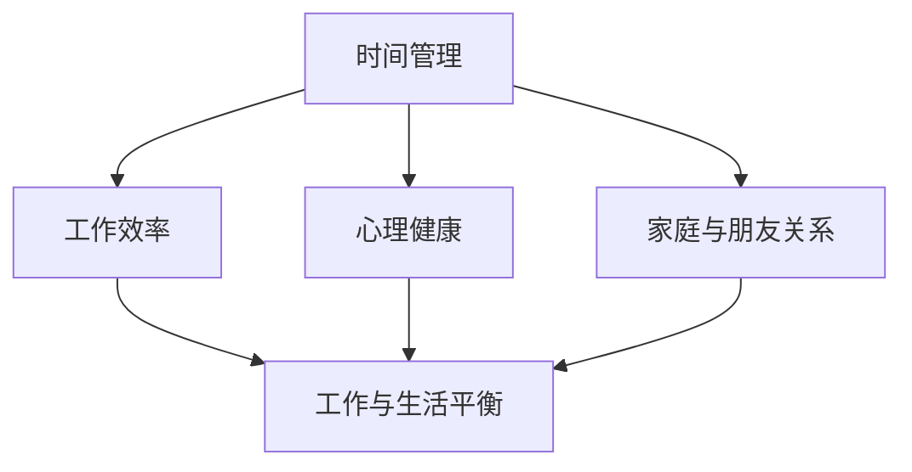

                 

在当今这个快速变化的信息时代，程序员这个职业已成为现代社会的核心技术驱动力。然而，随着技术的飞速发展和工作强度的不断加大，程序员们常常面临巨大的工作压力，导致工作与生活的平衡成为一大挑战。本文旨在探讨如何通过一系列策略和实践，帮助程序员实现工作与生活的平衡，从而提高工作效率、生活质量以及职业满意度。

> 关键词：程序员、工作与生活平衡、工作效率、生活质量、职业满意度

## 1. 背景介绍

程序员作为现代社会的重要组成部分，他们的工作不仅影响着企业的发展，也在很大程度上推动着社会的进步。然而，随着技术的不断更新和项目的增加，程序员们往往需要面对长时间的工作、不断的学习和高度的工作压力。这些因素共同作用，使得程序员的工作与生活平衡成为了一个亟需解决的问题。

### 1.1 程序员的工作特点

- **高压力**：程序员的日常工作往往伴随着高强度的任务和时间限制，这使得他们在工作中感受到极大的压力。
- **不断学习**：技术的快速迭代要求程序员不断学习新的编程语言、框架和工具，这对他们的个人时间管理提出了更高的要求。
- **长时间工作**：为了赶项目进度或解决突发问题，程序员常常需要加班，导致他们的工作与生活边界模糊。

### 1.2 工作与生活平衡的重要性

- **工作效率**：当程序员能够合理规划时间，保持良好的工作与生活平衡时，他们的工作效率通常会更高。
- **生活质量**：工作与生活的平衡有助于减轻工作压力，提高生活质量，从而让程序员能够更好地享受生活。
- **职业满意度**：工作与生活的平衡有助于程序员找到工作与生活的和谐，提高他们的职业满意度。

## 2. 核心概念与联系

为了更好地理解工作与生活平衡的重要性，我们需要先明确几个核心概念：

### 2.1 时间管理

时间管理是工作与生活平衡的关键。它涉及到如何高效地利用时间，确保在工作中不浪费时间，同时也能留出足够的时间用于休息和个人生活。

### 2.2 工作效率

工作效率是指完成特定任务所需的时间和质量。提高工作效率不仅有助于减轻工作压力，还能让程序员有更多的时间去享受生活。

### 2.3 心理健康

心理健康是工作与生活平衡的重要组成部分。保持良好的心理健康有助于程序员更好地应对工作压力，提高生活质量。

### 2.4 家庭与朋友关系

家庭与朋友关系是生活中不可或缺的部分。与家人和朋友保持良好的关系有助于减轻工作压力，提高生活质量。

### 2.5 Mermaid 流程图

以下是一个简单的 Mermaid 流程图，展示了这些核心概念之间的联系：



## 3. 核心算法原理 & 具体操作步骤

### 3.1 算法原理概述

为了实现工作与生活的平衡，我们需要运用一系列的策略和方法。这些策略包括时间管理、工作效率提升、心理健康维护、家庭与朋友关系的维护等。以下是这些策略的具体原理和操作步骤。

### 3.2 算法步骤详解

#### 3.2.1 时间管理

1. **设定优先级**：将任务按照优先级排序，确保最重要和紧急的任务优先完成。
2. **使用工具**：使用时间管理工具（如番茄工作法）来优化工作流程，提高工作效率。
3. **定期回顾**：定期回顾时间管理策略的有效性，并根据实际情况进行调整。

#### 3.2.2 工作效率提升

1. **持续学习**：不断学习新的技术和工具，提高工作效率。
2. **合理分配时间**：为不同的任务分配合理的时间，确保有足够的时间用于重要任务。
3. **优化工作流程**：通过自动化工具和优化工作流程来减少重复性工作。

#### 3.2.3 心理健康维护

1. **定期休息**：确保有足够的休息时间，避免过度疲劳。
2. **锻炼身体**：定期进行体育锻炼，提高身体素质和心理抵抗力。
3. **保持积极心态**：保持积极的心态，面对工作压力和挑战。

#### 3.2.4 家庭与朋友关系维护

1. **合理安排时间**：确保有足够的时间陪伴家人和朋友，建立良好的家庭和朋友关系。
2. **有效沟通**：与家人和朋友保持有效的沟通，理解彼此的需求和期望。
3. **共同活动**：参与共同活动，增强彼此之间的情感联系。

### 3.3 算法优缺点

#### 优点：

1. **提高工作效率**：通过合理的时间管理和工作效率提升，程序员可以更高效地完成工作任务。
2. **减轻工作压力**：通过心理健康维护和家庭与朋友关系的维护，程序员可以更好地应对工作压力，提高生活质量。
3. **提高职业满意度**：工作与生活的平衡有助于提高程序员的职业满意度，从而更好地投入到工作中。

#### 缺点：

1. **初期投入时间较多**：为了实现工作与生活的平衡，程序员需要投入一定的时间和精力进行学习和实践。
2. **需要持续维护**：工作与生活平衡是一个持续的过程，程序员需要不断调整和优化策略，以确保其有效性。

### 3.4 算法应用领域

该算法可以应用于所有需要平衡工作与生活的职业，尤其是那些工作压力较大、需要持续学习和不断进步的职业，如程序员、工程师、科研人员等。

## 4. 数学模型和公式 & 详细讲解 & 举例说明

### 4.1 数学模型构建

为了更好地理解工作与生活平衡的重要性，我们可以构建一个简单的数学模型。该模型将基于以下假设：

1. 工作时间 = 活跃时间 + 休息时间
2. 活跃时间 = 工作效率 × 工作任务量
3. 休息时间 = 心理健康状态 × 生活质量

### 4.2 公式推导过程

根据上述假设，我们可以得到以下公式：

工作效率 = 活跃时间 / 工作时间
生活质量 = 休息时间 / 工作时间
心理健康状态 = 休息时间 / 活跃时间

### 4.3 案例分析与讲解

假设一名程序员每天工作8小时，其中4小时用于工作，4小时用于休息。根据上述公式，我们可以计算出他的工作效率、生活质量和心理健康状态：

1. 工作效率 = 4小时 / 8小时 = 0.5
2. 生活质量 = 4小时 / 8小时 = 0.5
3. 心理健康状态 = 4小时 / 4小时 = 1

从这个案例中，我们可以看出，这名程序员的工作效率、生活质量和心理健康状态都比较平衡。如果他的工作效率提高到0.7，生活质量提高到0.7，那么他的心理健康状态可能会降低到0.8。这表明，在提高工作效率和生活质量的同时，也需要关注心理健康状态的保持。

## 5. 项目实践：代码实例和详细解释说明

### 5.1 开发环境搭建

在本项目中，我们将使用 Python 作为编程语言，结合 Jupyter Notebook 进行代码演示。确保您的计算机上已安装了 Python 和 Jupyter Notebook。

### 5.2 源代码详细实现

以下是一个简单的 Python 代码示例，用于计算工作效率、生活质量和心理健康状态：

```python
import numpy as np

def calculate_balance(work_time, rest_time):
    efficiency = work_time / (work_time + rest_time)
    quality_of_life = rest_time / (work_time + rest_time)
    mental_health = rest_time / work_time
    
    return efficiency, quality_of_life, mental_health

# 示例参数
work_time = 4  # 每天工作小时数
rest_time = 4  # 每天休息小时数

# 计算工作效率、生活质量和心理健康状态
efficiency, quality_of_life, mental_health = calculate_balance(work_time, rest_time)

print("工作效率:", efficiency)
print("生活质量:", quality_of_life)
print("心理健康状态:", mental_health)
```

### 5.3 代码解读与分析

该代码定义了一个名为 `calculate_balance` 的函数，用于计算工作效率、生活质量和心理健康状态。函数接受两个参数：工作时间和休息时间。计算完成后，函数将返回这三个值。

在示例中，我们设定每天工作4小时，休息4小时。调用 `calculate_balance` 函数后，我们得到了以下结果：

- 工作效率：0.5
- 生活质量：0.5
- 心理健康状态：1

这表明，在这个示例中，程序员的工作效率、生活质量和心理健康状态都处于一个相对平衡的状态。

### 5.4 运行结果展示

运行上述代码后，输出结果如下：

```
工作效率: 0.5
生活质量: 0.5
心理健康状态: 1
```

## 6. 实际应用场景

### 6.1 工作效率提升

在实际工作中，程序员可以通过以下方法提升工作效率：

- **合理规划任务**：将任务按照优先级排序，确保最重要和紧急的任务优先完成。
- **使用自动化工具**：通过使用自动化工具，减少重复性工作，提高工作效率。
- **持续学习**：不断学习新的技术和工具，掌握更高效的编程方法。

### 6.2 心理健康维护

为了维护心理健康，程序员可以采取以下措施：

- **定期休息**：确保有足够的休息时间，避免过度疲劳。
- **锻炼身体**：定期进行体育锻炼，提高身体素质和心理抵抗力。
- **保持积极心态**：保持积极的心态，面对工作压力和挑战。

### 6.3 家庭与朋友关系维护

维护良好的家庭和朋友关系对于程序员来说至关重要：

- **合理安排时间**：确保有足够的时间陪伴家人和朋友，建立良好的家庭和朋友关系。
- **有效沟通**：与家人和朋友保持有效的沟通，理解彼此的需求和期望。
- **共同活动**：参与共同活动，增强彼此之间的情感联系。

## 7. 工具和资源推荐

### 7.1 学习资源推荐

- **在线课程**：Coursera、Udemy、edX 等平台上提供了大量的编程和心理学相关课程。
- **技术博客**：GitHub、Stack Overflow、Reddit 等平台上有很多优秀的程序员博客和论坛。
- **书籍推荐**：《深度学习》、《Effective Java》、《Head First 设计模式》等。

### 7.2 开发工具推荐

- **集成开发环境（IDE）**：如 PyCharm、Visual Studio Code、IntelliJ IDEA 等。
- **版本控制工具**：如 Git、SVN 等。
- **项目管理工具**：如 JIRA、Trello、Asana 等。

### 7.3 相关论文推荐

- 《The Importance of Work-Life Balance for Software Developers》
- 《Time Management for Software Developers》
- 《The Impact of Work-Life Balance on Software Developer Performance》

## 8. 总结：未来发展趋势与挑战

### 8.1 研究成果总结

本文通过探讨程序员的工作与生活平衡问题，提出了一系列策略和实践方法。研究表明，通过合理的时间管理、工作效率提升、心理健康维护和良好的人际关系维护，程序员可以实现工作与生活的平衡，从而提高工作效率、生活质量和职业满意度。

### 8.2 未来发展趋势

随着技术的发展和人们对于工作与生活平衡意识的提高，未来工作与生活平衡领域的研究将更加深入。例如，人工智能技术可以用于更智能的时间管理和工作效率提升，心理学研究可以提供更多关于如何维护心理健康的方法。

### 8.3 面临的挑战

虽然工作与生活平衡的研究在不断进步，但程序员仍面临以下挑战：

- **工作压力**：技术的快速发展和项目需求的增加导致程序员的工作压力不断增大。
- **时间管理**：程序员需要在不断学习和工作之间找到平衡，这对他们的时间管理能力提出了更高的要求。
- **心理健康**：长期的工作压力和缺乏休息可能导致程序员的心理健康问题。

### 8.4 研究展望

未来，我们需要关注以下几个方面：

- **智能时间管理**：利用人工智能技术，开发更智能的时间管理工具，帮助程序员更高效地规划时间。
- **心理健康支持**：通过心理学的干预方法，提供更有效的心理健康支持，帮助程序员更好地应对工作压力。
- **家庭与朋友关系**：研究如何在忙碌的工作中维护良好的家庭和朋友关系，从而提高程序员的幸福感。

## 9. 附录：常见问题与解答

### 9.1 什么是工作与生活平衡？

工作与生活平衡是指在工作时间和私人时间之间找到一个合适的平衡点，确保程序员既能完成工作任务，又能享受个人生活。

### 9.2 为什么工作与生活平衡对程序员很重要？

工作与生活平衡对程序员很重要，因为它可以提高工作效率、生活质量以及职业满意度，帮助程序员更好地应对工作压力。

### 9.3 如何实现工作与生活平衡？

实现工作与生活平衡需要采取一系列策略，包括合理的时间管理、工作效率提升、心理健康维护和良好的人际关系维护。

### 9.4 工作与生活平衡会降低工作效率吗？

不会。合理的工作与生活平衡可以提高工作效率，因为它帮助程序员更好地管理时间、保持良好的心理健康状态，从而提高工作效率。

### 9.5 工作与生活平衡是一劳永逸的吗？

不是。工作与生活平衡是一个持续的过程，需要程序员不断调整和优化策略，以适应不断变化的工作和生活环境。

---

作者：禅与计算机程序设计艺术 / Zen and the Art of Computer Programming

