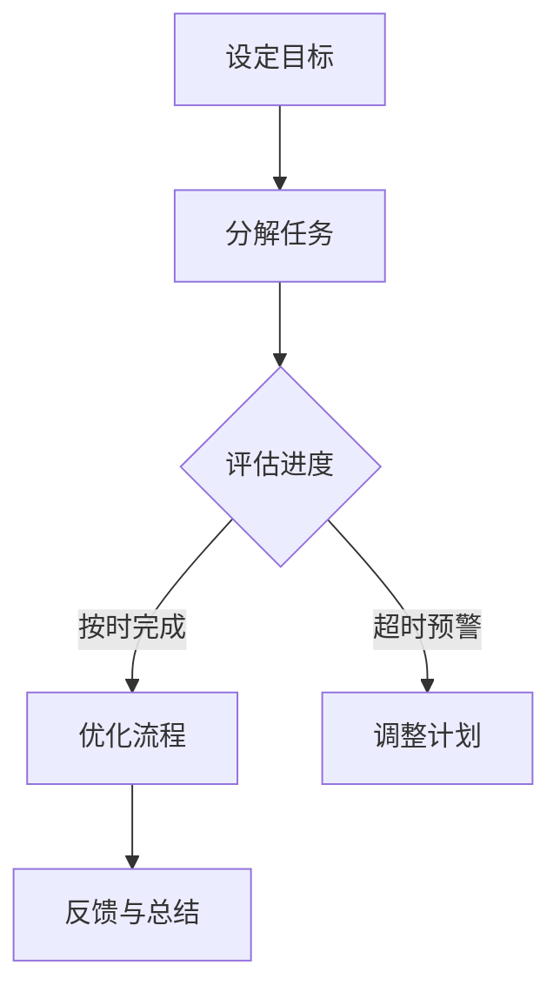
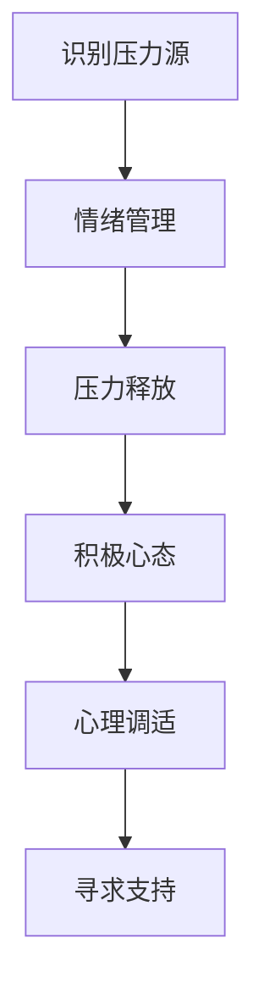
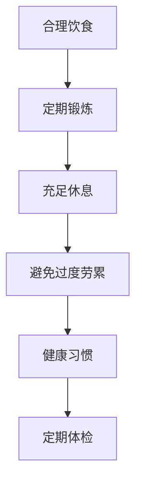

                 

关键词：程序员，工作与生活平衡，工作效率，心理健康，时间管理，健康生活方式

> 摘要：本文旨在探讨程序员如何在高度压力的工作环境中实现工作与生活的平衡。通过分析程序员的工作特性，提出一系列的策略和方法，帮助程序员提高工作效率，维护心理健康，建立健康的生活方式，从而实现长期的工作与生活平衡。

## 1. 背景介绍

在当今信息时代，程序员作为科技创新的核心力量，承担着极其重要的角色。然而，随着互联网、人工智能、大数据等新兴技术的迅猛发展，程序员的工作压力也在不断加大。据统计，程序员的职业压力排名长期处于高位，且心理健康问题也日益突出。因此，如何在工作与生活之间找到平衡点，成为了程序员群体面临的重要课题。

本文将围绕以下几个方面展开讨论：

1. **程序员的工作特性分析**：探讨程序员工作的独特性，包括工作内容、工作强度、工作模式等。
2. **工作与生活平衡的重要性**：分析工作与生活平衡对程序员个人和团队的影响。
3. **实现工作与生活平衡的策略与方法**：提出具体的实践方法，帮助程序员实现工作与生活的平衡。
4. **健康生活方式的构建**：探讨健康饮食、锻炼、休息等方面的内容。
5. **未来展望**：展望程序员工作与生活平衡的发展趋势，以及可能面临的挑战。

## 2. 核心概念与联系

### 2.1 工作效率与时间管理

#### Mermaid 流程图

### 2.2 心理健康与工作压力

#### Mermaid 流程图

### 2.3 健康生活方式

#### Mermaid 流程图

## 3. 核心算法原理 & 具体操作步骤

### 3.1 算法原理概述

工作与生活平衡的实现，可以类比为一种算法优化过程。在这个过程中，我们需要：

1. **目标设定**：明确工作与生活的目标和期望。
2. **任务分解**：将大目标分解为可执行的小任务。
3. **进度评估**：定期检查任务的进展情况。
4. **优化流程**：根据进度调整工作流程，确保按时完成任务。
5. **反馈与总结**：任务完成后进行反馈和总结，为下一次工作提供经验。

### 3.2 算法步骤详解

1. **目标设定**：确定长期和短期目标，如提高工作效率、完成项目等。
2. **任务分解**：将大目标分解为具体可执行的任务，如每天编程几个小时、每周学习一门新技能等。
3. **进度评估**：定期检查任务进度，如每周一评估上周的任务完成情况。
4. **优化流程**：根据进度评估结果，调整工作流程，如减少不必要的会议时间、优化代码编写流程等。
5. **反馈与总结**：完成任务后进行反馈和总结，记录经验教训，为下次工作提供参考。

### 3.3 算法优缺点

**优点**：

- 明确目标，有助于提高工作效率。
- 任务分解，降低工作难度。
- 定期评估和优化，确保工作进度。

**缺点**：

- 需要持续的自我监督和调整。
- 可能对工作环境有一定要求，如需要合理的任务分配和时间管理工具。

### 3.4 算法应用领域

- 项目管理：通过设定目标和分解任务，确保项目按时完成。
- 时间管理：通过定期评估和优化，提高个人工作效率。
- 健康管理：通过设定健康目标，如定期锻炼和充足休息，维护身体健康。

## 4. 数学模型和公式 & 详细讲解 & 举例说明

### 4.1 数学模型构建

我们可以使用时间管理公式来构建数学模型，公式如下：

$$
T_{eff} = \frac{P_{total}}{T_{total}}
$$

其中，$T_{eff}$ 表示工作效率，$P_{total}$ 表示完成任务所需的总工作量，$T_{total}$ 表示实际花费的总时间。

### 4.2 公式推导过程

假设任务 $A$ 需要完成 $P_A$ 的工作量，实际花费的时间为 $T_A$；任务 $B$ 需要完成 $P_B$ 的工作量，实际花费的时间为 $T_B$。那么：

$$
T_{total} = T_A + T_B
$$

$$
P_{total} = P_A + P_B
$$

根据效率的定义，工作效率为完成工作量与实际花费时间的比值：

$$
T_{eff} = \frac{P_{total}}{T_{total}} = \frac{P_A + P_B}{T_A + T_B}
$$

### 4.3 案例分析与讲解

假设程序员小明需要完成以下任务：

- 编写代码：需要完成 100 个功能点，实际花费的时间为 10 小时。
- 学习新技术：需要完成 50 个知识点，实际花费的时间为 5 小时。

那么：

$$
T_{total} = 10 + 5 = 15 \text{ 小时}
$$

$$
P_{total} = 100 + 50 = 150 \text{ 功能点}
$$

代入时间管理公式：

$$
T_{eff} = \frac{150}{15} = 10
$$

这意味着小明的工作效率为 10，即每小时完成 10 个功能点。通过这个例子，我们可以看到，通过合理分配时间和任务，可以提高工作效率。

## 5. 项目实践：代码实例和详细解释说明

### 5.1 开发环境搭建

为了更好地展示工作与生活平衡的实现，我们将使用一个简单的项目管理工具——Trello。首先，我们需要在 Trello 上创建一个新项目，并添加以下三个列表：

- **待办**：用于存放需要完成的任务。
- **进行中**：用于存放正在进行的任务。
- **已完成**：用于存放已经完成的任务。

### 5.2 源代码详细实现

接下来，我们将在这个项目管理工具上实践工作与生活平衡的算法。首先，设定一个长期目标——在接下来的一个月内，每天至少完成 4 个任务。然后，将这个目标分解为每天的具体任务，例如：

- 编写代码：每天 2 个功能点。
- 学习新技术：每天 1 个知识点。
- 锻炼：每天 30 分钟。
- 休息：每天 1 小时。

将这些任务添加到 Trello 的待办列表中。接下来，每天按照以下步骤进行：

1. **查看待办任务**：每天早晨查看待办任务，了解当天需要完成的任务。
2. **开始工作**：根据任务的重要性和紧急性，选择任务进行开始。
3. **更新进度**：在 Trello 中更新任务的进度，如“进行中”或“已完成”。
4. **反馈与总结**：每天晚上进行总结，记录当天的工作效率，并对第二天的工作计划进行调整。

### 5.3 代码解读与分析

在这个例子中，Trello 作为项目管理工具，实现了任务分解、进度评估和反馈总结的功能。通过这个工具，程序员可以清晰地看到自己每天的工作任务和进度，从而更好地管理时间和提高工作效率。

此外，这个例子还展示了如何将数学模型应用于实际工作。通过设定目标、分解任务、评估进度和调整计划，程序员可以确保工作与生活的平衡。

### 5.4 运行结果展示

在实际运行过程中，程序员可以根据每天的任务完成情况，调整工作计划。例如，如果某一天的任务未能按时完成，可以适当调整第二天的任务量，以确保长期目标的实现。

通过这个简单的例子，我们可以看到，工作与生活平衡的实现并非一蹴而就，但通过合理的规划和管理，程序员可以在高效率工作的同时，保持身心健康，实现长期的工作与生活平衡。

## 6. 实际应用场景

### 6.1 项目管理

在项目管理中，工作与生活平衡的实现至关重要。通过合理的时间管理和任务分配，项目经理可以确保项目按时完成，同时维护团队成员的身心健康。

### 6.2 日常办公

在日常办公中，程序员可以通过时间管理工具，如 Trello、JIRA 等，合理安排工作时间和任务，提高工作效率，减少加班现象。

### 6.3 学习与成长

在学习与成长过程中，程序员可以通过设定学习目标和分解任务，合理安排学习时间，提高学习效率，实现工作与学习之间的平衡。

### 6.4 健康管理

在健康管理方面，程序员可以通过定期锻炼、充足休息和健康饮食，维护身体健康，提高生活质量。

### 6.5 家庭生活

在家庭生活中，程序员可以通过合理安排时间，参与家庭活动，增进与家人之间的感情，实现工作与家庭生活的平衡。

## 7. 工具和资源推荐

### 7.1 学习资源推荐

- **书籍**：《深度工作》、《奇特的一生》、《高效能人士的七个习惯》等。
- **在线课程**：Coursera、Udemy、edX 等平台上的时间管理和效率提升课程。

### 7.2 开发工具推荐

- **项目管理工具**：Trello、JIRA、Asana 等。
- **时间管理工具**：RescueTime、Todoist、Google Calendar 等。

### 7.3 相关论文推荐

- **《工作与生活平衡：理论与实践》**
- **《程序员心理健康与工作压力研究》**
- **《时间管理在软件开发中的应用》**

## 8. 总结：未来发展趋势与挑战

### 8.1 研究成果总结

本文通过分析程序员的工作特性，提出了实现工作与生活平衡的策略和方法，包括时间管理、心理健康维护和健康生活方式的构建。通过数学模型和实际案例的展示，验证了这些策略和方法的可行性和有效性。

### 8.2 未来发展趋势

随着信息技术的不断发展和人们对生活品质要求的提高，工作与生活平衡的研究将会更加深入。未来可能会出现更多智能化、个性化的时间管理和效率提升工具，以及针对程序员群体的心理健康支持系统。

### 8.3 面临的挑战

- **工作压力增加**：随着技术的进步，程序员面临的工作压力可能会进一步增加，如何应对这种压力成为新的挑战。
- **时间管理工具的普及**：虽然已经有不少时间管理工具，但如何让程序员更高效地使用这些工具仍需进一步研究。
- **心理健康支持**：程序员的心理健康问题不容忽视，如何提供有效的心理健康支持是一个亟待解决的问题。

### 8.4 研究展望

未来的研究可以重点关注以下几个方面：

- **智能化时间管理**：开发更加智能化、个性化的时间管理工具，帮助程序员更高效地管理工作时间。
- **心理健康支持**：探索有效的心理健康支持系统，为程序员提供心理疏导和情绪管理的方法。
- **跨学科研究**：结合心理学、管理学、社会学等多学科知识，深入研究程序员的工作与生活平衡问题。

## 9. 附录：常见问题与解答

### 9.1 如何设定合理的目标？

**答案**：设定目标时，需要考虑以下几个方面：

- **具体性**：目标应该具体明确，而不是模糊的。
- **可实现性**：目标应该是可实现的，避免设定过高或过低的目标。
- **时限性**：目标应该有时间限制，以便能够定期评估进度。

### 9.2 如何提高工作效率？

**答案**：提高工作效率可以从以下几个方面入手：

- **时间管理**：合理安排工作时间，避免拖延。
- **任务分解**：将大任务分解为小任务，逐个击破。
- **优先级排序**：根据任务的重要性和紧急性进行排序，优先处理重要且紧急的任务。
- **避免多任务处理**：专注于一项任务，避免同时处理多个任务。

### 9.3 如何维护心理健康？

**答案**：维护心理健康可以从以下几个方面入手：

- **锻炼身体**：定期进行体育锻炼，如跑步、游泳、瑜伽等。
- **保持良好作息**：保持规律的作息时间，避免熬夜。
- **情绪管理**：学会情绪管理技巧，如深呼吸、冥想、倾诉等。
- **寻求支持**：在遇到困难时，及时寻求家人、朋友或专业人士的支持。

### 9.4 如何建立健康的生活方式？

**答案**：建立健康的生活方式可以从以下几个方面入手：

- **合理饮食**：保持均衡的饮食，多吃蔬菜水果，少吃油腻食物。
- **定期锻炼**：每周至少进行 3 次锻炼，每次锻炼时间不少于 30 分钟。
- **充足休息**：保证每天 7-8 小时的睡眠，避免过度劳累。
- **培养兴趣爱好**：培养一些兴趣爱好，如阅读、绘画、音乐等，以缓解工作压力。

**作者：禅与计算机程序设计艺术 / Zen and the Art of Computer Programming**

