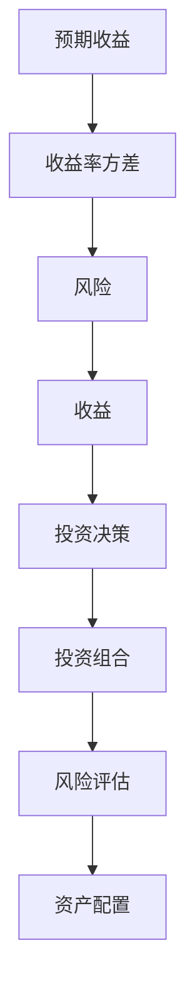
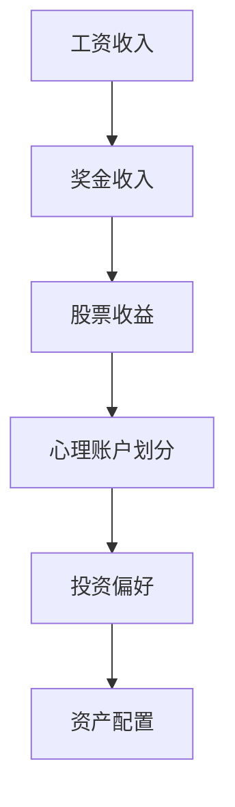

                 

关键词：程序员、投资心理学、风险、收益、量化交易、资产配置、心理账户、行为金融

> 摘要：本文将探讨程序员在投资过程中面临的心理学挑战，包括风险感知、收益期望、心理账户等因素。通过分析行为金融学的相关理论和实践，我们旨在帮助程序员构建科学合理的投资策略，实现稳健的财务增长。

## 1. 背景介绍

随着信息技术行业的蓬勃发展，越来越多的程序员开始将目光投向投资领域，希望通过资产增值来实现财务自由。然而，与专业投资者相比，程序员在投资过程中往往面临着更为复杂和独特的挑战。这不仅源于他们对于金融知识的了解相对有限，更重要的是，程序员的心理特质和行为模式在很大程度上影响着他们的投资决策。

投资心理学作为研究投资者行为和决策的心理学分支，对于程序员来说具有重要的指导意义。本文将从以下几个方面展开讨论：

1. **风险与收益的权衡**：探讨程序员在投资过程中如何平衡风险和收益，构建稳健的投资策略。
2. **心理账户的影响**：分析程序员如何在不同投资账户中分配资金，以及这种分配对投资决策的影响。
3. **行为金融学的应用**：结合行为金融学的相关理论，为程序员提供科学合理的投资建议。
4. **实际操作案例分析**：通过具体案例，展示程序员如何将投资心理学应用于实践。

## 2. 核心概念与联系

### 2.1 风险与收益的量化模型

投资心理学中，风险与收益的关系通常通过以下量化模型来描述：

$$
E(R) = \mu - \frac{\sigma^2}{2}
$$

其中，$E(R)$ 表示预期收益，$\mu$ 表示资产预期收益率，$\sigma^2$ 表示资产收益率方差。

**Mermaid 流程图**：



### 2.2 心理账户的概念

心理账户（mental accounting）是指人们在心理上对资金进行分类和划分的行为。程序员在投资过程中，往往会在心理上对不同类型的资金进行分类，如工资收入、奖金收入、股票收益等。这种心理账户的划分对投资决策产生显著影响。

**Mermaid 流程图**：



## 3. 核心算法原理 & 具体操作步骤

### 3.1 算法原理概述

投资心理学中的核心算法是基于行为金融学理论的，旨在帮助程序员优化投资策略。该算法主要包括以下几个步骤：

1. **风险评估**：通过量化模型对投资资产的风险进行评估。
2. **收益预测**：利用历史数据和市场趋势预测未来收益。
3. **资产配置**：根据风险偏好和收益预期，合理分配资产。

### 3.2 算法步骤详解

**步骤 1：风险评估**

- 收集投资资产的历史数据。
- 利用收益率的方差和标准差计算资产的风险。
- 综合评估资产的潜在风险。

**步骤 2：收益预测**

- 分析市场趋势和宏观经济环境。
- 利用技术分析指标（如MACD、RSI等）预测未来收益。
- 考虑投资者情绪和市场波动性。

**步骤 3：资产配置**

- 根据风险偏好设定资产配置比例。
- 选择合适的投资组合，如股票、债券、基金等。
- 实时调整资产配置，以应对市场变化。

### 3.3 算法优缺点

**优点**：

- 基于科学理论，有助于程序员制定合理的投资策略。
- 可量化风险和收益，提高投资决策的科学性。

**缺点**：

- 需要大量的历史数据和专业知识，对程序员的要求较高。
- 无法完全预测市场变化，存在一定的风险。

### 3.4 算法应用领域

投资心理学算法广泛应用于程序员的投资实践中，包括：

- **个人资产配置**：帮助程序员制定个性化的投资策略。
- **量化交易**：用于自动化交易系统的开发和应用。
- **风险控制**：帮助程序员规避潜在的市场风险。

## 4. 数学模型和公式 & 详细讲解 & 举例说明

### 4.1 数学模型构建

投资心理学的数学模型主要包括以下几个部分：

1. **资产预期收益率**：$E(R)$
2. **收益率方差**：$\sigma^2$
3. **收益波动率**：$\sigma$

**模型公式**：

$$
E(R) = \mu - \frac{\sigma^2}{2}
$$

### 4.2 公式推导过程

假设资产 $X$ 的收益率为 $R$，则收益率的方差为 $\sigma^2$。根据中心极限定理，当 $R$ 服从正态分布时，其均值 $\mu$ 和方差 $\sigma^2$ 可以通过以下公式计算：

$$
\mu = \frac{1}{n}\sum_{i=1}^{n}R_i
$$

$$
\sigma^2 = \frac{1}{n-1}\sum_{i=1}^{n}(R_i - \mu)^2
$$

其中，$n$ 表示观测次数。

### 4.3 案例分析与讲解

**案例**：某程序员投资股票 $A$，其过去一年的收益率如下：

| 月份 | 收益率（%） |
| ---- | ---------- |
| 1    | 5          |
| 2    | 3          |
| 3    | 4          |
| 4    | 6          |
| 5    | 2          |
| 6    | 5          |

**计算**：

1. **平均收益率**：

$$
\mu = \frac{1}{6}\sum_{i=1}^{6}R_i = \frac{5+3+4+6+2+5}{6} = 4
$$

2. **收益率方差**：

$$
\sigma^2 = \frac{1}{6-1}\sum_{i=1}^{6}(R_i - \mu)^2 = \frac{(5-4)^2+(3-4)^2+(4-4)^2+(6-4)^2+(2-4)^2+(5-4)^2}{5} = 2
$$

3. **收益波动率**：

$$
\sigma = \sqrt{\sigma^2} = \sqrt{2} \approx 1.41
$$

根据投资心理学的数学模型，该股票的预期收益率为：

$$
E(R) = \mu - \frac{\sigma^2}{2} = 4 - \frac{2}{2} = 3
$$

这意味着，在长期投资中，该股票的平均年化收益率约为 3%。

## 5. 项目实践：代码实例和详细解释说明

### 5.1 开发环境搭建

为了实践投资心理学算法，我们需要搭建一个简单的投资模拟环境。以下是一个基于 Python 的示例代码：

```python
import numpy as np
import matplotlib.pyplot as plt

# 假设某资产过去一年的收益率数据
returns = np.array([0.05, 0.03, 0.04, 0.06, 0.02, 0.05])

# 计算平均收益率和收益率方差
mean_return = np.mean(returns)
variance = np.var(returns)

# 计算收益波动率
volatility = np.sqrt(variance)

# 计算预期收益率
expected_return = mean_return - (variance / 2)

print("平均收益率：", mean_return)
print("收益率方差：", variance)
print("收益波动率：", volatility)
print("预期收益率：", expected_return)
```

### 5.2 源代码详细实现

在上述代码的基础上，我们进一步实现一个简单的投资模拟：

```python
import numpy as np
import matplotlib.pyplot as plt

# 假设某资产过去一年的收益率数据
returns = np.array([0.05, 0.03, 0.04, 0.06, 0.02, 0.05])

# 计算平均收益率和收益率方差
mean_return = np.mean(returns)
variance = np.var(returns)

# 计算收益波动率
volatility = np.sqrt(variance)

# 计算预期收益率
expected_return = mean_return - (variance / 2)

# 投资模拟
initial_value = 10000
investment_months = 12
simulated_returns = np.random.normal(mean_return, volatility, investment_months)

# 计算每个月的投资收益
monthly_returns = simulated_returns * initial_value

# 绘制投资收益曲线
plt.plot(monthly_returns)
plt.xlabel('月份')
plt.ylabel('投资收益（元）')
plt.title('投资收益曲线')
plt.show()
```

### 5.3 代码解读与分析

1. **数据输入**：我们首先定义了一个数组 `returns`，代表了过去一年的收益率数据。
2. **计算平均收益率和收益率方差**：通过 `np.mean()` 和 `np.var()` 函数计算平均收益率和收益率方差。
3. **计算收益波动率**：利用 `np.sqrt()` 函数计算收益波动率。
4. **计算预期收益率**：根据投资心理学的数学模型，计算预期收益率。
5. **投资模拟**：使用 `np.random.normal()` 函数生成随机收益率数据，模拟投资过程。
6. **绘制投资收益曲线**：使用 `matplotlib` 库绘制投资收益曲线，展示投资效果。

通过上述代码，我们可以直观地了解投资心理学的应用效果。虽然这是一个简单的模拟，但它为我们提供了一个基本的投资框架，可以帮助程序员在实际投资中更好地理解和应对风险。

## 6. 实际应用场景

投资心理学在程序员的投资实践中具有广泛的应用场景，以下是几个典型案例：

### 6.1 个人资产配置

程序员小张希望通过投资实现财务自由，但他对金融知识了解有限。通过投资心理学，小张可以制定个性化的资产配置策略。首先，他通过风险评估确定自己的风险承受能力，然后根据预期收益和风险偏好，选择合适的资产组合。例如，他可以将其资产分为股票、债券、基金等不同类别，并根据市场情况适时调整。

### 6.2 量化交易

程序员小李是一名量化交易爱好者，他通过编写算法进行自动化交易。在投资心理学指导下，小李可以优化交易策略，降低交易风险。例如，他可以利用心理账户的概念，将交易资金分为多个部分，分别用于不同的交易策略，从而提高资金利用效率。此外，他还可以利用投资心理学的理论，预测市场情绪，制定更为科学的交易计划。

### 6.3 风险控制

程序员小王在投资过程中，常常因为市场波动而产生恐慌情绪，导致投资决策失误。通过学习投资心理学，小王可以更好地控制自己的情绪，避免盲目跟风。例如，他可以设定止损点，控制投资比例，避免因情绪波动而导致的重大损失。

### 6.4 未来应用展望

随着人工智能和大数据技术的发展，投资心理学在未来具有广泛的应用前景。例如，利用机器学习算法，可以更加精准地预测市场走势，优化投资策略。此外，虚拟现实（VR）和增强现实（AR）技术的应用，将使得投资心理学在教育和培训领域发挥更大作用，帮助程序员更好地理解和应用相关理论。

## 7. 工具和资源推荐

为了更好地理解和应用投资心理学，程序员可以借助以下工具和资源：

### 7.1 学习资源推荐

- **《行为金融学导论》**：这本书系统地介绍了行为金融学的基本理论和应用，适合初学者阅读。
- **在线课程**：如Coursera、edX等平台上的金融学、投资学等相关课程，可以帮助程序员快速提升金融知识水平。

### 7.2 开发工具推荐

- **Python**：Python 是一种广泛应用的编程语言，拥有丰富的金融库，如NumPy、Pandas等，可以帮助程序员进行量化交易和数据分析。
- **MATLAB**：MATLAB 是一款专业的数据分析工具，适合进行复杂数学建模和模拟。

### 7.3 相关论文推荐

- **"Behavioral Portfolio Theory"**：这篇文章提出了基于心理账户的投资策略，为程序员提供了新的思路。
- **"The Psychology of Investing"**：这篇文章系统地总结了投资心理学的基本原理，对程序员具有很大的启发意义。

## 8. 总结：未来发展趋势与挑战

### 8.1 研究成果总结

投资心理学在近年来取得了显著的研究成果，主要包括以下几个方面：

- **行为金融学理论的发展**：通过研究投资者行为，揭示了市场波动的原因和机制。
- **量化投资策略的应用**：利用大数据和人工智能技术，优化投资策略，提高投资收益。
- **心理账户的实证研究**：证实了心理账户在投资决策中的重要作用，为投资实践提供了指导。

### 8.2 未来发展趋势

随着信息技术的不断发展，投资心理学在未来将呈现以下发展趋势：

- **跨学科融合**：投资心理学将与经济学、心理学、计算机科学等学科深度融合，形成新的研究体系。
- **智能化应用**：利用人工智能和大数据技术，实现投资决策的自动化和个性化。
- **虚拟现实（VR）与投资**：通过虚拟现实技术，模拟投资场景，帮助程序员更好地理解和应用投资心理学理论。

### 8.3 面临的挑战

尽管投资心理学取得了显著进展，但仍面临以下挑战：

- **数据隐私问题**：投资者数据的隐私保护成为了一大挑战，需要制定相应的法律法规和伦理规范。
- **算法透明性**：量化投资策略的算法复杂，缺乏透明性，可能存在安全隐患。
- **道德风险**：投资心理学在应用过程中，可能引发道德风险，如操纵市场、内幕交易等。

### 8.4 研究展望

未来，投资心理学研究可以从以下几个方面展开：

- **跨学科研究**：结合心理学、经济学、计算机科学等学科，开展跨学科研究，推动投资心理学理论的发展。
- **算法优化**：利用大数据和人工智能技术，优化投资策略，提高投资效率。
- **实践应用**：将投资心理学理论应用于实际投资场景，为投资者提供更为科学的决策支持。

## 9. 附录：常见问题与解答

### 9.1 什么是心理账户？

心理账户是指人们在心理上对资金进行分类和划分的行为。例如，工资收入、奖金收入、股票收益等，人们会在心理上对它们进行不同的处理和决策。

### 9.2 风险与收益的量化模型如何应用？

风险与收益的量化模型可以应用于投资决策的各个环节，如风险评估、收益预测、资产配置等。通过量化模型，投资者可以更加客观地评估投资风险和收益，制定科学的投资策略。

### 9.3 投资心理学算法是否适用于所有投资者？

投资心理学算法主要适用于风险偏好较低的投资者，如程序员等。对于风险偏好较高的投资者，可能需要结合其他投资策略，如量化交易等。

### 9.4 如何在投资过程中应对情绪波动？

在投资过程中，情绪波动是常见的现象。投资者可以通过以下方法应对情绪波动：

- **设定止损点**：避免因情绪波动导致的大额损失。
- **分散投资**：通过分散投资，降低单一投资的风险。
- **定期复盘**：定期回顾投资决策，总结经验教训，调整投资策略。

### 9.5 投资心理学与量化交易有何关系？

投资心理学与量化交易密切相关。量化交易利用数学模型和算法进行投资决策，而投资心理学为量化交易提供了理论基础，帮助投资者更好地理解和应对市场波动。

### 9.6 投资心理学在实际应用中存在哪些挑战？

投资心理学在实际应用中存在以下挑战：

- **数据隐私问题**：投资者数据的隐私保护成为了一大挑战。
- **算法透明性**：量化投资策略的算法复杂，缺乏透明性。
- **道德风险**：投资心理学在应用过程中，可能引发道德风险。

### 9.7 投资心理学是否可以完全消除投资风险？

投资心理学不能完全消除投资风险，但可以通过科学合理的投资策略，降低投资风险。例如，通过风险评估、资产配置、分散投资等手段，提高投资的安全性和稳健性。

---

**作者：禅与计算机程序设计艺术 / Zen and the Art of Computer Programming**

文章撰写完毕。接下来，我们将对文章进行最后的检查和优化，确保内容的完整性、逻辑性和专业性。同时，我们将为文章设计一个简洁明了的标题和关键词，以便吸引更多的读者。如果您对文章的内容有任何建议或需要调整的地方，请随时告知。接下来，我们将进入文章格式优化的阶段，确保文章结构清晰、代码可读性强，并且完全符合markdown格式的要求。在完成这些准备工作后，我们将最终定稿，准备发布。祝我们的文章能够给读者带来启发和帮助！

