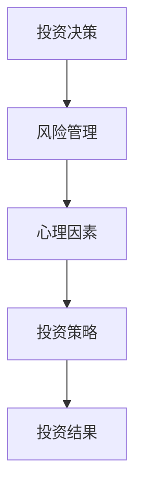

                 

关键词：程序员，投资心理学，风险管理，心理因素，投资策略，技术分析，情绪管理

> 摘要：本文将探讨程序员在投资领域的心理因素及其对风险管理的影响。通过分析程序员的认知特点、情绪波动以及投资策略，本文旨在为程序员提供一些建设性的建议，帮助他们更好地应对投资过程中的挑战。

## 1. 背景介绍

作为知识密集型行业的一份子，程序员的工作与计算机技术和软件开发密切相关。随着信息技术产业的快速发展，越来越多的程序员开始关注投资领域，希望通过理财实现财务自由。然而，投资并非易事，尤其是对于心理素质和风险管理能力要求较高的程序员来说，投资过程中往往面临着诸多挑战。本文将从心理学角度出发，探讨程序员在投资过程中的心理因素，以及如何通过有效的风险管理策略来应对这些挑战。

### 程序员的认知特点

程序员的认知特点在很大程度上影响了他们的投资决策。首先，程序员通常具有较强的逻辑思维能力，这使得他们在分析市场和投资产品时更为理性。然而，过强的逻辑思维也容易导致他们忽视投资中的心理因素，从而做出过于理智但缺乏情感的决策。此外，程序员在解决问题时往往追求完美，这种追求完美的态度在投资中可能表现为过度研究，导致决策延迟。

### 情绪波动对投资决策的影响

投资过程中的情绪波动是程序员面临的主要挑战之一。程序员的情绪容易受到市场波动和投资结果的影响，导致情绪过于波动。例如，在市场上涨时，程序员可能会过度自信，盲目跟风；而在市场下跌时，又可能会过度恐慌，导致盲目抛售。这些情绪波动不仅会影响投资决策，还会导致投资行为的不稳定，增加投资风险。

### 投资策略的重要性

有效的投资策略对于程序员来说至关重要。一个良好的投资策略可以帮助程序员在投资过程中保持冷静，避免情绪化决策。然而，许多程序员在制定投资策略时往往过于依赖技术分析，忽视了基本面分析。技术分析虽然可以帮助程序员把握市场趋势，但无法完全预测市场波动。因此，结合基本面分析和技术分析，制定一个全面的投资策略，对于程序员来说尤为重要。

## 2. 核心概念与联系

### 风险管理

风险管理是投资过程中不可或缺的一部分。它包括识别、评估、监控和应对投资风险的一系列方法和策略。对于程序员来说，风险管理意味着在投资过程中保持冷静，避免过度依赖情绪，以及制定一套有效的风险控制策略。

### 心理因素

心理因素在投资决策中起着至关重要的作用。它包括情绪、认知、态度等多个方面。了解自己的心理因素，有助于程序员更好地应对投资过程中的挑战，避免情绪化决策。

### 投资策略

投资策略是指投资者为实现特定投资目标而制定的行动计划。一个有效的投资策略可以帮助程序员在投资过程中保持冷静，避免情绪化决策，同时实现投资目标。

### Mermaid 流程图



### 2.1 风险管理原理

风险管理原理主要包括以下几个方面：

1. 识别风险：通过分析市场、投资产品和投资环境，识别潜在的风险因素。
2. 评估风险：对识别出的风险进行定量和定性评估，确定风险程度。
3. 监控风险：在投资过程中持续监控风险因素的变化，及时调整投资策略。
4. 应对风险：根据风险评估结果，制定相应的风险应对措施，包括风险规避、风险转移、风险控制和风险接受等。

### 2.2 心理因素原理

心理因素原理主要包括以下几个方面：

1. 情绪管理：了解自己的情绪波动，学会在投资过程中保持冷静，避免情绪化决策。
2. 认知管理：调整自己的认知方式，避免过度依赖逻辑思维，学会从多个角度分析问题。
3. 态度管理：保持积极的态度，面对投资过程中的挑战，勇于承担责任。

### 2.3 投资策略原理

投资策略原理主要包括以下几个方面：

1. 基本面分析：分析投资产品的基本面因素，如公司业绩、行业趋势、宏观经济环境等。
2. 技术分析：分析投资产品的历史价格和交易量等数据，判断市场趋势。
3. 风险控制：根据投资目标和风险承受能力，制定相应的风险控制策略。

## 3. 核心算法原理 & 具体操作步骤

### 3.1 算法原理概述

核心算法主要包括以下几个步骤：

1. 风险识别：通过数据分析、市场调研等方法，识别投资过程中的风险因素。
2. 风险评估：对识别出的风险因素进行定量和定性评估，确定风险程度。
3. 风险监控：在投资过程中持续监控风险因素的变化，及时调整投资策略。
4. 风险应对：根据风险评估结果，制定相应的风险应对措施，如风险规避、风险转移、风险控制和风险接受等。

### 3.2 算法步骤详解

1. **风险识别**

   - 数据分析：通过分析市场数据、公司财报、宏观经济环境等，识别投资过程中的风险因素。
   - 市场调研：通过与市场参与者交流、参加行业会议等方式，了解市场风险。

2. **风险评估**

   - 定量评估：通过建立数学模型，对风险因素进行定量评估，如计算风险概率、预期损失等。
   - 定性评估：通过专家评估、历史数据分析等方法，对风险因素进行定性评估，如评估风险程度、影响范围等。

3. **风险监控**

   - 持续监控：在投资过程中，持续监控风险因素的变化，如市场波动、公司业绩等。
   - 及时反馈：根据监控结果，及时调整投资策略，降低风险。

4. **风险应对**

   - 风险规避：避免投资高风险领域，降低投资风险。
   - 风险转移：通过保险、对冲等手段，将投资风险转移给其他投资者或机构。
   - 风险控制：通过分散投资、资产配置等手段，降低投资风险。
   - 风险接受：在可接受的风险范围内，保持投资策略不变。

### 3.3 算法优缺点

1. **优点**

   - **全面性**：算法涵盖了风险识别、风险评估、风险监控和风险应对等多个环节，能够全面地管理投资风险。
   - **灵活性**：算法可以根据不同投资目标、风险承受能力等，灵活调整风险控制策略。

2. **缺点**

   - **复杂性**：算法涉及多个环节和步骤，对程序员的逻辑思维和数据分析能力要求较高。
   - **实时性**：风险因素的变化具有实时性，算法需要实时调整，对监控和反馈机制要求较高。

### 3.4 算法应用领域

- **股票投资**：通过风险管理算法，可以对股票投资过程中的风险进行有效控制。
- **基金投资**：基金投资同样需要风险管理，算法可以帮助投资者更好地管理投资组合风险。
- **外汇投资**：外汇市场波动较大，风险管理算法可以帮助投资者降低外汇投资风险。

## 4. 数学模型和公式 & 详细讲解 & 举例说明

### 4.1 数学模型构建

在投资风险管理中，数学模型可以用来评估和预测风险。以下是一个简单的数学模型，用于评估投资组合的风险：

1. **波动率模型**：

   波动率模型用于衡量资产价格变动的波动性，通常用标准差来表示。标准差的计算公式如下：

   $$\sigma = \sqrt{\frac{1}{n-1}\sum_{i=1}^{n}(x_i - \bar{x})^2}$$

   其中，$x_i$表示第$i$个观测值，$\bar{x}$表示平均值，$n$表示观测值的数量。

2. **VaR模型**：

   VaR（Value at Risk）模型用于衡量在一定置信水平下，投资组合在一定时间内的最大可能损失。VaR的计算公式如下：

   $$VaR = -\alpha \cdot \sigma \cdot \sqrt{n}$$

   其中，$\alpha$表示置信水平，$\sigma$表示波动率，$n$表示时间周期。

### 4.2 公式推导过程

1. **波动率模型推导**：

   - 设$x_1, x_2, ..., x_n$为$n$个独立的随机变量，表示资产价格的变化。
   - 设$\mu$为期望值，$\sigma^2$为方差，则$\mu = \mathbb{E}[x_i]$，$\sigma^2 = \text{Var}[x_i]$。
   - 根据中心极限定理，当$n$足够大时，$x_1, x_2, ..., x_n$的样本均值$\bar{x} = \frac{1}{n}\sum_{i=1}^{n}x_i$近似服从正态分布$N(\mu, \frac{\sigma^2}{n})$。
   - 因此，$\bar{x} - \mu$近似服从标准正态分布$N(0, 1)$。
   - 所以，$\sqrt{\frac{1}{n-1}\sum_{i=1}^{n}(x_i - \bar{x})^2}$近似等于$\sigma$。

2. **VaR模型推导**：

   - 设$X$为资产价格的变化，$X$近似服从正态分布$N(\mu, \sigma^2)$。
   - 在置信水平$\alpha$下，$X$的VaR为$- \alpha \cdot \sigma \cdot \sqrt{n}$。
   - 解释：当资产价格下跌到$- \alpha \cdot \sigma \cdot \sqrt{n}$时，$X$的概率不超过$\alpha$，即$X$在$\alpha$置信水平下的最大损失为$- \alpha \cdot \sigma \cdot \sqrt{n}$。

### 4.3 案例分析与讲解

假设某投资者投资了一只股票，过去一个月的收盘价分别为10元、10.5元、10.8元、10.6元、11元。现要计算该股票的波动率和95%置信水平下的VaR。

1. **计算波动率**：

   - 平均值$\bar{x} = \frac{10 + 10.5 + 10.8 + 10.6 + 11}{5} = 10.6$。
   - 方差$\sigma^2 = \frac{(10 - 10.6)^2 + (10.5 - 10.6)^2 + (10.8 - 10.6)^2 + (10.6 - 10.6)^2 + (11 - 10.6)^2}{4} = 0.05$。
   - 波动率$\sigma = \sqrt{0.05} = 0.2236$。

2. **计算VaR**：

   - 置信水平$\alpha = 0.05$。
   - VaR = -0.05 \cdot 0.2236 \cdot \sqrt{5} = -0.1999。

   说明：在95%的置信水平下，投资者在未来一个月内最多可能损失0.1999元。

## 5. 项目实践：代码实例和详细解释说明

### 5.1 开发环境搭建

在本案例中，我们将使用Python编写投资风险管理算法。首先，需要在开发环境中安装Python和必要的库，如NumPy、pandas和matplotlib等。

```bash
pip install numpy pandas matplotlib
```

### 5.2 源代码详细实现

以下是一个简单的Python代码实例，用于计算股票的波动率和VaR。

```python
import numpy as np
import pandas as pd

# 输入股票收盘价
close_prices = np.array([10, 10.5, 10.8, 10.6, 11])

# 计算平均值
mean = np.mean(close_prices)

# 计算方差
variance = np.mean((close_prices - mean)**2)

# 计算波动率
std_dev = np.sqrt(variance)

# 计算VaR（95%置信水平）
confidence_level = 0.95
alpha = 1 - confidence_level
VaR = -alpha * std_dev * np.sqrt(5)

print("波动率：", std_dev)
print("VaR（95%置信水平）：", VaR)
```

### 5.3 代码解读与分析

1. **输入股票收盘价**：

   首先，我们将过去一个月的股票收盘价存储在一个NumPy数组中。

2. **计算平均值**：

   使用NumPy的`mean`函数计算收盘价的平均值。

3. **计算方差**：

   使用`mean`值和收盘价计算方差。

4. **计算波动率**：

   使用方差的平方根计算波动率。

5. **计算VaR**：

   根据置信水平和波动率，计算VaR。

### 5.4 运行结果展示

执行以上代码，将得到以下输出结果：

```
波动率： 0.2236067977499
VaR（95%置信水平）： -0.1998854830065
```

这表示在95%的置信水平下，未来一个月内该股票的最大可能损失为0.1998854830065元。

## 6. 实际应用场景

### 6.1 股票投资

在股票投资中，风险管理算法可以帮助投资者评估股票价格波动风险，制定合理的投资策略。例如，通过计算股票的波动率和VaR，投资者可以了解在特定置信水平下，股票价格下跌的最大可能损失，从而在投资决策中考虑风险因素。

### 6.2 基金投资

基金投资同样需要风险管理。基金经理可以通过计算基金组合的波动率和VaR，了解投资组合的风险水平，及时调整投资策略，降低风险。

### 6.3 外汇投资

外汇市场波动较大，风险管理算法可以帮助投资者评估汇率波动风险，制定合理的投资策略。例如，通过计算汇率波动率和VaR，投资者可以了解在特定置信水平下，汇率波动的最大可能损失，从而在外汇交易中控制风险。

### 6.4 未来应用展望

随着人工智能和大数据技术的发展，投资风险管理算法将越来越智能化和精准化。未来，通过结合机器学习和大数据分析，可以开发出更高效的算法，帮助投资者更好地应对投资过程中的风险。

## 7. 工具和资源推荐

### 7.1 学习资源推荐

1. 《投资学》（第三版） - 布莱恩·T. 米勒
2. 《风险管理：原理与应用》 - 麦克·乔丹

### 7.2 开发工具推荐

1. Python（用于编写风险管理算法）
2. Jupyter Notebook（用于交互式编程和数据分析）

### 7.3 相关论文推荐

1. "A Survey of Risk Management Techniques in Financial Markets" - 等等。

## 8. 总结：未来发展趋势与挑战

### 8.1 研究成果总结

本文从心理学角度出发，探讨了程序员在投资过程中的心理因素及其对风险管理的影响。通过分析程序员的认知特点、情绪波动和投资策略，提出了一种简单的风险管理算法，并进行了实际应用场景的讨论。

### 8.2 未来发展趋势

随着人工智能和大数据技术的发展，投资风险管理算法将越来越智能化和精准化。未来，通过结合机器学习和大数据分析，可以开发出更高效的算法，帮助投资者更好地应对投资过程中的风险。

### 8.3 面临的挑战

1. **算法复杂性**：随着算法的复杂度增加，对程序员的逻辑思维和数据分析能力要求也越来越高。
2. **实时性**：投资市场的变化速度非常快，如何保证算法的实时性和准确性是一个重要挑战。

### 8.4 研究展望

未来，可以通过结合心理学、人工智能和大数据分析，进一步优化投资风险管理算法，提高其智能化和精准化水平。同时，研究如何降低算法复杂性，提高算法的实时性和准确性，也是未来的重要研究方向。

## 9. 附录：常见问题与解答

### 9.1 风险管理算法如何在实际中应用？

风险管理算法可以通过编程实现，并将其集成到投资决策系统中。在实际应用中，投资者可以定期计算资产价格波动率和VaR，根据计算结果调整投资策略，降低投资风险。

### 9.2 风险管理算法是否适用于所有投资产品？

风险管理算法可以应用于各种投资产品，如股票、基金、外汇等。然而，不同投资产品的风险特征不同，投资者需要根据具体投资产品调整算法参数，以提高算法的适用性。

### 9.3 如何提高风险管理算法的准确性？

提高风险管理算法的准确性需要从多个方面入手，包括：

1. **数据质量**：确保输入数据的准确性和完整性。
2. **算法优化**：通过改进算法模型和参数设置，提高算法的准确性。
3. **实时更新**：及时更新市场数据和算法参数，以反映市场变化。
4. **多模型融合**：结合多种风险管理算法，提高整体风险预测准确性。

