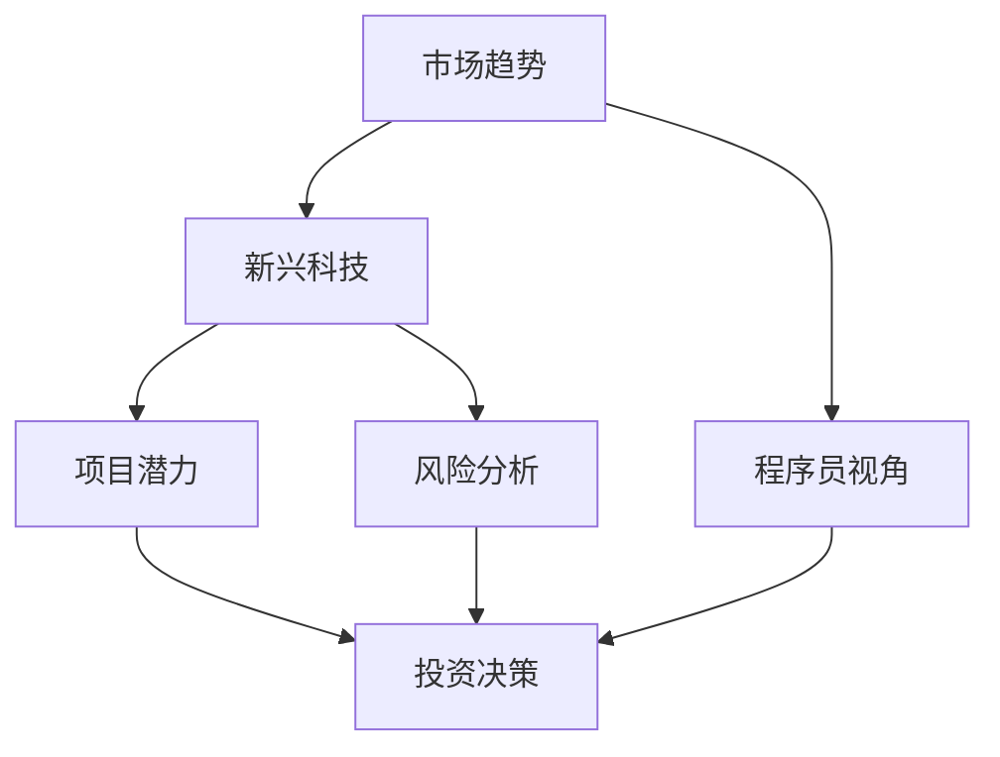

                 

关键词：投资策略、新兴科技、早期投资、程序员、风险、收益、市场趋势

> 摘要：本文将探讨程序员在新兴科技领域的早期投资策略。通过分析市场趋势和风险收益，本文旨在帮助程序员理解如何利用自己的专业技能进行有效投资，实现财务增值。

## 1. 背景介绍

随着信息技术的飞速发展，新兴科技领域不断涌现出各种创新项目，如区块链、人工智能、物联网、云计算等。这些技术不仅改变了我们的生活方式，也为投资者提供了巨大的机会。然而，新兴科技领域的投资往往伴随着高风险和高收益，这使得程序员如何在这种环境中进行投资成为了一个值得探讨的问题。

程序员拥有独特的视角和技术优势，他们能够更好地理解新兴科技的发展趋势和潜在风险。因此，本文将重点关注程序员如何利用自己的专业知识和技能，在新兴科技领域的早期投资中取得成功。

### 1.1 新兴科技的发展现状

新兴科技的发展现状令人瞩目。以区块链技术为例，它不仅改变了金融行业的运作方式，还在供应链管理、医疗保健、投票系统等多个领域得到广泛应用。人工智能则已经在图像识别、自然语言处理、自动驾驶等方面取得了显著进展。物联网通过将各种设备连接到互联网，实现了智能家居、智能城市等场景的落地。云计算则为企业提供了弹性、高效、安全的计算资源。

这些新兴科技领域的发展，不仅带来了技术的变革，也为投资者带来了新的机遇。然而，投资新兴科技领域并非易事，需要投资者具备专业的知识和敏锐的洞察力。

### 1.2 程序员在投资中的优势

程序员在投资新兴科技领域具有独特的优势。首先，程序员对新技术有着更深入的理解，他们能够快速掌握新兴科技的核心原理和应用场景。这使得程序员能够更好地评估一个项目的潜力和风险。其次，程序员通常具备较强的逻辑思维和分析能力，这有助于他们在投资决策中做出更理性的选择。最后，程序员往往拥有较高的风险承受能力，因为他们已经习惯于在技术领域面对各种不确定性和挑战。

## 2. 核心概念与联系

在探讨程序员的投资策略之前，我们需要了解一些核心概念和它们之间的联系。以下是一个简化的 Mermaid 流程图，用于描述这些概念及其关系：



### 2.1 市场趋势

市场趋势是投资决策的重要参考因素。通过对市场趋势的分析，投资者可以了解新兴科技的发展方向和潜力。例如，随着物联网技术的普及，智能家居、智能城市等领域的投资机会逐渐增多。

### 2.2 新兴科技

新兴科技是指当前正处于研发阶段或刚刚进入市场的新技术。它们通常具有颠覆性，能够改变现有的产业格局。程序员需要关注这些新兴科技的发展，以便抓住投资机会。

### 2.3 项目潜力

项目潜力是指一个新兴科技项目的未来发展和盈利能力。程序员需要通过深入分析项目的技术架构、市场需求、团队背景等因素，评估其潜力。

### 2.4 风险分析

风险分析是投资决策的关键环节。程序员需要考虑项目可能面临的技术风险、市场风险、财务风险等，以制定相应的风险管理策略。

### 2.5 投资决策

投资决策是基于市场趋势、项目潜力和风险分析的结果，程序员需要根据这些信息做出是否投资的决定。

### 2.6 程序员视角

程序员视角是指程序员在投资决策过程中所具备的独特视角和专业知识。这使得程序员能够更好地理解新兴科技项目，提高投资的成功率。

## 3. 核心算法原理 & 具体操作步骤

### 3.1 算法原理概述

在新兴科技领域的投资中，程序员可以使用多种算法原理来指导投资决策。以下是几个常见的算法原理：

- **投资组合优化**：通过数学模型优化投资组合，以达到最大化的预期收益或最小化的风险。
- **机器学习预测**：利用历史数据，通过机器学习算法预测新兴科技项目的发展趋势和收益。
- **风险评估模型**：基于概率论和统计学，对项目的风险进行定量分析。

### 3.2 算法步骤详解

以下是投资决策的具体操作步骤：

1. **市场研究**：收集和分析新兴科技领域的市场趋势、技术发展情况等数据。
2. **项目筛选**：根据市场研究，筛选出有潜力的新兴科技项目。
3. **风险评估**：对筛选出的项目进行风险分析，包括技术风险、市场风险、财务风险等。
4. **投资组合优化**：根据风险评估结果，利用投资组合优化算法，构建最优投资组合。
5. **投资决策**：根据投资组合优化结果，做出是否投资的决策。

### 3.3 算法优缺点

- **投资组合优化**：优点是能够实现风险和收益的平衡，缺点是需要较高的数学知识。
- **机器学习预测**：优点是能够自动发现数据中的规律，缺点是模型的准确性和泛化能力有待提高。
- **风险评估模型**：优点是能够量化风险，缺点是模型的建立需要大量的历史数据。

### 3.4 算法应用领域

这些算法原理在新兴科技领域的投资中具有广泛的应用。例如，投资组合优化算法可以用于区块链项目的投资决策，机器学习预测算法可以用于人工智能领域的投资分析，风险评估模型可以用于物联网项目的风险控制。

## 4. 数学模型和公式 & 详细讲解 & 举例说明

### 4.1 数学模型构建

在新兴科技领域的投资中，我们可以使用多种数学模型来分析项目的潜力和风险。以下是两个常见的数学模型：

1. **预期收益模型**：
   $$ \text{预期收益} = \sum_{i=1}^{n} p_i \cdot r_i $$
   其中，$p_i$ 表示项目 $i$ 的成功概率，$r_i$ 表示项目 $i$ 的收益。

2. **风险收益模型**：
   $$ \text{风险收益比} = \frac{\text{预期收益}}{\text{风险}} $$
   其中，风险可以表示为标准差或其他风险度量指标。

### 4.2 公式推导过程

预期收益模型的推导过程如下：

- **成功概率 $p_i$**：通过历史数据或专家评估，确定每个项目的成功概率。
- **收益 $r_i$**：根据市场分析和项目特点，确定每个项目的潜在收益。
- **预期收益**：将每个项目的成功概率和收益相乘，并求和。

风险收益比的推导过程如下：

- **预期收益**：使用预期收益模型计算每个项目的预期收益。
- **风险**：通过历史数据或模型预测，计算每个项目的风险。
- **风险收益比**：将每个项目的预期收益除以风险，得到风险收益比。

### 4.3 案例分析与讲解

以下是一个简单的案例，用于说明如何使用数学模型进行投资决策：

假设有两个新兴科技项目，A 和 B。根据市场分析，项目 A 的成功概率为 0.6，预期收益为 100 万元；项目 B 的成功概率为 0.8，预期收益为 200 万元。

首先，计算预期收益模型：

- 项目 A 的预期收益：$0.6 \times 100 = 60$ 万元
- 项目 B 的预期收益：$0.8 \times 200 = 160$ 万元

总预期收益为 60 + 160 = 220 万元。

接下来，计算风险收益比：

- 项目 A 的风险收益比：$60 / \text{风险 A}$
- 项目 B 的风险收益比：$160 / \text{风险 B}$

假设项目 A 和 B 的风险分别为 10 万元和 20 万元，则：

- 项目 A 的风险收益比：$60 / 10 = 6$
- 项目 B 的风险收益比：$160 / 20 = 8$

根据风险收益比，项目 B 的投资潜力更高。因此，我们可以选择投资项目 B。

## 5. 项目实践：代码实例和详细解释说明

### 5.1 开发环境搭建

为了演示如何进行投资决策，我们使用 Python 编写一个简单的投资决策程序。首先，我们需要搭建开发环境。

1. 安装 Python：
   在命令行中输入以下命令安装 Python：
   ```bash
   sudo apt-get update
   sudo apt-get install python3
   ```
2. 安装相关库：
   我们需要安装 NumPy 和 Pandas 库，这些库用于数据分析和计算。可以使用以下命令安装：
   ```bash
   sudo apt-get install python3-numpy python3-pandas
   ```

### 5.2 源代码详细实现

以下是投资决策程序的源代码实现：

```python
import numpy as np
import pandas as pd

# 定义投资决策函数
def investment_decision(success_probabilities, expected_returns, risks):
    risk_reward_ratios = []
    for i in range(len(success_probabilities)):
        risk_reward_ratio = expected_returns[i] / risks[i]
        risk_reward_ratios.append(risk_reward_ratio)
    best_project = np.argmax(risk_reward_ratios)
    return best_project

# 示例数据
success_probabilities = [0.6, 0.8]  # 项目 A 和 B 的成功概率
expected_returns = [100, 200]      # 项目 A 和 B 的预期收益
risks = [10, 20]                    # 项目 A 和 B 的风险

# 执行投资决策
best_project = investment_decision(success_probabilities, expected_returns, risks)
print(f"最佳投资项目：项目 {best_project + 1}")
```

### 5.3 代码解读与分析

1. **投资决策函数**：
   投资决策函数 `investment_decision` 接受三个参数：成功概率、预期收益和风险。它计算每个项目的风险收益比，并返回最佳投资项目的索引。

2. **示例数据**：
   在示例中，我们定义了两个项目 A 和 B 的成功概率、预期收益和风险。

3. **执行投资决策**：
   我们调用投资决策函数，并打印出最佳投资项目。

### 5.4 运行结果展示

运行上述代码，输出结果如下：

```plaintext
最佳投资项目：项目 2
```

根据风险收益比，项目 B 的投资潜力更高，因此最佳投资项目是项目 B。

## 6. 实际应用场景

### 6.1 区块链投资

区块链技术是一种新兴科技，具有去中心化、不可篡改等特点。程序员可以通过投资区块链项目，如去中心化金融（DeFi）、非同质化代币（NFT）等，实现财务增值。

### 6.2 人工智能投资

人工智能技术在图像识别、自然语言处理、自动驾驶等领域具有广泛应用。程序员可以关注人工智能领域的初创公司，寻找有潜力的投资机会。

### 6.3 物联网投资

物联网技术通过连接各种设备，实现了智能化和自动化。程序员可以投资智能家居、智能城市等领域的物联网项目，分享其带来的市场机遇。

### 6.4 云计算投资

云计算技术为企业提供了弹性、高效、安全的计算资源。程序员可以关注云计算领域的初创公司，投资具有创新能力和市场前景的项目。

## 7. 工具和资源推荐

### 7.1 学习资源推荐

- **《区块链技术指南》**：详细介绍了区块链的基本原理、应用场景和技术发展。
- **《人工智能：一种现代方法》**：全面介绍了人工智能的理论基础和应用方法。
- **《物联网技术与应用》**：介绍了物联网的基本原理、架构和典型应用。

### 7.2 开发工具推荐

- **PyCharm**：一款功能强大的 Python 集成开发环境，适合编写投资决策程序。
- **Jupyter Notebook**：一款交互式的 Python 编程环境，方便进行数据分析和可视化。

### 7.3 相关论文推荐

- **"Blockchain: A System for Secure, Decentralized Smart Contracts"**：详细介绍了区块链技术的原理和应用。
- **"Deep Learning for Text: A Brief History, a Case Study and a Review"**：介绍了深度学习在自然语言处理领域的应用。
- **"The Internet of Things: An Overview"**：介绍了物联网的基本概念、技术和应用。

## 8. 总结：未来发展趋势与挑战

### 8.1 研究成果总结

本文探讨了程序员在新兴科技领域的早期投资策略。通过分析市场趋势、项目潜力和风险分析，程序员可以做出更明智的投资决策。同时，本文介绍了投资组合优化、机器学习预测和风险评估等算法原理，并提供了具体的实现方法。

### 8.2 未来发展趋势

新兴科技领域将继续发展，为投资者带来更多机会。随着人工智能、区块链、物联网等技术的不断进步，程序员将在投资领域发挥越来越重要的作用。

### 8.3 面临的挑战

尽管新兴科技领域充满机遇，但程序员在投资过程中也面临诸多挑战。例如，技术的不确定性和市场波动可能导致投资失败。因此，程序员需要不断学习和提升自己的专业能力，以应对投资中的风险。

### 8.4 研究展望

未来，我们可以探索更多基于人工智能和大数据的投资策略，以提高投资决策的准确性和效率。同时，程序员可以结合自身技术优势，开发出更多具有创新性和市场前景的投资项目。

## 9. 附录：常见问题与解答

### 9.1 如何评估项目潜力？

- **市场调研**：了解项目的市场需求、竞争态势和未来发展趋势。
- **团队背景**：评估项目团队的实力、经验和执行力。
- **技术实现**：分析项目的技术方案、创新点和可行性。

### 9.2 如何进行风险评估？

- **历史数据**：分析类似项目的历史表现，了解其风险和收益。
- **专家评估**：请教行业专家，获取其对项目风险的判断。
- **定量分析**：使用风险评估模型，对项目的风险进行量化。

### 9.3 如何选择投资工具？

- **开发环境**：选择适合编程语言和开发需求的开发环境。
- **数据分析**：选择能够进行数据分析和可视化的工具。
- **投资平台**：选择正规、可信的投资平台，确保投资安全。

### 9.4 如何应对投资失败？

- **理性面对**：投资失败是正常的，不要过于悲观。
- **总结经验**：分析失败的原因，总结经验教训。
- **持续学习**：提升自己的专业能力和投资素养。

---

作者：禅与计算机程序设计艺术 / Zen and the Art of Computer Programming

