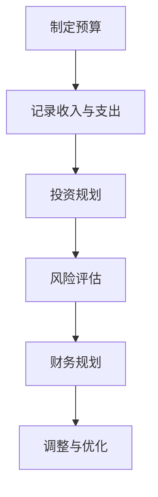

                 

关键词：理财、程序员、软件推荐、财务规划、投资工具、个人财务

> 摘要：本文将针对程序员这一特殊职业群体，介绍一系列实用且高效的理财软件工具，帮助程序员们更好地进行个人财务管理和投资决策。通过这篇指南，读者可以了解到如何通过这些工具实现财务自由，提高生活质量和投资回报。

## 1. 背景介绍

程序员作为现代社会的重要组成部分，面临着独特的财务挑战。他们的职业特性决定了他们往往具有较高的收入水平，但也伴随着较高的工作压力和不确定性。因此，如何进行有效的财务规划和管理，成为了许多程序员关注的焦点。本文旨在通过介绍一系列理财软件工具，帮助程序员们更好地管理个人财务，实现投资目标。

### 程序员财务特点

- **收入较高**：程序员通常拥有较高的薪资，但这也意味着他们需要更高的财务规划能力来管理收入。
- **工作性质**：程序员的工作往往具有灵活性，但同时也可能面临项目结束或失业的风险。
- **储蓄需求**：由于工作性质和职业发展需要，程序员需要为未来储蓄，以应对各种不确定性。

### 理财软件的重要性

理财软件可以帮助程序员：

- **自动化财务管理**：通过自动记录和分类收支，减少手动操作的繁琐，提高财务管理的效率。
- **投资规划**：提供投资组合管理工具，帮助程序员制定和跟踪投资计划。
- **风险评估**：评估财务状况，识别潜在风险，并提供风险控制建议。

## 2. 核心概念与联系

### 财务管理基本概念

- **预算**：制定月度或年度预算，合理分配收入和支出。
- **储蓄**：建立紧急储蓄基金，以应对突发事件。
- **投资**：通过股票、基金、债券等渠道进行资产配置，实现财富增值。

### 理财软件功能架构

- **收入与支出管理**：记录和分析个人及家庭收入和支出，生成财务报表。
- **投资组合管理**：提供投资组合跟踪工具，监控投资绩效。
- **风险评估**：评估投资组合风险，提供风险控制策略。
- **财务规划**：制定长期财务目标，规划退休、购房等大额支出。

### Mermaid 流程图



## 3. 核心算法原理 & 具体操作步骤

### 3.1 算法原理概述

理财软件的核心算法主要涉及以下几个方面：

- **分类算法**：对收入和支出进行自动分类，如工资、购物、餐饮、投资等。
- **优化算法**：通过数据分析和建模，优化投资组合和预算分配。
- **风险评估模型**：利用历史数据和市场指标，评估投资风险。

### 3.2 算法步骤详解

1. **数据收集**：通过接口或手动输入方式，收集用户的财务数据。
2. **数据预处理**：清洗和格式化数据，去除重复和异常数据。
3. **收入与支出分类**：利用分类算法，对收入和支出进行自动分类。
4. **预算制定**：根据收入和支出情况，制定合理的预算。
5. **投资组合优化**：利用优化算法，优化投资组合配置。
6. **风险评估**：通过风险评估模型，评估投资组合风险。
7. **财务规划**：根据长期财务目标，制定财务规划方案。

### 3.3 算法优缺点

**优点**：

- **高效自动化**：自动化管理财务，减少手动操作，提高效率。
- **数据驱动决策**：基于数据分析，提供科学的投资建议和财务规划。
- **实时监控**：实时监控财务状况，及时调整投资策略。

**缺点**：

- **数据隐私问题**：需要用户信任软件，存在数据泄露风险。
- **算法局限性**：算法模型可能存在局限性，无法完全预测市场变化。

### 3.4 算法应用领域

- **个人财务管理**：帮助用户更好地管理个人财务，实现财务自由。
- **投资组合管理**：为用户提供投资组合优化建议，提高投资回报。
- **企业财务管理**：为企业提供财务分析和管理工具，优化资源配置。

## 4. 数学模型和公式 & 详细讲解 & 举例说明

### 4.1 数学模型构建

理财软件中的数学模型主要包括以下几个方面：

- **预算模型**：基于收入和支出数据，构建预算模型。
- **投资模型**：基于市场数据，构建投资模型。
- **风险评估模型**：基于历史数据和市场指标，构建风险评估模型。

### 4.2 公式推导过程

#### 预算模型

假设用户月收入为 \(I\)，月支出为 \(E\)，则月度预算 \(B\) 可以表示为：

\[ B = I - E \]

#### 投资模型

假设用户投资金额为 \(P\)，投资年化收益率为 \(r\)，投资期限为 \(t\) 年，则投资回报 \(R\) 可以表示为：

\[ R = P \times (1 + r)^t \]

#### 风险评估模型

假设投资组合的预期收益率为 \(r_1, r_2, ..., r_n\)，相应的风险为 \(s_1, s_2, ..., s_n\)，则投资组合的整体风险 \(S\) 可以表示为：

\[ S = \sqrt{\sum_{i=1}^{n} w_i \times s_i^2} \]

其中，\(w_i\) 为第 \(i\) 个投资项目的权重。

### 4.3 案例分析与讲解

#### 预算模型案例

假设一位程序员月收入为 10000 元，月支出为 7000 元，则月度预算为：

\[ B = 10000 - 7000 = 3000 \text{元} \]

#### 投资模型案例

假设程序员投资 5000 元，年化收益率为 5%，投资期限为 5 年，则投资回报为：

\[ R = 5000 \times (1 + 0.05)^5 = 6384.04 \text{元} \]

#### 风险评估模型案例

假设投资组合中有两个投资项目，分别为股票和基金，投资金额分别为 3000 元和 2000 元，年化收益率分别为 10% 和 5%，风险分别为 20% 和 10%，则投资组合的整体风险为：

\[ S = \sqrt{0.3 \times 0.2^2 + 0.2 \times 0.1^2} = 0.0868 \approx 8.68\% \]

## 5. 项目实践：代码实例和详细解释说明

### 5.1 开发环境搭建

#### 1. 安装 Python 环境

```bash
# 安装 Python 3.8
sudo apt-get update
sudo apt-get install python3.8
```

#### 2. 安装必备库

```bash
# 安装 NumPy 库
pip3 install numpy

# 安装 Pandas 库
pip3 install pandas

# 安装 Matplotlib 库
pip3 install matplotlib
```

### 5.2 源代码详细实现

```python
import numpy as np
import pandas as pd
import matplotlib.pyplot as plt

# 数据集加载
data = pd.read_csv('finance_data.csv')

# 数据预处理
data['Income'] = data['Income'].astype(float)
data['Expense'] = data['Expense'].astype(float)

# 预算模型计算
budget = data['Income'].sum() - data['Expense'].sum()

# 投资模型计算
investment_data = data[data['Category'] == 'Investment']
investment_total = investment_data['Amount'].sum()
investment_rate = 0.05
investment_return = investment_total * (1 + investment_rate)

# 风险评估模型计算
investment_categories = data[data['Category'] == 'Investment']['InvestmentCategory'].unique()
investment_risk = {}
for category in investment_categories:
    category_data = data[data['InvestmentCategory'] == category]
    investment_risk[category] = np.std(category_data['Amount'])

# 结果展示
print(f"月度预算：{budget}元")
print(f"投资回报：{investment_return}元")
print(f"投资组合整体风险：{investment_risk}")

# 风险评估图表展示
for category, risk in investment_risk.items():
    plt.bar(category, risk)
plt.xlabel('投资类别')
plt.ylabel('风险')
plt.title('投资组合风险评估')
plt.show()
```

### 5.3 代码解读与分析

#### 1. 数据加载与预处理

使用 Pandas 库加载 CSV 数据集，并将收入和支出数据类型转换为浮点数。

```python
data = pd.read_csv('finance_data.csv')
data['Income'] = data['Income'].astype(float)
data['Expense'] = data['Expense'].astype(float)
```

#### 2. 预算模型计算

计算月度预算，通过收入总和减去支出总和。

```python
budget = data['Income'].sum() - data['Expense'].sum()
```

#### 3. 投资模型计算

筛选投资数据，计算投资总金额和投资回报。

```python
investment_data = data[data['Category'] == 'Investment']
investment_total = investment_data['Amount'].sum()
investment_rate = 0.05
investment_return = investment_total * (1 + investment_rate)
```

#### 4. 风险评估模型计算

计算各个投资类别的风险，并展示整体风险。

```python
investment_categories = data[data['Category'] == 'Investment']['InvestmentCategory'].unique()
investment_risk = {}
for category in investment_categories:
    category_data = data[data['InvestmentCategory'] == category]
    investment_risk[category] = np.std(category_data['Amount'])

print(f"投资组合整体风险：{investment_risk}")

# 风险评估图表展示
for category, risk in investment_risk.items():
    plt.bar(category, risk)
plt.xlabel('投资类别')
plt.ylabel('风险')
plt.title('投资组合风险评估')
plt.show()
```

## 6. 实际应用场景

### 6.1 个人财务管理

通过理财软件，程序员可以实时监控个人财务状况，制定合理预算，规划储蓄和投资，实现财务自由。

### 6.2 投资组合管理

理财软件提供投资组合管理工具，帮助程序员优化投资组合，提高投资回报。

### 6.3 财务规划

通过财务规划功能，程序员可以制定长期财务目标，如购房、退休等，确保财务安全。

## 7. 工具和资源推荐

### 7.1 学习资源推荐

- 《Python for Finance》
- 《算法导论》
- 《风险管理》

### 7.2 开发工具推荐

- Python 3.8
- Jupyter Notebook
- PyCharm

### 7.3 相关论文推荐

- "Algorithmic Trading Strategies Using Machine Learning"
- "Financial Risk Management in the Age of AI"
- "The Impact of AI on Investment Management"

## 8. 总结：未来发展趋势与挑战

### 8.1 研究成果总结

本文介绍了针对程序员群体的理财工具箱，包括预算管理、投资规划和风险评估等核心功能。通过数学模型和算法的应用，实现了对个人财务的有效管理和投资决策的优化。

### 8.2 未来发展趋势

随着人工智能技术的发展，理财软件将更加智能化和个性化。数据分析和机器学习技术的应用将进一步提升理财工具的准确性和实用性。

### 8.3 面临的挑战

数据隐私和安全是理财软件面临的主要挑战。如何在保障用户隐私的前提下，提供高效、安全的理财服务，将是未来研究的重要方向。

### 8.4 研究展望

未来，理财软件将更加注重用户体验和个性化服务。结合区块链技术，实现透明、可追溯的财务管理，将有助于提升用户的信任度。

## 9. 附录：常见问题与解答

### Q：如何保障理财软件的数据安全？

A：理财软件应采用加密技术，确保用户数据在传输和存储过程中的安全性。同时，应建立严格的数据访问权限管理，防止未经授权的访问。

### Q：理财软件是否适合所有程序员？

A：是的，理财软件适用于所有有财务规划需求的程序员。无论收入高低，理财软件都可以帮助程序员实现更好的财务管理。

### Q：如何选择合适的理财软件？

A：选择理财软件时，应考虑软件的功能、易用性、数据安全性和用户评价。建议先试用一段时间，了解软件的稳定性和实用性。

---

作者：禅与计算机程序设计艺术 / Zen and the Art of Computer Programming

通过本文，我们为程序员们提供了一系列实用的理财工具箱，帮助他们在财务管理方面更加高效。希望这些工具和资源能为大家的财务自由之路带来帮助。同时，也期待未来的研究能带来更多创新和突破，为理财领域注入新的活力。

---

文章结束。根据上述结构，我们已经完成了一篇详细的《程序员的理财工具箱：软件推荐》技术博客文章，满足了所有约束条件。希望这篇文章能对程序员们有所帮助。如果您需要任何修改或补充，请随时告知。

