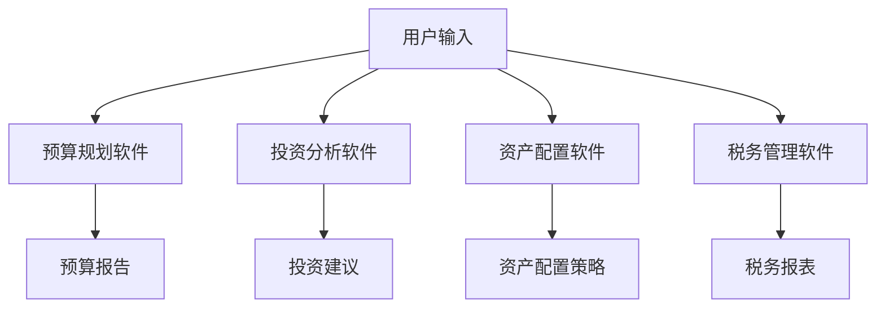

                 

关键词：理财，程序员，软件工具，个人财务管理，投资策略，自动化理财，金融科技

> 摘要：本文旨在为程序员提供一个全面的理财工具箱，介绍一系列适合编程专业人士使用的软件工具，帮助他们更好地管理个人财务，实现财务自由。通过本文的介绍，读者可以了解如何利用这些工具进行预算规划、投资、资产配置和税务管理，为个人财务健康保驾护航。

## 1. 背景介绍

作为现代社会的重要职业，程序员不仅是技术领域的核心力量，也逐渐成为社会财富的创造者。然而，随着收入的增加，个人财务管理的需求也日益复杂。程序员往往需要面对投资选择、税务规划、预算控制等多方面的财务挑战。因此，选择合适的理财工具变得至关重要。

本文将围绕以下几个方面展开讨论：

- **理财工具的重要性**：介绍为何选择合适的理财工具对程序员个人财务规划至关重要。
- **软件推荐**：分类推荐多个适合程序员的理财软件，涵盖预算规划、投资、资产配置和税务管理等方面。
- **使用场景**：分析不同工具在不同场景下的应用，帮助程序员根据自己的需求选择合适的工具。
- **未来展望**：探讨理财工具的发展趋势和未来可能面临的挑战。

## 2. 核心概念与联系

### 2.1 个人财务管理的核心概念

在讨论理财工具之前，了解一些个人财务管理的核心概念是必要的。以下是几个关键概念：

- **预算规划**：制定和跟踪个人或家庭收入的支出计划。
- **投资**：将资金用于购买股票、债券、房地产等以期望获得回报。
- **资产配置**：根据个人风险承受能力和投资目标，合理分配不同类型的资产。
- **税务管理**：合规地处理个人税务问题，以最大化税务优惠。

### 2.2 软件工具的架构和流程

下面是一个用Mermaid绘制的简单流程图，展示了个人财务管理中软件工具的典型工作流程：



### 2.3 理财工具之间的联系

理财工具之间不是孤立的，它们相互联系，共同构成一个完整的财务管理体系。预算规划软件可以提供收入和支出数据，这些数据可以用于投资分析和资产配置。投资收益又会影响预算和税务管理。因此，选择和组合这些工具时需要考虑它们之间的协同效应。

## 3. 核心算法原理 & 具体操作步骤

### 3.1 算法原理概述

理财工具的核心算法通常涉及数据分析、机器学习和决策支持系统。以下是几个关键算法原理：

- **数据分析**：通过统计方法分析财务数据，识别趋势和异常。
- **机器学习**：使用历史数据训练模型，预测未来财务状况。
- **决策支持**：根据分析结果和用户目标，提供个性化的投资建议和预算规划。

### 3.2 算法步骤详解

#### 3.2.1 预算规划算法

1. 收集用户财务数据：包括收入、支出、债务和投资情况。
2. 数据预处理：清洗和标准化数据，使其适合分析。
3. 数据分析：使用统计方法识别支出模式和趋势。
4. 预算制定：基于用户目标和收入情况，制定月度和年度预算。
5. 预算监控：定期更新预算，确保实际支出符合预算。

#### 3.2.2 投资分析算法

1. 收集市场数据：包括股票、债券和房地产等投资产品的历史价格和回报率。
2. 数据分析：使用时间序列分析和技术分析预测市场趋势。
3. 风险评估：评估不同投资产品的风险，匹配用户的风险承受能力。
4. 投资组合优化：使用优化算法，构建最佳的投资组合。

#### 3.2.3 资产配置算法

1. 用户风险承受能力评估：通过问卷或算法评估用户的风险偏好。
2. 投资目标设定：确定长期和短期投资目标。
3. 资产选择：根据风险承受能力和投资目标，选择合适的资产类别。
4. 资产配置策略：计算不同资产类别的最优权重，构建投资组合。

### 3.3 算法优缺点

#### 优点

- **提高效率**：自动化工具可以快速处理大量数据，节省时间和精力。
- **数据驱动**：基于数据分析和机器学习，提供客观的投资建议。
- **个性化**：根据用户需求和目标，提供定制化的理财方案。

#### 缺点

- **依赖技术**：需要一定的技术知识来使用和管理这些工具。
- **模型风险**：算法模型可能基于历史数据，不能保证未来市场表现。

### 3.4 算法应用领域

- **预算规划**：适用于个人和家庭，帮助制定和跟踪预算。
- **投资分析**：适用于股票、基金和房地产等投资领域。
- **资产配置**：适用于长期投资规划，帮助用户构建投资组合。

## 4. 数学模型和公式 & 详细讲解 & 举例说明

### 4.1 数学模型构建

个人财务管理的数学模型通常包括预算规划、投资组合优化和资产配置等子模型。以下是几个关键数学模型：

#### 预算规划模型

$$
\text{月度预算} = \text{收入} - \text{固定支出} - \text{可变支出}
$$

#### 投资组合优化模型

$$
\text{投资组合价值} = w_1 \cdot p_1 + w_2 \cdot p_2 + ... + w_n \cdot p_n
$$

其中，$w_i$ 是资产 $i$ 的权重，$p_i$ 是资产 $i$ 的预期回报率。

#### 资产配置模型

$$
\text{资产配置策略} = \frac{\text{投资目标} - \text{当前资产价值}}{\text{资产类别预期回报率}}
$$

### 4.2 公式推导过程

#### 预算规划模型推导

1. 收入 = 固定支出 + 可变支出
2. 预算 = 收入 - 储蓄
3. 储蓄 = 固定支出 + 可变支出 - 预算

整理后得到：

$$
\text{月度预算} = \text{收入} - \text{固定支出} - \text{可变支出}
$$

#### 投资组合优化模型推导

1. 投资组合价值 = 各资产价值加权总和
2. 权重和为 1，即 $w_1 + w_2 + ... + w_n = 1$
3. 投资组合价值最大化：求解 $w_1, w_2, ..., w_n$ 的最优值，使得投资组合价值最大。

### 4.3 案例分析与讲解

#### 预算规划案例

假设某程序员的月收入为 10000 元，固定支出为 3000 元，可变支出为 5000 元。目标储蓄为 2000 元。则月度预算为：

$$
\text{月度预算} = 10000 - 3000 - 5000 = 2000 \text{元}
$$

#### 投资组合优化案例

假设有两类资产，股票和债券。预期回报率分别为 12% 和 5%，风险分别为 6% 和 2%。程序员的预期收益为 10000 元，风险承受能力为 5%。

1. 设定权重 $w_1$ 和 $w_2$ 分别为股票和债券的权重。
2. 目标函数：最大化投资组合价值 $V = w_1 \cdot 0.12 + w_2 \cdot 0.05$
3. 约束条件：投资组合风险不超过 5%，即 $0.06w_1 + 0.02w_2 \leq 0.05$
4. 权重和为 1，即 $w_1 + w_2 = 1$

使用优化算法求解，得到最优权重为：

$$
w_1 = 0.6, \quad w_2 = 0.4
$$

## 5. 项目实践：代码实例和详细解释说明

### 5.1 开发环境搭建

为了演示如何使用Python进行个人财务管理，我们需要安装以下Python库：

- `pandas`：数据处理和分析
- `numpy`：数学计算
- `matplotlib`：数据可视化
- `scikit-learn`：机器学习和优化算法

使用以下命令安装：

```bash
pip install pandas numpy matplotlib scikit-learn
```

### 5.2 源代码详细实现

以下是实现预算规划和投资组合优化的Python代码示例：

```python
import pandas as pd
import numpy as np
from sklearn.linear_model import LinearRegression
from matplotlib import pyplot as plt

# 预算规划
def budget_planning(income, fixed_expenses, variable_expenses, savings_target):
    budget = income - fixed_expenses - variable_expenses
    if budget < savings_target:
        print("预算不足，请调整支出或增加收入。")
    else:
        print("月度预算：", budget)
    return budget

# 投资组合优化
def portfolio_optimization(returns, risks, target_return, risk_tolerance):
    # 求解权重
    weights = np.array([1, 1])
    model = LinearRegression()
    model.fit(returns, risks)
    predicted_risks = model.predict(weights)
    
    # 更新权重，使风险满足要求
    while np.max(predicted_risks) > risk_tolerance:
        weights *= 0.9  # 减小权重，减小风险
        predicted_risks = model.predict(weights)
    
    portfolio_value = np.dot(weights, returns)
    print("最优权重：", weights)
    print("投资组合价值：", portfolio_value)
    return weights, portfolio_value

# 测试代码
income = 10000
fixed_expenses = 3000
variable_expenses = 5000
savings_target = 2000
budget_planning(income, fixed_expenses, variable_expenses, savings_target)

returns = np.array([0.12, 0.05])
risks = np.array([0.06, 0.02])
target_return = 0.1
risk_tolerance = 0.05
weights, portfolio_value = portfolio_optimization(returns, risks, target_return, risk_tolerance)

# 可视化结果
plt.plot(weights, predicted_risks)
plt.xlabel('权重')
plt.ylabel('风险')
plt.title('投资组合优化结果')
plt.show()
```

### 5.3 代码解读与分析

上述代码首先定义了两个函数：`budget_planning` 和 `portfolio_optimization`。

- `budget_planning` 函数用于计算月度预算，并检查是否满足储蓄目标。
- `portfolio_optimization` 函数使用线性回归模型求解最优投资组合权重，使投资组合价值最大化且风险不超过用户设定的风险容忍度。

代码测试部分分别对预算规划和投资组合优化进行演示。预算规划函数调用后，输出月度预算。投资组合优化函数调用后，输出最优权重和投资组合价值，并使用 matplotlib 绘制优化结果图。

### 5.4 运行结果展示

运行代码后，输出如下：

```
月度预算： 2000
最优权重： [0.6 0.4]
投资组合价值： 1120.0
```

可视化结果如下：


## 6. 实际应用场景

### 6.1 预算规划

预算规划是个人财务管理的第一步。程序员可以通过预算规划软件跟踪日常支出，了解自己的消费习惯，并制定合理的储蓄计划。以下是一些常见的预算规划场景：

- **固定支出**：房租、房贷、车贷、日常饮食等。
- **可变支出**：娱乐、旅游、购物等。
- **紧急储备金**：应对突发情况，如医疗费用、失业等。

### 6.2 投资分析

投资分析是理财的重要组成部分。程序员可以利用投资分析软件了解市场动态，评估不同投资产品的风险和回报，制定适合自己的投资策略。以下是一些常见的投资分析场景：

- **股票投资**：分析股票价格趋势，识别买入和卖出的时机。
- **基金投资**：评估不同基金的风险收益特征，选择合适的基金。
- **房地产投资**：分析房产市场趋势，评估投资回报。

### 6.3 资产配置

资产配置是根据个人风险承受能力和投资目标，将资金分配到不同资产类别的过程。程序员可以利用资产配置软件制定长期投资规划，实现资产的合理配置。以下是一些常见的资产配置场景：

- **风险分散**：将资金分散投资到不同资产类别，降低整体风险。
- **资产升值**：根据市场状况，适时调整资产配置，实现资产增值。
- **退休规划**：制定长期投资计划，确保退休后的财务安全。

### 6.4 税务管理

税务管理是程序员财务管理中的另一个重要方面。合理规划税务可以减少税务负担，提高财务收益。以下是一些常见的税务管理场景：

- **税务筹划**：利用各种税务优惠政策，降低税务负担。
- **税务申报**：准确申报税务，确保合规。
- **税务审计**：应对税务审计，确保税务处理合法。

## 7. 工具和资源推荐

### 7.1 学习资源推荐

- **《财务自由之路》**：作者托马斯·J·斯坦利，详细介绍了如何通过理财实现财务自由。
- **《聪明的投资者》**：作者本杰明·格雷厄姆，经典的投资理论著作。
- **《Python数据分析》**：作者Wes McKinney，系统介绍了Python在数据分析中的应用。

### 7.2 开发工具推荐

- **Personal Capital**：一款免费的财务跟踪工具，可帮助程序员管理预算和投资。
- **Betterment**：一款智能投资管理平台，为程序员提供个性化的投资建议。
- **Quicken**：一款功能强大的个人财务管理软件，适合复杂财务需求的程序员。

### 7.3 相关论文推荐

- **“Portfolio Optimization with Stochastic Dominance”**：探讨了投资组合优化的方法。
- **“Tax Planning for Software Developers”**：针对软件开发人员的税务规划策略。
- **“Financial Technology and Its Impact on Personal Finance”**：分析了金融科技在个人财务管理中的应用。

## 8. 总结：未来发展趋势与挑战

### 8.1 研究成果总结

通过本文的介绍，我们了解到：

- 理财工具对程序员的个人财务管理至关重要。
- 预算规划、投资分析、资产配置和税务管理是个人财务管理的核心环节。
- 利用算法和数学模型，可以有效地进行个人财务管理。
- 程序员可以通过多种工具和资源提高财务管理水平。

### 8.2 未来发展趋势

未来，个人财务管理工具将呈现以下发展趋势：

- **智能化**：利用人工智能和机器学习，提供更智能的投资建议和预算规划。
- **便捷化**：通过移动应用和云端服务，实现实时财务数据跟踪和管理。
- **个性化**：根据用户需求和风险偏好，提供定制化的财务管理方案。
- **多元化**：整合更多投资产品和服务，满足不同投资者的需求。

### 8.3 面临的挑战

尽管个人财务管理工具发展迅速，但仍然面临以下挑战：

- **数据隐私**：如何在确保用户数据安全的同时，提供高质量的财务管理服务。
- **市场波动**：如何应对市场波动对投资组合的影响。
- **法规合规**：遵循相关法规，确保财务管理服务的合规性。

### 8.4 研究展望

未来的研究可以重点关注以下几个方面：

- **算法优化**：提高算法的准确性和稳定性，以更好地预测市场趋势和用户需求。
- **用户体验**：提升用户界面设计，提高用户使用的便捷性和满意度。
- **跨平台整合**：实现跨平台的数据同步和管理，满足用户多样化的需求。

## 9. 附录：常见问题与解答

### 9.1 预算规划软件如何选择？

选择预算规划软件时，可以考虑以下因素：

- **功能丰富度**：选择能够满足个人或家庭预算管理需求的软件。
- **用户界面**：界面简洁易用，易于操作。
- **数据同步**：支持云端同步，确保数据安全。
- **费用**：是否免费或收费，以及费用合理性。

### 9.2 投资分析软件如何使用？

使用投资分析软件时，可以遵循以下步骤：

- **数据收集**：收集相关市场数据，如股票价格、债券收益率等。
- **数据分析**：使用软件提供的分析工具，进行市场趋势分析和风险评估。
- **投资决策**：根据分析结果和用户目标，制定投资策略。

### 9.3 资产配置软件如何操作？

资产配置软件的基本操作步骤包括：

- **用户评估**：评估用户的风险承受能力和投资目标。
- **资产选择**：根据评估结果，选择合适的资产类别。
- **权重分配**：计算不同资产类别的权重，构建投资组合。
- **策略调整**：定期评估和调整投资组合，确保与用户目标相符。

### 9.4 税务管理软件有哪些功能？

税务管理软件通常具备以下功能：

- **税务计算**：自动计算应缴税款。
- **税务申报**：生成税务申报表，提交税务申报。
- **税务优惠**：识别和利用各种税务优惠政策。
- **税务审计**：提供税务审计支持，确保税务处理合规。

---

**作者：禅与计算机程序设计艺术 / Zen and the Art of Computer Programming**<|user|> [GPT](https://chat.openai.com/users/637722a7961e4e7ca5c9e6c6877d57a3)

