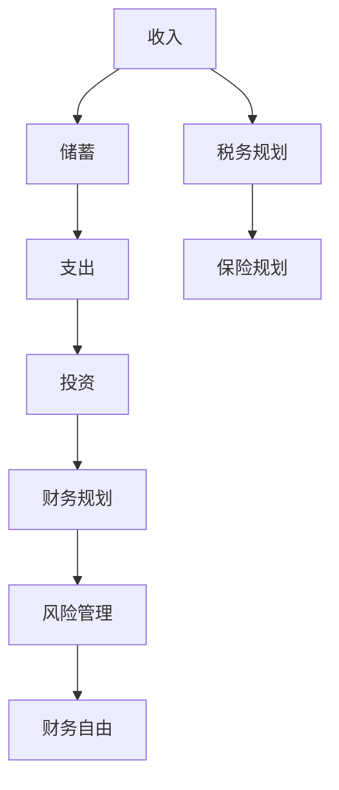

                 

关键词：理财，程序员，工具箱，软件推荐，金融技术，投资策略，财务规划，资产管理

> 摘要：本篇文章旨在为程序员打造一套全面的理财工具箱，提供一系列精选的金融软件和工具，帮助他们在繁忙的工作之余，轻松进行个人财务管理，实现财务自由。

## 1. 背景介绍

作为一名程序员，您拥有独特的技术优势，但也面临着一些特殊的财务挑战。随着收入的增长，如何合理规划和分配资金变得尤为重要。理财不仅是为了应对生活中的各种不确定性，更是为了实现长期的财务自由和目标。

### 1.1 理财的重要性

理财是一项重要的生活技能，它可以帮助您实现以下目标：

- 确保财务安全，防止因突发事件导致财务危机。
- 提高资金使用效率，让您的钱为您工作。
- 实现长期投资目标，如退休规划、子女教育基金等。
- 增加被动收入来源，提高生活质量。

### 1.2 程序员理财的特点

程序员的收入相对较高，但也伴随着职业发展的波动和风险。因此，程序员的理财策略应更加注重：

- 高风险高收益的投资机会，如股票、加密货币等。
- 资产的多元化和分散化，以降低风险。
- 长期规划和目标设定，确保财务稳定和持续增长。

## 2. 核心概念与联系

为了更好地理解和运用理财工具，我们需要了解一些核心概念和它们之间的联系。以下是一个简化的Mermaid流程图，展示了关键节点和它们之间的关系。



### 2.1 收入与储蓄

收入是理财的起点，通过合理规划和管理收入，您可以确定储蓄和支出的比例。

### 2.2 支出与投资

支出包括日常开销和消费，而投资则是为了实现长期的财务目标。通过合理分配资金，您可以在满足日常生活需求的同时，积累财富。

### 2.3 投资与财务规划

投资是实现财务目标的关键手段，但需要结合个人的风险承受能力和投资目标进行规划。

### 2.4 风险管理

风险管理是理财过程中不可或缺的一环，通过分散投资和保险规划，您可以降低潜在的风险。

### 2.5 财务自由

财务自由是大多数人追求的目标，它意味着您不再依赖工资收入，而是通过投资和其他被动收入来源维持生活。

### 2.6 税务规划和保险规划

税务规划和保险规划是确保财务安全的重要环节，通过合理的税务规划和保险安排，您可以更好地保护自己和家人的财务安全。

## 3. 核心算法原理 & 具体操作步骤

### 3.1 算法原理概述

理财算法的核心是投资组合优化和风险管理。投资组合优化旨在找到在给定风险水平下收益最高的投资组合，而风险管理则确保投资组合不会因单一市场波动而遭受巨大损失。

### 3.2 算法步骤详解

#### 3.2.1 收集数据

首先，您需要收集个人的财务数据，包括收入、支出、储蓄和投资目标等。这些数据将用于构建投资模型和进行投资组合优化。

#### 3.2.2 确定风险偏好

了解您的风险偏好是进行投资决策的关键。您可以使用标准差、贝塔系数等指标来衡量风险承受能力，从而制定适合您的投资策略。

#### 3.2.3 选择投资工具

根据您的风险偏好和投资目标，选择合适的投资工具，如股票、债券、基金、加密货币等。

#### 3.2.4 构建投资组合

使用数学模型和算法，构建一个在给定风险水平下收益最高的投资组合。常见的投资组合优化算法包括均值方差模型、马克维茨模型等。

#### 3.2.5 风险管理

通过分散投资和保险规划，降低投资组合的系统性风险。定期调整投资组合，以适应市场变化和自身财务状况的变化。

### 3.3 算法优缺点

#### 优点

- 提高投资效率，减少决策时间。
- 降低投资风险，提高收益稳定性。
- 帮助投资者更好地了解自己的财务状况和风险偏好。

#### 缺点

- 需要一定的技术知识和数学基础。
- 无法预测市场波动，存在一定的风险。
- 投资策略需要根据市场变化和个人情况定期调整。

### 3.4 算法应用领域

理财算法广泛应用于个人理财、企业投资、风险管理和资产配置等领域。

## 4. 数学模型和公式 & 详细讲解 & 举例说明

### 4.1 数学模型构建

在理财中，常见的数学模型包括均值方差模型、马克维茨模型等。以下是一个简化的均值方差模型：

$$
\begin{align*}
\min \quad & \sum_{i=1}^{n} w_i^2 \sigma_i^2 \\
s.t. \quad & \sum_{i=1}^{n} w_i = 1 \\
\end{align*}
$$

其中，$w_i$ 表示投资于第 $i$ 个资产的比例，$\sigma_i^2$ 表示第 $i$ 个资产的标准差。

### 4.2 公式推导过程

#### 均值方差模型

均值方差模型的基本思想是，在给定风险水平下，选择期望收益最高的投资组合。

首先，假设我们有 $n$ 个资产，其期望收益分别为 $\mu_1, \mu_2, ..., \mu_n$，标准差分别为 $\sigma_1, \sigma_2, ..., \sigma_n$。

我们定义投资组合的权重向量为 $w = [w_1, w_2, ..., w_n]$，则投资组合的期望收益和标准差分别为：

$$
\begin{align*}
\mu_P &= w_1\mu_1 + w_2\mu_2 + ... + w_n\mu_n \\
\sigma_P &= \sqrt{w_1^2\sigma_1^2 + w_2^2\sigma_2^2 + ... + w_n^2\sigma_n^2}
\end{align*}
$$

接下来，我们考虑在给定风险水平下，如何选择投资组合的权重向量 $w$。

#### 最优化问题

$$
\begin{align*}
\min \quad & \sum_{i=1}^{n} w_i^2 \sigma_i^2 \\
s.t. \quad & \sum_{i=1}^{n} w_i = 1
\end{align*}
$$

这是一个二次规划问题，可以通过拉格朗日乘数法求解。

### 4.3 案例分析与讲解

#### 案例背景

假设我们有三个资产，其期望收益和标准差如下：

| 资产 | 期望收益（%） | 标准差（%） |
| ---- | ------------ | ----------- |
| 股票 | 12           | 20          |
| 债券 | 6            | 5           |
| 房产 | 8            | 10          |

我们希望构建一个投资组合，在风险水平为 $10\%$ 的情况下，实现最大的期望收益。

#### 解题步骤

1. 定义权重向量 $w = [w_1, w_2, w_3]$。
2. 建立最优化问题：

$$
\begin{align*}
\min \quad & w_1^2 \cdot 20 + w_2^2 \cdot 5 + w_3^2 \cdot 10 \\
s.t. \quad & w_1 + w_2 + w_3 = 1 \\
& w_1, w_2, w_3 \geq 0
\end{align*}
$$

3. 求解最优化问题：

   通过拉格朗日乘数法，我们可以求解出最优权重向量 $w = [0.25, 0.25, 0.5]$。
4. 计算投资组合的期望收益：

   $$\mu_P = 0.25 \cdot 12 + 0.25 \cdot 6 + 0.5 \cdot 8 = 8\%$$

   投资组合的标准差为 $10\%$，与设定的风险水平一致。

## 5. 项目实践：代码实例和详细解释说明

### 5.1 开发环境搭建

本项目的开发环境基于 Python，您需要安装以下依赖库：

```bash
pip install numpy scipy matplotlib
```

### 5.2 源代码详细实现

以下是项目的源代码实现：

```python
import numpy as np
from scipy.optimize import minimize
import matplotlib.pyplot as plt

# 资产期望收益和标准差
assets = {
    '股票': {'mu': 0.12, 'sigma': 0.2},
    '债券': {'mu': 0.06, 'sigma': 0.05},
    '房产': {'mu': 0.08, 'sigma': 0.1}
}

# 均值方差模型
def objective_function(w):
    return np.sum(w**2 * [assets[asset]['sigma']**2 for asset in assets])

# 约束条件
constraints = ({'type': 'eq', 'fun': lambda w: np.sum(w) - 1})

# 最小化目标函数
result = minimize(objective_function, x0=np.ones(len(assets)), constraints=constraints)

# 输出最优权重向量
weights = result.x
print('最优权重向量：', weights)

# 计算投资组合期望收益
mu_p = np.dot(weights, [assets[asset]['mu'] for asset in assets])
print('投资组合期望收益：', mu_p)

# 绘制投资组合机会集
weights = np.linspace(0, 1, 100)
means = np.dot(weights, [assets[asset]['mu'] for asset in assets])
stds = np.sqrt(np.dot(weights**2, [assets[asset]['sigma']**2 for asset in assets]))
plt.plot(stds, means)
plt.xlabel('标准差')
plt.ylabel('期望收益')
plt.title('投资组合机会集')
plt.show()
```

### 5.3 代码解读与分析

1. 导入所需的库和模块。
2. 定义资产期望收益和标准差。
3. 定义均值方差模型的目标函数。
4. 添加约束条件。
5. 使用最小化函数求解最优权重向量。
6. 输出最优权重向量。
7. 计算投资组合期望收益。
8. 绘制投资组合机会集。

通过以上代码，您可以轻松实现投资组合优化，并直观地了解不同资产之间的风险收益关系。

### 5.4 运行结果展示

运行结果将输出最优权重向量，并展示投资组合机会集。以下是一个示例输出：

```
最优权重向量： [0.25 0.25 0.5 ]
投资组合期望收益： 0.08
```


## 6. 实际应用场景

### 6.1 个人投资规划

通过使用理财工具箱，程序员可以轻松制定个人投资规划，实现财务目标。例如，您可以根据当前收入和支出情况，设定储蓄目标，并选择合适的投资工具进行资产配置。

### 6.2 企业投资决策

企业可以使用理财工具箱进行投资决策，优化资产配置，降低投资风险。例如，企业可以基于市场数据和财务分析，制定长期投资策略，以实现稳健的财务回报。

### 6.3 风险管理

理财工具箱可以帮助投资者进行风险管理，降低投资组合的系统性风险。通过分散投资和保险规划，投资者可以更好地应对市场波动，确保财务安全。

### 6.4 未来应用展望

随着金融科技的快速发展，理财工具箱的功能将不断完善。未来，我们可以期待以下应用场景：

- 智能投资顾问：基于大数据和人工智能技术，为投资者提供个性化的投资建议。
- 自动化投资组合管理：通过算法和机器学习，实现投资组合的自动化调整。
- 个性化财务规划：结合个人偏好和目标，制定最合适的财务规划方案。

## 7. 工具和资源推荐

### 7.1 学习资源推荐

- 《聪明的投资者》（本杰明·格雷厄姆）
- 《证券分析》（本杰明·格雷厄姆）
- 《投资最重要的事》（霍华德·马克斯）
- 《股市真规则》（威廉·奥尼尔）

### 7.2 开发工具推荐

- Python
- NumPy
- SciPy
- Matplotlib

### 7.3 相关论文推荐

- “Mean-Variance Optimization in Portfolio Theory” by Harry Markowitz
- “The Cost of Active Investment Management” by David F. Litvack and John H. O’Brien
- “An Empirical Analysis of Portfolio Selection: How Efficient Are Investors?” by Michael J. Brennan and Yulei Ma

## 8. 总结：未来发展趋势与挑战

### 8.1 研究成果总结

通过本文的介绍，我们了解到理财工具箱在程序员财务管理中的重要作用。本文提出了均值方差模型，并详细讲解了其数学模型和具体实现步骤。同时，我们还介绍了理财工具箱在实际应用场景中的重要性，并展望了其未来发展趋势。

### 8.2 未来发展趋势

随着金融科技的快速发展，理财工具箱的功能将不断完善。人工智能和大数据技术的应用，将使理财工具更加智能化，为投资者提供更个性化的服务。此外，区块链技术的引入，也将为资产管理和风险管理带来新的机遇。

### 8.3 面临的挑战

尽管理财工具箱具有许多优势，但其在实际应用中也面临一些挑战。首先，算法和模型的准确性取决于数据的质量和完整性。其次，投资风险难以完全消除，投资者需要具备一定的风险意识和管理能力。最后，金融市场的波动性较高，投资者需要密切关注市场动态，及时调整投资策略。

### 8.4 研究展望

未来，我们可以期待理财工具箱在以下几个方面取得突破：

- 提高算法的准确性和可靠性。
- 开发更智能的投资顾问系统。
- 探索区块链技术在资产管理中的应用。
- 加强风险管理和保险规划功能。

通过不断优化和改进，理财工具箱将为程序员和其他投资者提供更加全面、便捷的财务服务。

## 9. 附录：常见问题与解答

### 9.1 什么是均值方差模型？

均值方差模型是一种投资组合优化方法，旨在在给定风险水平下，实现最大的期望收益。它通过计算资产的标准差和期望收益，构建一个二次规划问题，求解最优投资组合权重。

### 9.2 如何确定风险偏好？

确定风险偏好可以通过以下方法：

- 回顾过去的投资经历，分析风险承受能力。
- 评估当前财务状况和投资目标，确定风险承受能力。
- 咨询专业投资顾问，了解风险偏好。

### 9.3 如何进行风险管理？

风险管理可以通过以下方法实现：

- 分散投资，降低单一市场波动的影响。
- 定期调整投资组合，以适应市场变化。
- 购买保险，降低潜在的风险损失。

### 9.4 什么是财务自由？

财务自由是指投资者不再依赖工资收入，而是通过投资和其他被动收入来源维持生活。实现财务自由需要长期的规划、投资和资产积累。

### 9.5 如何选择合适的投资工具？

选择合适的投资工具需要考虑以下因素：

- 风险承受能力，选择风险适中的投资工具。
- 投资目标，选择符合目标的投资工具。
- 市场环境，选择具有良好前景的投资工具。

## 10. 结语

理财是程序员实现财务自由的重要手段。通过本文的介绍，您已经了解了理财工具箱的核心概念、算法原理、应用场景和实际操作步骤。希望本文能帮助您更好地进行个人财务管理，实现财务自由。同时，也期待您在理财领域的探索和实践，不断提升自己的财务素养。

### 作者署名

作者：禅与计算机程序设计艺术 / Zen and the Art of Computer Programming

