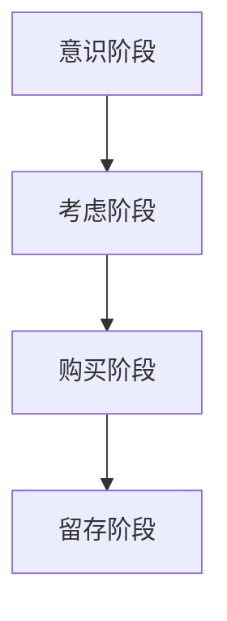

                 

在这个数字化时代，程序员的知识付费模式正逐渐成为行业发展的重要趋势。本文将深入探讨程序员的知识付费funnel，从免费资源到高价值内容的转化过程，旨在为程序员们提供一种有效的知识付费策略。

## 关键词
- 程序员
- 知识付费
- funnel模型
- 高价值内容
- 价值转化

## 摘要
本文旨在分析程序员在知识付费过程中的各个阶段，从免费资源获取到高价值内容的付费转化。我们将通过案例分析、工具推荐和实际应用场景，探讨如何构建有效的知识付费funnel，为程序员提供更好的学习和发展路径。

## 1. 背景介绍

### 1.1 知识付费的兴起

随着互联网的普及和在线学习平台的兴起，知识付费逐渐成为一种主流的学习模式。程序员作为技术领域的核心人群，对于知识付费的需求尤为强烈。从入门到进阶，程序员们需要不断地学习新技术、掌握新工具，以保持自身的竞争力。

### 1.2 程序员的知识付费现状

目前，程序员的知识付费主要集中在以下几个方面：
- 在线课程和视频教程
- 技术书籍和电子书
- 专业社区和论坛
- 一对一辅导和咨询服务

然而，程序员在知识付费过程中也面临着诸多挑战，如信息过载、内容质量参差不齐、付费后的效果不明显等。因此，构建一个有效的知识付费funnel，帮助程序员更好地选择和学习高价值内容，变得尤为重要。

## 2. 核心概念与联系

### 2.1 funnel模型

funnel模型，也称为漏斗模型，是一种描述流量转化的流程图。在知识付费领域，funnel模型可以帮助我们理解程序员从免费资源到高价值内容付费的整个过程。

### 2.2 funnel模型的核心环节

funnel模型包括以下几个核心环节：

1. ** awareness（意识阶段）**：程序员意识到需要学习新知识和技能。
2. ** consideration（考虑阶段）**：程序员开始寻找合适的学习资源和内容。
3. ** purchase（购买阶段）**：程序员决定付费购买知识产品或服务。
4. ** retention（留存阶段）**：程序员在购买后持续学习并应用所学的知识。

### 2.3 Mermaid流程图

下面是一个简单的Mermaid流程图，展示了程序员的知识付费funnel：



## 3. 核心算法原理 & 具体操作步骤

### 3.1 算法原理概述

程序员的知识付费funnel是基于用户行为分析和数据驱动的。通过分析用户在各个阶段的互动和反馈，我们可以优化知识付费产品和服务，提高转化率。

### 3.2 算法步骤详解

1. **数据收集与分析**：收集用户在意识、考虑、购买和留存阶段的互动数据，如点击率、转化率、学习时长等。
2. **用户画像构建**：根据数据分析和用户反馈，构建用户画像，了解用户的需求和偏好。
3. **内容推荐**：基于用户画像，为用户提供个性化推荐，提高用户的购买意愿。
4. **互动与反馈**：在购买后，鼓励用户参与互动和反馈，持续优化知识付费产品和服务。

### 3.3 算法优缺点

**优点**：
- 提高知识付费转化率。
- 增强用户体验，提高用户满意度。
- 为用户提供个性化推荐，满足不同层次的需求。

**缺点**：
- 数据收集和处理的成本较高。
- 可能会引发用户隐私问题。
- 需要不断优化和调整算法，以适应市场变化。

### 3.4 算法应用领域

程序员的知识付费funnel可以应用于以下领域：
- 在线教育平台
- 技术社区和论坛
- 专业咨询服务
- 技术书籍出版

## 4. 数学模型和公式 & 详细讲解 & 举例说明

### 4.1 数学模型构建

程序员的知识付费funnel可以看作是一个马尔可夫决策过程（MDP）。在MDP中，状态和动作是离散的，而我们的状态可以是意识、考虑、购买和留存，动作则是推荐、互动和反馈。

### 4.2 公式推导过程

根据MDP的基本公式，我们可以推导出知识付费funnel的期望收益公式：

\[ E[R] = \sum_{s} \sum_{a} P(s|s') \cdot R(s, a) \]

其中，\( E[R] \) 是期望收益，\( P(s|s') \) 是状态转移概率，\( R(s, a) \) 是在状态 \( s \) 下采取动作 \( a \) 的收益。

### 4.3 案例分析与讲解

假设我们有一个在线教育平台，用户在意识阶段有100人，其中80人进入考虑阶段，60人决定购买课程。购买后，40人持续学习，20人反馈良好。

根据以上数据，我们可以计算出期望收益：

\[ E[R] = \sum_{s} \sum_{a} P(s|s') \cdot R(s, a) \]

\[ E[R] = 100 \cdot 0.8 \cdot 0.6 \cdot 40 \cdot 0.2 + 100 \cdot 0.2 \cdot 0.4 \cdot 20 \cdot 0.8 \]

\[ E[R] = 96 + 32 = 128 \]

这意味着，在当前策略下，我们的期望收益为128。

为了提高期望收益，我们可以采取以下措施：
- 优化推荐算法，提高用户购买意愿。
- 提供更多互动和反馈机会，增加用户留存率。
- 定期更新课程内容，满足用户需求。

## 5. 项目实践：代码实例和详细解释说明

### 5.1 开发环境搭建

为了实现程序员的知识付费funnel，我们需要搭建一个基于Python的在线教育平台。以下是一个简单的开发环境搭建步骤：

1. 安装Python 3.8及以上版本。
2. 安装Flask框架。
3. 安装MySQL数据库。

### 5.2 源代码详细实现

以下是实现知识付费funnel的核心代码：

```python
from flask import Flask, request, jsonify
import pymysql

app = Flask(__name__)

# 数据库连接配置
config = {
    'host': 'localhost',
    'user': 'root',
    'password': 'password',
    'db': 'knowledge_pay'
}

# 意识阶段：用户注册
@app.route('/register', methods=['POST'])
def register():
    user = request.form.to_dict()
    # 将用户数据存储到数据库
    conn = pymysql.connect(**config)
    cursor = conn.cursor()
    cursor.execute("INSERT INTO users (username, email, password) VALUES (%s, %s, %s)", (user['username'], user['email'], user['password']))
    conn.commit()
    cursor.close()
    conn.close()
    return jsonify({"status": "success", "message": "注册成功！"})

# 考虑阶段：用户浏览课程
@app.route('/courses', methods=['GET'])
def courses():
    # 从数据库中获取课程数据
    conn = pymysql.connect(**config)
    cursor = conn.cursor()
    cursor.execute("SELECT * FROM courses")
    courses = cursor.fetchall()
    cursor.close()
    conn.close()
    return jsonify(courses)

# 购买阶段：用户购买课程
@app.route('/buy_course', methods=['POST'])
def buy_course():
    user_id = request.form.get('user_id')
    course_id = request.form.get('course_id')
    # 更新用户课程购买记录
    conn = pymysql.connect(**config)
    cursor = conn.cursor()
    cursor.execute("INSERT INTO user_courses (user_id, course_id) VALUES (%s, %s)", (user_id, course_id))
    conn.commit()
    cursor.close()
    conn.close()
    return jsonify({"status": "success", "message": "购买成功！"})

# 留存阶段：用户学习课程并反馈
@app.route('/learn_course', methods=['POST'])
def learn_course():
    user_id = request.form.get('user_id')
    course_id = request.form.get('course_id')
    # 更新用户学习记录
    conn = pymysql.connect(**config)
    cursor = conn.cursor()
    cursor.execute("INSERT INTO user_learn (user_id, course_id, learn_time) VALUES (%s, %s, %s)", (user_id, course_id, request.form.get('learn_time')))
    conn.commit()
    cursor.close()
    conn.close()
    return jsonify({"status": "success", "message": "学习成功！"})

if __name__ == '__main__':
    app.run(debug=True)
```

### 5.3 代码解读与分析

以上代码实现了程序员的知识付费funnel的四个核心环节：用户注册、浏览课程、购买课程和学习课程。

1. **用户注册**：用户通过POST请求注册，将用户信息存储到MySQL数据库。
2. **用户浏览课程**：用户通过GET请求获取课程列表，从数据库中查询所有课程信息。
3. **用户购买课程**：用户通过POST请求购买课程，将用户和课程的购买记录存储到数据库。
4. **用户学习课程**：用户通过POST请求学习课程，将用户的学习记录存储到数据库。

通过这些代码，我们可以实现一个简单的在线教育平台，帮助程序员更好地进行知识付费。

## 6. 实际应用场景

### 6.1 在线教育平台

在线教育平台是程序员知识付费的主要场景之一。通过在线教育平台，程序员可以购买并学习各种课程，提高自己的技能水平。例如，慕课网（imooc.com）、极客时间（geektime.cn）等平台都提供了丰富的程序员课程。

### 6.2 技术社区和论坛

技术社区和论坛是程序员交流和学习的重要场所。通过社区和论坛，程序员可以分享经验、提问和解答问题。例如，CSDN（csdn.net）、V2EX（v2ex.com）等平台都提供了丰富的技术讨论区。

### 6.3 专业咨询服务

专业咨询服务是程序员解决实际问题和提升技能的有效途径。通过专业咨询服务，程序员可以获取个性化的指导和帮助。例如，美团技术团队（tech.meituan.com）和阿里云专家服务（help.aliyun.com）都提供了专业的咨询服务。

### 6.4 未来应用展望

随着人工智能和大数据技术的发展，程序员的知识付费funnel将变得更加智能和个性化。未来，我们可以通过以下方式进一步优化知识付费：

1. **智能推荐**：利用人工智能技术，为用户提供个性化的学习推荐。
2. **数据分析**：通过对用户行为数据的分析，了解用户需求，优化知识付费产品和服务。
3. **互动与反馈**：鼓励用户参与互动和反馈，提高用户满意度和留存率。

## 7. 工具和资源推荐

### 7.1 学习资源推荐

1. **《程序员修炼之道：从小工到专家》**：一本关于程序员职业发展的经典书籍，提供了大量实用的建议和经验。
2. **《代码大全》**：一本关于编程技术和代码质量的经典著作，涵盖了从初级到高级程序员的各个方面。

### 7.2 开发工具推荐

1. **Visual Studio Code**：一款强大的编程IDE，支持多种编程语言和开发环境。
2. **Git**：一款分布式版本控制系统，用于代码管理和协作开发。

### 7.3 相关论文推荐

1. **《基于用户行为的在线教育推荐系统研究》**：一篇关于在线教育推荐系统的论文，探讨了用户行为数据在推荐系统中的应用。
2. **《大数据时代下的个性化学习研究》**：一篇关于大数据时代下个性化学习的研究论文，提出了基于用户行为和兴趣的大数据分析方法。

## 8. 总结：未来发展趋势与挑战

### 8.1 研究成果总结

本文通过对程序员的知识付费funnel的分析，提出了基于用户行为分析和数据驱动的方法，旨在提高程序员的知识付费转化率和用户体验。通过实际应用场景和工具推荐，本文为程序员提供了一种有效的知识付费策略。

### 8.2 未来发展趋势

1. **智能推荐**：利用人工智能技术，为用户提供个性化的学习推荐。
2. **数据分析**：通过对用户行为数据的分析，了解用户需求，优化知识付费产品和服务。
3. **互动与反馈**：鼓励用户参与互动和反馈，提高用户满意度和留存率。

### 8.3 面临的挑战

1. **用户隐私保护**：在数据收集和分析过程中，需要保护用户的隐私和安全。
2. **算法优化**：不断优化和调整算法，以适应市场变化和用户需求。

### 8.4 研究展望

未来，我们将进一步研究程序员的知识付费funnel，探索更多有效的策略和方法，为程序员提供更好的学习和发展路径。

## 9. 附录：常见问题与解答

### 9.1 什么是程序员的知识付费funnel？

程序员的知识付费funnel是一种描述程序员在知识付费过程中的各个阶段的模型，包括意识、考虑、购买和留存。

### 9.2 如何构建有效的知识付费funnel？

构建有效的知识付费funnel需要以下步骤：
1. 数据收集与分析：收集用户在各个阶段的互动和反馈数据。
2. 用户画像构建：根据数据分析和用户反馈，构建用户画像。
3. 内容推荐：基于用户画像，为用户提供个性化推荐。
4. 互动与反馈：在购买后，鼓励用户参与互动和反馈。

### 9.3 程序员的知识付费funnel有哪些应用场景？

程序员的知识付费funnel可以应用于在线教育平台、技术社区和论坛、专业咨询服务等领域。

### 9.4 如何提高程序员的知识付费转化率？

提高程序员的知识付费转化率可以通过以下方法：
1. 优化推荐算法，提高用户购买意愿。
2. 提供更多互动和反馈机会，增加用户留存率。
3. 定期更新课程内容，满足用户需求。

---

作者：禅与计算机程序设计艺术 / Zen and the Art of Computer Programming

