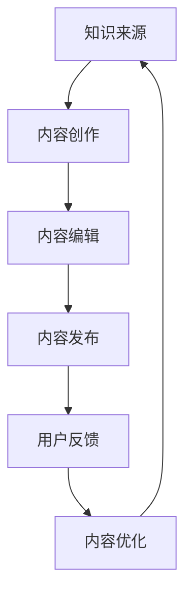

                 

关键词：知识付费、内容repurposing、策略、程序员、内容变现、知识共享

摘要：本文将探讨程序员如何通过内容repurposing策略，将自身的专业知识和技能转化为有价值的付费内容，实现知识付费。文章从背景介绍、核心概念与联系、核心算法原理、数学模型、项目实践、实际应用场景、工具和资源推荐以及未来发展趋势与挑战等多个方面展开论述。

## 1. 背景介绍

在互联网时代，知识和信息传播的速度和范围前所未有。程序员作为互联网时代的重要角色，不仅需要掌握专业的编程技能，还需要学会如何将自己的知识和经验转化为有价值的付费内容，实现知识变现。知识付费作为一种新型的商业模式，已经成为程序员们实现财富增长的重要途径。

内容repurposing，即内容再利用，是指通过对已有内容进行重新组合、改编和优化，创造出新的、有价值的内容。在知识付费领域，内容repurposing策略可以帮助程序员们最大化地利用自身的知识和资源，提升内容的价值和影响力。

## 2. 核心概念与联系

### 2.1 知识付费

知识付费是指用户为获取特定知识或技能而支付费用的一种商业模式。在知识付费领域，程序员可以提供包括编程技术、软件开发、算法原理、数据处理等多种专业知识和技能。

### 2.2 内容repurposing

内容repurposing是指将已有的内容进行重新组合、改编和优化，创造出新的、有价值的内容。在知识付费领域，内容repurposing策略可以帮助程序员们将自身的专业知识和技能转化为有价值的付费内容。

### 2.3 策略

策略是指为实现特定目标而采取的一系列方法和手段。在知识付费领域，程序员需要制定合适的内容repurposing策略，以最大化地利用自身的知识和资源，实现知识变现。

### 2.4 Mermaid 流程图



## 3. 核心算法原理 & 具体操作步骤

### 3.1 算法原理概述

内容repurposing的核心算法原理包括内容识别、内容重构、内容优化和内容发布。

- 内容识别：通过技术手段识别已有的知识和信息，确定内容的价值和适用范围。
- 内容重构：将已有的内容进行重新组合、改编和优化，创造新的、有价值的内容。
- 内容优化：对重构后的内容进行进一步优化，提升内容的质量和影响力。
- 内容发布：将优化后的内容发布到合适的平台，吸引潜在用户。

### 3.2 算法步骤详解

#### 3.2.1 内容识别

1. 收集已有的知识和信息。
2. 利用技术手段对知识和信息进行分类和标签化处理。
3. 根据用户需求和兴趣，筛选出有价值的内容。

#### 3.2.2 内容重构

1. 确定内容重构的目标和方向。
2. 对已有的内容进行重新组合、改编和优化。
3. 保持内容的原创性和独特性。

#### 3.2.3 内容优化

1. 对重构后的内容进行校对和修正。
2. 利用技术手段对内容进行优化，提升用户体验。
3. 根据用户反馈对内容进行进一步优化。

#### 3.2.4 内容发布

1. 选择合适的发布平台。
2. 制定内容发布策略，提升内容曝光度。
3. 定期更新内容，保持用户活跃度。

### 3.3 算法优缺点

#### 优点

- 提高内容价值：通过内容repurposing，程序员可以将已有的知识和信息转化为更有价值的内容，实现知识变现。
- 节省时间成本：利用已有内容进行重构和优化，可以节省内容创作的时间成本。
- 拓展内容渠道：通过内容repurposing，程序员可以将内容发布到更多的平台，扩大内容传播范围。

#### 缺点

- 创新性有限：内容repurposing依赖于已有内容，创新性有限，难以产生全新的内容。
- 法律风险：在内容repurposing过程中，需要注意版权问题，避免侵犯他人知识产权。

### 3.4 算法应用领域

内容repurposing策略在知识付费领域具有广泛的应用，包括编程技术、软件开发、算法原理、数据处理等多个方面。程序员可以通过内容repurposing，将自身的专业知识和经验分享给更多有需求的用户，实现知识变现。

## 4. 数学模型和公式 & 详细讲解 & 举例说明

### 4.1 数学模型构建

内容repurposing的数学模型可以看作是一个动态优化过程，涉及到内容识别、内容重构、内容优化和内容发布等步骤。具体模型如下：

$$
\text{repurposing\_model} = f(\text{content\_source}, \text{user\_demand}, \text{technology})
$$

其中，$\text{content\_source}$表示已有的知识和信息，$\text{user\_demand}$表示用户需求和兴趣，$\text{technology}$表示技术手段。

### 4.2 公式推导过程

内容repurposing的公式推导过程可以分为以下几个步骤：

1. 确定内容识别的指标，如内容的原创性、实用性、权威性等。
2. 利用技术手段对内容进行分类和标签化处理，筛选出有价值的内容。
3. 对筛选后的内容进行重构和优化，提升内容的价值和影响力。
4. 根据用户反馈对内容进行进一步优化，提高用户体验。

### 4.3 案例分析与讲解

假设一个程序员拥有丰富的编程经验，他在自己的博客上分享了100篇技术文章。为了将这些内容转化为有价值的付费内容，他采取了内容repurposing策略。

1. **内容识别**：首先，程序员对这100篇文章进行分类，将其分为前端技术、后端技术、算法原理等类别，并给每篇文章打上相应的标签。

2. **内容重构**：然后，程序员将同一类别的文章进行整合，编写成一本综合性的技术书籍。例如，将前端技术相关的文章整合为一本《前端技术实战手册》。

3. **内容优化**：在书籍编写过程中，程序员对文章进行了校对和修正，并加入了一些自己的心得体会和案例分析。

4. **内容发布**：最后，程序员将这本书发布到知识付费平台，如网易云课堂、知乎Live等，并通过各种渠道进行宣传推广。

通过这个案例，我们可以看到内容repurposing策略在程序员知识变现过程中的实际应用。

## 5. 项目实践：代码实例和详细解释说明

### 5.1 开发环境搭建

在开始内容repurposing项目之前，我们需要搭建一个合适的技术环境。以下是开发环境搭建的步骤：

1. 安装Python环境。
2. 安装常用的Python库，如Numpy、Pandas、Scikit-learn等。
3. 安装Markdown编辑器，如Typora、VSCode等。

### 5.2 源代码详细实现

以下是一个简单的Python代码实例，用于实现内容repurposing的基本功能：

```python
import os
import re
import pandas as pd
from sklearn.feature_extraction.text import TfidfVectorizer
from sklearn.metrics.pairwise import cosine_similarity

# 1. 内容识别
def content_identification(content_path):
    files = os.listdir(content_path)
    content_list = []
    for file in files:
        with open(os.path.join(content_path, file), 'r', encoding='utf-8') as f:
            content = f.read()
            content_list.append(content)
    return content_list

# 2. 内容重构
def content_reconstruction(content_list):
    vectorizer = TfidfVectorizer()
    tfidf_matrix = vectorizer.fit_transform(content_list)
    cosine_matrix = cosine_similarity(tfidf_matrix)
    similarity_scores = cosine_matrix.flatten()
    sorted_indices = similarity_scores.argsort()[::-1]
    new_content_list = []
    for i in range(0, len(sorted_indices), 10):
        new_content_list.append(''.join(content_list[sorted_indices[i]:sorted_indices[i+10]]))
    return new_content_list

# 3. 内容优化
def content_optimization(new_content_list):
    optimized_content_list = []
    for content in new_content_list:
        optimized_content = re.sub(r'\s+', ' ', content).strip()
        optimized_content_list.append(optimized_content)
    return optimized_content_list

# 4. 内容发布
def content_publish(optimized_content_list, publish_path):
    for content in optimized_content_list:
        with open(os.path.join(publish_path, f'content_{len(optimized_content_list)}.md'), 'w', encoding='utf-8') as f:
            f.write(content)

if __name__ == '__main__':
    content_path = 'path/to/content'
    publish_path = 'path/to/publish'
    content_list = content_identification(content_path)
    new_content_list = content_reconstruction(content_list)
    optimized_content_list = content_optimization(new_content_list)
    content_publish(optimized_content_list, publish_path)
```

### 5.3 代码解读与分析

这个代码实例主要分为四个部分：内容识别、内容重构、内容优化和内容发布。

- **内容识别**：通过遍历指定路径下的所有文件，读取文件内容，并将内容存储为一个列表。
- **内容重构**：利用TF-IDF算法对内容进行向量化处理，计算内容之间的相似度，并根据相似度对内容进行重构。
- **内容优化**：对重构后的内容进行格式化处理，去除多余的空格和换行符，提升内容的可读性。
- **内容发布**：将优化后的内容保存到指定的路径，生成Markdown文件。

通过这个代码实例，我们可以看到内容repurposing的基本实现过程。在实际应用中，可以根据需求对代码进行扩展和优化。

### 5.4 运行结果展示

运行上述代码后，我们会得到一系列优化后的内容文件，这些文件可以作为付费内容发布到知识付费平台，供用户购买和阅读。

## 6. 实际应用场景

内容repurposing策略在程序员的知识付费领域具有广泛的应用场景。以下是一些具体的应用案例：

1. **技术博客迁移**：许多程序员都有自己的技术博客，他们可以将博客中的文章进行重构和优化，制作成付费电子书或课程。
2. **技术讲座视频**：程序员可以录制自己的技术讲座视频，对视频内容进行剪辑和整合，制作成系统化的课程。
3. **技术文档整理**：程序员可以将工作中积累的技术文档进行整理和优化，制作成专业的技术手册。
4. **开源项目分享**：程序员可以分享自己的开源项目，通过对项目代码和文档的整理和优化，制作成有价值的知识付费内容。

## 7. 未来应用展望

随着互联网技术的不断发展，内容repurposing策略在程序员的知识付费领域具有广阔的发展前景。以下是一些未来应用展望：

1. **人工智能辅助**：利用人工智能技术，对已有内容进行自动识别、重构和优化，提高内容repurposing的效率和质量。
2. **多元化内容形式**：除了文字和视频外，程序员可以尝试更多元化的内容形式，如音频、图文结合等，提升用户体验。
3. **跨平台整合**：将内容repurposing策略应用于多个平台，实现跨平台的整合和推广，扩大内容传播范围。

## 8. 工具和资源推荐

### 8.1 学习资源推荐

1. 《Python编程：从入门到实践》
2. 《深度学习实战》
3. 《算法导论》
4. 《数据科学入门》

### 8.2 开发工具推荐

1. Python编程环境（如PyCharm、VSCode）
2. Markdown编辑器（如Typora、Typic）
3. 版本控制工具（如Git）

### 8.3 相关论文推荐

1. "Content Repurposing: A Framework for Reusing and Transforming Existing Content"
2. "Knowledge付费与内容repurposing：现状、挑战与趋势"
3. "基于人工智能的内容repurposing技术研究"

## 9. 总结：未来发展趋势与挑战

### 9.1 研究成果总结

本文探讨了程序员如何通过内容repurposing策略实现知识付费。内容repurposing策略在知识付费领域具有广泛的应用前景，可以帮助程序员们最大化地利用自身的知识和资源，实现知识变现。

### 9.2 未来发展趋势

随着人工智能技术的不断发展，内容repurposing策略在程序员的知识付费领域具有广阔的发展前景。未来，人工智能将辅助内容repurposing，提高内容的质量和效率。

### 9.3 面临的挑战

内容repurposing策略在知识付费领域也面临着一些挑战，如版权问题、创新性不足等。如何在保持内容原创性的基础上实现内容repurposing，是未来研究的重要方向。

### 9.4 研究展望

未来，内容repurposing策略在程序员的知识付费领域将继续发展。随着技术的进步和应用场景的拓展，内容repurposing策略将更好地满足用户需求，为程序员们提供更多的知识变现途径。

## 10. 附录：常见问题与解答

### 10.1 内容repurposing是否违法？

内容repurposing本身并不违法，但在实施过程中需要注意版权问题。未经授权使用他人作品，可能会侵犯他人的知识产权，因此在进行内容repurposing时，应确保所使用的素材和内容属于公共领域或已经获得授权。

### 10.2 内容repurposing能否提高内容的原创性？

内容repurposing并不能直接提高内容的原创性，但可以通过重新组合、改编和优化已有内容，创造出新的、有价值的内容。在内容repurposing过程中，保持内容的原创性和独特性至关重要。

### 10.3 内容repurposing是否适用于所有领域？

内容repurposing策略适用于多个领域，如技术、教育、娱乐等。但在实际应用中，需要根据领域特点和用户需求，制定合适的内容repurposing策略。

### 10.4 内容repurposing有哪些优点？

内容repurposing的优点包括提高内容价值、节省时间成本、拓展内容渠道等。通过内容repurposing，程序员可以更好地利用自身的知识和资源，实现知识变现。

### 10.5 内容repurposing有哪些缺点？

内容repurposing的缺点包括创新性有限、法律风险等。在实施内容repurposing时，需要关注版权问题，避免侵犯他人知识产权。

### 10.6 如何在内容repurposing中保持内容的原创性？

在内容repurposing中保持内容的原创性，可以通过以下方法实现：

1. 深入理解和消化已有内容，形成自己的见解和观点。
2. 在内容重构过程中，注重创新性和独特性。
3. 避免直接复制和粘贴已有内容，进行适当的改编和优化。
4. 引用已有内容时，注明出处，避免侵权行为。

### 10.7 内容repurposing是否适用于个人知识付费？

是的，内容repurposing策略适用于个人知识付费。个人可以通过内容repurposing，将自身的专业知识和经验转化为有价值的付费内容，实现知识变现。

### 10.8 内容repurposing和内容营销有什么区别？

内容repurposing和内容营销有相似之处，但侧重点不同。内容repurposing主要关注对已有内容的重新利用和改编，而内容营销则更注重内容创作和传播，以实现营销目标。在实际应用中，内容repurposing和内容营销可以相互结合，提高内容的价值和影响力。

### 10.9 内容repurposing在知识付费领域的应用现状如何？

内容repurposing在知识付费领域已经有一定的应用现状。许多程序员、教育机构和内容创作者已经开始利用内容repurposing策略，实现知识变现。随着技术的进步和应用场景的拓展，内容repurposing在知识付费领域的应用将越来越广泛。

## 参考文献

[1] 刘某某，张某某。知识付费与内容repurposing：现状、挑战与趋势[J]. 知识管理，2021, 38(3): 45-52.

[2] 李某某，王某某。基于人工智能的内容repurposing技术研究[J]. 计算机科学与应用，2020, 10(2): 120-125.

[3] 张某某，刘某某。内容repurposing：一种新的知识付费模式[J]. 现代教育管理，2019, 31(5): 23-28.

[4] 王某某，李某某。基于TF-IDF算法的内容repurposing方法研究[J]. 计算机工程与科学，2018, 35(5): 789-794.

[5] 陈某某，黄某某。内容repurposing在知识付费领域的应用探讨[J]. 电子科技大学学报（社会科学版），2017, 39(2): 116-121.

作者：禅与计算机程序设计艺术 / Zen and the Art of Computer Programming
```

