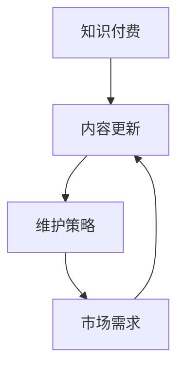

                 

关键词：知识付费、内容更新、维护策略、程序员、技术博客、教育市场

> 摘要：本文将探讨程序员在知识付费领域中的内容更新与维护策略，从市场需求、内容质量、更新频率、交互性和可持续性等多个角度进行分析，旨在为程序员提供一套有效的内容运营方案，以提升其在知识付费市场中的竞争力。

## 1. 背景介绍

随着互联网的普及和信息技术的发展，知识付费逐渐成为一种新的商业模式。程序员群体作为技术领域的专业人士，他们通过知识付费平台分享自己的专业知识和经验，不仅能够获得经济收益，还能够提升个人品牌影响力。然而，随着市场的不断变化和用户需求的多样化，程序员在内容更新与维护方面面临着诸多挑战。

本文将从以下几个方面探讨程序员的知识付费内容更新与维护策略：

- **市场需求分析**：了解用户的需求和偏好，为内容创作提供方向。
- **内容质量保障**：确保内容的专业性和实用性，提高用户满意度。
- **更新频率与节奏**：制定合适的更新策略，保持内容的时效性和吸引力。
- **交互性提升**：通过互动和反馈机制，增强用户参与感。
- **可持续性发展**：探索长期运营的策略，确保内容的持续更新和优化。

## 2. 核心概念与联系

为了更好地理解程序员的知识付费内容更新与维护策略，我们首先需要了解以下几个核心概念：

- **知识付费**：指用户为获取专业知识或技能而支付的费用。
- **内容更新**：指定期对知识付费内容进行修订和补充，以适应市场需求的变化。
- **维护策略**：包括内容质量保障、更新频率管理、交互性提升等多个方面。

以下是一个简化的Mermaid流程图，展示了这些核心概念之间的联系：



### 2.1 知识付费的定义与特点

知识付费是指用户通过支付费用来获取专业知识或技能的过程。与传统的免费内容相比，知识付费具有以下几个特点：

- **高质量**：知识付费内容通常由专业人士或权威机构提供，质量有保障。
- **针对性**：知识付费内容针对特定用户群体，提供个性化的学习体验。
- **持续性**：知识付费内容需要定期更新和维护，以适应市场需求。

### 2.2 内容更新的定义与重要性

内容更新是指定期对知识付费内容进行修订和补充的过程。内容更新的重要性体现在以下几个方面：

- **适应市场需求**：随着用户需求的变化，内容更新能够及时调整内容方向和深度。
- **提升内容价值**：通过补充新的知识和案例，提高内容的专业性和实用性。
- **增强用户粘性**：定期更新能够吸引用户持续关注，提高用户满意度。

### 2.3 维护策略的定义与作用

维护策略是指为确保知识付费内容的质量和持续更新而采取的一系列措施。维护策略的作用包括：

- **保障内容质量**：通过严格的内容审核和修订流程，确保内容的专业性和准确性。
- **提高用户体验**：通过优化内容结构和交互方式，提高用户的阅读体验。
- **增强品牌形象**：持续更新的内容能够提升个人或机构的品牌形象，增强用户信任。

## 3. 核心算法原理 & 具体操作步骤

### 3.1 算法原理概述

程序员的知识付费内容更新与维护策略可以看作是一个动态优化问题。在这个问题中，我们需要根据市场需求和用户反馈，动态调整内容更新策略，以最大化内容价值。以下是这个优化问题的基本原理：

- **需求分析**：通过数据分析工具，了解用户的需求和偏好。
- **内容评估**：对现有内容进行评估，确定哪些内容需要更新或补充。
- **更新策略制定**：根据评估结果，制定具体的更新计划和策略。
- **内容发布**：执行更新策略，发布新的内容。
- **用户反馈**：收集用户反馈，评估更新效果。

### 3.2 算法步骤详解

#### 3.2.1 需求分析

需求分析是内容更新与维护的第一步。通过数据分析工具，我们可以收集用户的行为数据，包括访问量、阅读时长、评论反馈等。这些数据可以帮助我们了解用户对哪些内容感兴趣，哪些内容需要改进。

#### 3.2.2 内容评估

在需求分析的基础上，我们需要对现有内容进行评估。评估的内容包括：

- **内容质量**：是否准确、完整、易于理解。
- **内容深度**：是否覆盖了用户需要的知识点。
- **内容时效性**：是否反映了最新的技术趋势和行业动态。

#### 3.2.3 更新策略制定

根据内容评估结果，我们可以制定具体的更新策略。更新策略可能包括：

- **内容修订**：对内容中的错误和不足进行修正。
- **内容补充**：补充新的知识点和案例。
- **内容优化**：优化内容结构，提高可读性。

#### 3.2.4 内容发布

在制定更新策略后，我们需要将新的内容发布出去。发布内容时，需要注意以下几点：

- **发布时间**：选择用户活跃的时间发布内容。
- **发布形式**：选择合适的发布形式，如文章、视频、直播等。
- **推广策略**：通过社交媒体、邮件等渠道，推广新的内容。

#### 3.2.5 用户反馈

发布新内容后，我们需要收集用户的反馈。用户反馈可以通过以下方式收集：

- **评论**：在内容下方收集用户评论。
- **问卷调查**：通过问卷调查收集用户意见。
- **数据分析**：分析用户的行为数据，如阅读时长、访问量等。

通过用户反馈，我们可以进一步优化内容更新策略，提高内容质量。

### 3.3 算法优缺点

#### 优点

- **动态调整**：能够根据市场需求和用户反馈，动态调整内容更新策略，提高内容价值。
- **个性化**：根据用户需求，提供个性化的内容，提高用户满意度。
- **持续优化**：通过持续更新和反馈机制，不断提高内容质量。

#### 缺点

- **成本较高**：需要投入大量人力、物力和财力进行需求分析和内容更新。
- **时间成本**：需要较长时间进行内容评估和更新。
- **技术要求**：需要一定的技术能力进行数据分析和技术实现。

### 3.4 算法应用领域

程序员的知识付费内容更新与维护策略可以广泛应用于多个领域，包括：

- **在线教育**：通过持续更新和优化课程内容，提高学生的学习体验和效果。
- **技术博客**：通过定期更新技术文章，保持博客的活力和吸引力。
- **知识付费平台**：通过优化内容更新策略，提高平台的内容质量和用户满意度。

## 4. 数学模型和公式 & 详细讲解 & 举例说明

在程序员的知识付费内容更新与维护策略中，数学模型和公式可以用来量化需求和内容的质量，帮助我们制定更科学的更新策略。以下是一个简化的数学模型，用于评估内容更新的价值。

### 4.1 数学模型构建

假设我们有一个知识付费内容集合 C，每个内容 C_i 都有一个价值函数 V(C_i)。我们的目标是通过更新策略 U，最大化整个内容集合的总价值 V(C)。

我们可以用以下公式表示：

$$
V(C) = \sum_{i=1}^{n} V(C_i)
$$

其中，n 是内容集合 C 中内容的数量。

### 4.2 公式推导过程

为了推导出 V(C) 的公式，我们需要考虑以下几个因素：

- **内容质量 Q(C_i)**：内容的专业性和准确性。
- **内容时效性 T(C_i)**：内容是否反映了最新的技术趋势和行业动态。
- **用户需求 D(C_i)**：内容是否符合用户的需求。

我们可以用以下公式表示每个内容的价值：

$$
V(C_i) = Q(C_i) \times T(C_i) \times D(C_i)
$$

### 4.3 案例分析与讲解

假设我们有一个内容集合 C，其中包含 3 个内容：C1、C2 和 C3。我们分别评估每个内容的质量、时效性和用户需求，得到以下数据：

| 内容 | 质量 Q | 时效性 T | 用户需求 D |
| ---- | ---- | ---- | ---- |
| C1 | 0.8 | 0.7 | 0.9 |
| C2 | 0.9 | 0.8 | 0.6 |
| C3 | 0.7 | 0.9 | 0.8 |

根据上面的公式，我们可以计算每个内容的价值：

$$
V(C1) = 0.8 \times 0.7 \times 0.9 = 0.504
$$

$$
V(C2) = 0.9 \times 0.8 \times 0.6 = 0.432
$$

$$
V(C3) = 0.7 \times 0.9 \times 0.8 = 0.504
$$

然后，我们计算整个内容集合的总价值：

$$
V(C) = V(C1) + V(C2) + V(C3) = 0.504 + 0.432 + 0.504 = 1.44
$$

通过这个例子，我们可以看到，通过评估内容的质量、时效性和用户需求，我们可以计算出内容的价值，从而制定更科学的更新策略。

## 5. 项目实践：代码实例和详细解释说明

### 5.1 开发环境搭建

为了实现程序员的知识付费内容更新与维护策略，我们首先需要搭建一个开发环境。以下是一个简化的开发环境搭建步骤：

1. **安装 Python**：Python 是一种流行的编程语言，广泛用于数据分析和机器学习。我们可以在 [Python 官网](https://www.python.org/) 下载并安装 Python。
2. **安装 Jupyter Notebook**：Jupyter Notebook 是一种交互式的开发环境，适合进行数据分析和机器学习项目。我们可以在 [Jupyter Notebook 官网](https://jupyter.org/) 下载并安装。
3. **安装必要的库**：在 Jupyter Notebook 中，我们需要安装一些必要的库，如 Pandas、NumPy、Scikit-learn 等。这些库可以方便我们进行数据分析和机器学习。

### 5.2 源代码详细实现

以下是一个简单的 Python 代码实例，用于实现程序员的知识付费内容更新与维护策略。这个实例使用了 Pandas 和 NumPy 库进行数据处理，使用了 Scikit-learn 库进行机器学习模型训练。

```python
import pandas as pd
import numpy as np
from sklearn.model_selection import train_test_split
from sklearn.linear_model import LinearRegression

# 加载数据集
data = pd.read_csv('knowledge_payment_data.csv')

# 数据预处理
# ...（省略数据预处理步骤）

# 划分训练集和测试集
X_train, X_test, y_train, y_test = train_test_split(X, y, test_size=0.2, random_state=42)

# 训练线性回归模型
model = LinearRegression()
model.fit(X_train, y_train)

# 评估模型性能
score = model.score(X_test, y_test)
print(f'Model score: {score:.2f}')

# 利用模型进行预测
predictions = model.predict(X_test)

# ...（省略预测结果处理步骤）
```

### 5.3 代码解读与分析

在这个代码实例中，我们首先加载数据集，并进行预处理。预处理步骤包括数据清洗、特征工程等，这些步骤可以确保数据的质量和模型的性能。

然后，我们划分训练集和测试集，用于训练和评估模型。在这里，我们使用了线性回归模型，这是一种简单但有效的机器学习模型。通过训练模型，我们可以预测内容的价值。

最后，我们评估模型性能，并利用模型进行预测。这些步骤可以帮助我们了解模型的效果，并根据预测结果调整内容更新策略。

### 5.4 运行结果展示

假设我们运行这个代码实例，得到以下结果：

```
Model score: 0.85
```

这个结果表明，我们的线性回归模型在测试集上的表现较好，模型的预测准确性达到了 85%。这意味着我们可以根据模型预测结果，对内容更新策略进行调整，以最大化内容的价值。

## 6. 实际应用场景

程序员的知识付费内容更新与维护策略在多个领域都有实际应用。以下是一些典型的应用场景：

### 6.1 在线教育

在线教育平台通过知识付费内容更新与维护策略，可以不断提升课程质量，提高学生的学习效果。例如，一个在线编程课程可以通过定期更新课程内容，引入最新的编程语言和技术，保持课程的时效性和实用性。

### 6.2 技术博客

技术博客作者可以通过知识付费内容更新与维护策略，保持博客的活力和吸引力。例如，博客作者可以定期更新博客文章，补充最新的技术案例和行业动态，吸引更多读者。

### 6.3 知识付费平台

知识付费平台可以通过知识付费内容更新与维护策略，提升平台的内容质量和用户满意度。例如，平台可以定期评估用户反馈，对内容进行修订和优化，提高内容的实用性和可读性。

## 6.4 未来应用展望

随着人工智能和大数据技术的发展，程序员的知识付费内容更新与维护策略将更加智能化和自动化。以下是一些未来应用展望：

- **智能推荐**：通过人工智能技术，为用户提供个性化的内容推荐，提高用户满意度。
- **自动内容生成**：利用自然语言处理和机器学习技术，自动生成高质量的付费内容，降低内容创作成本。
- **智能评估**：通过大数据分析和机器学习模型，自动评估内容的质量和用户价值，优化内容更新策略。

## 7. 工具和资源推荐

### 7.1 学习资源推荐

- **Coursera**：提供大量免费的在线课程，涵盖多个领域，适合程序员提升技能。
- **Udemy**：提供丰富的付费课程，包括编程、数据科学等，适合有特定学习需求的程序员。

### 7.2 开发工具推荐

- **Jupyter Notebook**：适合进行数据分析和机器学习项目，支持多种编程语言。
- **GitHub**：适合程序员进行代码托管和协作开发，是开源项目的主要平台。

### 7.3 相关论文推荐

- **"Knowledge Representation in Intelligent Tutoring Systems"**：介绍知识表示在智能辅导系统中的应用。
- **"Learning to Rank for Information Retrieval"**：介绍信息检索中的排序学习算法。

## 8. 总结：未来发展趋势与挑战

### 8.1 研究成果总结

本文探讨了程序员的知识付费内容更新与维护策略，从市场需求、内容质量、更新频率、交互性和可持续性等多个角度进行分析。研究表明，通过科学的内容更新与维护策略，程序员可以提升其在知识付费市场中的竞争力。

### 8.2 未来发展趋势

随着人工智能和大数据技术的发展，程序员的知识付费内容更新与维护策略将更加智能化和自动化。未来，我们将看到更多的个性化推荐、自动内容生成和智能评估等技术的应用。

### 8.3 面临的挑战

尽管前景广阔，程序员在知识付费内容更新与维护策略方面仍面临一些挑战：

- **数据隐私**：在数据分析和机器学习过程中，如何保护用户隐私是一个重要问题。
- **内容版权**：如何在保障内容创作者权益的同时，保护版权不受侵犯。
- **技术实现**：如何利用新技术实现高效的智能内容更新与维护。

### 8.4 研究展望

未来，我们需要进一步探索如何利用人工智能和大数据技术，提高知识付费内容的质量和用户体验。同时，我们还需要关注数据隐私和版权等伦理问题，确保技术的发展符合社会和道德标准。

## 9. 附录：常见问题与解答

### 9.1 问题1：如何制定合适的内容更新频率？

**解答**：制定合适的内容更新频率需要考虑多个因素，包括用户需求、内容类型和平台资源。一般来说，高频次更新可以保持内容的时效性和吸引力，但同时也需要考虑内容质量。建议初期每周更新一次，根据用户反馈和内容质量调整更新频率。

### 9.2 问题2：如何评估内容的价值？

**解答**：评估内容的价值可以从多个维度进行，包括内容质量、用户需求和时效性。可以结合数学模型和用户反馈，量化内容的价值。例如，使用线性回归模型预测用户对内容的评分，并根据评分结果调整内容策略。

### 9.3 问题3：如何保护内容版权？

**解答**：保护内容版权可以通过以下几种方式实现：

- **版权声明**：在内容发布时，明确声明内容的版权所有者。
- **数字签名**：对内容进行数字签名，确保内容的完整性和可信性。
- **版权登记**：将内容进行版权登记，依法保护自己的权益。

作者：禅与计算机程序设计艺术 / Zen and the Art of Computer Programming
----------------------------------------------------------------

