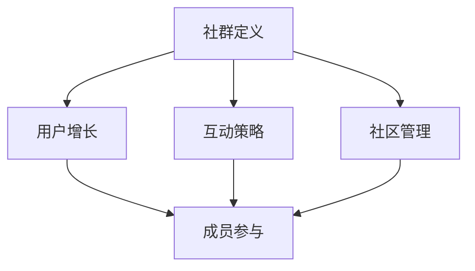

                 

关键词：知识社群运营，用户增长，程序员社区，社区管理，互动策略，技术交流

> 摘要：本文将探讨如何从零开始构建一个程序员的知识社群，并逐步增加用户到10000。我们将分析社群运营的核心原则，讨论互动策略，分享项目实践，并提供实用的工具和资源推荐。

## 1. 背景介绍

程序员是一个充满激情和创造力的群体，他们热衷于技术分享和学习新知识。然而，随着信息爆炸的时代，如何在众多技术社区中脱颖而出，吸引并留住用户，成为了许多程序员和社区管理者的难题。

构建一个成功的知识社群不仅需要明确的目标和愿景，还需要一套系统的运营策略。本文旨在为那些想要创建和扩展程序员知识社群的人提供一些实用的指导和建议。

## 2. 核心概念与联系

在讨论知识社群的构建与运营之前，我们需要理解几个核心概念：

### 2.1 社群定义

社群是一个由共同兴趣、目标或价值观连接在一起的人群。在程序员的知识社群中，成员可能对编程语言、开发工具、算法或者软件架构有共同的热情。

### 2.2 用户增长

用户增长是衡量社群成功的重要指标。增长可以通过吸引新用户、提高用户留存率和提升用户活跃度来实现。

### 2.3 互动策略

互动策略包括如何激发社群成员的参与热情，如举办线上/线下活动、设立问答板块、组织代码挑战等。

### 2.4 社区管理

社区管理涉及到制定规则、处理争议、维护秩序和激励成员等任务。

以下是一个简化的 Mermaid 流程图，展示了这些核心概念之间的联系：



## 3. 核心算法原理 & 具体操作步骤

### 3.1 算法原理概述

知识社群的运营可以被视为一种算法，其中包含了一系列策略和步骤，以实现用户增长、提高成员互动和保持社群健康。以下是这个算法的主要组成部分：

1. **目标设定**：确定社群的核心价值和长期目标。
2. **内容规划**：创建有价值的内容，吸引潜在用户。
3. **用户互动**：通过互动提高用户参与度和留存率。
4. **社区维护**：确保社群秩序，防止垃圾信息和恶意行为。
5. **增长优化**：不断优化策略，以实现持续增长。

### 3.2 算法步骤详解

1. **目标设定**：
   - 确定社群的核心领域和目标用户。
   - 制定长期目标和短期目标。

2. **内容规划**：
   - 研究用户需求，制作内容大纲。
   - 创建高质量的文章、视频和教程。
   - 定期更新内容，保持活跃度。

3. **用户互动**：
   - 设立问答板块，鼓励成员提问和回答。
   - 举办线上/线下活动，增加互动机会。
   - 鼓励成员分享经验和观点。

4. **社区维护**：
   - 制定并公示社区规则。
   - 定期检查并处理违规行为。
   - 设立举报机制，维护社群秩序。

5. **增长优化**：
   - 跟踪关键指标，如用户增长率、活跃度和留存率。
   - 根据数据调整策略，优化社群运营。

### 3.3 算法优缺点

**优点**：
- 系统化运营，确保社群健康和持续增长。
- 提高用户参与度和满意度。
- 提升社群的品牌价值和影响力。

**缺点**：
- 运营初期需要大量时间和精力。
- 需要不断调整和优化策略。
- 可能会遇到社群成员流失的问题。

### 3.4 算法应用领域

- 编程语言社群：如Python、JavaScript等。
- 开发工具社群：如Docker、Kubernetes等。
- 软件架构社群：如微服务、容器化等。

## 4. 数学模型和公式 & 详细讲解 & 举例说明

在知识社群运营中，我们可以使用一些数学模型和公式来衡量社群的健康程度和增长趋势。以下是几个常用的数学模型：

### 4.1 数学模型构建

- **用户增长率**（G）：新用户数除以当前用户总数。
- **活跃度**（A）：活跃用户数除以总用户数。
- **留存率**（R）：在一定时间后仍然活跃的用户数占总用户数的比例。

### 4.2 公式推导过程

- **用户增长率**（G）：

  $$ G = \frac{New\ Users}{Total\ Users} $$

- **活跃度**（A）：

  $$ A = \frac{Active\ Users}{Total\ Users} $$

- **留存率**（R）：

  $$ R = \frac{Active\ Users\ after\ a\ period}{Total\ Users} $$

### 4.3 案例分析与讲解

假设一个社群在一个月内有1000名用户，其中新增用户为100名，活跃用户为300名，一个月后留存用户为200名。我们可以计算出以下指标：

- **用户增长率**（G）：

  $$ G = \frac{100}{1000} = 0.1 \text{ 或 10%} $$

- **活跃度**（A）：

  $$ A = \frac{300}{1000} = 0.3 \text{ 或 30%} $$

- **留存率**（R）：

  $$ R = \frac{200}{1000} = 0.2 \text{ 或 20%} $$

根据这些指标，我们可以分析社群的运营状况。例如，如果用户增长率低于5%，可能需要调整内容规划或互动策略。如果活跃度低于20%，可能需要增加线下活动或问答板块的互动。

## 5. 项目实践：代码实例和详细解释说明

### 5.1 开发环境搭建

为了演示如何在社群中实现代码实例，我们可以使用一个在线编程平台，如 CodePen 或 JSFiddle。以下是搭建开发环境的基本步骤：

1. 注册并登录到 CodePen 或 JSFiddle。
2. 创建一个新的项目。
3. 选择适合的编程语言（例如 JavaScript）。
4. 编写代码并保存。

### 5.2 源代码详细实现

以下是一个简单的 JavaScript 示例，用于计算两个数的和：

```javascript
function add(a, b) {
  return a + b;
}

// 测试代码
console.log(add(3, 5)); // 输出：8
```

### 5.3 代码解读与分析

这段代码定义了一个名为 `add` 的函数，它接受两个参数 `a` 和 `b`，并返回它们的和。`console.log` 用于输出结果。

### 5.4 运行结果展示

在 CodePen 或 JSFiddle 中运行上述代码，可以在控制台看到输出结果 `8`。

## 6. 实际应用场景

知识社群在程序员社区中有着广泛的应用场景：

- **技术分享**：成员分享自己的开发经验、代码示例和技术博客。
- **问题求助**：成员可以提问并获得其他成员的帮助。
- **代码审查**：成员可以共同审查和改进代码。
- **项目合作**：成员可以找到志同道合的人一起开发项目。

### 6.4 未来应用展望

随着技术的发展，知识社群的应用前景将更加广阔：

- **智能推荐**：利用机器学习算法为成员推荐相关内容。
- **虚拟现实**：通过虚拟现实技术举办沉浸式的在线活动。
- **区块链**：使用区块链技术确保社群内容和交易的透明和可追溯。

## 7. 工具和资源推荐

### 7.1 学习资源推荐

- **书籍**：《程序员修炼之道》、《代码大全》
- **在线课程**：Coursera、Udemy、edX
- **博客**：Stack Overflow、GitHub、Medium

### 7.2 开发工具推荐

- **在线编程平台**：CodePen、JSFiddle、CodeSandbox
- **版本控制**：GitHub、GitLab、Bitbucket
- **文档工具**：Markdown、Docusaurus、Readme

### 7.3 相关论文推荐

- **《社交网络分析：方法与应用》**
- **《群体智能与社群计算》**
- **《基于区块链的社交网络隐私保护研究》**

## 8. 总结：未来发展趋势与挑战

### 8.1 研究成果总结

本文探讨了知识社群运营的核心原则、算法原理和具体操作步骤。通过数学模型和实际案例，我们了解了如何衡量社群的健康程度和增长趋势。

### 8.2 未来发展趋势

随着人工智能和区块链技术的发展，知识社群将更加智能化和去中心化。智能推荐和虚拟现实技术将为社群成员带来更丰富的体验。

### 8.3 面临的挑战

社群运营面临着内容质量、用户留存和社区秩序等挑战。需要不断优化策略，确保社群的可持续发展。

### 8.4 研究展望

未来的研究可以关注如何利用大数据和机器学习技术提升社群运营效率，以及如何通过去中心化技术增强社群的透明度和可信度。

## 9. 附录：常见问题与解答

### Q：如何吸引新用户？
A：可以通过社交媒体宣传、举办线上活动、发布高质量内容等方式吸引新用户。

### Q：如何提高用户活跃度？
A：可以设立问答板块、举办代码挑战、定期更新内容，以及提供激励措施（如勋章、积分）。

### Q：如何处理社群争议？
A：可以制定明确的社区规则，设立举报机制，并设立仲裁委员会来处理争议。

作者：禅与计算机程序设计艺术 / Zen and the Art of Computer Programming

----------------------------------------------------------------
<|endof Assist|>

