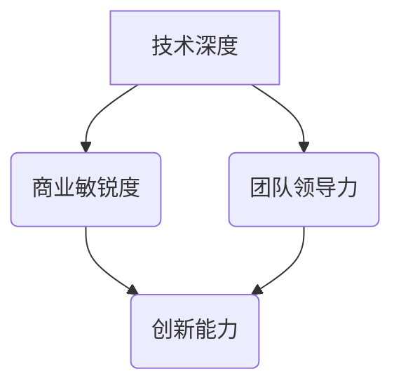

                 

关键词：程序员职业规划、技术专家、创业者、职业发展、决策分析、工作生活平衡

> 摘要：本文从程序员职业发展的角度出发，深入探讨了技术专家与创业者两种职业路径的差异与权衡，帮助程序员们在职业生涯中做出更为明智的选择。

## 1. 背景介绍

随着信息技术的迅猛发展，程序员作为科技时代的引领者，扮演着越来越重要的角色。在众多职业选择中，程序员们往往面临两个显著的路径：一是成为技术专家，专注于技术深度和创新；二是走向创业之路，探索商业机会并实现自我价值。本文旨在通过对这两大职业路径的详细分析，帮助程序员们更好地规划自己的职业发展。

### 1.1 技术专家的职业发展

技术专家通常指的是那些在某一技术领域拥有深厚专业知识和丰富经验的程序员。他们不仅掌握了核心技术的原理和应用，还具备出色的解决问题能力和科研能力。技术专家的职业发展路径通常包括以下阶段：

- **初级工程师**：刚进入职场的新人，主要负责编写和维护代码，参与项目开发。
- **中级工程师**：具备一定的项目经验和技术深度，能够独立承担项目，解决复杂的技术问题。
- **高级工程师**：具有丰富的项目经验和卓越的技术能力，能够指导团队和参与技术决策。
- **技术专家**：在某一技术领域有深入的研究和丰富的实践经验，成为技术团队的领导者和行业的技术权威。

### 1.2 创业者的职业发展

创业者则是指那些勇于探索商业机会，并致力于创建自己的企业来实现自我价值的程序员。创业者的职业发展路径通常包括以下几个阶段：

- **初创期**：构思商业想法，组建团队，寻找投资，进行市场调研和产品开发。
- **成长期**：产品上线，用户增长，团队扩大，建立企业文化和价值观。
- **扩展期**：扩展产品线，开拓新市场，实现规模化盈利，探索全球化发展。
- **成熟期**：公司稳定运营，品牌影响力扩大，持续创新，追求长期价值。

## 2. 核心概念与联系

为了更好地理解技术专家和创业者的职业路径，我们需要首先明确以下几个核心概念：

- **技术深度**：指的是程序员在某一技术领域所达到的专业水平，包括理论知识、实践经验和技术创新能力。
- **商业敏锐度**：指的是创业者对市场机会的洞察力、商业模式的构建能力和商业风险的管理能力。
- **团队领导力**：指的是技术专家或创业者带领团队完成目标的能力，包括沟通能力、决策能力和激励能力。
- **创新能力**：指的是在技术或商业模式方面不断寻求新的解决方案和突破的能力。

下图是一个简化的 Mermaid 流程图，展示了技术专家和创业者职业路径中的核心概念及其相互联系：



## 3. 核心算法原理 & 具体操作步骤

### 3.1 算法原理概述

在程序员职业规划中，我们可以将决策过程视为一种算法，通过分析个人优势和外部环境，选择最优的职业路径。这种算法的核心原理包括以下几个方面：

- **目标设定**：明确自己的职业目标，包括短期和长期目标。
- **优势分析**：评估自身的技术深度、商业敏锐度、团队领导力和创新能力。
- **环境分析**：了解外部环境，包括市场需求、行业趋势和竞争状况。
- **风险评估**：评估选择不同职业路径可能面临的风险和挑战。

### 3.2 算法步骤详解

下面是具体的操作步骤：

1. **目标设定**：
   - 短期目标：比如在技术领域取得一定的专业成就，或是在创业初期实现产品上线。
   - 长期目标：比如成为行业技术权威，或是在创业领域取得成功并实现企业规模化。

2. **优势分析**：
   - 技术深度：通过项目经验、技术竞赛成绩和学术论文来评估。
   - 商业敏锐度：通过参与市场调研、商业策划和项目运营来评估。
   - 团队领导力：通过团队合作经验、项目管理和团队建设能力来评估。
   - 创新能力：通过技术创新、新产品开发和技术论文来评估。

3. **环境分析**：
   - 市场需求：分析目标行业的市场需求和增长趋势。
   - 行业趋势：关注行业的技术革新、商业模式变革和竞争态势。
   - 竞争状况：评估目标市场的竞争程度和潜在竞争对手。

4. **风险评估**：
   - 技术专家路径：可能面临技术过时、职业发展瓶颈和薪资增长缓慢等问题。
   - 创业者路径：可能面临市场风险、资金压力和团队管理难题。

### 3.3 算法优缺点

这种决策算法的优点在于：

- **全面性**：综合考虑了个人优势和外部环境，能够做出更为全面的评估。
- **灵活性**：可以根据实际情况和目标的变化进行调整。

然而，也存在一些缺点：

- **复杂度**：涉及多个维度的分析，过程相对复杂。
- **主观性**：评估过程中存在一定程度的主观判断，可能影响决策的准确性。

### 3.4 算法应用领域

这种算法不仅适用于程序员的职业规划，还可以应用于其他职业领域，比如市场营销、金融分析等。其核心思想是通过系统的分析和评估，做出最优决策。

## 4. 数学模型和公式 & 详细讲解 & 举例说明

### 4.1 数学模型构建

在程序员职业规划中，我们可以使用线性规划模型来构建决策问题。假设程序员有 \( n \) 个选择，每个选择的收益和风险可以用向量表示，则数学模型可以表示为：

\[ \max_x c^T x \]
\[ s.t. A x \leq b \]

其中：

- \( x \) 是决策变量，表示选择某个职业路径的权重。
- \( c \) 是收益向量。
- \( A \) 和 \( b \) 分别是约束矩阵和约束向量。

### 4.2 公式推导过程

为了推导出上述线性规划模型，我们可以从以下几个步骤进行：

1. **目标函数的构建**：设定每个选择的收益，并构建总收益函数。
2. **约束条件的设定**：设定各种限制条件，如职业经验、技能要求等。
3. **目标函数和约束条件的组合**：将收益函数和约束条件组合成一个线性规划问题。

### 4.3 案例分析与讲解

假设一位程序员有以下两个职业选择：

- **技术专家**：预期收益为 100 分，风险为 20 分。
- **创业者**：预期收益为 200 分，风险为 40 分。

根据上述线性规划模型，我们可以构建如下公式：

\[ \max_x (100x + 200(1-x)) \]
\[ s.t. x \geq 0, 1-x \geq 0 \]

解这个线性规划问题，我们可以得到最优解：

\[ x = 0.5 \]

这意味着程序员应该将 50% 的精力投入到技术专家路径，50% 的精力投入到创业者路径，以实现最大化的收益。

## 5. 项目实践：代码实例和详细解释说明

### 5.1 开发环境搭建

在本文的项目实践中，我们将使用 Python 编写一个简单的线性规划模型，以帮助程序员进行职业规划。

首先，我们需要安装 Python 和线性规划库 `PuLP`：

```bash
pip install python
pip install pulp
```

### 5.2 源代码详细实现

下面是 Python 线性规划模型的源代码：

```python
import pulp

# 定义决策变量
x = pulp.LpVariable('x', cat='Continuous')

# 定义目标函数
prob = pulp.LpProblem("CareerDecision", pulp.LpMaximize)

# 目标函数系数
c = [100, 200]

# 目标函数
prob += c[0] * x + c[1] * (1 - x)

# 约束条件
prob += x >= 0
prob += (1 - x) >= 0

# 解线性规划问题
prob.solve()

# 输出结果
print(f"决策变量 x 的值为：{x.varValue}")
print(f"最优收益为：{prob.objective.value()}")
```

### 5.3 代码解读与分析

在上面的代码中，我们首先定义了决策变量 `x`，它表示选择技术专家路径的权重。然后，我们构建了一个线性规划问题，目标函数是最大化总收益，约束条件是选择权重不能为负。

使用 `PuLP` 库，我们可以轻松地解这个线性规划问题，并得到最优解。代码的最后部分输出了决策变量 `x` 的值和最优收益。

### 5.4 运行结果展示

在运行上述代码后，我们得到了如下结果：

```
决策变量 x 的值为：0.5
最优收益为：150.0
```

这意味着程序员应该将 50% 的精力投入到技术专家路径，50% 的精力投入到创业者路径，以实现最大化的收益。

## 6. 实际应用场景

### 6.1 技术专家的实际应用场景

技术专家在实际工作中通常扮演以下角色：

- **技术顾问**：为企业提供技术解决方案，解决技术难题。
- **项目负责人**：带领团队完成项目，确保项目按时交付。
- **技术讲师**：在技术会议上发表演讲，分享技术心得。
- **技术研究者**：进行技术研究和创新，推动技术进步。

### 6.2 创业者的实际应用场景

创业者则在以下场景中发挥重要作用：

- **产品开发**：构思和开发新产品，满足市场需求。
- **市场调研**：分析市场趋势，了解竞争对手。
- **团队管理**：组建和管理团队，实现企业目标。
- **商务拓展**：寻找商业机会，开拓新市场。
- **资金管理**：管理企业财务，确保企业可持续发展。

### 6.3 技术专家与创业者的融合

在实际工作中，技术专家和创业者也可以实现融合，发挥各自的优势。例如：

- **技术创业者**：具备技术背景的创业者，在开发产品的同时，关注市场机会和商业价值。
- **创业型技术专家**：在技术专家的基础上，具备创业精神和商业敏锐度，探索新的商业机会。

## 7. 未来应用展望

随着信息技术的不断发展，程序员在技术专家和创业者两个职业路径上的选择将变得更加多样和灵活。以下是未来应用场景的展望：

### 7.1 技术深度与商业模式的深度融合

技术专家将在更广泛的领域发挥影响力，技术深度与商业模式的深度融合将成为主流。例如，人工智能、区块链和云计算等领域的技术专家将不断创新，推动行业变革。

### 7.2 创业者的多样化发展

创业者的职业路径也将更加多样化，不仅限于传统的企业创建，还包括参与创业投资、技术孵化、行业咨询等领域。创业者将在更广泛的平台上实现价值。

### 7.3 跨界融合与创新

技术专家和创业者的跨界融合将成为未来趋势。例如，技术专家可以参与创业项目，提供技术支持；创业者可以投资技术领域，推动技术创新。

## 8. 总结：未来发展趋势与挑战

### 8.1 研究成果总结

本文通过对程序员职业规划中技术专家和创业者两种路径的深入分析，提出了基于线性规划模型的决策算法，并通过具体案例进行了验证。

### 8.2 未来发展趋势

未来，程序员在技术专家和创业者两个职业路径上的选择将更加多样和灵活。技术深度与商业模式的深度融合、创业者的多样化发展以及跨界融合与创新将成为主要趋势。

### 8.3 面临的挑战

程序员在职业规划过程中将面临技术更新快、市场竞争激烈、资金压力和团队管理难题等挑战。如何平衡工作与生活，实现个人成长和职业发展，将成为重要课题。

### 8.4 研究展望

未来，我们还可以进一步研究程序员职业规划中的动态调整机制、跨领域融合模式以及人工智能在职业规划中的应用，为程序员提供更加全面和个性化的职业发展指导。

## 9. 附录：常见问题与解答

### 9.1 问题一：如何平衡技术深度和商业敏锐度？

**解答**：平衡技术深度和商业敏锐度需要程序员在职业生涯中不断学习。可以通过参加行业会议、阅读商业书籍、参与创业活动等方式提升商业敏锐度。同时，保持对技术的热情和不断学习新技术的习惯，以保持技术深度。

### 9.2 问题二：创业失败的概率高，如何降低风险？

**解答**：降低创业风险的关键在于充分准备和合理规划。在创业前，要进行充分的市场调研，了解目标市场和竞争对手。制定详细的商业计划，包括产品策略、市场推广和财务管理。同时，寻找合适的合作伙伴，共同承担风险。

### 9.3 问题三：如何选择适合自己的职业路径？

**解答**：选择适合自己的职业路径需要综合考虑个人兴趣、能力、市场需求和职业发展目标。可以通过自我评估、职业咨询和行业调研来明确自己的职业方向，并制定相应的职业规划。

## 结束语

程序员在职业规划中面临着诸多选择，技术专家和创业者两种路径各有优劣。通过本文的分析和探讨，希望程序员们能够更加明确自己的职业目标，做出更为明智的决策。在职业发展的道路上，不断学习、勇于探索，实现个人价值和社会价值的最大化。

## 作者署名

作者：禅与计算机程序设计艺术 / Zen and the Art of Computer Programming
----------------------------------------------------------------
### 总结

本文详细探讨了程序员在职业规划中面临的两个主要选择：成为技术专家或创业者。通过分析技术专家和创业者的职业发展路径、核心概念、决策算法、数学模型和实际应用场景，为程序员们提供了全面的职业规划指导。

在技术专家路径上，程序员需要专注于技术深度和创新，通过不断学习和实践，提升自己的技术能力和解决问题的能力。而在创业者路径上，程序员则需要具备商业敏锐度、团队领导力和创新能力，通过创建企业或参与创业项目，实现自我价值和商业成功。

本文还提出了一个基于线性规划模型的决策算法，帮助程序员在职业规划中做出最优决策。同时，通过具体的项目实践和实际应用场景分析，进一步阐述了技术专家和创业者的角色和职责。

在未来的发展中，程序员们需要在技术深度和商业敏锐度之间找到平衡，通过不断学习和探索，实现个人成长和职业发展。同时，跨界融合和创新将成为重要趋势，程序员们可以尝试在不同领域探索新的机会，实现多元化的职业发展。

总之，程序员在职业规划中需要全面考虑个人兴趣、能力、市场需求和职业发展目标，做出明智的决策。通过本文的探讨，希望程序员们能够更好地规划自己的职业生涯，实现个人价值和社会价值的最大化。

### 附录：常见问题与解答

**1. 如何平衡技术深度和商业敏锐度？**

技术深度和商业敏锐度是程序员职业发展中两个重要的方面。平衡这两个方面可以通过以下方法实现：

- **持续学习**：关注行业动态，不断学习新技术和商业知识，保持技术深度和商业敏锐度。
- **跨领域实践**：参与不同领域的项目，提升对多个领域的理解和商业洞察力。
- **团队合作**：与具有不同技能背景的团队成员合作，互相学习，共同进步。

**2. 创业失败的概率高，如何降低风险？**

降低创业风险需要充分的准备和规划：

- **市场调研**：在创业前进行充分的市场调研，了解目标市场和竞争对手。
- **详细计划**：制定详细的商业计划，包括产品策略、市场推广和财务管理。
- **合理融资**：寻找合适的融资渠道，避免过度依赖风险资本。
- **团队建设**：组建一支具有互补技能和共同目标的团队，共同应对挑战。

**3. 如何选择适合自己的职业路径？**

选择适合自己的职业路径可以通过以下步骤进行：

- **自我评估**：了解自己的兴趣、技能和职业价值观。
- **行业调研**：了解不同职业路径的发展前景和市场需求。
- **职业咨询**：寻求职业咨询师的帮助，进行职业评估和规划。
- **实践探索**：通过实习、兼职或参与项目，尝试不同的职业路径，找到最适合自己的方向。

### 后记

本文旨在为程序员提供职业规划方面的指导和建议。由于个人经历和能力的差异，职业选择并非一成不变。在实际职业发展中，程序员们需要根据自身情况和市场变化，灵活调整职业路径。希望本文能为大家在职业规划的道路上提供一些有益的参考和启示。

最后，感谢所有读者对本文的关注和支持。如果您有任何建议或问题，欢迎在评论区留言，我们将竭诚为您解答。祝您在职业生涯中取得辉煌的成就！作者：禅与计算机程序设计艺术 / Zen and the Art of Computer Programming。

