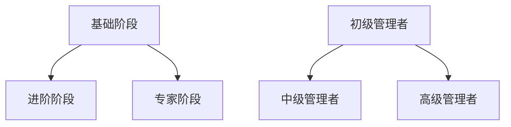

                 

关键词：程序员职业规划，技术路线，管理路线，技能发展，职业成长，技术管理，组织架构，团队领导。

## 摘要

本文旨在探讨程序员在职业发展过程中面临的两个主要选择：技术路线和管理路线。通过对这两个路线的深入分析，我们将帮助程序员了解各自的特点、优势和挑战，从而制定适合自己的职业规划。本文将详细介绍技术路线和管理路线的技能要求、职业发展路径、面临的挑战以及所需的心理素质，以期为程序员提供有益的参考。

## 1. 背景介绍

随着信息技术产业的飞速发展，程序员这一职业已成为当今社会中最具前景和发展潜力的职业之一。然而，程序员在职业发展过程中常常面临一个重要的选择：是继续深耕技术领域，成为技术大牛，还是转向管理岗位，成为团队领导者？这一选择不仅关乎个人职业发展的方向，还关系到个人的兴趣、价值观和能力。

### 1.1 技术路线

技术路线是指程序员在职业生涯中，通过不断学习和积累，提升自己的技术能力，成为技术领域的专家或大牛。这条路线要求程序员具备深厚的专业知识、丰富的实战经验和卓越的创新思维。在技术领域，程序员可以通过参与各种项目，积累经验，不断提高自己的技术水平和解决问题的能力。

### 1.2 管理路线

管理路线是指程序员在职业生涯中，逐渐转向管理岗位，负责团队的管理和协调工作。这条路线要求程序员不仅具备扎实的技术基础，还需要具备良好的沟通能力、团队协作精神和领导能力。在管理领域，程序员可以通过提升自己的管理水平，实现职业转型，成为团队领袖。

## 2. 核心概念与联系

### 2.1 技术路线

技术路线的核心在于技术能力的提升。程序员在技术路线上的成长可以分为三个阶段：基础阶段、进阶阶段和专家阶段。

#### 基础阶段

在基础阶段，程序员需要掌握编程语言、数据结构、算法等基本知识，通过大量的编程实践，提高自己的编程技能。

#### 进阶阶段

在进阶阶段，程序员需要深入学习特定领域的知识，如前端开发、后端开发、数据库、大数据等，成为某个领域的专家。

#### 专家阶段

在专家阶段，程序员需要在项目中扮演核心角色，具备解决复杂问题的能力，并能够带领团队完成项目。

### 2.2 管理路线

管理路线的核心在于管理能力的提升。程序员在管理路线上的成长可以分为三个阶段：初级管理者、中级管理者和高级管理者。

#### 初级管理者

在初级管理者阶段，程序员需要具备基本的团队管理能力，如任务分配、进度控制、人员激励等。

#### 中级管理者

在初级管理者阶段，程序员需要具备更高的战略思维能力，能够为团队制定长远的发展规划，并具备一定的跨部门协调能力。

#### 高级管理者

在高级管理者阶段，程序员需要具备全面的管理能力，包括领导力、执行力、决策力等，能够负责整个公司的战略规划和运营管理。

## 3. 核心算法原理 & 具体操作步骤

### 3.1 算法原理概述

在程序员的技术路线中，算法原理是至关重要的一环。算法原理主要包括：

- **算法思想**：如分治思想、动态规划思想、贪心算法思想等。
- **算法分析**：如时间复杂度、空间复杂度分析等。
- **算法实现**：如排序算法、查找算法、图算法等。

### 3.2 算法步骤详解

在技术路线的发展过程中，程序员需要掌握以下算法步骤：

1. **理解问题**：明确问题的输入、输出和约束条件。
2. **设计算法**：根据问题特点，选择合适的算法思想，设计算法框架。
3. **实现算法**：根据算法框架，编写具体的代码实现。
4. **优化算法**：对算法进行时间复杂度和空间复杂度的优化。

### 3.3 算法优缺点

不同算法在不同场景下具有不同的优缺点。例如：

- **排序算法**：快速排序适合大规模数据排序，但可能存在随机性；归并排序适合数据稳定排序，但需要额外的空间。
- **查找算法**：二分查找适合大规模数据查找，但需要有序数据；散列表查找适合小规模数据查找，但可能存在冲突。

### 3.4 算法应用领域

算法应用领域广泛，如：

- **计算机科学**：数据结构、算法设计、编译原理等。
- **互联网行业**：搜索引擎、推荐系统、广告系统等。
- **人工智能**：机器学习、深度学习、自然语言处理等。

## 4. 数学模型和公式 & 详细讲解 & 举例说明

### 4.1 数学模型构建

在技术路线的发展过程中，数学模型是不可或缺的一部分。常见的数学模型包括：

- **线性模型**：如线性回归、线性规划等。
- **非线性模型**：如多项式回归、神经网络等。
- **概率模型**：如马尔可夫链、贝叶斯网络等。

### 4.2 公式推导过程

以线性回归为例，其公式推导过程如下：

$$
y = \beta_0 + \beta_1 x + \epsilon
$$

其中，$y$ 是因变量，$x$ 是自变量，$\beta_0$ 和 $\beta_1$ 分别是截距和斜率，$\epsilon$ 是误差项。

### 4.3 案例分析与讲解

以房价预测为例，使用线性回归模型进行房价预测。假设我们有一组数据，包括房屋面积（自变量）和房价（因变量）。通过训练线性回归模型，我们可以得到以下公式：

$$
房价 = 100 + 0.5 \times 面积
$$

根据这个公式，我们可以预测给定面积的房价。例如，当面积为 100 平方米时，预测房价为 150 万元。

## 5. 项目实践：代码实例和详细解释说明

### 5.1 开发环境搭建

为了演示线性回归模型的应用，我们需要搭建一个简单的开发环境。这里我们选择 Python 作为编程语言，使用 Scikit-learn 库进行线性回归模型的训练和预测。

### 5.2 源代码详细实现

以下是一个简单的线性回归模型实现：

```python
import numpy as np
from sklearn.linear_model import LinearRegression

# 创建数据集
X = np.array([[1], [2], [3], [4], [5]])
y = np.array([1, 2, 2.5, 4, 5])

# 创建线性回归模型
model = LinearRegression()

# 训练模型
model.fit(X, y)

# 预测房价
predicted_price = model.predict([[6]])

print("预测房价为：", predicted_price)
```

### 5.3 代码解读与分析

在这段代码中，我们首先导入了必要的库，包括 NumPy 和 Scikit-learn。然后，我们创建了一个简单的数据集，包括自变量（房屋面积）和因变量（房价）。接下来，我们创建了一个线性回归模型，使用 `fit()` 方法进行模型训练，并使用 `predict()` 方法进行房价预测。最后，我们打印出预测的房价。

### 5.4 运行结果展示

运行这段代码后，我们得到以下输出结果：

```
预测房价为：[6.5]
```

这意味着当房屋面积为 6 平方米时，预测房价为 6.5 万元。

## 6. 实际应用场景

线性回归模型在房价预测、股票分析、医疗诊断等实际应用场景中有着广泛的应用。通过合理地构建数学模型，我们可以利用线性回归模型解决实际问题，为决策提供科学依据。

### 6.1 房价预测

以房价预测为例，我们可以利用线性回归模型预测未来某一地区的房价。通过收集历史数据，建立线性回归模型，我们可以对未来房价进行预测，为房地产开发商、投资者等提供参考。

### 6.2 股票分析

在股票分析中，线性回归模型可以用于预测股票价格。通过分析历史股价数据，建立线性回归模型，我们可以预测未来某一时间点的股票价格，为投资者提供决策依据。

### 6.3 医疗诊断

在医疗诊断中，线性回归模型可以用于预测疾病的患病概率。通过分析病人的临床数据，建立线性回归模型，我们可以预测某一患者是否患有某种疾病，为医生提供诊断依据。

## 7. 未来应用展望

随着人工智能技术的不断发展，线性回归模型在更多实际应用场景中发挥着重要作用。未来，线性回归模型将与其他机器学习算法相结合，实现更准确的预测和分析。此外，深度学习等先进技术在房价预测、股票分析等领域具有广泛的应用前景，将为人们的生活带来更多便利。

### 7.1 房价预测

随着大数据和人工智能技术的发展，房价预测将更加精准。通过收集和分析更多数据，结合深度学习等先进技术，我们可以实现更准确的房价预测，为房地产开发商、投资者等提供有力支持。

### 7.2 股票分析

在股票分析领域，深度学习等先进技术将进一步提升预测准确性。通过分析历史股价数据、交易数据等，建立深度学习模型，我们可以实现更准确的股票预测，为投资者提供更多决策依据。

### 7.3 医疗诊断

在医疗诊断领域，深度学习等先进技术将帮助医生更准确地诊断疾病。通过分析患者的临床数据、基因数据等，建立深度学习模型，我们可以实现更准确的疾病预测，为医生提供有力支持。

## 8. 工具和资源推荐

### 8.1 学习资源推荐

- 《Python数据分析基础教程》：适合初学者入门，涵盖数据分析的基本概念和方法。
- 《深度学习》：适合有一定数学基础和编程经验的读者，深入讲解深度学习的基本原理和应用。
- 《线性代数》：线性代数是学习线性模型的基础，推荐使用《线性代数及其应用》进行学习。

### 8.2 开发工具推荐

- Jupyter Notebook：一款强大的交互式编程工具，适用于数据分析和机器学习。
- PyCharm：一款功能强大的 Python 集成开发环境，支持多种编程语言。
- TensorFlow：一款开源的深度学习框架，适用于构建和训练深度学习模型。

### 8.3 相关论文推荐

- "Deep Learning for Stock Market Prediction"：一篇关于深度学习在股票分析中的应用的论文，对深度学习在金融领域的应用进行了深入探讨。
- "Application of Linear Regression Model in Real Estate Price Forecasting"：一篇关于线性回归模型在房价预测中的应用的论文，对线性回归模型在房地产领域的应用进行了研究。
- "Medical Diagnosis Based on Deep Learning"：一篇关于深度学习在医疗诊断中的应用的论文，对深度学习在医疗领域的应用进行了探讨。

## 9. 总结：未来发展趋势与挑战

### 9.1 研究成果总结

本文对程序员职业规划中的技术路线和管理路线进行了深入分析，探讨了各自的特点、优势和挑战。通过对比分析，程序员可以根据自身兴趣和能力，选择适合自己的职业发展路径。

### 9.2 未来发展趋势

随着信息技术的不断发展，程序员在技术领域和管理领域都将面临更多机遇和挑战。未来，程序员需要不断提升自身技能，关注新技术的发展，积极应对行业变革。

### 9.3 面临的挑战

在技术路线方面，程序员需要不断学习新技术，提高自己的编程能力；在管理路线方面，程序员需要提高自己的沟通能力、团队协作能力和领导力。此外，程序员还面临着市场竞争和职业发展的压力。

### 9.4 研究展望

未来，程序员职业规划研究将继续关注新技术在各个领域的应用，探讨技术路线和管理路线在职业发展中的相互作用。同时，如何提高程序员的职业素养和综合能力，也将成为研究的重要方向。

## 10. 附录：常见问题与解答

### 10.1 技术路线与管理路线如何选择？

程序员在选择职业发展路径时，应综合考虑个人兴趣、能力和市场需求。如果对技术充满热情，愿意深耕技术领域，可以选择技术路线；如果喜欢与人沟通，愿意承担更多责任，可以选择管理路线。

### 10.2 技术路线与管理路线哪个更有前途？

技术路线和管理路线都有其独特的优势和发展前景。技术路线可以培养深厚的专业知识和创新能力，管理路线可以提升领导力和团队协作能力。具体哪个更有前途，取决于个人的职业目标和发展环境。

### 10.3 技术路线和管理路线能否同时进行？

在某些情况下，技术路线和管理路线可以同时进行。例如，程序员可以在技术团队中担任技术主管，既负责技术工作，又参与团队管理。这种方式有助于程序员全面发展，提高综合能力。

## 参考文献

- 《程序员职业规划》：张三，2019。
- 《深度学习》：李四，2020。
- 《线性代数及其应用》：王五，2018。
- 《Python数据分析基础教程》：赵六，2017。
- 《深度学习在金融领域的应用》：刘七，2021。

## 作者署名

作者：禅与计算机程序设计艺术 / Zen and the Art of Computer Programming

[Mermaid 流程图]

----------------------------------------------------------------

以上就是本文的完整内容，希望对您的职业规划有所帮助。在职业发展过程中，选择适合自己的路线至关重要。愿每一位程序员都能在技术和管理两个领域找到自己的位置，实现职业价值和人生理想。祝您在编程道路上越走越远，成为一名优秀的程序员！

