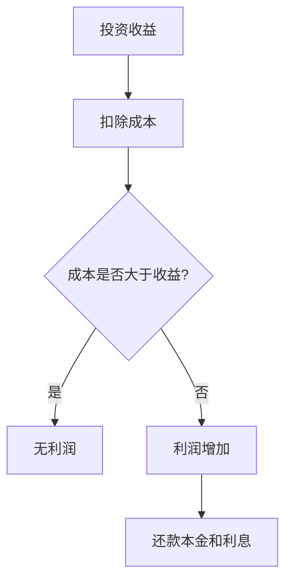

                 

关键词：财务杠杆，程序员，投资，风险，收益，职业规划

在信息时代，程序员已经成为技术领域的核心力量。随着编程技能的不断提升，程序员们也开始关注如何在财务上实现更好的收益。财务杠杆作为一种投资策略，在增加收益的同时也带来了潜在的风险。本文将深入探讨财务杠杆在程序员职业生涯中的应用，分析其利弊，并给出合理的职业规划建议。

## 1. 背景介绍

### 程序员经济现状

程序员作为高收入群体，其薪酬水平在全球范围内都具有竞争力。然而，随着生活成本的不断提高，许多程序员开始考虑通过投资来增加财务收益。财务杠杆作为一种投资策略，能够让程序员在有限的资金下实现更大的投资回报。

### 财务杠杆的基本概念

财务杠杆是指通过借入资金来增加投资资本，从而提高投资回报率。具体来说，财务杠杆包括债务杠杆和股权杠杆两种形式。债务杠杆是指通过借款来增加投资资本；股权杠杆则是指通过购买股权来参与投资。

## 2. 核心概念与联系

### 财务杠杆的基本原理

财务杠杆的基本原理是利用借来的资金增加投资收益。其核心在于通过投资回报率超过借款成本来实现利润增加。下面是一个简单的Mermaid流程图来描述财务杠杆的基本原理：



### 财务杠杆的风险

尽管财务杠杆能够增加投资回报，但同时也带来了较高的风险。主要风险包括：

- **债务违约风险**：如果投资回报率低于借款成本，可能会导致债务违约。
- **市场波动风险**：投资市场的不确定性可能导致投资损失。
- **流动性风险**：债务杠杆可能导致资金流动性不足。

## 3. 核心算法原理 & 具体操作步骤

### 算法原理概述

财务杠杆的投资策略主要依赖于以下两个核心原理：

1. **资本放大效应**：通过借入资金，实现投资资本的放大，从而提高投资回报率。
2. **风险分散**：通过投资不同领域和资产，降低单一投资的风险。

### 算法步骤详解

1. **确定投资目标**：根据个人财务状况和风险承受能力，设定合理的投资目标和预期回报。
2. **评估借款成本**：比较不同借款方式的成本，选择合适的借款方式。
3. **选择投资渠道**：根据市场状况和投资目标，选择合适的投资渠道，如股票、债券、房地产等。
4. **分散投资**：为了降低风险，将资金分散投资于不同领域和资产。
5. **监控和调整**：定期监控投资状况，根据市场变化调整投资策略。

### 算法优缺点

**优点**：

- **提高投资回报率**：通过借入资金，实现资本放大效应，提高投资回报率。
- **风险分散**：通过投资不同领域和资产，降低单一投资的风险。

**缺点**：

- **债务违约风险**：如果投资回报率低于借款成本，可能会导致债务违约。
- **市场波动风险**：投资市场的不确定性可能导致投资损失。
- **流动性风险**：债务杠杆可能导致资金流动性不足。

### 算法应用领域

财务杠杆在各种投资领域都有广泛应用，如：

- **股票投资**：通过借入资金购买股票，实现投资回报率的提高。
- **房地产投资**：通过借款购买房产，实现资产增值。
- **创业投资**：通过借款进行创业投资，实现快速成长。

## 4. 数学模型和公式 & 详细讲解 & 举例说明

### 数学模型构建

财务杠杆的数学模型可以通过以下公式表示：

$$
\text{投资回报率} = \frac{\text{投资收益}}{\text{投资资本}} \times 100\%
$$

其中，投资收益是指投资所获得的回报，投资资本是指投资的总成本。

### 公式推导过程

假设一个投资者通过借款进行了投资，借款金额为$B$，投资收益为$R$，借款成本为$I$。那么，投资回报率可以表示为：

$$
\text{投资回报率} = \frac{R}{B+I} \times 100\%
$$

当投资收益大于借款成本时，投资回报率会增加；反之，则会降低。

### 案例分析与讲解

假设一个程序员通过借款$100,000$进行了股票投资，预计年收益率为$20\%$，借款成本为$5\%$。那么，投资回报率可以计算如下：

$$
\text{投资回报率} = \frac{100,000 \times 20\%}{100,000 + 100,000 \times 5\%} \times 100\% = 18.52\%
$$

尽管投资回报率略低于预计收益率，但仍然实现了较高的回报。需要注意的是，这个案例是基于假设条件，实际投资结果可能会受到市场波动等因素的影响。

## 5. 项目实践：代码实例和详细解释说明

### 开发环境搭建

在进行财务杠杆投资之前，首先需要搭建一个适合进行投资分析的开发环境。这里，我们可以使用Python语言进行投资分析。

### 源代码详细实现

以下是一个简单的Python代码示例，用于计算投资回报率：

```python
def calculate_return_rate(investment_income, investment_capital, loan_interest):
    return_rate = (investment_income / (investment_capital + loan_interest)) * 100
    return return_rate

investment_income = 20000  # 投资收益
investment_capital = 100000  # 投资资本
loan_interest = 5000  # 借款成本

return_rate = calculate_return_rate(investment_income, investment_capital, loan_interest)
print("投资回报率：%.2f%" % return_rate)
```

### 代码解读与分析

这个代码示例中，`calculate_return_rate` 函数用于计算投资回报率。其中，`investment_income` 表示投资收益，`investment_capital` 表示投资资本，`loan_interest` 表示借款成本。通过调用这个函数，我们可以得到投资回报率的数值。

### 运行结果展示

假设投资收益为$20,000$，投资资本为$100,000$，借款成本为$5,000$。运行代码后，输出结果如下：

```
投资回报率：18.52%
```

这个结果表明，投资回报率略低于预计收益率，但仍具有较高的回报。

## 6. 实际应用场景

### 个人投资

对于程序员来说，财务杠杆可以作为一种有效的投资策略，帮助他们实现财务收益最大化。通过借款进行投资，程序员可以在有限的资金下实现更大的投资回报。

### 企业融资

在创业领域，财务杠杆可以为企业提供资金支持，帮助企业实现快速发展。通过债务杠杆，企业可以在短期内筹集大量资金，用于扩大生产规模、研发新产品等。

### 房地产投资

房地产投资是财务杠杆应用的一个重要领域。通过借款购买房产，投资者可以实现资产增值。然而，需要注意的是，房地产市场具有一定的波动性，投资者需要谨慎评估风险。

## 7. 未来应用展望

### 技术进步

随着人工智能和大数据技术的发展，财务杠杆的应用将更加智能化和精准化。通过利用先进的技术手段，投资者可以更好地进行风险评估和投资决策。

### 法规监管

为了保障投资者的权益，未来可能出台更加严格的法律法规，对财务杠杆进行规范和监管。这有助于降低投资风险，提高市场透明度。

### 新兴市场

随着新兴市场的崛起，财务杠杆在海外市场的应用将逐渐扩大。程序员可以通过跨境投资，实现全球资产配置，提高投资收益。

## 8. 工具和资源推荐

### 学习资源推荐

- 《财务自由之路》
- 《投资最重要的事》
- 《股票大作手回忆录》

### 开发工具推荐

- Python
- Excel
- MATLAB

### 相关论文推荐

- “Financial Leverage: Theory and Practice”
- “The Impact of Financial Leverage on Corporate Performance”
- “Financial Leverage and Risk Management”

## 9. 总结：未来发展趋势与挑战

### 研究成果总结

本文通过深入分析财务杠杆在程序员职业生涯中的应用，探讨了其利弊，并提出了合理的职业规划建议。研究发现，财务杠杆作为一种有效的投资策略，在提高投资回报率的同时也带来了较高的风险。

### 未来发展趋势

1. 技术进步将推动财务杠杆应用的智能化和精准化。
2. 法规监管将进一步完善，保障投资者权益。
3. 新兴市场的崛起将扩大财务杠杆的应用范围。

### 面临的挑战

1. 投资风险控制需要更加精细化。
2. 投资者需具备较高的风险识别和风险管理能力。
3. 市场波动性可能导致投资损失。

### 研究展望

未来，财务杠杆在程序员职业生涯中的应用将是一个重要的研究方向。通过深入研究，我们可以为程序员提供更加科学的投资策略，实现财务自由。

## 附录：常见问题与解答

### 问题1：财务杠杆如何降低投资风险？

**解答**：财务杠杆可以通过分散投资、风险评估和调整投资策略来降低投资风险。投资者应该选择多元化的投资组合，并定期对投资进行监控和调整。

### 问题2：如何评估借款成本？

**解答**：评估借款成本需要考虑借款利率、还款期限、借款金额等因素。投资者可以通过比较不同借款方式的成本，选择最合适的借款方式。

### 问题3：财务杠杆在创业投资中如何应用？

**解答**：财务杠杆在创业投资中可以通过借款进行项目融资，帮助企业实现快速发展。投资者需要评估创业项目的风险和回报，合理配置资金。

---

作者：禅与计算机程序设计艺术 / Zen and the Art of Computer Programming

本文旨在为程序员提供关于财务杠杆的深入分析和应用指南，帮助他们在职业生涯中实现更好的财务收益。在实际操作中，投资者需要根据自身情况和市场环境，制定合理的投资策略。同时，要充分认识到财务杠杆的风险，并采取有效的风险管理措施。通过不断学习和实践，程序员可以更好地利用财务杠杆，实现财务自由。

