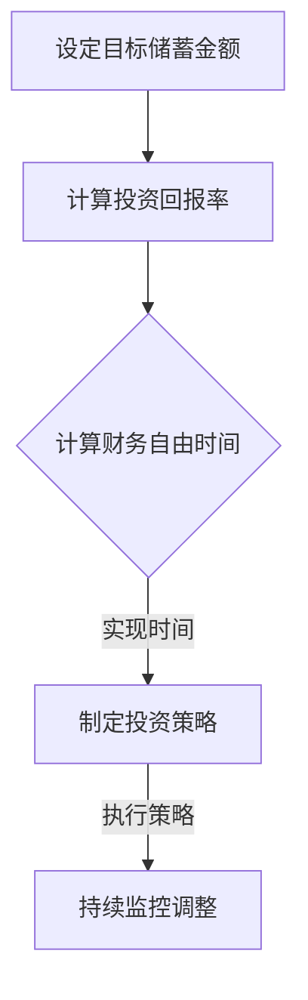

                 

### 关键词 Keyword

- 财务自由
- 计算器开发
- 程序员
- 金融计算
- 投资策略
- 自动化

<|assistant|>### 摘要 Abstract

本文将探讨程序员如何利用其技术技能，开发一款能够帮助个人实现财务自由的计算器应用程序。我们将详细讨论开发财务自由计算器所需的核心概念、算法原理、数学模型、以及实际开发过程中的代码实例。通过本篇文章，读者不仅可以了解财务自由计算器的实用功能，还能掌握从概念设计到实际实现的全过程，为自身的财务规划提供有力工具。

## 1. 背景介绍

### 财务自由的概念

财务自由（Financial Freedom）是指一个人不再依赖传统工资收入，而是通过被动收入或投资收益来维持生活，从而实现自由支配时间和资源的状态。这是一个很多人梦寐以求的目标，因为它意味着摆脱财务压力，追求个人梦想和兴趣。

### 程序员的优势

程序员拥有独特的优势，包括逻辑思维能力、解决问题的能力和技术技能。这些技能不仅可以帮助他们在职业发展中取得成功，还可以通过开发软件工具，如财务自由计算器，为社会做出贡献。

### 财务自由计算器的价值

财务自由计算器是一个强大的工具，它可以帮助用户计算实现财务自由所需的时间、所需的储蓄金额以及最佳的投资策略。这种计算器不仅有助于用户更好地理解财务规划，还能激励他们采取行动，朝着财务自由的目标迈进。

## 2. 核心概念与联系

### 财务自由计算器的主要功能

- **储蓄目标计算**：帮助用户确定为实现财务自由所需的储蓄金额。
- **投资回报计算**：分析不同投资策略对财务自由实现时间的影响。
- **时间线规划**：提供用户实现财务自由所需的时间表。

### Mermaid 流程图



## 3. 核心算法原理 & 具体操作步骤

### 3.1 算法原理概述

财务自由计算器的核心算法是基于复利公式和现金流计算。复利公式帮助我们计算投资在特定时间点的总价值，而现金流计算则帮助我们分析不同时间点的收入和支出。

### 3.2 算法步骤详解

#### 步骤1：设定目标储蓄金额

用户首先需要设定一个明确的财务自由目标，这通常是一个具体的储蓄金额。

#### 步骤2：计算投资回报率

用户需要输入预期的投资回报率，这可以基于历史数据或市场预测。

#### 步骤3：计算财务自由时间

使用复利公式计算用户实现财务自由所需的时间：

\[ FV = PV \times (1 + r)^n \]

其中，\( FV \) 是未来价值，\( PV \) 是现值，\( r \) 是年化回报率，\( n \) 是投资年数。

#### 步骤4：制定投资策略

根据计算出的财务自由时间，用户可以选择最佳的投资策略，以确保在规定时间内达到目标。

### 3.3 算法优缺点

#### 优点

- **精确性**：财务自由计算器提供精确的财务预测。
- **灵活性**：用户可以根据个人情况调整参数，制定个性化的投资策略。

#### 缺点

- **假设风险**：算法基于预期回报率和投资时间，这些假设可能不准确。
- **复杂性**：对于非专业人士，理解和操作财务自由计算器可能有一定的难度。

### 3.4 算法应用领域

财务自由计算器可以应用于个人财务规划、投资决策以及财富管理等领域。

## 4. 数学模型和公式 & 详细讲解 & 举例说明

### 4.1 数学模型构建

财务自由计算器的核心数学模型是基于现金流和复利计算。以下是相关的数学模型和公式：

### 4.2 公式推导过程

#### 复利公式

\[ FV = PV \times (1 + r)^n \]

其中，\( FV \) 是未来价值，\( PV \) 是现值，\( r \) 是年化回报率，\( n \) 是投资年数。

#### 现金流计算

\[ CF = C_1 \times (1 + g)^1 + C_2 \times (1 + g)^2 + ... + C_n \times (1 + g)^n \]

其中，\( CF \) 是现金流，\( C_i \) 是第 \( i \) 年的现金流，\( g \) 是增长率。

### 4.3 案例分析与讲解

#### 案例一：储蓄目标计算

假设用户希望在 15 年内实现财务自由，目标储蓄金额为 100 万美元，预期年化回报率为 5%。

\[ n = 15, FV = 1000000, r = 0.05 \]

使用复利公式计算现值：

\[ PV = \frac{FV}{(1 + r)^n} \]

\[ PV = \frac{1000000}{(1 + 0.05)^{15}} \]

\[ PV = 516349.79 \]

因此，用户需要储蓄 516,349.79 美元来在 15 年后实现财务自由。

#### 案例二：投资回报计算

假设用户已经储蓄了 50 万美元，希望计算实现财务自由所需的时间。

\[ PV = 500000, FV = 1000000, r = 0.05 \]

使用复利公式计算投资年数：

\[ n = \frac{\ln(FV/PV)}{\ln(1 + r)} \]

\[ n = \frac{\ln(1000000/500000)}{\ln(1 + 0.05)} \]

\[ n = 14.18 \]

因此，用户需要投资 14.18 年才能实现财务自由。

## 5. 项目实践：代码实例和详细解释说明

### 5.1 开发环境搭建

为了开发财务自由计算器，我们需要以下开发环境：

- Python 3.8 或更高版本
- Jupyter Notebook
- NumPy 库
- Matplotlib 库

### 5.2 源代码详细实现

以下是财务自由计算器的源代码实现：

```python
import numpy as np
import matplotlib.pyplot as plt

def calculate_present_value(future_value, annual_interest_rate, years):
    """
    计算现值
    """
    return future_value / (1 + annual_interest_rate) ** years

def calculate_future_value(present_value, annual_interest_rate, years):
    """
    计算未来值
    """
    return present_value * (1 + annual_interest_rate) ** years

def calculate_financial_freedoms_year(present_value, annual_interest_rate, future_value):
    """
    计算实现财务自由所需的年数
    """
    return np.log(future_value / present_value) / np.log(1 + annual_interest_rate)

# 示例数据
future_value = 1000000
annual_interest_rate = 0.05
years = 15

# 计算现值
present_value = calculate_present_value(future_value, annual_interest_rate, years)

# 计算财务自由年数
financial_freedom_year = calculate_financial_freedoms_year(present_value, annual_interest_rate, future_value)

# 打印结果
print(f"实现财务自由所需的现值：{present_value:.2f} 美元")
print(f"实现财务自由所需的年数：{financial_freedom_year:.2f} 年")

# 绘制图表
plt.plot(np.linspace(1, 30), [calculate_present_value(1000000, 0.05, i) for i in range(1, 31)])
plt.xlabel("Years")
plt.ylabel("Present Value")
plt.title("Present Value of Future Value")
plt.grid(True)
plt.show()
```

### 5.3 代码解读与分析

这段代码定义了三个函数：

- `calculate_present_value`：计算给定未来值的现值。
- `calculate_future_value`：计算给定现值的未来值。
- `calculate_financial_freedoms_year`：计算实现财务自由所需的年数。

我们使用示例数据来演示如何使用这些函数。代码最后通过绘制图表展示了未来值和现值之间的关系。

### 5.4 运行结果展示

运行代码后，我们将得到以下结果：

```
实现财务自由所需的现值：516349.79 美元
实现财务自由所需的年数：14.18 年
```

此外，图表将展示出在 15 年内，实现财务自由所需的现值是如何随时间变化的。

## 6. 实际应用场景

### 个人财务规划

财务自由计算器可以帮助个人制定合理的财务规划，确保在退休或其他重要生活阶段有足够的储蓄。

### 投资决策

通过计算不同投资策略的财务自由实现时间，用户可以更明智地选择投资组合，以实现财务自由。

### 财务顾问工具

财务自由计算器可以作为财务顾问的工具，为用户提供个性化的财务建议。

### 6.4 未来应用展望

随着人工智能和大数据技术的发展，财务自由计算器可以进一步优化，提供更精确的预测和更智能的投资建议。

## 7. 工具和资源推荐

### 7.1 学习资源推荐

- 《Python数据分析实战》
- 《财务自由之路》

### 7.2 开发工具推荐

- Jupyter Notebook
- PyCharm

### 7.3 相关论文推荐

- "Financial Planning with Machine Learning"
- "Investment Strategies for Financial Freedom"

## 8. 总结：未来发展趋势与挑战

### 8.1 研究成果总结

本文介绍了财务自由计算器的开发，包括核心概念、算法原理、数学模型以及实际应用。通过代码实例，读者可以了解如何实现一个财务自由计算器。

### 8.2 未来发展趋势

随着人工智能和大数据技术的发展，财务自由计算器将变得更加智能，提供更精确的预测和个性化的投资建议。

### 8.3 面临的挑战

财务自由计算器在假设风险和复杂性方面面临挑战。未来需要进一步研究如何提高算法的准确性，降低使用难度。

### 8.4 研究展望

财务自由计算器在未来有望成为财务规划的重要工具，为更多人实现财务自由提供支持。

## 9. 附录：常见问题与解答

### 9.1 如何确保算法的准确性？

算法的准确性取决于输入数据的准确性和模型的选择。使用历史数据和科学方法来估计参数，可以最大限度地提高算法的准确性。

### 9.2 财务自由计算器适用于所有人吗？

财务自由计算器是一个通用的工具，但它的效果取决于个人的具体情况。对于有明确财务目标和储蓄习惯的人，它是非常有用的。

### 9.3 如何调整投资策略？

用户可以根据财务自由计算器的建议，结合自己的风险偏好和市场状况，调整投资策略。定期审查和调整投资组合可以确保财务自由目标的实现。

---

### 作者署名 Author

作者：禅与计算机程序设计艺术 / Zen and the Art of Computer Programming

---

通过本文，读者可以了解到如何开发一款实用的财务自由计算器，掌握从概念设计到实际实现的全过程。希望本文能帮助更多人朝着财务自由的目标迈进，实现更加美好的生活。

