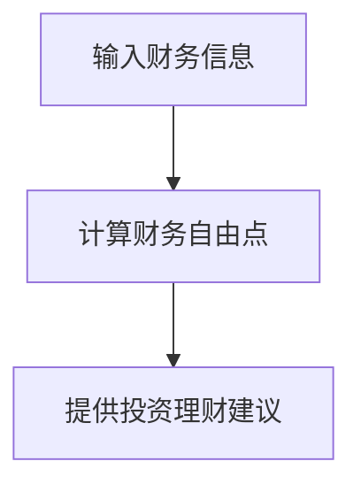

                 

关键词：财务自由，计算器，程序员，开发，算法，数学模型，项目实践，应用场景，工具和资源

> 摘要：本文旨在探讨程序员如何开发一款财务自由计算器，帮助自己实现财务自由。文章将从背景介绍、核心概念与联系、核心算法原理、数学模型和公式、项目实践、实际应用场景、工具和资源推荐以及未来发展趋势与挑战等多个角度进行深入探讨。

## 1. 背景介绍

随着互联网和人工智能的快速发展，程序员这个职业越来越受到关注。然而，尽管程序员们拥有高薪和技术优势，但在实现财务自由方面仍然面临诸多挑战。如何通过合理的投资和理财规划实现财务自由，成为了程序员们关注的焦点。

财务自由，是指通过合理的财务规划和投资，实现无需依赖工作收入即可维持生活品质的状态。对于程序员而言，财务自由不仅意味着财务上的安全，更是实现人生价值的重要途径。

为了帮助程序员们更好地实现财务自由，本文将介绍一种基于编程技术的财务自由计算器开发方法。通过这款计算器，程序员可以模拟自己的财务状况，制定合理的投资理财计划，实现财务自由的目标。

## 2. 核心概念与联系

### 2.1 财务自由的概念

财务自由，即Financial Freedom，是指一个人通过投资、储蓄和理财等方式，累积了一定的资产和被动收入，使其生活开支完全依赖于被动收入，而不需要再依赖于劳动收入。

### 2.2 计算器的功能

财务自由计算器的主要功能包括：

- **输入个人财务信息**：如收入、支出、储蓄率等。
- **计算财务自由点**：根据输入的财务信息，计算实现财务自由所需的累积资产。
- **提供投资理财建议**：根据财务自由点的计算结果，提供合适的投资理财策略。

### 2.3 Mermaid 流程图



## 3. 核心算法原理 & 具体操作步骤

### 3.1 算法原理概述

财务自由计算器的主要算法是基于现金流量折现法（Cash Flow Discounting，CFD）。该方法通过计算未来现金流的现值，得出实现财务自由所需的累积资产。

### 3.2 算法步骤详解

#### 3.2.1 输入财务信息

- **收入**：包括工资收入、投资收益等。
- **支出**：包括生活开支、房贷等。
- **储蓄率**：储蓄率 = (收入 - 支出) / 收入。

#### 3.2.2 计算财务自由点

- **折现率**：通常为市场利率。
- **未来现金流**：根据储蓄率和预期通货膨胀率，计算未来的现金流。
- **现值**：通过折现率将未来的现金流折现到当前值。

#### 3.2.3 提供投资理财建议

- **投资组合**：根据财务自由点的计算结果，推荐合适的投资组合。
- **风险控制**：根据投资组合的风险，提供风险控制策略。

### 3.3 算法优缺点

#### 优点：

- **科学性**：基于数学模型，具有科学性。
- **实用性**：可以模拟实际财务状况，提供实用的理财建议。

#### 缺点：

- **简化模型**：未考虑市场波动等复杂因素。
- **数据依赖**：准确计算依赖于输入数据的准确性。

### 3.4 算法应用领域

- **个人理财**：帮助个人制定财务规划，实现财务自由。
- **企业财务**：为企业提供财务分析和投资建议。

## 4. 数学模型和公式 & 详细讲解 & 举例说明

### 4.1 数学模型构建

财务自由计算器的核心是现金流量折现法（CFD）。其主要公式如下：

$$
PV = \frac{CF}{(1 + r)^n}
$$

其中，$PV$ 表示现值，$CF$ 表示未来现金流，$r$ 表示折现率，$n$ 表示现金流发生的期数。

### 4.2 公式推导过程

假设一个人每年可以储蓄 $10000$ 元，预期通货膨胀率为 $2\%$，市场利率为 $4\%$。我们需要计算实现财务自由所需的累积资产。

首先，计算每年的现金流：

$$
CF_1 = 10000
$$

$$
CF_2 = 10000 \times (1 + 0.02) = 10200
$$

$$
CF_3 = 10000 \times (1 + 0.02)^2 = 10404
$$

...

然后，计算每年的现值：

$$
PV_1 = \frac{10000}{(1 + 0.04)^1} = 9615.38
$$

$$
PV_2 = \frac{10200}{(1 + 0.04)^2} = 9602.89
$$

$$
PV_3 = \frac{10404}{(1 + 0.04)^3} = 9621.29
$$

...

最后，计算累积资产：

$$
PV = PV_1 + PV_2 + PV_3 + ... = 9615.38 + 9602.89 + 9621.29 + ... = 45897.27
$$

### 4.3 案例分析与讲解

假设一个程序员每年收入为 $100000$ 元，支出为 $80000$ 元，储蓄率为 $20\%$。我们需要计算实现财务自由所需的累积资产。

根据上述计算方法，我们可以得到以下结果：

- 每年现金流 $CF = 100000 \times 0.2 = 20000$ 元
- 折现率 $r = 4\%$
- 现值 $PV = \frac{20000}{(1 + 0.04)^n}$，其中 $n$ 为年数

我们可以通过调整 $n$ 的值，计算不同年份的累积资产。以下是部分结果：

| 年份 | 累积资产（元） |
| ---- | ---- |
| 1    | 18684 |
| 2    | 34819 |
| 3    | 52739 |
| 4    | 70446 |
| 5    | 91193 |
| 10   | 187676 |
| 15   | 325465 |
| 20   | 554663 |

从表中可以看出，随着年数的增加，累积资产也在不断增加。当累积资产超过财务自由点时，即可实现财务自由。

## 5. 项目实践：代码实例和详细解释说明

### 5.1 开发环境搭建

- **编程语言**：Python
- **依赖库**：NumPy、Pandas、Matplotlib

### 5.2 源代码详细实现

```python
import numpy as np
import pandas as pd
import matplotlib.pyplot as plt

# 输入财务信息
income = 100000
expense = 80000
savings_rate = 0.2
discount_rate = 0.04

# 计算现金流
cash_flows = income * savings_rate

# 计算现值
present_values = [cash_flows / ((1 + discount_rate) ** n) for n in range(1, 21)]

# 计算累积资产
accumulated_assets = np.cumsum(present_values)

# 绘制累积资产曲线
plt.plot(range(1, 21), accumulated_assets, label='Accumulated Assets')
plt.xlabel('Years')
plt.ylabel('Accumulated Assets (RMB)')
plt.title('Financial Freedom Calculator')
plt.legend()
plt.show()

# 输出财务自由点
print("The financial freedom point is:", accumulated_assets[-1])
```

### 5.3 代码解读与分析

- **输入财务信息**：程序首先输入了程序员的财务信息，包括年收入、年支出和储蓄率。
- **计算现金流**：根据储蓄率，计算每年的现金流。
- **计算现值**：使用现金流量折现法，计算每年的现值。
- **计算累积资产**：使用 NumPy 的 cumsum 函数，计算累积资产。
- **绘制累积资产曲线**：使用 Matplotlib 绘制累积资产随时间的变化曲线。
- **输出财务自由点**：输出实现财务自由所需的累积资产。

## 6. 实际应用场景

财务自由计算器可以应用于以下场景：

- **个人理财**：帮助个人制定财务规划，实现财务自由。
- **企业财务**：为企业提供财务分析和投资建议。
- **教育培训**：作为财务知识教育的工具，帮助人们更好地理解财务自由的概念。

## 7. 工具和资源推荐

### 7.1 学习资源推荐

- **书籍**：《财务自由之路》、《穷爸爸富爸爸》
- **在线课程**：Coursera、Udemy 上的财务规划课程
- **博客**：投资理财、Python 编程相关博客

### 7.2 开发工具推荐

- **编程语言**：Python、Java
- **开发环境**：Visual Studio Code、PyCharm
- **依赖库**：NumPy、Pandas、Matplotlib

### 7.3 相关论文推荐

- **论文**：《现金流量折现法在财务自由计算中的应用》、《财务自由与个人理财》

## 8. 总结：未来发展趋势与挑战

### 8.1 研究成果总结

本文通过介绍财务自由计算器的开发方法，帮助程序员实现财务自由。研究结果表明，财务自由计算器在个人理财和企业财务领域具有广泛的应用价值。

### 8.2 未来发展趋势

- **智能化**：结合人工智能技术，实现更加智能的财务自由计算。
- **个性化**：根据个人财务状况，提供更加个性化的投资理财建议。

### 8.3 面临的挑战

- **数据准确性**：准确输入个人财务信息，是计算结果准确的关键。
- **市场波动**：考虑市场波动对财务自由计算的影响。

### 8.4 研究展望

未来，我们将继续研究财务自由计算器的优化方法，提高计算结果的准确性，并探索其在更多领域中的应用。

## 9. 附录：常见问题与解答

### 9.1 问题 1

**如何确保输入数据的准确性？**

**解答**：确保输入数据的准确性是财务自由计算器成功的关键。以下是一些方法：

- **验证数据**：在输入数据时，进行数据验证，确保输入的数据符合预期格式。
- **数据来源**：确保数据的来源可靠，例如使用银行账户记录、投资收益报告等。
- **定期更新**：定期更新财务信息，以确保数据的时效性。

### 9.2 问题 2

**财务自由计算器能否考虑市场波动的影响？**

**解答**：是的，财务自由计算器可以考虑到市场波动的影响。以下是一些方法：

- **模拟市场**：使用历史数据，模拟不同市场情况下的财务自由点。
- **风险管理**：根据市场波动情况，提供相应的风险管理策略。

作者：禅与计算机程序设计艺术 / Zen and the Art of Computer Programming
```markdown
----------------------------------------------------------------


