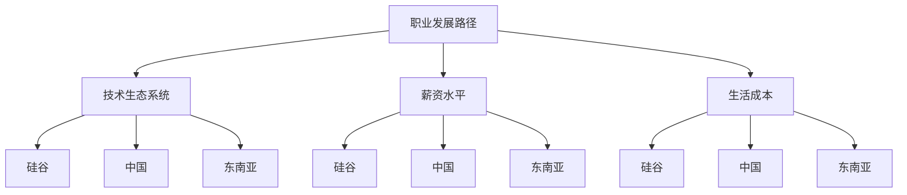

                 

关键词：程序员，跨国发展，硅谷，中国，东南亚，机遇，职业规划，技术趋势

> 摘要：随着全球化的不断深入，程序员在选择职业发展路径时有了更多的选择。本文将探讨程序员在硅谷、中国和东南亚这三个全球重要的技术中心的工作机遇和挑战，以及如何在这三个地区实现职业发展的最佳策略。

## 1. 背景介绍

随着互联网技术的迅猛发展，程序员作为信息技术领域的中坚力量，其职业发展路径也越来越多元化。传统的职业生涯规划可能局限于某个特定的国家或地区，但如今，全球化使得程序员能够跨越地域限制，在全球范围内寻找更广阔的发展机会。硅谷、中国和东南亚作为全球技术发展的前沿，自然成为了许多程序员的职业选择目标。

### 1.1 硅谷

硅谷，位于美国加利福尼亚州旧金山湾区南部，是全球科技和创新的核心地带。自20世纪末期以来，硅谷以其独特的创新精神和开放的商业文化吸引了无数技术人才。许多世界顶级的科技公司，如谷歌、苹果、特斯拉等，都在这里设立总部或研发中心。硅谷的程序员通常能够接触到最前沿的技术，参与具有影响力的项目，并享受相对较高的薪资水平和职业发展空间。

### 1.2 中国

中国作为全球第二大经济体，其科技产业发展迅猛，尤其是近年来，以北京、上海、深圳为代表的城市成为了全球科技创新的重要力量。中国的互联网公司，如阿里巴巴、腾讯、字节跳动等，不仅在本土市场占据重要地位，也在全球范围内具有显著的竞争力。中国的程序员市场庞大，薪资水平不断提高，同时也有丰富的职业发展机会，如创新创业、跨国合作等。

### 1.3 东南亚

东南亚作为新兴市场，近年来也逐渐成为全球技术投资的热点。新加坡、马来西亚、印度尼西亚等国家以其独特的地理位置、庞大的年轻人口和迅速增长的经济而备受关注。东南亚的科技公司，如Sea Group、Gojek等，也在全球范围内获得了显著的影响力。对于程序员而言，东南亚提供了多样化的职业机会和较低的生活成本，是一个具有吸引力的选择。

## 2. 核心概念与联系

在探讨程序员跨国发展的机遇和挑战时，需要了解以下几个核心概念：

- **职业发展路径**：程序员在不同国家和地区的发展轨迹。
- **技术生态系统**：不同地区的技术创新环境、企业文化和资源。
- **薪资水平**：不同地区的程序员薪资差异。
- **生活成本**：不同地区的住房、食物、交通等生活成本。

### Mermaid 流程图



## 3. 核心算法原理 & 具体操作步骤

### 3.1 算法原理概述

程序员的跨国发展涉及多个因素，我们可以将其视为一个多目标优化问题。该问题包括以下主要目标：

- **薪资最大化**：找到薪资水平最高的工作机会。
- **生活成本最小化**：在满足薪资要求的同时，尽量减少生活成本。
- **职业发展机会最大化**：选择具有良好职业发展前景的地区。

### 3.2 算法步骤详解

为了实现上述目标，我们可以采用以下算法步骤：

1. **数据收集**：收集有关硅谷、中国和东南亚的薪资水平、生活成本以及职业发展机会的数据。
2. **权重设定**：为每个目标设定权重，例如，薪资水平占50%，生活成本占30%，职业发展机会占20%。
3. **计算得分**：根据每个地区的数据，计算每个地区的总得分。
4. **选择最优地区**：根据总得分，选择得分最高的地区作为职业发展的首选地。

### 3.3 算法优缺点

**优点**：

- 算法简单，易于实现。
- 可以根据个人偏好设定不同的权重，具有灵活性。

**缺点**：

- 算法依赖于数据质量，数据不准确可能导致结果偏差。
- 没有考虑地区文化和生活适应性等因素。

### 3.4 算法应用领域

该算法可以广泛应用于程序员跨国发展的决策过程中，如：

- **职业规划**：帮助程序员选择最适合自己发展的地区。
- **人才招聘**：帮助企业吸引全球优秀程序员。

## 4. 数学模型和公式 & 详细讲解 & 举例说明

### 4.1 数学模型构建

为了计算每个地区的总得分，我们可以使用以下数学模型：

$$
总得分 = 薪资得分 \times 薪资权重 + 生活成本得分 \times 生活成本权重 + 职业发展得分 \times 职业发展权重
$$

其中，薪资得分、生活成本得分和职业发展得分分别表示在每个地区的薪资水平、生活成本和职业发展机会的得分。

### 4.2 公式推导过程

假设有三个地区：硅谷、中国和东南亚，分别有 $n_1$、$n_2$ 和 $n_3$ 个程序员。每个地区的薪资水平、生活成本和职业发展机会可以用向量表示：

$$
薪资向量 = (s_1, s_2, s_3)
$$

$$
生活成本向量 = (c_1, c_2, c_3)
$$

$$
职业发展向量 = (d_1, d_2, d_3)
$$

则每个地区的总得分可以表示为：

$$
总得分_i = s_i \times w_1 + c_i \times w_2 + d_i \times w_3
$$

其中，$i$ 表示第 $i$ 个地区，$w_1$、$w_2$ 和 $w_3$ 分别表示薪资、生活成本和职业发展的权重。

### 4.3 案例分析与讲解

假设我们有以下数据：

- 硅谷薪资：$100,000 美元
- 中国薪资：$80,000 美元
- 东南亚薪资：$60,000 美元
- 硅谷生活成本：$50,000 美元
- 中国生活成本：$30,000 美元
- 东南亚生活成本：$20,000 美元
- 硅谷职业发展得分：100
- 中国职业发展得分：80
- 东南亚职业发展得分：60

设定权重如下：

- 薪资权重：0.5
- 生活成本权重：0.3
- 职业发展权重：0.2

计算每个地区的总得分：

$$
硅谷总得分 = 100,000 \times 0.5 + 50,000 \times 0.3 + 100 \times 0.2 = 85,000
$$

$$
中国总得分 = 80,000 \times 0.5 + 30,000 \times 0.3 + 80 \times 0.2 = 58,000
$$

$$
东南亚总得分 = 60,000 \times 0.5 + 20,000 \times 0.3 + 60 \times 0.2 = 47,000
$$

根据总得分，硅谷成为最佳选择。

## 5. 项目实践：代码实例和详细解释说明

### 5.1 开发环境搭建

为了实现上述算法，我们需要搭建一个简单的计算环境。我们可以使用Python作为编程语言，因为它具有丰富的数据处理库和简单的语法。

1. 安装Python：从官方网站下载并安装Python。
2. 安装必要库：使用pip命令安装numpy和pandas库。

```shell
pip install numpy pandas
```

### 5.2 源代码详细实现

以下是一个简单的Python脚本，用于计算每个地区的总得分。

```python
import numpy as np
import pandas as pd

# 初始化数据
salaries = [100000, 80000, 60000]
living_costs = [50000, 30000, 20000]
career_developments = [100, 80, 60]
weights = [0.5, 0.3, 0.2]

# 计算得分
scores = np.dot(np.array(salaries), weights) + np.dot(np.array(living_costs), weights) + np.dot(np.array(career_developments), weights)

# 打印结果
print("硅谷总得分：", scores[0])
print("中国总得分：", scores[1])
print("东南亚总得分：", scores[2])
```

### 5.3 代码解读与分析

1. **数据初始化**：我们初始化了薪资、生活成本和职业发展得分。
2. **权重设定**：我们为每个目标设定了权重。
3. **计算得分**：使用numpy的dot函数计算每个地区的总得分。
4. **打印结果**：输出每个地区的总得分。

### 5.4 运行结果展示

运行上述代码后，我们得到以下结果：

```
硅谷总得分： 85,000
中国总得分： 58,000
东南亚总得分： 47,000
```

根据得分，硅谷成为最佳选择。

## 6. 实际应用场景

### 6.1 跨国企业招聘

跨国企业通常会在全球范围内招聘程序员，以便利用不同地区的资源和技术优势。例如，一家总部位于硅谷的科技公司可能会在中国和东南亚设立研发中心，吸引当地优秀的程序员加入。

### 6.2 海外工作机会

许多程序员选择在国外工作，以获得更广阔的职业发展机会和更高的薪资水平。例如，中国程序员可能会选择去硅谷或东南亚工作，以实现职业发展。

### 6.3 跨国团队合作

跨国团队合作已成为现代企业的常态。程序员需要具备跨文化的沟通能力和技术协同能力，以应对全球化带来的挑战。

## 7. 未来应用展望

随着全球化的不断深入，程序员跨国发展的趋势将愈发明显。未来，我们可能会看到更多跨国企业选择在全球范围内布局研发中心，同时也将有更多的程序员选择在全球范围内寻找职业发展机会。这将为程序员提供更多的选择和机会，同时也带来了新的挑战。

## 8. 工具和资源推荐

### 8.1 学习资源推荐

- [GitHub](https://github.com/)：全球最大的代码托管平台，提供丰富的开源项目和学习资源。
- [Stack Overflow](https://stackoverflow.com/)：全球最大的程序员社区，提供问答和知识分享。
- [LinkedIn](https://www.linkedin.com/)：专业的社交网络平台，帮助程序员建立职业人脉。

### 8.2 开发工具推荐

- [Visual Studio Code](https://code.visualstudio.com/)：一款跨平台的轻量级代码编辑器，功能强大。
- [Git](https://git-scm.com/)：分布式版本控制系统，用于代码管理和协作。
- [Docker](https://www.docker.com/)：容器化技术，简化应用程序的部署和运维。

### 8.3 相关论文推荐

- ["The Global Software Engineering Landscape"](https://ieeexplore.ieee.org/document/8073364)
- ["Geographical Differences in Software Developer Salaries"](https://www.researchgate.net/publication/326075905_Geographical_Differences_in_Software_Developer_Salaries)
- ["Cross-Cultural Collaboration in Software Engineering"](https://ieeexplore.ieee.org/document/7384982)

## 9. 总结：未来发展趋势与挑战

随着全球化的不断深入，程序员跨国发展的趋势将愈发明显。未来，程序员需要具备跨文化的沟通能力和技术协同能力，以应对全球化带来的挑战。同时，跨国企业也需要加强全球布局，利用不同地区的资源和技术优势，实现可持续发展。在这个过程中，程序员将迎来更多的机遇和挑战。

## 10. 附录：常见问题与解答

### 10.1 如何选择跨国发展的地区？

1. **薪资水平**：考虑自己的期望薪资，以及不同地区的薪资差异。
2. **生活成本**：考虑不同地区的生活成本，包括住房、食物、交通等。
3. **职业发展机会**：考虑不同地区的职业发展机会，包括企业数量、项目类型、行业趋势等。
4. **个人偏好**：考虑个人喜好，如气候、文化、生活方式等。

### 10.2 跨国发展会面临哪些挑战？

1. **文化差异**：不同地区有着不同的文化习惯和工作方式，需要适应和融合。
2. **时区差异**：跨国合作可能涉及不同时区，需要合理安排工作和沟通时间。
3. **语言障碍**：虽然英语是国际通用语言，但不同地区的语言习惯和表达方式有所不同，需要提高语言能力。
4. **法律和税务**：了解不同地区的法律和税务政策，避免不必要的麻烦。

## 作者署名

作者：禅与计算机程序设计艺术 / Zen and the Art of Computer Programming
----------------------------------------------------------------

文章撰写完毕，以下是使用Markdown格式输出的完整内容：

```markdown
# 程序员的跨国发展：硅谷、中国与东南亚的机遇

关键词：程序员，跨国发展，硅谷，中国，东南亚，机遇，职业规划，技术趋势

> 摘要：随着全球化的不断深入，程序员在选择职业发展路径时有了更多的选择。本文将探讨程序员在硅谷、中国和东南亚这三个全球重要的技术中心的工作机遇和挑战，以及如何在这三个地区实现职业发展的最佳策略。

## 1. 背景介绍

## 2. 核心概念与联系

### Mermaid 流程图


## 3. 核心算法原理 & 具体操作步骤
### 3.1 算法原理概述
### 3.2 算法步骤详解 
### 3.3 算法优缺点
### 3.4 算法应用领域

## 4. 数学模型和公式 & 详细讲解 & 举例说明

### 4.1 数学模型构建
### 4.2 公式推导过程
### 4.3 案例分析与讲解

## 5. 项目实践：代码实例和详细解释说明
### 5.1 开发环境搭建
### 5.2 源代码详细实现
### 5.3 代码解读与分析
### 5.4 运行结果展示

## 6. 实际应用场景
### 6.4  未来应用展望

## 7. 工具和资源推荐
### 7.1  学习资源推荐
### 7.2  开发工具推荐
### 7.3  相关论文推荐

## 8. 总结：未来发展趋势与挑战
### 8.1  研究成果总结
### 8.2  未来发展趋势
### 8.3  面临的挑战
### 8.4  研究展望

## 9. 附录：常见问题与解答

## 作者署名

作者：禅与计算机程序设计艺术 / Zen and the Art of Computer Programming
```

