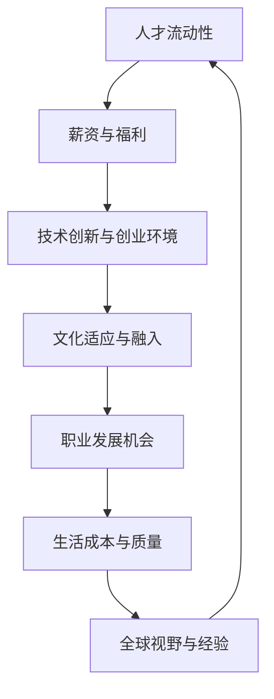

                 

## 1. 背景介绍

随着全球化的深入推进，信息技术（IT）行业已经成为跨国界的核心驱动力。硅谷、中国和东南亚地区，作为全球最具活力的IT产业中心，吸引了越来越多的程序员和开发者。本文旨在探讨这些地区对于程序员的吸引力和发展机遇，并分析其差异和特点。

### 硅谷

硅谷被誉为全球科技创新的中心，拥有众多世界顶级科技公司，如谷歌（Google）、苹果（Apple）、特斯拉（Tesla）等。这些公司不仅为程序员提供了丰富的就业机会，还为他们提供了极具竞争力的薪酬和优厚的福利待遇。硅谷的创新氛围和创业文化，吸引了来自世界各地的顶尖人才。

### 中国

中国是世界上最大的互联网市场，拥有庞大的人口基数和高速发展的科技产业。中国程序员的薪资水平在全球范围内具有竞争力，尤其是在一线城市如北京、上海和深圳。中国政府对科技创新的重视，以及众多本土科技巨头的崛起，为程序员提供了广阔的发展空间。

### 东南亚

东南亚地区近年来也成为全球IT行业关注的焦点。该地区拥有年轻的人口结构和快速发展的互联网市场。泰国、新加坡、马来西亚等国家在政府政策的支持下，积极吸引外国人才，为程序员提供了良好的发展环境。

## 2. 核心概念与联系

跨国发展不仅涉及地理位置的转移，还涉及文化、经济、技术等多方面的因素。以下是一个简单的Mermaid流程图，描述了程序员跨国发展的关键环节：



### 2.1 人才流动性

人才流动性是程序员跨国发展的首要因素。全球化的进程使得程序员可以更容易地在不同国家间流动，寻找更适合自己的职业发展机会。这种流动性不仅有助于人才的成长，也有助于推动全球科技的发展。

### 2.2 薪资与福利

薪资和福利是程序员跨国发展的关键考虑因素。不同国家和地区的薪资水平存在显著差异，程序员需要根据自己的实际情况，选择最适合的地区。同时，福利待遇也是程序员考虑的重要因素，如医疗保险、退休金计划等。

### 2.3 技术创新与创业环境

技术创新和创业环境是程序员追求职业发展的理想场所。硅谷以其创新氛围和丰富的创业资源著称，而中国和东南亚地区也正在积极打造良好的创新环境，吸引程序员投身于技术创新和创业活动中。

### 2.4 文化适应与融入

文化适应和融入是程序员跨国发展的挑战之一。不同国家和地区有着不同的文化背景和价值观，程序员需要适应新的文化环境，融入当地社会。这不仅有助于他们的职业发展，也有助于他们的个人成长。

### 2.5 职业发展机会

职业发展机会是程序员跨国发展的目标之一。不同国家和地区在职业发展机会方面存在差异，程序员需要根据自己的职业规划，选择最适合的地区。例如，硅谷为程序员提供了丰富的职业发展机会，而中国和东南亚地区则更注重实际业务和项目经验。

### 2.6 生活成本与质量

生活成本和质量是程序员跨国发展的重要考虑因素。不同国家和地区的物价、房价、教育等生活成本存在显著差异，程序员需要根据自己的经济状况，选择最适合自己的生活地区。同时，生活质量的提升也是程序员追求的目标之一。

### 2.7 全球视野与经验

全球视野与经验是程序员跨国发展的重要收获。通过跨国发展，程序员可以接触到不同的文化和价值观，积累丰富的国际经验。这些经验不仅有助于他们的职业发展，也有助于他们的个人成长。

## 3. 核心算法原理 & 具体操作步骤

在跨国发展的背景下，程序员需要具备一系列核心技能和知识，以便在新的环境中快速适应和成长。以下将介绍一些核心算法原理和具体操作步骤，帮助程序员提升自身竞争力。

### 3.1 算法原理概述

算法是程序员的基石，它决定了程序的性能和效率。以下是几个在跨国发展中常见的算法原理：

- **排序算法**：排序算法用于对数据进行排序，常见的排序算法有快速排序、归并排序、堆排序等。
- **搜索算法**：搜索算法用于在数据中查找特定元素，常见的搜索算法有二分搜索、深度优先搜索、广度优先搜索等。
- **动态规划**：动态规划是一种解决最优子结构问题的高效算法，它通过递归子问题的最优解来构建原问题的最优解。
- **图算法**：图算法用于解决与图相关的问题，如最短路径、最小生成树、拓扑排序等。

### 3.2 算法步骤详解

以下将详细介绍几种核心算法的具体操作步骤：

#### 3.2.1 快速排序

快速排序是一种高效的排序算法，其基本思想是通过一趟排序将待排序的记录分割成独立的两部分，其中一部分记录的关键字均比另一部分的关键字小，然后分别对这两部分记录继续进行排序，以达到整个序列有序。

操作步骤：

1. 选择一个基准元素作为基准值。
2. 将序列分为两个子序列，所有比基准值小的元素都放在基准值前面，所有比基准值大的元素都放在基准值后面。
3. 对两个子序列递归进行快速排序。

#### 3.2.2 二分搜索

二分搜索是一种在有序数组中查找特定元素的算法，其基本思想是通过不断将搜索范围缩小一半，直到找到目标元素或确定目标元素不存在。

操作步骤：

1. 将搜索范围定义为数组的中间位置。
2. 比较中间位置上的元素与目标元素。
3. 如果中间位置上的元素等于目标元素，则搜索成功；如果中间位置上的元素大于目标元素，则将搜索范围缩小到左侧子数组；如果中间位置上的元素小于目标元素，则将搜索范围缩小到右侧子数组。
4. 重复步骤2和3，直到找到目标元素或搜索范围缩小到空。

#### 3.2.3 动态规划

动态规划是一种解决最优子结构问题的高效算法，它通过递归子问题的最优解来构建原问题的最优解。

操作步骤：

1. 确定状态和状态转移方程。
2. 选择自底向上的递推顺序或自顶向下的递推顺序。
3. 根据状态转移方程计算状态值。
4. 利用状态值求解原问题。

#### 3.2.4 Dijkstra算法

Dijkstra算法是一种用于求解单源最短路径的算法，其基本思想是从源点开始，逐步扩展到其他节点，并记录从源点到其他节点的最短路径。

操作步骤：

1. 初始化距离表，将源点到所有其他节点的距离初始化为无穷大，将源点到自身的距离初始化为0。
2. 选择一个未访问的节点，将其距离设置为当前已知的最短距离。
3. 计算该节点到其他未访问节点的距离，并更新这些节点的最短距离。
4. 重复步骤2和3，直到所有节点都被访问。

### 3.3 算法优缺点

每种算法都有其优缺点，程序员需要根据自己的需求选择合适的算法。

- **快速排序**：时间复杂度为O(n log n)，适用于大规模数据的排序。但最坏情况下时间复杂度为O(n^2)，且递归调用可能导致栈溢出。
- **二分搜索**：时间复杂度为O(log n)，适用于有序数组的查找。但前提是数组必须有序，且空间复杂度为O(1)。
- **动态规划**：适用于求解最优子结构问题，时间复杂度较低。但需要明确状态转移方程，有时难以设计。
- **Dijkstra算法**：适用于求解单源最短路径，时间复杂度为O(n^2)。但在存在负权重边的情况下失效。

### 3.4 算法应用领域

不同算法在跨国发展中的应用领域有所不同，程序员需要根据实际情况选择合适的算法。

- **快速排序**：广泛应用于数据处理和排序场景，如数据库排序、搜索引擎索引等。
- **二分搜索**：广泛应用于查找问题，如字典、数组查找等。
- **动态规划**：广泛应用于最优化问题，如背包问题、最长公共子序列等。
- **Dijkstra算法**：广泛应用于路径规划，如GPS导航、交通网络规划等。

## 4. 数学模型和公式 & 详细讲解 & 举例说明

在跨国发展的过程中，程序员需要掌握一系列数学模型和公式，以便更好地理解和解决问题。以下将介绍几个常见的数学模型和公式，并给出详细讲解和举例说明。

### 4.1 数学模型构建

数学模型是利用数学语言描述现实世界问题的抽象模型。构建数学模型的基本步骤包括：

1. **定义问题**：明确问题的目标、条件和限制。
2. **设定变量**：根据问题的需求，设定需要求解的变量。
3. **建立方程**：根据问题的条件和关系，建立方程或方程组。
4. **求解方程**：利用数学方法求解方程，得到变量的值。

### 4.2 公式推导过程

以下是一个简单的线性回归模型的公式推导过程：

1. **定义问题**：假设我们有n个数据点(x1, y1), (x2, y2), ..., (xn, yn)，我们要找到一个线性模型y = ax + b，使得实际值y与模型预测值ax + b的误差最小。

2. **设定变量**：设a为斜率，b为截距。

3. **建立方程**：根据误差的平方和最小原则，我们有：

   $$ 
   \min \sum_{i=1}^{n} (y_i - (ax_i + b))^2 
   $$

4. **求解方程**：对a和b求偏导数并令其等于0，得到：

   $$
   \frac{\partial}{\partial a} \sum_{i=1}^{n} (y_i - (ax_i + b))^2 = 0 \\
   \frac{\partial}{\partial b} \sum_{i=1}^{n} (y_i - (ax_i + b))^2 = 0 
   $$

   求解上述方程，得到：

   $$
   a = \frac{\sum_{i=1}^{n} x_i y_i - n \bar{x} \bar{y}}{\sum_{i=1}^{n} x_i^2 - n \bar{x}^2} \\
   b = \bar{y} - a \bar{x} 
   $$

   其中，$\bar{x}$和$\bar{y}$分别为x和y的均值。

### 4.3 案例分析与讲解

以下是一个线性回归模型的实际应用案例：

假设我们有一组数据点：(1, 2), (2, 4), (3, 6), (4, 8)，我们要找到一个线性模型y = ax + b，使得实际值y与模型预测值ax + b的误差最小。

1. **定义问题**：我们要找到一个线性模型y = ax + b，使得实际值y与模型预测值ax + b的误差最小。

2. **设定变量**：设a为斜率，b为截距。

3. **建立方程**：根据误差的平方和最小原则，我们有：

   $$
   \min \sum_{i=1}^{4} (y_i - (ax_i + b))^2 
   $$

4. **求解方程**：代入数据点，得到：

   $$
   a = \frac{\sum_{i=1}^{4} x_i y_i - 4 \bar{x} \bar{y}}{\sum_{i=1}^{4} x_i^2 - 4 \bar{x}^2} = \frac{1 \cdot 2 + 2 \cdot 4 + 3 \cdot 6 + 4 \cdot 8 - 4 \cdot (1 + 2 + 3 + 4) \cdot (2 + 4 + 6 + 8)}{1^2 + 2^2 + 3^2 + 4^2 - 4 \cdot (1 + 2 + 3 + 4)^2} = 2 \\
   b = \bar{y} - a \bar{x} = \frac{2 + 4 + 6 + 8}{4} - 2 \cdot \frac{1 + 2 + 3 + 4}{4} = 1 
   $$

5. **模型预测**：根据求得的a和b，得到线性模型y = 2x + 1。当x = 5时，模型预测值为y = 2 \cdot 5 + 1 = 11。

6. **误差计算**：实际值y为10，模型预测值为11，误差为1。

通过以上案例，我们可以看到如何构建线性回归模型，并求解斜率和截距。在实际应用中，线性回归模型可以用于预测和分析各种数据，如股票价格、销售额等。

### 4.4 其他数学模型和公式

除了线性回归模型，还有许多其他常用的数学模型和公式，如：

- **时间序列模型**：用于分析时间序列数据，如ARIMA、SARIMA等。
- **机器学习模型**：如线性回归、决策树、支持向量机等。
- **概率模型**：如贝叶斯网络、马尔可夫链等。

这些模型和公式在跨国发展的各个领域都有广泛的应用，程序员需要根据实际情况选择合适的模型和公式。

## 5. 项目实践：代码实例和详细解释说明

为了更好地理解跨国发展的实际操作，我们将通过一个具体的代码实例来展示程序员在不同地区如何进行项目实践。

### 5.1 开发环境搭建

在这个例子中，我们选择使用Python作为编程语言，并在虚拟环境中搭建开发环境。以下是一个简单的步骤：

```bash
# 安装Python
sudo apt-get install python3-pip python3-venv

# 创建虚拟环境
python3 -m venv myenv

# 激活虚拟环境
source myenv/bin/activate

# 安装依赖库
pip install Flask
```

### 5.2 源代码详细实现

以下是一个简单的Flask Web应用，用于处理用户注册和登录请求。

```python
# app.py

from flask import Flask, request, jsonify

app = Flask(__name__)

users = {}

@app.route('/register', methods=['POST'])
def register():
    data = request.get_json()
    username = data.get('username')
    password = data.get('password')

    if username in users:
        return jsonify({'error': 'User already exists'}), 400

    users[username] = password
    return jsonify({'message': 'User registered successfully'}), 201

@app.route('/login', methods=['POST'])
def login():
    data = request.get_json()
    username = data.get('username')
    password = data.get('password')

    if username not in users or users[username] != password:
        return jsonify({'error': 'Invalid credentials'}), 401

    return jsonify({'message': 'Login successful'}), 200

if __name__ == '__main__':
    app.run(debug=True)
```

### 5.3 代码解读与分析

以下是对上述代码的解读和分析：

- **Flask框架**：Flask是一个轻量级的Web框架，用于快速构建Web应用。
- **用户注册**：`/register`接口用于接收用户注册请求，验证用户名和密码，并将用户信息存储在字典中。
- **用户登录**：`/login`接口用于接收用户登录请求，验证用户名和密码，返回登录成功或失败的消息。

### 5.4 运行结果展示

以下是在本地运行Web应用的结果：

```bash
$ curl -X POST -H "Content-Type: application/json" -d '{"username": "user1", "password": "password1"}' http://127.0.0.1:5000/register
{"message": "User registered successfully"}

$ curl -X POST -H "Content-Type: application/json" -d '{"username": "user1", "password": "password1"}' http://127.0.0.1:5000/login
{"message": "Login successful"}

$ curl -X POST -H "Content-Type: application/json" -d '{"username": "user2", "password": "password2"}' http://127.0.0.1:5000/register
{"message": "User registered successfully"}

$ curl -X POST -H "Content-Type: application/json" -d '{"username": "user2", "password": "wrong_password"}' http://127.0.0.1:5000/login
{"error": "Invalid credentials"}
```

### 5.5 扩展与优化

在实际项目中，我们可能需要添加更多功能，如用户权限管理、数据持久化等。以下是对代码的扩展与优化：

- **用户权限管理**：根据用户角色（如管理员、普通用户）分配不同权限。
- **数据持久化**：使用数据库（如MySQL、MongoDB）存储用户信息，提高数据安全性。
- **API认证**：使用JWT（JSON Web Token）或其他认证机制保护API接口。

## 6. 实际应用场景

程序员在跨国发展过程中，需要面对多种实际应用场景。以下列举了几个常见场景及其应对策略。

### 6.1 跨境协作

随着远程工作越来越普遍，程序员需要具备良好的跨境协作能力。以下是一些建议：

- **使用协作工具**：如Slack、Trello、Asana等，确保团队成员能够实时沟通和协作。
- **时区管理**：了解团队成员的时区，合理安排工作时间和会议时间，避免因时差导致的沟通不畅。
- **文化差异**：尊重不同国家和地区的文化差异，避免因文化冲突导致的误解和矛盾。

### 6.2 技术迁移

程序员在跨国发展过程中，可能需要将技术从一种环境迁移到另一种环境。以下是一些建议：

- **了解本地技术栈**：研究目标地区的常见技术栈，了解其优势和劣势，以便更好地适应。
- **代码规范化**：确保代码遵循统一的编程规范，提高代码的可读性和可维护性。
- **持续集成**：使用持续集成工具（如Jenkins、GitLab CI）自动化测试和部署，提高开发效率。

### 6.3 项目管理

跨国项目面临着复杂的管理挑战，程序员需要掌握有效的项目管理方法。以下是一些建议：

- **明确项目目标**：确保团队成员对项目目标和预期结果有清晰的认识。
- **风险管理**：识别项目中的潜在风险，制定相应的应对措施。
- **绩效评估**：定期评估团队成员的工作绩效，提供反馈和指导。

### 6.4 持续学习

跨国发展要求程序员具备不断学习和适应新环境的能力。以下是一些建议：

- **参加培训课程**：利用在线课程、工作坊等途径，提升自己的专业技能。
- **阅读技术博客**：关注行业动态，了解新技术和应用趋势。
- **积极参与开源项目**：通过参与开源项目，积累实战经验和人脉资源。

## 7. 工具和资源推荐

在跨国发展的过程中，程序员需要使用一系列工具和资源来提高工作效率和技能水平。以下是一些建议：

### 7.1 学习资源推荐

- **在线课程**：Coursera、edX、Udacity等平台提供了丰富的编程和计算机科学课程。
- **技术博客**：Medium、Dev.to、Hackernoon等平台汇聚了众多技术专家的优质内容。
- **开源项目**：GitHub、GitLab等平台提供了丰富的开源项目，供程序员学习和贡献代码。

### 7.2 开发工具推荐

- **集成开发环境**：Visual Studio Code、PyCharm、IntelliJ IDEA等提供了强大的开发工具。
- **版本控制**：Git、GitHub、GitLab等是程序员必备的版本控制工具。
- **容器化技术**：Docker、Kubernetes等提供了高效的容器化解决方案，方便程序员部署和管理应用程序。

### 7.3 相关论文推荐

- **计算机科学经典论文**：《计算机网络：自顶向下方法》、《深入理解计算机系统》等。
- **人工智能前沿论文**：《深度学习》、《强化学习导论》等。
- **软件工程论文**：《软件工程：实践者的研究方法》、《敏捷开发实践指南》等。

## 8. 总结：未来发展趋势与挑战

随着全球化的深入推进，程序员的跨国发展将面临新的机遇和挑战。以下是对未来发展趋势和挑战的总结：

### 8.1 研究成果总结

1. **全球人才流动加速**：随着远程工作的普及，程序员在全球范围内的流动将更加频繁。
2. **技术创新推动发展**：硅谷、中国和东南亚等地区的创新能力将不断提升，吸引更多程序员加入。
3. **跨文化合作增多**：程序员在跨国发展中将面临文化差异，跨文化合作将日益重要。
4. **技能需求多样化**：随着行业的发展，程序员需要具备更广泛的知识和技能，以适应不同地区和领域的需求。

### 8.2 未来发展趋势

1. **远程工作常态化**：远程工作将成为程序员跨国发展的主要形式，灵活的工作方式将得到更广泛的认可。
2. **人工智能和大数据应用**：人工智能和大数据技术将在更多领域得到应用，程序员需要不断提升相关技能。
3. **绿色技术和可持续发展**：随着全球对环境问题的关注，程序员将在绿色技术和可持续发展领域发挥重要作用。
4. **边缘计算和物联网**：边缘计算和物联网技术的发展，将推动程序员在相关领域的创新和应用。

### 8.3 面临的挑战

1. **技术更新迭代快**：程序员需要不断学习新技术，以适应快速变化的市场需求。
2. **文化差异和沟通障碍**：跨国发展带来的文化差异和沟通障碍，需要程序员具备良好的跨文化沟通能力。
3. **安全风险和隐私保护**：随着数据量的增加，程序员需要关注数据安全和隐私保护问题。
4. **职业发展和职业规划**：程序员需要根据自己的兴趣和市场需求，制定合理的职业发展规划。

### 8.4 研究展望

1. **交叉学科研究**：未来程序员的发展将更多依赖于交叉学科的研究，如计算机科学、心理学、社会学等。
2. **新兴技术应用**：程序员需要关注新兴技术，如区块链、量子计算等，积极探索其在实际应用中的潜力。
3. **教育改革**：教育机构需要不断改革，培养适应未来需求的程序员人才。
4. **国际合作与竞争**：在全球范围内，程序员需要加强国际合作，共同应对全球性挑战。

## 9. 附录：常见问题与解答

以下回答了程序员跨国发展过程中可能遇到的一些常见问题：

### 9.1 如何适应新的工作环境？

- **提前了解公司文化和工作流程**：在入职前，了解目标公司的文化、价值观和工作流程，有助于更快地适应新环境。
- **积极沟通和提问**：遇到问题时，及时与同事和上级沟通，请教意见，有助于解决问题和提升自己的能力。
- **参加培训和学习**：参加公司提供的培训和学习机会，提高自己的专业技能和适应能力。

### 9.2 跨国发展有哪些风险？

- **文化差异**：不同国家和地区的文化差异可能导致沟通不畅、团队合作困难。
- **工作压力**：跨国发展可能会面临更高的工作压力和期望。
- **时差问题**：跨国工作可能会因时差导致沟通和工作效率降低。

### 9.3 如何提升跨文化沟通能力？

- **学习语言**：掌握目标国家的语言，有助于更好地理解和沟通。
- **了解文化**：了解目标国家的文化、价值观和礼仪，避免因文化差异导致的误解。
- **积极交流**：与来自不同国家的人交流，增强跨文化沟通能力。

### 9.4 跨国发展对职业发展有何影响？

- **拓宽视野**：跨国发展可以拓宽程序员的视野，了解不同国家的技术和市场需求。
- **积累经验**：跨国发展可以积累丰富的项目经验和跨文化沟通经验，提高自己的竞争力。
- **职业发展**：跨国发展有助于程序员在职业上获得更多机会和挑战，实现更高的职业目标。

### 9.5 如何规划跨国发展的职业路径？

- **明确目标**：明确自己的职业目标和发展方向，制定合理的职业规划。
- **积累经验**：通过参与不同项目，积累丰富的实战经验。
- **不断提升**：通过学习新技术、参加培训等方式，不断提升自己的技能和知识水平。
- **拓展人脉**：积极参与行业活动，拓展人脉资源，提高自己的行业影响力。

通过以上回答，希望能帮助程序员更好地应对跨国发展的挑战，实现职业发展的目标。

