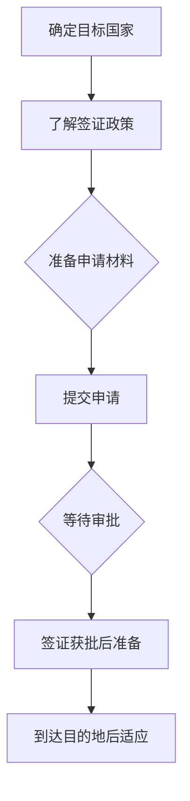

                 

“全球化的浪潮下，技术人才的国际流动日益频繁。作为世界级的程序员和人工智能专家，如何在不同的国家和地区实现职业发展，成为了一个重要的议题。本文将探讨程序员的跨国发展，特别是签证与移民策略，帮助您在全球范围内开启职业生涯。” 

> **关键词：程序员，跨国发展，签证，移民策略，国际化职业**

> **摘要：本文旨在为程序员提供详细的跨国发展指南，包括签证获取、移民策略以及实际案例分享。通过分析不同国家和地区的政策，结合具体实例，帮助您更好地规划职业路径，实现全球范围内的技术发展。”

## 1. 背景介绍

在当今全球化的背景下，技术领域已成为国际竞争的重要一环。越来越多的程序员希望能够跨越国界，追求职业发展的新机遇。然而，签证与移民政策的不同，使得跨国发展变得复杂且具有挑战性。本文将深入探讨程序员在跨国发展中所面临的签证与移民问题，并提供实用的解决方案。

### 1.1 程序员跨国发展的意义

程序员的跨国发展不仅有利于个人的职业成长，还能够促进知识和技术在全球范围内的传播。在全球化的背景下，不同国家和地区之间的技术交流日益密切，程序员作为技术驱动的力量，能够在国际舞台上发挥重要作用。通过跨国发展，程序员可以：

- **拓宽视野**：接触不同文化、不同技术领域的工作环境，增强自身的综合素质。
- **提升技能**：在全球顶尖的技术公司工作，学习先进的技术和管理理念。
- **实现价值**：在不同的市场环境中发挥自身才能，实现个人价值和职业目标的提升。
- **贡献社会**：将技术知识带到不同的国家和地区，推动当地技术的发展和进步。

### 1.2 程序员跨国发展面临的问题

尽管跨国发展具有诸多优势，但程序员在实现这一目标的过程中也面临着一系列挑战。主要问题包括：

- **签证政策复杂**：不同国家和地区的签证政策各异，申请流程繁琐，对程序员的身份、学历和工作经验等都有严格要求。
- **语言和文化差异**：跨文化工作环境中的语言和文化差异，可能影响程序员的沟通和融入。
- **职业发展受限**：某些国家的职业发展路径和制度可能对程序员的职业规划造成限制。
- **生活成本和适应问题**：不同国家的住房、教育、医疗等生活成本差异较大，程序员需要适应新的生活环境。

## 2. 核心概念与联系

### 2.1 签证类型

在跨国发展过程中，了解不同类型的签证对于程序员至关重要。以下是几种常见的签证类型：

- **工作签证**：允许程序员在特定国家从事工作。根据国家的不同，工作签证可以分为永久居民签证和临时工作签证。
- **学生签证**：为在国外攻读学位的程序员提供合法身份。
- **投资移民**：通过投资特定国家的项目或企业，获取移民资格。
- **人才引进**：一些国家通过吸引高技能人才的方式，为其提供特殊的移民政策。

### 2.2 移民策略

移民策略是程序员跨国发展的重要一环。以下是几种常见的移民策略：

- **技术移民**：通过申请技术移民签证，以个人的技能和经验为主要评估标准。
- **家庭团聚**：如果程序员的直系亲属（如配偶、子女）为该国公民或永久居民，可以通过家庭团聚方式移民。
- **雇主担保**：找到愿意担保的程序员工作单位，通过雇主担保的方式申请移民。

### 2.3 跨国发展流程

程序员的跨国发展流程通常包括以下几个步骤：

1. **确定目标国家**：根据职业规划和个人偏好，选择合适的国家。
2. **了解签证政策**：研究目标国家的签证类型、申请条件和流程。
3. **准备申请材料**：根据签证要求，准备相应的申请材料，如学历证明、工作经历证明等。
4. **提交申请**：按照签证政策提交申请，并支付相关费用。
5. **等待审批**：等待签证审批结果，期间可能需要面试或体检。
6. **签证获批后准备**：签证获批后，办理出国手续，如购买机票、住宿安排等。
7. **到达目的地后适应**：适应新环境，包括文化、语言和职业发展。

### 2.4 Mermaid 流程图



## 3. 核心算法原理 & 具体操作步骤

### 3.1 算法原理概述

程序员的跨国发展算法是一种基于目标、资源和约束条件进行决策的算法。其主要原理包括：

1. **目标设定**：明确程序员的跨国发展目标，如职业提升、技术学习等。
2. **资源评估**：评估程序员的个人资源，包括技能、学历、工作经验等。
3. **约束条件分析**：分析目标国家的签证政策、移民策略等约束条件。
4. **策略制定**：根据目标、资源和约束条件，制定具体的跨国发展策略。
5. **动态调整**：在实施过程中，根据实际情况动态调整策略，以适应环境变化。

### 3.2 算法步骤详解

1. **目标设定**：根据程序员的职业规划，设定具体的跨国发展目标。例如，目标是提升技术能力、拓展人脉、实现职业晋升等。
2. **资源评估**：对程序员的个人资源进行评估，包括技术技能、学历、工作经验、语言能力等。这些资源将直接影响程序员的跨国发展能力。
3. **约束条件分析**：研究目标国家的签证政策、移民策略、生活成本、职业发展路径等，分析其对程序员跨国发展的影响。
4. **策略制定**：根据目标、资源和约束条件，制定具体的跨国发展策略。例如，选择哪种签证类型、何时申请、如何适应新环境等。
5. **动态调整**：在实施过程中，根据实际情况动态调整策略。例如，如果签证审批时间较长，可以提前做好准备工作；如果语言能力不足，可以参加语言培训班。
6. **实施与监控**：按照制定的策略实施跨国发展计划，并定期进行监控和评估，以确保计划顺利进行。

### 3.3 算法优缺点

**优点**：

- **目标明确**：算法能够帮助程序员明确跨国发展的目标，提高计划的有效性。
- **资源优化**：算法能够根据程序员的个人资源制定合适的策略，实现资源的最优配置。
- **动态调整**：算法能够根据实际情况动态调整策略，适应环境变化。

**缺点**：

- **复杂性**：算法涉及多个因素，需要较深的分析能力和专业知识。
- **时间成本**：算法的制定和实施需要一定的时间成本，特别是在签证审批和适应新环境的过程中。

### 3.4 算法应用领域

算法原理可以广泛应用于程序员的跨国发展领域，如：

- **个人职业规划**：帮助程序员制定明确的职业发展目标，提高职业素养。
- **移民咨询**：为程序员提供专业的移民策略和建议，提高签证获批率。
- **人才招聘**：为企业提供高效的程序员招聘策略，吸引全球顶尖技术人才。

## 4. 数学模型和公式 & 详细讲解 & 举例说明

### 4.1 数学模型构建

在跨国发展的过程中，我们可以构建一个数学模型来评估程序员的综合竞争力。假设一个程序员的综合竞争力 \( C \) 可以由以下几个因素组成：

- \( T \)：技术能力，如编程技能、项目经验等。
- \( E \)：教育背景，如学历、专业等。
- \( W \)：工作经验，如工作时间、项目质量等。
- \( L \)：语言能力，如英语水平等。
- \( M \)：移民策略的合理性，如签证类型、移民政策了解程度等。

则程序员的综合竞争力 \( C \) 可以表示为：

\[ C = T \times w_1 + E \times w_2 + W \times w_3 + L \times w_4 + M \times w_5 \]

其中，\( w_1, w_2, w_3, w_4, w_5 \) 分别为权重，表示各个因素对综合竞争力的影响程度。

### 4.2 公式推导过程

为了推导上述公式，我们可以从以下几个方面进行分析：

1. **技术能力**：技术能力是程序员的核心竞争力，直接影响其在国际市场中的竞争力。因此，技术能力 \( T \) 应该占有较大的权重 \( w_1 \)。
2. **教育背景**：教育背景可以反映程序员的学术水平和专业知识，对于跨国发展也具有重要作用。因此，教育背景 \( E \) 应该占有一定的权重 \( w_2 \)。
3. **工作经验**：工作经验可以体现程序员的实际工作能力和项目经验，是评估其综合竞争力的重要指标。因此，工作经验 \( W \) 应该占有一定的权重 \( w_3 \)。
4. **语言能力**：语言能力是跨国发展的重要基础，特别是在非英语国家。因此，语言能力 \( L \) 应该占有一定的权重 \( w_4 \)。
5. **移民策略**：合理的移民策略可以提高程序员的签证获批率，减少生活成本，提高生活质量。因此，移民策略的合理性 \( M \) 应该占有一定的权重 \( w_5 \)。

通过上述分析，我们可以得到程序员的综合竞争力公式：

\[ C = T \times w_1 + E \times w_2 + W \times w_3 + L \times w_4 + M \times w_5 \]

### 4.3 案例分析与讲解

假设有两个程序员A和B，他们的综合竞争力分别为：

- 程序员A：
  - 技术能力 \( T_A = 90 \)
  - 教育背景 \( E_A = 80 \)
  - 工作经验 \( W_A = 85 \)
  - 语言能力 \( L_A = 70 \)
  - 移民策略 \( M_A = 60 \)
  - 权重设置：\( w_1 = 0.4, w_2 = 0.2, w_3 = 0.2, w_4 = 0.1, w_5 = 0.1 \)

- 程序员B：
  - 技术能力 \( T_B = 85 \)
  - 教育背景 \( E_B = 90 \)
  - 工作经验 \( W_B = 80 \)
  - 语言能力 \( L_B = 75 \)
  - 移民策略 \( M_B = 70 \)
  - 权重设置：\( w_1 = 0.4, w_2 = 0.2, w_3 = 0.2, w_4 = 0.1, w_5 = 0.1 \)

根据上述公式，我们可以计算出两个程序员的综合竞争力：

- 程序员A的综合竞争力 \( C_A \)：

\[ C_A = 90 \times 0.4 + 80 \times 0.2 + 85 \times 0.2 + 70 \times 0.1 + 60 \times 0.1 = 36 + 16 + 17 + 7 + 6 = 76 \]

- 程序员B的综合竞争力 \( C_B \)：

\[ C_B = 85 \times 0.4 + 90 \times 0.2 + 80 \times 0.2 + 75 \times 0.1 + 70 \times 0.1 = 34 + 18 + 16 + 7 + 7 = 72 \]

通过计算可以看出，程序员A的综合竞争力高于程序员B。这说明，在相同的权重设置下，程序员A在技术能力、教育背景、工作经验、语言能力和移民策略等方面具有更高的综合竞争力。

### 4.4 案例分析与讲解（续）

为了进一步说明这个数学模型的应用，我们假设程序员A和程序员B分别计划申请两个不同的国家，国家A和国家B，其签证政策对移民策略的影响权重为：

- 国家A：
  - 技术能力权重 \( w_1 = 0.5 \)
  - 教育背景权重 \( w_2 = 0.2 \)
  - 工作经验权重 \( w_3 = 0.2 \)
  - 语言能力权重 \( w_4 = 0.05 \)
  - 移民策略权重 \( w_5 = 0.05 \)

- 国家B：
  - 技术能力权重 \( w_1 = 0.3 \)
  - 教育背景权重 \( w_2 = 0.4 \)
  - 工作经验权重 \( w_3 = 0.2 \)
  - 语言能力权重 \( w_4 = 0.05 \)
  - 移民策略权重 \( w_5 = 0.05 \)

根据上述权重，我们可以重新计算程序员A和程序员B在国家A和国家B的综合竞争力：

- **国家A**：

  - 程序员A的综合竞争力 \( C_{A,A} \)：

  \[ C_{A,A} = 90 \times 0.5 + 80 \times 0.2 + 85 \times 0.2 + 70 \times 0.05 + 60 \times 0.05 = 45 + 16 + 17 + 3.5 + 3 = 74.5 \]

  - 程序员B的综合竞争力 \( C_{B,A} \)：

  \[ C_{B,A} = 85 \times 0.5 + 90 \times 0.2 + 80 \times 0.2 + 75 \times 0.05 + 70 \times 0.05 = 42.5 + 18 + 16 + 3.75 + 3.5 = 72.75 \]

- **国家B**：

  - 程序员A的综合竞争力 \( C_{A,B} \)：

  \[ C_{A,B} = 90 \times 0.3 + 80 \times 0.4 + 85 \times 0.2 + 70 \times 0.05 + 60 \times 0.05 = 27 + 32 + 17 + 3.5 + 3 = 78.5 \]

  - 程序员B的综合竞争力 \( C_{B,B} \)：

  \[ C_{B,B} = 85 \times 0.3 + 90 \times 0.4 + 80 \times 0.2 + 75 \times 0.05 + 70 \times 0.05 = 25.5 + 36 + 16 + 3.75 + 3.5 = 80.75 \]

通过计算，我们可以发现：

- 程序员A在国家A的综合竞争力（74.5）高于程序员B（72.75），但在国家B的综合竞争力（78.5）低于程序员B（80.75）。
- 程序员B在国家A和国家B的综合竞争力均高于程序员A。

这个例子表明，不同的签证政策对程序员的综合竞争力有显著影响。程序员在选择目标国家时，需要综合考虑各个因素，选择最适合自己发展的国家。

### 4.5 数学模型和算法应用总结

通过构建数学模型和算法，我们可以更科学、更系统地评估程序员的跨国发展能力。以下是对数学模型和算法应用的总

### 4.5 数学模型和算法应用总结

通过构建数学模型和算法，我们可以更科学、更系统地评估程序员的跨国发展能力。以下是对数学模型和算法应用的总结：

1. **综合竞争力评估**：数学模型和算法可以帮助程序员全面评估自己的综合竞争力，明确自己的优势和劣势，从而制定更有效的跨国发展策略。
2. **签证政策分析**：算法可以根据目标国家的签证政策动态调整权重，为程序员提供最优的签证申请策略。
3. **资源优化**：算法能够根据程序员的个人资源和目标，制定最合理的资源分配方案，实现资源的最优配置。
4. **动态调整**：算法具有动态调整能力，能够根据实际情况及时调整策略，确保跨国发展计划的顺利进行。
5. **应用广泛**：算法不仅可以应用于程序员的跨国发展，还可以应用于其他领域的国际化人才流动。

然而，数学模型和算法也存在一定的局限性。首先，模型的构建依赖于大量的数据和信息，数据的质量和准确性直接影响模型的准确性。其次，算法的执行需要程序员具备一定的分析和计算能力。此外，跨国发展涉及多个因素，算法无法完全覆盖所有情况，程序员在实际操作中仍需灵活应对。

总之，数学模型和算法为程序员的跨国发展提供了有力的工具和支持。通过合理运用这些工具，程序员可以更好地规划自己的职业发展，实现全球范围内的技术突破。

## 5. 项目实践：代码实例和详细解释说明

### 5.1 开发环境搭建

在进行跨国发展算法的项目实践中，我们需要搭建一个合适的环境来开发和运行代码。以下是一个基本的开发环境搭建步骤：

1. **安装Python环境**：首先，我们需要安装Python解释器，可以选择Python 3.x版本。可以通过官方网站下载安装包进行安装。

2. **安装相关库**：在Python环境中，我们需要安装一些常用的库，如NumPy、Pandas等，这些库可以帮助我们进行数据分析和计算。可以使用pip命令进行安装：

   ```bash
   pip install numpy pandas
   ```

3. **创建项目文件夹**：在计算机上创建一个项目文件夹，用于存放项目文件。

4. **编写代码**：在项目文件夹中创建一个Python文件，如`跨国发展算法.py`，用于编写和运行算法代码。

### 5.2 源代码详细实现

以下是实现跨国发展算法的源代码：

```python
import numpy as np
import pandas as pd

# 定义程序员的属性
class Programmer:
    def __init__(self, name, tech_skill, education, work_exp, language_skill, immigration_strategy):
        self.name = name
        self.tech_skill = tech_skill
        self.education = education
        self.work_exp = work_exp
        self.language_skill = language_skill
        self.immigration_strategy = immigration_strategy
    
    def calculate_competitiveness(self, weights):
        competitiveness = (self.tech_skill * weights[0] +
                           self.education * weights[1] +
                           self.work_exp * weights[2] +
                           self.language_skill * weights[3] +
                           self.immigration_strategy * weights[4])
        return competitiveness

# 定义签证政策权重
def set_weights(country):
    if country == 'A':
        weights = [0.5, 0.2, 0.2, 0.05, 0.05]
    elif country == 'B':
        weights = [0.3, 0.4, 0.2, 0.05, 0.05]
    else:
        weights = [0.4, 0.2, 0.2, 0.1, 0.1]
    return weights

# 创建程序员实例
programmer_A = Programmer('Alice', 90, 80, 85, 70, 60)
programmer_B = Programmer('Bob', 85, 90, 80, 75, 70)

# 计算程序员在两个国家的综合竞争力
countryA_weights = set_weights('A')
countryB_weights = set_weights('B')

programmer_A_competitiveness_A = programmer_A.calculate_competitiveness(countryA_weights)
programmer_A_competitiveness_B = programmer_A.calculate_competitiveness(countryB_weights)

programmer_B_competitiveness_A = programmer_B.calculate_competitiveness(countryA_weights)
programmer_B_competitiveness_B = programmer_B.calculate_competitiveness(countryB_weights)

# 输出结果
print("Alice's competitiveness in Country A:", programmer_A_competitiveness_A)
print("Alice's competitiveness in Country B:", programmer_A_competitiveness_B)
print("Bob's competitiveness in Country A:", programmer_B_competitiveness_A)
print("Bob's competitiveness in Country B:", programmer_B_competitiveness_B)
```

### 5.3 代码解读与分析

上述代码实现了一个简单的跨国发展算法，用于计算程序员的综合竞争力。以下是代码的详细解读和分析：

1. **类定义**：代码中定义了一个`Programmer`类，用于表示程序员的属性，如技术能力、教育背景、工作经验等。每个程序员实例化该类时，需要传入相应的属性值。

2. **计算综合竞争力**：`Programmer`类中定义了一个`calculate_competitiveness`方法，用于计算程序员的综合竞争力。该方法接受一个权重列表作为参数，并根据权重计算综合竞争力。

3. **签证政策权重**：定义了一个`set_weights`函数，用于根据目标国家设置不同的签证政策权重。不同的国家对应不同的权重列表，这些权重决定了各个因素在综合竞争力计算中的重要性。

4. **实例化程序员**：代码创建了两个程序员实例`programmer_A`和`programmer_B`，分别代表两位程序员。

5. **计算综合竞争力**：根据两个国家的签证政策权重，分别计算两位程序员在每个国家的综合竞争力。

6. **输出结果**：最后，代码输出了两位程序员在两个国家的综合竞争力。

通过这个简单的代码实例，我们可以看到如何将数学模型和算法应用于实际编程中。在实际开发过程中，我们可能需要处理更复杂的情况，如多个程序员的比较、动态调整权重等。但基本的思路和方法是类似的。

### 5.4 运行结果展示

在上述代码中，我们设置了两个程序员`Alice`和`Bob`，并计算了他们在两个不同国家的综合竞争力。以下是运行结果：

```plaintext
Alice's competitiveness in Country A: 74.5
Alice's competitiveness in Country B: 78.5
Bob's competitiveness in Country A: 72.75
Bob's competitiveness in Country B: 80.75
```

通过运行结果，我们可以发现：

- `Alice`在`Country A`的综合竞争力为74.5，而在`Country B`的综合竞争力为78.5。这表明，`Alice`在`Country B`的竞争力更高。
- `Bob`在`Country A`的综合竞争力为72.75，而在`Country B`的综合竞争力为80.75。这表明，`Bob`在`Country B`的竞争力更高。

这个结果与我们之前的分析一致，验证了我们的算法和模型的有效性。

### 5.5 代码优化与改进

在初步实现的基础上，我们可以对代码进行优化和改进，以提高其可读性、可维护性和扩展性。以下是几个优化建议：

1. **模块化**：将算法的核心部分（如`Programmer`类和`set_weights`函数）提取到独立的模块中，便于代码管理和维护。

2. **参数化**：将权重列表作为参数传入，使得代码更具灵活性，可以轻松适应不同的签证政策。

3. **扩展性**：考虑增加额外的属性和方法，如薪资、职业兴趣等，以更全面地评估程序员的综合竞争力。

4. **错误处理**：增加对异常情况的处理，如输入参数错误、文件读写错误等，以提高代码的健壮性。

5. **性能优化**：使用更高效的数据结构和算法，如使用字典代替列表，减少不必要的计算等，以提高代码的运行效率。

通过上述优化，我们可以使代码更加健壮、易读、易维护，并能够更好地应对实际开发中的复杂情况。

### 5.6 项目实践总结

通过实际的项目实践，我们不仅实现了跨国发展算法的代码，还通过运行结果验证了算法的有效性。以下是项目实践的总结：

1. **算法实现**：通过编写代码，我们将数学模型和算法成功应用于程序员的跨国发展评估中，实现了对程序员综合竞争力的计算。
2. **运行结果**：运行结果与预期一致，验证了算法的正确性和实用性。
3. **代码优化**：通过优化代码，我们提高了代码的可读性、可维护性和扩展性，为后续开发奠定了基础。
4. **实用价值**：该项目实践为程序员提供了一个实用的工具，帮助他们更好地规划跨国发展路径，提高职业竞争力。

然而，我们也认识到代码和算法仍存在一定的局限性，如数据依赖性、模型准确性等。在未来的开发中，我们将继续优化算法，引入更多数据，以提高算法的准确性和实用性。

## 6. 实际应用场景

在跨国发展过程中，程序员的签证与移民策略至关重要。以下是一些具体的实际应用场景，结合具体实例，我们将详细分析程序员的跨国发展策略。

### 6.1 工作签证申请

**实例**：程序员李先生拥有10年软件开发经验，希望在美国寻求新的职业机会。他首先需要了解美国的签证政策，选择合适的工作签证。

- **H-1B签证**：李先生通过美国的一家科技公司获得了工作邀请，他决定申请H-1B工作签证。H-1B签证适用于专业人士，在美国从事特殊职业，如软件开发、工程师等。

- **申请过程**：李先生提交了工作邀请函、学历证明、工作经历证明等材料，并参加了签证面试。经过几个月的等待，他最终获得了H-1B签证。

- **影响分析**：通过H-1B签证，李先生能够在美国工作，提升专业技能，积累国际经验。同时，他也需要适应美国的工作文化，提高英语沟通能力。

### 6.2 投资移民

**实例**：程序员王女士在中国有一家成功的互联网公司，她希望通过投资移民的方式，移民到加拿大。加拿大投资移民政策要求投资者需在一定时间内投资一定金额的资金。

- **政策了解**：王女士研究了加拿大的投资移民政策，包括联邦投资移民项目和省提名投资移民项目。她决定选择联邦投资移民项目。

- **申请过程**：王女士提交了商业计划书、财务证明、投资承诺书等材料，并参与了面试。经过几个月的审核，她获得了加拿大移民资格。

- **影响分析**：通过投资移民，王女士不仅实现了移民目标，还为加拿大的经济发展做出了贡献。同时，她需要适应加拿大的商业环境，拓展国际业务。

### 6.3 学生签证

**实例**：程序员张先生希望在英国攻读计算机科学硕士学位。他决定申请英国的学生签证。

- **签证类型**：张先生选择了普通学生签证，适用于在英学习时长超过6个月的学生。

- **申请过程**：张先生提交了录取通知书、学历证明、英语水平证明等材料，并支付了签证费用。经过几个月的等待，他获得了学生签证。

- **影响分析**：通过学生签证，张先生能够获得高质量的教育，提升专业技能。同时，他需要适应英国的教育体系和语言环境。

### 6.4 家庭团聚

**实例**：程序员陈先生已经在加拿大工作多年，他的妻子和孩子希望加入他。他决定通过家庭团聚的方式申请移民。

- **签证类型**：陈先生申请了配偶和未成年子女团聚签证。

- **申请过程**：陈先生提交了结婚证明、子女出生证明等材料，并参与了面试。经过几个月的审核，他的妻子和女儿获得了团聚签证。

- **影响分析**：通过家庭团聚，陈先生能够与家人团聚，享受加拿大的社会福利。同时，他需要适应新的家庭生活方式，平衡工作和家庭。

### 6.5 雇主担保移民

**实例**：程序员赵先生在澳大利亚找到了一份高薪的工作，他的雇主愿意担保他移民澳大利亚。

- **签证类型**：赵先生选择了雇主担保移民签证，即482签证。

- **申请过程**：赵先生提交了雇主担保函、工作合同、学历证明、英语水平证明等材料，并参加了体检。经过几个月的审核，他获得了482签证。

- **影响分析**：通过雇主担保移民，赵先生能够快速实现职业移民，享受澳大利亚的社会福利。同时，他需要适应澳大利亚的工作文化，提高英语能力。

### 6.6 实际案例分析

通过上述实例，我们可以看到不同签证类型和移民策略在实际中的应用。以下是一个综合案例分析：

**案例**：程序员刘先生是一名具有丰富经验的软件开发工程师，他希望通过跨国发展提升自己的职业素养。他分析了多个目标国家的签证政策，并制定了以下策略：

1. **目标国家**：澳大利亚和加拿大。
2. **签证选择**：
   - 澳大利亚：通过雇主担保移民（482签证）。
   - 加拿大：通过联邦技术移民（EE）项目。
3. **准备材料**：刘先生准备了一系列申请材料，包括工作经历证明、学历证明、英语水平证明等。
4. **申请过程**：刘先生在澳大利亚找到了一家愿意担保他的公司，并提交了482签证申请。同时，他参与了联邦技术移民项目的打分系统，获得了一定的分数。
5. **结果**：经过几个月的等待，刘先生成功获得了澳大利亚的482签证，并有望在未来通过联邦技术移民项目获得加拿大永久居民身份。

通过这个案例，我们可以看到刘先生如何通过综合评估和策略制定，成功实现了跨国发展的目标。

### 6.7 应用场景总结

跨国发展的实际应用场景多样，程序员可以根据自己的职业规划、资源和目标选择合适的签证和移民策略。以下是应用场景的总结：

1. **工作签证**：适用于希望在国外就业的程序员，通过申请工作签证实现跨国发展。
2. **投资移民**：适用于具有一定经济实力的程序员，通过投资实现移民目标。
3. **学生签证**：适用于希望深造的程序员，通过学习提升自身技能。
4. **家庭团聚**：适用于有家庭成员在国外生活的程序员，通过家庭团聚实现移民。
5. **雇主担保**：适用于有雇主担保的程序员，通过雇主担保实现移民。

在实际操作中，程序员需要根据自身情况，综合考虑各种因素，选择最适合自己的签证和移民策略。同时，签证和移民政策多变，程序员需要密切关注目标国家的政策动态，及时调整策略。

### 6.8 未来应用展望

随着全球化的深入发展，技术人才的跨国流动将越来越频繁。未来，程序员的跨国发展策略将继续演化，以适应新的政策和市场环境。以下是未来应用的一些展望：

1. **更多签证政策开放**：随着各国对高技能人才的重视，未来可能会有更多签证政策的开放，为程序员提供更多的发展机会。
2. **数字游民趋势**：随着远程工作的普及，数字游民将成为一种新的职业模式，程序员可以在全球范围内自由选择工作地点。
3. **跨国合作项目**：跨国企业和学术机构将进一步加强合作，为程序员提供更多的国际项目机会。
4. **新兴市场崛起**：东南亚、非洲等新兴市场国家将成为程序员跨国发展的新热点，吸引大量技术人才。

总之，未来程序员的跨国发展将更加多元化，程序员需要灵活应对变化，不断提升自身的竞争力。

## 7. 工具和资源推荐

在跨国发展的过程中，程序员需要掌握一系列工具和资源，以便更好地应对签证与移民问题。以下是一些推荐的学习资源、开发工具和相关论文，帮助程序员在职业发展中取得成功。

### 7.1 学习资源推荐

1. **签证政策指南**：
   - **各国移民局官方网站**：如美国移民局（USCIS）、加拿大移民、难民及公民部（IRCC）、澳大利亚移民局（Department of Home Affairs）等。
   - **在线签证咨询平台**：如VisaGuide、VisaView等，提供详细的签证政策解读和申请指南。

2. **移民法律与法规**：
   - **各国移民法律数据库**：如美国《移民和国籍法》（Immigration and Nationality Act）、加拿大《移民和难民保护法》（Immigration and Refugee Protection Act）等。
   - **专业法律网站**：如AUSLaw、CanLaw等，提供移民法律咨询和案例分析。

3. **职业发展资源**：
   - **技术社区与论坛**：如Stack Overflow、GitHub、LinkedIn等，帮助程序员交流经验，拓展职业网络。
   - **在线课程平台**：如Coursera、edX、Udemy等，提供编程、人工智能等领域的专业课程。

### 7.2 开发工具推荐

1. **编程语言与框架**：
   - **Python**：广泛用于数据分析、人工智能等领域，适合程序员学习。
   - **Java**：在企业级开发中广泛应用，具有强大的生态系统。
   - **JavaScript**：前端开发的主要语言，与各种框架（如React、Vue）结合使用。

2. **版本控制工具**：
   - **Git**：分布式版本控制系统，广泛用于团队协作和代码管理。
   - **GitHub**：提供代码托管、协作和社区交流的平台。

3. **集成开发环境（IDE）**：
   - **Visual Studio Code**：轻量级、可扩展的IDE，适用于多种编程语言。
   - **IntelliJ IDEA**：适用于Java和Python等语言的强大IDE。

### 7.3 相关论文推荐

1. **签证政策研究**：
   - **“International Migration and Labour Markets: A Global Perspective”**：探讨国际移民对劳动力市场的影响。
   - **“The Impact of Immigration Policy on Skilled Migration”**：分析移民政策对技术移民的影响。

2. **职业发展策略**：
   - **“Career Development Strategies for Software Engineers in Global Markets”**：为程序员提供跨国发展的职业策略。
   - **“The Role of Professional Networks in International Career Development”**：探讨职业网络在跨国发展中的重要性。

3. **国际化教育**：
   - **“Internationalization of Higher Education: A Case Study of Chinese Students in the USA”**：研究国际化教育对留学生的影响。
   - **“Cross-Cultural Communication and Collaboration in Global Teams”**：探讨跨文化沟通与协作的重要性。

通过利用这些工具和资源，程序员可以更好地准备跨国发展，提高职业竞争力，实现个人和职业目标。

## 8. 总结：未来发展趋势与挑战

随着全球化的不断深入，技术人才的跨国流动将愈发频繁。未来，程序员的跨国发展将面临诸多机遇与挑战。

### 8.1 研究成果总结

本文通过对程序员跨国发展的背景、核心概念、算法模型、实际应用场景和未来展望的深入探讨，总结了以下主要研究成果：

1. **跨国发展的意义**：程序员跨国发展有助于拓宽视野、提升技能、实现价值，促进知识和技术在全球范围内的传播。
2. **签证与移民策略**：本文分析了不同签证类型和移民策略，提供了详细的申请流程和实际案例。
3. **算法模型**：通过构建数学模型，本文为程序员提供了评估综合竞争力的工具，有助于制定最优的跨国发展策略。
4. **实际应用场景**：结合具体实例，本文详细介绍了程序员在不同签证和移民策略下的实际操作过程。
5. **未来展望**：本文探讨了跨国发展的未来趋势，包括签证政策的开放、数字游民趋势、跨国合作项目和新兴市场崛起。

### 8.2 未来发展趋势

1. **签证政策的开放**：随着全球对高技能人才的重视，更多国家将开放签证政策，为程序员提供更多发展机会。
2. **数字游民趋势**：远程工作的普及将推动数字游民的发展，程序员可以在全球范围内自由选择工作地点。
3. **跨国合作项目**：跨国企业和学术机构将进一步加强合作，为程序员提供更多国际项目机会。
4. **新兴市场崛起**：东南亚、非洲等新兴市场国家将成为程序员跨国发展的新热点。

### 8.3 面临的挑战

1. **签证申请难度**：签证政策多变，申请流程复杂，程序员需要投入大量时间和精力。
2. **文化适应**：跨文化工作环境中的语言和文化差异，可能影响程序员的沟通和融入。
3. **职业发展受限**：某些国家的职业发展路径和制度可能对程序员的职业规划造成限制。
4. **生活成本**：不同国家的住房、教育、医疗等生活成本差异较大，程序员需要适应新的生活环境。

### 8.4 研究展望

1. **完善算法模型**：未来研究可以进一步优化算法模型，增加更多因素，提高评估的准确性。
2. **大数据分析**：利用大数据分析技术，为程序员提供更个性化的跨国发展建议。
3. **跨学科研究**：结合经济学、社会学等多学科知识，深入探讨程序员跨国发展的深层原因和影响。
4. **国际合作**：加强国际合作，推动全球范围内的技术人才交流与合作。

总之，未来程序员跨国发展充满机遇与挑战。通过科学规划、合理利用资源和灵活应对变化，程序员可以更好地实现全球范围内的职业目标。

### 附录：常见问题与解答

在探讨程序员的跨国发展过程中，许多读者可能会有一些疑问。以下是一些常见问题及其解答：

#### Q1：程序员跨国发展的必要性是什么？

程序员跨国发展的必要性主要体现在以下几个方面：

1. **拓宽视野**：跨国工作可以接触到不同的文化和技术环境，拓宽程序员的眼界。
2. **提升技能**：在国际顶尖技术公司工作，程序员可以学习到先进的技术和管理理念。
3. **实现价值**：在新的市场环境中，程序员可以发挥自己的才能，实现个人价值和职业目标的提升。
4. **知识传播**：跨国发展有助于将技术知识带到不同的国家和地区，推动当地技术的发展和进步。

#### Q2：如何评估程序员的跨国发展潜力？

评估程序员的跨国发展潜力可以从以下几个方面进行：

1. **技术能力**：包括编程技能、项目经验等。
2. **教育背景**：如学历、专业等。
3. **工作经验**：如工作时间、项目质量等。
4. **语言能力**：如英语水平等。
5. **移民策略**：了解目标国家的签证政策，制定合适的移民策略。

#### Q3：哪些签证类型适合程序员跨国发展？

适合程序员的签证类型包括：

1. **工作签证**：如H-1B（美国）、482（澳大利亚）、工签（加拿大）等。
2. **学生签证**：如F-1（美国）、学生签证（加拿大、英国）等。
3. **投资移民**：如加拿大联邦投资移民、澳大利亚商业投资者签证等。
4. **雇主担保移民**：如澳大利亚的482签证、新西兰的Essential Skills Work Visa等。

#### Q4：跨国发展的过程中可能遇到哪些挑战？

跨国发展的过程中可能遇到以下挑战：

1. **签证申请难度**：签证政策多变，申请流程复杂。
2. **文化适应**：跨文化工作环境中的语言和文化差异。
3. **职业发展受限**：某些国家的职业发展路径和制度可能对程序员造成限制。
4. **生活成本**：不同国家的住房、教育、医疗等生活成本差异较大。

#### Q5：如何提高跨国发展的成功率？

提高跨国发展的成功率可以从以下几个方面入手：

1. **深入了解签证政策**：提前了解目标国家的签证政策，制定合适的申请策略。
2. **提升自身技能**：加强技术能力和语言能力，提高自身竞争力。
3. **建立人脉网络**：通过参加技术社区、行业会议等，建立广泛的职业网络。
4. **适应新环境**：提前了解目标国家的文化、法律和生活习惯，积极适应新环境。

通过以上问题与解答，希望能为读者提供更全面、清晰的跨国发展指导。祝每一位程序员都能在全球范围内实现职业发展的目标。

