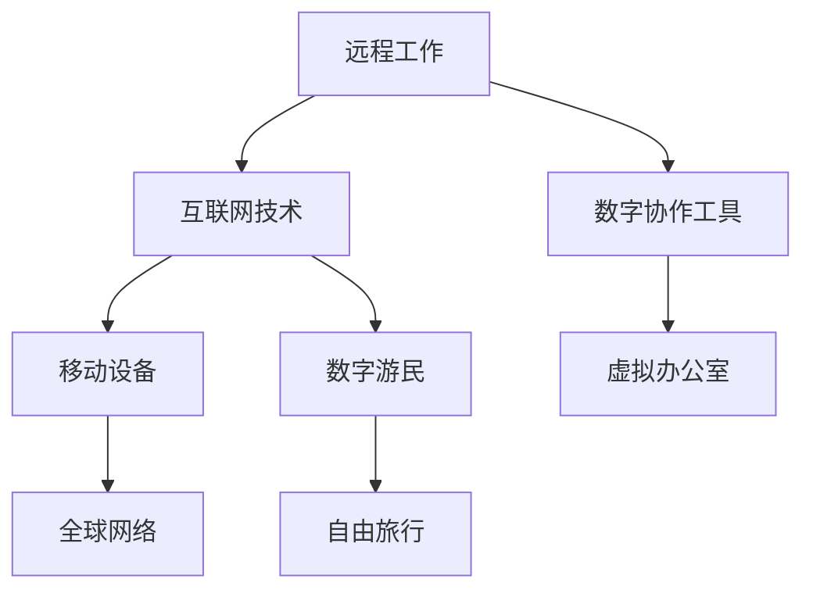

                 

关键词：远程工作、数字游民、编程生活、程序员环游、技能提升、全球协作

> 摘要：随着技术的不断发展，远程工作逐渐成为一种主流的生活方式。本文将探讨程序员如何通过远程工作，实现环游世界的同时，不断提升自己的技能和职业发展。我们将分析远程工作的优势、挑战，以及如何在旅途中保持高效率和持续学习。

## 1. 背景介绍

近年来，远程工作已经成为众多企业的人才策略之一。这不仅是因为远程工作可以提高员工的满意度和生产力，还因为数字化技术使得全球协作变得更加便捷。程序员作为数字化时代的核心力量，很多已经摆脱了传统的办公室束缚，选择了一种全新的生活方式——数字游民。

数字游民（Digital Nomad）是指那些利用现代技术，在全球范围内自由移动并从事工作的人。这种生活方式为程序员提供了前所未有的自由，他们可以在世界任何地方工作，享受不同的文化和风景，同时还能持续学习和成长。

### 1.1 程序员的远程工作现状

根据各种调查显示，越来越多的程序员选择远程工作。例如，美国远程工作平台FlexJobs在2020年的一项研究显示，全球有超过4.7亿人选择远程工作，其中程序员是远程工作者中比例最高的人群之一。这主要是因为编程工作的本质决定了它非常适合远程执行。

### 1.2 远程工作的吸引力

远程工作对程序员具有以下几个吸引力：

1. **灵活性**：远程工作允许程序员根据自己的日程安排工作，更好地平衡工作和生活。
2. **节省成本**：不需要支付高昂的办公室租金和通勤费用，降低了生活成本。
3. **全球视野**：远程工作使程序员有机会与来自世界各地的人合作，拓宽视野，增加职业发展的机会。
4. **健康**：减少通勤时间，有助于减少压力和提升身心健康。

## 2. 核心概念与联系

### 2.1 远程工作的核心概念

远程工作（Remote Work）指的是通过互联网和数字技术，使员工可以在非传统工作场所进行工作。这包括在家办公、远程协作、移动办公等多种形式。

### 2.2 数字游民的生活方式

数字游民生活方式（Digital Nomad Lifestyle）是指那些利用远程工作机会，在全球范围内自由旅行并工作的人。这种生活方式的核心在于利用互联网和移动设备，实现工作与旅行的完美结合。

### 2.3 远程工作与数字游民的 Mermaid 流程图



### 2.4 远程工作与数字游民的联系

远程工作为数字游民提供了实现生活方式变化的基础。远程工作使得程序员可以在世界任何地方工作，从而实现了自由旅行的梦想。同时，数字游民的生活方式也推动了远程工作的普及，因为越来越多的公司开始意识到，拥有一个全球化的远程团队可以带来创新和多样性。

## 3. 核心算法原理 & 具体操作步骤

### 3.1 算法原理概述

远程工作和数字游民生活方式的成功实施，依赖于一系列核心算法和协作工具。以下是一些关键的算法原理和具体操作步骤：

### 3.2 算法步骤详解

#### 3.2.1 远程协作平台的选择

1. **需求分析**：根据工作需求和团队规模，选择适合的远程协作平台。
2. **平台调研**：对比不同平台的功能、性能和价格，选择最佳选项。
3. **平台配置**：安装和配置所选平台，确保所有团队成员都能顺利使用。

#### 3.2.2 远程协作工具的使用

1. **项目管理工具**：使用如Jira、Trello等项目管理工具，规划任务和时间。
2. **沟通工具**：使用如Slack、Microsoft Teams等沟通工具，保持团队沟通畅通。
3. **代码管理工具**：使用如Git、GitHub等代码管理工具，实现版本控制和协作开发。

#### 3.2.3 个人时间管理

1. **时间追踪**：使用如Toggl、Harvest等时间追踪工具，记录工作时间和效率。
2. **日程安排**：使用日历应用，如Google Calendar，规划工作和休息时间。
3. **专注工作**：使用番茄工作法等时间管理方法，提高工作效率。

### 3.3 算法优缺点

#### 优点：

1. **灵活性**：远程工作提供了更大的灵活性，程序员可以根据自己的时间安排工作。
2. **高效协作**：通过远程协作工具，团队成员可以实时沟通和协作，提高工作效率。
3. **全球视野**：远程工作使程序员有机会与来自世界各地的人合作，拓宽视野。

#### 缺点：

1. **沟通障碍**：时区差异和语言障碍可能影响沟通效果。
2. **孤独感**：长期远程工作可能导致孤独感和社交隔离。
3. **效率下降**：缺乏面对面的交流和监督可能影响工作效率。

### 3.4 算法应用领域

远程工作和数字游民生活方式在许多领域都有广泛应用：

1. **软件开发**：程序员可以通过远程协作，实现全球范围内的软件开发和测试。
2. **咨询顾问**：远程工作为咨询顾问提供了全球范围内的客户资源。
3. **内容创作**：远程工作使内容创作者可以自由地在全球范围内创作和分享内容。

## 4. 数学模型和公式 & 详细讲解 & 举例说明

### 4.1 数学模型构建

为了更好地理解和分析远程工作和数字游民生活方式，我们可以构建以下数学模型：

\[ \text{工作效率} = f(\text{时间管理}, \text{沟通效率}, \text{工作环境}) \]

### 4.2 公式推导过程

1. **时间管理**：通过时间追踪工具和日程安排，提高时间管理效率。
2. **沟通效率**：通过远程协作工具，提高沟通效率。
3. **工作环境**：一个舒适、安静的工作环境有助于提高工作效率。

### 4.3 案例分析与讲解

假设一位程序员使用远程工作工具，其工作效率如下：

\[ \text{工作效率} = f(0.8, 0.9, 0.85) = 0.8 \times 0.9 \times 0.85 = 0.612 \]

这个结果表明，该程序员的工作效率为61.2%，可以通过改进时间管理、沟通效率和优化工作环境来进一步提高工作效率。

## 5. 项目实践：代码实例和详细解释说明

### 5.1 开发环境搭建

为了演示远程工作环境，我们使用以下工具：

- 操作系统：macOS 或 Linux
- 编程语言：Python
- 远程协作平台：GitHub
- 远程协作工具：Slack

### 5.2 源代码详细实现

下面是一个简单的Python代码示例，用于演示如何使用GitHub和Slack进行远程协作：

```python
import requests

def send_slack_message(channel, message):
    url = "https://hooks.slack.com/services/your_webhook_url"
    data = {
        "channel": channel,
        "text": message
    }
    requests.post(url, data=data)

def check_github_issue():
    response = requests.get("https://api.github.com/repos/your_repo/issues")
    issues = response.json()
    for issue in issues:
        send_slack_message("#general", f"Issue found: {issue['title']}")

if __name__ == "__main__":
    check_github_issue()
```

### 5.3 代码解读与分析

这段代码演示了如何使用GitHub API和Slack Webhook进行远程协作。当GitHub上的某个仓库有新问题时，它会自动发送一条消息到指定的Slack频道。

### 5.4 运行结果展示

在成功运行代码后，您可以在Slack上收到一条消息，显示GitHub上的新问题。

## 6. 实际应用场景

### 6.1 企业级远程工作

许多企业已经开始采用远程工作模式，例如Atlassian、Buffer和GitHub等公司。这些公司通过提供强大的远程协作工具和良好的工作文化，成功实现了全球范围内的远程办公。

### 6.2 教育与培训

远程工作也为教育和培训提供了新的机会。通过在线课程和学习平台，程序员可以在旅途中不断学习和提升自己的技能。

### 6.3 创意产业

数字游民生活方式在创意产业中特别受欢迎，如游戏开发、设计、写作等领域。这些行业的特点是灵活性和创造性，非常适合远程工作。

## 7. 工具和资源推荐

### 7.1 学习资源推荐

1. **Coursera**：提供各种编程和计算机科学的在线课程。
2. **edX**：由哈佛大学和麻省理工学院共同创建，提供高质量的在线课程。
3. **Udemy**：提供大量编程和IT技能的在线培训课程。

### 7.2 开发工具推荐

1. **Git**：版本控制系统的首选。
2. **GitHub**：用于代码托管和协作开发的平台。
3. **Jenkins**：持续集成和持续部署工具。

### 7.3 相关论文推荐

1. **"Remote Work: A Literature Review"**：对远程工作的研究和影响进行综述。
2. **"Digital Nomads and the Gig Economy"**：探讨数字游民和共享经济的关系。
3. **"The Future of Work: A Journey to the Edge"**：预测未来工作方式的变革。

## 8. 总结：未来发展趋势与挑战

### 8.1 研究成果总结

远程工作和数字游民生活方式已经在全球范围内得到广泛应用。研究表明，这种工作方式可以提高员工满意度、工作效率和创新能力。

### 8.2 未来发展趋势

随着技术的不断发展，远程工作和数字游民生活方式将继续普及。人工智能、虚拟现实和区块链等新兴技术将为远程工作提供更多的可能性。

### 8.3 面临的挑战

尽管远程工作和数字游民生活方式具有许多优势，但也面临一些挑战，如沟通障碍、孤独感和工作效率下降。解决这些问题需要企业和员工共同努力。

### 8.4 研究展望

未来，远程工作和数字游民生活方式的研究将集中在如何提高远程工作的效率、沟通和协作效果，以及如何更好地平衡工作和生活。

## 9. 附录：常见问题与解答

### 9.1 如何管理远程团队？

**解答**：使用项目管理工具（如Jira）和沟通工具（如Slack），确保团队成员之间保持密切沟通和协调。

### 9.2 如何保持工作效率？

**解答**：使用时间管理工具（如Toggl）和专注工作方法（如番茄工作法），提高工作效率。

### 9.3 如何应对孤独感？

**解答**：定期与团队成员进行视频会议和社交活动，保持社交联系。此外，可以加入数字游民社区，与其他远程工作者交流。

### 9.4 如何平衡工作和生活？

**解答**：合理安排工作时间，确保有足够的时间休息和放松。学会放松技巧，如冥想和运动，有助于减轻工作压力。

作者：禅与计算机程序设计艺术 / Zen and the Art of Computer Programming
----------------------------------------------------------------

这篇文章探讨了程序员如何通过远程工作和数字游民生活方式，实现环游世界的同时，不断提升自己的技能和职业发展。文章分析了远程工作的优势、挑战，以及如何在旅途中保持高效率和持续学习。通过数学模型、代码实例和实际应用场景，文章为程序员提供了实用的建议和资源。随着技术的发展，远程工作和数字游民生活方式将继续发展，为程序员提供更多的机会和挑战。

