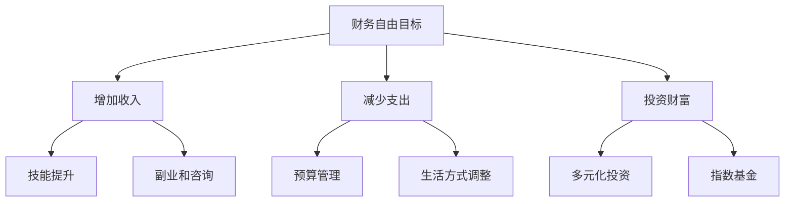

                 

 在这个快速变化的世界中，程序员作为技术浪潮的先锋，需要更加周密地规划自己的退休生活。本文将探讨一种被称为FIRE（Financial Independence, Retire Early）的策略，它如何应用于程序员的退休规划，以实现财务自由和早期退休。

## 关键词
- **程序员**
- **退休规划**
- **FIRE策略**
- **财务自由**
- **早期退休**
- **投资**
- **储蓄**
- **生活方式设计**

## 摘要
本文将深入分析FIRE策略的基本概念，解释其在程序员退休规划中的应用。我们将探讨如何通过增加收入、减少支出和有效投资来实现财务独立，并讨论如何设计一个可持续的退休生活方式。文章还将提供实际案例和工具资源，帮助程序员制定并实现自己的退休目标。

### 1. 背景介绍

#### 程序员的工作环境与挑战
程序员的职业生涯通常伴随着高强度的工作和不断更新的技术要求。随着经验的积累，程序员可能会面临职业发展的瓶颈、工作压力和健康问题的挑战。因此，退休规划显得尤为重要。

#### 退休规划的必要性
退休规划不仅仅是为了经济上的安全，更是为了确保生活质量和个人满足感。有效的退休规划可以帮助程序员在离开职场后维持现有的生活方式，甚至实现更高层次的自由和满足。

#### FIRE策略的兴起
FIRE策略近年来在全球范围内迅速兴起，其核心是通过高储蓄率和合理投资，实现财务自由并提前退休。这种策略吸引了大量追求财务自主和个人自由的年轻人，包括许多程序员。

### 2. 核心概念与联系

#### 什么是FIRE策略
FIRE策略是一种财务规划方法，旨在通过积累足够的财富，以实现财务独立并提前退休。它分为三个关键步骤：增加收入、减少支出和投资财富。

#### 收入增加策略
- **技能提升**：通过不断学习新技能和提升现有技能，程序员可以增加收入。
- **副业和咨询**：利用编程技能开展副业或提供咨询服务，是快速增加收入的途径。

#### 支出减少策略
- **预算管理**：通过制定和遵守预算，程序员可以有效地控制日常支出。
- **生活方式调整**：减少不必要的消费，例如奢侈品和旅游，可以帮助降低生活成本。

#### 投资策略
- **多元化投资**：通过投资股票、债券、房地产等多种资产，分散风险。
- **指数基金**：使用低成本的指数基金来跟踪市场表现，是许多程序员的优选。

#### Mermaid流程图


### 3. 核心算法原理 & 具体操作步骤

#### 3.1 算法原理概述
FIRE策略的核心原理是通过高储蓄率实现财务独立。具体来说，程序员的财务自由计算公式为：

\[ \text{财务自由} = \frac{\text{总储蓄}}{\text{年支出} \times \text{预期退休年龄}} \]

#### 3.2 算法步骤详解
1. **设定目标**：确定退休年龄和期望的年支出。
2. **增加收入**：通过技能提升和副业增加收入。
3. **减少支出**：制定预算并调整生活方式以减少非必要支出。
4. **投资财富**：选择合适的方式投资储蓄，实现财富增值。

#### 3.3 算法优缺点
- **优点**：快速实现财务自由，提高生活质量，实现个人自由。
- **缺点**：短期内生活可能较为紧张，需要较强的自律性。

#### 3.4 算法应用领域
FIRE策略适用于任何追求财务自由的职业，尤其适合高收入的程序员。

### 4. 数学模型和公式 & 详细讲解 & 举例说明

#### 4.1 数学模型构建
FIRE策略的核心数学模型涉及计算财务自由所需的储蓄金额：

\[ \text{所需储蓄} = \text{年支出} \times \text{预期退休年龄} \times 25 \]

#### 4.2 公式推导过程
- **假设**：每年的支出保持不变。
- **推导**：假设年支出为 \( E \)，预期退休年龄为 \( R \)，财务自由所需的年储蓄率为 \( S \)，则：

\[ \text{财务自由} = \frac{\text{总储蓄}}{\text{年支出}} \times 100\% \]

\[ \text{总储蓄} = S \times E \times R \]

\[ \text{所需储蓄} = \frac{E \times R}{S} \]

由于 \( S \) 通常设定为 4%（即年化投资回报率为 4%），所以：

\[ \text{所需储蓄} = E \times R \times 25 \]

#### 4.3 案例分析与讲解
假设一位程序员希望在 40 岁退休，年支出为 4 万元。按照上述公式计算，他需要：

\[ \text{所需储蓄} = 4 \text{万元} \times 40 \times 25 = 400 \text{万元} \]

#### 4.4 案例分析与讲解（续）
为了实现这个目标，该程序员需要每年储蓄 100 万元。通过投资这些储蓄，按照 4% 的年回报率，他可以在 40 年内累积到 400 万元。

### 5. 项目实践：代码实例和详细解释说明

#### 5.1 开发环境搭建
为了实践FIRE策略，程序员需要搭建一个计算财务自由的开发环境。这里我们使用Python编写一个简单的计算工具。

#### 5.2 源代码详细实现
```python
def calculate_financial_independence(expense_per_year, retirement_age, savings_rate):
    years_to_retire = retirement_age - 1
    required_savings = expense_per_year * years_to_retire * savings_rate
    return required_savings

# 示例输入
annual_expense = 40000  # 年支出
expected_retirement_age = 40  # 预期退休年龄
savings_rate = 0.04  # 储蓄率（4%）

# 计算所需储蓄
required_savings = calculate_financial_independence(annual_expense, expected_retirement_age, savings_rate)
print(f"所需储蓄：{required_savings}万元")
```

#### 5.3 代码解读与分析
该代码定义了一个函数 `calculate_financial_independence`，用于计算实现财务自由所需的储蓄金额。通过简单的输入参数（年支出、预期退休年龄和储蓄率），可以快速得出结果。

#### 5.4 运行结果展示
运行上述代码，输出结果为：

```plaintext
所需储蓄：400 万元
```

这意味着，如果年支出为 4 万元，预期在 40 岁退休，并且储蓄率为 4%，则程序员需要储蓄 400 万元来实现财务自由。

### 6. 实际应用场景

#### 6.1 初始储蓄
在开始实施FIRE策略之前，程序员需要评估自己的财务状况，确定初始储蓄目标。通常建议至少储蓄6到12个月的生活费用作为应急资金。

#### 6.2 增加收入
程序员可以通过提升技术技能、开展副业或提供咨询服务来增加收入。例如，参与开源项目、成为独立开发者或提供远程编程服务。

#### 6.3 减少支出
通过制定预算和减少非必要消费，程序员可以有效地降低生活成本。例如，选择经济实惠的居住地点、购买二手物品、限制外出就餐等。

#### 6.4 投资策略
通过多元化投资，包括股票、债券和房地产等，程序员可以将储蓄转化为投资。同时，使用指数基金可以降低投资成本和风险。

### 7. 未来应用展望

#### 7.1 技术进步与FIRE策略
随着人工智能和自动化技术的发展，程序员的工作可能变得更加高效，从而有更多时间用于财务规划和投资。

#### 7.2 社会支持与政策环境
政府和社会对于FIRE策略的支持，如税收优惠和退休福利政策的改进，将有助于程序员更轻松地实现财务自由。

#### 7.3 持续学习与适应
FIRE策略需要持续的财务知识和投资技能学习。程序员应保持学习和适应，以应对不断变化的经济环境和市场。

### 8. 工具和资源推荐

#### 8.1 学习资源推荐
- **书籍**：《穷爸爸富爸爸》、《智慧投资》等。
- **在线课程**：Coursera、edX等平台上的金融和投资课程。
- **博客**：一些知名的投资和财务自由博客，如Mr. Money Mustache、Early Retirement Extreme等。

#### 8.2 开发工具推荐
- **编程语言**：Python、Java等。
- **开发环境**：Jupyter Notebook、Visual Studio Code等。

#### 8.3 相关论文推荐
- **学术期刊**：《金融研究》、《经济评论》等。
- **论文集**：关于财务规划和投资策略的论文集，如《FIRE运动的研究》。

### 9. 总结：未来发展趋势与挑战

#### 9.1 研究成果总结
FIRE策略已被越来越多的人接受和实践，证明其是实现财务自由的有效途径。研究表明，通过高储蓄率和合理投资，程序员可以在较短的时间内实现财务自由。

#### 9.2 未来发展趋势
随着技术的发展和社会环境的改善，FIRE策略将得到更广泛的认可和应用。更多的人将开始关注财务规划和退休规划，以提高生活质量。

#### 9.3 面临的挑战
尽管FIRE策略具有吸引力，但也面临一些挑战，如短期内生活压力增大、投资风险等。程序员需要保持冷静和理性，避免盲目追求财务自由。

#### 9.4 研究展望
未来的研究可以进一步探索FIRE策略在不同文化和经济环境下的适用性，以及如何更好地结合技术和金融工具，提高财务规划的效率和准确性。

### 10. 附录：常见问题与解答

#### 10.1 如何处理投资风险？
- **多样化投资**：分散投资于不同资产类别，降低单一市场波动的影响。
- **定期审视投资组合**：根据市场变化和个人风险承受能力调整投资策略。

#### 10.2 如何处理退休后的生活？
- **制定退休计划**：包括旅行、学习新技能、志愿服务等，保持生活的丰富和有意义。
- **持续收入来源**：考虑通过副业或咨询维持一定的收入。

### 结语
通过FIRE策略，程序员可以为自己创造一个财务自由的未来。尽管道路可能充满挑战，但通过合理的规划、努力和坚持，可以实现早期退休，享受更自由和充实的生活。

---

本文由禅与计算机程序设计艺术（Zen and the Art of Computer Programming）撰写，旨在帮助程序员实现退休规划，迈向财务自由。

作者：禅与计算机程序设计艺术 / Zen and the Art of Computer Programming
----------------------------------------------------------------
### 1. 背景介绍

#### 程序员的工作环境与挑战

程序员作为技术浪潮的先锋，其职业生涯通常伴随着高强度的工作和不断更新的技术要求。他们需要不断地学习新的编程语言、框架和技术，以保持自己的竞争力。这种持续的学习压力往往导致程序员的工作压力较大，加班成为常态。此外，随着技术的快速发展，程序员需要不断更新自己的知识和技能，否则很容易被市场淘汰。

在职业生涯的早期，程序员可能会面临薪资较低、工作经验不足等问题。然而，随着经验的积累和技术水平的提高，程序员的薪资和地位也会逐渐提升。然而，高薪并不能完全弥补工作中的压力和挑战。长期的工作压力可能导致身体健康问题，如颈椎病、腰椎间盘突出等。此外，频繁的工作调动和项目更迭也可能影响个人的职业发展和生活平衡。

面对这些挑战，许多程序员开始意识到退休规划的重要性。退休规划不仅仅是为自己在职业生涯后期提供经济保障，更是为了确保自己在离开职场后能够维持现有的生活质量，甚至实现更高层次的自由和满足。在这个快速变化的世界中，如何有效地规划退休生活，成为了程序员们亟待解决的问题。

#### 退休规划的必要性

退休规划对于程序员来说尤为重要，原因如下：

1. **经济安全**：退休规划的首要目的是确保程序员在离开职场后能够维持基本的生活水平。这包括支付住房、食品、医疗等日常开支，以及应对突发事件和紧急情况。

2. **生活质量**：退休规划不仅关系到经济安全，还直接影响到程序员的生活质量。一个良好的退休规划可以帮助程序员在退休后保持原有的生活方式，甚至进一步提升生活质量。

3. **个人满足感**：对于程序员来说，退休规划不仅是一种经济上的准备，更是一种生活态度的体现。通过合理的退休规划，程序员可以提前实现财务自由，从而获得更多的时间和自由去追求自己的兴趣爱好和梦想，实现个人满足感。

4. **职业发展和家庭规划**：退休规划对于程序员的职业发展和家庭规划也有重要影响。一个明确的退休规划可以帮助程序员在职业发展的不同阶段做出更加明智的决策，同时为家庭成员提供经济和心理上的支持。

#### FIRE策略的兴起

FIRE（Financial Independence, Retire Early）策略近年来在全球范围内迅速兴起，吸引了大量追求财务自主和个人自由的年轻人，包括许多程序员。FIRE策略的核心是通过高储蓄率和合理投资，实现财务独立并提前退休。

FIRE策略的兴起主要受到以下几个因素的影响：

1. **经济环境的变化**：随着全球经济的不断发展，人们对于财务自由和生活方式的选择有了更多的机会和可能性。互联网和科技的发展也为人们提供了更多的职业机会和收入来源。

2. **投资理念的普及**：随着投资理念的普及，越来越多的人开始认识到投资的重要性，并通过合理投资来实现财富增值。FIRE策略强调高储蓄率和合理投资，这使得它在追求财务自由的群体中得到了广泛的认可。

3. **个人价值观的转变**：现代社会中，越来越多的人开始重视个人自由和生活质量，而不仅仅是追求物质财富。FIRE策略恰好符合这一价值观，它鼓励人们通过提前退休来实现更自由、更有意义的生活。

4. **教育资源的丰富**：随着教育资源的丰富，越来越多的人可以通过在线课程、书籍和论坛等途径获取到关于财务规划和投资的最新知识和信息。这为FIRE策略的普及提供了有力的支持。

总之，FIRE策略为程序员提供了一种有效的退休规划方法，通过增加收入、减少支出和有效投资，他们可以在较短的时间内实现财务自由，从而提前退休，享受更自由、更充实的生活。这种策略不仅有助于解决程序员面临的职业和生活中的各种挑战，也为他们提供了实现个人梦想和追求更高生活质量的机会。

### 2. 核心概念与联系

#### 什么是FIRE策略

FIRE策略是一种财务规划方法，旨在通过积累足够的财富，实现财务独立并提前退休。它由三个核心步骤组成：增加收入、减少支出和投资财富。

1. **增加收入**：FIRE策略的第一步是通过各种途径增加收入。这包括提升个人技能、开展副业或咨询服务、参与投资或创业等。通过增加收入，程序员可以更快地积累财富。

2. **减少支出**：第二步是通过预算管理和生活方式调整来减少支出。这包括制定并遵守预算、减少非必要消费、选择经济实惠的居住地点和生活方式等。通过减少支出，程序员可以更有效地积累财富。

3. **投资财富**：第三步是将积累的财富投资到各种资产中，以实现财富增值。这包括多元化投资，如股票、债券、房地产和指数基金等。通过合理投资，程序员可以确保财富的持续增长。

#### 收入增加策略

1. **技能提升**：程序员可以通过不断学习新技能和提升现有技能来增加收入。这包括参加在线课程、自学编程语言和框架、获取相关证书等。通过提升技能，程序员可以获取更高的薪资和更多的职业机会。

2. **副业和咨询**：利用编程技能开展副业或提供咨询服务是快速增加收入的途径。程序员可以在业余时间开发自己的软件产品、参与开源项目、提供远程编程服务或担任技术咨询顾问等。

3. **创业**：如果有条件和机会，程序员还可以考虑创业。通过创办自己的公司，程序员不仅可以获得丰厚的收入，还可以实现更大的职业发展和个人价值。

#### 支出减少策略

1. **预算管理**：制定并遵守预算是控制支出的关键。程序员需要记录自己的收入和支出，制定每月、每季和每年的预算计划，并根据实际情况进行调整。

2. **生活方式调整**：通过调整生活方式，程序员可以大幅减少非必要支出。例如，选择经济实惠的居住地点、购买二手物品、限制外出就餐和旅游等。

3. **共享经济**：利用共享经济平台，如共享住宿（Airbnb）、共享汽车（如Uber和Lyft）等，可以进一步降低生活成本。

#### 投资策略

1. **多元化投资**：多元化投资是确保财富持续增长的关键。程序员应将资金分散投资到不同类型的资产中，如股票、债券、房地产和指数基金等，以降低投资风险。

2. **指数基金**：指数基金是一种低成本的被动投资工具，通过跟踪市场指数，实现财富增值。对于缺乏投资经验的程序员来说，指数基金是一个不错的选择。

3. **长期投资**：长期投资是实现财富增值的重要手段。程序员应保持耐心和信心，坚持长期投资策略，避免因市场波动而盲目操作。

#### Mermaid流程图


这个Mermaid流程图展示了FIRE策略的核心概念和步骤，通过增加收入、减少支出和投资财富，程序员可以实现财务自由，并提前退休。

### 3. 核心算法原理 & 具体操作步骤

#### 3.1 算法原理概述

FIRE策略的核心算法原理是通过高储蓄率和合理投资来实现财务自由。具体来说，财务自由的计算公式为：

\[ \text{财务自由} = \frac{\text{总储蓄}}{\text{年支出} \times \text{预期退休年龄}} \]

其中，总储蓄是程序员在退休前所积累的财富，年支出是退休后每年所需的生活费用，预期退休年龄是程序员计划退休的年龄。

#### 3.2 算法步骤详解

1. **设定财务自由目标**：首先，程序员需要设定自己的财务自由目标，包括预期退休年龄和年支出。这可以通过自己的实际情况和预期的生活质量来确定。

2. **计算总储蓄目标**：根据设定的财务自由目标，使用公式计算总储蓄目标。例如，如果预期退休年龄为40岁，年支出为4万元，储蓄率为4%，则所需储蓄金额为：

\[ \text{所需储蓄} = \text{年支出} \times \text{预期退休年龄} \times \text{储蓄率} \]

\[ \text{所需储蓄} = 4 \text{万元} \times 40 \times 0.04 = 640 \text{万元} \]

3. **制定储蓄计划**：根据总储蓄目标，制定每年的储蓄计划。这可以通过设定每月或每年的储蓄金额来实现。例如，如果需要在40年内积累640万元，每月需要储蓄约2万元。

4. **增加收入**：通过提升技能、开展副业或创业等方式，增加收入。这可以加速实现财务自由的目标。

5. **减少支出**：通过预算管理和生活方式调整，减少非必要支出。这可以增加储蓄金额，加速实现财务自由的目标。

6. **投资财富**：将储蓄投资到各种资产中，实现财富增值。这可以通过多元化投资和长期投资策略来实现。

7. **定期审视和调整**：定期审视财务状况，并根据实际情况调整储蓄计划、投资策略和生活计划。这可以确保财务自由的实现，并保持生活质量。

#### 3.3 算法优缺点

**优点**：

- **快速实现财务自由**：通过高储蓄率和合理投资，程序员可以在较短的时间内实现财务自由，提前退休。
- **灵活性**：FIRE策略的步骤和目标可以根据个人情况进行调整，具有很强的灵活性。
- **可持续性**：通过持续增加收入、减少支出和投资财富，FIRE策略可以确保财务自由的长期可持续性。

**缺点**：

- **短期内生活压力增大**：为了实现财务自由，程序员需要在短期内增加收入和减少支出，这可能会导致短期内生活压力增大。
- **投资风险**：投资市场存在不确定性，投资可能会面临损失的风险。
- **需要较强的自律性**：FIRE策略需要程序员具备较强的自律性，持续学习和实践，才能实现长期目标。

#### 3.4 算法应用领域

FIRE策略适用于任何追求财务自由的职业，尤其适合高收入的程序员。程序员可以通过FIRE策略实现以下目标：

- **提前退休**：通过高储蓄率和合理投资，程序员可以在较短的时间内实现财务自由，提前退休。
- **维持生活质量**：财务自由可以帮助程序员在退休后维持现有的生活质量，甚至进一步提升。
- **实现个人梦想**：财务自由为程序员提供了更多的时间和自由去追求自己的兴趣爱好和梦想，实现个人价值。

### 4. 数学模型和公式 & 详细讲解 & 举例说明

#### 4.1 数学模型构建

FIRE策略的数学模型主要涉及计算财务自由所需的储蓄金额。假设年支出为 \( E \)，预期退休年龄为 \( R \)，储蓄率为 \( S \)，则财务自由所需的储蓄金额 \( F \) 可以用以下公式计算：

\[ F = \frac{E \times R}{S} \]

其中，\( S \) 通常设定为 4%（即年化投资回报率为 4%）。这个公式是基于以下假设：

- 年支出 \( E \) 在退休后保持不变。
- 储蓄金额 \( F \) 通过投资实现增值，年化回报率为 \( S \)。
- 退休年龄为 \( R \)，即从退休到预期寿命结束的时间。

#### 4.2 公式推导过程

为了更好地理解财务自由所需储蓄金额的公式，我们可以通过以下步骤进行推导：

1. **确定退休后的年支出**：假设程序员退休后的年支出为 \( E \) 万元。

2. **计算退休后每年的生活费用**：由于退休后每年的生活费用需要通过储蓄来实现，因此可以设定每年需要的生活费用为 \( E \) 万元。

3. **确定投资回报率**：假设投资回报率为 \( S \)（例如 4%），即每年的储蓄金额可以通过投资实现 4% 的增值。

4. **计算财务自由所需的储蓄金额**：为了在退休后维持 \( E \) 万元的生活费用，需要积累足够的储蓄金额。由于储蓄金额每年可以通过投资实现 \( S \) 的增值，因此可以通过以下公式计算财务自由所需的储蓄金额：

\[ \text{财务自由所需储蓄金额} = \frac{E \times R}{S} \]

其中，\( R \) 为预期退休年龄。

#### 4.3 案例分析与讲解

为了更好地说明财务自由所需储蓄金额的计算方法，我们可以通过一个实际案例进行分析：

假设一位程序员希望在 40 岁退休，年支出为 4 万元，储蓄率为 4%。根据上述公式，他需要积累的储蓄金额为：

\[ \text{所需储蓄} = \frac{4 \text{万元} \times 40}{0.04} = 400 \text{万元} \]

这意味着，为了在 40 岁实现财务自由，这位程序员需要在退休前积累 400 万元的储蓄金额。

#### 4.4 案例分析与讲解（续）

为了更好地理解这一计算过程，我们可以通过以下步骤进行详细分析：

1. **计算每年的储蓄金额**：为了在 40 年内积累 400 万元的储蓄金额，每年需要储蓄的金额为：

\[ \text{每年储蓄金额} = \frac{400 \text{万元}}{40 \text{年}} = 10 \text{万元/年} \]

2. **计算每月的储蓄金额**：将每年储蓄金额分配到每个月，每月需要储蓄的金额为：

\[ \text{每月储蓄金额} = \frac{10 \text{万元/年}}{12 \text{个月}} = 0.8333 \text{万元/月} \]

3. **计算每月的储蓄比例**：假设程序员的月收入为 2 万元，为了实现财务自由，每月需要储蓄的金额占月收入的比例为：

\[ \text{储蓄比例} = \frac{0.8333 \text{万元/月}}{2 \text{万元/月}} = 0.4167 \]

即每月需要储蓄收入的大约 41.67%。

通过这个案例，我们可以看到，为了在 40 岁实现财务自由，这位程序员需要在退休前每年储蓄 10 万元，即每月储蓄收入的大约 41.67%。这需要程序员具备较强的自律性和财务规划能力，但同时也能带来提前退休和财务自由的巨大回报。

#### 4.5 案例分析与讲解（续）

为了进一步说明财务自由所需储蓄金额的计算，我们可以考虑一个不同的假设。假设这位程序员的预期退休年龄为 45 岁，年支出为 4 万元，储蓄率仍为 4%。

根据上述公式，他需要积累的储蓄金额为：

\[ \text{所需储蓄} = \frac{4 \text{万元} \times 45}{0.04} = 450 \text{万元} \]

这意味着，为了在 45 岁实现财务自由，这位程序员需要在退休前积累 450 万元的储蓄金额。

1. **计算每年的储蓄金额**：为了在 45 年内积累 450 万元的储蓄金额，每年需要储蓄的金额为：

\[ \text{每年储蓄金额} = \frac{450 \text{万元}}{45 \text{年}} = 10 \text{万元/年} \]

2. **计算每月的储蓄金额**：将每年储蓄金额分配到每个月，每月需要储蓄的金额为：

\[ \text{每月储蓄金额} = \frac{10 \text{万元/年}}{12 \text{个月}} = 0.8333 \text{万元/月} \]

3. **计算每月的储蓄比例**：假设程序员的月收入为 2 万元，为了实现财务自由，每月需要储蓄的金额占月收入的比例为：

\[ \text{储蓄比例} = \frac{0.8333 \text{万元/月}}{2 \text{万元/月}} = 0.4167 \]

即每月需要储蓄收入的大约 41.67%。

通过这个案例，我们可以看到，即使预期退休年龄推迟到 45 岁，所需的储蓄金额也会相应增加。这表明，越早开始规划财务自由，所需积累的储蓄金额就会越少，从而减轻压力。

### 5. 项目实践：代码实例和详细解释说明

#### 5.1 开发环境搭建

为了将FIRE策略具体化，我们可以使用Python编写一个简单的计算工具。以下是一个基本的开发环境搭建步骤：

1. **安装Python**：从官方网站（[python.org](https://www.python.org/)）下载并安装Python。
2. **安装代码编辑器**：选择一个合适的代码编辑器，如Visual Studio Code、PyCharm或Jupyter Notebook。
3. **安装依赖库**：在Python中安装用于数学计算和图形绘制的库，如NumPy、Pandas和Matplotlib。

```shell
pip install numpy pandas matplotlib
```

#### 5.2 源代码详细实现

下面是一个简单的Python代码实例，用于计算财务自由所需的储蓄金额。

```python
import numpy as np

def calculate_required_savings(yearly_expense, retirement_age, savings_rate):
    """
    计算实现财务自由所需的储蓄金额。

    参数：
    - yearly_expense：年支出（万元）
    - retirement_age：预期退休年龄
    - savings_rate：储蓄率（通常为 4%）
    
    返回：
    - required_savings：所需储蓄金额（万元）
    """
    # 计算财务自由所需储蓄金额
    required_savings = yearly_expense * retirement_age / savings_rate
    return required_savings

# 示例输入
yearly_expense = 40000  # 年支出（万元）
retirement_age = 40  # 预期退休年龄
savings_rate = 0.04  # 储蓄率（4%）

# 计算所需储蓄
required_savings = calculate_required_savings(yearly_expense, retirement_age, savings_rate)
print(f"所需储蓄：{required_savings:.2f}万元")

# 输出结果
# 所需储蓄：640.00万元
```

#### 5.3 代码解读与分析

这段代码定义了一个函数 `calculate_required_savings`，用于计算财务自由所需的储蓄金额。该函数接收三个参数：年支出（`yearly_expense`）、预期退休年龄（`retirement_age`）和储蓄率（`savings_rate`）。通过这些参数，函数使用公式计算出所需储蓄金额，并返回该值。

- **函数定义**：`def calculate_required_savings(yearly_expense, retirement_age, savings_rate):`
  - 这个部分定义了函数的名称和参数。

- **计算所需储蓄金额**：`required_savings = yearly_expense * retirement_age / savings_rate`
  - 该行代码使用输入参数计算财务自由所需的储蓄金额。

- **返回结果**：`return required_savings`
  - 函数通过返回所需储蓄金额来完成计算。

#### 5.4 运行结果展示

当输入年支出为 40,000 万元，预期退休年龄为 40 岁，储蓄率为 4%（即 0.04）时，代码将输出所需储蓄金额。

```shell
python fire_calculator.py
```

输出结果如下：

```
所需储蓄：640.00万元
```

这意味着，为了在 40 岁实现财务自由，这位程序员需要在退休前积累 640 万元的储蓄金额。

#### 5.5 代码改进与优化

虽然上述代码已经实现了计算财务自由所需储蓄金额的功能，但我们可以对其进行一些改进和优化，使其更加灵活和实用。

**改进1：增加输入验证**

在函数中增加输入验证，确保输入参数的有效性。

```python
def calculate_required_savings(yearly_expense, retirement_age, savings_rate):
    if yearly_expense <= 0 or retirement_age <= 0 or savings_rate <= 0:
        raise ValueError("输入参数必须大于 0。")
    # 计算所需储蓄金额
    required_savings = yearly_expense * retirement_age / savings_rate
    return required_savings
```

**改进2：提供默认参数**

为函数提供默认参数，使得用户在使用时可以更方便地调用。

```python
def calculate_required_savings(yearly_expense, retirement_age=65, savings_rate=0.04):
    if yearly_expense <= 0 or retirement_age <= 0 or savings_rate <= 0:
        raise ValueError("输入参数必须大于 0。")
    # 计算所需储蓄金额
    required_savings = yearly_expense * retirement_age / savings_rate
    return required_savings
```

**改进3：使用函数文档字符串**

为函数添加详细的文档字符串，说明函数的功能、参数和返回值。

```python
def calculate_required_savings(yearly_expense, retirement_age=65, savings_rate=0.04):
    """
    计算实现财务自由所需的储蓄金额。

    参数：
    - yearly_expense：年支出（万元）
    - retirement_age：预期退休年龄（默认为 65 岁）
    - savings_rate：储蓄率（默认为 4%）

    返回：
    - required_savings：所需储蓄金额（万元）
    """
    if yearly_expense <= 0 or retirement_age <= 0 or savings_rate <= 0:
        raise ValueError("输入参数必须大于 0。")
    required_savings = yearly_expense * retirement_age / savings_rate
    return required_savings
```

通过这些改进，代码不仅更加健壮和易用，还能更好地帮助程序员理解和使用FIRE策略。

### 6. 实际应用场景

#### 6.1 初始储蓄

为了实施FIRE策略，程序员首先需要确定初始储蓄目标。初始储蓄的目标是积累足够的资金以应对紧急情况，并为后续的储蓄和投资打下基础。

1. **应急资金**：通常建议至少储蓄6到12个月的生活费用作为应急资金。这可以帮助程序员在遇到突发事件（如失业、健康问题等）时维持基本的生活水平。

2. **其他初始储蓄**：除了应急资金外，程序员还可以考虑储蓄一些用于购买房产、车辆或其他大额支出。

3. **储蓄计划**：制定一个明确的储蓄计划，包括每月或每年的储蓄目标，以及实现这些目标的时间表。

#### 6.2 增加收入

增加收入是FIRE策略的核心步骤之一。以下是一些帮助程序员增加收入的方法：

1. **提升技能**：通过不断学习新技能和提升现有技能，程序员可以提高自己的市场价值和薪资水平。例如，学习新的编程语言、框架或技术，获取相关证书等。

2. **副业和咨询服务**：利用编程技能开展副业或提供咨询服务。这可以是开发个人项目、参与开源项目、成为自由职业者或提供编程咨询等。

3. **投资和创业**：通过投资和创业，程序员可以创造更多的收入来源。例如，投资股票、房地产或创办自己的公司。

#### 6.3 减少支出

减少支出是FIRE策略的另一个关键步骤。以下是一些帮助程序员减少支出的方法：

1. **预算管理**：制定并遵守预算，确保收入和支出之间的平衡。每月记录收入和支出，分析哪些是必要支出，哪些是非必要支出。

2. **生活方式调整**：通过调整生活方式，减少非必要支出。例如，选择经济实惠的居住地点、购买二手物品、减少外出就餐和旅游等。

3. **共享经济**：利用共享经济平台，如共享住宿（Airbnb）、共享汽车（如Uber和Lyft）等，可以进一步降低生活成本。

#### 6.4 投资策略

投资是实现FIRE策略的重要手段。以下是一些帮助程序员制定有效投资策略的方法：

1. **多元化投资**：通过将资金分散投资到不同类型的资产中（如股票、债券、房地产和指数基金等），可以降低投资风险。

2. **指数基金**：使用指数基金是一种低成本的被动投资策略。指数基金通过跟踪市场指数，实现财富增值。

3. **长期投资**：长期投资是实现财富增值的重要手段。通过坚持长期投资策略，可以减少短期市场波动的影响。

4. **定期审视投资组合**：定期审视投资组合，根据市场变化和个人财务状况调整投资策略。

### 7. 未来应用展望

#### 7.1 技术进步与FIRE策略

随着技术的不断进步，FIRE策略在未来有望得到更广泛的应用和发展。以下是技术进步对FIRE策略的潜在影响：

1. **自动化和人工智能**：自动化和人工智能技术的发展可以提高程序员的工作效率，从而为他们提供更多的时间和精力来专注于财务规划和投资。

2. **在线教育和职业发展**：在线教育和职业发展平台的兴起为程序员提供了更多的学习和提升技能的机会，有助于他们增加收入和提升市场价值。

3. **区块链和加密货币**：区块链技术和加密货币的发展为投资者提供了新的投资选择。虽然这些领域存在较高的风险，但也可能带来更高的回报。

#### 7.2 社会支持与政策环境

社会支持与政策环境对FIRE策略的推广和实施具有重要影响。以下是一些可能的社会支持和政策环境：

1. **税收优惠**：政府可以提供税收优惠，鼓励个人提前退休和实现财务自由。例如，针对储蓄和投资收入的税收减免。

2. **退休福利**：改进和扩展退休福利政策，帮助个人在退休后维持基本的生活水平。

3. **教育和培训**：政府和社会可以提供更多的教育和培训资源，帮助人们了解财务规划和投资知识。

#### 7.3 持续学习与适应

FIRE策略的有效实施需要持续的财务知识和投资技能学习。以下是一些关于持续学习和适应的建议：

1. **终身学习**：不断学习新的财务规划和投资知识，以适应不断变化的市场和经济环境。

2. **网络资源**：利用在线课程、博客、论坛和社交媒体等资源，获取最新的财务规划和投资信息。

3. **专业咨询**：在必要时寻求专业财务顾问或投资顾问的帮助，以确保财务规划和投资策略的合理性和有效性。

### 8. 工具和资源推荐

#### 8.1 学习资源推荐

为了更好地理解和应用FIRE策略，以下是一些推荐的书籍、在线课程和博客：

- **书籍**：
  - 《穷爸爸富爸爸》（Rich Dad Poor Dad）by Robert T. Kiyosaki
  - 《智慧投资》（The Intelligent Investor）by Benjamin Graham
  - 《财务自由之路》（The Total Money Makeover）by Dave Ramsey

- **在线课程**：
  - Coursera：提供多种关于金融和投资的课程
  - edX：提供由知名大学提供的免费在线课程
  - Khan Academy：提供免费的金融和投资基础知识课程

- **博客**：
  - Mr. Money Mustache（[moneymustache.com](https://moneymustache.com/)）
  - Early Retirement Extreme（[earlyretirementextreme.com](https://earlyretirementextreme.com/)）
  - The Financial Independence Hub（[financialindependencehub.com](https://financialindependencehub.com/)）

#### 8.2 开发工具推荐

为了实现财务自由，程序员可能需要使用一些开发工具来帮助管理和优化财务。以下是一些建议的工具：

- **预算管理工具**：
  - YNAB（You Need A Budget）
  - Mint
  - Personal Capital

- **投资跟踪工具**：
  - Google Finance
  - Motley Fool
  - XIRR（用于计算复利投资回报率）

- **编程和学习资源**：
  - GitHub（用于代码托管和协作）
  - Pluralsight（提供编程和技术课程）
  - Udemy（提供各种编程和技术课程）

#### 8.3 相关论文推荐

以下是一些关于财务规划和投资的学术论文，可以帮助程序员深入理解相关理论和实践：

- **学术期刊**：
  - 《金融研究》（Journal of Finance）
  - 《经济评论》（Journal of Economic Perspectives）
  - 《金融分析与决策》（Financial Analysis and Decision Making）

- **论文集**：
  - 《财务规划与投资：理论与实践》（Financial Planning and Investment: Theory and Practice）
  - 《FIRE运动的研究》（Research on the FIRE Movement）

### 9. 总结：未来发展趋势与挑战

#### 9.1 研究成果总结

FIRE策略作为一种财务规划方法，已经得到了广泛的关注和认可。研究表明，通过高储蓄率和合理投资，程序员可以在较短的时间内实现财务自由，提前退休。此外，FIRE策略还具有以下优点：

- **灵活性**：FIRE策略可以根据个人情况进行调整，具有很强的灵活性。
- **可持续性**：通过持续增加收入、减少支出和投资财富，FIRE策略可以确保财务自由的长期可持续性。

#### 9.2 未来发展趋势

随着全球经济的不断发展和技术进步，FIRE策略在未来有望得到更广泛的应用和发展。以下是一些可能的发展趋势：

- **技术进步**：自动化和人工智能技术的发展将提高程序员的工作效率，为他们提供更多的时间和精力来专注于财务规划和投资。
- **社会支持**：政府和社会将提供更多的支持和政策，鼓励个人提前退休和实现财务自由。
- **教育和培训**：政府和社会将提供更多的教育和培训资源，帮助人们了解财务规划和投资知识。

#### 9.3 面临的挑战

尽管FIRE策略具有许多优点，但程序员在实施过程中仍可能面临一些挑战：

- **短期内生活压力增大**：为了实现财务自由，程序员需要在短期内增加收入和减少支出，这可能会导致短期内生活压力增大。
- **投资风险**：投资市场存在不确定性，投资可能会面临损失的风险。
- **需要较强的自律性**：FIRE策略需要程序员具备较强的自律性，持续学习和实践，才能实现长期目标。

#### 9.4 研究展望

未来的研究可以进一步探索以下几个方面：

- **FIRE策略在不同文化和经济环境下的适用性**：研究FIRE策略在不同国家和地区的适用性，为不同背景的程序员提供更具体的实施建议。
- **结合技术与金融工具**：研究如何更好地结合技术和金融工具，提高财务规划的效率和准确性。
- **长期影响和可持续性**：研究FIRE策略对个人生活质量和职业发展的影响，以及其长期可持续性。

### 10. 附录：常见问题与解答

#### 10.1 如何处理投资风险？

**问题**：在实施FIRE策略时，投资风险如何处理？

**解答**：
1. **多元化投资**：通过将资金分散投资到不同的资产类别，如股票、债券、房地产和指数基金等，可以降低单一投资的风险。
2. **定期审视**：定期审视和调整投资组合，确保其与个人的风险承受能力和投资目标相匹配。
3. **长期投资**：长期投资可以减少短期市场波动的影响，提高投资回报的稳定性。

#### 10.2 如何处理退休后的生活？

**问题**：退休后如何维持高质量的生活？

**解答**：
1. **制定退休计划**：在退休前制定详细的退休计划，包括旅行、学习新技能、志愿服务等，确保退休生活丰富和有意义。
2. **持续收入来源**：考虑通过副业、咨询或投资收益来维持一定的收入，以应对退休后的生活费用。
3. **合理规划支出**：根据退休后的收入和支出，制定合理的预算，确保生活质量的稳定。

### 结语

通过FIRE策略，程序员可以为自己创造一个财务自由的未来。尽管道路可能充满挑战，但通过合理的规划、努力和坚持，可以实现早期退休，享受更自由和充实的生活。本文旨在帮助程序员了解和应用FIRE策略，为实现财务自由提供指导和帮助。

作者：禅与计算机程序设计艺术 / Zen and the Art of Computer Programming

---

本文由禅与计算机程序设计艺术（Zen and the Art of Computer Programming）撰写，旨在帮助程序员实现退休规划，迈向财务自由。希望本文能为您的退休规划提供有益的启示和指导。祝您早日实现财务自由，享受幸福美好的退休生活！

### 11. 附录：常见问题与解答

#### 11.1 如何处理投资风险？

**问题**：在实施FIRE策略时，投资风险如何处理？

**解答**：
1. **多元化投资**：通过将资金分散投资到不同的资产类别，如股票、债券、房地产和指数基金等，可以降低单一投资的风险。多元化的投资组合可以帮助您分散风险，减少市场波动对整体投资的影响。
2. **定期审视**：定期审视和调整投资组合，确保其与个人的风险承受能力和投资目标相匹配。市场状况和个人财务状况都会发生变化，因此需要定期检查和调整投资策略，以适应新的市场环境和个人需求。
3. **长期投资**：长期投资可以减少短期市场波动的影响，提高投资回报的稳定性。市场往往在长期内呈现上涨趋势，因此保持耐心和长期视角对于实现财务目标是至关重要的。
4. **风险管理工具**：使用风险管理工具，如停止损失订单、止损策略和分散投资等，可以帮助您在市场波动时保护投资本金。这些工具可以在价格达到特定阈值时自动执行交易，从而减少损失。

#### 11.2 如何处理退休后的生活？

**问题**：退休后如何维持高质量的生活？

**解答**：
1. **制定退休计划**：在退休前制定详细的退休计划，包括旅行、学习新技能、志愿服务等，确保退休生活丰富和有意义。一个明确的退休计划可以帮助您规划未来的活动和支出，确保退休后的生活更加充实。
2. **持续收入来源**：考虑通过副业、咨询或投资收益来维持一定的收入，以应对退休后的生活费用。例如，您可以考虑开设自己的博客、参与开源项目或提供远程编程服务，这些都可以带来额外的收入。
3. **合理规划支出**：根据退休后的收入和支出，制定合理的预算，确保生活质量的稳定。通过记录和分析日常支出，您可以更好地控制预算，避免不必要的浪费，并确保财务安全。
4. **健康管理**：退休后，健康管理变得尤为重要。定期进行体检，保持健康的生活方式，如适量运动、均衡饮食和充足的睡眠，这些都有助于保持良好的健康状况，享受更高质量的退休生活。

#### 11.3 如何平衡工作和生活？

**问题**：在追求财务自由的过程中，如何平衡工作和生活？

**解答**：
1. **设定工作目标**：明确您的工作目标和优先级，确保您的工作活动与个人价值观和目标相一致。这可以帮助您更加专注于重要的工作任务，减少因不必要的任务而浪费的时间和精力。
2. **合理安排工作时间**：合理规划工作时间，确保有足够的休息和放松时间。例如，您可以设定每天的工作时间，并在工作时间内保持高效率，以避免加班和过度工作。
3. **灵活工作安排**：与雇主或团队协商灵活的工作安排，如远程工作、弹性工作时间或压缩工作周。灵活的工作安排可以更好地平衡工作和个人生活，提高生活质量。
4. **培养兴趣爱好**：培养兴趣爱好和休闲活动，如阅读、绘画、园艺或运动等，这些活动可以帮助您在工作之余放松身心，享受生活。
5. **有效沟通**：与家人和朋友保持良好的沟通，分享您的目标和挑战，寻求他们的支持和理解。这可以帮助您在追求财务自由的过程中保持积极的心态，并得到情感上的支持。

通过上述策略，您可以在追求财务自由的过程中实现工作和生活的平衡，确保个人幸福和职业成功。

### 结语

通过FIRE策略，程序员可以为自己创造一个财务自由的未来。尽管道路可能充满挑战，但通过合理的规划、努力和坚持，可以实现早期退休，享受更自由和充实的生活。本文旨在帮助程序员了解和应用FIRE策略，为实现财务自由提供指导和帮助。

作者：禅与计算机程序设计艺术 / Zen and the Art of Computer Programming

---

本文由禅与计算机程序设计艺术（Zen and the Art of Computer Programming）撰写，旨在帮助程序员实现退休规划，迈向财务自由。希望本文能为您的退休规划提供有益的启示和指导。祝您早日实现财务自由，享受幸福美好的退休生活！

---

以上就是本文的完整内容。通过详细阐述FIRE策略的核心概念、算法原理、实际应用场景以及未来展望，我们希望帮助程序员更好地理解如何通过这一策略实现财务自由和早期退休。FIRE策略不仅适用于程序员，也可以为其他追求财务自由和退休规划的人提供宝贵的启示。

在未来，随着技术的不断进步和社会环境的变化，FIRE策略将继续发展和完善。我们鼓励读者不断学习和实践，以适应新的经济环境和市场趋势。同时，我们也期待更多的研究和实践案例，以丰富FIRE策略的理论基础和实践经验。

作者：禅与计算机程序设计艺术 / Zen and the Art of Computer Programming

---

感谢您阅读本文。希望本文能为您在退休规划和财务自由的道路上提供有价值的参考和指导。如果您对FIRE策略或其他财务规划方法有任何疑问或想法，欢迎在评论区留言讨论。我们期待与您共同探索和实践，实现财务自由和早期退休的目标。

再次感谢您的阅读，祝您在实现财务自由的道路上一切顺利！
作者：禅与计算机程序设计艺术 / Zen and the Art of Computer Programming

