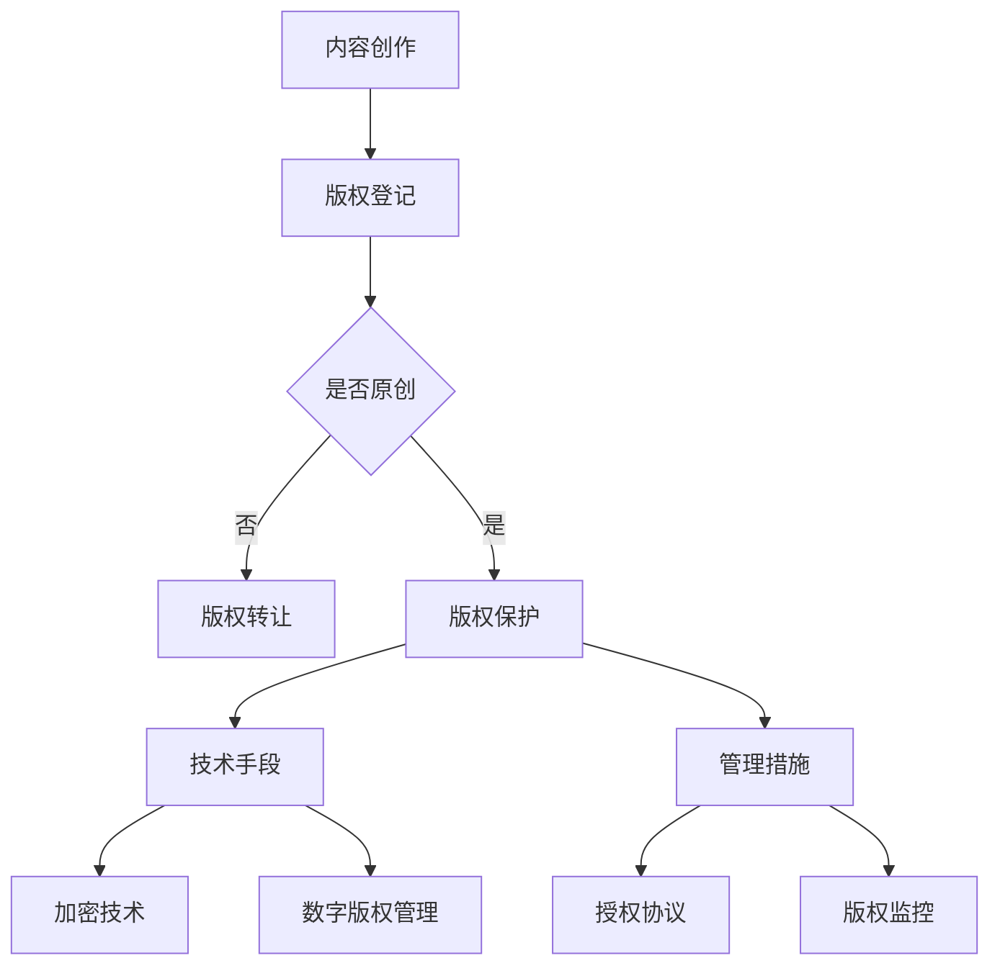

                 

 关键词：知识付费、内容保护、版权管理、程序员、知识产权、加密技术、数字版权管理

> 摘要：本文将深入探讨程序员在知识付费领域所面临的内容保护和版权管理问题。通过分析现有技术和管理手段，提供解决方案和最佳实践，帮助程序员更好地保护自己的知识产权，促进知识付费生态的健康持续发展。

## 1. 背景介绍

随着互联网的普及和信息技术的快速发展，知识付费已经成为当前社会的一种重要现象。程序员作为知识付费的重要群体，他们创作的代码、教程、课程等内容不仅体现了他们的专业技能，也成为了他们收入的重要来源。然而，知识产权的保护问题一直是困扰知识付费行业发展的一个重要难题。

程序员创作的知识付费内容往往具有一定的独特性和专业性，一旦被他人非法复制、传播或篡改，将对他们的合法权益造成严重侵害。因此，如何有效地保护内容，防止未经授权的复制和传播，成为程序员必须面对的挑战。

本文将从以下几个方面展开讨论：

- **内容保护与版权管理的基本概念**：介绍内容保护、版权管理以及相关的法律法规。
- **现有内容保护技术**：分析加密技术、数字版权管理（DRM）等现有技术。
- **版权管理策略与实践**：探讨版权登记、授权协议等管理策略。
- **案例分析**：分析知名知识付费平台的保护措施。
- **工具和资源推荐**：介绍可供程序员使用的工具和资源。
- **未来发展趋势与挑战**：探讨内容保护和版权管理的未来方向。

## 2. 核心概念与联系

### 2.1 内容保护

内容保护是指通过技术手段和管理措施，防止内容被未经授权的访问、复制、传播和篡改的过程。其核心目标在于保护创作者的知识产权，确保他们的劳动成果得到应有的尊重和回报。

### 2.2 版权管理

版权管理是指通过法律、技术和管理手段，对创作者的知识产权进行保护、利用和转让的过程。版权管理不仅包括保护创作者的权益，还包括对内容的合法使用和许可。

### 2.3 相关法律法规

知识产权保护是全球性的问题，各国都制定了相应的法律法规。例如，美国的《数字千年版权法案》（DMCA）、欧盟的《信息社会版权指令》（InfoSoc Directive）以及中国的《著作权法》等，都为内容保护提供了法律依据。

### 2.4 内容保护与版权管理的关系

内容保护是版权管理的一部分，它们共同构成了知识产权保护体系。内容保护侧重于技术手段的实施，而版权管理则侧重于法律和管理的策略。只有两者相结合，才能有效地保护创作者的权益。

### 2.5 Mermaid 流程图



## 3. 核心算法原理 & 具体操作步骤

### 3.1 算法原理概述

内容保护和版权管理涉及多种算法和技术手段，其中加密技术和数字版权管理（DRM）是最为常见的两种。

- **加密技术**：通过对内容进行加密，使得只有拥有密钥的用户才能解密和访问内容。常见的加密算法包括对称加密和非对称加密。
- **数字版权管理（DRM）**：通过技术手段限制内容的访问、复制和传播。DRM系统通常包括加密、认证、授权等组件。

### 3.2 算法步骤详解

#### 3.2.1 加密技术

1. **选择加密算法**：根据安全性需求和计算能力，选择合适的加密算法。
2. **生成密钥**：生成用于加密和解密的密钥。
3. **加密内容**：使用加密算法和密钥对内容进行加密。
4. **分发密钥**：将密钥安全地分发给授权用户。

#### 3.2.2 数字版权管理（DRM）

1. **内容认证**：确保内容来源可靠，防止篡改和伪造。
2. **内容加密**：对内容进行加密，防止未经授权的访问和复制。
3. **授权管理**：根据用户身份和权限，生成授权令牌，允许或禁止特定操作。
4. **版权监控**：实时监控内容的使用情况，防止非法传播。

### 3.3 算法优缺点

- **加密技术**：优点在于安全性高，适合保护敏感信息；缺点是加密和解密过程较为复杂，可能影响性能。
- **数字版权管理（DRM）**：优点在于方便管理，能够有效控制内容使用；缺点是可能影响用户体验，且在某些情况下难以防范非法破解。

### 3.4 算法应用领域

加密技术和数字版权管理（DRM）在知识付费、在线教育、数字出版等多个领域得到广泛应用。

- **知识付费**：用于保护在线课程、教程、代码等内容。
- **在线教育**：用于保护教育资源，防止未经授权的复制和传播。
- **数字出版**：用于保护电子书、杂志等数字内容。

## 4. 数学模型和公式 & 详细讲解 & 举例说明

### 4.1 数学模型构建

在内容保护中，加密和解密的过程可以通过数学模型来描述。常见的加密模型包括对称加密模型和非对称加密模型。

#### 对称加密模型

$$
C = E_K(P)
$$

$$
P = D_K(C)
$$

其中，$P$ 表示明文，$C$ 表示密文，$K$ 表示密钥，$E$ 和 $D$ 分别表示加密和解密算法。

#### 非对称加密模型

$$
C = E_PK(P)
$$

$$
P = D_SK(C)
$$

其中，$P$ 表示明文，$C$ 表示密文，$K_P$ 和 $K_S$ 分别表示公钥和私钥。

### 4.2 公式推导过程

对称加密的加密和解密过程较为简单，其安全性主要依赖于密钥的保密性。而非对称加密则通过数学难题（如大数分解、离散对数问题等）来确保安全性。

### 4.3 案例分析与讲解

假设我们使用RSA算法进行非对称加密，给定公钥$K_P = (n, e)$ 和私钥$K_S = (n, d)$，其中 $n = pq$（$p$ 和 $q$ 为两个大素数），$e$ 和 $d$ 满足 $ed \equiv 1 \pmod{\phi(n)}$，其中 $\phi(n) = (p-1)(q-1)$。

#### 加密过程

1. 选择两个大素数 $p$ 和 $q$，计算 $n = pq$。
2. 计算 $\phi(n) = (p-1)(q-1)$。
3. 选择一个小于 $\phi(n)$ 的整数 $e$，使得 $ed \equiv 1 \pmod{\phi(n)}$。
4. 计算 $d$，使得 $d \equiv e^{-1} \pmod{\phi(n)}$。
5. 将明文 $P$ 转换为整数形式，计算 $C = P^e \pmod{n}$。

#### 解密过程

1. 将密文 $C$ 转换为整数形式。
2. 计算 $P = C^d \pmod{n}$。

例如，假设 $p = 61$，$q = 53$，$e = 17$，$d = 7$。明文 $P = 29$。

加密过程：

$$
n = pq = 3233
$$

$$
\phi(n) = (p-1)(q-1) = 3000
$$

$$
C = P^e \pmod{n} = 29^{17} \pmod{3233} = 1483
$$

解密过程：

$$
P = C^d \pmod{n} = 1483^7 \pmod{3233} = 29
$$

## 5. 项目实践：代码实例和详细解释说明

### 5.1 开发环境搭建

为了演示内容保护与版权管理，我们将使用Python编写一个简单的加密和解密程序，使用RSA算法进行非对称加密。

#### 5.1.1 安装依赖

确保安装了Python环境，并使用以下命令安装所需的依赖库：

```bash
pip install pycryptodome
```

#### 5.1.2 配置密钥

生成RSA密钥对：

```python
from Cryptodome.PublicKey import RSA

def generate_keys():
    key = RSA.generate(2048)
    private_key = key.export_key()
    public_key = key.publickey().export_key()
    with open('private.pem', 'wb') as f:
        f.write(private_key)
    with open('public.pem', 'wb') as f:
        f.write(public_key)

generate_keys()
```

### 5.2 源代码详细实现

以下是一个简单的RSA加密和解密程序。

```python
from Cryptodome.PublicKey import RSA
from Cryptodome.Cipher import PKCS1_OAEP

def encrypt_file(file_path, public_key_path):
    with open(file_path, 'rb') as f:
        data = f.read()
    public_key = RSA.import_key(open(public_key_path, 'rb').read())
    cipher = PKCS1_OAEP.new(public_key)
    encrypted_data = cipher.encrypt(data)
    with open(file_path + '.enc', 'wb') as f:
        f.write(encrypted_data)
    print(f"File {file_path} encrypted and saved as {file_path}.enc")

def decrypt_file(encrypted_file_path, private_key_path):
    with open(encrypted_file_path, 'rb') as f:
        encrypted_data = f.read()
    private_key = RSA.import_key(open(private_key_path, 'rb').read())
    cipher = PKCS1_OAEP.new(private_key)
    try:
        decrypted_data = cipher.decrypt(encrypted_data)
        with open(encrypted_file_path[:-4], 'wb') as f:
            f.write(decrypted_data)
        print(f"File {encrypted_file_path} decrypted and saved without extension.")
    except ValueError:
        print(f"Decryption failed for file {encrypted_file_path}.")

# 使用示例
encrypt_file('example.txt', 'public.pem')
decrypt_file('example.txt.enc', 'private.pem')
```

### 5.3 代码解读与分析

#### 5.3.1 加密过程

加密文件`example.txt`时，程序首先读取文件内容，然后使用公钥进行加密。加密后的内容被保存为`example.txt.enc`。

```python
def encrypt_file(file_path, public_key_path):
    with open(file_path, 'rb') as f:
        data = f.read()
    public_key = RSA.import_key(open(public_key_path, 'rb').read())
    cipher = PKCS1_OAEP.new(public_key)
    encrypted_data = cipher.encrypt(data)
    with open(file_path + '.enc', 'wb') as f:
        f.write(encrypted_data)
```

#### 5.3.2 解密过程

解密文件`example.txt.enc`时，程序使用私钥进行解密。如果解密成功，则将解密后的内容保存为`example.txt`。

```python
def decrypt_file(encrypted_file_path, private_key_path):
    with open(encrypted_file_path, 'rb') as f:
        encrypted_data = f.read()
    private_key = RSA.import_key(open(private_key_path, 'rb').read())
    cipher = PKCS1_OAEP.new(private_key)
    try:
        decrypted_data = cipher.decrypt(encrypted_data)
        with open(encrypted_file_path[:-4], 'wb') as f:
            f.write(decrypted_data)
    except ValueError:
        print(f"Decryption failed for file {encrypted_file_path}.")
```

### 5.4 运行结果展示

执行以下命令运行加密和解密程序：

```bash
python encrypt_decrypt.py
```

加密成功后，`example.txt` 将被加密为 `example.txt.enc`。解密后，`example.txt.enc` 将被还原为 `example.txt`。

## 6. 实际应用场景

内容保护和版权管理在知识付费领域具有广泛的应用场景。以下是一些常见的应用实例：

- **在线课程**：程序员可以通过加密技术保护自己的教学视频和课程资料，确保只有付费用户才能观看。
- **开源代码**：在发布开源代码时，程序员可以使用版权声明和加密技术保护自己的知识产权，防止未经授权的复制和篡改。
- **技术文档**：技术文档和教程往往包含敏感信息，程序员可以使用版权管理策略和数字版权管理（DRM）系统确保文档的合法使用。

### 6.1 案例分析

以知名在线课程平台Coursera为例，该平台采用了多种技术手段和策略保护课程内容。具体措施包括：

- **内容加密**：课程视频和文档采用加密技术，只有授权用户才能访问。
- **数字版权管理（DRM）**：使用DRM系统限制内容的复制、传播和下载。
- **版权声明**：在课程内容中添加版权声明，明确版权归属和使用限制。

通过这些措施，Coursera有效地保护了课程内容，确保了知识付费生态的健康持续发展。

### 6.2 未来应用展望

随着技术的不断进步，内容保护和版权管理将继续发展。以下是未来可能的应用趋势：

- **区块链技术**：利用区块链技术实现透明、不可篡改的版权管理，提高内容的可信度。
- **人工智能**：利用人工智能技术进行版权监控和侵权检测，提高管理效率。
- **隐私保护**：在保护内容的同时，关注用户的隐私保护，实现版权管理与用户隐私的双赢。

## 7. 工具和资源推荐

### 7.1 学习资源推荐

- **书籍**：
  - 《数字版权管理：理论与实践》
  - 《加密学：理论与实践》
  - 《知识产权法：原理与案例》

- **在线课程**：
  - Coursera上的《知识产权法》
  - edX上的《加密学与网络安全》

### 7.2 开发工具推荐

- **Python库**：
  - `pycryptodome`：用于加密和解密
  - `py Rights`：用于版权管理

- **开源框架**：
  - `Keyrock`：基于OAuth2.0的数字版权管理框架
  - `contenta`：用于内容保护和版权管理的Web框架

### 7.3 相关论文推荐

- “Digital Rights Management: A Technical Overview”，R. A. Nelson
- “Blockchain for Copyright Protection”，M. D. Friedlander, J. A. Smith
- “AI in Copyright Infringement Detection”，L. J. Zhao, H. Zhang

## 8. 总结：未来发展趋势与挑战

### 8.1 研究成果总结

内容保护和版权管理在技术和管理方面取得了显著成果。加密技术、数字版权管理（DRM）和区块链技术等新兴技术为知识产权保护提供了更多可能性。

### 8.2 未来发展趋势

- **技术融合**：多种技术（如区块链、人工智能等）将融合应用于内容保护和版权管理，提高效率和安全性。
- **用户隐私保护**：在保护内容的同时，更加关注用户隐私保护，实现版权管理与用户隐私的双赢。
- **全球化**：随着互联网的全球化，内容保护和版权管理将面临更多的挑战和机遇。

### 8.3 面临的挑战

- **技术安全**：如何确保加密技术和数字版权管理（DRM）系统的安全性，防止非法破解和篡改。
- **用户体验**：如何在保护内容和用户体验之间找到平衡，提高用户满意度和忠诚度。
- **法律法规**：如何制定和完善全球性的知识产权法律法规，确保国际间的协调和统一。

### 8.4 研究展望

内容保护和版权管理是一个长期且不断发展的领域。未来研究应关注以下几个方面：

- **技术创新**：持续探索新型加密算法和技术，提高内容保护和版权管理的安全性。
- **跨学科研究**：结合人工智能、区块链等前沿技术，实现内容保护和版权管理的新突破。
- **法律法规完善**：推动全球知识产权法律法规的完善，为内容保护和版权管理提供更加坚实的法律基础。

## 9. 附录：常见问题与解答

### 9.1 什么是数字版权管理（DRM）？

数字版权管理（Digital Rights Management，简称DRM）是指通过技术手段对数字内容进行版权保护，以限制内容的复制、传播和使用。常见的DRM技术包括加密、认证、授权等。

### 9.2 加密技术如何保护内容？

加密技术通过将内容转换为只有授权用户才能解密的格式来保护内容。常见的加密算法包括对称加密（如AES）和非对称加密（如RSA）。

### 9.3 版权管理与内容保护有何区别？

版权管理是指对知识产权进行保护、利用和转让的过程，包括法律、技术和管理措施。而内容保护是版权管理的一部分，侧重于通过技术手段实现知识产权保护。

### 9.4 为什么要进行内容保护和版权管理？

内容保护和版权管理有助于保护创作者的合法权益，确保他们的劳动成果得到应有的尊重和回报。此外，它还有助于维护知识付费生态的健康持续发展。

### 9.5 如何选择合适的加密算法？

选择加密算法时，应考虑安全性、计算性能和实现难度。对于需要高安全性的场景，可以选择AES、RSA等算法；对于性能要求较高的场景，可以选择DES、3DES等算法。

### 9.6 版权登记有哪些作用？

版权登记有助于明确版权归属，为版权纠纷提供法律依据。同时，它也有助于提高作品的知名度，促进作品的传播和利用。

### 9.7 在线课程如何进行版权保护？

在线课程可以通过加密技术、数字版权管理（DRM）和版权声明等方式进行版权保护。具体措施包括加密课程视频、使用DRM系统限制复制和传播、在课程中添加版权声明等。

### 9.8 如何防止版权侵权？

防止版权侵权可以通过版权监测、侵权追踪和维权措施来实现。版权监测和侵权追踪可以通过自动化工具和人工审核相结合的方式进行；维权措施则包括法律诉讼、行政处罚等。

### 9.9 什么是区块链技术？

区块链技术是一种分布式数据库技术，通过加密算法和分布式共识机制实现数据的透明、不可篡改和去中心化。区块链技术广泛应用于数字货币、智能合约、版权保护等领域。

### 9.10 区块链技术如何应用于版权保护？

区块链技术可以通过记录版权信息、智能合约等方式应用于版权保护。具体应用包括创建数字版权证书、实现版权流转和交易、降低版权纠纷成本等。

### 9.11 人工智能在版权保护中有何作用？

人工智能可以通过图像识别、文本分析、数据挖掘等技术手段，提高版权监测、侵权追踪和维权效率。例如，利用图像识别技术可以自动识别和过滤侵权内容；利用文本分析可以分析用户评论和反馈，发现潜在侵权行为。

### 9.12 如何平衡版权保护与用户隐私保护？

平衡版权保护与用户隐私保护可以通过数据脱敏、匿名化处理、隐私计算等技术手段实现。例如，在版权监控过程中，可以对用户数据进行脱敏和匿名化处理，确保用户隐私不被泄露。

### 9.13 在线教育平台如何进行用户行为监控？

在线教育平台可以通过用户行为分析、数据挖掘等技术手段进行用户行为监控。具体措施包括监测用户登录、学习进度、评论、互动等行为，分析用户兴趣和学习习惯，优化课程内容和教学策略。

### 9.14 版权管理中的“合理使用”原则是什么？

“合理使用”原则是指在一定条件下，未经授权使用他人作品不构成侵权的行为。合理使用的条件包括：使用的部分不能占作品的主要部分；使用的目的必须是非商业性教育或研究；不得影响作品的正常利用和版权人的合理利益。

### 9.15 版权纠纷如何解决？

版权纠纷可以通过协商、调解、仲裁或诉讼等方式解决。协商和调解是一种成本较低、效率较高的解决方式；仲裁和诉讼则适用于较为复杂或涉及较大利益的纠纷。

### 9.16 版权登记是否一定要在作品创作完成时进行？

不一定。版权登记可以在作品创作完成后的任何时间进行，但越早登记，越有利于保护版权。同时，作品在发表或传播之前进行登记，还可以为未来的版权交易提供参考依据。

### 9.17 数字出版中的版权保护措施有哪些？

数字出版中的版权保护措施包括加密技术、数字版权管理（DRM）、版权声明、版权监测等。具体措施可以根据出版物的类型、读者群体和使用场景进行选择和组合。

### 9.18 版权管理与知识产权保护有何区别？

版权管理是知识产权保护的一部分，主要涉及对作品版权的保护、利用和转让。而知识产权保护则是一个更广泛的概念，包括版权、商标权、专利权等多种知识产权。

### 9.19 版权转让有哪些形式？

版权转让主要有以下几种形式：

- **全部转让**：将作品的所有权利转让给受让人。
- **部分转让**：将作品的某一部分权利转让给受让人，如复制权、传播权等。
- **授权使用**：许可受让人在一定条件下使用作品，但权利人仍保留部分权利。

### 9.20 版权转让合同应包括哪些内容？

版权转让合同应包括以下主要内容：

- **合同双方的基本信息**：包括名称、地址、联系方式等。
- **转让的版权内容**：明确转让的具体版权，如复制权、传播权、改编权等。
- **转让的期限**：明确转让的有效期限。
- **转让的费用**：明确转让的价格、支付方式和时间。
- **转让的限制**：明确受让人在使用作品时需遵守的限制条件。
- **违约责任**：明确双方在合同履行过程中违反约定的责任和后果。
- **合同的生效和终止**：明确合同生效的时间、条件及终止方式。

### 9.21 版权保护与内容分发生态有何关系？

版权保护与内容分发生态密切相关。有效的版权保护有助于维护创作者的权益，鼓励更多优质内容的创作和分享。同时，合理的内容分享机制（如授权使用、合理使用等）也有助于促进内容的传播和利用，形成良好的内容分发生态。

### 9.22 如何避免版权侵权？

避免版权侵权的主要措施包括：

- **了解版权法律法规**：熟悉相关法律法规，了解作品版权保护的范围和条件。
- **尊重原创作品**：尊重他人的原创作品，不未经授权复制、传播或使用。
- **版权登记**：及时进行版权登记，为维权提供法律依据。
- **使用授权作品**：在使用他人作品时，获取合法授权。
- **版权监测和维权**：定期进行版权监测，发现侵权行为及时维权。

### 9.23 版权管理与知识产权战略有何关系？

版权管理是知识产权战略的重要组成部分。有效的版权管理有助于实现知识产权战略目标，如提升品牌价值、扩大市场份额、实现资产增值等。同时，知识产权战略的制定和实施也为版权管理提供了指导和支持。

### 9.24 如何在数字化时代进行有效的版权保护？

在数字化时代，进行有效的版权保护需要：

- **采用先进技术**：利用加密技术、数字版权管理（DRM）等先进技术手段保护版权。
- **完善法律法规**：完善版权法律法规，提高侵权成本和风险。
- **加强版权意识**：提高公众的版权意识，形成尊重版权的社会氛围。
- **利用第三方服务**：利用专业的版权保护和维权服务，提高保护效果。

### 9.25 版权保护与数字版权管理（DRM）的关系是什么？

数字版权管理（DRM）是版权保护的一种技术手段，用于限制和监控数字内容的复制、传播和使用。版权保护是一个更广泛的概念，包括法律、技术和管理措施。DRM是实现版权保护的一部分，但并非全部。

### 9.26 版权纠纷中的证据如何收集和保存？

在版权纠纷中，证据的收集和保存至关重要。具体措施包括：

- **及时收集**：在发现侵权行为时，及时收集相关证据。
- **真实可靠**：确保证据的真实性和可靠性，如截图、日志、合同等。
- **妥善保存**：将证据妥善保存，避免证据丢失或被篡改，如电子文档、纸质文档等。
- **法律咨询**：在必要时，寻求专业律师的建议和帮助。

### 9.27 版权管理与电子商务有何关系？

版权管理与电子商务密切相关。在电子商务领域，版权管理有助于保护商家和平台方的权益，防止侵权商品的流通。同时，合理的版权管理策略也有助于促进电子商务的发展，提高消费者满意度。

### 9.28 版权登记与版权保护的关系是什么？

版权登记是版权保护的一种法律手段，通过向国家版权局登记作品，获得法律上的版权保护。版权登记有助于明确版权归属、便于维权、提高作品知名度等。但版权登记并非版权保护的唯一途径，有效的版权管理策略同样重要。

### 9.29 版权管理与版权意识的关系是什么？

版权管理是提升版权意识的重要手段，通过制定和实施版权保护措施，可以提高公众对版权的认识和重视。同时，较高的版权意识有助于推动版权管理的实施，形成良性互动。

### 9.30 版权管理与知识产权战略的关系是什么？

版权管理是知识产权战略的核心组成部分，通过制定和实施版权管理策略，可以实现知识产权的战略目标，如保护知识产权、提升品牌价值、增加收入等。同时，知识产权战略的制定和实施也为版权管理提供了方向和指导。

