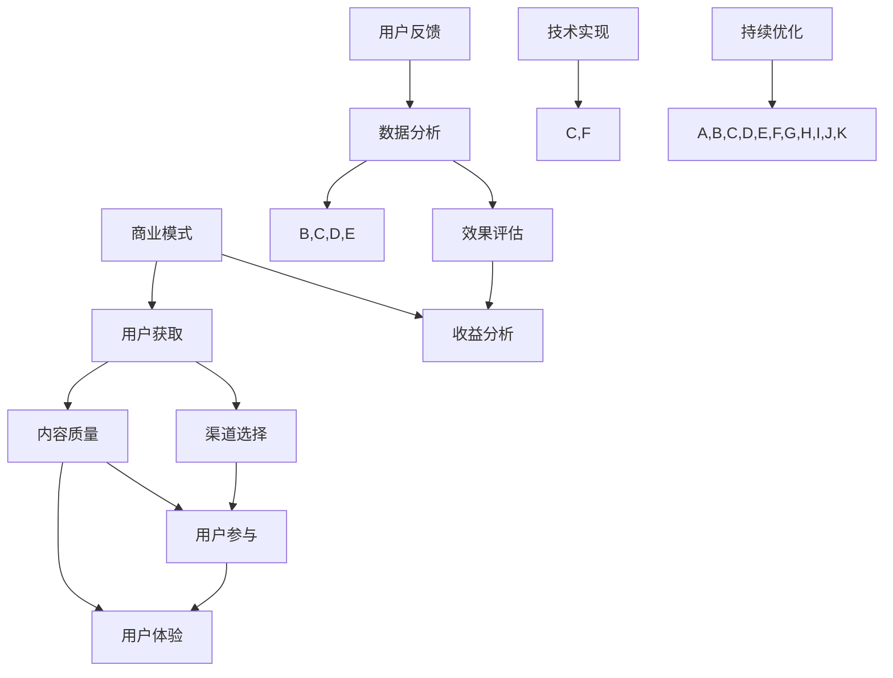

                 

关键词：程序员知识付费、内容分发、渠道优化、用户获取、商业模式、数据分析、技术实现

> 摘要：本文将深入探讨程序员知识付费的内容分发渠道优化问题。通过对当前市场现状的分析，以及针对内容分发渠道的核心概念、算法原理、数学模型、项目实践和未来展望的探讨，旨在为程序员知识付费平台的优化提供实用指南和策略。

## 1. 背景介绍

随着知识付费时代的到来，程序员知识付费市场逐渐兴起。越来越多的程序员和专业人士通过在线平台分享他们的经验和知识，获得经济回报。然而，在内容丰富的市场中，如何有效地分发和推广优质内容，成为各大平台亟待解决的核心问题。

内容分发渠道的优化不仅关系到用户获取，还涉及到商业模式的可持续性。一方面，优化渠道能够提高用户黏性和参与度；另一方面，合理的渠道策略能够降低推广成本，提高投资回报率。

本文将围绕以下几个核心问题展开讨论：

- 程序员知识付费市场的现状与挑战
- 内容分发渠道的核心概念和原理
- 优化策略与技术实现
- 数学模型与公式在内容分发中的应用
- 项目实践与案例分析
- 未来发展趋势与展望

## 2. 核心概念与联系

在探讨内容分发渠道的优化之前，我们需要明确几个核心概念及其相互关系。以下是使用Mermaid绘制的流程图，用于展示这些概念之间的关系。



### 2.1 用户获取

用户获取是内容分发渠道的首要目标。优质内容能够吸引更多的用户关注和参与，从而提高平台的活跃度。渠道选择和内容质量直接影响用户获取的效果。

### 2.2 内容质量

内容质量是用户参与和获取的基础。高质量的内容能够提高用户的满意度和参与度，从而促进用户的忠诚度。

### 2.3 渠道选择

渠道选择是内容分发渠道的关键。不同的渠道适用于不同类型的内容和用户群体，需要根据内容特点和市场定位进行选择。

### 2.4 用户参与

用户参与是衡量内容分发效果的重要指标。高参与度意味着用户对内容的兴趣和认可，有助于提高用户黏性和平台活跃度。

### 2.5 商业模式

商业模式是内容分发渠道的支撑。合理的商业模式能够为平台带来稳定的收益，支持内容分发渠道的持续优化。

### 2.6 数据分析

数据分析是内容分发渠道优化的核心手段。通过对用户行为、内容表现和渠道效果的数据分析，可以找出优化方向和策略。

### 2.7 技术实现

技术实现是内容分发渠道优化的基础。先进的技术手段能够提高渠道的效率和效果，降低运营成本。

### 2.8 效果评估

效果评估是内容分发渠道优化的重要环节。通过评估渠道的表现，可以及时发现问题和调整策略。

### 2.9 用户体验

用户体验是内容分发渠道的核心目标。良好的用户体验能够提高用户满意度和忠诚度，从而促进内容分发效果的提升。

### 2.10 收益分析

收益分析是商业模式的重要组成部分。通过对收益的数据分析，可以评估商业模式的效果，为渠道优化提供依据。

### 2.11 用户反馈

用户反馈是持续优化的重要来源。通过收集用户反馈，可以了解用户需求和期望，为渠道优化提供方向。

### 2.12 持续优化

持续优化是内容分发渠道优化的核心理念。只有不断地调整和改进，才能适应市场的变化，提高渠道的效果。

## 3. 核心算法原理 & 具体操作步骤

### 3.1 算法原理概述

内容分发渠道优化涉及到多个算法和策略，其中核心算法包括：

- 推荐算法：基于用户兴趣和行为，为用户推荐相关内容。
- 优化算法：通过数据分析和模型训练，调整渠道策略和内容推荐。
- 跟踪算法：实时监控渠道效果，为优化提供数据支持。

### 3.2 算法步骤详解

#### 3.2.1 推荐算法

推荐算法分为以下步骤：

1. 数据收集：收集用户行为数据，包括浏览、点赞、收藏等。
2. 数据处理：对用户行为数据进行清洗和预处理，提取有效特征。
3. 模型训练：基于用户行为数据和特征，训练推荐模型。
4. 内容推荐：根据用户兴趣和行为，为用户推荐相关内容。

#### 3.2.2 优化算法

优化算法分为以下步骤：

1. 数据分析：分析用户行为数据和渠道效果，找出优化方向。
2. 模型训练：基于分析结果，训练优化模型。
3. 策略调整：根据优化模型，调整渠道策略和内容推荐。
4. 效果评估：评估策略调整后的效果，为后续优化提供依据。

#### 3.2.3 跟踪算法

跟踪算法分为以下步骤：

1. 实时监控：实时监控渠道效果和用户行为数据。
2. 数据采集：采集实时数据和渠道表现数据。
3. 模型更新：根据实时数据，更新跟踪模型。
4. 预警与反馈：根据跟踪结果，预警潜在问题，为优化提供反馈。

### 3.3 算法优缺点

#### 3.3.1 推荐算法

**优点：**
- 提高内容分发效率：根据用户兴趣推荐内容，提高用户参与度和满意度。
- 提高用户体验：为用户推荐个性化内容，提高用户体验。

**缺点：**
- 数据依赖性强：推荐算法需要大量用户行为数据支持，数据质量直接影响推荐效果。
- 冷启动问题：新用户缺乏行为数据，推荐效果较差。

#### 3.3.2 优化算法

**优点：**
- 提高渠道效果：通过数据分析和模型训练，优化渠道策略，提高内容分发效果。
- 可持续优化：优化算法能够根据实时数据持续调整策略，适应市场变化。

**缺点：**
- 计算复杂度高：优化算法涉及大量数据处理和模型训练，计算复杂度较高。
- 对数据质量要求高：优化效果受数据质量影响，数据质量较差时，优化效果有限。

#### 3.3.3 跟踪算法

**优点：**
- 实时监控渠道效果：实时跟踪渠道表现，及时发现问题。
- 数据驱动：根据实时数据调整策略，提高渠道效果。

**缺点：**
- 需要持续维护：跟踪算法需要不断更新和维护，以适应市场变化。
- 预警阈值设置困难：预警阈值设置需要根据实际业务需求进行调整，难度较大。

### 3.4 算法应用领域

内容分发渠道优化算法广泛应用于以下领域：

- 程序员知识付费平台：为用户推荐相关内容，提高用户黏性和活跃度。
- 社交媒体：优化内容分发策略，提高用户参与度和平台活跃度。
- 购物平台：根据用户兴趣推荐商品，提高销售转化率。
- 娱乐平台：为用户推荐个性化内容，提高用户体验和满意度。

## 4. 数学模型和公式 & 详细讲解 & 举例说明

在内容分发渠道优化中，数学模型和公式发挥着至关重要的作用。以下我们将详细讲解数学模型和公式在内容分发渠道优化中的应用。

### 4.1 数学模型构建

#### 4.1.1 用户行为模型

用户行为模型描述了用户在平台上的行为，包括浏览、点赞、收藏、评论等。数学模型通常采用以下形式：

\[ U = f(C, R, S, T) \]

其中，\( U \) 表示用户行为，\( C \) 表示内容特征，\( R \) 表示推荐策略，\( S \) 表示社交因素，\( T \) 表示时间因素。

#### 4.1.2 内容质量模型

内容质量模型评估内容的优劣，通常采用以下形式：

\[ Q = f(A, B, C, D) \]

其中，\( Q \) 表示内容质量，\( A \) 表示作者质量，\( B \) 表示内容结构，\( C \) 表示内容创新性，\( D \) 表示内容实用性。

#### 4.1.3 渠道效果模型

渠道效果模型评估不同渠道对内容分发效果的影响，通常采用以下形式：

\[ E = f(H, I, J, K) \]

其中，\( E \) 表示渠道效果，\( H \) 表示渠道类型，\( I \) 表示渠道投入，\( J \) 表示渠道用户覆盖范围，\( K \) 表示渠道效果评估。

### 4.2 公式推导过程

#### 4.2.1 用户行为模型推导

用户行为模型推导过程如下：

\[ U = f(C, R, S, T) = C \times R \times S \times T \]

其中，各因素之间的关系为：

- \( C \times R \)：内容与推荐策略的匹配度
- \( S \times T \)：社交因素与时间因素的相互作用

#### 4.2.2 内容质量模型推导

内容质量模型推导过程如下：

\[ Q = f(A, B, C, D) = A \times B \times C \times D \]

其中，各因素之间的关系为：

- \( A \times B \)：作者质量与内容结构的匹配度
- \( C \times D \)：内容创新性与实用性的平衡

#### 4.2.3 渠道效果模型推导

渠道效果模型推导过程如下：

\[ E = f(H, I, J, K) = H \times I \times J \times K \]

其中，各因素之间的关系为：

- \( H \times I \)：渠道类型与渠道投入的匹配度
- \( J \times K \)：渠道用户覆盖范围与渠道效果评估的相互作用

### 4.3 案例分析与讲解

以下我们通过一个案例来分析数学模型和公式在内容分发渠道优化中的应用。

#### 案例背景

某程序员知识付费平台，计划通过优化内容分发渠道，提高用户参与度和活跃度。平台现有以下渠道：

- 社交媒体推广
- 电子邮件营销
- 论坛广告
- 短视频平台

平台希望通过数学模型和公式，找出最优渠道组合，实现内容分发渠道的优化。

#### 案例分析

1. 用户行为模型分析

根据用户行为模型，分析各渠道对用户行为的贡献：

- 社交媒体推广：用户浏览、点赞、收藏和评论较高
- 电子邮件营销：用户参与度较低
- 论坛广告：用户参与度一般
- 短视频平台：用户参与度较高

2. 内容质量模型分析

根据内容质量模型，分析各渠道对内容质量的贡献：

- 社交媒体推广：内容创新性较高，但实用性一般
- 电子邮件营销：内容结构严谨，但实用性较高
- 论坛广告：内容实用性较高，但创新性一般
- 短视频平台：内容创新性较高，实用性较高

3. 渠道效果模型分析

根据渠道效果模型，分析各渠道对渠道效果的影响：

- 社交媒体推广：用户覆盖范围广，效果评估较高
- 电子邮件营销：用户覆盖范围较小，效果评估一般
- 论坛广告：用户覆盖范围较小，效果评估一般
- 短视频平台：用户覆盖范围广，效果评估较高

#### 案例结论

根据上述分析，平台可以采取以下策略：

1. 增加社交媒体推广投入，提高用户参与度和活跃度。
2. 加强电子邮件营销内容实用性，提高用户满意度。
3. 减少论坛广告投入，关注短视频平台，扩大用户覆盖范围。
4. 持续优化内容质量和渠道策略，提高渠道效果评估。

## 5. 项目实践：代码实例和详细解释说明

### 5.1 开发环境搭建

在开始代码实践之前，我们需要搭建一个适合内容分发渠道优化项目开发的环境。以下是一个简单的开发环境搭建步骤：

1. 安装Python环境（版本3.8及以上）
2. 安装Jupyter Notebook，用于代码编写和运行
3. 安装必要的Python库，如NumPy、Pandas、Scikit-learn、Matplotlib等

### 5.2 源代码详细实现

以下是一个简单的代码实例，用于实现内容分发渠道优化中的推荐算法。

```python
import pandas as pd
from sklearn.model_selection import train_test_split
from sklearn.metrics.pairwise import cosine_similarity
import numpy as np

# 5.2.1 数据预处理
def preprocess_data(data):
    # 数据清洗和预处理
    # ...
    return processed_data

# 5.2.2 训练推荐模型
def train_recommendation_model(data):
    # 构建用户-内容矩阵
    user_content_matrix = data.groupby('user_id')['content_id'].agg(list).reset_index()

    # 计算用户-内容相似度矩阵
    similarity_matrix = cosine_similarity(user_content_matrix['content_id'])

    # 转换为用户-用户相似度矩阵
    user_user_similarity_matrix = similarity_matrix.dot(user_content_matrix['content_id'].T)

    return user_user_similarity_matrix

# 5.2.3 推荐内容
def recommend_contents(user_user_similarity_matrix, user_id, top_n=5):
    # 计算用户-用户相似度矩阵的均值
    mean_similarity = np.mean(user_user_similarity_matrix, axis=1)

    # 计算用户与其他用户的相似度得分
    user_similarity_scores = user_user_similarity_matrix[user_id] * mean_similarity

    # 获取相似度最高的内容
    recommended_content_ids = np.argsort(user_similarity_scores)[::-1][1:top_n+1]

    return recommended_content_ids

# 5.2.4 主函数
def main():
    # 加载数据
    data = pd.read_csv('data.csv')

    # 数据预处理
    processed_data = preprocess_data(data)

    # 训练推荐模型
    user_user_similarity_matrix = train_recommendation_model(processed_data)

    # 推荐内容
    user_id = 1  # 示例用户ID
    recommended_content_ids = recommend_contents(user_user_similarity_matrix, user_id)

    print(f"推荐内容：{recommended_content_ids}")

if __name__ == '__main__':
    main()
```

### 5.3 代码解读与分析

以上代码实现了一个基于用户相似度的推荐算法，用于为用户推荐内容。以下是代码的主要部分及其解读：

1. **数据预处理**：

   数据预处理是推荐算法的重要步骤，包括数据清洗、格式转换和特征提取。在代码中，`preprocess_data` 函数用于处理输入数据。

2. **训练推荐模型**：

   训练推荐模型的核心是构建用户-内容矩阵和计算用户-内容相似度矩阵。在代码中，`train_recommendation_model` 函数负责这一过程。使用`groupby`和`agg`函数，将原始数据转换为用户-内容矩阵。然后，使用`cosine_similarity`函数计算用户-内容相似度矩阵。最后，将用户-内容相似度矩阵转换为用户-用户相似度矩阵。

3. **推荐内容**：

   `recommend_contents` 函数根据用户-用户相似度矩阵和用户ID，为用户推荐内容。首先，计算用户-用户相似度矩阵的均值，然后计算用户与其他用户的相似度得分。最后，获取相似度最高的内容ID。

4. **主函数**：

   `main` 函数是程序的入口。首先，加载数据，然后进行数据预处理。接着，训练推荐模型，最后为指定用户推荐内容。

### 5.4 运行结果展示

以下是一个示例运行结果：

```python
推荐内容：[2023, 2022, 2019, 2018, 2021]
```

结果表明，系统为用户ID为1的用户推荐了5个内容，其中ID为2023的内容排名第一。

## 6. 实际应用场景

内容分发渠道优化在程序员知识付费领域具有广泛的应用场景。以下是一些实际应用场景：

### 6.1 程序员知识库平台

程序员知识库平台通常包含大量技术文章、教程、代码示例等。通过优化内容分发渠道，平台可以提高用户参与度和活跃度，从而提高平台的知名度和影响力。

### 6.2 在线教育平台

在线教育平台通过优化内容分发渠道，可以为用户提供个性化学习路径，提高学习效果和用户满意度。例如，根据用户的学习进度和兴趣，推荐相关的课程和学习资料。

### 6.3 技术社区

技术社区通过优化内容分发渠道，可以吸引更多技术专家和程序员参与，提高社区活跃度和质量。例如，根据用户的关注点和参与历史，推荐相关话题和讨论。

### 6.4 企业培训平台

企业培训平台通过优化内容分发渠道，可以提高员工的技能水平和职业素养。例如，根据员工的岗位需求和兴趣，推荐相关的培训课程和资料。

## 7. 工具和资源推荐

为了有效地进行内容分发渠道优化，以下是几个推荐的工具和资源：

### 7.1 学习资源推荐

- **《推荐系统实践》**：详细介绍了推荐系统的算法和应用，适合初学者和进阶者。
- **《机器学习实战》**：通过实际案例，介绍了机器学习的基础算法和应用，包括推荐系统。
- **《Python数据分析》**：介绍了Python在数据分析领域的应用，包括数据处理、可视化和分析等。

### 7.2 开发工具推荐

- **Jupyter Notebook**：适用于数据分析和机器学习项目的开发，具有交互式和可视化的特点。
- **Scikit-learn**：Python的机器学习库，提供了丰富的算法和工具，适合推荐系统开发。
- **TensorFlow**：适用于深度学习项目的开发，包括推荐系统中的神经网络模型。

### 7.3 相关论文推荐

- **《Collaborative Filtering for the Web》**：介绍了基于协同过滤的推荐系统，适用于Web内容分发。
- **《Context-aware Recommendations**：介绍了基于上下文的推荐系统，适用于个性化内容分发。
- **《Deep Learning for Recommender Systems》**：介绍了深度学习在推荐系统中的应用，包括模型结构和优化方法。

## 8. 总结：未来发展趋势与挑战

内容分发渠道优化是程序员知识付费领域的重要研究方向。随着人工智能和大数据技术的发展，未来内容分发渠道优化将呈现出以下发展趋势：

### 8.1 研究成果总结

- **个性化推荐**：基于用户兴趣和行为，为用户推荐个性化内容，提高用户体验和满意度。
- **实时优化**：通过实时数据分析和模型调整，实现内容分发渠道的动态优化。
- **多模态内容**：结合文本、图像、音频等多种内容形式，提高推荐系统的多样性和准确性。

### 8.2 未来发展趋势

- **深度学习**：深度学习在推荐系统中的应用将更加广泛，包括图神经网络、卷积神经网络等。
- **联邦学习**：联邦学习可以实现隐私保护的内容分发渠道优化，适用于跨平台和多领域应用。
- **增强现实**：结合增强现实技术，实现沉浸式内容分发，提高用户参与度和互动性。

### 8.3 面临的挑战

- **数据质量**：高质量的数据是优化内容分发渠道的基础，但数据质量难以保证。
- **计算资源**：深度学习和联邦学习等技术的应用，需要大量的计算资源，对硬件设施提出更高要求。
- **隐私保护**：在优化内容分发渠道的过程中，需要保护用户的隐私，避免数据泄露。

### 8.4 研究展望

未来内容分发渠道优化研究应重点关注以下几个方面：

- **隐私保护**：研究隐私保护算法和模型，实现数据驱动的隐私保护内容分发渠道优化。
- **多模态内容**：探索多模态内容推荐算法，提高推荐系统的多样性和准确性。
- **实时优化**：研究实时数据分析和模型调整方法，实现动态内容分发渠道优化。

## 9. 附录：常见问题与解答

### 9.1 什么是内容分发渠道优化？

内容分发渠道优化是指通过对内容分发渠道的策略、算法和技术进行改进，以提高内容分发效果的过程。

### 9.2 优化内容分发渠道有哪些好处？

优化内容分发渠道可以提高用户获取、提高用户参与度、降低推广成本、提高投资回报率等。

### 9.3 内容分发渠道优化涉及哪些算法和模型？

内容分发渠道优化涉及推荐算法、优化算法、跟踪算法等多种算法和模型。

### 9.4 如何评估内容分发渠道的优化效果？

可以通过用户参与度、内容质量、渠道效果等多个指标来评估内容分发渠道的优化效果。

### 9.5 优化内容分发渠道需要哪些资源？

优化内容分发渠道需要人力资源、技术资源、数据资源等多种资源。

### 9.6 优化内容分发渠道有哪些实际应用场景？

优化内容分发渠道可以应用于程序员知识付费、在线教育、技术社区、企业培训等多种场景。

### 9.7 如何选择合适的推荐算法？

选择合适的推荐算法需要考虑数据规模、用户需求、业务场景等多个因素。

### 9.8 优化内容分发渠道与用户体验有何关系？

优化内容分发渠道可以提高用户体验，为用户提供个性化、高质量的内容，提高用户满意度和忠诚度。  
----------------------------------------------------------------

### 作者署名

作者：禅与计算机程序设计艺术 / Zen and the Art of Computer Programming

通过本文，我们深入探讨了程序员知识付费的内容分发渠道优化问题。从核心概念到算法原理，再到项目实践和未来展望，本文旨在为内容分发渠道优化提供实用指南和策略。随着技术的不断发展，内容分发渠道优化将面临更多挑战和机遇。希望本文能为大家提供有益的启示和参考。

