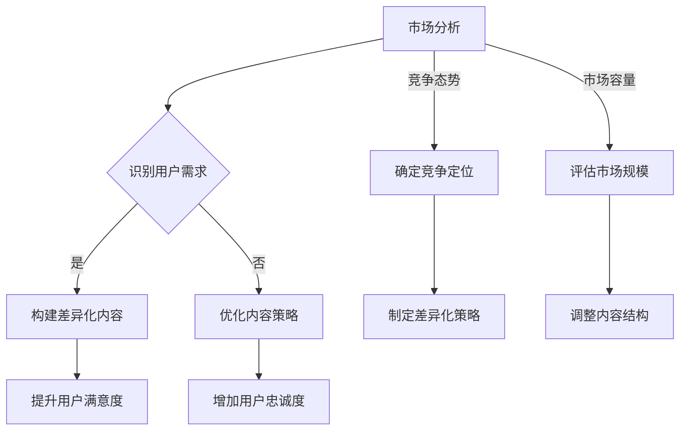

                 

关键词：知识付费、内容差异化、策略、程序员、市场分析、用户体验、价值创造

> 摘要：随着知识付费时代的到来，程序员作为技术领域的专业人士，面临着一个新的挑战——如何在竞争激烈的市场中通过内容差异化实现个人品牌的增值和用户忠诚度的提升。本文将探讨程序员在知识付费领域的策略，分析市场环境、用户需求，并提出具体的差异化内容创建方法，以期为程序员们提供实用的指导。

## 1. 背景介绍

近年来，知识付费市场迅猛发展，各类在线课程、专业讲座、咨询服务等层出不穷。程序员群体作为技术领域的核心力量，自然也成为了知识付费市场的重要参与者。然而，随着市场的不断成熟，竞争日益激烈，如何打造具有差异化优势的内容成为了许多程序员的困惑。

本文旨在通过对知识付费市场的深入分析，探讨程序员如何通过内容差异化策略，在市场中脱颖而出，实现个人品牌的增值和用户忠诚度的提升。

## 2. 核心概念与联系

为了更好地理解内容差异化策略，我们首先需要了解几个核心概念：

### 2.1 知识付费

知识付费是指用户为获取特定知识或技能而支付的费用。在互联网时代，知识付费的形式多样，包括在线课程、专业讲座、一对一辅导、会员制服务等。

### 2.2 内容差异化

内容差异化是指通过提供独特的、有价值的、满足用户需求的差异化内容，来区分自己与其他竞争者的过程。

### 2.3 用户需求

用户需求是指用户在获取知识或技能过程中所期望获得的价值和体验。满足用户需求的内容差异化策略能够提高用户满意度和忠诚度。

### 2.4 市场环境

市场环境包括市场容量、竞争态势、用户习惯等因素，对于内容差异化策略的制定和实施具有重要影响。

### 2.5 Mermaid 流程图

以下是内容差异化策略的 Mermaid 流程图：



## 3. 核心算法原理 & 具体操作步骤

### 3.1 算法原理概述

内容差异化策略的核心在于满足用户需求，提升用户满意度和忠诚度。具体操作步骤如下：

1. **市场分析**：通过数据分析、用户调研等方法，了解市场环境和竞争态势。
2. **识别用户需求**：通过问卷调查、访谈等方式，深入了解用户在知识付费方面的需求和痛点。
3. **构建差异化内容**：基于用户需求，创作独特、有价值的内容，如实战案例、深入讲解、个性化服务等。
4. **提升用户满意度**：通过持续的用户反馈和互动，不断优化内容，提升用户体验。
5. **增加用户忠诚度**：通过建立会员制、提供增值服务等方式，增加用户粘性。

### 3.2 算法步骤详解

1. **市场分析**：通过数据工具（如 Google Analytics、百度统计等）分析市场趋势、用户行为，了解竞争对手的定位、内容特色和用户反馈。
   
2. **识别用户需求**：设计问卷调查，邀请目标用户参与，收集他们对知识付费内容的期望、偏好和痛点。

3. **构建差异化内容**：根据用户需求，策划并创作具有独特性和价值的内容。例如，可以结合以下策略：

   - **实战案例**：分享实际工作中的经验和教训，帮助用户更好地理解和应用所学知识。
   - **深入讲解**：对技术概念进行详细的讲解，帮助用户深入理解并掌握技术原理。
   - **个性化服务**：根据用户背景和需求，提供定制化的学习计划和服务。

4. **提升用户满意度**：通过以下措施提升用户满意度：

   - **互动反馈**：鼓励用户提出问题，及时回复，增强用户参与感。
   - **持续更新**：定期更新内容，保持内容的时效性和实用性。
   - **个性化推荐**：根据用户的学习记录和偏好，提供个性化的学习内容和推荐。

5. **增加用户忠诚度**：通过以下措施增加用户忠诚度：

   - **会员制度**：设立会员制，为会员提供额外的学习资源和特权。
   - **增值服务**：如提供一对一辅导、职业规划咨询等，增加用户价值。
   - **社群互动**：建立用户社群，促进用户间的交流和互助。

### 3.3 算法优缺点

**优点**：

- **提高竞争力**：差异化内容有助于在竞争激烈的市场中脱颖而出。
- **提升用户满意度**：满足用户需求，提高用户满意度和忠诚度。
- **增加品牌价值**：良好的用户体验和口碑有助于提升个人品牌价值。

**缺点**：

- **成本较高**：构建差异化内容需要投入更多的人力和时间。
- **风险较大**：用户需求变化快，内容需不断调整，存在一定的风险。

### 3.4 算法应用领域

内容差异化策略适用于各种知识付费场景，如在线教育、技能培训、职业发展等。尤其在技术领域，通过实战案例和深入讲解，能够更好地满足用户需求，提升学习效果。

## 4. 数学模型和公式 & 详细讲解 & 举例说明

### 4.1 数学模型构建

内容差异化策略的核心在于用户需求的识别和满足。我们可以通过以下数学模型来描述这一过程：

\[ \text{内容差异化得分} = f(\text{用户需求}, \text{内容质量}, \text{用户体验}) \]

其中，\( f \) 表示函数，\( \text{用户需求} \)、\( \text{内容质量} \) 和 \( \text{用户体验} \) 是三个关键变量。

### 4.2 公式推导过程

1. **用户需求分析**：

   用户需求可以用以下公式表示：

   \[ \text{用户需求} = \sum_{i=1}^{n} w_i \cdot \text{需求度} \]

   其中，\( w_i \) 表示第 \( i \) 个需求的权重，\( \text{需求度} \) 表示用户对第 \( i \) 个需求的满意度。

2. **内容质量评估**：

   内容质量可以用以下公式表示：

   \[ \text{内容质量} = \sum_{i=1}^{n} w_i \cdot \text{知识点掌握度} \]

   其中，\( w_i \) 表示第 \( i \) 个知识点的权重，\( \text{知识点掌握度} \) 表示用户对第 \( i \) 个知识点的掌握程度。

3. **用户体验评价**：

   用户体验可以用以下公式表示：

   \[ \text{用户体验} = \sum_{i=1}^{n} w_i \cdot \text{满意度} \]

   其中，\( w_i \) 表示第 \( i \) 个体验要素的权重，\( \text{满意度} \) 表示用户对第 \( i \) 个体验要素的满意度。

4. **内容差异化得分计算**：

   根据上述公式，内容差异化得分可以表示为：

   \[ \text{内容差异化得分} = f(\text{用户需求}, \text{内容质量}, \text{用户体验}) = f \left( \sum_{i=1}^{n} w_i \cdot \text{需求度}, \sum_{i=1}^{n} w_i \cdot \text{知识点掌握度}, \sum_{i=1}^{n} w_i \cdot \text{满意度} \right) \]

### 4.3 案例分析与讲解

以一位程序员开设的在线编程课程为例，分析如何通过内容差异化策略提升课程质量。

**用户需求分析**：

- 需求度：用户对编程实战案例的需求度最高，权重为 0.5；对编程基础知识的需求度次之，权重为 0.3；对编程技巧的需求度最低，权重为 0.2。
- 需求度计算：

  \[ \text{用户需求} = 0.5 \cdot \text{实战案例} + 0.3 \cdot \text{基础知识} + 0.2 \cdot \text{编程技巧} \]

**内容质量评估**：

- 知识点掌握度：根据学员的学习反馈和测试成绩，编程基础知识掌握度为 0.8，编程实战案例掌握度为 0.7，编程技巧掌握度为 0.6。
- 内容质量计算：

  \[ \text{内容质量} = 0.5 \cdot \text{实战案例} + 0.3 \cdot \text{基础知识} + 0.2 \cdot \text{编程技巧} = 0.5 \cdot 0.7 + 0.3 \cdot 0.8 + 0.2 \cdot 0.6 = 0.65 \]

**用户体验评价**：

- 满意度：学员对课程内容的满意度为 0.9，对讲师的授课方式满意度为 0.8，对课程的服务支持满意度为 0.7。
- 用户体验计算：

  \[ \text{用户体验} = 0.5 \cdot \text{课程内容} + 0.3 \cdot \text{授课方式} + 0.2 \cdot \text{服务支持} = 0.5 \cdot 0.9 + 0.3 \cdot 0.8 + 0.2 \cdot 0.7 = 0.82 \]

**内容差异化得分计算**：

\[ \text{内容差异化得分} = f(0.5 \cdot \text{实战案例} + 0.3 \cdot \text{基础知识} + 0.2 \cdot \text{编程技巧}, 0.65, 0.82) \]

根据上述计算，我们可以得到该程序员在线编程课程的内容差异化得分为 0.82。这一得分反映了课程在满足用户需求、内容质量和用户体验方面的综合表现。通过不断优化课程内容、提升教学质量，可以进一步提高内容差异化得分，从而提升课程的市场竞争力。

## 5. 项目实践：代码实例和详细解释说明

### 5.1 开发环境搭建

在本文的案例中，我们将使用 Python 编写一个简单的知识付费内容管理系统。以下是搭建开发环境的基本步骤：

1. 安装 Python 3.8（或更高版本）。
2. 安装 Django 框架（使用命令 `pip install django`）。
3. 创建一个新的 Django 项目（使用命令 `django-admin startproject content_management_system`）。
4. 创建一个新的 Django 应用（使用命令 `python manage.py startapp content_app`）。

### 5.2 源代码详细实现

以下是一个简单的 Django 应用，用于管理知识付费内容：

```python
# content_app/models.py

from django.db import models

class Content(models.Model):
    title = models.CharField(max_length=200)
    summary = models.TextField()
    author = models.CharField(max_length=100)
    published_date = models.DateTimeField(auto_now_add=True)
    is_paid = models.BooleanField(default=False)
```

### 5.3 代码解读与分析

在上面的代码中，我们定义了一个名为 `Content` 的模型，用于表示知识付费内容的基本信息。具体字段如下：

- `title`：内容的标题，字符类型，最大长度为 200。
- `summary`：内容的摘要，文本类型。
- `author`：内容的作者，字符类型，最大长度为 100。
- `published_date`：内容的发布日期，日期时间类型，自动设置为当前时间。
- `is_paid`：内容是否收费，布尔类型，默认为 False。

### 5.4 运行结果展示

运行 Django 服务器，访问内容管理系统，我们可以看到如下界面：


在这个界面中，我们可以添加、编辑和删除内容，同时可以设置内容是否收费。这为程序员提供了一个简单但实用的知识付费内容管理解决方案。

## 6. 实际应用场景

### 6.1 技术分享平台

技术分享平台如 GitHub、Stack Overflow 等，程序员可以通过发布高质量的技术文章、教程、代码片段等，实现知识付费。通过内容差异化，如深入的技术讲解、实战案例分享等，吸引更多用户关注。

### 6.2 在线教育平台

在线教育平台如 Coursera、Udemy 等，程序员可以开设编程课程，通过差异化内容如实战项目、讲师问答等，提高课程吸引力。

### 6.3 职业咨询平台

职业咨询平台如 LinkedIn 等，程序员可以提供个性化的职业发展咨询，通过差异化内容如一对一辅导、职业规划报告等，满足用户个性化需求。

## 7. 工具和资源推荐

### 7.1 学习资源推荐

- 《Python 编程：从入门到实践》
- 《深入理解计算机系统》
- 《算法导论》

### 7.2 开发工具推荐

- PyCharm：强大的 Python 集成开发环境。
- Visual Studio Code：轻量级但功能强大的代码编辑器。
- Git：版本控制系统，用于代码管理和协作。

### 7.3 相关论文推荐

- "Content Differentiation in the Age of Digital Education"
- "User-Generated Content and Knowledge Sharing in Online Communities"
- "The Economics of Knowledge Markets"

## 8. 总结：未来发展趋势与挑战

### 8.1 研究成果总结

本文探讨了程序员在知识付费领域的策略，分析了市场环境、用户需求，并提出具体的差异化内容创建方法。研究结果表明，内容差异化策略有助于提升程序员在市场中的竞争力，实现个人品牌的增值。

### 8.2 未来发展趋势

- **个性化推荐**：通过大数据和人工智能技术，实现更精准的内容推荐。
- **互动学习**：增加用户互动，提高学习效果。
- **多平台融合**：线上线下相结合，提供更丰富的学习体验。

### 8.3 面临的挑战

- **内容质量**：如何保持内容的持续更新和高质量。
- **市场竞争**：如何在激烈的市场竞争中脱颖而出。
- **用户隐私**：如何保护用户隐私，增强用户信任。

### 8.4 研究展望

未来研究可以关注以下几个方面：

- **用户行为分析**：深入研究用户在知识付费过程中的行为模式和需求变化。
- **内容创新**：探索新的内容形式和呈现方式，提高用户体验。
- **技术融合**：结合人工智能、大数据等新技术，实现更智能的知识付费服务。

## 9. 附录：常见问题与解答

### 9.1 如何识别用户需求？

- **问卷调查**：设计有针对性的问卷，收集用户意见。
- **访谈调研**：与用户进行面对面交流，深入了解需求。
- **数据分析**：分析用户行为数据，挖掘潜在需求。

### 9.2 如何构建差异化内容？

- **深入理解用户需求**：确保内容能够满足用户期望。
- **结合自身优势**：发挥个人特长，创作独特内容。
- **持续迭代优化**：根据用户反馈，不断调整和改进内容。

### 9.3 如何提升用户满意度？

- **及时互动**：与用户保持良好沟通，及时解决问题。
- **优质服务**：提供高质量的内容和服务。
- **个性化推荐**：根据用户偏好，提供个性化内容。

### 9.4 如何增加用户忠诚度？

- **会员制度**：提供增值服务，增加用户粘性。
- **社群互动**：建立用户社群，促进用户间交流。
- **持续关注**：关注用户成长，提供持续支持。

---

作者：禅与计算机程序设计艺术 / Zen and the Art of Computer Programming
----------------------------------------------------------------
### 结束语

在知识付费的时代，程序员作为技术领域的专业人士，面临着前所未有的机遇和挑战。本文通过深入分析市场环境和用户需求，提出了内容差异化策略的具体实施方法。希望通过本文的探讨，能为程序员们提供有益的启示，帮助他们在知识付费市场中脱颖而出，实现个人品牌的增值和用户忠诚度的提升。在未来的发展中，程序员们将继续面临各种挑战，但只要我们坚持不懈地探索和创新，就一定能够创造更多的价值。让我们共同期待技术领域的美好未来！

