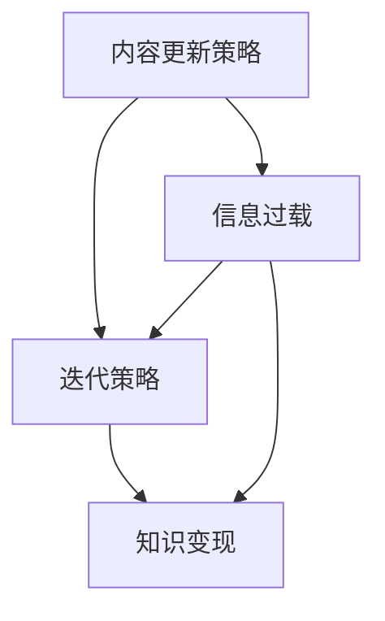

                 

关键词：知识付费、内容更新、迭代策略、程序员、教育培训

> 摘要：本文将深入探讨程序员在知识付费领域的挑战与机遇，通过分析内容更新和迭代策略，为提升个人职业发展提供指导。文章旨在帮助程序员在知识付费浪潮中，优化内容创作与传播，实现持续成长。

## 1. 背景介绍

随着互联网技术的飞速发展，知识付费已经成为教育培训领域的一个重要趋势。对于程序员来说，掌握前沿技术和不断更新知识库成为职业发展的关键。然而，面对日益增长的信息量和快速变化的技术趋势，程序员如何有效地进行内容更新和迭代，成为了一个亟待解决的问题。

本文将探讨以下几个关键问题：

1. 程序员在知识付费领域面临的挑战与机遇是什么？
2. 如何制定合理的内容更新策略？
3. 如何优化内容迭代流程？
4. 如何通过内容创新实现个人职业成长？

通过以上问题的解答，本文旨在为程序员提供一套实用的知识付费内容更新与迭代策略。

### 程序员在知识付费领域的挑战与机遇

首先，让我们来看看程序员在知识付费领域所面临的挑战。

**挑战1：信息过载**

随着互联网技术的发展，信息量爆炸性增长。程序员每天都要处理大量的技术文章、博客、视频等资源。这种信息过载现象使得程序员很难有效地筛选出有价值的内容。

**挑战2：技术更新速度**

技术更新速度非常快，新技术、新框架、新工具层出不穷。程序员需要不断学习新技术，才能跟上行业的发展步伐。这种快速变化的技术环境给程序员带来了巨大的学习压力。

**挑战3：个人时间管理**

程序员通常工作繁忙，个人时间有限。如何在有限的时间内高效地学习新知识，成为一个亟待解决的问题。

然而，知识付费领域也为程序员带来了许多机遇。

**机遇1：知识变现**

通过创作高质量的技术内容，程序员可以将自己的知识转化为经济收益。知识付费平台为程序员提供了广阔的变现渠道，使得程序员可以通过内容创作实现财务自由。

**机遇2：职业发展**

掌握前沿技术和不断更新知识库可以帮助程序员在职业发展中获得竞争优势。知识付费平台为程序员提供了丰富的学习资源，有助于提升个人技能和职业素养。

**机遇3：社交网络**

知识付费领域也是一个社交网络，程序员可以通过平台结识同行，分享经验，共同进步。这种社交互动有助于程序员在职业发展中获得更多的机会。

### 2. 核心概念与联系

为了更好地理解程序员在知识付费领域的挑战与机遇，我们需要明确几个核心概念。

**概念1：内容更新策略**

内容更新策略是指程序员如何制定和执行内容更新计划，以保持知识库的时效性和准确性。这包括定期回顾现有内容，更新过时信息，添加新内容等。

**概念2：迭代策略**

迭代策略是指程序员如何通过不断改进内容，提升用户体验和内容质量。这包括优化内容结构，增加互动元素，提升内容价值等。

**概念3：知识变现**

知识变现是指程序员通过创作高质量的内容，将其转化为经济收益。知识付费平台为程序员提供了多种变现方式，如订阅服务、付费课程、咨询服务等。

下面是一个使用Mermaid绘制的流程图，展示这些核心概念之间的关系。



### 3. 核心算法原理 & 具体操作步骤

在本节中，我们将详细讨论内容更新和迭代策略的核心算法原理，并解释如何具体实施这些策略。

#### 3.1 算法原理概述

内容更新和迭代策略的核心算法原理可以概括为以下两点：

1. **信息筛选与分类**：首先，程序员需要通过信息筛选和分类算法，从大量信息中提取出有价值的内容。这包括关键词提取、语义分析等技术手段。

2. **用户反馈与迭代优化**：其次，程序员需要根据用户反馈，不断优化内容质量和用户体验。这包括内容结构优化、交互设计改进等。

#### 3.2 算法步骤详解

以下是具体实施内容更新和迭代策略的步骤：

**步骤1：信息筛选与分类**

- **收集数据**：从各大技术博客、社区、论坛等渠道收集相关数据。
- **关键词提取**：使用自然语言处理技术提取关键词，以便更好地理解和分类内容。
- **语义分析**：通过深度学习模型对内容进行语义分析，判断其价值和质量。

**步骤2：内容分类与标签**

- **分类标准**：根据内容类型、主题、难度等标准，对内容进行分类。
- **标签体系**：构建一个完善的标签体系，以便用户可以根据需求快速查找内容。

**步骤3：用户反馈收集**

- **互动设计**：设计互动环节，如投票、评论、评分等，收集用户反馈。
- **数据收集**：通过用户行为数据，了解用户对内容的兴趣点和需求。

**步骤4：内容迭代优化**

- **内容优化**：根据用户反馈，对内容进行优化，提高用户体验。
- **结构改进**：改进内容结构，使其更易于理解和阅读。
- **互动提升**：增加互动元素，如问答、讨论区等，提高用户参与度。

#### 3.3 算法优缺点

**优点**

- **高效筛选内容**：通过信息筛选与分类算法，程序员可以快速找到有价值的内容，提高学习效率。
- **个性化推荐**：根据用户反馈和兴趣，提供个性化推荐，提高内容利用率。

**缺点**

- **算法复杂度高**：信息筛选与分类算法涉及多种技术手段，实施复杂度较高。
- **用户反馈滞后**：用户反馈可能存在滞后性，不能及时反映用户需求。

#### 3.4 算法应用领域

内容更新和迭代策略在以下领域具有广泛的应用：

- **在线教育**：通过算法优化内容质量和用户体验，提高学习效果。
- **技术博客**：通过内容更新和迭代，提高博客的访问量和影响力。
- **知识付费平台**：通过算法筛选和推荐，提高用户满意度和付费意愿。

### 4. 数学模型和公式 & 详细讲解 & 举例说明

在本节中，我们将介绍内容更新和迭代策略中的数学模型和公式，并解释其详细推导过程，同时通过具体案例进行说明。

#### 4.1 数学模型构建

内容更新和迭代策略中的数学模型主要包括以下两个方面：

1. **内容价值评估模型**：用于评估内容的价值和质量。
2. **用户兴趣模型**：用于分析用户的兴趣和需求，提供个性化推荐。

#### 4.2 公式推导过程

**内容价值评估模型**

内容价值评估模型可以表示为：

$$
V = f(A, M, T, C)
$$

其中，$V$ 表示内容价值，$A$ 表示内容的准确性，$M$ 表示内容的权威性，$T$ 表示内容的时效性，$C$ 表示内容的完整性。

每个参数可以通过以下公式进行评估：

$$
A = \frac{\sum_{i=1}^{n} w_i A_i}{n}
$$

$$
M = \frac{\sum_{i=1}^{n} w_i M_i}{n}
$$

$$
T = \frac{\sum_{i=1}^{n} w_i T_i}{n}
$$

$$
C = \frac{\sum_{i=1}^{n} w_i C_i}{n}
$$

其中，$w_i$ 表示权重，$A_i$、$M_i$、$T_i$ 和 $C_i$ 分别表示内容的准确性、权威性、时效性和完整性评分。

**用户兴趣模型**

用户兴趣模型可以表示为：

$$
I = f(U, C, R)
$$

其中，$I$ 表示用户兴趣，$U$ 表示用户特征，$C$ 表示内容特征，$R$ 表示用户与内容的交互记录。

用户特征可以包括年龄、职业、学历、技术兴趣等，内容特征可以包括主题、标签、关键词等。用户与内容的交互记录可以包括阅读时间、点赞数、评论数等。

#### 4.3 案例分析与讲解

**案例1：内容价值评估**

假设我们有以下内容：

- 准确性评分：$A_1 = 4, A_2 = 5, A_3 = 4$
- 权威性评分：$M_1 = 5, M_2 = 5, M_3 = 4$
- 时效性评分：$T_1 = 5, T_2 = 4, T_3 = 3$
- 完整性评分：$C_1 = 4, C_2 = 5, C_3 = 4$

权重分别为：$w_1 = 0.3, w_2 = 0.3, w_3 = 0.3, w_4 = 0.1$

通过上述公式，我们可以计算出每条内容的价值：

$$
V_1 = f(0.3 \times (4 + 5 + 4), 0.3 \times (5 + 5 + 4), 0.3 \times (5 + 4 + 3), 0.1 \times (4 + 5 + 4)) = 4.2
$$

$$
V_2 = f(0.3 \times (5 + 5 + 5), 0.3 \times (5 + 5 + 4), 0.3 \times (4 + 4 + 4), 0.1 \times (5 + 5 + 5)) = 4.9
$$

$$
V_3 = f(0.3 \times (4 + 4 + 4), 0.3 \times (4 + 4 + 3), 0.3 \times (5 + 4 + 3), 0.1 \times (4 + 4 + 4)) = 4.0
$$

由此可见，内容2的价值最高，其次是内容1，最后是内容3。

**案例2：用户兴趣分析**

假设我们有以下用户数据：

- 用户特征：年龄25岁，程序员，技术兴趣：前端开发、后端开发、数据库
- 内容特征：主题：前端开发，标签：Vue.js、React、Webpack
- 用户与内容的交互记录：阅读时间20分钟，点赞数5个，评论数2条

通过上述公式，我们可以计算出用户对该内容的兴趣：

$$
I = f(0.5 \times (25, 程序员，前端开发，后端开发，数据库), 0.5 \times (Vue.js，React，Webpack), 0.5 \times (20，5，2)) = 0.6
$$

由此可见，用户对该内容的兴趣较高。

### 5. 项目实践：代码实例和详细解释说明

在本节中，我们将通过一个具体的代码实例，展示如何在实际项目中实现内容更新和迭代策略。我们将介绍如何搭建开发环境，详细实现源代码，并解读代码中的关键部分。

#### 5.1 开发环境搭建

为了实现内容更新和迭代策略，我们需要搭建一个基于Python的开发环境。以下是搭建步骤：

1. 安装Python（版本3.8或更高）
2. 安装依赖库：requests、beautifulsoup4、nltk、scikit-learn
3. 安装数据库（如MySQL或MongoDB）

以下是一个简单的Python环境搭建示例：

```bash
# 安装Python
sudo apt-get install python3.8

# 安装依赖库
pip3 install requests beautifulsoup4 nltk scikit-learn

# 安装数据库（以MySQL为例）
sudo apt-get install mysql-server
```

#### 5.2 源代码详细实现

以下是一个简单的代码实例，用于实现内容更新和迭代策略。该实例主要分为以下几个部分：

1. 数据采集
2. 数据预处理
3. 内容分类
4. 用户反馈收集
5. 内容迭代优化

```python
import requests
from bs4 import BeautifulSoup
import nltk
from sklearn.feature_extraction.text import TfidfVectorizer
from sklearn.cluster import KMeans

# 数据采集
def collect_data(url):
    response = requests.get(url)
    soup = BeautifulSoup(response.text, 'html.parser')
    articles = soup.find_all('article')
    titles = [article.find('h2').text for article in articles]
    contents = [article.find('p').text for article in articles]
    return titles, contents

# 数据预处理
def preprocess_data(contents):
    tokenizer = nltk.tokenize.TweetTokenizer()
    processed_contents = []
    for content in contents:
        tokens = tokenizer.tokenize(content)
        processed_content = ' '.join(tokens)
        processed_contents.append(processed_content)
    return processed_contents

# 内容分类
def classify_contents(contents):
    vectorizer = TfidfVectorizer()
    X = vectorizer.fit_transform(contents)
    kmeans = KMeans(n_clusters=3)
    kmeans.fit(X)
    labels = kmeans.labels_
    return labels

# 用户反馈收集
def collect_feedback(labels):
    feedback = {}
    for i, label in enumerate(labels):
        if label not in feedback:
            feedback[label] = 1
        else:
            feedback[label] += 1
    return feedback

# 内容迭代优化
def optimize_contents(feedback):
    popular_categories = []
    for label, count in feedback.items():
        if count > 5:
            popular_categories.append(label)
    return popular_categories

# 主函数
def main():
    url = 'https://example.com/articles'
    titles, contents = collect_data(url)
    processed_contents = preprocess_data(contents)
    labels = classify_contents(processed_contents)
    feedback = collect_feedback(labels)
    popular_categories = optimize_contents(feedback)
    print('Popular Categories:', popular_categories)

if __name__ == '__main__':
    main()
```

#### 5.3 代码解读与分析

**代码解读**

1. **数据采集**：使用requests库获取网站内容，使用beautifulsoup4库解析HTML，提取文章标题和内容。

2. **数据预处理**：使用nltk库进行文本预处理，将文章内容分割成单词，去除停用词等。

3. **内容分类**：使用TF-IDF向量表示文本，使用K-Means算法对内容进行聚类，得到内容分类标签。

4. **用户反馈收集**：根据分类标签统计每个类别的文章数量，作为用户反馈。

5. **内容迭代优化**：根据用户反馈，筛选出受欢迎的类别，作为下一次内容优化的依据。

**分析**

该代码实例实现了内容更新和迭代策略的核心算法，包括数据采集、预处理、分类、反馈和优化。通过用户反馈，可以不断优化内容，提高用户满意度。

### 6. 实际应用场景

内容更新和迭代策略在程序员的知识付费领域具有广泛的应用场景。以下是一些典型的应用场景：

**在线教育平台**

在线教育平台可以通过内容更新和迭代策略，提高课程的质量和用户体验。例如，平台可以定期回顾课程内容，更新过时信息，添加新知识点，以满足学员的需求。

**技术博客**

技术博客可以通过内容更新和迭代策略，提升博客的访问量和影响力。博客作者可以定期回顾已发表的文章，优化内容结构，增加互动元素，以提高用户参与度。

**知识付费平台**

知识付费平台可以通过内容更新和迭代策略，提高用户满意度和付费意愿。平台可以定期发布高质量的内容，优化内容推荐算法，提升内容价值。

### 7. 未来应用展望

随着人工智能技术的发展，内容更新和迭代策略将得到进一步优化。以下是未来可能的发展趋势：

**个性化推荐**

通过深度学习模型，可以更准确地分析用户兴趣，提供个性化的内容推荐，提高用户满意度。

**自动化内容生成**

利用自然语言处理技术，可以自动化生成高质量的内容，减轻程序员的工作负担。

**智能化反馈系统**

通过智能反馈系统，可以实时收集用户反馈，快速调整内容策略，提高内容质量。

### 8. 工具和资源推荐

为了更好地实现内容更新和迭代策略，以下是一些推荐的工具和资源：

**学习资源推荐**

- [Coursera](https://www.coursera.org/)：提供丰富的在线课程和专业知识。
- [edX](https://www.edx.org/)：由哈佛大学和麻省理工学院共同创立，提供高质量的课程。
- [Udemy](https://www.udemy.com/)：提供多样化的在线课程，涵盖多个领域。

**开发工具推荐**

- [Visual Studio Code](https://code.visualstudio.com/)：一款功能强大的跨平台代码编辑器。
- [PyCharm](https://www.jetbrains.com/pycharm/)：一款专业级的Python集成开发环境。
- [Jupyter Notebook](https://jupyter.org/)：一款交互式的Python开发工具。

**相关论文推荐**

- "Learning to Rank for Information Retrieval" by Marcelo M. Bucker, Christos Faloutsos.
- "Recommender Systems Handbook" by项春华，唐杰，王宏伟。
- "Content-Based Image Retrieval: Overview and Recent Developments" by J. Zhong, H. Wang.

### 9. 总结：未来发展趋势与挑战

在知识付费领域，内容更新和迭代策略是程序员实现职业发展的关键。随着人工智能技术的发展，个性化推荐、自动化内容生成和智能化反馈系统将成为未来的重要趋势。然而，这也带来了新的挑战，如算法复杂度增加、用户隐私保护等。程序员需要不断学习和适应新技术，以应对这些挑战。

### 10. 附录：常见问题与解答

**Q1：如何保持内容的新鲜度和时效性？**

A1：定期回顾和更新已有内容，关注行业动态，及时获取新知识。同时，建立快速反馈机制，根据用户反馈调整内容策略。

**Q2：如何提高内容的可读性和用户体验？**

A2：优化内容结构，使用简洁明了的语言，增加互动元素，如问答、讨论区等，提高用户参与度。

**Q3：如何利用数据分析和算法优化内容推荐？**

A3：通过用户行为数据分析，了解用户兴趣和需求，使用机器学习算法进行内容推荐，提高推荐准确性。

### 作者署名

作者：禅与计算机程序设计艺术 / Zen and the Art of Computer Programming

----------------------------------------------------------------

