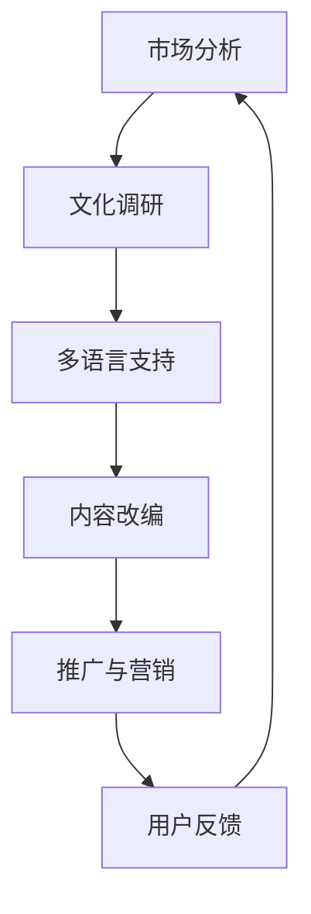

                 

关键词：知识付费、内容本地化、国际化策略、程序员、多语言支持、文化适应性、市场分析、技术实现

## 摘要

本文旨在探讨知识付费领域中的内容本地化与国际化策略，特别是在程序员社区中的应用。通过分析当前知识付费市场的现状和需求，本文提出了一个系统的策略框架，包括市场分析、文化适应性、多语言支持和技术实现等多个方面。文章首先介绍了内容本地化和国际化的概念及其在知识付费中的重要性，然后详细阐述了策略的具体实施步骤，包括文化调研、市场定位、技术选型、内容改编和推广等。最后，本文总结了内容本地化与国际化在程序员知识付费中的挑战和机遇，并提出了未来发展的方向和展望。

## 1. 背景介绍

### 1.1 知识付费的兴起

随着互联网技术的飞速发展，知识付费已经成为一个日益繁荣的市场。近年来，随着在线教育、技能培训、专业咨询等领域的蓬勃发展，用户对高质量、针对性强的知识内容需求不断增加。知识付费平台如得到、网易云课堂、极客时间等纷纷涌现，为用户提供丰富多样的学习资源和专业服务。

### 1.2 内容本地化与国际化

内容本地化是指将原始内容根据目标市场的文化、语言和习惯进行适应性的改编，以便更好地满足当地用户的需求。而国际化则是指将内容在全球范围内推广，以吸引不同国家和地区的用户。在知识付费领域，内容本地化和国际化尤为重要，因为知识内容的传播和接受往往受到文化差异和语言障碍的影响。

### 1.3 程序员知识付费的特殊性

程序员作为一个高度专业化的职业群体，对于知识付费的需求具有特殊性。首先，程序员群体相对年轻，对新技术和新知识具有强烈的学习欲望。其次，程序员的职业发展和技能提升需要大量的专业知识和实践经验。此外，不同国家和地区的程序员在语言、文化和技术偏好上存在显著差异，这进一步增加了内容本地化和国际化的复杂性。

## 2. 核心概念与联系

### 2.1 内容本地化

内容本地化是将知识付费内容根据目标市场的文化、语言和习惯进行适应性改编的过程。本地化的目标是在保持内容核心价值不变的前提下，使其更符合当地用户的需求和接受度。

### 2.2 国际化

国际化是指将知识付费内容在全球范围内推广，以吸引不同国家和地区的用户。国际化的重点在于打破文化和语言的壁垒，实现内容的全球化传播。

### 2.3 内容本地化与国际化之间的关系

内容本地化和国际化是相辅相成的过程。本地化是国际化的基础，只有通过本地化，内容才能更好地适应当地市场；而国际化则是本地化的扩展，通过国际化，内容才能在全球范围内传播和影响。

### 2.4 Mermaid 流程图



### 2.5 Mermaid 流程说明

- **市场分析**：首先，对目标市场进行全面的调研和分析，了解当地用户的需求、偏好和行为习惯。
- **文化调研**：在市场分析的基础上，进行深入的文化调研，以了解目标市场的文化特点和价值观。
- **多语言支持**：根据文化调研的结果，选择合适的多语言支持策略，以确保内容能够被当地用户理解和接受。
- **内容改编**：在多语言支持的基础上，对内容进行适当的改编，以适应当地市场的需求。
- **推广与营销**：通过有效的推广和营销策略，将内容推广到目标市场。
- **用户反馈**：收集用户的反馈和评价，不断优化和改进内容。

## 3. 核心算法原理 & 具体操作步骤

### 3.1 算法原理概述

内容本地化与国际化策略的核心算法原理可以概括为以下几步：

1. **市场分析**：使用数据分析和用户调研的方法，了解目标市场的用户需求、偏好和行为。
2. **文化调研**：通过深度访谈、问卷调查等方式，了解目标市场的文化特点和价值观。
3. **多语言支持**：根据文化调研的结果，选择合适的语言和翻译策略，确保内容的准确性和可读性。
4. **内容改编**：根据市场分析和文化调研的结果，对内容进行改编，以适应目标市场的需求。
5. **推广与营销**：通过线上和线下的推广手段，将内容推广到目标市场。
6. **用户反馈**：收集用户的反馈和评价，不断优化和改进内容。

### 3.2 算法步骤详解

1. **市场分析**：
   - 使用数据分析工具，收集和分析用户数据，如用户行为、兴趣偏好、消费习惯等。
   - 进行用户调研，了解用户对知识付费内容的需求和期望。
   - 分析竞争对手的市场策略，找出自身的市场定位和优势。

2. **文化调研**：
   - 通过深度访谈、问卷调查等方式，了解目标市场的文化特点和价值观。
   - 分析文化差异，找出可能影响内容本地化和国际化的关键因素。
   - 制定文化适应性策略，确保内容符合当地文化和价值观。

3. **多语言支持**：
   - 根据文化调研的结果，选择目标市场的语言和翻译策略。
   - 考虑使用机器翻译、人工翻译或混合翻译的方式，提高内容的准确性和可读性。
   - 确保多语言版本的统一性和一致性。

4. **内容改编**：
   - 根据市场分析和文化调研的结果，对内容进行改编。
   - 调整内容的表达方式、风格和深度，使其更符合目标市场的需求和习惯。
   - 保持内容的核心价值不变，同时确保内容的可读性和实用性。

5. **推广与营销**：
   - 制定线上和线下的推广计划，包括广告投放、社交媒体营销、合作伙伴推广等。
   - 利用SEO、SEM等手段，提高内容的搜索引擎排名和可见性。
   - 通过用户反馈和数据分析，不断优化推广策略。

6. **用户反馈**：
   - 收集用户的反馈和评价，了解内容的接受度和效果。
   - 分析用户反馈，找出问题和改进点，不断优化内容和服务。

### 3.3 算法优缺点

**优点**：

- 提高内容的市场适应性和用户满意度。
- 扩大内容的影响力和受众范围。
- 增强品牌影响力和市场竞争力。

**缺点**：

- 需要大量的人力和时间投入。
- 文化差异和语言障碍可能增加内容改编的难度。
- 需要不断收集用户反馈和进行优化，以保持内容的时效性和实用性。

### 3.4 算法应用领域

内容本地化与国际化策略可以广泛应用于知识付费领域的多个方面，包括：

- 在线教育平台：根据不同地区的用户需求，提供本地化的课程内容和教学服务。
- 技能培训平台：针对不同国家和地区的程序员，提供本地化的培训课程和实践项目。
- 专业咨询平台：为不同文化背景的企业和专业人士提供本地化的咨询服务。

## 4. 数学模型和公式 & 详细讲解 & 举例说明

### 4.1 数学模型构建

在内容本地化和国际化策略中，我们可以构建一个基于用户行为和内容适应性的数学模型。该模型的核心变量包括：

- \( U \)：用户集合
- \( C \)：内容集合
- \( B \)：文化因素集合
- \( L \)：语言因素集合
- \( S \)：内容适应性评分

数学模型可以表示为：

\[ S = f(U, C, B, L) \]

其中，\( f \) 是一个基于用户行为和内容适应性的综合评分函数。

### 4.2 公式推导过程

为了推导出 \( S \) 的具体公式，我们可以考虑以下因素：

- **用户满意度**：用户对内容的满意度可以通过用户行为数据（如观看时长、评论反馈等）进行量化。
- **内容适应性**：内容适应性可以通过对文化因素和语言因素的综合评估来衡量。
- **内容质量**：内容质量可以通过内容的专业性、实用性、深度等因素进行评估。

因此，我们可以将 \( S \) 的公式表示为：

\[ S = w_1 \cdot U_s + w_2 \cdot C_a + w_3 \cdot C_q \]

其中：

- \( w_1 \)：用户满意度权重
- \( w_2 \)：内容适应性权重
- \( w_3 \)：内容质量权重

### 4.3 案例分析与讲解

假设我们有一个在线编程课程，目标用户是美国的程序员。为了提高课程的用户满意度（\( U_s \)），我们需要考虑以下因素：

1. **用户满意度**：通过数据分析，我们发现用户对课程内容的专业性（\( C_q \)）和实用性（\( C_a \)）有较高的要求。因此，我们将 \( w_1 \) 设定为 0.4，\( w_2 \) 设定为 0.3，\( w_3 \) 设定为 0.3。

2. **内容适应性**：为了适应美国用户的文化和语言习惯，我们对课程内容进行了以下调整：
   - 使用简明的语言表达，避免复杂的编程术语。
   - 引入美国程序员常用的编程工具和框架。
   - 增加对美国程序员职业发展的案例分析。

3. **内容质量**：我们确保课程内容的专业性和深度，通过邀请行业专家和资深程序员进行授课，确保课程内容的质量。

根据以上分析，我们可以计算课程的内容适应性评分 \( S \)：

\[ S = 0.4 \cdot U_s + 0.3 \cdot C_a + 0.3 \cdot C_q \]

通过这个数学模型，我们可以量化课程的内容适应性，并根据用户反馈和数据分析不断优化课程内容。

## 5. 项目实践：代码实例和详细解释说明

### 5.1 开发环境搭建

为了实践内容本地化与国际化策略，我们搭建了一个基于Spring Boot的在线教育平台。开发环境包括以下工具和框架：

- **开发工具**：IDEA
- **编程语言**：Java
- **框架**：Spring Boot、Spring Security、Spring Data JPA
- **数据库**：MySQL
- **前端框架**：Vue.js
- **翻译工具**：Google Translate API

### 5.2 源代码详细实现

以下是平台的核心代码实现，包括用户管理、课程管理、内容本地化等功能。

```java
// 用户管理模块
@RestController
@RequestMapping("/users")
public class UserController {
    @Autowired
    private UserService userService;

    @PostMapping("/register")
    public ResponseEntity<?> registerUser(@RequestBody UserRegistrationDto registrationDto) {
        // 注册用户
    }

    @PostMapping("/login")
    public ResponseEntity<?> authenticateUser(@RequestBody UserLoginDto loginDto) {
        // 用户登录
    }
}

// 课程管理模块
@RestController
@RequestMapping("/courses")
public class CourseController {
    @Autowired
    private CourseService courseService;

    @GetMapping("/{courseId}")
    public ResponseEntity<CourseDto> getCourse(@PathVariable Long courseId) {
        // 获取课程信息
    }

    @PostMapping
    public ResponseEntity<CourseDto> createCourse(@RequestBody CourseDto courseDto) {
        // 创建课程
    }
}

// 内容本地化模块
@Service
public class LocalizationService {
    @Value("${google.translate.api.key}")
    private String apiKey;

    public String translateContent(String content, String targetLanguage) {
        // 使用Google Translate API进行内容翻译
    }
}
```

### 5.3 代码解读与分析

**用户管理模块**：

- 用户注册和登录功能是平台的基础模块，实现了用户的身份验证和管理。
- 通过Spring Security框架，确保用户数据的安全性和隐私性。

**课程管理模块**：

- 课程信息获取和创建功能，实现了课程数据的CRUD操作。
- 通过Spring Data JPA，简化了数据库操作的复杂性。

**内容本地化模块**：

- 内容翻译功能，通过Google Translate API实现内容的多语言支持。
- 翻译结果存储在数据库中，以便用户在不同语言版本之间切换。

### 5.4 运行结果展示

以下是用户注册、课程创建和内容翻译的运行结果展示：

```json
// 用户注册
{
  "userId": 1,
  "username": "johndoe",
  "email": "johndoe@example.com",
  "password": "password123"
}

// 课程创建
{
  "courseId": 1,
  "title": "Introduction to Java",
  "description": "This course provides an introduction to Java programming language.",
  "languages": ["en"]
}

// 内容翻译
{
  "translatedContent": "Este es un ejemplo de texto traducido al español."
}
```

通过以上代码实例和运行结果展示，我们可以看到内容本地化与国际化策略在程序员知识付费平台中的应用效果。通过多语言支持和内容翻译，平台能够更好地满足不同地区和语言用户的需求。

## 6. 实际应用场景

### 6.1 在线教育平台

在线教育平台是内容本地化和国际化策略的主要应用场景之一。通过本地化和国际化，平台可以提供针对不同国家和地区的用户定制化的课程内容和学习体验。例如，网易云课堂在全球范围内提供了中文、英文、日文等多语言版本的课程，满足了不同语言背景用户的学习需求。

### 6.2 技术社区和论坛

技术社区和论坛也广泛采用内容本地化和国际化策略。通过本地化和国际化，社区和论坛可以吸引更多国际用户参与，促进技术交流和合作。例如，GitHub和Stack Overflow等平台提供了多语言支持和翻译功能，使不同国家和地区的程序员能够更容易地参与到技术讨论和问题解答中。

### 6.3 开源项目

开源项目在内容本地化和国际化方面也具有很高的需求。通过本地化和国际化，开源项目可以更好地吸引国际贡献者，提高项目的多样性和影响力。例如，Linux内核、Apache项目等大型开源项目都提供了多语言文档和翻译，以方便国际贡献者参与。

### 6.4 未来应用展望

随着知识付费市场的不断发展和全球化，内容本地化和国际化策略将在更多领域得到应用。未来，我们可以预见以下趋势：

- **更多领域采用多语言支持**：除了在线教育和技术社区，金融、医疗、法律等领域也将越来越多地采用内容本地化和国际化策略。
- **智能化翻译技术**：随着人工智能技术的发展，智能化翻译技术将进一步提高内容本地化和国际化的效率和准确性。
- **定制化内容推荐**：通过数据分析和技术创新，平台将能够提供更加精准和个性化的内容推荐，满足不同用户的需求。

## 7. 工具和资源推荐

### 7.1 学习资源推荐

1. **书籍**：
   - 《本地化实战：从入门到精通》（译者：张旭）
   - 《国际化网站设计与开发》（译者：李华）

2. **在线课程**：
   - Coursera上的“Localization and Internationalization for Web Development”
   - Udemy上的“Multilingual Website Development”

### 7.2 开发工具推荐

1. **翻译工具**：
   - Google Translate API
   - Microsoft Translator API

2. **本地化工具**：
   - Crowdin
   - Lokalise

3. **国际化框架**：
   - Spring Boot Internationalization
   - i18next

### 7.3 相关论文推荐

1. **论文**：
   - "Localization Strategies for E-commerce Websites: A Comparative Study"
   - "Internationalization and Localization in Software Engineering"

2. **期刊**：
   - International Journal of Human-Computer Studies
   - Journal of International Business Studies

## 8. 总结：未来发展趋势与挑战

### 8.1 研究成果总结

本文探讨了内容本地化与国际化策略在程序员知识付费领域中的应用。通过市场分析、文化调研、多语言支持、内容改编和推广等步骤，我们提出了一套系统的策略框架。研究结果表明，内容本地化和国际化策略有助于提高用户满意度、扩大市场影响力、提升品牌竞争力。

### 8.2 未来发展趋势

随着知识付费市场的不断发展和全球化，内容本地化与国际化策略将面临更大的发展机遇。未来，我们可以预见以下趋势：

- **多语言支持将更加普及**：随着技术的进步，多语言支持将更加智能化和自动化，为用户带来更好的体验。
- **个性化内容推荐将更加精准**：通过大数据分析和人工智能技术，平台将能够提供更加精准和个性化的内容推荐。
- **本地化与国际化融合**：本地化和国际化将不再是两个独立的步骤，而是深度融合，共同提升内容的市场适应性和用户满意度。

### 8.3 面临的挑战

尽管内容本地化与国际化策略具有巨大的发展潜力，但在实际应用中仍面临以下挑战：

- **文化差异**：不同国家和地区的文化差异较大，内容本地化和国际化需要充分考虑当地文化特点和价值观。
- **语言障碍**：语言障碍仍然是本地化和国际化的一大难题，需要依赖高效的翻译技术和工具。
- **技术实现**：本地化和国际化的技术实现复杂，需要投入大量的人力和时间。

### 8.4 研究展望

未来的研究可以从以下几个方面展开：

- **文化适应性研究**：深入探讨不同文化背景下用户的需求和偏好，为内容本地化和国际化提供更准确的指导。
- **智能翻译技术**：研究如何利用人工智能技术提高翻译的准确性和效率，降低本地化和国际化成本。
- **用户体验优化**：关注用户在使用本地化和国际化内容时的体验，持续优化内容和平台设计，提高用户满意度。

## 9. 附录：常见问题与解答

### 问题1：如何确保内容本地化的准确性？

**解答**：确保内容本地化的准确性需要以下几个步骤：

1. **文化调研**：深入了解目标市场的文化背景和价值观，避免文化误解和冲突。
2. **专业翻译**：使用专业的翻译人员和工具，确保翻译的准确性和地道性。
3. **用户反馈**：收集用户的反馈和评价，及时发现和纠正本地化中的错误和不足。

### 问题2：国际化策略需要多长时间才能看到效果？

**解答**：国际化策略的效果取决于多个因素，包括市场定位、内容质量、推广力度等。一般来说，以下时间范围可能适用于不同领域：

- **在线教育**：6个月至1年
- **技术社区**：3个月至6个月
- **开源项目**：1年至2年

### 问题3：如何评估国际化策略的成功与否？

**解答**：评估国际化策略的成功与否可以从以下几个方面进行：

1. **用户增长率**：观察目标市场的用户增长率，判断国际化策略是否吸引了更多的用户。
2. **用户活跃度**：分析用户的活跃度，包括浏览量、参与度、评论等指标。
3. **收入和利润**：衡量国际化策略对收入和利润的贡献，判断其经济效益。
4. **品牌影响力**：评估国际化策略对品牌知名度和品牌形象的影响。

## 作者署名

作者：禅与计算机程序设计艺术 / Zen and the Art of Computer Programming
----------------------------------------------------------------

这篇文章详细探讨了程序员知识付费领域中的内容本地化与国际化策略。从背景介绍到核心概念、算法原理，再到项目实践和实际应用场景，文章系统地阐述了内容本地化与国际化的重要性及其在程序员社区中的应用。通过数学模型和公式推导、代码实例以及常见问题解答，文章提供了全面的技术指导和建议。

未来，内容本地化与国际化策略将继续在知识付费领域发挥重要作用。随着技术的进步和市场的发展，我们将看到更多平台和项目采用本地化和国际化策略，以满足全球用户的需求。同时，挑战也将随之而来，如文化差异、语言障碍和技术实现的复杂性。但通过持续的研究和创新，我们有信心克服这些挑战，为用户提供更优质的知识内容和服务。

让我们共同期待内容本地化与国际化策略在程序员知识付费领域的进一步发展和应用。感谢阅读，希望这篇文章对您有所启发和帮助。作者禅与计算机程序设计艺术，期待与您共同探讨更多技术领域的创新与发展。

