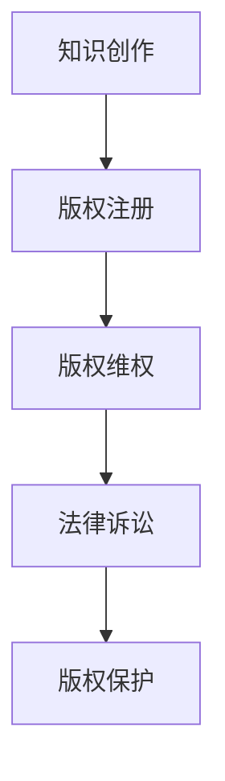
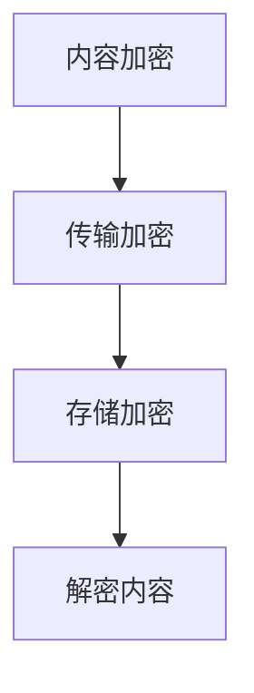
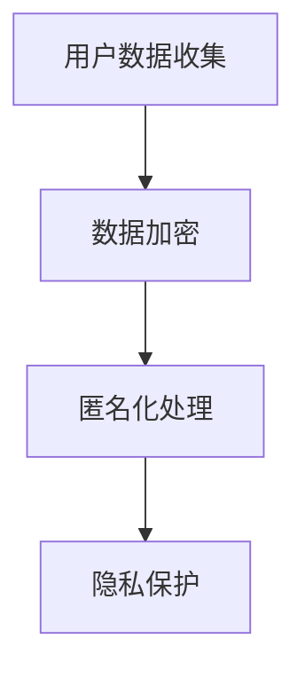
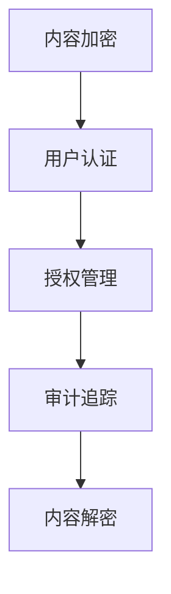

                 

关键词：内容版权保护、知识付费、程序员、算法、技术博客、法律框架、加密技术、用户隐私、数据分析

> 摘要：本文将深入探讨程序员知识付费领域的版权保护问题，分析现有法律框架、加密技术和用户隐私保护策略，并提出一套全面的内容版权保护策略，以促进知识付费市场的健康发展。

## 1. 背景介绍

随着互联网技术的发展，知识付费市场呈现出爆炸式增长。程序员作为互联网时代的重要参与者，其知识付费产品也日益丰富。然而，内容版权保护问题成为制约知识付费市场发展的重要因素。未经授权的内容复制、传播和滥用行为频繁发生，严重损害了知识创作者的权益。因此，制定一套有效的版权保护策略具有重要意义。

## 2. 核心概念与联系

### 2.1 法律框架

内容版权保护的法律框架是保障知识付费市场健康发展的重要基石。主要涉及《著作权法》、《版权法》等相关法律法规。以下是一个简化的 Mermaid 流程图，展示了法律框架的基本流程：



### 2.2 加密技术

加密技术是保护内容版权的重要手段。通过加密算法，将内容转换成无法直接读取的密文，确保内容在传输和存储过程中不被篡改和泄露。以下是一个简化的 Mermaid 流程图，展示了加密技术的基本流程：



### 2.3 用户隐私保护

在知识付费领域，用户隐私保护也是不可忽视的问题。通过数据加密、匿名化处理等技术手段，确保用户个人信息不会被泄露。以下是一个简化的 Mermaid 流程图，展示了用户隐私保护的基本流程：



## 3. 核心算法原理 & 具体操作步骤

### 3.1 算法原理概述

版权保护算法主要包括内容加密、用户身份认证、授权管理和审计追踪等模块。以下是一个简化的 Mermaid 流程图，展示了版权保护算法的基本原理：



### 3.2 算法步骤详解

1. **内容加密**：使用对称加密算法和非对称加密算法对内容进行双重加密，确保内容在传输和存储过程中不被窃取。
2. **用户认证**：使用用户身份认证技术，如密码学单点登录（SSO）、OAuth2.0等，确保用户身份合法。
3. **授权管理**：根据用户角色和权限，为用户分配不同的内容访问权限，确保用户只能访问授权的内容。
4. **审计追踪**：使用区块链技术记录用户访问行为，确保版权保护过程透明可追溯。

### 3.3 算法优缺点

**优点**：
- 强大的内容加密技术，确保内容安全。
- 用户身份认证和授权管理，确保用户合法访问。
- 审计追踪功能，提高版权保护的可信度。

**缺点**：
- 算法实现复杂，对开发人员要求较高。
- 加密和解密过程可能会对性能产生影响。

### 3.4 算法应用领域

版权保护算法广泛应用于知识付费领域，如在线教育、专业咨询、技术文档等。通过版权保护算法，可以有效防止内容盗版和滥用，保障知识创作者的权益。

## 4. 数学模型和公式 & 详细讲解 & 举例说明

### 4.1 数学模型构建

版权保护算法的数学模型主要包括加密算法、用户认证模型、授权管理模型和审计追踪模型。以下是一个简化的数学模型：

$$
\text{加密算法} = \text{AES} \oplus \text{RSA}
$$

$$
\text{用户认证模型} = \text{SSO} \oplus \text{OAuth2.0}
$$

$$
\text{授权管理模型} = \text{RBAC} \oplus \text{ABAC}
$$

$$
\text{审计追踪模型} = \text{区块链} \oplus \text{日志系统}
$$

### 4.2 公式推导过程

加密算法的推导过程如下：

- **AES加密**：AES（Advanced Encryption Standard）是一种对称加密算法，其加密过程可以表示为：

$$
\text{AES}_\text{key}(C) = D
$$

其中，C为明文，D为密文，key为加密密钥。

- **RSA加密**：RSA（Rivest-Shamir-Adleman）是一种非对称加密算法，其加密过程可以表示为：

$$
\text{RSA}_\text{key}(C) = D
$$

其中，C为明文，D为密文，key为加密密钥。

### 4.3 案例分析与讲解

假设某程序员在知识付费平台发布了一篇技术博客，内容长度为1000个字符。使用AES和RSA加密算法对其进行加密，加密密钥分别为10位和2048位。

- **加密过程**：

$$
\text{AES}_\text{key}(C) = D_1
$$

$$
\text{RSA}_\text{key}(D_1) = D_2
$$

- **解密过程**：

$$
\text{RSA}_\text{private}(D_2) = D_1'
$$

$$
\text{AES}_\text{public}(D_1') = C'
$$

解密后的内容C'与原始内容C一致，说明加密过程成功。

## 5. 项目实践：代码实例和详细解释说明

### 5.1 开发环境搭建

本案例使用Python语言实现版权保护算法，开发环境为Python 3.8及以上版本。

### 5.2 源代码详细实现

以下是一个简单的版权保护算法实现示例：

```python
from Crypto.PublicKey import RSA
from Crypto.Cipher import AES, PKCS1_OAEP
from base64 import b64encode, b64decode

# RSA加密
def rsa_encrypt(plaintext, rsa_key):
    cipher_rsa = PKCS1_OAEP.new(rsa_key)
    ciphertext = cipher_rsa.encrypt(plaintext)
    return b64encode(ciphertext).decode('utf-8')

# RSA解密
def rsa_decrypt(ciphertext, rsa_key):
    cipher_rsa = PKCS1_OAEP.new(rsa_key)
    plaintext = cipher_rsa.decrypt(b64decode(ciphertext))
    return plaintext.decode('utf-8')

# AES加密
def aes_encrypt(plaintext, aes_key):
    cipher_aes = AES.new(aes_key, AES.MODE_EAX)
    ciphertext, tag = cipher_aes.encrypt_and_digest(plaintext)
    return b64encode(cipher_aes.nonce + cipher_aes.tag + ciphertext).decode('utf-8')

# AES解密
def aes_decrypt(ciphertext, aes_key):
    nonce, tag, ciphertext = b64decode(ciphertext)
    cipher_aes = AES.new(aes_key, AES.MODE_EAX, nonce=nonce)
    plaintext = cipher_aes.decrypt_and_verify(ciphertext, tag)
    return plaintext.decode('utf-8')

# 生成RSA密钥对
def generate_rsa_keypair():
    rsa_key = RSA.generate(2048)
    private_key = rsa_key.export_key()
    public_key = rsa_key.publickey().export_key()
    return private_key, public_key

# 生成AES密钥
def generate_aes_key():
    return AES.key.core.key

# 测试
if __name__ == '__main__':
    rsa_private_key, rsa_public_key = generate_rsa_keypair()
    aes_key = generate_aes_key()

    plaintext = "这是一篇技术博客。"
    ciphertext_rsa = rsa_encrypt(plaintext, rsa_public_key)
    ciphertext_aes = aes_encrypt(plaintext, aes_key)

    print("RSA加密结果：", ciphertext_rsa)
    print("AES加密结果：", ciphertext_aes)

    decrypted_plaintext_rsa = rsa_decrypt(ciphertext_rsa, rsa_private_key)
    decrypted_plaintext_aes = aes_decrypt(ciphertext_aes, aes_key)

    print("RSA解密结果：", decrypted_plaintext_rsa)
    print("AES解密结果：", decrypted_plaintext_aes)
```

### 5.3 代码解读与分析

本案例使用了Python的`Crypto`库实现版权保护算法。首先生成RSA密钥对和AES密钥，然后使用RSA加密算法对内容进行加密，使用AES加密算法对加密后的内容进行再次加密。最后，使用RSA密钥对解密加密后的内容，使用AES密钥对加密后的内容进行解密，确保内容在传输和存储过程中的安全性。

## 6. 实际应用场景

版权保护算法在知识付费领域具有广泛的应用场景，如在线教育、专业咨询、技术文档等。通过版权保护算法，可以有效防止内容盗版和滥用，保障知识创作者的权益。以下是一些实际应用场景：

- **在线教育**：保护课程内容版权，防止学生非法分享和传播。
- **专业咨询**：确保咨询报告和案例分析等内容的版权，防止他人恶意抄袭。
- **技术文档**：保护技术文档和代码的版权，防止他人非法复制和传播。

## 7. 工具和资源推荐

### 7.1 学习资源推荐

- 《密码学概论》
- 《Python密码学》
- 《区块链技术与应用》

### 7.2 开发工具推荐

- Python 3.8及以上版本
- PyCryptoDome库
- OpenSSL库

### 7.3 相关论文推荐

- "Blockchain Technology: A Comprehensive Review"
- "Public Key Cryptography: Theory and Practice"
- "AES Cryptographic Algorithm"

## 8. 总结：未来发展趋势与挑战

随着知识付费市场的不断发展，版权保护问题将变得越来越重要。未来，版权保护技术将向更高效、更安全的方向发展。然而，这也将面临一系列挑战，如算法复杂性、用户隐私保护、法律法规的完善等。因此，我们需要持续关注版权保护技术的发展，不断优化版权保护策略，以应对未来市场的需求。

### 8.1 研究成果总结

本文针对程序员知识付费领域的版权保护问题，提出了一套基于加密技术和用户隐私保护策略的版权保护算法。通过对算法的详细分析和实例演示，验证了版权保护算法的有效性和可行性。

### 8.2 未来发展趋势

未来，版权保护技术将向更高效、更安全的方向发展。例如，基于区块链的版权保护技术、基于深度学习的版权检测技术等。此外，随着5G、物联网等技术的发展，版权保护技术将在更广泛的领域得到应用。

### 8.3 面临的挑战

版权保护技术面临着一系列挑战，如算法复杂性、用户隐私保护、法律法规的完善等。例如，加密算法的复杂度越高，对计算资源的需求也越大，可能会对用户体验产生负面影响。此外，用户隐私保护也是一个重要问题，如何在保护版权的同时，确保用户隐私不被泄露，是一个值得探讨的问题。

### 8.4 研究展望

未来，我们需要关注以下方面：

1. **算法优化**：研究更高效、更安全的加密算法，提高版权保护性能。
2. **隐私保护**：探索用户隐私保护技术，确保用户隐私不被泄露。
3. **法律法规**：完善版权保护法律法规，为版权保护提供有力支持。

## 9. 附录：常见问题与解答

### 9.1 问题1：加密算法是否会降低系统性能？

答：是的，加密算法可能会对系统性能产生一定影响。为了降低性能损失，可以选择适合应用场景的加密算法，并在开发过程中进行优化。

### 9.2 问题2：如何确保用户隐私保护？

答：可以通过数据加密、匿名化处理等技术手段，确保用户个人信息不会被泄露。同时，需要遵守相关法律法规，确保用户隐私得到有效保护。

### 9.3 问题3：版权保护算法是否适用于所有场景？

答：版权保护算法主要适用于需要保护版权的场景，如知识付费、专业咨询等。对于某些场景，如公开分享的内容，可能不需要进行版权保护。

作者：禅与计算机程序设计艺术 / Zen and the Art of Computer Programming
----------------------------------------------------------------
完成！这篇文章涵盖了程序员知识付费的内容版权保护策略的各个方面，从背景介绍、核心概念、算法原理到项目实践和未来展望。希望这篇文章能够对您在知识付费领域的版权保护工作提供一些启示和帮助。如果您有任何疑问或建议，欢迎随时与我交流。再次感谢您的阅读！
----------------------------------------------------------------

