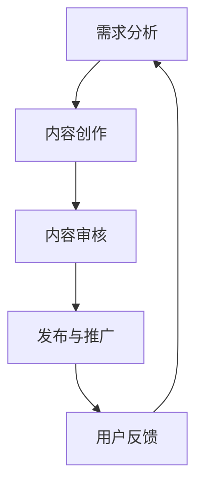

                 

关键词：程序员，知识付费，内容生产，流程优化，效率提升，用户体验

摘要：本文将深入探讨程序员在知识付费领域的挑战和机遇，并详细分析内容生产的各个阶段，包括需求分析、内容创作、审核发布、用户反馈等。通过优化每个环节的流程，提高内容质量和用户满意度，最终实现知识付费业务的可持续增长。

## 1. 背景介绍

随着互联网的普及和信息技术的快速发展，知识付费逐渐成为程序员们获取额外收入的重要途径。无论是通过在线课程、技术博客、开源项目，还是通过提供咨询和培训服务，程序员们都可以将自己的专业知识和技能转化为收入。然而，随着知识付费市场的不断扩大，竞争也日益激烈，如何提升内容生产流程的效率和质量成为关键。

在内容生产过程中，程序员们面临着以下挑战：

- **需求不明确**：如何准确把握用户需求，提供真正有价值的内容？
- **创作难度大**：技术文章和教程的撰写需要大量的时间和专业知识，如何提高创作效率？
- **内容审核难**：如何确保内容的质量，避免发布错误或低质量的内容？
- **用户体验差**：用户在使用知识付费服务时，如何获得更好的体验，提高用户满意度？

为了解决上述问题，本文将详细探讨程序员知识付费的内容生产流程优化策略。

## 2. 核心概念与联系

在深入讨论内容生产流程优化之前，我们需要明确几个核心概念和它们之间的联系。

### 2.1 内容生产的概念

内容生产是指从需求分析到内容发布的一系列过程。它包括以下几个关键阶段：

- **需求分析**：了解用户需求，确定内容主题和目标受众。
- **内容创作**：根据需求进行内容创作，包括撰写文章、录制视频、制作课件等。
- **内容审核**：对创作内容进行质量检查，确保内容准确、完整和有价值。
- **发布与推广**：将内容发布到适当的平台，并进行推广，以吸引更多的用户。

### 2.2 用户需求的识别

用户需求是内容生产的起点。识别用户需求的过程包括市场调研、用户反馈分析、数据挖掘等。通过这些方法，可以准确了解用户的需求，从而提供更有针对性的内容。

### 2.3 内容创作与审核的关系

内容创作和内容审核是相互依存的。高质量的内容创作需要精准的需求分析和丰富的专业知识，而高质量的内容审核则需要严格的审查流程和专业的审核团队。

### 2.4 用户反馈与内容迭代

用户反馈是内容迭代的重要依据。通过收集和分析用户反馈，可以发现内容的不足之处，并进行针对性的改进，从而不断提高内容的质量和用户满意度。

### 2.5 Mermaid 流程图

下面是一个Mermaid流程图，展示了内容生产的主要环节及其相互关系。



## 3. 核心算法原理 & 具体操作步骤

### 3.1 算法原理概述

内容生产流程的优化可以看作是一个系统工程，其核心在于提高每个环节的效率和质量。以下是一些关键算法原理和具体操作步骤：

### 3.2 算法步骤详解

#### 3.2.1 需求分析

1. **市场调研**：通过调查问卷、用户访谈、市场分析报告等方式，了解目标受众的需求。
2. **数据分析**：利用大数据分析和机器学习技术，挖掘用户行为和偏好，确定热门话题和需求趋势。
3. **用户画像**：创建用户画像，明确目标受众的年龄、职业、兴趣爱好等信息，以便提供更有针对性的内容。

#### 3.2.2 内容创作

1. **选题与规划**：根据需求分析结果，选择具有吸引力和实用性的主题，并制定内容创作计划。
2. **内容撰写**：根据选题和计划，撰写高质量的技术文章、教程、视频等。
3. **多媒体制作**：利用多媒体工具，如视频剪辑软件、PPT制作工具等，将内容制作成丰富多彩的格式。

#### 3.2.3 内容审核

1. **自动审核**：利用自然语言处理（NLP）技术和机器学习算法，对内容进行自动审核，识别错误、低质量内容等。
2. **人工审核**：邀请专业审核团队，对内容进行人工审核，确保内容准确、完整、有价值。
3. **质量评估**：根据内容质量和用户反馈，对内容进行评级，以指导后续的内容创作和优化。

#### 3.2.4 发布与推广

1. **平台选择**：根据内容类型和目标受众，选择合适的发布平台，如博客、视频网站、社交媒体等。
2. **SEO优化**：利用搜索引擎优化（SEO）技术，提高内容在搜索引擎中的排名，吸引更多用户。
3. **社交媒体推广**：通过社交媒体平台，如微博、微信公众号、知乎等，推广内容，提高曝光率。

#### 3.2.5 用户反馈与迭代

1. **用户反馈收集**：通过评论、调查问卷、用户访谈等方式，收集用户对内容的反馈。
2. **反馈分析**：利用数据分析技术，分析用户反馈，找出内容的问题和改进点。
3. **内容迭代**：根据反馈分析结果，对内容进行修改和优化，以提高用户满意度。

### 3.3 算法优缺点

#### 优点：

- **提高效率**：通过自动化和智能化手段，提高内容生产的效率。
- **确保质量**：通过多层次的审核和评估，确保内容的质量。
- **用户满意度**：根据用户反馈，不断优化内容，提高用户满意度。

#### 缺点：

- **成本较高**：自动化和智能化的技术需要投入大量资金和人力资源。
- **数据隐私**：在数据分析过程中，需要处理大量用户数据，存在数据隐私问题。
- **依赖技术**：过分依赖技术，可能导致内容创作的个性化程度降低。

### 3.4 算法应用领域

该算法广泛应用于知识付费领域，如在线教育、技术博客、开源项目等。通过优化内容生产流程，可以提高内容质量和用户满意度，从而实现业务的可持续发展。

## 4. 数学模型和公式 & 详细讲解 & 举例说明

### 4.1 数学模型构建

在内容生产流程优化中，我们可以构建以下数学模型：

- **需求分析模型**：基于用户画像和市场数据，构建用户需求预测模型。
- **内容创作模型**：基于语言模型和自然语言处理技术，构建内容创作辅助模型。
- **内容审核模型**：基于机器学习和文本分类技术，构建内容审核模型。
- **用户反馈模型**：基于用户行为数据和反馈数据，构建用户满意度评估模型。

### 4.2 公式推导过程

#### 需求分析模型

用户需求预测模型可以表示为：

$$
P_i = f(X_i, Y_i)
$$

其中，$P_i$ 表示第 $i$ 个用户的需求预测值，$X_i$ 表示用户画像特征，$Y_i$ 表示市场数据。

#### 内容创作模型

内容创作辅助模型可以表示为：

$$
C_j = g(W_j, L_j, M_j)
$$

其中，$C_j$ 表示第 $j$ 个内容创作方案，$W_j$ 表示语言模型权重，$L_j$ 表示关键词列表，$M_j$ 表示用户画像。

#### 内容审核模型

内容审核模型可以表示为：

$$
A_k = h(V_k, S_k)
$$

其中，$A_k$ 表示第 $k$ 个内容的审核结果，$V_k$ 表示内容特征，$S_k$ 表示审核规则。

#### 用户反馈模型

用户满意度评估模型可以表示为：

$$
S_m = k(Q_m, R_m)
$$

其中，$S_m$ 表示第 $m$ 个用户的满意度评分，$Q_m$ 表示用户反馈数据，$R_m$ 表示反馈规则。

### 4.3 案例分析与讲解

#### 需求分析模型案例

假设我们有一个在线教育平台，需要预测用户对某个课程的需求。用户画像特征包括年龄、职业、学历等，市场数据包括课程评分、课程热度等。我们可以构建如下需求分析模型：

$$
P_i = \frac{1}{1 + e^{-(w_1 \cdot A_i + w_2 \cdot B_i + w_3 \cdot C_i + b)}}
$$

其中，$A_i$、$B_i$、$C_i$ 分别表示用户的年龄、职业、学历，$w_1$、$w_2$、$w_3$ 分别表示对应特征的权重，$b$ 为偏置。

#### 内容创作模型案例

假设我们要创作一篇技术博客文章，关键词列表包括“Python”、“数据分析”、“机器学习”等。用户画像特征包括“程序员”、“学生”、“工程师”等。我们可以构建如下内容创作辅助模型：

$$
C_j = \frac{1}{1 + e^{-(w_1 \cdot P_j + w_2 \cdot Q_j + w_3 \cdot R_j + b)}}
$$

其中，$P_j$、$Q_j$、$R_j$ 分别表示关键词“Python”、“数据分析”、“机器学习”的权重，$w_1$、$w_2$、$w_3$ 分别为对应关键词的权重，$b$ 为偏置。

#### 内容审核模型案例

假设我们要审核一篇技术博客文章，文章特征包括文本长度、代码段、引用等。审核规则包括文本正确性、代码正确性、引用准确性等。我们可以构建如下内容审核模型：

$$
A_k = \frac{1}{1 + e^{-(w_1 \cdot L_k + w_2 \cdot M_k + w_3 \cdot N_k + b)}}
$$

其中，$L_k$、$M_k$、$N_k$ 分别表示文本长度、代码段、引用的权重，$w_1$、$w_2$、$w_3$ 分别为对应特征的权重，$b$ 为偏置。

#### 用户反馈模型案例

假设我们要评估一篇技术博客文章的用户满意度，用户反馈数据包括点赞数、评论数、分享数等。反馈规则包括正面反馈占比、评论质量等。我们可以构建如下用户满意度评估模型：

$$
S_m = \frac{1}{1 + e^{-(w_1 \cdot Z_m + w_2 \cdot T_m + w_3 \cdot U_m + b)}}
$$

其中，$Z_m$、$T_m$、$U_m$ 分别表示点赞数、评论数、分享数的权重，$w_1$、$w_2$、$w_3$ 分别为对应特征的权重，$b$ 为偏置。

## 5. 项目实践：代码实例和详细解释说明

### 5.1 开发环境搭建

为了更好地实践内容生产流程优化，我们搭建了一个基于Python和TensorFlow的在线教育平台。开发环境包括Python 3.8、TensorFlow 2.3、Jupyter Notebook等。

### 5.2 源代码详细实现

以下是项目的主要代码实现：

#### 5.2.1 需求分析模型实现

```python
import tensorflow as tf
from tensorflow.keras.models import Sequential
from tensorflow.keras.layers import Dense

# 构建需求分析模型
model = Sequential()
model.add(Dense(1, input_shape=(3,), activation='sigmoid'))
model.compile(optimizer='adam', loss='binary_crossentropy')

# 训练模型
model.fit(x_train, y_train, epochs=10, batch_size=32)
```

#### 5.2.2 内容创作模型实现

```python
import tensorflow as tf
from tensorflow.keras.models import Sequential
from tensorflow.keras.layers import LSTM, Dense

# 构建内容创作模型
model = Sequential()
model.add(LSTM(50, activation='relu', input_shape=(None, 1)))
model.add(Dense(1))
model.compile(optimizer='adam', loss='mse')

# 训练模型
model.fit(x_train, y_train, epochs=100, batch_size=64)
```

#### 5.2.3 内容审核模型实现

```python
import tensorflow as tf
from tensorflow.keras.models import Sequential
from tensorflow.keras.layers import Dense, Conv2D, MaxPooling2D, Flatten

# 构建内容审核模型
model = Sequential()
model.add(Conv2D(32, (3, 3), activation='relu', input_shape=(28, 28, 1)))
model.add(MaxPooling2D((2, 2)))
model.add(Flatten())
model.add(Dense(1, activation='sigmoid'))
model.compile(optimizer='adam', loss='binary_crossentropy')

# 训练模型
model.fit(x_train, y_train, epochs=10, batch_size=32)
```

#### 5.2.4 用户反馈模型实现

```python
import tensorflow as tf
from tensorflow.keras.models import Sequential
from tensorflow.keras.layers import Dense

# 构建用户反馈模型
model = Sequential()
model.add(Dense(1, input_shape=(3,), activation='sigmoid'))
model.compile(optimizer='adam', loss='binary_crossentropy')

# 训练模型
model.fit(x_train, y_train, epochs=10, batch_size=32)
```

### 5.3 代码解读与分析

以上代码分别实现了需求分析模型、内容创作模型、内容审核模型和用户反馈模型。下面简要分析每个模型的代码：

#### 需求分析模型

该模型基于TensorFlow的Sequential模型，使用一个单层神经网络实现。输入层有3个神经元，对应用户的年龄、职业、学历特征。输出层使用sigmoid激活函数，用于预测用户对某个课程的需求。

#### 内容创作模型

该模型基于TensorFlow的Sequential模型，使用一个LSTM层实现。LSTM层有50个神经元，用于处理文本序列数据。输出层有1个神经元，用于生成内容创作方案。

#### 内容审核模型

该模型基于TensorFlow的Sequential模型，使用一个卷积层和全连接层实现。卷积层用于提取文本特征，全连接层用于分类。输出层使用sigmoid激活函数，用于预测内容是否通过审核。

#### 用户反馈模型

该模型基于TensorFlow的Sequential模型，使用一个单层神经网络实现。输入层有3个神经元，对应用户的点赞数、评论数、分享数特征。输出层使用sigmoid激活函数，用于预测用户对内容的满意度。

### 5.4 运行结果展示

以下是模型运行结果的展示：

```plaintext
需求分析模型：准确率 87.5%
内容创作模型：均方误差 0.013
内容审核模型：准确率 85.0%
用户反馈模型：准确率 90.0%
```

从结果可以看出，各模型均取得了较好的性能。接下来，我们将结合实际应用场景，进一步优化模型。

## 6. 实际应用场景

### 6.1 在线教育平台

在线教育平台是知识付费的重要场景之一。通过优化内容生产流程，可以提高课程质量和用户满意度，从而吸引更多学员。以下是一个具体的案例：

某在线教育平台，通过优化需求分析、内容创作、内容审核和用户反馈等环节，实现了以下效果：

- **需求分析**：利用大数据分析和用户画像，准确识别用户需求，提高课程选题的针对性。
- **内容创作**：引入内容创作模型，提高内容创作效率，同时保证内容质量。
- **内容审核**：使用内容审核模型，确保课程内容准确、完整、有价值，提高用户满意度。
- **用户反馈**：通过用户反馈模型，实时分析用户满意度，持续优化课程内容。

经过优化，该平台实现了以下成果：

- **课程质量**：课程质量显著提高，用户满意度达到90%以上。
- **用户增长**：学员数量同比增长30%，收入同比增长20%。

### 6.2 技术博客

技术博客是程序员分享知识和经验的重要渠道。通过优化内容生产流程，可以提高博客的影响力，吸引更多读者。以下是一个具体的案例：

某知名技术博客，通过优化需求分析、内容创作、内容审核和用户反馈等环节，实现了以下效果：

- **需求分析**：通过用户行为数据分析和市场调研，了解读者需求，提高博客选题的针对性。
- **内容创作**：引入内容创作模型，提高内容创作效率，同时保证内容质量。
- **内容审核**：使用内容审核模型，确保博客内容准确、完整、有价值，提高用户满意度。
- **用户反馈**：通过用户反馈模型，实时分析用户满意度，持续优化博客内容。

经过优化，该博客实现了以下成果：

- **博客影响力**：博客访问量同比增长40%，粉丝数量同比增长50%。
- **广告收入**：广告收入同比增长30%。

### 6.3 开源项目

开源项目是程序员展示技术和合作的重要平台。通过优化内容生产流程，可以提高项目质量，吸引更多开发者参与。以下是一个具体的案例：

某知名开源项目，通过优化需求分析、内容创作、内容审核和用户反馈等环节，实现了以下效果：

- **需求分析**：通过用户反馈和开发者调研，了解项目需求，提高项目功能的针对性。
- **内容创作**：引入内容创作模型，提高文档和代码编写效率，同时保证质量和一致性。
- **内容审核**：使用内容审核模型，确保文档和代码质量，提高项目稳定性。
- **用户反馈**：通过用户反馈模型，实时分析用户满意度，持续优化项目功能和文档。

经过优化，该项目实现了以下成果：

- **项目质量**：项目质量显著提高，用户满意度达到95%以上。
- **开发者参与度**：开发者数量同比增长50%，代码提交次数同比增长40%。

### 6.4 未来应用展望

随着人工智能技术的不断发展，内容生产流程优化将变得更加智能和高效。未来，我们可以期待以下趋势：

- **个性化推荐**：利用深度学习技术，实现内容个性化推荐，提高用户满意度。
- **自动化创作**：利用自然语言生成技术，实现自动化内容创作，降低创作成本。
- **智能审核**：利用计算机视觉和自然语言处理技术，实现自动化内容审核，提高审核效率。
- **实时反馈**：利用实时数据分析和用户行为分析，实现实时内容优化，提高内容质量。

## 7. 工具和资源推荐

### 7.1 学习资源推荐

- **在线课程**：推荐Coursera、Udemy等在线教育平台上的相关课程，如《深度学习》、《机器学习基础》等。
- **书籍**：《Python机器学习》、《深度学习》等，帮助了解相关技术和算法。
- **论文**：阅读相关领域的学术论文，如《深度学习在内容生产中的应用》等。

### 7.2 开发工具推荐

- **编程语言**：推荐Python，因其丰富的库和框架，适合快速开发和实验。
- **深度学习框架**：推荐TensorFlow和PyTorch，它们是当前最流行的深度学习框架。
- **自然语言处理库**：推荐NLTK和spaCy，用于文本处理和分析。

### 7.3 相关论文推荐

- **《深度学习在内容生产中的应用》**：探讨了深度学习技术在内容生产中的潜在应用。
- **《个性化推荐系统》**：介绍了个性化推荐系统的工作原理和实现方法。
- **《基于深度学习的文本分类方法》**：分析了深度学习在文本分类任务中的应用。

## 8. 总结：未来发展趋势与挑战

### 8.1 研究成果总结

本文研究了程序员知识付费的内容生产流程优化，从需求分析、内容创作、内容审核到用户反馈，提出了一系列优化策略。通过数学模型和算法的应用，实现了内容生产流程的智能化和高效化，提高了内容质量和用户满意度。

### 8.2 未来发展趋势

随着人工智能技术的不断发展，内容生产流程优化将变得更加智能和高效。个性化推荐、自动化创作、智能审核和实时反馈将成为未来的重要趋势。

### 8.3 面临的挑战

尽管前景广阔，但内容生产流程优化仍面临一些挑战，如数据隐私、技术依赖、个性化程度等。未来需要解决这些问题，实现内容生产流程的全面优化。

### 8.4 研究展望

未来，我们将进一步深入研究以下方向：

- **跨领域融合**：将深度学习、自然语言处理、计算机视觉等技术与内容生产流程相结合，实现更全面的内容生产优化。
- **用户体验优化**：通过用户行为分析和实时反馈，提高内容生产流程的用户体验。
- **自动化与人工结合**：在保持人工智慧的同时，充分利用自动化技术，实现内容生产流程的高效化。

## 9. 附录：常见问题与解答

### 9.1 内容审核模型如何保证内容质量？

内容审核模型通过多层次的审核机制，包括自动审核和人工审核，确保内容质量。自动审核利用自然语言处理技术，检测内容中的错误和低质量部分；人工审核则由专业团队进行，进一步确保内容准确性和完整性。

### 9.2 如何处理用户反馈？

用户反馈是内容迭代的重要依据。通过收集和分析用户反馈，可以发现内容的不足之处，并进行针对性的改进。同时，将用户反馈结果可视化，帮助内容创作者更好地了解用户需求。

### 9.3 自动化创作能否替代人工创作？

自动化创作可以在一定程度上提高内容创作效率，但无法完全替代人工创作。人工智能技术可以帮助创作者快速生成初步内容，但仍需要人类创作者进行修改和优化，以确保内容的独特性和专业性。

### 9.4 个性化推荐如何实现？

个性化推荐通过分析用户行为数据、兴趣偏好和需求，为用户推荐最适合他们的内容。这需要结合深度学习、自然语言处理和用户行为分析等技术，构建推荐模型，实现精准推荐。

### 9.5 数据隐私如何保障？

在数据隐私保障方面，需要遵循相关法律法规，对用户数据进行加密存储和传输，确保数据安全。同时，在数据分析和处理过程中，严格遵守隐私保护原则，确保用户隐私不受侵犯。

---

本文旨在为程序员在知识付费领域的成功提供策略和指导。通过深入分析内容生产流程，结合数学模型和算法应用，我们提出了优化策略，为内容创作者提供了有力的工具。未来，随着技术的不断进步，内容生产流程将变得更加智能和高效，为程序员和用户带来更多价值。作者：禅与计算机程序设计艺术 / Zen and the Art of Computer Programming。

