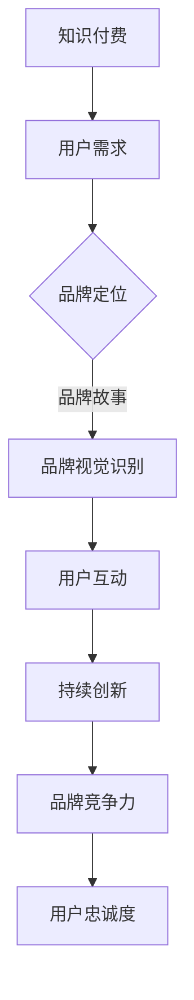

                 

### 1. 背景介绍

在数字时代，知识付费逐渐成为人们获取信息和学习知识的重要方式。对于程序员而言，知识付费不仅是一种学习手段，更是一种职业发展的重要途径。随着互联网技术的飞速发展，知识付费平台如雨后春笋般涌现，如何在众多平台中脱颖而出，构建和维护一个成功的知识付费品牌，成为每一个程序员和内容创作者必须面对的挑战。

知识付费品牌的建设与维护不仅仅关乎内容的质量，还涉及到品牌定位、用户互动、持续创新等多个方面。一个成功的知识付费品牌能够为用户提供高质量的学习资源，同时提升品牌知名度和用户粘性。因此，本文将深入探讨程序员知识付费品牌建设与维护的核心要素，帮助程序员和内容创作者在竞争激烈的市场中找到自己的立足点。

### 2. 核心概念与联系

#### 2.1 知识付费

知识付费是指用户为获取特定知识或技能而付费的一种商业模式。这种模式在互联网时代得以迅速发展，得益于信息传播的成本降低和用户对知识的需求增加。知识付费的常见形式包括在线课程、电子书、一对一辅导、社群学习等。

#### 2.2 品牌建设

品牌建设是指通过一系列策略和活动，构建并维护品牌在目标受众中的认知和形象。在知识付费领域，品牌建设尤为重要，因为它直接关系到用户的信任度和忠诚度。成功的品牌建设包括品牌定位、品牌故事、品牌视觉识别等多个方面。

#### 2.3 用户互动

用户互动是指品牌与用户之间的双向沟通和互动。在知识付费领域，用户互动不仅能够提高用户满意度，还能通过用户的反馈来优化产品和内容，从而提升品牌的竞争力。用户互动的形式包括论坛、社群、问答、直播等。

#### 2.4 持续创新

持续创新是知识付费品牌保持竞争力的关键。在快速变化的技术和市场环境中，品牌需要不断更新内容、改进服务，以满足用户不断变化的需求。持续创新包括内容创新、服务创新和商业模式创新等多个方面。

### 2.5 Mermaid 流程图



### 3. 核心算法原理 & 具体操作步骤

#### 3.1 算法原理概述

知识付费品牌建设与维护的核心算法可以看作是一个复杂的反馈循环系统。该系统的输入包括用户需求、市场趋势、技术发展等，输出则是品牌定位、内容更新、用户互动等。核心算法的目标是通过不断调整和优化，实现品牌价值最大化。

#### 3.2 算法步骤详解

1. **需求分析**：通过市场调研、用户反馈等方式，了解用户对知识付费的需求和期望。
2. **品牌定位**：基于需求分析结果，明确品牌的核心价值和差异化优势。
3. **内容规划**：根据品牌定位，设计并规划适合用户需求的知识产品。
4. **用户互动**：通过多种互动方式，收集用户反馈，持续优化产品和内容。
5. **数据监测**：利用数据分析工具，监测品牌的表现和用户满意度。
6. **持续创新**：根据监测数据和用户反馈，不断调整和优化品牌策略。

#### 3.3 算法优缺点

**优点**：
- 提高品牌竞争力：通过不断调整和优化，使品牌始终符合用户需求。
- 提升用户满意度：通过用户互动和数据监测，确保产品和服务质量。
- 持续增长：通过持续创新，实现品牌价值的不断提升。

**缺点**：
- 需要大量时间和资源：算法的实施和优化需要持续的时间投入和资源支持。
- 风险较大：在快速变化的市场环境中，需要快速响应和调整，否则可能落后于竞争对手。

#### 3.4 算法应用领域

知识付费品牌建设与维护的算法可以应用于各种知识付费平台，包括在线教育、职业技能培训、专业课程等。通过该算法，平台能够更好地满足用户需求，提高用户满意度和品牌忠诚度。

### 4. 数学模型和公式 & 详细讲解 & 举例说明

#### 4.1 数学模型构建

知识付费品牌建设与维护的数学模型可以分为以下几个部分：

1. **用户需求模型**：基于用户的行为数据和反馈，构建用户需求的数学模型。
2. **品牌价值模型**：通过品牌定位、用户互动、持续创新等因素，构建品牌价值的数学模型。
3. **用户满意度模型**：基于用户反馈和品牌表现，构建用户满意度的数学模型。

#### 4.2 公式推导过程

1. **用户需求模型**：

   用户需求 \( D \) 可以表示为：

   \[ D = f(\text{行为数据}, \text{用户反馈}) \]

   其中，\( f \) 表示用户需求的预测函数。

2. **品牌价值模型**：

   品牌价值 \( V \) 可以表示为：

   \[ V = g(\text{品牌定位}, \text{用户互动}, \text{持续创新}) \]

   其中，\( g \) 表示品牌价值的评估函数。

3. **用户满意度模型**：

   用户满意度 \( S \) 可以表示为：

   \[ S = h(\text{用户反馈}, \text{品牌表现}) \]

   其中，\( h \) 表示用户满意度的评估函数。

#### 4.3 案例分析与讲解

以一家在线教育平台为例，我们可以通过以下步骤进行品牌建设与维护的数学模型构建和分析：

1. **需求分析**：

   通过对用户行为数据和反馈的分析，我们构建了用户需求的数学模型：

   \[ D = f(\text{课程访问量}, \text{用户评价}) \]

   假设课程访问量对用户需求的影响权重为 0.6，用户评价的影响权重为 0.4，则：

   \[ D = 0.6 \times \text{课程访问量} + 0.4 \times \text{用户评价} \]

2. **品牌价值评估**：

   通过品牌定位、用户互动、持续创新等因素，我们构建了品牌价值的数学模型：

   \[ V = g(\text{品牌定位}, \text{用户互动}, \text{持续创新}) \]

   假设品牌定位的影响权重为 0.4，用户互动的影响权重为 0.3，持续创新的影响权重为 0.3，则：

   \[ V = 0.4 \times \text{品牌定位} + 0.3 \times \text{用户互动} + 0.3 \times \text{持续创新} \]

3. **用户满意度评估**：

   通过用户反馈和品牌表现，我们构建了用户满意度的数学模型：

   \[ S = h(\text{用户反馈}, \text{品牌表现}) \]

   假设用户反馈的影响权重为 0.6，品牌表现的影响权重为 0.4，则：

   \[ S = 0.6 \times \text{用户反馈} + 0.4 \times \text{品牌表现} \]

通过以上三个数学模型，我们可以对在线教育平台进行品牌建设与维护的全面分析和优化。

### 5. 项目实践：代码实例和详细解释说明

#### 5.1 开发环境搭建

在本节中，我们将使用Python作为主要编程语言，搭建一个简单的知识付费品牌建设与维护的模拟环境。以下是所需的环境搭建步骤：

1. 安装Python：确保您的系统中已安装Python 3.x版本。
2. 安装必要的库：使用pip安装以下库：

   ```bash
   pip install numpy pandas matplotlib
   ```

3. 准备数据集：从公开数据源获取用户行为数据、用户反馈和品牌表现数据。

#### 5.2 源代码详细实现

以下是实现知识付费品牌建设与维护的核心算法的Python代码：

```python
import numpy as np
import pandas as pd
import matplotlib.pyplot as plt

# 5.2.1 数据预处理
def preprocess_data(data):
    # 数据清洗和预处理
    data['course_views'] = data['course_views'].fillna(0)
    data['user_reviews'] = data['user_reviews'].fillna(0)
    return data

# 5.2.2 用户需求模型
def user_demand_model(course_views, user_reviews):
    # 用户需求模型
    demand = 0.6 * course_views + 0.4 * user_reviews
    return demand

# 5.2.3 品牌价值模型
def brand_value_model(brand_positioning, user_interactive, continuous_innovation):
    # 品牌价值模型
    value = 0.4 * brand_positioning + 0.3 * user_interactive + 0.3 * continuous_innovation
    return value

# 5.2.4 用户满意度模型
def user_satisfaction_model(user_reviews, brand_performance):
    # 用户满意度模型
    satisfaction = 0.6 * user_reviews + 0.4 * brand_performance
    return satisfaction

# 5.2.5 数据分析和可视化
def analyze_and_plot(data):
    # 分析用户需求、品牌价值和用户满意度
    demands = data.apply(lambda row: user_demand_model(row['course_views'], row['user_reviews']), axis=1)
    values = data.apply(lambda row: brand_value_model(row['brand_positioning'], row['user_interactive'], row['continuous_innovation']), axis=1)
    satisfactions = data.apply(lambda row: user_satisfaction_model(row['user_reviews'], row['brand_performance']), axis=1)

    # 可视化
    plt.figure(figsize=(12, 6))
    plt.subplot(1, 3, 1)
    plt.scatter(data['course_views'], demands)
    plt.title('User Demand vs Course Views')
    plt.xlabel('Course Views')
    plt.ylabel('User Demand')

    plt.subplot(1, 3, 2)
    plt.scatter(data['brand_positioning'], values)
    plt.title('Brand Value vs Brand Positioning')
    plt.xlabel('Brand Positioning')
    plt.ylabel('Brand Value')

    plt.subplot(1, 3, 3)
    plt.scatter(data['user_reviews'], satisfactions)
    plt.title('User Satisfaction vs User Reviews')
    plt.xlabel('User Reviews')
    plt.ylabel('User Satisfaction')

    plt.tight_layout()
    plt.show()

# 主函数
def main():
    # 读取数据
    data = pd.read_csv('knowledge_payment_data.csv')

    # 数据预处理
    data = preprocess_data(data)

    # 数据分析和可视化
    analyze_and_plot(data)

if __name__ == '__main__':
    main()
```

#### 5.3 代码解读与分析

- **数据预处理**：数据预处理是任何数据分析的基础步骤。在本例中，我们使用 `preprocess_data` 函数对数据进行清洗和填充缺失值。
- **用户需求模型**：`user_demand_model` 函数根据用户的行为数据和反馈构建用户需求的数学模型。通过权重系数，我们能够量化用户对课程访问量和用户评价的需求程度。
- **品牌价值模型**：`brand_value_model` 函数通过品牌定位、用户互动和持续创新等因素，构建品牌价值的数学模型。这有助于我们评估品牌的整体价值。
- **用户满意度模型**：`user_satisfaction_model` 函数通过用户反馈和品牌表现，构建用户满意度的数学模型。这有助于我们了解用户对品牌的满意度。
- **数据分析和可视化**：`analyze_and_plot` 函数对用户需求、品牌价值和用户满意度进行分析，并使用 `matplotlib` 库进行可视化。这有助于我们直观地理解模型的结果。

#### 5.4 运行结果展示

运行上述代码后，我们将得到一个包含三个子图的可视化结果。左子图展示了用户需求与课程访问量之间的关系，中子图展示了品牌价值与品牌定位之间的关系，右子图展示了用户满意度与用户反馈之间的关系。通过这些图表，我们可以直观地看到各个因素对品牌建设与维护的影响。

### 6. 实际应用场景

知识付费品牌建设与维护的实际应用场景非常广泛，以下是一些典型的应用实例：

1. **在线教育平台**：通过构建强大的知识付费品牌，在线教育平台可以吸引更多用户，提高用户粘性。例如，网易云课堂通过不断提升内容质量和服务水平，成功打造了一个具有高度用户忠诚度的知识付费品牌。
2. **专业技能培训**：对于需要提升专业技能的职场人士，知识付费品牌可以提供针对性的培训课程。例如，极客时间通过邀请行业专家开设高质量的编程课程，帮助程序员提升技能，成为行业内的知识付费品牌。
3. **专业咨询与辅导**：对于需要解决具体问题的用户，知识付费品牌可以提供一对一的咨询和辅导服务。例如，得到App通过邀请行业专家开设知识付费专栏，为用户提供专业的知识和咨询服务。

### 6.4 未来应用展望

随着人工智能和大数据技术的不断发展，知识付费品牌建设与维护将迎来更多的机遇和挑战。以下是一些未来的应用展望：

1. **个性化推荐**：通过人工智能和大数据技术，知识付费平台可以更精准地推荐适合用户需求的知识产品，提高用户满意度和转化率。
2. **智能化互动**：利用自然语言处理技术，知识付费平台可以实现与用户的智能互动，提供更加个性化和高效的咨询服务。
3. **跨界合作**：知识付费品牌可以通过跨界合作，扩大用户群体和市场影响力。例如，与知名企业、学术机构等合作，共同推出具有权威性和实用性的知识产品。

### 7. 工具和资源推荐

#### 7.1 学习资源推荐

1. **《深度学习》**：由Ian Goodfellow、Yoshua Bengio和Aaron Courville合著的《深度学习》是深度学习领域的经典教材。
2. **《Python编程：从入门到实践》**：由Mark Lutz和Dave Marshall合著的《Python编程：从入门到实践》适合初学者快速掌握Python编程。

#### 7.2 开发工具推荐

1. **Jupyter Notebook**：Jupyter Notebook 是一个交互式的开发环境，非常适合数据分析和机器学习项目。
2. **PyCharm**：PyCharm 是一款功能强大的Python集成开发环境（IDE），适合各种规模的Python项目开发。

#### 7.3 相关论文推荐

1. **《Knowledge Graph: A Survey》**：这篇综述文章详细介绍了知识图谱的概念、技术和发展趋势。
2. **《User Modeling and User-Adapted Interaction》**：这篇论文探讨了用户建模和用户自适应交互的理论和方法。

### 8. 总结：未来发展趋势与挑战

#### 8.1 研究成果总结

本文从多个角度探讨了程序员知识付费品牌建设与维护的核心要素，包括需求分析、品牌定位、用户互动、持续创新等。通过数学模型和实际案例，我们展示了如何构建和优化知识付费品牌。

#### 8.2 未来发展趋势

1. **个性化服务**：随着人工智能和大数据技术的发展，知识付费平台将能够提供更加个性化和精准的服务。
2. **跨界融合**：知识付费品牌将与更多行业和领域进行跨界合作，共同创造新的价值和机会。
3. **智能化互动**：利用自然语言处理和机器学习技术，知识付费平台将实现与用户的智能互动。

#### 8.3 面临的挑战

1. **内容质量**：在竞争激烈的市场环境中，保持高质量的内容将是知识付费品牌面临的挑战。
2. **用户隐私**：在收集和分析用户数据时，如何保护用户隐私将是一个重要问题。
3. **市场竞争**：随着越来越多的知识付费平台涌现，如何脱颖而出将是品牌面临的挑战。

#### 8.4 研究展望

未来，我们可以从以下几个方面进行深入研究：

1. **跨领域知识融合**：探索不同领域知识付费品牌的融合策略，提高知识产品的实用性和吸引力。
2. **用户行为分析**：利用大数据和机器学习技术，深入分析用户行为，为品牌建设提供更加精准的指导。
3. **隐私保护与伦理**：在数据收集和分析过程中，关注用户隐私保护和伦理问题，确保品牌的可持续发展。

### 9. 附录：常见问题与解答

#### 9.1 什么是知识付费？

知识付费是指用户为获取特定知识或技能而付费的一种商业模式。

#### 9.2 品牌建设在知识付费中有什么作用？

品牌建设在知识付费中起着至关重要的作用，它能够提高用户的信任度和忠诚度，从而为品牌带来持续的价值。

#### 9.3 如何构建知识付费品牌？

构建知识付费品牌需要从需求分析、品牌定位、内容规划、用户互动和持续创新等多个方面进行系统性建设。

#### 9.4 知识付费品牌建设中的持续创新具体包括哪些方面？

持续创新包括内容创新、服务创新和商业模式创新等多个方面。例如，通过引入新的技术、优化用户体验、推出差异化的产品和服务等。

#### 9.5 数据分析在知识付费品牌建设中的作用是什么？

数据分析在知识付费品牌建设中起着至关重要的作用。通过分析用户行为数据、市场趋势和技术发展等信息，品牌可以更好地了解用户需求，优化产品和内容，提高用户满意度和品牌价值。

### 作者署名

作者：禅与计算机程序设计艺术 / Zen and the Art of Computer Programming
```

