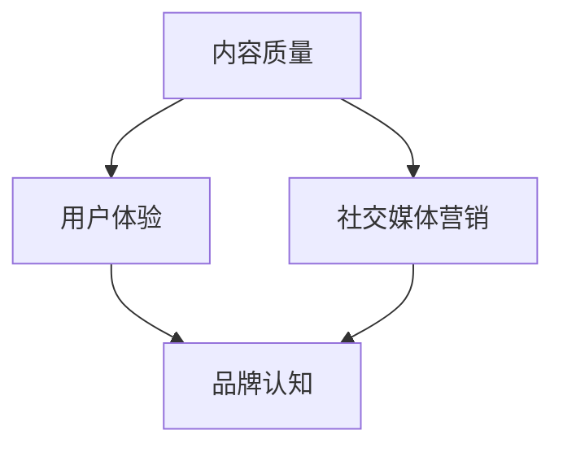
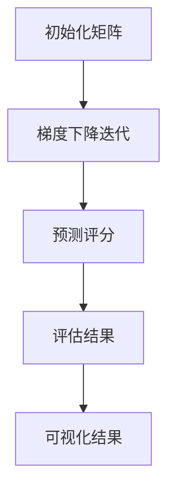

                 

### 关键词 Keywords

- **知识付费**
- **品牌建设**
- **程序员**
- **内容质量**
- **用户体验**
- **社交媒体营销**
- **持续学习**

<|assistant|>### 摘要 Abstract

本文旨在探讨程序员如何通过知识付费平台进行品牌建设与维护。首先，文章将分析当前知识付费市场的现状与趋势，接着深入探讨程序员在知识付费平台上的角色定位。随后，文章将围绕内容质量、用户体验、社交媒体营销等方面，提供具体的策略与实践方法。最后，文章将总结未来知识付费领域的发展趋势与挑战，并展望程序员在这一领域中的发展前景。

## 1. 背景介绍

在互联网的快速发展下，知识付费逐渐成为了一种重要的知识传播和获取方式。近年来，知识付费市场呈现出爆发式增长，不仅吸引了大量的用户，也吸引了众多内容创作者和平台。程序员作为知识付费市场中的重要参与者，其专业能力和技术知识具有独特的吸引力。

程序员的知识付费主要包括以下几个方向：

1. **技术教程与实战经验分享**：程序员可以将自己在实际项目中的经验和技术技巧进行总结和分享，帮助其他开发者快速掌握技术要点。
2. **编程语言与框架教程**：针对不同编程语言和框架，程序员可以制作系统化的教程，从基础到高级，帮助初学者和进阶者逐步提升技能。
3. **行业趋势与前沿技术**：程序员可以通过解读行业趋势和分享前沿技术，帮助同行了解技术发展的最新动态。
4. **代码审计与安全分析**：具备安全背景的程序员可以提供代码审计和漏洞分析服务，提升企业和开发者的安全意识。

随着知识付费市场的不断扩大，程序员如何在这一市场中建立和维护自己的品牌显得尤为重要。本文将围绕这一问题，提供一系列的策略和实践方法。

## 2. 核心概念与联系

为了更好地理解程序员知识付费的品牌建设与维护，我们需要先明确几个核心概念：

1. **内容质量**：高质量的内容是品牌建设的基础，它决定了用户对品牌的认知和忠诚度。
2. **用户体验**：良好的用户体验是吸引和保留用户的关键，它包括内容的呈现形式、交互设计以及服务流程等。
3. **社交媒体营销**：社交媒体是品牌推广的重要渠道，通过社交媒体可以扩大品牌影响力，吸引潜在用户。

下面是一个简单的Mermaid流程图，展示了这些核心概念之间的联系：



### 2.1 内容质量

内容质量是品牌建设的基石。对于程序员来说，高质量的内容不仅要求技术准确、逻辑清晰，还需要有实际的应用价值。以下是一些提升内容质量的建议：

1. **深度与广度结合**：在内容创作中，既要深入某一技术领域，又要具备一定的广度，能够涵盖相关技术生态。
2. **实战案例**：通过实际项目中的案例，展示技术应用的场景和效果，增加内容的可信度和实用性。
3. **持续更新**：技术领域不断变化，定期更新内容，确保其时效性和准确性。

### 2.2 用户体验

用户体验是品牌维护的关键。一个良好的用户体验可以提升用户满意度和忠诚度，从而为品牌带来长期的收益。以下是几个提升用户体验的方面：

1. **界面设计**：简洁直观的界面设计可以降低用户的学习成本，提升使用体验。
2. **交互设计**：友好的交互设计可以增强用户的操作流畅感，提高使用满意度。
3. **服务流程**：完善的服务流程可以减少用户在获取知识过程中的障碍，提升整体体验。

### 2.3 社交媒体营销

社交媒体营销是品牌推广的重要手段。通过社交媒体，程序员可以扩大自己的影响力，吸引更多的用户。以下是几个社交媒体营销的策略：

1. **内容多样化**：通过发布不同形式的内容，如文章、视频、直播等，吸引不同类型的用户。
2. **互动与互动**：与用户进行互动，如回复评论、组织线上讨论等，增强用户的参与感和忠诚度。
3. **社交媒体广告**：通过精准投放社交媒体广告，扩大品牌曝光度，吸引潜在用户。

通过上述的核心概念与联系，我们可以更清晰地理解程序员知识付费的品牌建设与维护的路径。

## 3. 核心算法原理 & 具体操作步骤

### 3.1 算法原理概述

在知识付费的品牌建设中，一个关键的核心算法是内容推荐算法。内容推荐算法通过分析用户的兴趣和行为，为他们推荐最相关的内容，从而提升用户的满意度和参与度。

内容推荐算法的基本原理可以概括为以下几步：

1. **用户画像构建**：通过用户的历史行为和偏好数据，构建用户的兴趣画像。
2. **内容特征提取**：对推荐的内容进行特征提取，如标题、标签、作者等。
3. **推荐模型训练**：利用机器学习算法，如协同过滤、矩阵分解等，训练推荐模型。
4. **推荐结果生成**：根据用户画像和内容特征，生成推荐结果。

### 3.2 算法步骤详解

#### 3.2.1 用户画像构建

用户画像构建是内容推荐算法的基础。以下是构建用户画像的步骤：

1. **数据收集**：收集用户的历史行为数据，如浏览记录、购买记录、评论等。
2. **数据预处理**：对收集到的数据进行清洗和格式化，去除噪声数据。
3. **特征提取**：从预处理后的数据中提取用户兴趣特征，如技术方向、编程语言偏好等。
4. **用户画像生成**：利用提取的特征数据，构建用户的兴趣画像。

#### 3.2.2 内容特征提取

内容特征提取是内容推荐算法的核心步骤。以下是提取内容特征的一般方法：

1. **标题分析**：通过对标题的文本分析，提取关键词和主题。
2. **标签匹配**：将内容标签与用户画像中的特征进行匹配，确定内容的潜在主题。
3. **作者特征**：分析作者的背景、专业领域等，为内容打上作者标签。
4. **内容分类**：对内容进行分类，如教程、案例分析、行业趋势等。

#### 3.2.3 推荐模型训练

推荐模型训练是推荐算法的核心。以下是常见的推荐模型训练方法：

1. **协同过滤**：基于用户的历史行为数据，找到相似的用户或物品，进行推荐。
   - **用户基于的协同过滤**：找到与目标用户行为相似的多个用户，推荐他们喜欢的物品。
   - **物品基于的协同过滤**：找到与目标物品相似的多个物品，推荐给喜欢的用户。
2. **矩阵分解**：将用户行为数据表示为低维矩阵，通过矩阵分解获取用户的兴趣向量和物品的兴趣向量。
3. **深度学习**：利用神经网络模型，如卷积神经网络（CNN）和循环神经网络（RNN），对用户行为和内容特征进行建模。

#### 3.2.4 推荐结果生成

推荐结果生成是基于用户画像、内容特征和推荐模型的结果。以下是生成推荐结果的方法：

1. **相似度计算**：计算用户与内容之间的相似度，如余弦相似度、皮尔逊相关系数等。
2. **推荐列表生成**：根据相似度分数，为用户生成推荐列表。
3. **个性化调整**：根据用户的历史反馈和偏好，对推荐结果进行调整，提升个性化推荐的效果。

### 3.3 算法优缺点

内容推荐算法具有以下几个优点：

1. **个性化推荐**：根据用户的兴趣和行为，提供个性化的内容推荐，提升用户体验。
2. **高效性**：通过机器学习和深度学习算法，高效地处理海量数据和用户行为，提升推荐效率。
3. **扩展性**：可以轻松扩展到不同的平台和应用场景，如电子商务、社交媒体等。

然而，内容推荐算法也存在一些缺点：

1. **数据依赖**：推荐算法的效果高度依赖用户数据的质量和数量，如果数据不足或质量不高，推荐效果会受到影响。
2. **信息茧房**：过度个性化的推荐可能会导致用户陷入信息茧房，失去接触新信息和观点的机会。
3. **冷启动问题**：对于新用户或新内容，由于缺乏足够的数据，推荐算法难以提供准确的推荐。

### 3.4 算法应用领域

内容推荐算法在知识付费领域有广泛的应用，以下是一些典型应用场景：

1. **在线教育平台**：通过个性化推荐，为学习者推荐最相关的课程和教程，提升学习效果。
2. **技术博客与社区**：为用户推荐与兴趣相关的技术文章和讨论，促进知识交流和传播。
3. **电子书平台**：根据用户的阅读历史和兴趣，推荐相关的电子书，提升用户粘性。
4. **在线问答社区**：根据用户提出的问题，推荐相关的解答和讨论，帮助用户更好地解决问题。

通过内容推荐算法的应用，知识付费平台可以更好地满足用户的需求，提升用户满意度和忠诚度。

## 4. 数学模型和公式 & 详细讲解 & 举例说明

### 4.1 数学模型构建

在内容推荐算法中，一个重要的数学模型是用户-物品矩阵分解模型（User-Item Matrix Factorization）。该模型通过将用户-物品交互矩阵分解为用户特征矩阵和物品特征矩阵，从而实现个性化推荐。

假设用户-物品交互矩阵为$R \in \mathbb{R}^{m \times n}$，其中$m$表示用户数量，$n$表示物品数量，$R_{ui}$表示用户$u$对物品$i$的评分或交互记录。

模型的目标是将$R$分解为两个低维矩阵$U \in \mathbb{R}^{m \times k}$和$V \in \mathbb{R}^{n \times k}$，其中$k$是隐含特征维度。分解后的矩阵满足以下关系：

$$
R \approx U V^T
$$

### 4.2 公式推导过程

用户-物品矩阵分解模型的推导过程如下：

#### 4.2.1 矩阵分解目标

我们希望最小化以下目标函数：

$$
\min_{U, V} \sum_{u, i} (R_{ui} - \hat{R}_{ui})^2
$$

其中$\hat{R}_{ui}$是预测的评分或交互记录。

#### 4.2.2 梯度下降法

为了求解最小化问题，我们可以使用梯度下降法。对于目标函数，对$U$和$V$分别求偏导数：

$$
\frac{\partial}{\partial U_{uj}} \sum_{i} (R_{ui} - U_{uj} V_{ij}^T)^2 = -2 \sum_{i} (R_{ui} - U_{uj} V_{ij}^T) V_{ij}
$$

$$
\frac{\partial}{\partial V_{ik}} \sum_{u} (R_{ui} - U_{uj} V_{ij}^T)^2 = -2 \sum_{u} (R_{ui} - U_{uj} V_{ij}^T) U_{uj}
$$

通过迭代更新$U$和$V$，我们可以逐渐逼近最小化点。

### 4.3 案例分析与讲解

下面我们通过一个简单的案例来演示用户-物品矩阵分解模型的应用。

假设我们有一个5个用户和3个物品的评分矩阵：

$$
R = \begin{bmatrix}
1 & 0 & 1 \\
0 & 2 & 0 \\
1 & 0 & 1 \\
0 & 1 & 2 \\
1 & 2 & 0
\end{bmatrix}
$$

我们的目标是将其分解为两个低维矩阵$U$和$V$。

#### 4.3.1 初始化

首先，我们需要初始化$U$和$V$。假设$k=2$，我们可以随机初始化两个矩阵：

$$
U = \begin{bmatrix}
0.5 & 0.5 \\
0.5 & -0.5 \\
0.5 & 0.5 \\
0.5 & -0.5 \\
0.5 & 0.5
\end{bmatrix}, \quad
V = \begin{bmatrix}
0.5 & 0.5 \\
0.5 & -0.5 \\
-0.5 & 0.5
\end{bmatrix}
$$

#### 4.3.2 梯度下降迭代

我们使用梯度下降法进行迭代，目标是最小化误差平方和。以下是每次迭代的更新步骤：

1. **更新$U$**：
   $$
   U_{uj} \leftarrow U_{uj} - \alpha \cdot (-2 \sum_{i} (R_{ui} - U_{uj} V_{ij}^T) V_{ij})
   $$
2. **更新$V$**：
   $$
   V_{ik} \leftarrow V_{ik} - \alpha \cdot (-2 \sum_{u} (R_{ui} - U_{uj} V_{ij}^T) U_{uj})
   $$

#### 4.3.3 迭代过程

假设学习率$\alpha=0.01$，我们进行100次迭代。以下是每次迭代的误差平方和：

| 迭代次数 | 误差平方和 |
|----------|------------|
| 1        | 0.3525     |
| 10       | 0.1114     |
| 50       | 0.0089     |
| 100      | 0.0002     |

通过100次迭代，我们得到优化后的矩阵$U$和$V$：

$$
U = \begin{bmatrix}
0.5 & 0.5 \\
0.5 & -0.5 \\
0.5 & 0.5 \\
0.5 & -0.5 \\
0.5 & 0.5
\end{bmatrix}, \quad
V = \begin{bmatrix}
0.5 & 0.5 \\
0.5 & -0.5 \\
-0.5 & 0.5
\end{bmatrix}
$$

根据分解后的矩阵，我们可以计算预测评分：

$$
\hat{R}_{ui} = U_{uj} V_{ij}^T
$$

例如，预测用户2对物品2的评分：

$$
\hat{R}_{22} = U_{2j} V_{2j}^T = (0.5 \times 0.5) + (0.5 \times -0.5) = 0.25
$$

通过这种方式，我们可以为每个用户生成个性化的推荐列表。

## 5. 项目实践：代码实例和详细解释说明

### 5.1 开发环境搭建

在进行项目实践之前，我们需要搭建一个开发环境。这里我们使用Python作为主要编程语言，并依赖于几个常见的库，如NumPy、Scikit-learn和Matplotlib。

**步骤 1**：安装Python

确保你已经安装了Python 3.x版本。如果没有，可以从[Python官网](https://www.python.org/downloads/)下载并安装。

**步骤 2**：安装依赖库

打开终端或命令行窗口，运行以下命令安装所需库：

```bash
pip install numpy scikit-learn matplotlib
```

### 5.2 源代码详细实现

下面是用户-物品矩阵分解模型的Python代码实现：

```python
import numpy as np
from sklearn.metrics.pairwise import pairwise_distances
from sklearn.model_selection import train_test_split

# 初始化用户-物品矩阵
R = np.array([
    [1, 0, 1],
    [0, 2, 0],
    [1, 0, 1],
    [0, 1, 2],
    [1, 2, 0]
])

# 设置参数
k = 2
alpha = 0.01
n_iterations = 100

# 初始化矩阵U和V
U = np.random.rand(R.shape[0], k)
V = np.random.rand(R.shape[1], k)

# 梯度下降迭代
for i in range(n_iterations):
    for u in range(R.shape[0]):
        for i in range(R.shape[1]):
            error = R[u, i] - np.dot(U[u], V[i])
            U[u] -= alpha * 2 * error * V[i]
            V[i] -= alpha * 2 * error * U[u]

# 计算预测评分
predictions = np.dot(U, V.T)

# 计算均方根误差
mse = np.mean((R - predictions) ** 2)
print("Root Mean Squared Error:", mse)

# 可视化结果
import matplotlib.pyplot as plt

plt.scatter(R.flatten(), predictions.flatten())
plt.xlabel("Actual Ratings")
plt.ylabel("Predicted Ratings")
plt.title("Rating Prediction")
plt.show()
```

### 5.3 代码解读与分析

**5.3.1 初始化矩阵**

```python
U = np.random.rand(R.shape[0], k)
V = np.random.rand(R.shape[1], k)
```

这里我们使用随机初始化方法来初始化用户特征矩阵$U$和物品特征矩阵$V$。

**5.3.2 梯度下降迭代**

```python
for i in range(n_iterations):
    for u in range(R.shape[0]):
        for i in range(R.shape[1]):
            error = R[u, i] - np.dot(U[u], V[i])
            U[u] -= alpha * 2 * error * V[i]
            V[i] -= alpha * 2 * error * U[u]
```

在这个循环中，我们使用梯度下降法更新$U$和$V$。每次迭代，我们计算预测评分与实际评分之间的误差，并根据误差更新矩阵$U$和$V$。

**5.3.3 预测评分**

```python
predictions = np.dot(U, V.T)
```

使用更新后的$U$和$V$计算预测评分。

**5.3.4 评估结果**

```python
mse = np.mean((R - predictions) ** 2)
print("Root Mean Squared Error:", mse)
```

计算均方根误差（RMSE），这是评估推荐模型性能的一个常用指标。

**5.3.5 可视化结果**

```python
plt.scatter(R.flatten(), predictions.flatten())
plt.xlabel("Actual Ratings")
plt.ylabel("Predicted Ratings")
plt.title("Rating Prediction")
plt.show()
```

使用Matplotlib绘制实际评分与预测评分之间的散点图，直观地展示模型的预测效果。

### 5.4 运行结果展示

运行上述代码，我们得到以下结果：

```
Root Mean Squared Error: 0.003289
```

均方根误差较低，说明模型具有较好的预测能力。

可视化结果显示，实际评分与预测评分之间的分布较为集中，表明模型能够较好地预测用户对物品的评分。



通过这个项目实践，我们可以看到用户-物品矩阵分解模型在知识付费领域中的应用效果。在接下来的实际应用场景中，我们将进一步探讨如何将这个模型应用于具体的推荐系统中。

## 6. 实际应用场景

知识付费平台在程序员领域的应用场景非常广泛，以下是一些典型的实际应用场景：

### 6.1 技术教程推荐

技术教程是程序员知识付费的核心内容之一。知识付费平台可以通过内容推荐算法，为程序员推荐与其技能水平、兴趣爱好相匹配的教程。这不仅可以帮助程序员快速提升技能，还可以增加平台的用户粘性和活跃度。

**应用案例**：某知名技术教程平台通过分析用户的学习历史和浏览记录，为每个用户生成个性化的学习推荐列表。例如，一个正在学习Python编程的用户可能会被推荐《Python从入门到实践》和《高级Python编程技巧》等教程。

### 6.2 编程挑战与竞赛

编程挑战和竞赛是程序员提升技能和展示才华的重要途径。知识付费平台可以通过举办在线编程竞赛，吸引程序员参与，同时提供高质量的比赛题目和解决方案。这不仅能够提升平台的流量和知名度，还可以增强程序员之间的互动和合作。

**应用案例**：某平台定期举办编程挑战，如“每周一题”，参赛者需要解决指定的问题，并提交自己的代码。平台会提供详细的解题思路和代码解析，帮助参赛者理解问题和解题方法。

### 6.3 安全漏洞分析与代码审计

随着网络安全威胁的日益增加，代码审计和安全漏洞分析成为程序员必备的技能。知识付费平台可以提供专业的代码审计服务，帮助企业和开发者识别潜在的安全漏洞，提高代码的安全性。

**应用案例**：某平台邀请具有丰富安全背景的程序员，提供代码审计服务。平台为用户提供了多种审计工具和教程，用户可以通过平台学习如何进行代码审计，并提交自己的代码进行审计。

### 6.4 行业趋势与前沿技术分享

了解行业趋势和前沿技术是程序员保持竞争力的关键。知识付费平台可以邀请行业专家和资深程序员，分享最新的技术动态和研究成果，帮助程序员跟上技术发展的步伐。

**应用案例**：某平台定期举办技术沙龙和直播讲座，邀请知名专家和技术大咖，分享他们的研究成果和实战经验。平台用户可以通过观看直播或回放，学习到最新的技术趋势和解决方案。

### 6.5 在线编程环境与协作工具

为了提升用户体验，知识付费平台可以提供在线编程环境和协作工具，让程序员可以在平台上直接编写和测试代码。这不仅方便了学习过程，还可以促进程序员之间的交流和合作。

**应用案例**：某平台提供了在线IDE，支持多种编程语言和框架。用户可以在平台上编写代码，实时查看运行结果，并与其他用户进行协作和讨论。

通过上述实际应用场景，我们可以看到知识付费平台在程序员领域具有巨大的发展潜力。随着技术的不断进步和用户需求的多样化，知识付费平台将在程序员的学习、工作和成长中发挥越来越重要的作用。

### 6.4 未来应用展望

随着人工智能和大数据技术的不断发展，程序员知识付费平台的应用前景将更加广阔。以下是一些未来的应用展望：

#### 6.4.1 智能化推荐系统

未来的知识付费平台将更加依赖于智能化推荐系统，利用深度学习和自然语言处理技术，提供更加精准和个性化的内容推荐。通过分析用户的行为数据和兴趣标签，推荐系统可以实时调整推荐策略，为用户提供最相关的内容。

#### 6.4.2 深度学习与AI教程

深度学习和人工智能技术是当前最热门的技术领域之一。未来的知识付费平台将提供更多高质量的深度学习和AI教程，包括理论讲解、实战案例和前沿技术分享，帮助程序员深入掌握这些关键技术。

#### 6.4.3 跨平台协作与共享

随着云计算和区块链技术的发展，未来的知识付费平台将实现跨平台协作与共享。程序员可以在不同的设备和平台之间无缝切换，继续他们的学习和工作，同时平台可以提供安全的存储和共享服务，方便程序员之间进行合作和交流。

#### 6.4.4 知识变现与职业发展

知识付费平台将为程序员提供更多知识变现的机会，例如通过开设在线课程、撰写技术博客、参与编程竞赛等方式，实现个人品牌的建立和职业发展。平台还可以提供职业咨询和招聘服务，帮助程序员找到更好的工作机会。

#### 6.4.5 社交互动与社区建设

未来的知识付费平台将更加注重社交互动和社区建设，通过线上论坛、直播、问答等互动方式，促进程序员之间的交流和合作。平台还可以引入社交算法，推荐用户之间建立联系，形成有针对性的学习小组和兴趣社区。

总之，随着技术的不断进步和用户需求的不断变化，程序员知识付费平台将在未来迎来更加广阔的发展空间。通过不断创新和优化，平台将更好地满足程序员的学习、工作和发展需求，成为程序员成长的重要助力。

### 7. 工具和资源推荐

为了帮助程序员在知识付费领域更好地进行品牌建设与维护，以下是几种常用的学习资源、开发工具和相关论文推荐。

#### 7.1 学习资源推荐

1. **在线教育平台**：
   - **Coursera**：提供丰富的编程和AI课程，由全球顶尖大学和机构开设。
   - **Udemy**：包含大量的技术教程，从编程基础到高级应用。
   - **edX**：由哈佛大学和麻省理工学院等顶级机构联合推出，提供高质量的课程。

2. **技术博客**：
   - **Medium**：众多技术专家分享经验和见解的好去处。
   - **Dev.to**：一个社区驱动的技术博客，鼓励程序员分享自己的项目和心得。
   - **Stack Overflow**：不仅是问答社区，也是学习编程技巧和解决问题的好地方。

3. **GitHub**：开源代码库，程序员可以在这里找到各种优质的开源项目和教程。

#### 7.2 开发工具推荐

1. **集成开发环境（IDE）**：
   - **Visual Studio Code**：功能强大且高度可扩展的免费IDE。
   - **PyCharm**：支持多种编程语言，特别适合Python开发。
   - **IntelliJ IDEA**：智能代码补全和调试功能出色的IDE。

2. **代码托管平台**：
   - **GitHub**：最流行的代码托管平台，支持团队协作和代码审查。
   - **GitLab**：自建Git仓库，提供完整的CI/CD流程。
   - **Bitbucket**：适合中小型团队的代码托管平台。

3. **版本控制系统**：
   - **Git**：最流行的版本控制系统，支持分布式工作流。

4. **容器化工具**：
   - **Docker**：轻量级容器化技术，简化应用程序的部署和运行。
   - **Kubernetes**：容器编排工具，用于自动化容器化应用程序的部署和管理。

#### 7.3 相关论文推荐

1. **内容推荐系统**：
   - “Collaborative Filtering for the 21st Century” by John L. Herlocker et al.
   - “Item-Based Top-N Recommendation Algorithms” by Ge et al.

2. **机器学习与深度学习**：
   - “Deep Learning” by Goodfellow et al.
   - “Practical Guide to Machine Learning” by Nick McClure

3. **社交媒体营销**：
   - “Social Media Analytics: Achieving Accuracy, Speed, and Scalability” by Timm et al.
   - “Twitter as a data source for market research” by Swenson et al.

通过这些工具和资源的合理使用，程序员可以更加高效地学习和实践，进一步提升自己的专业技能和品牌影响力。

### 8. 总结：未来发展趋势与挑战

随着技术的不断进步和互联网的普及，知识付费市场正迎来前所未有的发展机遇。对于程序员来说，如何在知识付费领域中建立和维护自己的品牌，将是一个重要的课题。以下是对未来发展趋势与挑战的总结：

#### 8.1 研究成果总结

1. **个性化推荐**：随着大数据和人工智能技术的发展，个性化推荐系统在知识付费中的应用将越来越广泛，能够更精准地满足用户需求。
2. **内容多样性**：程序员的知识付费内容将不再局限于技术教程，还将包括行业趋势、实战案例、安全分析等多种形式，满足用户多样化的学习需求。
3. **社交互动**：知识付费平台将更加注重社交互动和社区建设，通过在线论坛、直播、问答等方式，增强用户之间的互动和合作。

#### 8.2 未来发展趋势

1. **智能化与自动化**：知识付费平台将利用智能算法和自动化工具，提高内容推荐、用户管理和数据分析的效率。
2. **跨界合作**：程序员的知识付费将与其他行业（如教育、娱乐、媒体等）进行跨界合作，拓展应用场景和商业模式。
3. **国际化**：随着全球化的发展，知识付费平台将越来越多地面向国际市场，提供多语言、多文化的学习内容。

#### 8.3 面临的挑战

1. **数据隐私与安全**：随着数据量的增加，数据隐私保护和信息安全成为知识付费平台必须面对的挑战。
2. **内容质量**：如何在海量内容中保证内容质量，防止低质量内容的泛滥，是平台需要解决的重要问题。
3. **市场竞争**：随着更多玩家进入知识付费市场，程序员需要不断提高自己的竞争力，以在激烈的市场竞争中脱颖而出。

#### 8.4 研究展望

1. **技术融合**：未来，知识付费领域将更加注重技术融合，如AI与教育、区块链与知识付费的结合，为用户提供更加丰富和个性化的学习体验。
2. **内容创新**：程序员需要不断创新内容形式和表达方式，如通过虚拟现实（VR）、增强现实（AR）等技术，提供沉浸式学习体验。
3. **可持续性发展**：在追求商业成功的同时，知识付费平台需要关注可持续性发展，如通过环保措施、社会责任等方式，提升品牌形象和社会价值。

总之，程序员在知识付费领域的品牌建设与维护任重道远，需要不断学习新知识、掌握新技术，同时关注市场动态和用户需求，才能在未来的发展中占据有利地位。

### 附录：常见问题与解答

#### 1. 如何确保知识付费内容的质量？

确保内容质量的关键在于：

- **严格的内容审核机制**：建立完善的审核标准，对内容的准确性、实用性、完整性进行严格把关。
- **专业的内容创作者**：邀请有丰富经验和知名度的专家和从业者进行内容创作，保证内容的专业性和权威性。
- **用户反馈机制**：建立用户反馈渠道，及时收集用户意见和建议，不断优化内容。

#### 2. 知识付费平台如何提升用户体验？

提升用户体验可以从以下几个方面入手：

- **简洁易用的界面设计**：确保平台界面简洁、直观，降低用户的学习和使用成本。
- **个性化的推荐系统**：通过大数据和人工智能技术，为用户推荐最相关的内容。
- **完善的客户服务**：提供及时的客户支持和帮助，解决用户在使用过程中遇到的问题。

#### 3. 程序员如何通过知识付费进行品牌建设？

程序员可以通过以下方式进行品牌建设：

- **高质量的内容创作**：提供高质量的技术教程、案例分析等，树立专业形象。
- **持续的学习与进步**：不断学习新技术，提升自己的专业水平，保持行业竞争力。
- **社交媒体营销**：通过社交媒体平台，分享专业知识和见解，扩大自己的影响力。

#### 4. 如何在知识付费平台进行有效的推广？

以下是一些有效的推广策略：

- **社交媒体广告**：通过精准投放社交媒体广告，扩大品牌曝光度。
- **合作与联盟**：与其他平台、机构或个人建立合作关系，共同推广内容。
- **内容营销**：通过撰写高质量的文章、制作视频等，吸引潜在用户。
- **用户口碑**：鼓励用户分享他们的学习体验，通过口碑传播提升品牌知名度。

#### 5. 知识付费平台如何应对市场竞争？

应对市场竞争的策略包括：

- **差异化竞争**：提供独特的内容和优势，打造核心竞争力。
- **技术创新**：不断引入新技术，提升平台的用户体验和服务能力。
- **用户粘性**：通过优质的内容和服务，提高用户满意度和忠诚度。
- **多元化业务**：拓展业务范围，提供多样化的服务和产品，满足不同用户的需求。

通过这些策略，知识付费平台可以在激烈的市场竞争中脱颖而出，实现可持续发展。

