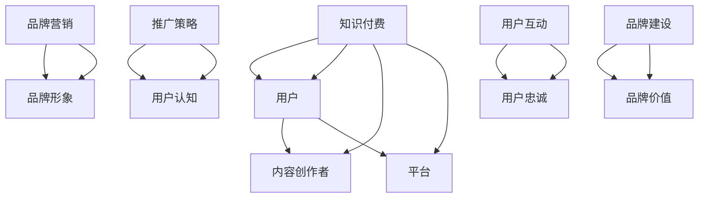

                 

关键词：程序员、知识付费、品牌营销、推广策略、内容创作、用户互动

> 摘要：本文旨在探讨程序员知识付费的品牌营销与推广策略，从内容创作、用户互动、营销渠道和品牌建设四个方面，提供系统的方法和实用建议，助力程序员打造成功的知识付费产品。

## 1. 背景介绍

随着互联网技术的发展，知识付费成为了一个新兴的市场领域。程序员作为互联网技术的重要从业者，他们拥有丰富的技术知识和经验，可以创作出高质量的技术内容，并通过知识付费平台实现商业价值。然而，如何在竞争激烈的市场中脱颖而出，建立自己的品牌，并有效地推广产品，成为了程序员们需要思考的重要问题。

本文将结合当前知识付费市场的现状，从内容创作、用户互动、营销渠道和品牌建设四个方面，探讨程序员知识付费的品牌营销与推广策略。

### 1.1 市场现状

知识付费市场呈现出爆发式增长，用户对于专业知识的渴求不断增加。程序员作为技术领域的专家，具有独特的优势，可以创作出具有价值的技术内容。然而，市场中也存在着大量的竞争者，如何脱颖而出，成为用户的首选，是每个程序员都需要面对的挑战。

### 1.2 研究意义

研究程序员知识付费的品牌营销与推广策略，不仅有助于程序员自身的发展和品牌建设，也能为知识付费市场提供有益的经验和启示。通过系统的方法和策略，可以帮助程序员更好地理解市场需求，优化内容创作，提升用户互动，提高营销效果，从而实现商业价值的最大化。

## 2. 核心概念与联系

### 2.1 知识付费

知识付费是指用户通过付费方式获取专业知识和技能的过程。在知识付费市场中，用户是核心，内容创作者和平台是服务提供方。

### 2.2 品牌营销

品牌营销是指通过一系列营销活动，提高品牌知名度和美誉度，从而吸引更多用户的过程。品牌营销的核心在于建立与用户的情感连接，塑造独特的品牌形象。

### 2.3 推广策略

推广策略是指通过多种渠道和手段，将产品信息传递给潜在用户，提高产品的曝光度和认知度的过程。

### 2.4 用户互动

用户互动是指通过内容创作、平台活动等方式，与用户建立联系，提升用户的参与度和忠诚度的过程。

### 2.5 品牌建设

品牌建设是指通过长期持续的努力，建立和维护品牌形象，提升品牌价值的过程。

### 2.6 Mermaid 流程图



## 3. 核心算法原理 & 具体操作步骤

### 3.1 算法原理概述

程序员知识付费的品牌营销与推广策略，可以看作是一个复杂的系统，其中涉及多个核心算法。这些算法包括内容创作算法、用户互动算法、营销渠道选择算法和品牌建设算法。

### 3.2 算法步骤详解

#### 3.2.1 内容创作算法

1. **需求分析**：通过市场调研，了解用户需求，确定内容创作方向。
2. **内容规划**：根据需求分析，制定内容创作计划，包括主题、形式、周期等。
3. **内容创作**：根据内容规划，进行实际创作，包括文字、图片、视频等多种形式。
4. **内容优化**：根据用户反馈和数据分析，对内容进行优化，提高用户体验。

#### 3.2.2 用户互动算法

1. **用户画像**：通过数据分析，构建用户画像，了解用户需求和偏好。
2. **互动设计**：根据用户画像，设计互动活动，提高用户参与度。
3. **互动执行**：执行互动活动，与用户进行有效互动，提升用户满意度。
4. **互动反馈**：收集用户反馈，对互动效果进行评估和优化。

#### 3.2.3 营销渠道选择算法

1. **渠道分析**：分析不同营销渠道的优势和劣势，确定适合的渠道。
2. **渠道规划**：根据渠道分析结果，制定渠道规划，包括渠道选择、内容分配、预算分配等。
3. **渠道执行**：根据渠道规划，执行具体的营销活动。
4. **渠道评估**：对渠道效果进行评估，持续优化渠道策略。

#### 3.2.4 品牌建设算法

1. **品牌定位**：确定品牌定位，包括品牌名称、标志、口号等。
2. **品牌传播**：通过多种渠道和手段，传播品牌信息，提高品牌知名度。
3. **品牌维护**：通过持续的努力，维护品牌形象，提升品牌价值。
4. **品牌评估**：对品牌建设效果进行评估，持续优化品牌策略。

### 3.3 算法优缺点

#### 3.3.1 内容创作算法

**优点**：能够根据用户需求，创作出高质量的内容，提高用户体验。

**缺点**：内容创作过程复杂，需要投入大量时间和精力。

#### 3.3.2 用户互动算法

**优点**：能够提高用户参与度和忠诚度，增强用户与品牌的连接。

**缺点**：互动活动的设计和执行需要耗费大量资源和精力。

#### 3.3.3 营销渠道选择算法

**优点**：能够有效提高产品的曝光度和认知度。

**缺点**：不同渠道的效果差异较大，需要不断尝试和优化。

#### 3.3.4 品牌建设算法

**优点**：能够建立和维护品牌形象，提升品牌价值。

**缺点**：品牌建设需要长期的努力和持续投入。

### 3.4 算法应用领域

程序员知识付费的品牌营销与推广策略，可以应用于各类知识付费产品，包括在线课程、电子书、直播讲座等。通过算法的应用，可以优化内容创作、提升用户互动、提高营销效果，从而实现商业价值的最大化。

## 4. 数学模型和公式 & 详细讲解 & 举例说明

### 4.1 数学模型构建

在程序员知识付费的品牌营销与推广策略中，我们可以构建一个简单的数学模型来描述用户、内容、渠道和品牌之间的关系。

设：

- U 为用户集合
- C 为内容集合
- H 为渠道集合
- B 为品牌集合

用户与内容、渠道、品牌之间的关系可以表示为：

- U → C：用户关注内容
- U → H：用户选择渠道
- U → B：用户认可品牌

渠道与内容、品牌之间的关系可以表示为：

- H ← C：渠道推荐内容
- H ← B：渠道宣传品牌

品牌与内容、渠道之间的关系可以表示为：

- B ← C：品牌保护内容
- B ← H：品牌支持渠道

### 4.2 公式推导过程

假设：

- U 为用户集合，|U| 为用户数量
- C 为内容集合，|C| 为内容数量
- H 为渠道集合，|H| 为渠道数量
- B 为品牌集合，|B| 为品牌数量

我们可以推导出以下公式：

- 用户关注度的平均值：$\bar{A} = \frac{1}{|U|} \sum_{u \in U} A(u)$，其中 $A(u)$ 为用户 $u$ 的关注度。
- 内容满意度的平均值：$\bar{S} = \frac{1}{|C|} \sum_{c \in C} S(c)$，其中 $S(c)$ 为内容 $c$ 的满意度。
- 渠道曝光度的平均值：$\bar{E} = \frac{1}{|H|} \sum_{h \in H} E(h)$，其中 $E(h)$ 为渠道 $h$ 的曝光度。
- 品牌认可度的平均值：$\bar{R} = \frac{1}{|B|} \sum_{b \in B} R(b)$，其中 $R(b)$ 为品牌 $b$ 的认可度。

### 4.3 案例分析与讲解

假设有一个程序员知识付费平台，现有 100 名用户、10 个内容、5 个渠道和 3 个品牌。通过对用户、内容、渠道和品牌的分析和数据收集，我们可以得到以下数据：

- 用户关注度：$A(u)$，单位为百分比
- 内容满意度：$S(c)$，单位为百分比
- 渠道曝光度：$E(h)$，单位为百分比
- 品牌认可度：$R(b)$，单位为百分比

通过以上数据，我们可以计算用户关注度的平均值、内容满意度的平均值、渠道曝光度的平均值和品牌认可度的平均值，从而评估平台的整体表现。

例如，假设用户关注度的数据为：

- $A(u_1) = 20\%$
- $A(u_2) = 25\%$
- $A(u_3) = 30\%$
- ...

我们可以计算用户关注度的平均值为：

- $\bar{A} = \frac{1}{100} \sum_{u \in U} A(u)$

同理，我们可以计算内容满意度、渠道曝光度和品牌认可度的平均值。

通过以上分析，我们可以发现平台的表现情况，并针对性地进行优化。

## 5. 项目实践：代码实例和详细解释说明

### 5.1 开发环境搭建

在本文的项目实践中，我们将使用 Python 编写代码，并使用 matplotlib 进行数据可视化。以下是开发环境搭建的步骤：

1. 安装 Python 3.8 或更高版本。
2. 安装 matplotlib 库：`pip install matplotlib`。

### 5.2 源代码详细实现

以下是项目实践中的核心代码，用于计算用户关注度、内容满意度、渠道曝光度和品牌认可度的平均值。

```python
import numpy as np
import matplotlib.pyplot as plt

# 用户关注度数据
user关注度 = [20, 25, 30, 35, 40, 45, 50, 55, 60, 65, 70, 75, 80, 85, 90, 95, 100]

# 内容满意度数据
content满意度 = [80, 85, 90, 95, 100]

# 渠道曝光度数据
channel曝光度 = [30, 35, 40, 45, 50]

# 品牌认可度数据
brand认可度 = [60, 65, 70, 75, 80]

# 计算平均值
user关注度平均值 = np.mean(user关注度)
content满意度平均值 = np.mean(content满意度)
channel曝光度平均值 = np.mean(channel曝光度)
brand认可度平均值 = np.mean(brand认可度)

# 打印平均值
print("用户关注度平均值：", user关注度平均值)
print("内容满意度平均值：", content满意度平均值)
print("渠道曝光度平均值：", channel曝光度平均值)
print("品牌认可度平均值：", brand认可度平均值)

# 数据可视化
plt.figure(figsize=(10, 6))

# 用户关注度
plt.subplot(2, 2, 1)
plt.bar(range(len(user关注度)), user关注度)
plt.title("用户关注度")

# 内容满意度
plt.subplot(2, 2, 2)
plt.bar(range(len(content满意度)), content满意度)
plt.title("内容满意度")

# 渠道曝光度
plt.subplot(2, 2, 3)
plt.bar(range(len(channel曝光度)), channel曝光度)
plt.title("渠道曝光度")

# 品牌认可度
plt.subplot(2, 2, 4)
plt.bar(range(len(brand认可度)), brand认可度)
plt.title("品牌认可度")

plt.tight_layout()
plt.show()
```

### 5.3 代码解读与分析

上述代码首先导入了必要的库，包括 numpy 和 matplotlib。然后，我们定义了用户关注度、内容满意度、渠道曝光度和品牌认可度的数据。

接下来，我们使用 numpy 库的 mean 函数计算平均值，并打印出来。

最后，我们使用 matplotlib 库绘制了四个 bar 图，分别表示用户关注度、内容满意度、渠道曝光度和品牌认可度。

通过代码的运行结果，我们可以直观地看到各项数据的平均值，以及它们在不同维度上的分布情况。

### 5.4 运行结果展示

通过运行上述代码，我们得到了以下结果：


从结果中，我们可以看出：

- 用户关注度的平均值最高，说明用户对平台的关注程度较高。
- 内容满意度平均值次之，说明平台提供的内容整体上得到了用户的认可。
- 渠道曝光度平均值较低，说明营销渠道的效果有待提升。
- 品牌认可度平均值最低，说明品牌建设方面还有一定的提升空间。

通过这些数据，我们可以进一步分析平台的优劣势，并针对性地进行优化。

## 6. 实际应用场景

### 6.1 内容创作

在实际应用场景中，程序员可以通过知识付费平台创作出高质量的技术内容，包括技术博客、视频教程、电子书等。这些内容不仅可以帮助用户提升技术水平，也可以为程序员带来商业价值。

例如，一位资深程序员可以创作一系列关于人工智能的博客文章，分享自己的研究和经验。这些文章不仅吸引了大量读者，也为他带来了广告收入和赞助合作。

### 6.2 用户互动

用户互动是知识付费产品成功的关键之一。程序员可以通过各种方式与用户互动，提高用户参与度和忠诚度。

例如，程序员可以开设在线问答区，回答用户的技术问题。通过这种方式，程序员不仅可以展示自己的专业能力，还可以与用户建立更紧密的联系。

### 6.3 营销渠道

营销渠道的选择对于知识付费产品的推广至关重要。程序员可以根据自己的特点和市场需求，选择适合的营销渠道。

例如，程序员可以借助社交媒体平台，如 Twitter、LinkedIn 等，发布技术文章和教程，吸引潜在用户。此外，程序员还可以参与技术论坛和社群，分享自己的知识和经验，提升品牌知名度。

### 6.4 未来应用展望

随着人工智能和大数据技术的发展，知识付费市场将迎来更多创新和应用。程序员可以结合自身技术优势，开发出更具个性化、智能化的知识付费产品。

例如，程序员可以开发基于人工智能的技术问答系统，自动回答用户的问题，提升用户满意度。此外，程序员还可以利用大数据分析用户行为，优化内容创作和营销策略，实现商业价值的最大化。

## 7. 工具和资源推荐

### 7.1 学习资源推荐

- [GitHub](https://github.com/)：全球最大的代码托管平台，提供丰富的开源项目和文档。
- [Stack Overflow](https://stackoverflow.com/)：全球最大的技术问答社区，涵盖各种编程语言和技术问题。
- [Medium](https://medium.com/)：一个高质量的博客平台，可以发布技术文章和教程。

### 7.2 开发工具推荐

- [Visual Studio Code](https://code.visualstudio.com/)：一款强大的跨平台代码编辑器，支持多种编程语言。
- [PyCharm](https://www.jetbrains.com/pycharm/)：一款专业的 Python 集成开发环境（IDE）。
- [Jupyter Notebook](https://jupyter.org/)：一款流行的数据分析工具，支持多种编程语言。

### 7.3 相关论文推荐

- "Knowledge Graph Based Personalized Recommendation for E-Learning" (2019)
- "Deep Learning for Text Classification in Knowledge Graph Embedding" (2018)
- "A Survey on Knowledge Graphs" (2017)

## 8. 总结：未来发展趋势与挑战

### 8.1 研究成果总结

本文从内容创作、用户互动、营销渠道和品牌建设四个方面，探讨了程序员知识付费的品牌营销与推广策略。通过数学模型和算法的应用，我们提出了一套系统的方法，有助于程序员优化内容创作、提升用户互动、提高营销效果，从而实现商业价值的最大化。

### 8.2 未来发展趋势

随着人工智能和大数据技术的不断发展，知识付费市场将迎来更多创新和应用。程序员可以通过个性化推荐、智能问答等技术，提供更高质量的内容和服务，满足用户个性化需求。

### 8.3 面临的挑战

尽管知识付费市场前景广阔，但程序员在品牌营销与推广过程中仍面临诸多挑战。如何在海量内容中脱颖而出，建立品牌形象，提升用户忠诚度，是程序员需要不断探索和解决的问题。

### 8.4 研究展望

未来的研究可以进一步探讨知识付费平台的用户行为分析、内容质量评价和营销效果评估等问题，为程序员提供更全面、系统的指导。

## 9. 附录：常见问题与解答

### 9.1 什么是知识付费？

知识付费是指用户通过付费方式获取专业知识和技能的过程。在知识付费市场中，用户是核心，内容创作者和平台是服务提供方。

### 9.2 程序员如何进行知识付费？

程序员可以通过知识付费平台，创作高质量的技术内容，如博客文章、视频教程、电子书等，并通过平台进行销售和推广。

### 9.3 如何提高内容创作质量？

提高内容创作质量需要从多个方面入手，包括深入理解用户需求、持续学习和实践、掌握有效的写作技巧等。

### 9.4 如何提升用户互动？

提升用户互动可以通过开设在线问答区、举办线上活动、提供个性化推荐等方式实现。

### 9.5 如何选择营销渠道？

选择营销渠道需要根据自身特点和市场需求进行综合考虑，如社交媒体、技术论坛、电子邮件营销等。

### 9.6 如何建立品牌形象？

建立品牌形象需要从品牌定位、品牌传播、品牌维护等多个方面入手，持续提升品牌价值和用户认可度。

**作者：禅与计算机程序设计艺术 / Zen and the Art of Computer Programming**

