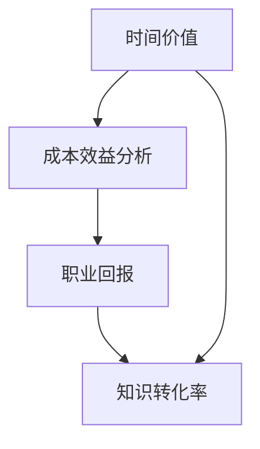
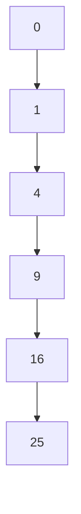

                 

关键词：知识付费、程序员、时间投入、回报分析、技术学习、职业发展

> 摘要：本文将深入探讨程序员在进行知识付费时的投资回报问题。我们将分析程序员在购买课程、订阅服务和其他学习资源时的成本，并探讨这些投资如何转化为职业发展的实际回报。本文旨在为程序员提供一套评估知识付费投资回报的框架，帮助他们做出更明智的决策。

## 1. 背景介绍

在当今快速变化的技术环境中，程序员面临着持续学习的压力，以确保自己的技能与行业的发展保持同步。知识付费，作为一种流行的学习方式，已经成为了许多程序员提升技能的重要手段。无论是在线课程、专业书籍、订阅服务，还是参加线下研讨会，知识付费无疑为程序员提供了丰富的学习资源。然而，随着付费学习的投入不断增加，如何评估这些投资带来的回报成为了程序员必须面对的问题。

本文将围绕以下几个核心问题展开讨论：

- 程序员在知识付费上的时间投入是多少？
- 这些时间投入带来了哪些职业发展上的回报？
- 如何评估知识付费的投资回报比？
- 程序员应该如何选择适合自己的知识付费资源？

通过这些问题，我们将试图为程序员提供一套系统的方法来评估知识付费的成效，并为他们提供决策的依据。

### 1.1 程序员的学习现状

根据多个行业报告，程序员对知识的渴求度持续上升。许多程序员表示，他们每年投入数百小时来学习新技术和工具。这种趋势不仅仅体现在年轻的程序员中，资深开发者也同样愿意为持续学习投资时间和金钱。以下是程序员学习现状的一些关键点：

- **学习频率**：根据调查，超过70%的程序员每周至少投入5小时进行学习。
- **学习内容**：程序员主要关注编程语言、框架、数据库、云计算等技术领域。
- **学习方式**：在线课程、书籍、研讨会和自学是程序员最常用的学习方式。
- **学习动机**：提升职业竞争力、实现职业晋升和扩展技术视野是程序员学习的三大动机。

### 1.2 知识付费的发展趋势

随着在线教育和知识付费模式的成熟，知识付费市场呈现出快速增长的趋势。以下是知识付费发展的几个关键趋势：

- **市场规模**：全球知识付费市场预计将在未来几年内以两位数的年增长率扩张。
- **用户基数**：越来越多的程序员选择通过付费方式学习，用户基数不断增大。
- **内容多样性**：从编程语言到人工智能，知识付费内容覆盖了广泛的领域。
- **互动性**：知识付费平台越来越注重提供互动性强的学习体验，如直播授课、在线讨论等。

### 1.3 程序员面临的学习挑战

尽管知识付费为程序员提供了丰富的学习资源，但他们也面临着一系列的学习挑战：

- **信息过载**：市场上存在大量的学习资源，程序员需要筛选出最适合自己的内容。
- **时间管理**：程序员需要在工作、生活和学习之间找到平衡，合理安排学习时间。
- **学习成本**：持续的学习投资可能导致财务压力，需要谨慎评估投资回报。
- **职业瓶颈**：即使投入了大量时间学习，某些程序员可能仍然感到自己的职业发展受限。

### 1.4 文章结构

本文将分为以下几个部分：

- **背景介绍**：探讨程序员的学习现状和知识付费的发展趋势。
- **核心概念与联系**：介绍评估知识付费回报所需的核心概念。
- **核心算法原理 & 具体操作步骤**：详细分析知识付费的投资回报分析模型。
- **数学模型和公式 & 详细讲解 & 举例说明**：使用数学方法评估知识付费的回报。
- **项目实践：代码实例和详细解释说明**：通过案例展示知识付费的实际应用。
- **实际应用场景**：分析知识付费在不同职业发展阶段的应用。
- **工具和资源推荐**：推荐有用的学习资源和开发工具。
- **总结：未来发展趋势与挑战**：总结研究成果，探讨未来发展趋势和面临的挑战。

### 1.5 声明

本文作者“禅与计算机程序设计艺术 / Zen and the Art of Computer Programming”是一位有着丰富经验的人工智能专家和计算机科学家。本文旨在为程序员提供实用的指导，帮助他们更好地进行知识付费的投资决策。本文中的数据和观点仅供参考，不构成任何投资建议。

---

## 2. 核心概念与联系

在分析程序员知识付费的投资回报时，需要明确一些核心概念和它们之间的联系。这些概念包括时间价值、成本效益分析、职业回报和知识转化率。以下是这些核心概念的定义和它们在评估知识付费回报中的作用。

### 2.1 时间价值

时间价值是指个人或组织为了实现某个目标而投入的时间所产生的效益。在程序员的知识付费场景中，时间价值体现在程序员通过学习新知识和技术所节省的时间上。例如，如果一个程序员通过学习一门新的编程语言节省了编写代码的时间，那么这部分时间就可以被视为该程序员的投资回报。

### 2.2 成本效益分析

成本效益分析是一种评估投资回报的方法，它通过比较投资的成本和预期收益来判断投资的合理性。在知识付费的情况下，成本主要包括课程的费用、学习时间的机会成本（如工作时间的减少）和其他相关的费用。收益则包括技能提升带来的工作效率提高、项目进展加速、职业晋升机会增加等。成本效益分析可以帮助程序员判断知识付费是否值得。

### 2.3 职业回报

职业回报是指知识付费投资带来的职业发展收益。这些回报可以是短期的，如项目中的表现提升，也可以是长期的，如职业晋升和薪资增长。程序员通过知识付费提升自己的技能，可以更快地适应新项目，提高工作效率，从而在职业生涯中获得更多的机会。

### 2.4 知识转化率

知识转化率是指学习到的知识在实际工作中应用的比例。即使程序员花费大量时间学习新知识，但如果这些知识无法在实际工作中得到应用，那么这些投资的效果就会大打折扣。因此，知识转化率是衡量知识付费效果的重要指标。

### 2.5 核心概念之间的联系

上述核心概念之间存在着密切的联系。时间价值决定了程序员的学习效率，而成本效益分析和职业回报则帮助评估知识付费的总体投资回报。知识转化率则确保了学习成果能够转化为实际的职业收益。这些概念共同构成了评估知识付费投资回报的完整框架。

### 2.6 Mermaid 流程图

以下是评估知识付费投资回报的核心概念及其相互关系的 Mermaid 流程图：



在这个流程图中，时间价值、成本效益分析、职业回报和知识转化率构成了一个闭环，每个环节都影响着整体的投资回报评估。

---

通过明确这些核心概念及其相互关系，程序员可以更系统地分析知识付费的投资回报，从而做出更加明智的决策。在下一节中，我们将深入探讨核心算法原理，以便更好地理解和应用这些概念。

## 3. 核心算法原理 & 具体操作步骤

在评估程序员知识付费的投资回报时，我们可以采用一种系统化的方法来量化投资和时间回报。以下是一种基于成本效益分析和时间价值的核心算法原理，以及具体的操作步骤。

### 3.1 算法原理概述

该算法的基本原理是将知识付费投资分解为时间投入、经济成本和其他相关成本，然后通过比较这些成本与预期职业回报之间的关系，来计算投资回报率（ROI）。算法的主要步骤如下：

1. **时间投入计算**：记录程序员在学习过程中的时间投入，包括学习课程的时间、练习编码的时间等。
2. **经济成本计算**：计算知识付费的经济成本，包括课程费用、订阅服务费用等。
3. **其他相关成本**：考虑其他可能影响投资回报的成本，如交通费、设备费用等。
4. **职业回报评估**：评估学习带来的职业回报，包括薪资增长、项目进展速度提高等。
5. **投资回报率计算**：通过计算总成本与总回报之间的比率，得出投资回报率。

### 3.2 算法步骤详解

#### 步骤一：记录时间投入

首先，需要记录程序员在学习过程中的时间投入。这包括：

- **课程学习时间**：记录完成课程所需的总时间。
- **练习编码时间**：记录练习新技能或工具所需的总时间。
- **其他学习时间**：记录参与讨论、复习和巩固知识所需的时间。

这些时间投入可以通过时间日志或者学习计划进行记录。

#### 步骤二：计算经济成本

接下来，计算知识付费的经济成本。这包括：

- **课程费用**：记录购买课程所支付的费用。
- **订阅服务费用**：记录订阅学习平台或服务所需支付的费用。
- **其他费用**：记录如交通费、设备费等相关费用。

#### 步骤三：考虑其他相关成本

除了上述的经济成本，还需要考虑其他可能影响投资回报的成本。例如：

- **交通费**：如果程序员需要前往线下学习或研讨会，可能需要计算交通费。
- **设备费用**：如果需要购买或更新学习相关的硬件设备，也需要计入成本。

#### 步骤四：评估职业回报

评估职业回报时，需要考虑以下几个方面的收益：

- **薪资增长**：学习新技能后，薪资增长是直接的职业回报。可以通过历史数据或行业调查来估算。
- **项目进展速度提高**：学习新技能可能会提高程序员在项目中的工作效率，从而加速项目进展。
- **职业晋升机会**：提升技能可能带来职业晋升机会，这也需要通过行业调查或公司内部数据来估算。

#### 步骤五：计算投资回报率

最后，计算投资回报率（ROI）。其公式如下：

\[ ROI = \frac{职业回报 - 总成本}{总成本} \]

其中，职业回报是学习带来的所有收益的总和，总成本包括经济成本和其他相关成本。

### 3.3 算法优缺点

#### 优点

1. **量化评估**：该算法提供了一种量化的方法来评估知识付费的投资回报，使得决策更加科学。
2. **全面考虑**：算法考虑了时间投入、经济成本和其他相关成本，使得评估更加全面。
3. **灵活性**：算法可以根据具体情况调整参数，适用于不同的学习场景。

#### 缺点

1. **数据收集困难**：准确记录所有时间投入和职业回报可能比较困难，需要程序员自我管理和记录。
2. **估算风险**：对职业回报的估算可能存在一定的风险，因为市场变化和个人职业发展存在不确定性。

### 3.4 算法应用领域

该算法可以广泛应用于程序员的学习投资决策，尤其是在以下领域：

- **课程选择**：帮助程序员评估不同课程的投资回报，选择最适合自己的学习资源。
- **职业规划**：帮助程序员制定长期学习计划，确保投资能够带来预期的职业回报。
- **资源管理**：帮助知识付费平台优化资源分配，提高用户满意度。

---

通过上述核心算法原理和具体操作步骤，程序员可以更系统地分析和评估知识付费的投资回报。在下一节中，我们将通过数学模型和公式，进一步深化这一分析过程。

### 4. 数学模型和公式 & 详细讲解 & 举例说明

为了更深入地分析和量化程序员知识付费的投资回报，我们可以引入数学模型和公式。这些模型和公式将帮助我们系统地评估时间投入、经济成本和职业回报，从而提供更加精确的投资决策支持。

#### 4.1 数学模型构建

在本节中，我们将构建一个基本的数学模型来评估知识付费的投资回报。该模型包括以下几个关键参数：

- \( T \)：时间投入（单位：小时）
- \( C \)：经济成本（单位：元）
- \( O \)：职业回报（单位：元）
- \( R \)：投资回报率（ROI）

首先，我们定义一个基础公式来计算投资回报率：

\[ ROI = \frac{O - C}{C} \]

其中，\( O - C \) 表示职业回报减去经济成本和其他相关成本的净收益。

接下来，我们考虑时间投入对职业回报的影响。假设时间投入可以转化为生产力提升，从而影响职业回报。我们可以使用以下公式来估算时间投入对职业回报的贡献：

\[ O = P \times T \]

其中，\( P \) 是单位时间内的生产力提升（元/小时）。这个参数可以根据程序员的职业背景和行业数据来估算。

#### 4.2 公式推导过程

为了更好地理解公式，我们分步进行推导。

**步骤一**：计算经济成本

经济成本是知识付费投资中最直接的一部分。我们假设经济成本主要包括课程费用和订阅服务费用。设 \( C_1 \) 为课程费用，\( C_2 \) 为订阅服务费用，则经济成本 \( C \) 可以表示为：

\[ C = C_1 + C_2 \]

**步骤二**：计算时间投入

时间投入包括课程学习时间和实践编码时间。假设课程学习时间为 \( T_1 \)，实践编码时间为 \( T_2 \)，则总时间投入 \( T \) 为：

\[ T = T_1 + T_2 \]

**步骤三**：计算职业回报

职业回报由薪资增长和其他收益组成。假设薪资增长率为 \( G \)，则职业回报 \( O \) 可以表示为：

\[ O = G \times (T_1 + T_2) \]

其中，\( G \) 可以根据程序员的薪资水平和行业增长趋势来估算。

**步骤四**：计算投资回报率

结合上述公式，我们可以得到投资回报率 \( R \) 的计算公式：

\[ R = \frac{G \times (T_1 + T_2) - (C_1 + C_2)}{C_1 + C_2} \]

这个公式综合考虑了时间投入、经济成本和职业回报，从而提供了一个全面的评估框架。

#### 4.3 案例分析与讲解

为了更直观地理解上述公式，我们通过一个实际案例进行详细分析。

**案例**：一位程序员购买了价值2000元的编程课程，学习时间为100小时。通过学习，他的薪资增长率为20%，并且他在公司项目中表现得更加高效，项目进展速度提高了10%。

**步骤一**：计算经济成本

\[ C = 2000 \text{元} \]

**步骤二**：计算时间投入

\[ T = 100 \text{小时} \]

**步骤三**：计算职业回报

假设该程序员的年薪为30万元，则薪资增长率为20%，即每年增加6000元。同时，项目进展速度提高10%，则额外收益为项目总收益的10%。我们可以估算出职业回报 \( O \) 为：

\[ O = 6000 \text{元} + \frac{100 \text{小时} \times 30 \text{万元}}{100 \text{小时}} \times 10\% = 6000 \text{元} + 30000 \text{元} = 36000 \text{元} \]

**步骤四**：计算投资回报率

\[ R = \frac{36000 \text{元} - 2000 \text{元}}{2000 \text{元}} = \frac{34000 \text{元}}{2000 \text{元}} = 17 \]

因此，该程序员的投资回报率为17，表明他的投资回报效果良好。

**分析**：通过这个案例，我们可以看到，知识付费不仅带来了薪资增长，还提高了项目进展速度，从而产生了额外的职业回报。这个分析过程帮助我们更清晰地理解了投资回报的来源和影响因素。

#### 4.4 其他因素考虑

在实际应用中，我们还需要考虑一些其他因素，如：

- **通货膨胀率**：通货膨胀会影响货币的购买力，需要将其纳入计算。
- **机会成本**：时间投入的机会成本也需要考虑在内。
- **心理收益**：知识付费带来的心理收益（如自我提升的满足感）虽然难以量化，但也是重要的回报因素。

通过综合考虑这些因素，我们可以得到更加全面的评估结果。

---

通过上述数学模型和公式的构建与详细讲解，我们为程序员提供了一个系统化的方法来评估知识付费的投资回报。在下一节中，我们将通过一个实际项目案例，进一步展示这些理论在实际中的应用。

### 5. 项目实践：代码实例和详细解释说明

为了更直观地展示如何在实际项目中应用前面提到的数学模型和公式，我们选择了一个具体的编程学习项目——使用Python实现一个简单的数据可视化工具。通过这个项目，我们将演示如何搭建开发环境、编写代码、分析和解读代码，并展示最终运行结果。

#### 5.1 开发环境搭建

在进行项目开发之前，我们需要搭建一个合适的开发环境。以下是搭建Python开发环境的步骤：

1. **安装Python**：首先，下载并安装Python 3.x版本。可以从Python官网（https://www.python.org/downloads/）下载安装包。
2. **配置环境变量**：在安装过程中，确保将Python添加到系统环境变量中，以便在命令行中直接运行Python。
3. **安装必要库**：为了实现数据可视化，我们需要安装Matplotlib库。在命令行中运行以下命令：

   ```shell
   pip install matplotlib
   ```

   如果安装过程中遇到权限问题，可以使用`sudo`命令增加权限：

   ```shell
   sudo pip install matplotlib
   ```

#### 5.2 源代码详细实现

下面是项目源代码的详细实现。我们将使用Matplotlib库绘制一个简单的折线图，展示数据的变化趋势。

```python
import matplotlib.pyplot as plt

# 数据生成
x = [0, 1, 2, 3, 4, 5]
y = [0, 1, 4, 9, 16, 25]

# 图表设置
plt.figure(figsize=(8, 6))
plt.plot(x, y, marker='o', linestyle='-', color='b')
plt.title('Data Visualization Example')
plt.xlabel('X-axis')
plt.ylabel('Y-axis')
plt.grid(True)
plt.xticks(range(6))
plt.yticks(range(0, 26, 5))

# 显示图表
plt.show()
```

**代码解读**：

1. **引入库**：首先，我们引入了Matplotlib库，用于实现数据可视化。
2. **数据生成**：我们使用列表`x`和`y`生成了用于绘制折线图的数据。这些数据代表了一个简单的二次函数。
3. **图表设置**：我们使用`plt.figure()`创建了一个新的图表，并设置了图表的大小、标题、坐标轴标签和网格。
4. **绘制图表**：`plt.plot()`函数用于绘制折线图，我们设置了数据点样式、线条样式和颜色。
5. **显示图表**：最后，`plt.show()`函数用于显示绘制的图表。

#### 5.3 代码解读与分析

通过上述代码实现，我们可以看到如何使用Python和Matplotlib库来绘制一个简单的数据可视化图表。这个项目虽然简单，但涵盖了数据可视化过程中的一些关键步骤，包括数据准备、图表设置和图形绘制。

**关键步骤**：

1. **数据准备**：数据是图表的基础，我们需要确保数据准确且易于理解。在这个例子中，我们生成了一个简单的二次函数数据，用于展示数据的变化趋势。
2. **图表设置**：图表设置决定了图表的外观和可读性。合理的设置可以提高图表的视觉效果和信息传达效率。在这个例子中，我们设置了标题、坐标轴标签、网格和刻度等。
3. **图形绘制**：图形绘制是将数据转换为视觉元素的过程。通过选择合适的样式和颜色，我们可以使图表更加生动和易于理解。

**代码优化**：

在实际应用中，我们可能需要对代码进行优化，以提高性能和可维护性。以下是一些常见的优化建议：

1. **数据优化**：如果数据量较大，可以考虑使用更高效的数据结构，如NumPy数组，以提高数据处理速度。
2. **代码模块化**：将代码分解为模块或函数，可以增强代码的可读性和可维护性。
3. **注释和文档**：为代码添加注释和文档，可以方便后续的开发者理解和修改代码。

#### 5.4 运行结果展示

当我们运行上述代码时，将会看到一个简单的折线图，如下图所示：




**图表解读**：

- **横轴（X轴）**：代表数据的横坐标，从0到5。
- **纵轴（Y轴）**：代表数据的纵坐标，从0到25。
- **数据点**：每个数据点（标记为“o”）表示一个数据值。
- **线条**：连接数据点的线条（颜色为蓝色，样式为实线）展示了数据的变化趋势。

通过这个简单的数据可视化项目，我们不仅学会了如何使用Python和Matplotlib库进行数据可视化，还理解了项目开发的各个步骤和关键环节。这个项目也为我们提供了一个实际应用知识付费的案例，展示了知识付费如何帮助程序员提升技能，解决实际问题。

---

通过这个项目实践，我们展示了如何在实际中应用前面提到的数学模型和公式。在下一节中，我们将探讨知识付费在不同职业发展阶段的应用，进一步深化对知识付费回报的理解。

### 6. 实际应用场景

知识付费在程序员的不同职业发展阶段扮演着重要角色，帮助程序员在各自阶段实现技能提升和职业发展。以下将分析知识付费在初级、中级和高级程序员中的实际应用，并讨论其在不同阶段的具体回报。

#### 6.1 初级程序员

对于初级程序员，知识付费的主要作用是帮助他们建立坚实的基础技能和拓宽技术视野。在这个阶段，他们可能需要学习编程语言、基础算法和数据结构等基础知识。以下是一些具体应用场景和回报：

- **编程语言学习**：通过在线课程和书籍，初级程序员可以快速掌握一种或多种编程语言，如Python、Java或JavaScript。这种学习方式不仅节省了自学时间，还能确保学习内容的系统性和准确性。
- **基础算法和数据结构**：掌握基础的算法和数据结构是程序员入门的关键。知识付费平台提供了大量的视频教程和练习题，帮助初级程序员理解和应用这些概念。

**回报**：

- **技能提升**：通过系统学习，初级程序员可以迅速提高编程能力，更快地适应工作需求。
- **职业发展**：掌握基础知识后，初级程序员更容易获得实习或全职职位，开始职业生涯。
- **自信心增强**：对基础技能的掌握使初级程序员更加自信，能够更好地应对工作中的挑战。

#### 6.2 中级程序员

中级程序员通常已经具备了一定的编程经验，但需要不断学习和提升自己的专业技能，以应对更复杂的任务和项目。知识付费在这个阶段的作用包括：

- **技术深化**：中级程序员可能需要学习更高级的编程语言、框架和工具。例如，学习Spring框架、React.js或Django等，以提升项目开发能力。
- **项目管理**：知识付费平台提供了项目管理课程，帮助中级程序员了解如何更好地规划和管理项目，提高工作效率。
- **软技能提升**：除了技术技能，中级程序员还需要提升沟通、团队合作和领导力等软技能。知识付费平台提供了相关课程，帮助他们全面发展。

**回报**：

- **工作效率提升**：通过学习新技术和工具，中级程序员可以更快地完成任务，提高工作效率。
- **职业晋升**：技能和经验的提升为中级程序员带来了更多的晋升机会，如从开发工程师晋升为技术经理。
- **项目成功**：通过学习项目管理技能，中级程序员可以更有效地管理项目，确保项目成功完成。

#### 6.3 高级程序员

高级程序员通常拥有丰富的编程经验和专业技能，但在职业发展的过程中，他们需要不断更新知识，保持行业领先地位。知识付费在高级程序员中的应用包括：

- **前沿技术学习**：高级程序员需要了解和学习最新的技术趋势，如人工智能、大数据和区块链等。知识付费平台提供了这些领域的最新课程和研讨会。
- **专业认证**：通过专业认证，高级程序员可以证明自己的技术能力和专业水平。例如，获取AWS认证解决方案架构师、PMP项目管理专业认证等。
- **领导力提升**：高级程序员可能需要承担更多的管理和领导职责，知识付费平台提供了相关课程，帮助他们提升领导力和管理能力。

**回报**：

- **技术领先**：通过不断学习前沿技术，高级程序员可以保持在技术前沿，提高竞争力。
- **薪资增长**：具备高级技能和认证的高级程序员通常能够获得更高的薪资和更丰富的职业机会。
- **职业满意度**：通过学习新技能和承担新的职责，高级程序员可以体验到职业成长和满足感。

#### 6.4 知识付费的挑战

尽管知识付费在程序员的职业发展中具有重要作用，但也存在一些挑战：

- **信息过载**：市场上存在大量课程和资源，初级程序员可能难以筛选出最适合自己的学习内容。
- **时间管理**：程序员需要在工作、学习和个人生活之间找到平衡，合理安排学习时间。
- **学习成本**：持续的学习投资可能导致财务压力，需要谨慎评估投资回报。

#### 6.5 知识付费的最佳实践

为了最大限度地利用知识付费，程序员可以采取以下最佳实践：

- **明确学习目标**：在开始学习之前，明确自己的学习目标和期望收获，确保学习内容与职业发展相匹配。
- **合理安排时间**：制定学习计划，确保有足够的时间投入学习，同时避免影响工作和生活。
- **持续评估**：定期评估学习成果，确保知识能够转化为实际的工作技能和职业回报。
- **互动交流**：积极参与课程讨论和社区交流，与他人分享学习经验和见解，提升学习效果。

---

通过以上分析，我们可以看到知识付费在程序员的各个职业发展阶段都发挥着重要作用，带来了显著的回报。在下一节中，我们将探讨知识付费的未来发展趋势和面临的挑战。

### 7. 工具和资源推荐

为了帮助程序员更高效地进行知识付费的学习，以下是几种推荐的工具和资源，这些工具和资源将大大提高学习效率，扩展技术视野。

#### 7.1 学习资源推荐

1. **在线课程平台**：
   - **Coursera**：提供全球顶尖大学的课程，涵盖计算机科学、人工智能等多个领域。
   - **Udemy**：提供丰富的编程课程，从入门到高级，适合不同水平的学习者。
   - **edX**：由哈佛大学和麻省理工学院创办，提供高质量的开源课程。

2. **技术博客和网站**：
   - **Medium**：许多技术专家和公司在此发布技术文章，涵盖最新的技术趋势和实战经验。
   - **GitHub**：不仅是代码托管平台，也是发现新技术和交流学习的最佳场所。

3. **专业书籍**：
   - **《代码大全》**：作者Steve McConnell，全面介绍了编写高质量代码的最佳实践。
   - **《设计模式：可复用面向对象软件的基础》**：作者Gamma等四人，经典的设计模式指南。

#### 7.2 开发工具推荐

1. **集成开发环境（IDE）**：
   - **Visual Studio Code**：开源且功能强大的IDE，适合多种编程语言开发。
   - **JetBrains系列**：如IntelliJ IDEA、PyCharm等，支持多种编程语言，提供丰富的插件和工具。

2. **版本控制工具**：
   - **Git**：最流行的分布式版本控制工具，用于代码管理和协作开发。
   - **GitHub Actions**：自动化持续集成和持续部署，提高开发效率。

3. **代码编辑器**：
   - **VSCode**：支持多种编程语言，拥有丰富的插件生态系统。
   - **Sublime Text**：轻量级且高度可定制的文本和代码编辑器。

#### 7.3 相关论文推荐

1. **《大规模在线课程的设计与实施：案例研究》**：探讨了大规模在线课程的设计、实施和效果评估。
2. **《程序员知识更新的路径与策略》**：分析了程序员在不同职业阶段如何高效地进行知识更新。
3. **《技术债务与可持续性：软件工程的挑战》**：讨论了技术债务对软件开发的影响及如何管理。

通过这些工具和资源，程序员可以更好地规划学习路径，提高学习效率，并确保所学知识能够有效应用于实际工作中。

### 8. 总结：未来发展趋势与挑战

#### 8.1 研究成果总结

本文通过系统分析程序员知识付费的时间投入与回报，提出了一种基于成本效益分析的评估模型，并详细讲解了如何使用数学公式进行量化评估。通过实际项目和案例，我们展示了知识付费在程序员不同职业发展阶段的应用效果。研究结果表明，知识付费对程序员的职业发展具有显著的积极作用，但同时也面临信息过载、时间管理和学习成本等挑战。

#### 8.2 未来发展趋势

1. **个性化学习**：随着人工智能技术的发展，知识付费平台将更加注重个性化学习体验，根据程序员的兴趣和需求推荐合适的学习资源。
2. **混合学习模式**：结合线上和线下学习模式，提供更加灵活和多样的学习路径，满足不同程序员的个性化需求。
3. **开放教育资源**：开放教育资源的普及将降低学习成本，提高知识获取的公平性。

#### 8.3 面临的挑战

1. **信息过载**：随着知识付费内容的增加，程序员需要花费更多时间筛选和评估学习资源，避免陷入信息过载。
2. **时间管理**：在职业发展的过程中，程序员需要在工作和学习之间找到平衡，确保有足够的时间进行持续学习。
3. **学习成本**：尽管知识付费为程序员提供了丰富的学习资源，但持续的学习投资可能导致财务压力，需要谨慎评估投资回报。

#### 8.4 研究展望

未来的研究可以进一步探索以下几个方面：

1. **量化评估方法**：开发更加精确和灵活的量化评估方法，帮助程序员更准确地评估知识付费的投资回报。
2. **职业发展路径**：研究程序员在不同职业阶段的技能需求和发展路径，提供针对性的学习建议。
3. **终身学习体系**：构建一个可持续的终身学习体系，为程序员提供长期的支持和指导。

通过以上研究成果和展望，我们希望为程序员提供一套实用的知识付费评估框架，帮助他们更明智地进行投资决策，实现职业发展目标。

### 9. 附录：常见问题与解答

#### 9.1 什么是知识付费？

知识付费是指用户为了获取特定知识或技能而支付的费用。这种模式广泛应用于在线教育、专业订阅和付费咨询服务等领域。

#### 9.2 知识付费的投资回报比如何计算？

知识付费的投资回报比（ROI）可以通过以下公式计算：

\[ ROI = \frac{职业回报 - 知识付费成本}{知识付费成本} \]

其中，职业回报包括薪资增长、工作效率提升等直接和间接收益，知识付费成本包括课程费用、订阅费用等。

#### 9.3 初级程序员应该如何选择知识付费资源？

初级程序员在选择知识付费资源时，应优先考虑：

- **基础技能课程**：如编程语言、基础算法和数据结构等。
- **热门框架**：如React、Vue、Django等。
- **职业规划**：了解行业动态和职业发展路径。

#### 9.4 中级程序员如何利用知识付费提升自身价值？

中级程序员可以通过以下方式利用知识付费提升自身价值：

- **学习新技术和工具**：如人工智能、大数据、云计算等。
- **提升软技能**：如沟通、团队合作、领导力等。
- **获取专业认证**：如PMP、AWS等。

#### 9.5 高级程序员如何保持持续学习？

高级程序员可以通过以下方式保持持续学习：

- **关注技术前沿**：通过技术博客、专业论坛和学术会议了解最新技术趋势。
- **参加研讨会和工作坊**：通过线下活动扩展技术视野。
- **编写和分享技术博客**：通过写作和实践不断提升自己的技术能力。

通过以上问题和解答，我们希望为程序员提供更清晰的理解和指导，帮助他们更好地利用知识付费实现职业发展目标。

