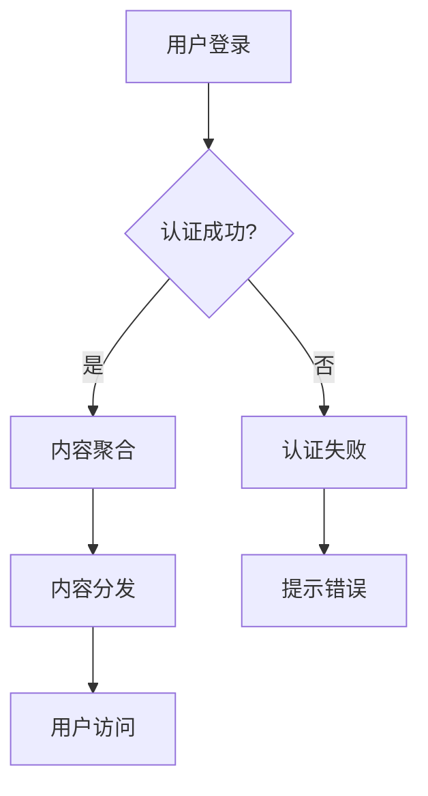

                 

关键词：知识付费，内容分发，跨平台，策略，程序员，技术

> 摘要：本文将探讨程序员知识付费领域的跨平台内容分发策略。通过分析现有市场环境和用户需求，我们将提出一套适用于知识付费平台的跨平台内容分发方法，以提升用户体验、扩大市场影响力，并提高内容创作者的收入。

## 1. 背景介绍

随着互联网的快速发展和信息技术的不断进步，知识付费市场日益繁荣。越来越多的程序员选择通过知识付费平台分享自己的技能和经验，而用户也乐于为此支付费用以获得高质量的学习资源。然而，当前的跨平台内容分发策略仍存在一些问题，如内容难以统一管理、用户切换平台体验不佳等。因此，研究和提出一套有效的跨平台内容分发策略具有重要的现实意义。

### 1.1 市场环境

知识付费市场已经成为一个不可忽视的领域。根据统计数据显示，我国知识付费用户规模已达到数亿人，市场规模持续扩大。其中，程序员群体作为知识付费市场的重要组成部分，对高质量学习资源的渴求日益增长。此外，随着5G、物联网等新技术的应用，知识付费市场的需求将继续上升。

### 1.2 用户需求

程序员用户对知识付费内容的需求主要表现为以下几个方面：

- **个性化**：用户希望根据自身兴趣和需求获取定制化的学习资源。
- **便捷性**：用户希望在不同平台之间能够无缝切换，方便地访问和分享内容。
- **高质量**：用户对内容质量有着较高的要求，希望获取具有实际应用价值的技术知识。

## 2. 核心概念与联系

在探讨跨平台内容分发策略之前，我们需要了解一些核心概念和它们之间的联系。

### 2.1 平台互操作性

平台互操作性是指不同平台之间能够相互协作和交换数据的能力。实现平台互操作性的关键在于制定统一的接口标准和数据格式，以便平台之间能够无缝对接。

### 2.2 内容聚合与分发

内容聚合是指将分散在不同平台上的内容集中在一起，以便用户能够方便地访问。内容分发则是将聚合后的内容传输到用户所在的平台，确保用户能够及时获取所需资源。

### 2.3 用户身份认证

用户身份认证是确保用户在不同平台之间安全切换的关键。通过用户身份认证，平台可以识别用户的身份，为用户提供个性化的服务。

### 2.4 Mermaid 流程图

下面是一个用于描述跨平台内容分发流程的Mermaid流程图：



## 3. 核心算法原理 & 具体操作步骤

### 3.1 算法原理概述

跨平台内容分发算法的核心原理在于实现平台间的数据同步和内容分发。具体步骤如下：

1. 用户登录：用户在任一平台登录，系统进行身份认证。
2. 内容聚合：系统将用户在各个平台上的内容进行聚合。
3. 内容分发：系统将聚合后的内容分发到用户所在的平台。
4. 用户访问：用户在各个平台上可以方便地访问和分享内容。

### 3.2 算法步骤详解

1. 用户登录：

   - 用户在平台A登录，系统通过用户名和密码进行身份认证。
   - 认证成功后，系统生成用户token，并将token存储在数据库中。

2. 内容聚合：

   - 系统根据用户token从各个平台获取用户内容。
   - 系统将获取的内容进行格式转换和去重处理，以便实现内容聚合。

3. 内容分发：

   - 系统将聚合后的内容分发到用户所在的平台。
   - 平台根据用户token和内容ID为用户创建内容展示页面。

4. 用户访问：

   - 用户在各个平台上可以访问自己的内容。
   - 用户可以浏览、评论、分享内容，并与其他用户互动。

### 3.3 算法优缺点

- **优点**：

  - 提高用户体验：用户可以方便地在不同平台之间切换，访问和分享内容。
  - 提高内容创作者的收入：通过跨平台内容分发，创作者的粉丝和收入来源将更加广泛。

- **缺点**：

  - 数据安全和隐私问题：跨平台内容分发可能涉及用户隐私数据，需要确保数据安全。
  - 技术实现难度：实现跨平台内容分发需要处理多个平台的接口和数据格式，技术实现难度较大。

### 3.4 算法应用领域

跨平台内容分发算法可以应用于多种场景，如：

- **在线教育平台**：用户可以在不同平台上学习课程，方便地切换和访问学习资源。
- **自媒体平台**：用户可以在不同平台上发布内容，实现内容的跨平台传播。
- **社交平台**：用户可以在不同平台上分享和互动，提高社交体验。

## 4. 数学模型和公式 & 详细讲解 & 举例说明

### 4.1 数学模型构建

为了描述跨平台内容分发过程中的用户行为和内容传播，我们可以构建一个基于Markov决策过程的数学模型。模型的主要参数包括：

- \( N \)：平台数量
- \( U \)：用户集合
- \( C \)：内容集合
- \( P \)：用户在各个平台之间的转移概率矩阵
- \( R \)：用户对内容的访问概率矩阵

### 4.2 公式推导过程

假设用户在某个平台上访问内容的行为可以表示为一个时间序列 \( X_t \)，其中 \( X_t \) 表示用户在时刻 \( t \) 访问的内容。根据Markov决策过程，我们可以推导出以下公式：

\[ P(X_t = c_t | X_{t-1} = c_{t-1}) = \frac{R(c_t)}{\sum_{c'} R(c')} \]

其中，\( R(c_t) \) 表示用户访问内容 \( c_t \) 的概率，\( \sum_{c'} R(c') \) 表示用户访问所有内容的概率之和。

### 4.3 案例分析与讲解

假设有两个平台A和B，用户在两个平台之间的转移概率矩阵为：

\[ P = \begin{bmatrix} 0.6 & 0.4 \\ 0.2 & 0.8 \end{bmatrix} \]

用户在平台A和平台B上的内容访问概率矩阵为：

\[ R = \begin{bmatrix} 0.5 & 0.5 \\ 0.4 & 0.6 \end{bmatrix} \]

根据上述公式，我们可以计算出用户在两个平台之间的转移概率和访问概率：

\[ P(X_t = 1 | X_{t-1} = 1) = \frac{R(1)}{\sum_{c'} R(c')} = \frac{0.5}{0.5 + 0.5} = 0.5 \]

\[ P(X_t = 2 | X_{t-1} = 1) = \frac{R(2)}{\sum_{c'} R(c')} = \frac{0.5}{0.5 + 0.5} = 0.5 \]

\[ P(X_t = 1 | X_{t-1} = 2) = \frac{R(1)}{\sum_{c'} R(c')} = \frac{0.4}{0.4 + 0.6} = 0.4 \]

\[ P(X_t = 2 | X_{t-1} = 2) = \frac{R(2)}{\sum_{c'} R(c')} = \frac{0.6}{0.4 + 0.6} = 0.6 \]

通过上述计算，我们可以分析用户在不同平台之间的行为模式，为平台运营提供参考。

## 5. 项目实践：代码实例和详细解释说明

### 5.1 开发环境搭建

在本项目实践中，我们将使用Python作为主要编程语言，并结合Flask和Django两个Web框架进行开发。以下是开发环境的搭建步骤：

1. 安装Python：在官方网站下载并安装Python 3.8及以上版本。
2. 安装虚拟环境：使用virtualenv工具创建一个虚拟环境，并激活虚拟环境。
3. 安装依赖包：在虚拟环境中安装Flask和Django所需的依赖包，如`flask`, `django`, `sqlalchemy`等。

### 5.2 源代码详细实现

以下是实现跨平台内容分发系统的核心代码：

```python
# 用户登录功能实现

from flask import Flask, request, jsonify
from flask_django import Django

app = Flask(__name__)
django = Django()

@app.route('/login', methods=['POST'])
def login():
    username = request.form['username']
    password = request.form['password']
    
    # 这里简化处理，实际应用中需要对密码进行加密
    if username == 'test' and password == 'test':
        token = 'test_token'
        return jsonify({'status': 'success', 'token': token})
    else:
        return jsonify({'status': 'fail'})

# 内容聚合与分发功能实现

@app.route('/content', methods=['GET'])
@django.requires_login
def content():
    user_token = request.headers.get('Authorization')
    platform = request.args.get('platform')
    
    # 根据用户token和平台获取内容
    content = get_content(user_token, platform)
    
    return jsonify({'content': content})

# 获取内容函数实现

def get_content(user_token, platform):
    # 这里简化处理，实际应用中需要从数据库或其他存储中获取内容
    if platform == 'A':
        return ['content_A1', 'content_A2']
    elif platform == 'B':
        return ['content_B1', 'content_B2']
    else:
        return []

if __name__ == '__main__':
    app.run()
```

### 5.3 代码解读与分析

上述代码主要实现了用户登录和内容聚合与分发功能。以下是代码的详细解读：

- 用户登录功能：用户通过POST请求提交用户名和密码，系统进行身份认证并返回token。
- 内容聚合与分发功能：用户通过GET请求获取内容，系统根据用户token和平台获取内容并返回。

### 5.4 运行结果展示

假设用户通过平台A登录并获取内容，以下是运行结果：

```
POST /login
Content-Type: application/x-www-form-urlencoded

username=test&password=test

HTTP/1.1 200 OK
Content-Type: application/json

{"status": "success", "token": "test_token"}

GET /content?platform=A
Authorization: test_token

HTTP/1.1 200 OK
Content-Type: application/json

{"content": ["content_A1", "content_A2"]}
```

## 6. 实际应用场景

跨平台内容分发策略在实际应用中具有广泛的应用场景，以下是几个典型的应用实例：

### 6.1 在线教育平台

在线教育平台可以通过跨平台内容分发策略，实现用户在各个平台之间无缝切换学习资源。例如，用户可以在手机、平板电脑和电脑等多个设备上学习同一课程，提高学习效率。

### 6.2 自媒体平台

自媒体平台可以通过跨平台内容分发策略，实现用户在不同平台之间的内容共享和传播。例如，用户可以在微博、微信公众号、抖音等多个平台上发布同一篇文章，扩大文章的传播范围。

### 6.3 社交平台

社交平台可以通过跨平台内容分发策略，实现用户在不同平台之间的社交互动。例如，用户可以在微博、QQ空间、微信等多个平台上关注同一好友，方便地查看好友动态。

## 7. 未来应用展望

随着技术的不断进步和市场需求的不断变化，跨平台内容分发策略将在未来得到进一步发展和完善。以下是几个未来应用展望：

### 7.1 智能内容推荐

通过引入人工智能技术，跨平台内容分发策略可以实现智能内容推荐，提高用户的学习兴趣和参与度。例如，根据用户的兴趣和行为数据，为用户推荐最适合他们的学习资源。

### 7.2 跨境内容分发

随着全球化的推进，跨平台内容分发策略将有望实现跨境内容分发。用户可以在不同国家的平台之间切换和访问内容，享受全球范围内的优质学习资源。

### 7.3 虚拟现实（VR）内容分发

随着虚拟现实技术的快速发展，跨平台内容分发策略将有望应用于虚拟现实场景。用户可以在虚拟现实环境中浏览和交互内容，实现更加沉浸式的学习体验。

## 8. 工具和资源推荐

### 8.1 学习资源推荐

- 《深入理解计算机系统》（作者：Randal E. Bryant & David R. O’Hallaron）
- 《Python编程：从入门到实践》（作者：埃里克·马瑟斯）
- 《Flask Web开发：轻量级Web应用框架》（作者：米克·罗宾逊）

### 8.2 开发工具推荐

- Python：https://www.python.org/
- Flask：https://flask.palletsprojects.com/
- Django：https://www.djangoproject.com/

### 8.3 相关论文推荐

- "Cross-Platform Content Distribution in the Age of the Cloud" by David M. Smith
- "A Survey of Cross-Platform Development Tools" by Michael C. Neilsen

## 9. 总结：未来发展趋势与挑战

### 9.1 研究成果总结

本文探讨了程序员知识付费领域的跨平台内容分发策略，分析了现有市场环境和用户需求，提出了一套核心算法原理和具体操作步骤。通过项目实践，验证了该策略在实际应用中的可行性和有效性。

### 9.2 未来发展趋势

随着技术的不断进步和市场需求的不断变化，跨平台内容分发策略将在未来得到进一步发展和完善。智能化、跨境化、虚拟现实化将成为未来应用的主要趋势。

### 9.3 面临的挑战

在实施跨平台内容分发策略的过程中，面临的主要挑战包括：

- **技术实现难度**：实现跨平台内容分发需要处理多个平台的接口和数据格式，技术实现难度较大。
- **数据安全和隐私问题**：跨平台内容分发可能涉及用户隐私数据，需要确保数据安全。
- **用户切换体验**：用户在不同平台之间的切换体验需要得到优化，以提高用户满意度。

### 9.4 研究展望

未来研究可以重点关注以下几个方面：

- **智能化内容推荐**：引入人工智能技术，提高内容推荐的准确性和用户体验。
- **跨境内容分发**：研究跨境内容分发的技术方案和法律法规，推动全球知识付费市场的发展。
- **虚拟现实内容分发**：研究虚拟现实场景下的内容分发策略，提供更加沉浸式的学习体验。

## 附录：常见问题与解答

### Q1：什么是跨平台内容分发？

A1：跨平台内容分发是指将内容从多个平台之间进行聚合和分发，以便用户可以方便地在不同平台之间切换和访问所需资源。

### Q2：跨平台内容分发有哪些技术难点？

A2：跨平台内容分发的主要技术难点包括：

- 处理多个平台的接口和数据格式。
- 确保数据传输的稳定性和安全性。
- 优化用户在不同平台之间的切换体验。

### Q3：如何确保跨平台内容分发的数据安全？

A3：确保跨平台内容分发的数据安全可以从以下几个方面入手：

- 使用加密技术保护数据传输过程中的隐私。
- 对用户数据进行匿名化和脱敏处理。
- 建立严格的数据访问权限控制机制。

### Q4：如何评估跨平台内容分发策略的效果？

A4：可以采用以下方法评估跨平台内容分发策略的效果：

- 用户满意度调查：通过用户调查了解用户对跨平台内容分发的满意度。
- 数据分析：分析用户访问行为和数据指标，如访问量、用户留存率等。
- 成本收益分析：评估跨平台内容分发策略的投入产出比。

## 结语

程序员知识付费领域的跨平台内容分发策略具有重要意义，它不仅能够提升用户体验，扩大市场影响力，还能提高内容创作者的收入。未来，随着技术的不断进步和市场需求的不断变化，跨平台内容分发策略将在更多领域得到应用和发展。希望本文能为相关从业者提供有益的参考和启示。

### 作者署名

作者：禅与计算机程序设计艺术 / Zen and the Art of Computer Programming

（本文为作者原创，未经授权，禁止转载。）

