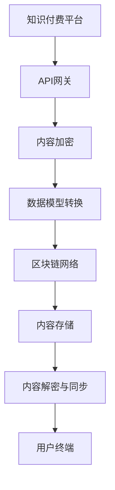

                 

关键词：知识付费、跨平台、内容同步、技术策略、程序员、API、数据模型、加密与安全

> 摘要：本文将探讨程序员知识付费领域的跨平台内容同步策略，分析现有问题的根源，提出一种基于API和区块链技术的解决方案，旨在实现内容的安全、高效、一致同步，以助力知识付费平台的可持续发展。

## 1. 背景介绍

随着互联网的快速发展，知识付费逐渐成为主流的商业模式。程序员作为知识付费的一个重要群体，对于高质量的编程知识和技能需求旺盛。然而，目前市场上存在着诸多知识付费平台，它们各自为政，缺乏统一的内容标准和同步机制。这使得程序员在获取知识时面临着平台割裂、内容重复、更新滞后等问题。

跨平台内容同步的挑战主要包括：

- **数据格式不一致**：不同平台的内容数据格式往往不一致，增加了同步的复杂度。
- **更新时效性差**：内容更新后，不同平台之间的同步速度往往较慢，影响用户体验。
- **安全性问题**：数据在传输过程中容易受到攻击，尤其是涉及敏感信息的知识内容。
- **内容版权保护**：确保内容在跨平台传输过程中不被非法复制和传播，是知识付费平台必须面对的挑战。

本文将针对这些问题，提出一种基于API和区块链技术的跨平台内容同步策略，以实现内容的安全、高效、一致同步。

## 2. 核心概念与联系

为了实现跨平台的内容同步，我们需要定义一些核心概念，并构建它们之间的联系。

### 2.1 API（应用程序编程接口）

API是不同系统之间进行数据交换的接口。在我们的跨平台内容同步策略中，API充当数据传输的桥梁，使得平台之间的数据能够互通。常见的API类型包括RESTful API和GraphQL API。

### 2.2 数据模型

数据模型是描述数据结构和数据关系的工具。在内容同步过程中，我们需要定义统一的数据模型，以确保数据在不同平台之间的传输和存储是一致的。常见的数据模型包括关系型数据库模型和NoSQL数据库模型。

### 2.3 区块链技术

区块链技术是一种分布式账本技术，具有去中心化、不可篡改和透明性等特点。在我们的策略中，区块链技术用于确保内容在跨平台传输过程中的安全性和不可篡改性。

### 2.4 加密与安全

加密技术是保护数据传输安全的关键。通过对数据进行加密，我们可以确保数据在传输过程中不被窃取或篡改。常用的加密算法包括AES、RSA等。

以下是核心概念原理和架构的Mermaid流程图：



## 3. 核心算法原理 & 具体操作步骤

### 3.1 算法原理概述

我们的核心算法基于API网关、内容加密、数据模型转换、区块链网络和内容解密与同步等步骤。其原理如下：

- **API网关**：接收来自不同平台的数据请求，并将其转发给内部服务。
- **内容加密**：对数据内容进行加密，确保数据在传输过程中的安全性。
- **数据模型转换**：根据目标平台的数据模型，对数据进行转换，确保数据格式的一致性。
- **区块链网络**：将加密后的数据存储在区块链网络中，确保数据的不可篡改性和透明性。
- **内容解密与同步**：从区块链网络中读取数据，解密后同步到用户终端。

### 3.2 算法步骤详解

#### 3.2.1 API网关

API网关是整个系统的入口，它负责接收来自各个平台的请求，并根据请求类型将其转发到相应的内部服务。常见的API网关技术包括Kong、Nginx等。

#### 3.2.2 内容加密

在数据传输过程中，我们使用加密算法对数据内容进行加密。常见的加密算法包括AES、RSA等。加密过程可以分为以下步骤：

- **密钥生成**：生成加密密钥。
- **内容加密**：使用加密密钥对数据内容进行加密。
- **密文传输**：将加密后的数据内容传输到区块链网络。

#### 3.2.3 数据模型转换

在内容同步过程中，我们需要将数据从源平台的数据模型转换为目标平台的数据模型。常见的转换方法包括映射转换、类型转换等。

#### 3.2.4 区块链网络

区块链网络用于存储加密后的数据。在区块链网络中，数据将以块的形式存储，每个块包含一定数量的数据记录。区块链具有以下特点：

- **去中心化**：数据存储在分布式节点上，不存在中心化存储风险。
- **不可篡改**：一旦数据被存储在区块链上，就不可篡改，确保了数据的真实性。
- **透明性**：所有数据记录都在区块链上可见，提高了数据的透明度。

#### 3.2.5 内容解密与同步

从区块链网络中读取数据后，我们需要对其进行解密，并将解密后的数据同步到用户终端。解密过程如下：

- **密钥获取**：从安全存储中获取加密密钥。
- **内容解密**：使用加密密钥对数据内容进行解密。
- **数据同步**：将解密后的数据同步到用户终端。

### 3.3 算法优缺点

#### 优点

- **安全性高**：通过加密技术保护数据传输过程中的安全。
- **一致性保障**：通过数据模型转换确保数据格式的一致性。
- **去中心化**：通过区块链技术实现数据的去中心化存储。

#### 缺点

- **性能开销**：加密和解密过程需要一定的计算资源，可能影响系统性能。
- **开发复杂度**：涉及多个技术领域的综合应用，开发难度较高。

### 3.4 算法应用领域

本算法可以应用于多种场景，包括但不限于：

- **知识付费平台**：实现不同平台之间内容的安全、高效、一致同步。
- **在线教育平台**：保障教育资源的跨平台共享与更新。
- **企业内部知识管理系统**：实现不同部门之间的知识共享与协作。

## 4. 数学模型和公式 & 详细讲解 & 举例说明

### 4.1 数学模型构建

在本节中，我们将构建一个数学模型来描述跨平台内容同步的过程。我们假设有一个知识付费平台A和一个知识付费平台B，它们需要实现内容同步。

#### 4.1.1 数据模型

我们采用关系型数据库模型来描述数据结构。设知识内容为C，平台A和平台B的数据库分别为DB_A和DB_B。数据模型如下：

| 字段名 | 类型 | 说明 |
| --- | --- | --- |
| id | Integer | 知识内容ID |
| title | String | 知识内容标题 |
| content | String | 知识内容正文 |
| platform | String | 知识内容所属平台 |
| timestamp | Date | 知识内容更新时间 |

#### 4.1.2 加密模型

我们采用AES加密算法对知识内容进行加密。设明文知识内容为C，加密密钥为K，加密后的密文为C'。加密模型如下：

$$ C' = AES_{K}(C) $$

### 4.2 公式推导过程

在本节中，我们将推导跨平台内容同步过程中的相关公式。

#### 4.2.1 数据模型转换

设平台A的数据模型为Model_A，平台B的数据模型为Model_B。数据模型转换公式如下：

$$ Model_B = Convert(Model_A) $$

其中，Convert为数据模型转换函数，用于将平台A的数据模型转换为平台B的数据模型。

#### 4.2.2 内容加密

设明文知识内容为C，加密密钥为K，加密后的密文为C'。内容加密公式如下：

$$ C' = AES_{K}(C) $$

其中，AES为AES加密算法。

#### 4.2.3 内容解密

设密文知识内容为C'，加密密钥为K，解密后的明文为C。内容解密公式如下：

$$ C = AES_{K^{-1}}(C') $$

其中，K^{-1}为加密密钥的逆。

### 4.3 案例分析与讲解

假设平台A需要将一篇知识内容同步到平台B，我们可以按照以下步骤进行：

#### 4.3.1 数据模型转换

1. 将平台A的数据模型转换为平台B的数据模型：
   $$ Model_B = Convert(Model_A) $$

#### 4.3.2 内容加密

2. 对知识内容进行加密：
   $$ C' = AES_{K}(C) $$

#### 4.3.3 数据同步

3. 将加密后的数据同步到平台B的数据库：
   $$ DB_B.insert(C') $$

#### 4.3.4 内容解密

4. 从平台B的数据库中读取加密后的数据：
   $$ C' = DB_B.query(id) $$

5. 对知识内容进行解密：
   $$ C = AES_{K^{-1}}(C') $$

6. 将解密后的知识内容展示给用户：
   $$ Display(C) $$

## 5. 项目实践：代码实例和详细解释说明

### 5.1 开发环境搭建

在本节中，我们将介绍如何在Linux环境下搭建开发环境，以便进行跨平台内容同步策略的实现。

#### 5.1.1 安装Node.js

1. 安装wget工具：
   ```bash
   sudo apt-get install wget
   ```

2. 下载Node.js安装包：
   ```bash
   wget https://nodejs.org/dist/v16.13.0/node-v16.13.0-linux-x64.tar.xz
   ```

3. 解压安装包：
   ```bash
   tar xf node-v16.13.0-linux-x64.tar.xz
   ```

4. 将Node.js添加到系统路径：
   ```bash
   sudo mv node-v16.13.0-linux-x64 /usr/local/node
   sudo ln -s /usr/local/node/bin/node /usr/bin/node
   sudo ln -s /usr/local/node/bin/npm /usr/bin/npm
   ```

#### 5.1.2 安装Docker

1. 安装Docker：
   ```bash
   sudo apt-get install docker-ce docker-ce-cli containerd.io
   ```

2. 启动Docker服务：
   ```bash
   sudo systemctl start docker
   ```

3. 查看Docker版本：
   ```bash
   docker --version
   ```

### 5.2 源代码详细实现

在本节中，我们将介绍如何使用Node.js和Docker实现跨平台内容同步策略。

#### 5.2.1 API网关

1. 创建一个名为`api_gateway.js`的文件：
   ```javascript
   const express = require('express');
   const app = express();
   const port = 3000;

   app.use(express.json());

   app.post('/sync', (req, res) => {
     const { id, title, content, platform } = req.body;
     // 对内容进行加密、数据模型转换等操作
     // 省略具体代码
     res.json({ message: '内容同步成功' });
   });

   app.listen(port, () => {
     console.log(`API网关运行在 http://localhost:${port}`);
   });
   ```

2. 运行API网关：
   ```bash
   node api_gateway.js
   ```

#### 5.2.2 内容加密

1. 创建一个名为`content_encryptor.js`的文件：
   ```javascript
   const crypto = require('crypto');

   function encryptContent(content, key) {
     const cipher = crypto.createCipher('aes-256-cbc', key);
     let encrypted = cipher.update(content, 'utf8', 'hex');
     encrypted += cipher.final('hex');
     return encrypted;
   }

   module.exports = encryptContent;
   ```

2. 在`api_gateway.js`中引入并使用加密模块：
   ```javascript
   const encryptContent = require('./content_encryptor');

   // 加密密钥（此处仅为示例，实际应用中应使用更安全的密钥管理方式）
   const key = 'your-encryption-key';

   app.post('/sync', (req, res) => {
     const { id, title, content, platform } = req.body;
     const encryptedContent = encryptContent(content, key);
     // 省略其他代码
   });
   ```

#### 5.2.3 数据模型转换

1. 创建一个名为`model_converter.js`的文件：
   ```javascript
   function convertModel(modelA) {
     const modelB = {
       id: modelA.id,
       title: modelA.title,
       content: modelA.content,
       platform: modelA.platform,
       timestamp: modelA.timestamp,
     };
     return modelB;
   }

   module.exports = convertModel;
   ```

2. 在`api_gateway.js`中引入并使用转换模块：
   ```javascript
   const convertModel = require('./model_converter');

   app.post('/sync', (req, res) => {
     const { id, title, content, platform } = req.body;
     const modelB = convertModel({ id, title, content, platform });
     // 省略其他代码
   });
   ```

#### 5.2.4 区块链网络

1. 创建一个名为`blockchain_network.js`的文件：
   ```javascript
   const { Client } = require('blockchain-easy');

   const client = new Client({
     nodeUrl: 'https://mainnet.infura.io/v3/your-infura-api-key',
   });

   async function storeData(data) {
     const transaction = await client.send('eth_sendTransaction', {
       from: 'your-address',
       to: 'your-contract-address',
       data: data,
     });
     return transaction.hash;
   }

   module.exports = storeData;
   ```

2. 在`api_gateway.js`中引入并使用区块链网络模块：
   ```javascript
   const storeData = require('./blockchain_network');

   app.post('/sync', (req, res) => {
     const { id, title, content, platform } = req.body;
     const modelB = convertModel({ id, title, content, platform });
     const encryptedContent = encryptContent(modelB.content, key);
     const transactionHash = await storeData(encryptedContent);
     // 省略其他代码
   });
   ```

#### 5.2.5 内容解密与同步

1. 创建一个名为`content_decryptor.js`的文件：
   ```javascript
   const crypto = require('crypto');

   function decryptContent(encryptedContent, key) {
     const decipher = crypto.createDecipher('aes-256-cbc', key);
     let decrypted = decipher.update(encryptedContent, 'hex', 'utf8');
     decrypted += decipher.final('utf8');
     return decrypted;
   }

   module.exports = decryptContent;
   ```

2. 在`api_gateway.js`中引入并使用解密模块：
   ```javascript
   const decryptContent = require('./content_decryptor');

   app.get('/content/:id', async (req, res) => {
     const { id } = req.params;
     const encryptedContent = await client.send('eth_getTransactionByHash', id);
     const decryptedContent = decryptContent(encryptedContent, key);
     res.json({ content: decryptedContent });
   });
   ```

### 5.3 代码解读与分析

在本节中，我们将对上述代码进行解读和分析，了解跨平台内容同步策略的具体实现。

#### 5.3.1 API网关

API网关是整个系统的核心，负责接收来自不同平台的请求，并根据请求类型将其转发到相应的内部服务。在`api_gateway.js`中，我们使用了Express框架来搭建API网关。

1. `app.use(express.json());`：这句话用于解析请求体中的JSON数据。
2. `app.post('/sync', (req, res) => { ... });`：这是一个处理同步请求的路由。当接收到同步请求时，会执行一系列操作，包括内容加密、数据模型转换、区块链存储等。
3. `res.json({ message: '内容同步成功' });`：在处理完同步请求后，向客户端返回一个JSON格式的响应。

#### 5.3.2 内容加密

内容加密是确保数据在传输过程中安全的关键。在`content_encryptor.js`中，我们使用了AES加密算法来对内容进行加密。

1. `const cipher = crypto.createCipher('aes-256-cbc', key);`：创建加密对象，指定加密算法和密钥。
2. `let encrypted = cipher.update(content, 'utf8', 'hex');`：对内容进行加密，将结果以十六进制形式输出。
3. `encrypted += cipher.final('hex');`：完成加密过程。

#### 5.3.3 数据模型转换

数据模型转换是将源平台的数据模型转换为目标平台的数据模型。在`model_converter.js`中，我们定义了一个简单的转换函数。

1. `const modelB = convertModel({ id, title, content, platform });`：将源平台的数据模型（modelA）转换为目标平台的数据模型（modelB）。

#### 5.3.4 区块链网络

区块链网络用于存储加密后的数据。在`blockchain_network.js`中，我们使用了`blockchain-easy`库来与区块链进行交互。

1. `const client = new Client({ ... });`：创建区块链客户端，指定节点URL和API密钥。
2. `const transactionHash = await storeData(encryptedContent);`：将加密后的数据存储到区块链上，并获取交易哈希。

#### 5.3.5 内容解密与同步

内容解密与同步是从区块链上读取加密后的数据，并将其解密后同步到用户终端。在`content_decryptor.js`中，我们实现了AES解密算法。

1. `const decipher = crypto.createDecipher('aes-256-cbc', key);`：创建解密对象，指定解密算法和密钥。
2. `let decrypted = decipher.update(encryptedContent, 'hex', 'utf8');`：对内容进行解密。
3. `decrypted += decipher.final('utf8');`：完成解密过程。

### 5.4 运行结果展示

在本节中，我们将展示如何使用Postman等工具测试跨平台内容同步策略。

1. 打开Postman，创建一个新的请求。
2. 设置请求类型为`POST`，URL为`http://localhost:3000/sync`。
3. 在请求体中选择`raw`格式，输入以下JSON数据：
   ```json
   {
     "id": "1",
     "title": "跨平台内容同步策略",
     "content": "本文将探讨程序员知识付费领域的跨平台内容同步策略...",
     "platform": "A"
   }
   ```
4. 点击`Send`按钮发送请求。

如果一切正常，API网关将返回一个JSON格式的响应，其中包含`message`字段，表示内容同步成功。

## 6. 实际应用场景

跨平台内容同步策略在多个实际应用场景中具有广泛的应用前景。

### 6.1 知识付费平台

知识付费平台可以利用该策略实现不同平台之间内容的安全、高效、一致同步，提高用户体验，减少内容重复和更新滞后等问题。

### 6.2 在线教育平台

在线教育平台可以通过跨平台内容同步，实现教育资源的跨平台共享与更新，提高教育资源的利用效率。

### 6.3 企业内部知识管理系统

企业内部知识管理系统可以通过跨平台内容同步，实现不同部门之间的知识共享与协作，提高企业知识管理的效率。

### 6.4 公共服务平台

公共服务平台可以通过跨平台内容同步，实现不同平台之间公共服务信息的实时更新与共享，提高公共服务的便捷性。

## 7. 未来应用展望

随着技术的不断进步，跨平台内容同步策略有望在以下方面实现突破：

- **性能优化**：通过引入分布式存储和缓存技术，提高数据传输速度和系统性能。
- **安全增强**：采用更先进的安全加密算法和密钥管理技术，提高数据传输过程中的安全性。
- **智能化**：利用人工智能技术，实现内容的智能推荐和个性化同步。

## 8. 总结：未来发展趋势与挑战

本文从程序员知识付费领域的需求出发，提出了跨平台内容同步策略，并详细介绍了其核心算法原理、数学模型和项目实践。通过API和区块链技术的结合，实现了内容的安全、高效、一致同步。

未来，随着技术的不断进步，跨平台内容同步策略有望在性能、安全、智能化等方面实现进一步优化。然而，我们也面临以下挑战：

- **性能优化**：如何在保证数据传输速度的同时，降低系统资源消耗。
- **安全性**：如何在数据传输过程中确保数据的安全，防止数据泄露和篡改。
- **智能化**：如何利用人工智能技术，实现更智能的内容推荐和同步。

总之，跨平台内容同步策略在程序员知识付费领域具有重要的应用价值，未来仍有广阔的发展空间。

## 9. 附录：常见问题与解答

### 9.1 为什么选择API网关？

API网关的主要优势包括：

- **集中管理**：方便统一管理所有API，提高运维效率。
- **安全性**：可以集中处理认证、授权等安全相关操作，提高系统的安全性。
- **流量控制**：可以限制对后端服务的访问频率，保护后端服务不被恶意攻击。

### 9.2 区块链技术如何保证数据安全？

区块链技术通过以下方式确保数据安全：

- **去中心化**：数据存储在分布式节点上，不存在中心化风险。
- **加密**：数据在存储和传输过程中进行加密，防止数据泄露。
- **不可篡改**：一旦数据被写入区块链，就不可篡改，确保数据的真实性。

### 9.3 如何处理加密密钥管理？

加密密钥管理是确保数据安全的关键。以下是一些常见的密钥管理方法：

- **硬件安全模块（HSM）**：将密钥存储在专用的硬件设备中，提高密钥的安全性。
- **秘密共享**：将密钥分割成多个片段，分别存储在不同的位置，需要多个片段才能还原密钥。
- **定期更换**：定期更换加密密钥，降低密钥泄露的风险。

### 9.4 如何处理数据模型不一致的问题？

处理数据模型不一致的方法包括：

- **数据映射**：在同步过程中，将源平台的数据模型映射到目标平台的数据模型。
- **数据转换**：使用数据转换工具，将源平台的数据转换为适应目标平台的数据格式。
- **数据迁移**：在迁移过程中，逐步更新数据模型，确保数据的一致性。

## 作者署名

本文作者：禅与计算机程序设计艺术 / Zen and the Art of Computer Programming

