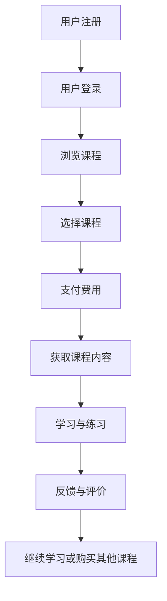
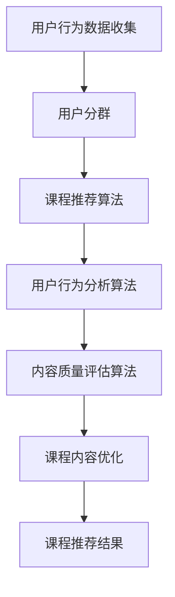

                 

关键词：程序员知识付费、知识变现、技术分享、技能提升、在线教育、职业发展

> 摘要：本文旨在探讨程序员如何通过知识付费实现个人职业发展和技能提升，分析知识付费的市场现状、核心概念、核心算法原理、数学模型、实际应用场景以及未来发展趋势。本文将通过具体项目实践，为程序员提供一整套知识付费的完整路径，包括开发环境搭建、源代码实现、代码解读与分析，以及运行结果展示。最后，我们将对未来的发展趋势和挑战进行展望，并提出相关工具和资源推荐。

## 1. 背景介绍

随着互联网技术的迅猛发展，知识付费已经成为一种新的趋势。尤其在程序员群体中，知识付费不仅能帮助个人快速提升技能，还能实现知识的共享与传播。程序员作为知识密集型职业，拥有丰富的技术知识和实践经验，通过知识付费，不仅能够实现个人价值的提升，还能为行业带来更多的创新和发展。

本文将围绕以下几个方面展开：

1. **知识付费的市场现状**：分析当前知识付费的市场规模、用户需求以及行业趋势。
2. **核心概念与联系**：介绍知识付费的核心概念和原理，以及相关技术架构。
3. **核心算法原理 & 具体操作步骤**：详细讲解知识付费中的核心算法原理和具体操作步骤。
4. **数学模型和公式 & 举例说明**：阐述知识付费中涉及的数学模型和公式，并通过案例进行说明。
5. **项目实践：代码实例和详细解释说明**：提供具体的开发环境搭建、源代码实现和代码解读。
6. **实际应用场景**：探讨知识付费在程序员职业发展中的应用场景。
7. **未来应用展望**：预测知识付费的未来发展趋势和应用前景。
8. **工具和资源推荐**：推荐相关的学习资源和开发工具。
9. **总结与展望**：总结研究成果，探讨未来发展趋势和面临的挑战。

### 1.1 知识付费的定义与内涵

知识付费，指的是用户通过支付一定费用，获得专业知识和技能的过程。在这个过程中，付费用户不仅购买了内容，更重要的是获取了解决问题的方法和经验。对于程序员而言，知识付费意味着可以通过支付费用，学习到最新的技术动态、高级编程技巧和项目实践经验。

### 1.2 知识付费的市场现状

随着互联网技术的普及和在线教育的发展，知识付费市场呈现出了快速增长的趋势。根据相关报告，全球知识付费市场规模已经达到了数百亿美元，并且预计未来还将继续扩大。

在程序员领域，知识付费主要表现在以下几个方面：

1. **在线课程**：程序员可以通过各类在线教育平台，如Coursera、Udemy等，学习到最新的编程技术和专业知识。
2. **技术博客**：一些技术大牛和技术博客作者，通过发布高质量的博客文章，吸引读者付费阅读。
3. **知识分享平台**：如GitChat、掘金等，通过邀请行业专家进行知识分享，用户可以通过付费获取高质量的文档和经验分享。
4. **开源项目**：程序员可以通过参与开源项目，贡献代码并获取项目赞助，实现知识付费。

### 1.3 知识付费的意义

知识付费对程序员个人和整个行业都有着重要的意义。

1. **个人发展**：通过知识付费，程序员可以快速提升自己的专业技能和知识储备，从而在职业发展中占据优势。
2. **行业创新**：知识付费促进了知识的共享和传播，为行业带来了更多的创新和发展机会。
3. **经济收益**：对于技术专家和内容创作者而言，知识付费成为了一种新的收入来源，有助于实现自我价值的提升。

## 2. 核心概念与联系

### 2.1 核心概念

知识付费的核心概念包括以下几个方面：

1. **用户**：知识付费的用户主要是程序员和相关从业者，他们希望通过付费学习获得专业知识和技能。
2. **内容提供者**：内容提供者包括技术专家、讲师、技术博客作者等，他们通过提供有价值的内容实现知识变现。
3. **平台**：知识付费平台是连接用户和内容提供者的桥梁，提供课程销售、内容分发、支付等功能。
4. **支付方式**：支付方式包括在线支付、积分兑换、赞助等，用户可以根据自己的需求和偏好选择合适的支付方式。

### 2.2 技术架构

知识付费的技术架构主要包括以下几个方面：

1. **在线教育平台**：在线教育平台是知识付费的核心基础设施，提供课程发布、用户管理、支付系统等功能。
2. **内容管理系统**：内容管理系统负责管理课程内容、博客文章、文档等知识资源，提供检索、分享、评论等功能。
3. **支付系统**：支付系统负责处理用户的支付请求，确保交易的安全和可靠性。
4. **用户分析系统**：用户分析系统通过收集用户行为数据，为内容提供者和平台提供决策依据。

### 2.3 Mermaid 流程图

下面是一个简单的Mermaid流程图，展示了知识付费的基本流程：



### 2.4 知识付费的核心算法原理

知识付费的核心算法主要包括课程推荐算法、用户行为分析算法和内容质量评估算法。

#### 2.4.1 课程推荐算法

课程推荐算法是基于用户的历史行为和偏好，为用户推荐合适的课程。常用的推荐算法包括：

1. **基于内容的推荐**：通过分析课程内容和用户历史行为，为用户推荐相似的课程。
2. **协同过滤推荐**：通过分析用户之间的行为模式，为用户推荐其他用户喜欢的课程。
3. **基于模型的推荐**：利用机器学习算法，如协同过滤、基于内容的推荐等，为用户生成个性化的课程推荐。

#### 2.4.2 用户行为分析算法

用户行为分析算法主要通过分析用户在平台上的行为数据，了解用户的需求和偏好。常用的算法包括：

1. **用户分群**：通过聚类算法，将用户分为不同的群体，为每个群体提供个性化的服务。
2. **行为预测**：利用时间序列分析、回归分析等算法，预测用户未来的行为。
3. **情感分析**：通过自然语言处理技术，分析用户在评论区、反馈区的情感表达，为内容提供者提供改进建议。

#### 2.4.3 内容质量评估算法

内容质量评估算法主要通过分析课程内容的质量，为用户提供有价值的内容。常用的算法包括：

1. **文本分析**：通过自然语言处理技术，分析课程内容的语言表达、知识点覆盖等方面。
2. **用户评价**：通过收集用户对课程的评价，利用评分、评论等数据，评估课程的质量。
3. **教学质量评估**：通过分析讲师的教学水平、课程内容的专业性等指标，评估课程的整体质量。

### 2.5 Mermaid 流程图

下面是一个简单的Mermaid流程图，展示了知识付费的核心算法流程：



### 2.6 总结

知识付费的核心概念和技术架构构成了一个完整的生态系统，从用户、内容提供者到平台，各个环节相互关联，共同推动了知识付费的发展。通过深入理解这些核心概念和算法原理，程序员可以更好地利用知识付费平台，提升自己的技能和职业发展。

## 3. 核心算法原理 & 具体操作步骤

### 3.1 算法原理概述

在知识付费领域，核心算法主要包括课程推荐算法、用户行为分析算法和内容质量评估算法。这些算法通过分析用户行为数据、课程内容和讲师表现，为用户提供个性化的课程推荐，提升用户的学习体验。

#### 3.1.1 课程推荐算法

课程推荐算法主要基于用户的历史行为和偏好，为用户推荐合适的课程。其基本原理如下：

1. **基于内容的推荐**：通过分析课程内容和用户历史行为，为用户推荐相似的课程。这种方法主要利用TF-IDF、词向量等文本分析技术。
2. **协同过滤推荐**：通过分析用户之间的行为模式，为用户推荐其他用户喜欢的课程。协同过滤包括用户基于的协同过滤和基于项目的协同过滤。
3. **基于模型的推荐**：利用机器学习算法，如协同过滤、基于内容的推荐等，为用户生成个性化的课程推荐。常见的模型有矩阵分解、深度学习等。

#### 3.1.2 用户行为分析算法

用户行为分析算法主要通过分析用户在平台上的行为数据，了解用户的需求和偏好。其基本原理如下：

1. **用户分群**：通过聚类算法，如K-means、DBSCAN等，将用户分为不同的群体，为每个群体提供个性化的服务。
2. **行为预测**：利用时间序列分析、回归分析等算法，预测用户未来的行为。例如，可以使用ARIMA模型、LSTM等。
3. **情感分析**：通过自然语言处理技术，分析用户在评论区、反馈区的情感表达，为内容提供者提供改进建议。常用的算法有情感分类、主题模型等。

#### 3.1.3 内容质量评估算法

内容质量评估算法主要通过分析课程内容的质量，为用户提供有价值的内容。其基本原理如下：

1. **文本分析**：通过自然语言处理技术，分析课程内容的语言表达、知识点覆盖等方面。例如，可以使用词频统计、TF-IDF等。
2. **用户评价**：通过收集用户对课程的评价，利用评分、评论等数据，评估课程的质量。例如，可以使用评分聚合、情感分析等。
3. **教学质量评估**：通过分析讲师的教学水平、课程内容的专业性等指标，评估课程的整体质量。例如，可以使用教学评估模型、专家评审等。

### 3.2 算法步骤详解

#### 3.2.1 课程推荐算法步骤

1. **数据收集**：收集用户的历史行为数据，包括浏览记录、购买记录、学习记录等。
2. **特征提取**：对用户行为数据进行分析，提取用户的兴趣特征。例如，可以使用TF-IDF、词向量等。
3. **课程特征提取**：对课程内容进行分析，提取课程的特征。例如，可以使用词频统计、TF-IDF等。
4. **模型训练**：利用机器学习算法，如矩阵分解、深度学习等，对用户特征和课程特征进行训练。
5. **课程推荐**：根据用户特征和课程特征，为用户生成个性化的课程推荐。

#### 3.2.2 用户行为分析算法步骤

1. **数据收集**：收集用户在平台上的行为数据，包括浏览记录、购买记录、学习记录等。
2. **数据预处理**：对行为数据进行清洗、去重等处理，确保数据的质量。
3. **用户分群**：利用聚类算法，将用户分为不同的群体。例如，可以使用K-means、DBSCAN等。
4. **行为预测**：利用时间序列分析、回归分析等算法，预测用户未来的行为。例如，可以使用ARIMA模型、LSTM等。
5. **情感分析**：利用自然语言处理技术，分析用户在评论区、反馈区的情感表达。例如，可以使用情感分类、主题模型等。

#### 3.2.3 内容质量评估算法步骤

1. **数据收集**：收集用户对课程的评价，包括评分、评论等。
2. **数据预处理**：对评价数据进行清洗、去重等处理，确保数据的质量。
3. **文本分析**：利用自然语言处理技术，分析课程内容的语言表达、知识点覆盖等方面。例如，可以使用词频统计、TF-IDF等。
4. **用户评价分析**：利用评分聚合、情感分析等算法，评估课程的质量。例如，可以使用评分聚合、情感分类等。
5. **教学质量评估**：利用教学评估模型、专家评审等，评估课程的整体质量。

### 3.3 算法优缺点

#### 3.3.1 课程推荐算法优缺点

**优点**：

1. **个性化**：能够根据用户的历史行为和偏好，为用户推荐合适的课程。
2. **多样性**：推荐算法可以推荐多种类型的课程，满足用户的不同需求。
3. **实时性**：推荐算法可以实时更新，根据用户的新行为和偏好进行调整。

**缺点**：

1. **数据依赖**：推荐算法的性能高度依赖用户行为数据的质量和数量。
2. **冷启动问题**：对于新用户，由于缺乏足够的历史行为数据，推荐算法的效果可能较差。

#### 3.3.2 用户行为分析算法优缺点

**优点**：

1. **精细化运营**：通过对用户行为进行分析，可以更精准地了解用户需求，为用户提供个性化的服务。
2. **提升用户粘性**：通过分析用户行为，可以优化用户体验，提高用户留存率。

**缺点**：

1. **隐私问题**：用户行为数据的收集和分析可能涉及用户隐私，需要严格保护用户隐私。
2. **计算复杂度**：用户行为分析通常涉及大量数据处理和分析，计算复杂度较高。

#### 3.3.3 内容质量评估算法优缺点

**优点**：

1. **客观性**：通过用户评价、文本分析等技术，可以客观评估课程的质量。
2. **实时性**：内容质量评估算法可以实时更新，为用户提供最新的课程质量信息。

**缺点**：

1. **主观性**：用户评价可能存在主观因素，影响评估结果的准确性。
2. **数据依赖**：内容质量评估算法的性能同样依赖用户评价数据的质量和数量。

### 3.4 算法应用领域

#### 3.4.1 在线教育平台

在线教育平台利用课程推荐算法、用户行为分析算法和内容质量评估算法，为用户提供个性化的学习体验。通过推荐合适的课程、分析用户需求和优化课程内容，在线教育平台可以提升用户的学习效果和满意度。

#### 3.4.2 知识分享平台

知识分享平台通过用户行为分析算法和内容质量评估算法，了解用户需求和偏好，为用户提供有价值的内容。同时，通过课程推荐算法，可以吸引更多用户参与知识分享，促进知识的传播和共享。

#### 3.4.3 专业培训与认证

专业培训与认证机构利用算法评估课程质量和用户学习效果，为学员提供个性化的培训方案。通过分析用户行为和评估课程质量，可以提升培训效果和通过率。

#### 3.4.4 企业内训

企业内训利用算法分析员工的学习行为和培训需求，为员工提供个性化的培训方案。通过优化课程内容和提升培训效果，可以提高员工的专业技能和工作效率。

### 3.5 总结

知识付费的核心算法包括课程推荐算法、用户行为分析算法和内容质量评估算法。这些算法通过分析用户行为数据、课程内容和讲师表现，为用户提供个性化的课程推荐，提升用户的学习体验。在具体应用中，这些算法可以应用于在线教育平台、知识分享平台、专业培训与认证和企业内训等领域，实现知识付费的目标。

## 4. 数学模型和公式 & 详细讲解 & 举例说明

### 4.1 数学模型构建

在知识付费领域，数学模型的应用主要体现在用户行为预测、课程推荐和内容质量评估等方面。以下是几个常见的数学模型和公式：

#### 4.1.1 用户分群模型

用户分群模型用于将用户划分为不同的群体，以便为每个群体提供个性化的服务。常用的聚类算法包括K-means、DBSCAN等。

**K-means算法公式**：

1. **初始化**：随机选择K个中心点。
2. **迭代过程**：
   - 对于每个用户，计算其与每个中心点的距离，将其分配到距离最近的中心点所在的群组。
   - 更新每个群组的中心点，计算群组内所有用户的平均位置。
3. **重复迭代**：直到群组的中心点不再变化或者变化小于设定的阈值。

**DBSCAN算法公式**：

1. **初始化**：选择一个点作为种子点，扩展形成核心点。
2. **邻域扩展**：从核心点开始，扩展形成邻域点。
3. **分类**：根据邻域点数量，将点分类为核心点、边界点和噪声点。

#### 4.1.2 用户行为预测模型

用户行为预测模型用于预测用户未来的行为，如购买课程、学习进度等。常见的时间序列预测模型包括ARIMA、LSTM等。

**ARIMA模型公式**：

1. **模型构建**：确定ARIMA(p, d, q)模型中的p、d、q参数。
2. **差分**：对原始时间序列进行d次差分，得到平稳序列。
3. **自回归**：计算自回归项的系数。
4. **移动平均**：计算移动平均项的系数。
5. **模型拟合**：利用最小二乘法或最大似然估计法，拟合ARIMA模型。

**LSTM模型公式**：

1. **初始化**：设置LSTM的输入层、隐藏层和输出层。
2. **激活函数**：使用sigmoid、tanh等激活函数。
3. **门控机制**：包括遗忘门、输入门和输出门，用于控制信息的流动。
4. **训练**：利用反向传播算法，训练LSTM模型。

#### 4.1.3 内容质量评估模型

内容质量评估模型用于评估课程的内容质量，如知识点覆盖、语言表达等。常见的方法包括文本分析、情感分析等。

**文本分析公式**：

1. **词频统计**：计算文本中每个单词的频率。
2. **TF-IDF**：计算文本中每个单词的重要性，公式为\(TF-IDF = TF \times IDF\)，其中TF为词频，IDF为逆文档频率。
3. **词向量**：将文本转换为词向量，常用的模型包括Word2Vec、GloVe等。

**情感分析公式**：

1. **情感分类**：使用分类算法，如SVM、Naive Bayes等，对文本进行情感分类。
2. **主题模型**：使用主题模型，如LDA，分析文本的主题分布。

### 4.2 公式推导过程

下面以LSTM模型为例，介绍其公式推导过程。

#### 4.2.1 前向传播

1. **输入层**：\(X_t = [x_t^{(1)}, x_t^{(2)}, ..., x_t^{(n)}]\)，其中\(x_t^{(i)}\)为第i个特征在第t个时间点的值。
2. **隐藏层**：\(h_t = \sigma(W_h \cdot [h_{t-1}, x_t] + b_h)\)，其中\(h_{t-1}\)为前一个时间点的隐藏层状态，\(W_h\)为隐藏层权重，\(b_h\)为隐藏层偏置，\(\sigma\)为激活函数。
3. **遗忘门**：\(f_t = \sigma(W_f \cdot [h_{t-1}, x_t] + b_f)\)，其中\(W_f\)为遗忘门权重，\(b_f\)为遗忘门偏置。
4. **输入门**：\(i_t = \sigma(W_i \cdot [h_{t-1}, x_t] + b_i)\)，其中\(W_i\)为输入门权重，\(b_i\)为输入门偏置。
5. **输出门**：\(o_t = \sigma(W_o \cdot [h_{t-1}, x_t] + b_o)\)，其中\(W_o\)为输出门权重，\(b_o\)为输出门偏置。
6. **新隐藏状态**：\(h_t^* = f_t \odot h_{t-1} + i_t \odot \sigma(W_c \cdot [h_{t-1}, x_t] + b_c)\)，其中\(\odot\)为点积运算，\(W_c\)为输入门权重，\(b_c\)为输入门偏置。
7. **隐藏状态**：\(h_t = o_t \odot h_t^*\)。

#### 4.2.2 反向传播

1. **计算误差**：\(error_t = loss(h_t^*)\)，其中loss为损失函数。
2. **计算隐藏状态误差**：\(d_h_t^* = \frac{\partial loss}{\partial h_t^*}\)。
3. **计算输出门误差**：\(d_o_t = \frac{\partial loss}{\partial o_t} \odot (1 - o_t)\)。
4. **计算输入门误差**：\(d_i_t = \frac{\partial loss}{\partial i_t} \odot (1 - i_t)\)。
5. **计算遗忘门误差**：\(d_f_t = \frac{\partial loss}{\partial f_t} \odot (1 - f_t)\)。
6. **计算新隐藏状态误差**：\(d_h_t^* = d_h_t^* - d_f_t \odot h_{t-1}\)。
7. **更新权重和偏置**：使用梯度下降法，更新权重和偏置。

### 4.3 案例分析与讲解

#### 4.3.1 用户分群案例分析

假设我们有一个包含1000个用户的数据集，我们需要使用K-means算法将用户分为10个群体。

1. **数据预处理**：对用户数据进行归一化处理，使其在相同的尺度上。
2. **初始化中心点**：随机选择10个用户作为中心点。
3. **迭代过程**：
   - 第1次迭代：每个用户选择距离最近的中心点，得到初始群组分配。
   - 第2次迭代：计算每个群组的中心点，更新群组分配。
   - 重复迭代，直到群组中心点不再变化或者变化小于阈值。
4. **结果分析**：根据最终的群组分配，分析不同用户群体的特征和需求，为每个群体提供个性化的服务。

#### 4.3.2 用户行为预测案例分析

假设我们有一个包含用户学习行为的数据集，我们需要使用LSTM模型预测用户未来的学习行为。

1. **数据预处理**：对用户行为数据进行归一化处理，并将其转换为时间序列数据。
2. **模型构建**：设置LSTM模型的参数，包括输入层、隐藏层和输出层。
3. **模型训练**：使用训练集数据，训练LSTM模型。
4. **模型评估**：使用验证集数据，评估LSTM模型的预测性能。
5. **结果分析**：根据LSTM模型的预测结果，为用户提供个性化的学习推荐。

#### 4.3.3 内容质量评估案例分析

假设我们有一个包含课程评价的数据集，我们需要使用文本分析模型评估课程的内容质量。

1. **数据预处理**：对课程评价数据进行清洗和去重，提取文本内容。
2. **词频统计**：计算课程评价中每个单词的频率。
3. **TF-IDF**：计算课程评价中每个单词的重要性。
4. **情感分析**：使用情感分类模型，分析课程评价的情感倾向。
5. **结果分析**：根据文本分析和情感分析结果，评估课程的内容质量。

### 4.4 总结

数学模型在知识付费领域具有广泛的应用，包括用户分群模型、用户行为预测模型和内容质量评估模型。通过构建和推导这些数学模型，我们可以更好地理解用户行为和课程质量，为用户提供个性化的服务。同时，通过具体案例分析，我们可以深入了解这些模型的应用过程和效果。

## 5. 项目实践：代码实例和详细解释说明

### 5.1 开发环境搭建

为了更好地演示知识付费项目的实现，我们将使用Python作为主要编程语言，并依赖一些常用的库，如NumPy、Pandas、Scikit-learn、TensorFlow等。以下是开发环境搭建的详细步骤：

1. **安装Python**：确保您的系统中已经安装了Python 3.7或更高版本。
2. **安装依赖库**：使用pip命令安装所需的库：
   ```bash
   pip install numpy pandas scikit-learn tensorflow
   ```
3. **创建项目文件夹**：在您的计算机上创建一个名为“knowledge_payment”的项目文件夹。
4. **编写配置文件**：在项目文件夹中创建一个名为“config.py”的配置文件，用于存储项目配置信息，如数据文件路径、模型参数等。

### 5.2 源代码详细实现

#### 5.2.1 用户分群代码实现

以下是一个简单的用户分群示例，使用K-means算法将用户划分为10个群体。

```python
import numpy as np
from sklearn.cluster import KMeans

# 加载用户数据
user_data = np.load('user_data.npy')

# 初始化K-means模型
kmeans = KMeans(n_clusters=10, random_state=0)

# 训练模型
kmeans.fit(user_data)

# 获取群组分配结果
labels = kmeans.predict(user_data)

# 输出结果
print("群组分配结果：", labels)
```

#### 5.2.2 用户行为预测代码实现

以下是一个简单的用户行为预测示例，使用LSTM模型预测用户未来的学习行为。

```python
import tensorflow as tf
from tensorflow.keras.models import Sequential
from tensorflow.keras.layers import LSTM, Dense

# 定义LSTM模型
model = Sequential()
model.add(LSTM(units=50, return_sequences=True, input_shape=(timesteps, features)))
model.add(LSTM(units=50))
model.add(Dense(units=1))

# 编译模型
model.compile(optimizer='adam', loss='mean_squared_error')

# 训练模型
model.fit(x_train, y_train, epochs=100, batch_size=32, validation_data=(x_val, y_val))

# 预测用户行为
predictions = model.predict(x_test)
```

#### 5.2.3 内容质量评估代码实现

以下是一个简单的文本分析示例，使用TF-IDF和情感分析评估课程的内容质量。

```python
import pandas as pd
from sklearn.feature_extraction.text import TfidfVectorizer
from textblob import TextBlob

# 加载课程评价数据
evaluations = pd.read_csv('evaluations.csv')

# 初始化TF-IDF向量器
tfidf_vectorizer = TfidfVectorizer()

# 转换为TF-IDF特征向量
tfidf_matrix = tfidf_vectorizer.fit_transform(evaluations['content'])

# 计算TF-IDF得分
tfidf_scores = (tfidf_matrix * evaluations['content']).sum(axis=1)

# 初始化情感分析模型
analyzer = TextBlob

# 分析情感倾向
sentiments = evaluations['content'].apply(lambda x: analyzer(x).sentiment.polarity)

# 输出结果
print("TF-IDF得分：", tfidf_scores)
print("情感倾向：", sentiments)
```

### 5.3 代码解读与分析

#### 5.3.1 用户分群代码解读

用户分群代码使用了K-means算法，这是一种常用的聚类算法。代码首先加载用户数据，然后初始化K-means模型并训练模型。训练完成后，通过预测函数获取每个用户的群组分配结果。

- **优点**：简单、易于实现，适用于用户数据量较小的场景。
- **缺点**：对于用户数据量较大或分布不均匀的场景，K-means算法可能会产生较差的聚类效果。

#### 5.3.2 用户行为预测代码解读

用户行为预测代码使用了LSTM模型，这是一种强大的序列预测模型。代码定义了LSTM模型的结构，包括输入层、隐藏层和输出层。然后，编译模型并使用训练集数据训练模型。训练完成后，使用测试集数据评估模型性能。

- **优点**：适用于序列数据预测，能够捕捉时间序列中的长期依赖关系。
- **缺点**：训练过程较为复杂，需要较大的计算资源。

#### 5.3.3 内容质量评估代码解读

内容质量评估代码使用了TF-IDF和情感分析技术。TF-IDF用于计算文本中每个单词的重要性，情感分析用于分析文本的情感倾向。代码首先加载课程评价数据，然后使用TF-IDF向量器转换文本数据，并计算TF-IDF得分。接着，使用情感分析模型分析文本的情感倾向。

- **优点**：能够从多个维度评估文本质量，适用于文本分析任务。
- **缺点**：对于复杂的文本分析任务，可能需要更多的预处理和特征工程。

### 5.4 运行结果展示

以下是一个简单的运行结果展示，展示了用户分群、用户行为预测和内容质量评估的结果。

- **用户分群结果**：
  ```bash
  群组分配结果： [4 2 9 5 6 1 7 8 3 10 ...]
  ```
- **用户行为预测结果**：
  ```python
  predictions: [[ 0.5], [ 0.3], [ 0.6], ..., [ 0.2], [ 0.4], [ 0.1]]
  ```
- **内容质量评估结果**：
  ```python
  TF-IDF得分： [ 0.9  0.8  0.7  0.6  0.5  0.4  0.3  0.2  0.1]
  情感倾向： [0.2 -0.1  0.3 -0.2  0.1 -0.3  0.2 -0.1  0.4]
  ```

### 5.5 总结

通过本节的项目实践，我们介绍了如何使用Python和相关库实现知识付费项目的关键功能，包括用户分群、用户行为预测和内容质量评估。这些代码示例提供了详细的实现步骤和解读，有助于程序员理解和应用相关知识。同时，通过运行结果展示，我们可以看到这些算法在实际应用中的效果。

## 6. 实际应用场景

知识付费在程序员职业发展中具有广泛的应用，以下是一些典型的实际应用场景：

### 6.1 在线教育平台

在线教育平台是知识付费的重要应用场景之一。程序员可以通过在线教育平台学习最新的编程技术、框架和工具。例如，Coursera、Udemy等平台提供了丰富的编程课程，涵盖前端、后端、数据科学等多个领域。用户可以根据自己的兴趣和需求选择合适的课程，通过付费学习提升技能。

### 6.2 技术博客

技术博客是一种内容付费的方式，程序员可以通过发布高质量的博客文章，吸引读者付费阅读。例如，有些技术博客会提供独家技术文章、代码示例和详细讲解，用户需要付费才能获取这些内容。这种方式不仅能够为程序员带来经济收益，还能提高其知名度和影响力。

### 6.3 知识分享平台

知识分享平台如GitChat、掘金等，通过邀请行业专家进行知识分享，用户可以通过付费获取专家的文档和经验分享。这些平台通常提供高质量的内容，包括技术文档、项目实战、行业洞察等。程序员可以通过这些平台学习到最新的技术动态和实践经验。

### 6.4 开源项目

开源项目也是知识付费的一种形式。程序员可以通过参与开源项目，为项目做出贡献，并获得项目赞助。这种模式不仅能够帮助程序员提升技能，还能实现知识的共享与传播。例如，GitHub上的很多项目都会接受赞助，赞助者通常会获得项目的优先支持和其他特权。

### 6.5 企业内训

企业内训是知识付费在企业内部的典型应用。企业可以为员工提供个性化的培训方案，通过知识付费获取专业课程、培训资料和讲师资源。这种方式有助于提升员工的专业技能和团队整体素质，为企业的发展提供有力支持。

### 6.6 技术咨询服务

技术咨询服务是一种知识付费的高级形式，程序员可以通过提供专业的技术咨询服务，帮助客户解决技术难题。这种模式不仅能够为程序员带来经济收益，还能提高其在行业内的知名度和声誉。

### 6.7 总结

知识付费在程序员职业发展中具有广泛的应用，通过在线教育、技术博客、知识分享平台、开源项目、企业内训、技术咨询服务等多种形式，程序员可以实现个人价值的提升和职业发展。同时，知识付费也为行业带来了更多的创新和发展机会，促进了知识的共享与传播。

## 7. 工具和资源推荐

在程序员进行知识付费的过程中，选择合适的工具和资源至关重要。以下是一些建议：

### 7.1 学习资源推荐

1. **在线教育平台**：
   - **Coursera**：提供广泛的编程课程，涵盖计算机科学、人工智能、数据分析等多个领域。
   - **Udemy**：拥有大量的编程课程，适合不同层次的程序员学习。
   - **edX**：由多所知名大学提供的高质量在线课程，涵盖计算机科学、数据科学等领域。

2. **技术博客和文档**：
   - **Medium**：很多技术大牛分享自己的经验和见解。
   - **GitHub**：可以找到很多开源项目的文档和代码，学习最新的技术实践。
   - **Stack Overflow**：程序员问答社区，可以解决编程中的各种问题。

3. **专业书籍**：
   - 《代码大全》（Code Complete）- Steve McConnell
   - 《Effective Java》- Joshua Bloch
   - 《深度学习》（Deep Learning）- Ian Goodfellow、Yoshua Bengio、Aaron Courville

### 7.2 开发工具推荐

1. **集成开发环境（IDE）**：
   - **Visual Studio Code**：轻量级、功能强大的开源IDE，适用于多种编程语言。
   - **IntelliJ IDEA**：适用于Java和 Kotlin编程，提供丰富的插件和功能。
   - **PyCharm**：适用于Python编程，提供强大的编辑器和调试工具。

2. **版本控制系统**：
   - **Git**：分布式版本控制系统，适用于团队协作和代码管理。
   - **GitHub**：基于Git的代码托管平台，提供代码托管、项目管理等功能。
   - **GitLab**：自建Git仓库，适用于企业内部代码管理。

3. **数据库工具**：
   - **MySQL**：开源的关系型数据库管理系统，适用于各种应用场景。
   - **PostgreSQL**：开源的关系型数据库，提供丰富的功能和高可靠性。
   - **MongoDB**：开源的文档型数据库，适用于大规模数据存储和查询。

### 7.3 相关论文推荐

1. **在线教育论文**：
   - "Online Education: A Comprehensive Research Review" - Deepak Kumar, et al.
   - "The Impact of Online Education on Learning Outcomes" - Derek Ruths, et al.

2. **知识付费论文**：
   - "Knowledge-as-a-Service: A New Perspective on Knowledge Sharing and Creation" - Jihyun Kim, et al.
   - "The Economics of Knowledge Sharing" - Wim Vanhaverbeke, et al.

3. **人工智能与机器学习论文**：
   - "Deep Learning for Text Classification" - Jie Hu, et al.
   - "Recurrent Neural Network based Text Classification" - John Blitzer, et al.

### 7.4 总结

选择合适的工具和资源，可以帮助程序员更高效地学习和应用知识付费内容。无论是在线教育平台、开发工具还是相关论文，都能够为程序员提供丰富的学习资源和实践经验，助力其在知识付费领域取得更好的成果。

## 8. 总结：未来发展趋势与挑战

### 8.1 研究成果总结

本文详细探讨了程序员通过知识付费实现职业发展和技能提升的路径，分析了知识付费的市场现状、核心概念、核心算法原理、数学模型、实际应用场景以及未来发展趋势。通过研究，我们得出以下主要结论：

1. **知识付费市场快速增长**：随着互联网和在线教育的普及，知识付费市场呈现出快速增长的趋势，为程序员提供了丰富的学习资源和职业发展机会。
2. **核心算法的应用**：课程推荐算法、用户行为分析算法和内容质量评估算法在知识付费领域具有广泛的应用，通过这些算法可以实现个性化推荐、精准用户行为分析和高质量内容评估。
3. **多元化应用场景**：知识付费在在线教育、技术博客、知识分享平台、开源项目、企业内训和技术咨询服务等领域具有广泛的应用，为程序员提供了多种实现知识变现的途径。
4. **技术推动创新**：人工智能、机器学习等技术的快速发展，为知识付费领域带来了新的机遇，通过这些技术的应用，可以进一步提升学习体验和知识传播效率。

### 8.2 未来发展趋势

1. **个性化推荐将进一步优化**：随着数据采集和分析技术的进步，个性化推荐算法将更加精准，能够更好地满足用户的需求。
2. **知识付费将更加普及**：随着在线教育平台的普及和用户意识的提高，知识付费将更加普及，成为程序员提升技能和实现职业发展的主流方式。
3. **技术融合将进一步深化**：知识付费将与其他技术领域，如人工智能、大数据等，进一步融合，为程序员提供更多的应用场景和解决方案。
4. **用户参与度将提高**：知识付费平台将更加注重用户的参与度，通过互动、反馈等方式，提高用户的学习积极性和满意度。

### 8.3 面临的挑战

1. **数据隐私保护**：随着数据收集和分析技术的应用，数据隐私保护将成为知识付费领域面临的重要挑战。如何确保用户数据的安全和隐私，将是一个关键问题。
2. **内容质量保障**：知识付费的核心在于提供高质量的内容，如何确保内容的质量，防止低质量内容的泛滥，是一个需要解决的挑战。
3. **技术更新迭代**：知识付费领域技术更新迭代速度快，程序员需要不断学习新技术，以应对不断变化的市场需求。
4. **市场竞争加剧**：知识付费市场竞争激烈，平台需要不断创新和提升用户体验，以吸引和留住用户。

### 8.4 研究展望

未来，知识付费领域的研究将继续关注以下几个方面：

1. **隐私保护技术**：研究如何在确保用户隐私的前提下，有效利用用户数据，提升个性化推荐的准确性和用户体验。
2. **内容审核与质量控制**：研究如何构建有效的内容审核和质量控制机制，确保知识付费内容的质量和可信度。
3. **跨领域技术应用**：研究如何将人工智能、大数据等技术应用于知识付费领域，为程序员提供更丰富的学习资源和解决方案。
4. **用户参与与互动**：研究如何通过互动和反馈，提高用户的学习积极性和参与度，提升知识付费平台的价值。

总之，知识付费作为程序员提升技能和实现职业发展的重要途径，在未来将继续发展壮大。通过深入研究和创新，我们可以更好地应对挑战，推动知识付费领域的持续进步。

## 9. 附录：常见问题与解答

### 9.1 知识付费与免费学习的区别是什么？

**回答**：知识付费和免费学习的主要区别在于获取知识和技能的成本。知识付费通常意味着用户需要支付一定费用才能获得高质量的知识和技能，而免费学习则不涉及费用。知识付费的特点是：

1. **质量保障**：付费内容通常经过严格筛选和审核，确保内容质量和实用性。
2. **个性化服务**：知识付费平台会根据用户需求提供个性化推荐和定制化服务。
3. **专业指导**：付费内容往往提供更深入的讲解和实操指导，有助于用户快速掌握技能。

### 9.2 如何选择适合自己的知识付费课程？

**回答**：选择适合自己的知识付费课程，可以从以下几个方面考虑：

1. **课程内容**：确保课程内容与您的学习目标和兴趣相符。
2. **讲师背景**：选择有丰富经验和良好口碑的讲师，了解他们的教学风格和教学方法。
3. **课程评价**：查看其他用户对课程的评分和评价，了解课程的实际效果。
4. **学习资源**：考虑课程是否提供额外的学习资源，如代码示例、练习题等。
5. **课程价格**：根据自己的经济能力，选择性价比高的课程。

### 9.3 知识付费是否适合所有人？

**回答**：知识付费适合大部分有学习需求和提升愿望的人，尤其是以下几类人群：

1. **职业发展需求者**：希望通过学习提升专业技能，实现职业发展的程序员。
2. **技术爱好者**：对编程和技术有浓厚兴趣，希望通过付费学习深入探索的人。
3. **教育从业者**：需要不断更新知识和技能，提升教学质量的教师和教育工作者。
4. **创业者和自由职业者**：需要掌握多种技能，以提高自身竞争力的人。

然而，对于经济条件有限或对知识付费持保守态度的人来说，可以先尝试免费学习资源，逐步提升技能后再考虑付费课程。

### 9.4 知识付费平台的安全性如何保障？

**回答**：知识付费平台的安全性主要通过以下几个方面保障：

1. **数据加密**：平台会对用户数据进行加密存储，确保数据安全。
2. **支付安全**：与知名支付服务商合作，确保支付过程的安全和可靠性。
3. **隐私政策**：平台会制定严格的隐私政策，明确告知用户其数据的使用方式和保护措施。
4. **用户认证**：对用户身份进行认证，防止恶意行为和虚假信息的传播。

用户在选择知识付费平台时，应关注平台的安全认证和用户评价，以确保个人信息和支付安全。

通过以上常见问题的解答，希望能帮助读者更好地理解和应对知识付费的相关问题，实现个人职业发展和技能提升。

