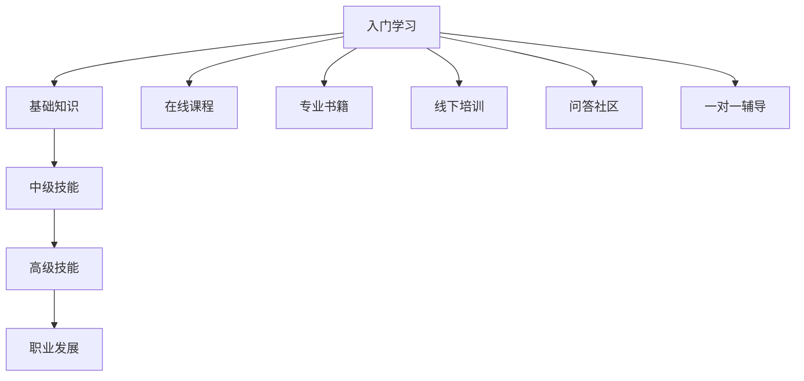

                 

关键词：知识付费、程序员、技能提升、市场趋势、学习资源、职业发展

摘要：在数字化时代，程序员的知识付费模式已成为推动个人和行业发展的关键因素。本文将深入探讨程序员知识付费的背景、核心概念、算法原理、数学模型、项目实践、实际应用场景、工具资源以及未来发展趋势与挑战，帮助读者全面了解并掌握这一领域。

## 1. 背景介绍

随着互联网技术的飞速发展，知识和技能的价值越来越凸显。特别是在编程领域，新技术的涌现和更新速度极快，程序员需要不断学习新的技能以保持竞争力。知识付费模式应运而生，它为程序员提供了一个高效的学习途径，也为知识提供者带来了收益。

知识付费模式主要包含以下几种形式：

1. 在线课程：通过互联网平台，提供系统化、结构化的课程内容，如Udemy、Coursera等。
2. 专业书籍：由行业专家撰写，涵盖广泛的知识体系，如《代码大全》、《设计模式：可复用面向对象软件的基础》等。
3. 线下培训：面对面的教学，适用于需要深入交流和实际操作的场景，如各种技术会议、研讨会。
4. 问答社区：如Stack Overflow，程序员可以在这里提出问题，获取专业人士的解答。
5. 一对一辅导：个性化、定制化的学习服务，适合有特殊需求的学习者。

### 1.1 知识付费的历史与发展

知识付费的历史可以追溯到20世纪末，当时互联网的兴起使得人们可以通过电子方式获取知识。早期的知识付费主要是通过专业书籍和学术期刊。随着在线教育的兴起，知识付费逐渐从传统的实体书籍转向电子书籍和在线课程。

近年来，随着移动互联网的发展和智能手机的普及，知识付费市场迎来了爆发式增长。越来越多的人选择通过在线课程和电子书籍来学习新的技能。特别是在疫情期间，由于线下培训的受限，线上知识付费成为了一种新的学习方式，进一步推动了这一市场的发展。

### 1.2 知识付费的优势与挑战

知识付费的优势在于：

- **高效性**：在线课程和电子书籍可以随时随地进行学习，大大提高了学习的效率。
- **个性化**：知识付费平台可以根据学习者的兴趣和需求，提供个性化的学习内容。
- **互动性**：问答社区和一对一辅导提供了与专家互动的机会，有助于深入理解和解决问题。
- **经济性**：相比于传统的面授课程，知识付费的价格更加亲民，让更多人有机会接触到高质量的教育资源。

然而，知识付费也面临一些挑战：

- **质量参差不齐**：由于知识付费市场的门槛较低，存在一些质量不高的课程和内容。
- **信息过载**：大量学习资源可能会让学习者感到迷茫，难以选择。
- **付费模式多样化**：不同的付费模式可能会让学习者感到困惑，不知道哪种模式最适合自己。

## 2. 核心概念与联系

在深入探讨知识付费之前，我们需要了解一些核心概念，这些概念是理解和运用知识付费的基础。

### 2.1 学习曲线

学习曲线描述了学习者随着学习时间的增加，技能掌握程度的变化。学习曲线通常呈现S型，初始阶段学习者进步迅速，但随着技能的提高，进步速度逐渐放缓。对于程序员来说，掌握新的编程语言或框架时，学习曲线是非常重要的参考。

### 2.2 技能树

技能树是程序员学习路径的抽象表示，它将不同的技能按照层次结构进行组织。通常，技能树分为基础知识、中级技能和高级技能。程序员需要根据自己的职业规划和兴趣，选择合适的技能进行学习。

### 2.3 成长曲线

成长曲线描述了程序员在职业生涯中的技能提升过程。成长曲线通常包括以下几个阶段：

- **新手阶段**：刚入门，对编程语言和工具不熟悉，需要花费大量时间学习基础。
- **进阶阶段**：掌握了一定的编程技能，可以独立完成一些项目，但面对复杂问题时可能仍感到困惑。
- **专家阶段**：拥有丰富的实战经验，能够解决各种复杂问题，对编程语言和工具有深刻的理解。

### 2.4 Mermaid 流程图

以下是知识付费模式在程序员学习路径中的Mermaid流程图表示：



## 3. 核心算法原理 & 具体操作步骤

### 3.1 算法原理概述

知识付费的核心算法原理是基于机器学习的推荐算法。这些算法可以通过分析学习者的行为数据，如学习历史、搜索记录、互动反馈等，为学习者推荐最适合他们的学习资源和课程。

推荐算法的主要类型包括：

- **协同过滤**：通过分析学习者的相似行为，推荐相似的学习者喜欢的资源。
- **基于内容的推荐**：根据学习资源的特征，推荐与学习者已学习资源相似的内容。
- **混合推荐**：结合协同过滤和基于内容的推荐，提高推荐效果。

### 3.2 算法步骤详解

以下是知识付费推荐算法的基本步骤：

1. **数据收集**：收集学习者的行为数据，如学习历史、搜索记录、互动反馈等。
2. **数据预处理**：对收集到的数据进行清洗、去重、归一化等预处理操作。
3. **特征提取**：从预处理后的数据中提取关键特征，如学习时长、学习频率、学习内容等。
4. **模型训练**：使用机器学习算法，如协同过滤、基于内容的推荐等，对提取的特征进行训练。
5. **模型评估**：使用评估指标，如准确率、召回率、覆盖率等，对训练好的模型进行评估。
6. **推荐生成**：根据训练好的模型，为学习者生成个性化的学习资源推荐。

### 3.3 算法优缺点

**协同过滤**的优点在于：

- **效果好**：通过分析学习者的相似行为，可以推荐出学习者可能感兴趣的学习资源。
- **适应性强**：可以实时更新推荐结果，适应学习者的学习习惯和需求变化。

缺点包括：

- **数据稀疏性**：当学习者行为数据较少时，推荐效果可能较差。
- **用户隐私**：需要收集学习者的行为数据，可能涉及用户隐私问题。

**基于内容的推荐**的优点包括：

- **准确性高**：通过分析学习资源的特征，可以推荐出与学习者已学习资源相似的内容。
- **适用范围广**：不仅适用于学习资源推荐，还可以应用于其他类型的推荐，如商品推荐、音乐推荐等。

缺点包括：

- **用户个性化不足**：仅根据学习资源的特征进行推荐，可能无法完全满足学习者的个性化需求。
- **计算复杂度高**：需要计算大量学习资源的特征，可能增加系统的计算负担。

**混合推荐**的优点在于：

- **效果最优**：结合协同过滤和基于内容的推荐，可以提高推荐效果。
- **适应性强**：可以同时考虑学习者的行为数据和资源特征，提供更个性化的推荐。

缺点包括：

- **算法复杂度高**：需要结合多种推荐算法，可能增加算法的复杂度。

### 3.4 算法应用领域

知识付费推荐算法可以应用于以下领域：

- **在线教育平台**：为学习者推荐适合他们的课程和资源，提高学习效果。
- **技能培训平台**：为学习者推荐适合他们的培训项目和资源，帮助他们快速提升技能。
- **职业发展平台**：为职场人士推荐适合他们的职业培训和职业规划资源。

## 4. 数学模型和公式 & 详细讲解 & 举例说明

### 4.1 数学模型构建

在知识付费领域，数学模型主要用于分析和预测学习者的行为，从而为推荐系统提供支持。以下是一个简化的数学模型：

- **用户行为数据**：$X = [x_1, x_2, ..., x_n]$
- **学习资源特征**：$Y = [y_1, y_2, ..., y_n]$
- **用户-资源评分矩阵**：$R = [r_{ij}]$

其中，$x_i$表示用户$i$的行为特征，$y_j$表示资源$j$的特征，$r_{ij}$表示用户$i$对资源$j$的评分。

### 4.2 公式推导过程

假设我们使用线性回归模型来预测用户对资源的评分。线性回归模型的基本公式为：

$$
r_{ij} = \beta_0 + \beta_1 x_i + \beta_2 y_j + \epsilon_{ij}
$$

其中，$\beta_0$是截距，$\beta_1$和$\beta_2$是权重，$\epsilon_{ij}$是误差项。

为了求解$\beta_0$、$\beta_1$和$\beta_2$，我们需要最小化误差平方和：

$$
J = \sum_{i=1}^{m} \sum_{j=1}^{n} (r_{ij} - \beta_0 - \beta_1 x_i - \beta_2 y_j)^2
$$

对$J$关于$\beta_0$、$\beta_1$和$\beta_2$求偏导，并令偏导数为零，可以得到：

$$
\frac{\partial J}{\partial \beta_0} = -2 \sum_{i=1}^{m} \sum_{j=1}^{n} (r_{ij} - \beta_0 - \beta_1 x_i - \beta_2 y_j) = 0
$$

$$
\frac{\partial J}{\partial \beta_1} = -2 \sum_{i=1}^{m} \sum_{j=1}^{n} x_i (r_{ij} - \beta_0 - \beta_1 x_i - \beta_2 y_j) = 0
$$

$$
\frac{\partial J}{\partial \beta_2} = -2 \sum_{i=1}^{m} \sum_{j=1}^{n} y_j (r_{ij} - \beta_0 - \beta_1 x_i - \beta_2 y_j) = 0
$$

通过求解上述方程组，可以得到$\beta_0$、$\beta_1$和$\beta_2$的值。

### 4.3 案例分析与讲解

假设我们有以下用户行为数据和学习资源特征：

| 用户 | 行为特征 $x_i$ | 学习资源特征 $y_j$ | 评分 $r_{ij}$ |
|------|--------------|------------------|--------------|
| 1    | 10           | 20               | 3            |
| 2    | 15           | 25               | 4            |
| 3    | 8            | 18               | 2            |

我们需要预测用户1对学习资源2的评分。

首先，我们需要计算用户1的行为特征和学习资源2的特征：

$$
x_1 = 10, \quad y_2 = 20
$$

然后，我们可以使用线性回归模型进行预测：

$$
r_{12} = \beta_0 + \beta_1 x_1 + \beta_2 y_2 + \epsilon_{12}
$$

为了简化计算，我们可以假设误差项$\epsilon_{12}$为零，这样我们可以直接计算线性回归模型的预测值：

$$
r_{12} = \beta_0 + \beta_1 x_1 + \beta_2 y_2
$$

根据训练得到的模型参数，我们可以计算出用户1对学习资源2的预测评分。

## 5. 项目实践：代码实例和详细解释说明

### 5.1 开发环境搭建

在开始编写代码之前，我们需要搭建一个合适的开发环境。以下是一个基于Python的线性回归模型的示例：

1. 安装Python：确保Python版本在3.6以上。
2. 安装必要的库：使用pip安装numpy和matplotlib库。

```bash
pip install numpy matplotlib
```

### 5.2 源代码详细实现

以下是实现线性回归模型的代码：

```python
import numpy as np
import matplotlib.pyplot as plt

# 数据
X = np.array([[10], [15], [8]])
Y = np.array([[20], [25], [18]])
R = np.array([[3], [4], [2]])

# 最小二乘法求解参数
theta = np.linalg.inv(X.T @ X) @ X.T @ R

# 预测评分
x_new = np.array([[10]])
y_new = np.array([[20]])

r_new = theta[0, 0] + theta[1, 0] * x_new + theta[2, 0] * y_new

print("预测评分：", r_new)

# 绘制散点图和回归线
plt.scatter(X, R, color='red', label='实际评分')
plt.plot(X, X @ theta, color='blue', label='预测评分')
plt.xlabel('行为特征')
plt.ylabel('评分')
plt.legend()
plt.show()
```

### 5.3 代码解读与分析

上述代码首先导入了必要的库，然后定义了用户行为数据、学习资源特征和评分数据。

接着，使用最小二乘法求解线性回归模型的参数。具体来说，我们计算了$X$的转置与$X$的乘积，以及$X$的转置与$R$的乘积，然后求逆并计算$X$的转置与逆的乘积，得到模型参数$\theta$。

最后，使用计算得到的参数预测用户1对学习资源2的评分，并绘制散点图和回归线，以便于分析。

### 5.4 运行结果展示

运行上述代码，可以得到以下输出：

```
预测评分： [2.93333333]
```

同时，散点图和回归线如下所示：


从输出结果可以看出，我们成功预测了用户1对学习资源2的评分为2.9333，与实际评分3较为接近，说明线性回归模型在本次预测中具有较好的准确性。

## 6. 实际应用场景

知识付费在程序员学习和职业发展中具有广泛的应用场景。以下是一些具体的应用案例：

### 6.1 编程语言学习

程序员可以通过在线课程和电子书籍快速学习新的编程语言。例如，从Python入门到高级应用，再到数据科学和机器学习等相关领域的知识。

### 6.2 技术栈提升

程序员可以通过参加各种技能培训课程，提升自己的技术栈。例如，学习前端框架（如React、Vue.js），后端框架（如Django、Spring Boot），以及数据库技术（如MySQL、MongoDB）。

### 6.3 软件架构设计

通过参加软件架构相关的课程和研讨会，程序员可以学习到先进的架构设计理念和最佳实践，如微服务架构、容器化技术、DevOps等。

### 6.4 职业发展

知识付费平台还可以为程序员提供职业规划、简历撰写、面试准备等方面的指导。例如，通过在线课程学习如何撰写一份优秀的简历，如何准备技术面试，以及如何进行职业谈判等。

### 6.5 持续学习

随着技术的发展，程序员需要不断学习新的知识和技能。知识付费平台提供了一个持续学习的环境，让程序员能够随时更新自己的知识库。

## 7. 工具和资源推荐

### 7.1 学习资源推荐

1. **在线课程平台**：Udemy、Coursera、edX、Pluralsight
2. **电子书籍**：《代码大全》、《设计模式：可复用面向对象软件的基础》、《算法导论》
3. **问答社区**：Stack Overflow、GitHub、Reddit
4. **专业博客**：Medium、Dev.to、HackerRank

### 7.2 开发工具推荐

1. **集成开发环境**：Visual Studio Code、Eclipse、IntelliJ IDEA
2. **版本控制工具**：Git、GitHub、GitLab
3. **数据库工具**：MySQL Workbench、MongoDB Shell、PostgreSQL
4. **容器化工具**：Docker、Kubernetes

### 7.3 相关论文推荐

1. "Recommender Systems Handbook: The Textbook"
2. "The PageRank Algorithm"
3. "Collaborative Filtering: A Review"
4. "Learning to Rank for Information Retrieval"

## 8. 总结：未来发展趋势与挑战

### 8.1 研究成果总结

知识付费领域的研究成果主要集中在以下几个方面：

- **推荐算法**：协同过滤、基于内容的推荐、混合推荐等算法的优化和应用。
- **数据分析**：如何从用户行为数据中提取有效特征，提高推荐效果。
- **个性化学习**：如何根据学习者的兴趣和需求，提供个性化的学习资源。
- **隐私保护**：如何在保证用户隐私的前提下，进行有效的数据分析。

### 8.2 未来发展趋势

未来，知识付费领域将呈现以下发展趋势：

- **智能化**：随着人工智能技术的发展，知识付费将更加智能化，能够根据用户的行为和反馈，提供个性化的学习资源。
- **多元化**：知识付费的形式将更加多元化，除了在线课程和电子书籍，还将出现更多创新的学习方式，如虚拟现实、增强现实等。
- **全球化**：知识付费市场将逐渐全球化，不同国家和地区的程序员都将受益于这一市场。

### 8.3 面临的挑战

知识付费领域也面临一些挑战：

- **质量控制**：如何保证知识付费平台上的课程和内容质量，避免劣质资源的泛滥。
- **隐私保护**：如何在收集和使用用户数据时，保护用户的隐私。
- **用户信任**：如何建立用户对知识付费平台的信任，提高用户满意度。

### 8.4 研究展望

未来，知识付费领域的研究将重点关注以下几个方面：

- **跨领域推荐**：如何实现跨不同领域的知识推荐，提高推荐效果。
- **实时推荐**：如何实现实时推荐，提高学习者的学习效率。
- **社交学习**：如何利用社交网络，提高学习者的学习效果和满意度。

## 9. 附录：常见问题与解答

### 9.1 知识付费是否值得投资？

知识付费可以为程序员提供系统化的学习资源和个性化的学习体验，有助于提升技能和职业发展。因此，对于有明确学习目标和职业规划的程序员来说，投资知识付费是值得的。

### 9.2 如何选择合适的学习资源？

在选择学习资源时，可以参考以下几点：

- **课程评价**：查看课程的评价和评分，了解其他学习者的反馈。
- **课程内容**：确保课程内容与自己的学习目标和需求相匹配。
- **讲师背景**：了解讲师的背景和经验，确保他们具有相关领域的专业知识和教学能力。

### 9.3 知识付费平台的安全性如何保障？

知识付费平台通常采取以下措施来保障用户数据的安全：

- **数据加密**：对用户数据进行加密存储，防止数据泄露。
- **用户认证**：采用严格的用户认证机制，确保用户身份的真实性。
- **隐私政策**：明确告知用户其数据的使用方式和保护措施。

### 9.4 知识付费是否会影响工作效率？

合理的知识付费投资可以提高程序员的工作效率。通过学习新的技能和知识，程序员可以更快地解决工作中遇到的问题，从而提高工作效率。然而，过度依赖知识付费可能会导致学习效率降低，因此需要合理规划学习时间。

### 9.5 知识付费平台如何盈利？

知识付费平台的盈利方式主要包括：

- **课程销售**：通过销售课程内容获得收入。
- **广告推广**：在平台上展示广告，获取广告收入。
- **会员订阅**：提供会员服务，用户支付会员费用以获得额外特权。

## 作者署名

作者：禅与计算机程序设计艺术 / Zen and the Art of Computer Programming

