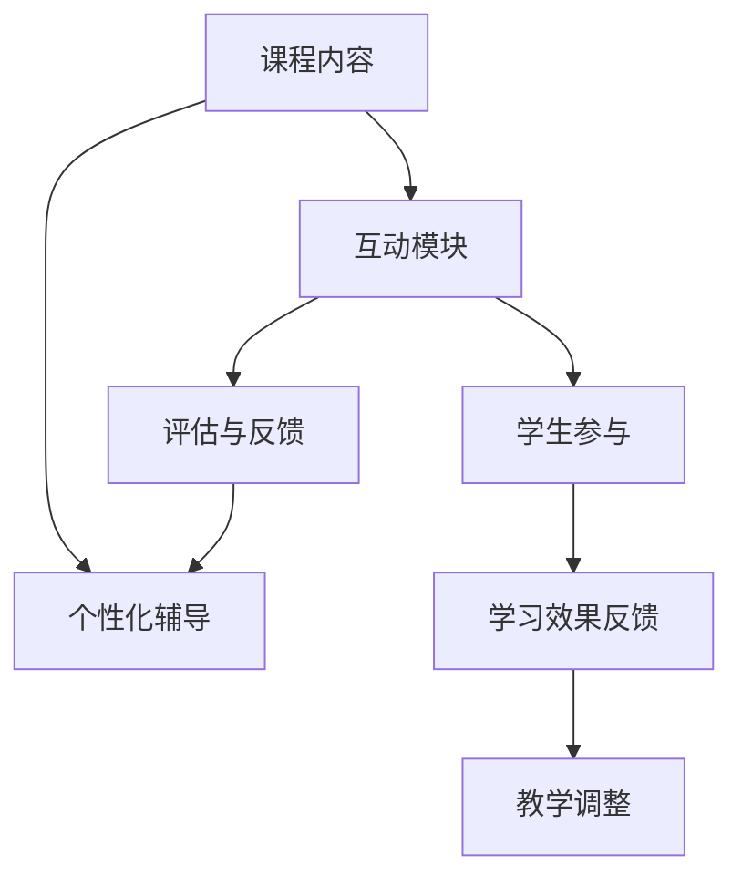

                 

### 关键词 Keyword
- **知识付费**：知识经济时代的商业模式。
- **互动式课程**：以互动为核心的教学方法。
- **程序员**：技能需求、在线学习。
- **课程设计**：教学策略与学习效果。
- **用户体验**：教学互动与学员满意度。

> 摘要：本文探讨了在知识付费时代，程序员如何通过打造互动式课程来提升学习效果和用户体验。通过深入分析互动式课程的设计原则、技术实现和实际应用，本文为程序员提供了切实可行的实践指南。

## 1. 背景介绍

在信息化时代的推动下，知识付费已经成为一种重要的商业模式。人们越来越重视知识和技能的学习，而在线教育平台则提供了便捷的途径。程序员作为信息化时代的主力军，对知识和技能的需求尤为迫切。然而，传统的教学方式往往以知识灌输为主，缺乏互动和反馈，难以满足程序员的学习需求。

互动式课程作为一种新兴的教学方法，通过互动和参与，能够有效提升学习效果和用户体验。互动式课程不仅包括教师与学生之间的互动，还包括学生与学生之间的互动，以及课程内容与现实应用之间的联系。这种教学方式能够激发学生的学习兴趣，提高他们的参与度，从而更好地掌握知识和技能。

## 2. 核心概念与联系

### 2.1 互动式课程的核心概念

互动式课程的核心概念包括以下几点：

- **互动性**：教学过程中强调师生互动和学生之间的互动，通过提问、讨论、实验等方式激发学生的学习兴趣。
- **参与性**：学生积极参与课程内容，通过实践、小组合作等方式加深对知识的理解和应用。
- **反馈性**：及时反馈是互动式课程的重要组成部分，教师可以及时了解学生的学习进度和理解情况，调整教学策略。
- **个性化**：根据学生的学习需求和进度，提供个性化的教学内容和辅导。

### 2.2 互动式课程的架构

互动式课程的架构通常包括以下几个部分：

- **课程内容**：根据学习目标和需求，设计系统的课程内容。
- **互动模块**：包括在线讨论区、问答环节、实践任务等，促进学生参与。
- **评估与反馈**：通过考试、作业、测试等方式评估学习效果，并提供反馈。
- **个性化辅导**：根据学生的学习情况，提供个性化的辅导和支持。

### 2.3 互动式课程的 Mermaid 流程图



## 3. 核心算法原理 & 具体操作步骤

### 3.1 算法原理概述

互动式课程的设计需要遵循一定的算法原理，主要包括以下几点：

- **反馈循环**：通过及时反馈，不断调整教学策略，提高教学效果。
- **适应学习**：根据学生的学习进度和理解程度，动态调整教学内容和难度。
- **协作学习**：鼓励学生之间的合作和互动，共同完成任务，提升学习效果。

### 3.2 算法步骤详解

#### 3.2.1 设计课程内容

1. 确定学习目标和需求。
2. 根据目标需求，设计系统的课程内容。
3. 结合实际应用，设置实践任务和案例分析。

#### 3.2.2 构建互动模块

1. 设计在线讨论区，鼓励学生提问和讨论。
2. 设置问答环节，增加学生的参与度。
3. 提供实践任务，让学生在实践中应用所学知识。

#### 3.2.3 评估与反馈

1. 设计考试和作业，评估学生的学习效果。
2. 及时提供反馈，指出学生的不足和改进方向。
3. 根据反馈，调整教学策略和课程内容。

#### 3.2.4 个性化辅导

1. 根据学生的不同需求，提供个性化的辅导和支持。
2. 定期与学生沟通，了解他们的学习进度和理解情况。
3. 提供定制化的学习资源和辅导材料。

### 3.3 算法优缺点

#### 优点：

- 提高学习效果和用户体验。
- 促进师生互动和学生合作。
- 根据需求提供个性化辅导。

#### 缺点：

- 设计和实施较为复杂。
- 需要教师具备较高的互动能力和技术素养。
- 对学生的自律性和主动性要求较高。

### 3.4 算法应用领域

互动式课程算法广泛应用于在线教育、职业技能培训等领域，尤其适合程序员等技能密集型职业的学习。

## 4. 数学模型和公式 & 详细讲解 & 举例说明

### 4.1 数学模型构建

互动式课程的设计可以借助一些数学模型来优化教学效果，例如：

- **反馈函数**：根据学生的反馈和学习进度，调整教学策略。
- **协作系数**：衡量学生之间的互动和协作程度。

### 4.2 公式推导过程

#### 反馈函数

假设学生 A 和学生 B 的反馈分别为 \( f_A \) 和 \( f_B \)，他们的学习进度分别为 \( p_A \) 和 \( p_B \)。则反馈函数可以表示为：

\[ F(x) = \alpha \cdot f_A + (1 - \alpha) \cdot f_B \]

其中，\(\alpha\) 是权重系数，用于平衡学生 A 和学生 B 的反馈。

#### 协作系数

协作系数 \( C \) 可以通过以下公式计算：

\[ C = \frac{N - 1}{N} \cdot \frac{P - 1}{P} \]

其中，\( N \) 是参与互动的学生人数，\( P \) 是学生的平均互动次数。

### 4.3 案例分析与讲解

#### 案例一：在线编程课程

某在线编程课程设计了互动式教学模块，包括在线讨论区、问答环节和实践任务。经过一段时间的教学，课程团队收集了以下数据：

- 学生 A 的反馈 \( f_A = 0.8 \)，学习进度 \( p_A = 0.6 \)。
- 学生 B 的反馈 \( f_B = 0.7 \)，学习进度 \( p_B = 0.5 \)。

根据反馈函数，计算教师调整后的教学策略 \( F(x) \)：

\[ F(x) = \alpha \cdot 0.8 + (1 - \alpha) \cdot 0.7 \]

假设 \(\alpha = 0.6\)，则：

\[ F(x) = 0.6 \cdot 0.8 + 0.4 \cdot 0.7 = 0.72 \]

#### 案例二：团队合作项目

一个团队合作项目中，共有 5 名学生参与，他们的平均互动次数为 10 次。计算协作系数 \( C \)：

\[ C = \frac{5 - 1}{5} \cdot \frac{10 - 1}{10} = \frac{4}{5} \cdot \frac{9}{10} = 0.72 \]

这意味着，团队成员之间的协作程度较高，能够有效提升学习效果。

## 5. 项目实践：代码实例和详细解释说明

### 5.1 开发环境搭建

为了搭建互动式课程平台，我们可以使用以下开发环境：

- **编程语言**：Python
- **Web 框架**：Flask
- **前端框架**：Bootstrap
- **数据库**：SQLite

### 5.2 源代码详细实现

以下是互动式课程平台的核心代码示例：

```python
# Flask 应用入口
from flask import Flask, render_template, request, redirect, url_for

app = Flask(__name__)

# 数据库初始化
import sqlite3

conn = sqlite3.connect('course.db')
c = conn.cursor()

# 创建用户表
c.execute('''CREATE TABLE IF NOT EXISTS users (
    id INTEGER PRIMARY KEY AUTOINCREMENT,
    username TEXT UNIQUE NOT NULL,
    password TEXT NOT NULL
)''')

# 创建课程表
c.execute('''CREATE TABLE IF NOT EXISTS courses (
    id INTEGER PRIMARY KEY AUTOINCREMENT,
    name TEXT NOT NULL,
    description TEXT
)''')

# 提交更改并关闭连接
conn.commit()
conn.close()

# 用户注册
@app.route('/register', methods=['GET', 'POST'])
def register():
    if request.method == 'POST':
        username = request.form['username']
        password = request.form['password']
        # 密码加密处理
        # ...
        c.execute("INSERT INTO users (username, password) VALUES (?, ?)", (username, password))
        conn.commit()
        return redirect(url_for('login'))
    return render_template('register.html')

# 用户登录
@app.route('/login', methods=['GET', 'POST'])
def login():
    if request.method == 'POST':
        username = request.form['username']
        password = request.form['password']
        # 密码验证处理
        # ...
        return redirect(url_for('dashboard'))
    return render_template('login.html')

# 用户仪表盘
@app.route('/dashboard')
def dashboard():
    # 加载用户信息和课程列表
    # ...
    return render_template('dashboard.html')

if __name__ == '__main__':
    app.run(debug=True)
```

### 5.3 代码解读与分析

以上代码示例是互动式课程平台的基础框架，包括用户注册、登录和仪表盘功能。以下是代码的详细解读：

- **数据库连接**：使用 SQLite 数据库存储用户信息和课程信息。
- **用户注册**：接收用户注册请求，存储用户名和密码。
- **用户登录**：验证用户名和密码，提供登录功能。
- **用户仪表盘**：展示用户信息和课程列表，提供课程学习和管理功能。

### 5.4 运行结果展示

当用户成功登录后，他们将看到仪表盘界面，其中包含用户信息和课程列表。用户可以点击课程名称进入课程详情页面，查看课程内容、互动模块和评估与反馈。

## 6. 实际应用场景

互动式课程在程序员知识付费领域有广泛的应用场景，例如：

- **在线编程课程**：通过互动模块，学生可以提问、讨论和协作，提高学习效果。
- **技术讲座与研讨会**：通过互动式讲座和研讨会，学员可以与讲师实时交流，加深对知识的理解。
- **项目实战**：通过团队合作项目，学员可以在实践中应用所学知识，提升项目经验。

## 7. 工具和资源推荐

### 7.1 学习资源推荐

- **在线编程平台**：如 LeetCode、GitHub 等，提供丰富的编程资源和挑战。
- **专业书籍**：推荐相关领域的经典教材，如 《代码大全》、《设计模式：可复用面向对象软件的基础》等。

### 7.2 开发工具推荐

- **集成开发环境**：如 Visual Studio Code、Eclipse 等，提供高效的编程体验。
- **版本控制系统**：如 Git，用于代码管理和协作。

### 7.3 相关论文推荐

- **《互动式学习在计算机教育中的应用研究》**
- **《基于反馈的互动式教学模型研究》**
- **《协作学习在在线教育中的应用》**

## 8. 总结：未来发展趋势与挑战

### 8.1 研究成果总结

互动式课程在程序员知识付费领域取得了显著的成果，提高了学习效果和用户体验。通过互动和参与，学生能够更好地掌握知识和技能，提升实际应用能力。

### 8.2 未来发展趋势

- **个性化互动**：结合人工智能技术，实现更加个性化的互动教学。
- **虚拟现实**：通过虚拟现实技术，提供沉浸式的学习体验。
- **在线协作**：加强在线协作功能，促进师生和同学之间的互动。

### 8.3 面临的挑战

- **技术实现**：需要不断改进技术，提高互动式课程的稳定性和可用性。
- **教师培训**：需要加强对教师的培训，提高他们的互动能力和教学素养。
- **学习管理**：需要有效管理学生的学习进度和反馈，确保教学效果。

### 8.4 研究展望

未来，互动式课程将在程序员知识付费领域发挥更大的作用。通过不断创新和优化，互动式课程将更好地满足程序员的学习需求，提升他们的职业素养和竞争力。

## 9. 附录：常见问题与解答

### Q: 互动式课程如何确保学习效果？

A: 互动式课程通过互动、参与和反馈，激发学生的学习兴趣和主动性，从而提高学习效果。同时，课程内容设计结合实际应用，让学生在实践中应用所学知识，加深理解。

### Q: 互动式课程对教师的要求是什么？

A: 教师需要具备互动能力和教学素养，能够设计互动模块、提供及时反馈，并针对学生的不同需求提供个性化辅导。此外，教师还需要不断学习新技术，适应教学环境的变化。

### Q: 互动式课程如何管理学生的学习进度？

A: 互动式课程通过学习管理系统（LMS）对学生的学习进度进行管理。教师可以设置学习任务、发布作业和考试，并跟踪学生的学习情况。同时，系统会记录学生的互动和反馈，帮助教师了解学生的学习进度和理解程度。

