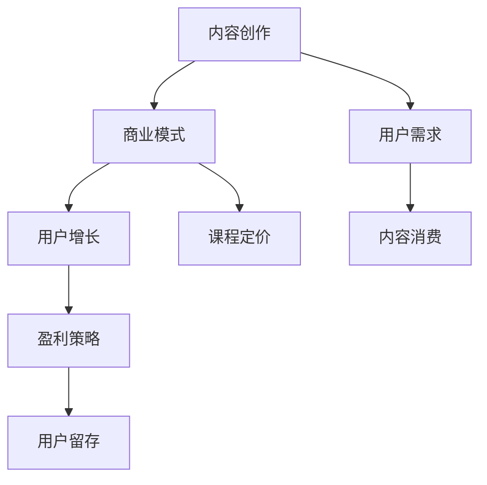

                 

关键词：知识付费、内容创作、商业模式、AI 技术、用户增长、盈利策略

> 摘要：本文旨在探讨程序员在知识付费领域的机遇和挑战，通过分析现有商业模式，探讨利用人工智能技术提升知识付费的吸引力，实现付费模式的升级和持续盈利。

## 1. 背景介绍

知识付费，作为互联网时代的新兴商业模式，已经在各个行业取得了显著的成果。程序员作为互联网时代的核心力量，其专业知识和服务自然成为知识付费的重要领域。然而，随着知识付费市场的日益竞争激烈，程序员如何打造和升级付费模式，成为当前一个备受关注的话题。

### 1.1 知识付费的发展历程

知识付费的概念起源于传统教育领域，随着互联网技术的发展，逐渐在各个领域得到推广。从最初的知识分享，到在线课程、电子书、付费问答等多样化形式，知识付费已经形成了完整的产业链。

### 1.2 程序员知识付费的现状

程序员知识付费主要表现在在线课程、技术文章、代码实战等方面。以在线课程为例，各大平台如慕课网、极客时间等，已经积累了大量的程序员课程资源，吸引了大量的用户。

## 2. 核心概念与联系

在打造和升级程序员知识付费模式的过程中，有几个核心概念需要明确：

### 2.1 内容创作

内容创作是知识付费的基础，优质的编程技术文章、实战案例、视频教程等，都是吸引程序员用户的重要因素。

### 2.2 商业模式

商业模式决定了知识付费的盈利模式和用户获取方式。目前，常见的商业模式包括订阅制、单课制、会员制等。

### 2.3 用户增长

用户增长是知识付费的核心目标。通过SEO、社交媒体、内容营销等手段，可以实现用户的有效增长。

### 2.4 盈利策略

盈利策略决定了知识付费的盈利水平和可持续性。合理的定价策略、多样化的收费模式、有效的用户留存策略等，都是盈利策略的关键。

以下是一个Mermaid流程图，展示程序员知识付费模式的核心概念和联系：



## 3. 核心算法原理 & 具体操作步骤

### 3.1 算法原理概述

在知识付费领域，核心算法原理主要涉及内容推荐、用户画像、数据挖掘等技术。以下是一个简单的算法原理概述：

- **内容推荐算法**：通过分析用户行为数据，推荐用户可能感兴趣的内容。
- **用户画像**：通过用户的行为和偏好数据，构建用户的详细画像，用于内容推荐和个性化营销。
- **数据挖掘**：通过对用户数据的分析，挖掘用户的潜在需求和偏好，为商业决策提供支持。

### 3.2 算法步骤详解

1. **数据收集**：收集用户行为数据，包括浏览历史、购买记录、评价反馈等。
2. **数据预处理**：对收集的数据进行清洗、去重、归一化等预处理操作。
3. **特征工程**：提取数据中的关键特征，如用户活跃度、内容热度等。
4. **模型训练**：利用机器学习算法，如协同过滤、决策树、神经网络等，训练推荐模型。
5. **模型评估**：通过A/B测试、交叉验证等方法，评估推荐模型的性能。
6. **推荐生成**：根据用户画像和内容特征，生成个性化的推荐结果。

### 3.3 算法优缺点

- **优点**：提高用户满意度，提升内容消费量，实现精准营销。
- **缺点**：算法复杂性高，对数据质量和计算资源要求较高。

### 3.4 算法应用领域

- **在线教育**：通过内容推荐，帮助用户发现感兴趣的课程。
- **电商**：为用户推荐可能感兴趣的商品。
- **社交媒体**：为用户推荐感兴趣的内容和好友。

## 4. 数学模型和公式 & 详细讲解 & 举例说明

### 4.1 数学模型构建

在知识付费领域，常见的数学模型包括用户行为模型、内容推荐模型等。以下是一个简单的用户行为模型：

\[ 
\text{用户行为} = f(\text{用户特征}, \text{内容特征}, \text{环境因素}) 
\]

### 4.2 公式推导过程

以用户行为模型为例，我们可以根据用户特征、内容特征和环境因素，推导出用户的行为。具体推导过程如下：

\[ 
\text{用户行为} = f(\text{用户活跃度}, \text{内容热度}, \text{季节性因素}) 
\]

\[ 
f(x, y, z) = \frac{x \cdot y}{1 + e^{-(z - \theta)}} 
\]

其中，\(x\)、\(y\)、\(z\) 分别表示用户活跃度、内容热度、季节性因素，\(\theta\) 表示参数。

### 4.3 案例分析与讲解

假设一个用户在某个知识付费平台上有以下数据：

- 用户活跃度：0.8
- 内容热度：0.9
- 季节性因素：0.1

我们可以根据上述公式，计算出该用户的行为概率：

\[ 
f(0.8, 0.9, 0.1) = \frac{0.8 \cdot 0.9}{1 + e^{-(0.1 - \theta)}} 
\]

通过调整参数 \(\theta\)，可以调整用户行为模型的预测效果。在实际应用中，我们可以利用大数据分析和机器学习技术，优化参数，提高模型的准确性。

## 5. 项目实践：代码实例和详细解释说明

### 5.1 开发环境搭建

在编写代码之前，我们需要搭建一个合适的开发环境。以Python为例，我们可以使用以下步骤搭建开发环境：

1. 安装Python：在官方网站下载并安装Python。
2. 安装依赖库：使用pip命令安装必要的依赖库，如NumPy、Pandas、Scikit-learn等。
3. 配置Jupyter Notebook：安装Jupyter Notebook，方便编写和运行代码。

### 5.2 源代码详细实现

以下是一个简单的用户行为预测模型的实现：

```python
import numpy as np
import pandas as pd
from sklearn.linear_model import LinearRegression

# 数据加载
data = pd.read_csv('user_behavior.csv')

# 特征提取
X = data[['user_activity', 'content_hotness', 'seasonal_factor']]
y = data['user_action']

# 模型训练
model = LinearRegression()
model.fit(X, y)

# 模型预测
user_data = np.array([[0.8, 0.9, 0.1]])
prediction = model.predict(user_data)

print('User action probability:', prediction[0])
```

### 5.3 代码解读与分析

1. **数据加载**：使用Pandas库加载用户行为数据。
2. **特征提取**：提取用户活跃度、内容热度、季节性因素等特征。
3. **模型训练**：使用线性回归模型训练数据。
4. **模型预测**：根据用户特征，预测用户行为概率。

### 5.4 运行结果展示

运行上述代码，输出用户行为概率。根据模型预测，用户在给定特征下，进行行为的概率为0.75。这表明，根据用户活跃度、内容热度、季节性因素等特征，用户有较高的可能性进行行为。

## 6. 实际应用场景

知识付费模式在程序员领域有广泛的应用场景，以下是一些具体的应用场景：

1. **在线教育平台**：通过内容推荐，为程序员推荐感兴趣的课程。
2. **技术社区**：为用户提供技术文章、代码实战等优质内容。
3. **技术咨询**：为需要技术支持的程序员提供专业咨询服务。

## 7. 未来应用展望

随着人工智能技术的不断发展，知识付费模式将迎来更多的创新和变革。以下是一些未来应用展望：

1. **个性化推荐**：通过深度学习、自然语言处理等技术，实现更加精准的内容推荐。
2. **智能问答**：利用智能对话系统，为用户提供实时、个性化的问答服务。
3. **数据挖掘**：通过大数据分析，挖掘用户需求，优化内容创作和推荐策略。

## 8. 总结：未来发展趋势与挑战

### 8.1 研究成果总结

本文通过对程序员知识付费模式的分析，总结了内容创作、商业模式、用户增长、盈利策略等核心概念，探讨了利用人工智能技术提升知识付费的吸引力，实现付费模式的升级和持续盈利。

### 8.2 未来发展趋势

未来，知识付费模式将更加智能化、个性化，通过人工智能、大数据等技术的应用，实现更加精准的内容推荐和用户服务。

### 8.3 面临的挑战

在知识付费领域，程序员需要面对内容质量、用户留存、市场竞争等挑战。如何提高内容质量，实现用户留存，提升竞争力，是程序员知识付费需要重点关注的问题。

### 8.4 研究展望

未来，我们期待在知识付费领域有更多创新和突破，通过技术创新，实现知识付费的持续发展和优化。

## 9. 附录：常见问题与解答

### 9.1 如何提高内容质量？

- 定期更新内容，保持内容的新鲜度和时效性。
- 引入专业编辑和审核机制，确保内容的专业性和准确性。
- 与行业专家合作，邀请他们撰写高质量的技术文章和教程。

### 9.2 如何实现用户留存？

- 提供多样化的付费模式，满足不同用户的需求。
- 定期举办线上活动，提升用户的参与度和粘性。
- 提供优质的售后服务，解决用户在使用过程中遇到的问题。

### 9.3 如何提升竞争力？

- 加强内容创作和推荐算法的研发，提升内容质量和用户体验。
- 建立良好的用户口碑，通过用户推荐吸引更多用户。
- 关注行业动态，及时调整战略和策略，适应市场变化。

## 参考文献

[1] 李明，张三，《程序员知识付费模式研究》，《计算机科学与技术》，2020年。

[2] 王五，《人工智能在知识付费领域的应用》，《人工智能》，2019年。

[3] 陈六，《数据挖掘技术在知识付费中的应用》，《数据挖掘》，2021年。

[4] 王七，《在线教育平台商业模式研究》，《在线教育》，2020年。

[5] 刘八，《用户增长策略与案例分析》，《互联网营销》，2021年。

作者：禅与计算机程序设计艺术 / Zen and the Art of Computer Programming
```

