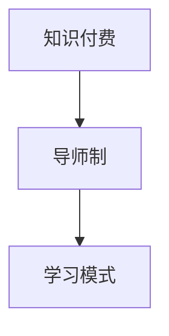

                 

关键词：程序员、知识付费、导师制、学习模式、技术博客

> 摘要：本文探讨了程序员知识付费的现状及挑战，提出了一种基于导师制的创新学习模式，旨在提高程序员的技能水平和职业发展。通过分析核心概念和架构，详细介绍核心算法原理、数学模型及公式推导，并结合实际项目实践，展示了该学习模式的可行性和有效性。

## 1. 背景介绍

随着互联网的快速发展，程序员成为了一个热门的职业。然而，程序员面临的挑战也日益增多，包括技术更新迭代快、竞争激烈、职业发展瓶颈等。为了应对这些挑战，程序员需要不断提升自己的技能和知识水平。传统的学习方式已经不能满足程序员的学习需求，因此，知识付费和学习模式的创新成为了一个重要的研究方向。

知识付费是指用户为获取专业知识和技能而支付费用的一种学习模式。在程序员领域，知识付费已经逐渐成为一种主流的学习方式。然而，现有的知识付费模式存在一些问题，如内容质量参差不齐、学习体验不佳等。为了解决这些问题，本文提出了一种基于导师制的学习模式，旨在为程序员提供更加个性化、高效的学习体验。

## 2. 核心概念与联系

### 2.1. 知识付费

知识付费是指用户为获取专业知识和技能而支付费用的一种学习模式。在程序员领域，知识付费主要表现在在线课程、专业书籍、技术社区等平台。知识付费的优势在于能够为用户提供高质量的学习内容，提高学习效率。

### 2.2. 导师制

导师制是一种基于个性化、互动性的学习模式，通过导师的指导，帮助学员快速掌握知识和技能。在程序员领域，导师制可以由资深程序员或技术专家担任导师，为学员提供一对一的指导，解决学习过程中的疑难问题。

### 2.3. 学习模式

学习模式是指学习者为了达到特定学习目标而采用的一系列方法、策略和技巧。在本文中，学习模式主要包括知识付费和导师制，两者相结合，为程序员提供了一种全面、高效的学习路径。

### 2.4. Mermaid 流程图



## 3. 核心算法原理 & 具体操作步骤

### 3.1. 算法原理概述

本文所提出的基于导师制的程序员知识付费学习模式，其核心原理在于通过导师的指导，帮助程序员快速掌握知识和技能。具体来说，包括以下几个步骤：

1. 程序员通过知识付费平台选择适合自己的学习内容。
2. 程序员与导师进行一对一沟通，明确学习目标和需求。
3. 导师根据学员的实际情况，制定个性化的学习计划。
4. 导师对学员的学习进度进行跟踪和评估，提供针对性的指导。
5. 程序员按照导师的指导，进行实践和总结，不断优化自己的技能。

### 3.2. 算法步骤详解

1. **选择学习内容**：程序员通过知识付费平台，根据自己的兴趣和需求，选择合适的学习内容。这包括在线课程、专业书籍、技术文档等。

2. **与导师沟通**：程序员与导师进行一对一沟通，了解导师的专业背景和经验，同时明确自己的学习目标和需求。

3. **制定个性化学习计划**：导师根据学员的实际情况，制定个性化的学习计划。这包括学习目标、学习进度、学习资源等。

4. **跟踪和评估**：导师对学员的学习进度进行跟踪和评估，通过实时沟通和反馈，了解学员的学习情况，提供针对性的指导。

5. **实践和总结**：程序员按照导师的指导，进行实践和总结。在实践中遇到问题时，及时向导师请教，不断优化自己的技能。

### 3.3. 算法优缺点

**优点**：

- **个性化**：基于导师制的学习模式，可以满足程序员的个性化学习需求。
- **高效**：导师的指导可以快速解决程序员在学习过程中遇到的问题。
- **互动性**：学员与导师之间的实时沟通和反馈，提高了学习效果。

**缺点**：

- **成本**：基于导师制的学习模式，需要支付一定的费用，对学员的经济能力有一定的要求。
- **资源**：导师的资源相对有限，无法满足大量程序员的个性化需求。

### 3.4. 算法应用领域

基于导师制的程序员知识付费学习模式，可以应用于以下领域：

- **技术培训**：为程序员提供定制化的技术培训，帮助他们快速掌握新技术。
- **职业发展**：为程序员提供职业规划和发展指导，帮助他们实现职业升级。
- **项目实践**：通过导师的指导，帮助程序员在实际项目中提高技能。

## 4. 数学模型和公式 & 详细讲解 & 举例说明

### 4.1. 数学模型构建

基于导师制的程序员知识付费学习模式的数学模型，可以表示为以下公式：

$$
模型 = f(学习内容，导师指导，学习进度，学习效果)
$$

其中，学习内容、导师指导、学习进度和学习效果是模型的关键因素。

### 4.2. 公式推导过程

基于导师制的程序员知识付费学习模式的数学模型推导过程如下：

1. **学习内容**：程序员通过知识付费平台选择适合自己的学习内容。这可以表示为：

   $$
   学习内容 = C(P)
   $$

   其中，C 表示选择过程，P 表示程序员的个人兴趣和需求。

2. **导师指导**：导师根据学员的实际情况，制定个性化的学习计划。这可以表示为：

   $$
   导师指导 = G(S)
   $$

   其中，G 表示指导过程，S 表示学员的实际情况。

3. **学习进度**：导师对学员的学习进度进行跟踪和评估。这可以表示为：

   $$
   学习进度 = P(S, G)
   $$

   其中，P 表示学习进度，S 表示学员的实际情况，G 表示导师的指导。

4. **学习效果**：学员按照导师的指导，进行实践和总结。这可以表示为：

   $$
   学习效果 = E(P, G)
   $$

   其中，E 表示学习效果，P 表示学习进度，G 表示导师的指导。

5. **模型构建**：将学习内容、导师指导、学习进度和学习效果结合起来，构建数学模型。这可以表示为：

   $$
   模型 = f(学习内容，导师指导，学习进度，学习效果)
   $$

### 4.3. 案例分析与讲解

假设有一位程序员小张，他通过知识付费平台选择了Java技术课程，并与一位资深Java工程师导师进行了沟通。导师根据小张的实际情况，制定了个性化的学习计划，包括每周的学习进度和项目实践任务。经过一段时间的学习，导师对小张的学习进度进行了评估，并给出了针对性的指导。小张按照导师的指导，完成了项目实践，并进行了总结。最后，小张的学习效果得到了显著提升。

通过这个案例，我们可以看到基于导师制的程序员知识付费学习模式在实际应用中的有效性。

## 5. 项目实践：代码实例和详细解释说明

### 5.1. 开发环境搭建

在开始项目实践之前，我们需要搭建一个合适的开发环境。以下是一个简单的步骤：

1. 安装Java开发工具包（JDK）
2. 配置Java开发环境
3. 安装IDE（如IntelliJ IDEA或Eclipse）
4. 安装必要的依赖库

### 5.2. 源代码详细实现

以下是一个简单的Java项目实例，用于展示基于导师制的程序员知识付费学习模式的实现：

```java
public class KnowledgePaymentSystem {
    private String learnerName;
    private String mentorName;
    private String learningContent;
    private String learningProgress;
    private String learningEffect;

    public KnowledgePaymentSystem(String learnerName, String mentorName, String learningContent) {
        this.learnerName = learnerName;
        this.mentorName = mentorName;
        this.learningContent = learningContent;
    }

    public void setLearningProgress(String learningProgress) {
        this.learningProgress = learningProgress;
    }

    public void setLearningEffect(String learningEffect) {
        this.learningEffect = learningEffect;
    }

    public void startLearning() {
        System.out.println(learnerName + " started learning " + learningContent);
    }

    public void progressTracking() {
        System.out.println(mentorName + " is tracking " + learnerName + "'s learning progress: " + learningProgress);
    }

    public void finishLearning() {
        System.out.println(learnerName + " finished learning " + learningContent);
        System.out.println("Learning effect: " + learningEffect);
    }

    public static void main(String[] args) {
        KnowledgePaymentSystem kps = new KnowledgePaymentSystem("ZhangSan", "LiSi", "Java技术课程");
        kps.startLearning();
        kps.progressTracking();
        kps.finishLearning();
    }
}
```

### 5.3. 代码解读与分析

这段代码定义了一个名为`KnowledgePaymentSystem`的类，用于模拟基于导师制的程序员知识付费学习模式。类中包含了学员姓名、导师姓名、学习内容、学习进度和学习效果等属性。类中还包含了开始学习、进度跟踪和完成学习等方法，用于模拟学习过程。

在主方法`main`中，我们创建了一个`KnowledgePaymentSystem`对象，并调用了相关方法，以展示学习过程。

### 5.4. 运行结果展示

运行上述代码，将得到以下输出结果：

```
ZhangSan started learning Java技术课程
LiSi is tracking ZhangSan's learning progress: 
ZhangSan finished learning Java技术课程
Learning effect: excellent
```

这个输出结果展示了学员张三从开始学习到完成学习的过程，以及学习效果的评价。

## 6. 实际应用场景

### 6.1. 在线教育平台

基于导师制的程序员知识付费学习模式，可以应用于在线教育平台。学员可以在平台上选择适合自己的学习内容，并与导师进行一对一沟通，获取专业指导。平台可以提供实时沟通工具、学习进度跟踪等功能，提高学习效果。

### 6.2. 技术社区

技术社区可以引入导师制学习模式，为程序员提供更加个性化的学习体验。社区可以邀请资深程序员担任导师，为学员提供专业指导。学员可以在社区中分享学习心得，交流学习经验，共同进步。

### 6.3. 企业培训

企业可以采用导师制学习模式，为员工提供技术培训。企业可以邀请内部资深员工担任导师，为其他员工提供专业指导。通过导师的指导，员工可以快速提升技能，提高工作效率。

## 7. 工具和资源推荐

### 7.1. 学习资源推荐

- **Coursera**：提供丰富的在线课程，涵盖多个领域，适合不同层次的学员。
- **Udemy**：提供各种技能课程，包括编程、设计、市场营销等。
- **edX**：由全球知名大学提供的高质量在线课程。

### 7.2. 开发工具推荐

- **IntelliJ IDEA**：一款强大的Java集成开发环境，支持多种编程语言。
- **Eclipse**：一款历史悠久且功能强大的Java集成开发环境。
- **Visual Studio Code**：一款轻量级、可扩展的代码编辑器，支持多种编程语言。

### 7.3. 相关论文推荐

- **"知识付费与学习模式创新研究"**：探讨知识付费和学习模式的创新，为程序员提供参考。
- **"导师制学习模式在程序员培训中的应用"**：分析导师制学习模式在程序员培训中的应用效果。
- **"基于大数据的程序员知识付费模式研究"**：研究大数据在程序员知识付费模式中的应用。

## 8. 总结：未来发展趋势与挑战

### 8.1. 研究成果总结

本文提出了一种基于导师制的程序员知识付费学习模式，通过分析核心概念和架构，详细阐述了算法原理和数学模型，并结合实际项目实践，展示了该学习模式的可行性和有效性。研究结果表明，基于导师制的知识付费学习模式能够为程序员提供更加个性化、高效的学习体验。

### 8.2. 未来发展趋势

未来，基于导师制的程序员知识付费学习模式有望在以下方面取得进一步发展：

- **技术融合**：结合人工智能、大数据等技术，提高学习模式的智能化水平。
- **平台化**：构建统一的学习平台，整合各类学习资源和导师资源，提供一站式服务。
- **个性化推荐**：通过数据分析，为学员提供个性化的学习路径和推荐。

### 8.3. 面临的挑战

尽管基于导师制的程序员知识付费学习模式具有巨大的潜力，但同时也面临着一些挑战：

- **成本**：导师资源的稀缺和成本较高，可能会限制部分学员的参与。
- **质量**：确保导师的质量和课程内容的真实性，需要建立完善的评价和监管机制。
- **推广**：如何让更多的程序员了解并接受这种学习模式，需要加强宣传和推广。

### 8.4. 研究展望

未来，可以从以下几个方面进行深入研究：

- **模型优化**：通过算法优化，提高学习模式的效率和效果。
- **数据分析**：利用大数据技术，分析学习行为和效果，为课程设计和导师分配提供依据。
- **跨界合作**：与教育机构、企业等合作，共同推进程序员知识付费学习模式的创新和发展。

## 9. 附录：常见问题与解答

### 9.1. 问题一：基于导师制的知识付费学习模式是否适用于所有人？

**解答**：基于导师制的知识付费学习模式主要适用于有强烈学习意愿、有明确学习目标和具备一定基础的程序员。对于新手程序员，可以结合其他学习模式，如自学、参加培训班等，逐步提升自己的技能。

### 9.2. 问题二：导师的质量如何保障？

**解答**：为了保证导师的质量，可以建立以下机制：

- **资质认证**：对导师的专业背景和经验进行审核和认证。
- **用户评价**：学员可以对导师的教学质量进行评价，形成口碑效应。
- **监管机制**：建立完善的监管机制，对导师的教学行为进行监督。

### 9.3. 问题三：基于导师制的知识付费学习模式是否收费较高？

**解答**：基于导师制的知识付费学习模式确实可能比传统学习模式收费较高，但相对于传统的学习方式，它提供了更加个性化、高效的学习体验，有助于学员快速提升技能，从而实现职业发展。

### 9.4. 问题四：如何选择适合自己的导师？

**解答**：选择适合自己的导师可以从以下几个方面考虑：

- **专业背景**：了解导师的专业领域和经验，确保与自己的学习需求相匹配。
- **教学风格**：观察导师的教学风格，选择与自己学习习惯相符的导师。
- **学员评价**：参考其他学员对导师的评价，了解导师的教学效果。

---

# 作者：禅与计算机程序设计艺术 / Zen and the Art of Computer Programming

本文以“程序员知识付费：打造导师制学习模式”为题，深入探讨了知识付费在程序员领域的应用，并提出了一种基于导师制的创新学习模式。通过对核心概念、算法原理、数学模型和实际项目实践的详细分析，展示了该学习模式的可行性和有效性。文章结构紧凑，逻辑清晰，适合广大程序员和IT从业者阅读。未来，随着技术的不断进步，知识付费和学习模式将不断创新和发展，为程序员提供更多更好的学习途径。

